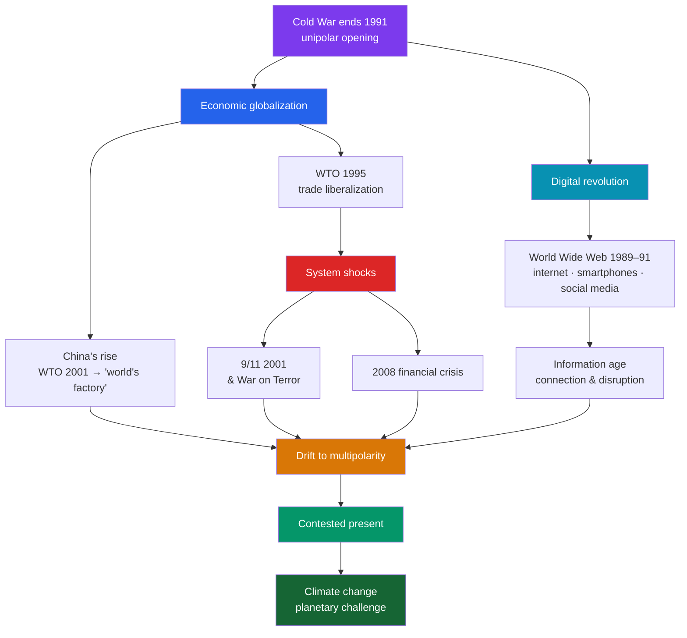

# 🌐 Globalization and the Digital Age

> [!abstract] TL;DR
> The end of the Cold War in 1991 opened a **hyper-connected** era defined by two intertwined forces: economic **globalization** and the **digital revolution**. Capital, goods, and people moved across borders as never before, institutionalized by the **World Trade Organization (1995)** and dramatized by **China's** entry into it in **2001** and its rise to become the world's manufacturing powerhouse. Simultaneously, the **internet** — built on Cold War research and unlocked by Tim Berners-Lee's **World Wide Web (1989–91)** — collapsed distance in information, followed by the smartphone and social media. The optimistic "end of history" mood did not last: the **9/11 attacks (2001)** launched a costly **War on Terror**, the **2008 financial crisis** exposed globalization's fragilities, and the **unipolar moment** gave way to a drift toward **multipolarity** as China rose and Russia reasserted itself. Overshadowing all of it is the **planetary** challenge of **climate change**. The present is globalization's contested, uneven, and increasingly questioned inheritance.

## Intuition — analogy first

Imagine the world's economies as separate ponds, each with its own fish, connected after 1991 by digging **canals** between them. At first the water rushes and everyone benefits: fish (goods, capital, ideas) swim to wherever they thrive, ponds that were poor grow rich (China above all), and a new **nervous system** — the internet — lets every pond sense every other in real time. This is the euphoric 1990s: flat world, borderless commerce, the "end of history."

But canals carry more than fish. They also carry **shocks** and **predators**. A financial contagion in one pond floods them all (2008). A network built to share knowledge also carries misinformation, surveillance, and attack. And crucially, connection does not mean harmony: the biggest fish start competing for the whole system (U.S. and China), while a planetary problem — the water itself heating up (climate change) — affects every pond regardless of borders and can be solved by none alone. **Globalization made the world one system without making it one community.** The digital age gave that system a mind; it did not give it a conscience. Understanding the present means holding both the connection and its discontents in view.

---

## How It Works — The Forces Shaping the Post-1991 World

## Key Concepts

### Globalization After the Cold War

With the socialist alternative discredited, a broadly **market-liberal** model spread worldwide. **Globalization** — the deepening integration of economies, cultures, and communications — accelerated: trade barriers fell, supply chains stretched across continents, multinational firms globalized production, and capital moved at electronic speed. Its intellectual mood was captured by Thomas Friedman's phrase, the world had become **"flat."** The dominant policy consensus — free trade, deregulation, privatization — is often labeled **neoliberalism**, and it reshaped economies from Latin America to the former Soviet bloc, unevenly and often painfully.

### The Digital Revolution and the Internet

The digital age rested on decades of computing and on Cold War networking research (**ARPANET**). The decisive leap was **Tim Berners-Lee's World Wide Web** (proposed 1989, public 1991), which made the internet usable for everyone. A cascade followed: the **dot-com boom** of the late 1990s, ubiquitous mobile phones, the **smartphone** (iPhone, 2007), broadband, cloud computing, and **social media** platforms that reorganized commerce, politics, and daily life. The transformation is analyzed further in [[The_Information_Age]]: information became instant, abundant, and — for better and worse — decentralized.

### Deepening Economic Integration: The WTO and China's Rise

The rules of the new order were institutionalized:
- The **World Trade Organization (WTO)** was founded in **1995**, succeeding the GATT, to arbitrate and liberalize global trade.
- Regional blocs deepened: **NAFTA (1994)** and the **European Union's** single currency, the **euro** (introduced 1999, notes and coins 2002).
- Most consequentially, **China** joined the WTO in **2001** and became the **"world's factory,"** lifting hundreds of millions out of poverty and, within two decades, rising to rival the United States economically — the single largest geopolitical shift of the era.

### 9/11 and the War on Terror

On **11 September 2001**, al-Qaeda hijackers destroyed the World Trade Center and struck the Pentagon, killing nearly **3,000** people. The attacks shattered the post-Cold-War sense of security and launched the U.S.-led **"War on Terror"**: the invasion of **Afghanistan (2001)** to topple the Taliban, and the far more contested invasion of **Iraq (2003)**, justified by claims of weapons of mass destruction that proved unfounded. The wars cost trillions of dollars and hundreds of thousands of lives, strained alliances, and — through mass surveillance and detention controversies — reshaped the relationship between security and civil liberties.

### From Unipolarity Toward a Multipolar World

The **"unipolar moment"** of unrivaled U.S. dominance eroded within a generation:

| Force | Effect on the unipolar order |
|---|---|
| **China's rise** | A peer economic and strategic competitor |
| **Russia's resurgence** | Reassertion in its neighborhood (Georgia 2008, Crimea 2014) |
| **2008 global financial crisis** | Dented the prestige of the Western economic model |
| **Costly Middle East wars** | Sapped U.S. resources and legitimacy |
| **Rising middle powers & blocs** | India, the EU, BRICS diffusing influence |

The result is a drift toward a **multipolar** (or "post-American") world — more distributed, more contested, and without the settled rules the Cold War, for all its dangers, had provided.

### Climate Change and the Planetary Present

Underlying and outlasting these shifts is **climate change** — the warming of the planet from greenhouse-gas emissions, a challenge that is inherently global and cannot be solved by any single state. The scientific consensus was consolidated by the **IPCC** (est. 1988); the international response ran from the **Kyoto Protocol (1997)** to the **Paris Agreement (2015)**, in which nearly every nation pledged to limit warming. Climate is the clearest case of a **collective-action problem** at planetary scale: interconnected enough to affect everyone, yet governed by a fragmented system of sovereign states — the defining tension of the globalized present.

## Primary Sources & Examples

- **Berners-Lee's "Information Management: A Proposal"** (CERN, 1989): the founding document of the World Wide Web — a modest internal memo that reorganized global communication.
- **The 9/11 Commission Report** (2004): the official investigation into the attacks, a primary source on how a networked, non-state threat exposed the assumptions of the post-Cold-War order.
- **The Paris Agreement** (2015): the near-universal treaty text on limiting warming to "well below 2°C" — evidence of both global cooperation and its enforcement gaps.
- **Friedman, *The World Is Flat*** (2005): a widely read (and widely critiqued) statement of the optimistic globalization thesis, useful precisely for what it under-weighted.

## Common Pitfalls / Misconceptions

- **Assuming globalization is new, inevitable, or irreversible.** Earlier waves of globalization (notably before 1914) reversed sharply; the post-2008 rise of **populism, tariffs, and "deglobalization"** shows the trend can stall or retreat.
- **Taking the "flat world" at face value.** Globalization's gains were **highly uneven** — enriching some regions and workers while hollowing out others — fueling the political backlash of the 2010s.
- **Seeing the internet as purely democratizing.** The same network enables **surveillance, disinformation, platform monopolies, and polarization** alongside access and empowerment; techno-optimism of the 1990s badly underestimated the downsides.
- **Confusing the "end of history" with the end of conflict.** 9/11, the 2008 crisis, and great-power competition showed that ideological and geopolitical struggle persisted (see [[Collapse_of_the_Soviet_Union]]).
- **Treating current events as settled history.** The multipolar drift and climate trajectory are **ongoing and contested**; recent history demands humility and balance, not confident verdicts.

## Related Concepts

- [[_MOC_Cold_War_Modern|↑ Section MOC]] — the section hub
- [[Collapse_of_the_Soviet_Union]] — the end of bipolarity that opened this globalized, briefly unipolar era
- [[Decolonization]] — the postcolonial states whose uneven integration into the world economy this era continued
- [[The_Information_Age]] — the deeper history of computing and networks that made the digital revolution possible
- Cross-vault: [[_MOC_Macroeconomics_Master]] — trade integration, financial crises, and the economics of globalization
- Cross-vault: [[_MOC_Networking_Master]] — the internet infrastructure (TCP/IP, the web) that is this era's technical backbone

## Review Questions

1. Identify the main forces of post-Cold-War globalization and explain how economic integration and the digital revolution reinforced each other.
2. How did 9/11 and the 2008 financial crisis each challenge the optimistic "unipolar" and "end of history" narratives of the 1990s?
3. Why is climate change described as a planetary collective-action problem, and what does the gap between the Kyoto and Paris agreements and actual emissions reveal about global governance?

## Sources

- Frieden, J.A. (2006). *Global Capitalism: Its Fall and Rise in the Twentieth Century*. W.W. Norton
- Castells, M. (1996). *The Rise of the Network Society*. Blackwell
- Zakaria, F. (2008). *The Post-American World*. W.W. Norton
- Friedman, T.L. (2005). *The World Is Flat: A Brief History of the Twenty-First Century*. Farrar, Straus and Giroux

#history #globalization #digital-age #multipolarity #war-on-terror #climate-change
