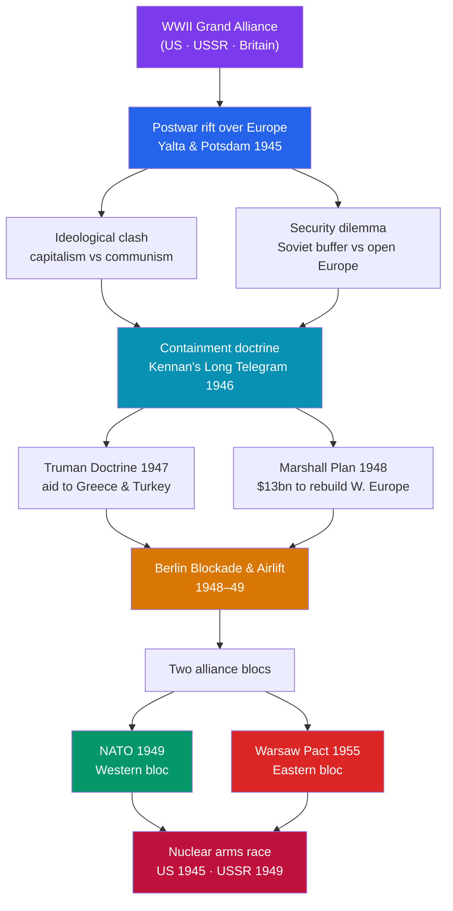

# ❄️ Origins of the Cold War

> [!abstract] TL;DR
> The Cold War was not declared on a single day; it **congealed** out of the wreckage of World War II as the wartime alliance between the United States and the Soviet Union curdled into a **bipolar** standoff. At its core lay a genuine **ideological clash** — liberal capitalism versus Marxist-Leninist communism — sharpened by mutual insecurity over the fate of Europe, above all Germany. Between 1946 and 1949 the rupture became institutional: Churchill named the **"Iron Curtain"** (1946), George Kennan supplied the doctrine of **containment**, the **Truman Doctrine** and **Marshall Plan** committed American power and money to Western Europe, the **Berlin Blockade and Airlift** (1948–49) turned Germany into the front line, and the founding of **NATO** (1949) — answered later by the **Warsaw Pact** (1955) — froze Europe into two armed camps. A parallel **nuclear arms race** made the rivalry existential. Historians still debate who was more to blame; the honest answer is that a security dilemma made each side's defensive moves look aggressive to the other.

## Intuition — analogy first

Imagine two exhausted survivors pulling a third person — a bully who had attacked them both — off a cliff. The moment the common enemy is gone, they are left alone on the ledge, each holding a knife, each remembering that the *other* once cut a deal with the bully (Stalin's 1939 pact with Hitler; the West's delayed second front). Neither wants a fight. But every move one makes to feel safer — grabbing more of the ledge, building a wall, keeping the knife visible — makes the other feel *less* safe, so they grab and wall and brandish in return.

That spiral is the **security dilemma**, and it is the engine of the Cold War's origins. The Soviet Union, invaded twice through Eastern Europe in thirty years, wanted a buffer of friendly states; to Americans that buffer looked like naked expansion. The United States, wanting an open, trading, democratic Europe, offered dollars and alliances; to Moscow that looked like encirclement by capital. Add a **clash of gospels** — two universalist creeds each certain history was on its side — and a **new weapon that could end the world**, and a rivalry becomes a forty-year confrontation neither side quite chose.

---

## How It Works — From Grand Alliance to Two Armed Camps

## Key Concepts

### From Grand Alliance to Bipolarity

At **Yalta** (February 1945) and **Potsdam** (July–August 1945), the Big Three — Roosevelt (then Truman), Stalin, and Churchill (then Attlee) — agreed on paper to free elections in liberated Europe and the joint occupation of Germany. In practice, the Red Army already occupied Eastern Europe, and Stalin installed compliant governments in Poland, Romania, Bulgaria, and Hungary. With Germany and Japan defeated and Britain and France bankrupt, only two powers of the first rank remained: a **bipolar** world had arrived. The mutual trust of the alliance evaporated within eighteen months.

### The Ideological Clash: Capitalism vs. Communism

Each superpower embodied a **universalist creed** that claimed to be the destination of all history:
- **Liberal capitalism** — free markets, private property, representative democracy, and (in the American telling) an open world economy.
- **Marxism-Leninism** — the abolition of private property, a planned economy, one-party rule by the vanguard, and the eventual worldwide victory of the proletariat.

Because each side believed the other's system was destined to collapse and would use any means to spread, ordinary geopolitical friction acquired a **missionary intensity**. Coexistence was possible; genuine reconciliation was not.

### The Iron Curtain and the Long Telegram

Two 1946 texts crystallized the Western reading of Soviet intentions:
- **George Kennan's "Long Telegram"** (February 1946), sent from the Moscow embassy, argued that Soviet hostility was rooted in ideology and internal insecurity, was impervious to reasoned appeal, but was *not* reckless — it could be patiently **contained**. Kennan expanded this into the anonymous **"X" article**, *The Sources of Soviet Conduct*, in *Foreign Affairs* (July 1947).
- **Winston Churchill's "Sinews of Peace"** speech at Fulton, Missouri (5 March 1946) declared that "an iron curtain has descended across the Continent," fixing the image of a divided Europe in the public mind.

### Containment: The Truman Doctrine and Marshall Plan

Containment moved from memo to policy in 1947:
- The **Truman Doctrine** (March 1947) pledged U.S. support to "free peoples" resisting subjugation, prompted by British withdrawal from **Greece and Turkey**. It committed America, in principle, to a global anti-communist role.
- The **Marshall Plan** (European Recovery Program, announced June 1947, enacted 1948) delivered roughly **$13 billion** to rebuild Western Europe — partly humanitarian, partly a hard-headed bet that prosperity would inoculate societies against communism and create markets for U.S. goods. Stalin forbade Eastern Bloc states from joining, hardening the divide.

### Divided Germany: The Berlin Blockade and Airlift (1948–49)

Germany was split into four occupation zones; Berlin, deep inside the Soviet zone, was likewise quartered. When the Western powers merged their zones and introduced a new currency (the Deutsche Mark), Stalin **blockaded West Berlin** (June 1948), cutting road and rail access to starve the Western sectors out. Rather than fight or abandon the city, the West mounted the **Berlin Airlift**, flying in food and coal — at its peak a plane landing roughly every minute — for **eleven months** until Stalin relented (May 1949). The crisis produced two German states in 1949: the **Federal Republic** (West) and the **German Democratic Republic** (East).

### Alliance Blocs: NATO (1949) and the Warsaw Pact (1955)

| | **Western bloc** | **Eastern bloc** |
|---|---|---|
| **Military alliance** | NATO, founded April 1949 (12 members) | Warsaw Pact, founded May 1955 |
| **Trigger** | Berlin crisis; fear of Soviet advance | West German rearmament & NATO entry (1955) |
| **Core principle** | Article 5: attack on one = attack on all | Mutual defense under Soviet command |
| **Economic arm** | Marshall Plan; later the EEC (1957) | Comecon (1949) |
| **Leadership** | United States | Soviet Union |

The sequence matters: **NATO came first (1949); the Warsaw Pact was a response (1955)**, formalizing a Soviet sphere that already existed in fact after West Germany's admission to NATO.

### The Nuclear Arms Race

The United States detonated the first atomic bomb in 1945 (see [[The_Atomic_Age_Begins]]); the Soviet Union broke the U.S. monopoly in **1949**, far sooner than Washington expected, aided by espionage. Both raced to the **hydrogen bomb** (U.S. 1952, USSR 1953) and to delivery systems. The result was a rivalry in which each side's arsenal made the other's survival hostage to deterrence — the logic that would later crystallize as mutually assured destruction (see [[Cold_War_Proxy_Conflicts]]).

## Primary Sources & Examples

- **Kennan's "X" Article** (*Foreign Affairs*, July 1947): the founding statement of containment — "a long-term, patient but firm and vigilant containment of Russian expansive tendencies." Read against the Long Telegram, it shows a strategist who later felt his ideas were **militarized** beyond his intent.
- **Churchill at Fulton (1946):** the Iron Curtain speech, delivered with Truman on the platform, is a case study in how a private diagnosis became public doctrine — and in how Soviet listeners heard it as a call to anti-Soviet alliance.
- **The Airlift as symbol:** the Berlin Airlift converted West Berlin from an isolated liability into the emblem of Western resolve, an image the U.S. would invoke for decades (culminating in Kennedy's 1963 "Ich bin ein Berliner").

## Common Pitfalls / Misconceptions

- **Believing it "began" on a fixed date.** There is no single start. The rupture accumulated from 1945 to 1949 through a chain of moves and countermoves.
- **Assigning sole blame.** The **orthodox** view blames Soviet expansion; the **revisionist** view blames U.S. economic imperialism; the **post-revisionist** synthesis (John Lewis Gaddis) emphasizes a mutual **security dilemma** in which both acted defensively and were misread. Treat single-villain accounts with suspicion.
- **Confusing containment with rollback.** Containment aimed to *check* Soviet expansion, not to *reverse* it by force. Proposals to "roll back" communism were mostly rhetoric; the West did not intervene against the 1953 East German or 1956 Hungarian risings.
- **Reading the Marshall Plan as pure altruism (or pure imperialism).** It was both generous and self-interested — reconstruction that also built markets and a Western bloc.
- **Assuming war was imminent throughout.** For all the tension, Europe's line held; the "long peace" between the superpowers, however dangerous, never became a direct war.

## Related Concepts

- [[_MOC_Cold_War_Modern|↑ Section MOC]] — the section hub
- [[Cold_War_Proxy_Conflicts]] — the bipolar rivalry established here was fought out indirectly in Korea, Vietnam, Cuba, and Afghanistan
- [[Decolonization]] — the same postwar moment that split Europe dismantled its empires, creating a "Third World" both blocs courted
- [[Collapse_of_the_Soviet_Union]] — the arms race and imperial overreach begun here helped exhaust the USSR four decades later
- [[The_Atomic_Age_Begins]] — the weapon that made the origins of the Cold War uniquely dangerous
- Cross-vault: [[_MOC_Game_Theory_Master]] — the security dilemma and deterrence are textbook problems in strategic interaction and signaling

## Review Questions

1. Explain the "security dilemma" and use it to account for why the U.S.–Soviet wartime alliance collapsed even though neither side initially sought war.
2. Trace the escalation from the Long Telegram (1946) through the Marshall Plan (1948) to NATO (1949). At each step, what did one side do and how did the other read it?
3. Distinguish the orthodox, revisionist, and post-revisionist interpretations of who caused the Cold War. Which does the evidence best support, and why?

## Sources

- Gaddis, J.L. (2005). *The Cold War: A New History*. Penguin
- Gaddis, J.L. (1997). *We Now Know: Rethinking Cold War History*. Oxford University Press
- Leffler, M.P. (1992). *A Preponderance of Power: National Security, the Truman Administration, and the Cold War*. Stanford University Press
- Kennan, G.F. ["X"] (1947). "The Sources of Soviet Conduct." *Foreign Affairs*, 25(4)

#history #cold-war #containment #iron-curtain #nato #arms-race
