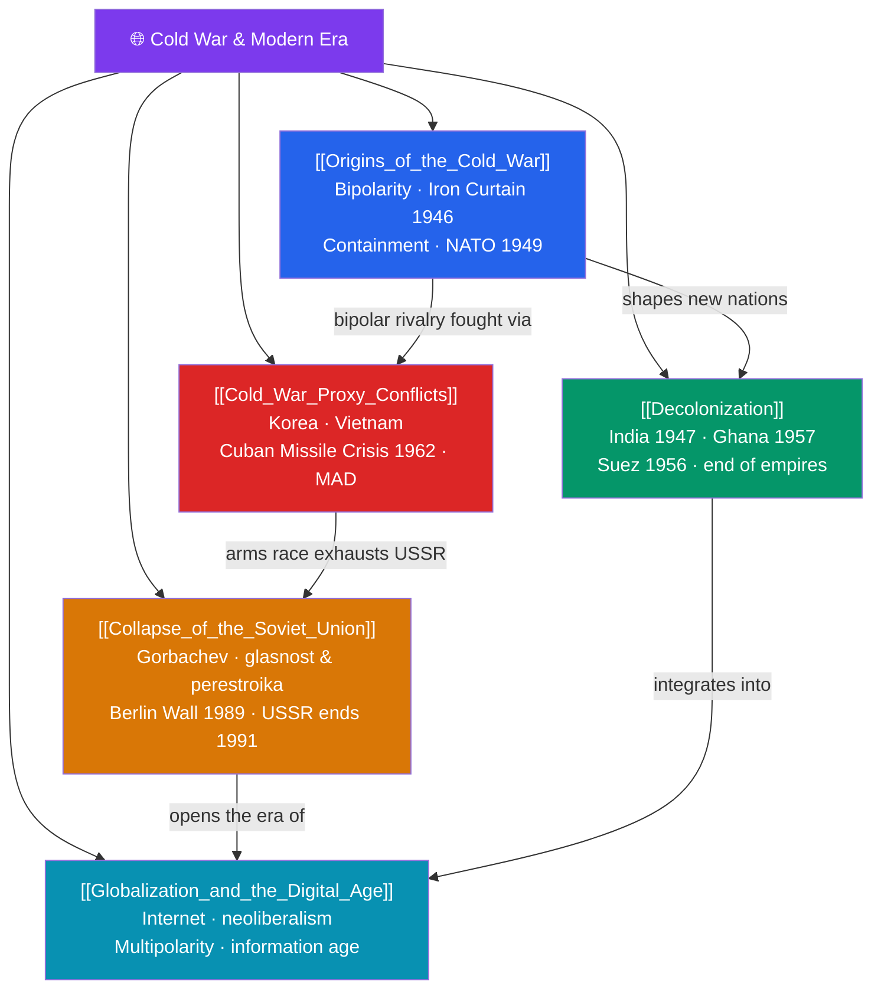

# 🗺️ Cold War & Modern Era — Map of Content

> [!abstract] What This Section Covers
> After 1945 the world reorganized around two superpowers and then, after 1991, around a fluid globalized order. The **origins of the Cold War** saw the wartime alliance dissolve into bipolar rivalry: Churchill's "Iron Curtain," the U.S. policy of containment (the Truman Doctrine and Marshall Plan), and the formation of NATO in 1949. Simultaneously, **decolonization** dismantled European empires — India and Pakistan gained independence in 1947, Ghana led African liberation in 1957, and the Suez crisis of 1956 exposed the twilight of imperial power. The superpower contest played out in **Cold War proxy conflicts** — Korea, Vietnam, the near-catastrophe of the 1962 Cuban Missile Crisis, and a spiraling nuclear arms race governed by mutually assured destruction. The system unravelled with the **collapse of the Soviet Union**: Gorbachev's reforms, the fall of the Berlin Wall in 1989, and the USSR's dissolution in 1991. The era closes with **globalization and the digital age** — the internet, neoliberal economics, and an emerging multipolar world. These notes chart the passage from bipolarity to our interconnected present.

## Concept Map

## Learning Path

1. [[Origins_of_the_Cold_War]] — How the wartime allies became rivals and the bipolar order took shape after 1945.
2. [[Decolonization]] — The dismantling of European empires and the birth of dozens of new nations.
3. [[Cold_War_Proxy_Conflicts]] — Korea, Vietnam, the Cuban Missile Crisis, and the nuclear arms race.
4. [[Collapse_of_the_Soviet_Union]] — Gorbachev's reforms, the revolutions of 1989, and the end of the USSR.
5. [[Globalization_and_the_Digital_Age]] — The interconnected, digital, and multipolar world that emerged after the Cold War.

## All Notes at a Glance

| Note | Difficulty | What You'll Learn |
|------|------------|-------------------|
| [[Origins_of_the_Cold_War]] | Intermediate | Yalta and Potsdam, the Iron Curtain, containment, Truman Doctrine, Marshall Plan, Berlin Blockade, NATO |
| [[Decolonization]] | Intermediate | Indian independence and Partition, African liberation, Suez, non-alignment, legacies of empire |
| [[Cold_War_Proxy_Conflicts]] | Intermediate | Korean and Vietnam Wars, the Cuban Missile Crisis, nuclear deterrence and MAD, détente |
| [[Collapse_of_the_Soviet_Union]] | Intermediate | Glasnost and perestroika, 1989 revolutions, the fall of the Berlin Wall, the 1991 dissolution |
| [[Globalization_and_the_Digital_Age]] | Intermediate | The internet, neoliberalism, global trade, the information revolution, and a multipolar world |

## Key Questions This Section Answers

- Why did the U.S.–Soviet wartime alliance collapse into a decades-long Cold War?
- How and why did European empires dissolve so rapidly after 1945?
- How did the superpowers wage their rivalry without fighting each other directly?
- What combination of factors brought down the Soviet Union between 1989 and 1991?
- How have globalization and the digital revolution reshaped the post-Cold War world?

## Related Sections

- [[_MOC_History_Master|↑ History Master MOC]]
- [[_MOC_World_Wars|← The World Wars]]
- [[_MOC_History_of_Science|→ History of Science & Technology]]

#MOC #History #ColdWarModern
