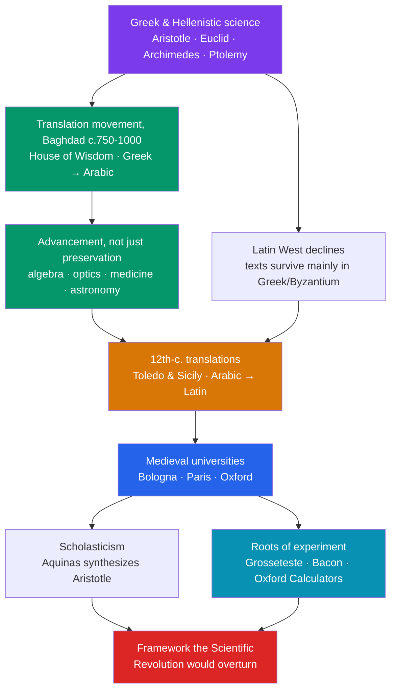

# 🏛️ Ancient and Medieval Science

> [!abstract] TL;DR
> For roughly two thousand years, the framework for understanding nature was built by the **Greeks**, preserved and hugely advanced by the **Islamic world**, and then absorbed by **medieval Christendom**. Greek natural philosophy gave the qualitative physics of **Aristotle**, the mathematical mechanics of **Archimedes**, the axiomatic geometry of **Euclid**, and the geocentric astronomy of **Ptolemy**. When the Roman West decayed, scholars in **Baghdad, Córdoba, and Cairo** translated, corrected, and extended this corpus — inventing algebra, transforming optics into an experimental science, and keeping the flame alive (see [[Islamic_Science_and_Mathematics]]). From the 12th century, translations flowed into Latin Europe, where the new **universities** and **scholasticism** absorbed Aristotle, while figures like Grosseteste, Roger Bacon, and the Oxford Calculators planted the **roots of experiment and quantification**, and **alchemy** built the laboratory toolkit that would become chemistry. This was not merely a "waiting room" before the Scientific Revolution — it was the intellectual world that revolution had to overthrow.

## Intuition — analogy first

Think of pre-modern science as a single **manuscript passed hand to hand across a thousand years**, each keeper adding notes in the margin.

The Greeks wrote the first draft: a confident, mostly *qualitative* account of why heavy things fall, why the heavens are perfect and circular, and how to prove a theorem beyond doubt. Then the Western scriptorium nearly closed — but the manuscript was carried east, where Arabic-speaking scholars did not just recopy it. They **corrected the arithmetic, rewrote whole chapters** (optics, algebra, medicine), and added the marginalia that made it usable. Centuries later the annotated manuscript came back to Europe through Spain and Sicily, and the new universities argued over every line.

The key point: by the time a Copernicus or a Galileo opened the book, it was **not a blank page and not the pristine Greek original** — it was a densely layered, half-corrected inheritance. Understanding what they overturned means reading the whole marginal history first.

---

## How Knowledge Was Transmitted — Athens to the Latin West

## Key Concepts

### Greek Natural Philosophy — the Inherited Framework

Greek thinkers treated nature (*physis*) as intelligible by reason, and produced four pillars that dominated for centuries.

| Figure | Dates | Field | Core contribution |
|---|---|---|---|
| **Aristotle** | 384–322 BCE | Physics, cosmology | *Physics* and *On the Heavens*: four sublunary elements (earth, water, air, fire) each seeking its "natural place," a fifth heavenly **aether**, motion requiring a continuous mover, and **teleology** (final causes). A qualitative, geocentric cosmos of nested spheres. |
| **Euclid** | c. 300 BCE | Geometry | *Elements* (13 books): the **axiomatic-deductive method** — five postulates from which all theorems follow. The model of rigorous proof for ~2,000 years (see [[_MOC_Mathematics_Master]]). |
| **Archimedes** | c. 287–212 BCE | Mechanics, math | Law of the lever, **hydrostatics** ("Eureka" — buoyancy), the **method of exhaustion** (a precursor of integral calculus), and a rigorous bound on π. The most mathematical of the ancients. |
| **Ptolemy** | c. 100–170 CE | Astronomy | The *Almagest*: a geocentric model using **deferents, epicycles, and equants** to predict planetary positions accurately. The standard astronomy until Copernicus. |

Others pushed further: **Eratosthenes** measured the Earth's circumference; **Hipparchus** discovered precession and built trigonometry; **Aristarchus of Samos** even proposed a Sun-centered cosmos — and was rejected on physical and observational grounds.

### The Islamic Golden Age — Preservation *and* Advancement

From the 8th century, the **translation movement** centered on the **House of Wisdom (Bayt al-Hikma)** in Abbasid Baghdad rendered Greek, Persian, and Indian works into Arabic. But the Islamic world did far more than store the texts:
- **Al-Khwarizmi** (c. 780–850) systematized **algebra** (*al-jabr*) and gave us the word **algorithm**.
- **Ibn al-Haytham (Alhazen)** (c. 965–1040), in the *Book of Optics* (c. 1021), corrected Greek theories of vision and insisted on **controlled experiment** — an early articulation of scientific method.
- **Ibn Sina (Avicenna)** wrote the *Canon of Medicine*; **al-Razi (Rhazes)** advanced chemistry and clinical medicine; **al-Biruni** and **Nasir al-Din al-Tusi** (Maragheh observatory) refined astronomy.

This tradition is treated in depth in [[Islamic_Science_and_Mathematics]].

### Medieval Universities and Scholasticism

From the 12th century, translations flowed into Latin Europe via **Toledo** (Gerard of Cremona) and Norman **Sicily**. The recovery of Aristotle coincided with a new institution: the **university** — **Bologna (1088), Paris (c. 1150), Oxford (c. 1096)** — teaching the *trivium* and *quadrivium*.

**Scholasticism** applied rigorous dialectic (the *quaestio* and *disputatio*) to reconcile reason with faith. **Thomas Aquinas** (1225–1274), in the *Summa Theologica*, synthesized Aristotelian philosophy with Christian theology, embedding Aristotle at the heart of the curriculum — which is precisely why later challenges to Aristotle were also challenges to authority.

### The Roots of Experiment and Quantification

Contrary to the "Dark Ages" cliché, medieval scholars planted genuine methodological seeds:
- **Robert Grosseteste** (c. 1175–1253) and **Roger Bacon** (c. 1220–1292) at Oxford stressed **mathematics and observation** in a *scientia experimentalis*.
- The **Oxford Calculators** (Merton College, 14th c.) proved the **mean speed theorem**, quantifying motion.
- **Jean Buridan** developed **impetus theory** — a forerunner of the concept of inertia — and **Nicole Oresme** graphed velocity against time.

### Alchemy as Proto-Chemistry

**Alchemy** pursued impossible goals — the transmutation of base metals into gold, the *philosopher's stone* — yet in doing so it built the empirical **toolkit of chemistry**: distillation, sublimation, and crystallization, and apparatus like the **alembic** (from Arabic *al-anbiq*). Much of chemistry's vocabulary — *alcohol, alkali, elixir* — is Arabic, a fossil record of alchemy's transmission from figures like **Jabir ibn Hayyan (Geber)** into European practice.

## Primary Sources & Examples

- **Euclid's *Elements* (c. 300 BCE):** the longest-used textbook in history, printed continuously from 1482 into the 20th century; its deductive structure became the template for how a "science" should look.
- **Ptolemy's *Almagest* (c. 150 CE):** its predictive success is why geocentrism was so hard to dislodge — it *worked* to observational precision for over a millennium.
- **Ibn al-Haytham's *Book of Optics* (c. 1021):** darkened-room (camera obscura) experiments on light and vision, cited as a landmark in the emergence of experimental method.
- **Toledo translations (12th c.):** Gerard of Cremona alone rendered ~70 works from Arabic into Latin, the pipeline through which Aristotle and Ptolemy re-entered Europe.

## Common Pitfalls / Misconceptions

- **"The medieval period was a scientific void."** The "Dark Ages" label is a Renaissance polemic; universities, logic, optics, and the mathematics of motion all advanced, if slowly.
- **"Islamic scholars only preserved Greek science."** They corrected and extended it — algebra, optics, and astronomy were transformed, not merely copied.
- **"Greek science was experimental like ours."** Mostly it was *observational and deductive*; systematic controlled experiment is a later development to which Alhazen and Bacon only pointed.
- **"Aristotle was simply wrong, so it was worthless."** Aristotelian physics is internally coherent and matches everyday experience; it took new instruments and mathematics — not mere cleverness — to replace it.
- **"Alchemy was pure superstition."** Its goals were misguided, but its laboratory techniques and apparatus are the direct ancestors of chemistry.

## Related Concepts

- [[_MOC_History_of_Science|↑ Section MOC]] — the section hub
- [[The_Copernican_Revolution]] — the overthrow of the Ptolemaic-Aristotelian cosmos this note describes
- [[Islamic_Science_and_Mathematics]] — the deep dive on the tradition that preserved and advanced Greek science
- [[The_Scientific_Revolution]] — the 16th–17th-century break with the inherited framework
- Cross-vault: [[_MOC_Mathematics_Master]] — Euclid's axiomatic geometry and al-Khwarizmi's algebra as the mathematical spine of pre-modern science

## Review Questions

1. Name the four principal Greek contributors covered here and state the single field each is most associated with.
2. In what concrete senses did the Islamic world *advance* rather than merely *preserve* Greek science? Give two examples.
3. Explain why alchemy is called "proto-chemistry" despite its false goals, and name two techniques or pieces of apparatus it bequeathed to chemistry.

## Sources

- Lindberg, D.C. (2007). *The Beginnings of Western Science* (2nd ed.). University of Chicago Press
- Grant, E. (1996). *The Foundations of Modern Science in the Middle Ages*. Cambridge University Press
- Al-Khalili, J. (2010). *Pathfinders: The Golden Age of Arabic Science*. Allen Lane
- Principe, L.M. (2013). *The Secrets of Alchemy*. University of Chicago Press

#history #historyofscience #antiquity #medieval #islamic-science #scholasticism #alchemy
