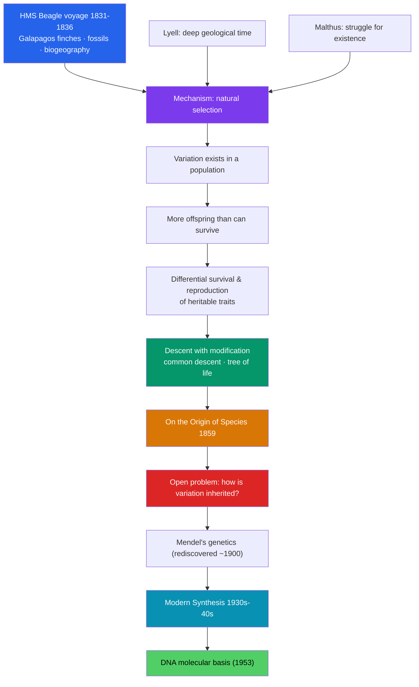

# 🧬 Darwin and Evolution

> [!abstract] TL;DR
> **Charles Darwin's** theory of **evolution by natural selection** did for life what Newton did for the heavens: it explained the apparent design of the living world by a single natural mechanism, with **no need for a designer**. The five-year voyage of **HMS *Beagle*** (1831–1836) gave Darwin the observations; **Malthus** and **Lyell** gave him the ideas of struggle and deep time; and *On the Origin of Species* (**1859**) gave the world **common descent** — all life branching from shared ancestors. The theory ignited fierce religious and scientific controversy, and it had a gaping hole: **heredity**. That gap was filled by **Mendel's** genetics (rediscovered ~1900) and welded to Darwinism in the **modern synthesis** of the 1930s–40s, later grounded molecularly by **DNA**. Biology was transformed from natural history into a unified, mechanistic science — and humanity's view of its own place in nature was permanently altered.

## Intuition — analogy first

Picture a **breeder of pigeons** who, over generations, keeps only the birds with the fanciest tails, and slowly conjures a whole new variety. Everyone in Darwin's day understood *artificial* selection — humans shaping animals by choosing who breeds.

Darwin's leap was to ask: **what if nature does the choosing?** No breeder is needed if the environment itself is the selector. More offspring are born than can survive; they vary; and the ones whose variations happen to help them eat, escape, and reproduce leave more descendants. Do this for thousands of generations and you get not a fancier pigeon but a **new species** — an eye, a wing, a whale — assembled with no plan and no planner, just **variation filtered by survival**.

The unsettling part is the reach of the idea. If it works for finches and barnacles, it works for us. The same blind process that shaped the orchid shaped the human hand and, eventually, the human mind (see [[_MOC_Psychology_Master]]).

---

## How Natural Selection Works — and How It Was Completed

## Key Concepts

### The Voyage of the *Beagle* (1831–1836)

As unpaid naturalist aboard **HMS *Beagle*** under Captain FitzRoy, **Charles Darwin** (1809–1882) spent five years observing geology and life across South America and the Pacific. The **Galápagos** finches, mockingbirds, and giant tortoises — subtly different island to island — and fossils of extinct giant mammals planted the puzzle of how species change and diversify. Reading **Charles Lyell's** *Principles of Geology* (deep time, gradual change) on the voyage, and **Thomas Malthus's** *Essay on the Principle of Population* (populations outrun resources) afterward, supplied the conceptual tools.

### The Mechanism: Natural Selection

Natural selection needs only a few ingredients, each individually mundane:

| Ingredient | What it means |
|---|---|
| **Variation** | Individuals in a population differ in their traits. |
| **Heredity** | Offspring tend to resemble their parents. |
| **Overproduction** | More young are born than the environment can support. |
| **Differential survival** | Traits that aid survival and reproduction become more common over generations. |

The cumulative result is **descent with modification** — later popularized with Herbert Spencer's phrase "survival of the fittest." Notably, **Alfred Russel Wallace** independently hit on the same mechanism, prompting a **joint Darwin–Wallace paper** at the Linnean Society in **1858**.

### *On the Origin of Species* (1859) and Common Descent

Published on 24 November **1859** (the first printing sold out immediately), *On the Origin of Species* argued that all organisms descend, through branching lineages, from **common ancestors** — the **tree of life**. Darwin deliberately said little about humans there; he addressed our own origins later in *The Descent of Man* (1871), introducing **sexual selection**.

### Reception and Controversy

The theory struck at natural theology's "argument from design" and at humanity's special status. The famous **1860 Oxford debate** pitted **Thomas Henry Huxley** ("Darwin's bulldog") against Bishop **Samuel Wilberforce**. Beyond religion, scientists raised a serious objection Darwin could not answer: **blending inheritance** seemed to dilute any new advantage away. Without a correct theory of heredity, the late-19th-century "eclipse of Darwinism" set in.

### Mendel, Genetics, and the Modern Synthesis

Unknown to Darwin, **Gregor Mendel** (1822–1884), an Augustinian friar, had worked out the laws of **particulate inheritance** in pea plants (published 1866) — genes that segregate without blending. His work was ignored until **rediscovered around 1900**. In the 1930s–40s the **modern synthesis** fused Darwinian selection with Mendelian genetics and mathematical **population genetics** (**R.A. Fisher, J.B.S. Haldane, Sewall Wright**), articulated by **Theodosius Dobzhansky** (*Genetics and the Origin of Species*, 1937), **Ernst Mayr**, and **Julian Huxley** (*Evolution: The Modern Synthesis*, 1942). **Watson and Crick's** DNA structure (1953) later gave the whole framework its molecular foundation.

### How Biology Was Transformed

Evolution turned biology from descriptive natural history into a **unified explanatory science**, giving every field — anatomy, ecology, medicine, genomics — a common causal thread. As Dobzhansky wrote in 1973, "Nothing in biology makes sense except in the light of evolution."

## Primary Sources & Examples

- **Darwin, *On the Origin of Species* (1859):** the argument built patiently from artificial selection to natural selection; the single diagram (the branching tree) is the book's only figure.
- **The Darwin–Wallace paper (1858):** the joint Linnean Society reading that established priority and the mechanism.
- **Mendel, "Experiments on Plant Hybridization" (1866):** the quantitative pea-plant ratios that founded genetics, neglected for 34 years.
- **The Galápagos finches:** varied beak shapes matched to food sources, later a textbook case of adaptation (and, in the Grants' modern fieldwork, of selection observed in real time).

## Common Pitfalls / Misconceptions

- **"Evolution is 'just a theory' / mere chance."** Selection is the *opposite* of chance: it is the non-random survival of variants. "Theory" here means a well-tested explanatory framework, not a guess.
- **"Survival of the fittest means the strongest."** "Fitness" means reproductive success in a given environment — often cooperation, camouflage, or fertility, not brute strength.
- **"Darwin explained the origin of life."** He explained the *diversification and adaptation* of existing life, not its ultimate chemical origin.
- **"Darwin knew about genes."** He had no correct theory of heredity; that was the theory's central weakness until Mendel's rediscovery.
- **"Evolution implies inevitable progress toward humans."** It has no goal or ladder; it is a branching bush, and humans are one twig, not its summit.

## Related Concepts

- [[_MOC_History_of_Science|↑ Section MOC]] — the section hub
- [[Newton_and_the_Mechanical_Universe]] — the model of a single natural law that Darwin extended from matter to life
- [[The_Modern_Physics_Revolution]] — the parallel early-20th-century overturning of certainty in the physical sciences
- [[The_Information_Age]] — DNA as a *code*, linking evolution to information and computation
- Cross-vault: [[_MOC_Psychology_Master]] — evolutionary thought as the basis of instinct, behavior, and evolutionary psychology

## Review Questions

1. List the ingredients natural selection requires and explain why *heredity* was the theory's most damaging missing piece in 1859.
2. What does "common descent" mean, and what single image did Darwin use to convey it?
3. Describe the modern synthesis: which two bodies of work did it fuse, and roughly when?

## Sources

- Darwin, C. (1859). *On the Origin of Species*. John Murray
- Browne, J. (1995, 2002). *Charles Darwin* (2 vols.). Jonathan Cape
- Bowler, P.J. (2003). *Evolution: The History of an Idea* (3rd ed.). University of California Press
- Mayr, E. (1982). *The Growth of Biological Thought*. Harvard University Press

#history #historyofscience #biology #evolution #natural-selection #genetics #darwin
