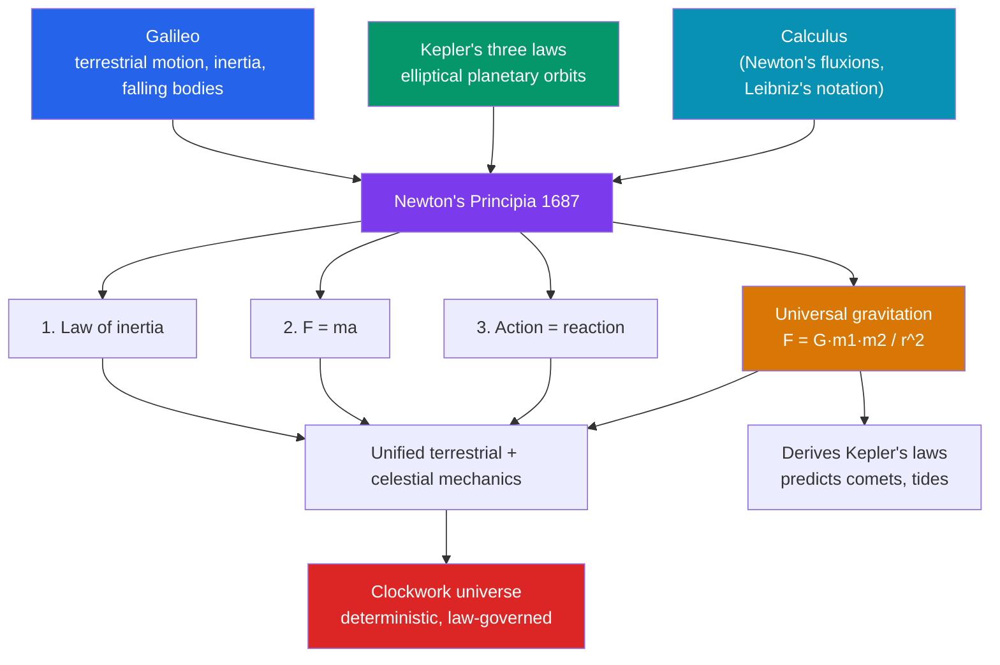

# 🍎 Newton and the Mechanical Universe

> [!abstract] TL;DR
> In the *Principia* (1687), **Isaac Newton** completed the Copernican revolution by showing that a **single set of mathematical laws governs both the falling apple and the orbiting Moon**. His **three laws of motion** and the law of **universal gravitation** unified terrestrial and celestial physics, and from them he *derived* Kepler's planetary laws — the first great **synthesis** of modern science. To do the physics he (independently of **Leibniz**) invented the **calculus**. The result was the image of a **clockwork universe**: a deterministic cosmos of matter in motion, running by exact law, whose future is in principle calculable. This Newtonian worldview defined what "science" meant for roughly two centuries, until relativity and quantum mechanics revised its foundations.

## Intuition — analogy first

Before Newton, people had **two separate rulebooks**: one for how things behave *down here* (apples fall, cannonballs arc) and another for *up there* (planets glide in eternal curves). They seemed like different worlds — the earthly and the heavenly.

Newton's radical claim was that there is **only one rulebook**. Throw a ball harder and it lands farther; throw it hard enough and the Earth curves away beneath it as fast as it falls — so it never lands. That is an **orbit**: the Moon is simply a projectile "falling around" the Earth forever, obeying the *same* gravity that drops the apple. Once you accept that a single force with a single formula (weaken with the square of distance) reaches from your hand to the planets, the sky stops being a separate realm and becomes **the same physics, farther away**.

The universe, on this view, is a vast machine — and if you know the parts and the laws, you can *calculate* what it will do next. That is the clockwork.

---

## How the Synthesis Fits Together

## Key Concepts

### The *Principia* (1687)

**Isaac Newton** (1642–1727) published *Philosophiæ Naturalis Principia Mathematica* in 1687, prodded and financed by **Edmond Halley**. Written in austere geometric style, it laid out a complete system of mechanics from a handful of axioms — arguably the most influential scientific book ever printed. Much of its content grew from Newton's plague-year *annus mirabilis* (c. 1665–1666), when the young scholar sketched gravitation, optics, and the calculus.

### The Three Laws of Motion

| Law | Statement | Everyday illustration |
|---|---|---|
| **1. Inertia** | A body stays at rest or in uniform straight-line motion unless acted on by a net force. | A puck glides across ice until friction stops it. |
| **2. F = ma** | The net force equals mass times acceleration (the rate of change of momentum). | The same push accelerates a shopping cart more than a loaded truck. |
| **3. Action–reaction** | Every action has an equal and opposite reaction. | A rocket is thrust forward by expelling gas backward. |

### Universal Gravitation

Newton's masterstroke was **universal gravitation**: every mass attracts every other with a force

**F = G · m₁ · m₂ / r²**

proportional to the product of the masses and inversely proportional to the *square* of the distance. The same law that governs a falling apple holds the Moon in orbit and shapes the tides. From it Newton **mathematically derived Kepler's three laws** (see [[The_Copernican_Revolution]]), explained the tides, and — via Halley — predicted the **return of a comet** (1758). Prediction, not just description, became the hallmark of physics (see [[_MOC_Physics_Master]]).

### The Invention of Calculus

To handle continuously changing quantities — velocity, acceleration, area under a curve — Newton developed the **calculus** (his "method of fluxions," c. 1666). **Gottfried Wilhelm Leibniz** invented it independently and published first (1684), with the superior **dⁿ/dx and ∫ notation** still used today. A bitter **priority dispute** followed, but both are rightly credited. Calculus became the mathematical language of physics (see [[_MOC_Mathematics_Master]]).

### The Clockwork Universe and the Newtonian Synthesis

Newtonian mechanics suggested a **deterministic, mechanical cosmos**: matter moving by fixed law, its future in principle fully calculable from its present. **Pierre-Simon Laplace** later dramatized this with his "demon," an intellect that, knowing all positions and forces, could compute the entire future. Culturally it fed **Deism** — God as a "clockmaker" who set the mechanism running. This **Newtonian synthesis** was so successful it *defined* science for two centuries, until [[The_Modern_Physics_Revolution]] revised its assumptions about absolute space, time, and determinism.

## Primary Sources & Examples

- **Newton, *Principia* (1687):** the three laws and gravitation, with the geometric derivation of Kepler's laws — the template for mathematical physical theory.
- **Newton, *Opticks* (1704):** prism experiments splitting white light into the spectrum; written in accessible English, it modeled experimental reporting.
- **Halley's Comet (predicted 1705, returned 1758):** the vindicating prediction that turned gravitation from hypothesis into public triumph.
- **The Newton–Leibniz correspondence and the 1712 Royal Society report:** primary evidence in the calculus priority dispute.

## Common Pitfalls / Misconceptions

- **"Newton discovered gravity when an apple hit his head."** He did not "discover gravity"; the apple anecdote (told by Newton himself) illustrates the *insight that the same force reaches the Moon* — its universality.
- **"Newton alone invented calculus."** Leibniz developed it independently and published first; modern notation is largely his.
- **"Newton's laws are simply wrong now."** They remain superbly accurate for everyday and engineering scales; relativity and quantum theory *refine and bound* them, not erase them.
- **"The Principia was purely modern and rational."** Newton spent enormous effort on alchemy and biblical chronology; his science emerged from a very early-modern mind.
- **"Determinism was proven true."** The clockwork picture is an *interpretation* Newtonian mechanics invited; quantum mechanics later undercut strict determinism.

## Related Concepts

- [[_MOC_History_of_Science|↑ Section MOC]] — the section hub
- [[The_Copernican_Revolution]] — Kepler's laws and Galileo's motion are the inputs Newton unified and explained
- [[The_Modern_Physics_Revolution]] — relativity and quantum theory that revised the Newtonian synthesis two centuries on
- [[The_Scientific_Revolution]] — the broader movement Newton's synthesis is often taken to crown
- Cross-vault: [[_MOC_Physics_Master]] — classical mechanics and gravitation as living physics
- Cross-vault: [[_MOC_Mathematics_Master]] — the calculus Newton and Leibniz created to do this physics

## Review Questions

1. State Newton's three laws of motion and give a concrete example of each.
2. Write the law of universal gravitation and explain what "universal" adds beyond a rule for falling bodies — how does it unify heaven and Earth?
3. Summarize the Newton–Leibniz calculus dispute: what did each contribute, and why are both credited?

## Sources

- Westfall, R.S. (1980). *Never at Rest: A Biography of Isaac Newton*. Cambridge University Press
- Cohen, I.B. & Whitman, A. (trans.) (1999). *The Principia: Mathematical Principles of Natural Philosophy*. University of California Press
- Gleick, J. (2003). *Isaac Newton*. Pantheon
- Hall, A.R. (1980). *Philosophers at War: The Quarrel between Newton and Leibniz*. Cambridge University Press

#history #historyofscience #physics #newton #gravitation #calculus #clockwork-universe
