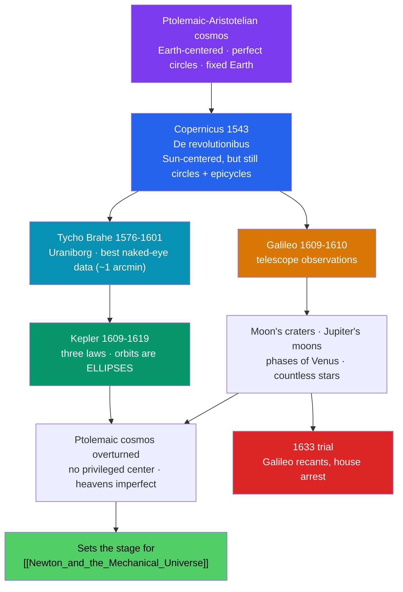

# ☀️ The Copernican Revolution

> [!abstract] TL;DR
> Between 1543 and 1633, astronomers moved the **Earth from the center of the universe** and set it in motion around the Sun — a shift so profound it renamed the whole idea of a "revolution." **Copernicus** revived heliocentrism in *De revolutionibus* (1543); **Tycho Brahe** gathered the most precise naked-eye data ever taken; **Kepler** used that data to discover that planets move in **ellipses**, not perfect circles, formulating his **three laws**; and **Galileo**, through the new **telescope**, saw mountains on the Moon, moons around Jupiter, and the phases of Venus — evidence that shattered the Ptolemaic-Aristotelian cosmos and led to his **1633 trial** by the Inquisition. What collapsed was not just a diagram of the heavens but the whole picture of a finite, hierarchical universe with humanity at its unmoving hub.

## Intuition — analogy first

Imagine you have spent your whole life certain that **the platform you stand on is fixed and the train outside is moving** — until one day you notice it is the other way around.

For two millennia, the everyday evidence was overwhelming: the ground feels still, and the Sun, Moon, and stars visibly wheel overhead. Ptolemy's geocentric model *predicted their positions beautifully*, so why doubt it? The Copernican move was to say: what if the "motion" you see in the sky is the reflection of **your own platform turning and orbiting**? Suddenly the daily spin of the heavens is really the Earth's rotation, and the strange loops planets make (retrograde motion) are just what you see when a faster inner runner overtakes a slower outer one on a curved track.

The revolution was hard not because the math was harder — early on it was not — but because accepting it meant giving up the felt certainty that *here is the center and everything moves around me*.

---

## How the Case Was Built — Copernicus to Galileo

## Key Concepts

### Copernicus and *De revolutionibus* (1543)

**Nicolaus Copernicus** (1473–1543), a Polish canon and astronomer, revived the ancient heliocentric idea in *De revolutionibus orbium coelestium*, published in the year of his death. Placing the **Sun near the center** elegantly explained the daily motion of the sky (Earth's rotation) and planetary **retrograde motion** (Earth overtaking outer planets). Crucially, though, Copernicus **kept perfect circles and epicycles**, so his system was not actually simpler or more accurate than Ptolemy's. A cautious anonymous preface by **Andreas Osiander** framed the book as a mere calculational device, blunting its controversy for decades.

### Tycho Brahe — the Data Engine

**Tycho Brahe** (1546–1601), a Danish nobleman, built the **Uraniborg** observatory on the island of Hven and made the most precise **pre-telescopic** measurements in history — accurate to about **one arcminute**. Tycho himself favored a hybrid **geo-heliocentric** model (planets circle the Sun, the Sun circles a central Earth). His true legacy was his data, which passed to his assistant Kepler and made the next breakthrough possible.

### Kepler's Three Laws of Planetary Motion

**Johannes Kepler** (1571–1630) analyzed Tycho's Mars observations and, after years of failed circular fits, made the decisive break: planetary orbits are **ellipses**.

| Law | Year / Work | Statement |
|---|---|---|
| **1. Ellipses** | 1609, *Astronomia nova* | Each planet moves in an ellipse with the Sun at **one focus** — abandoning perfect circles. |
| **2. Equal areas** | 1609, *Astronomia nova* | The line from Sun to planet sweeps out **equal areas in equal times** — planets move faster near the Sun. |
| **3. Harmonic law** | 1619, *Harmonices Mundi* | The **square of the orbital period** is proportional to the **cube of the semi-major axis** (T² ∝ a³). |

These laws made heliocentrism genuinely more accurate than Ptolemy and gave Newton the empirical targets his gravitation would later explain (see [[_MOC_Physics_Master]]).

### Galileo — the Telescope and the Trial

**Galileo Galilei** (1564–1642) turned the newly invented **telescope** to the sky in 1609–1610 and reported his findings in *Sidereus Nuncius* (*Starry Messenger*, 1610):
- **Craters and mountains on the Moon** — the heavens are not perfect and smooth.
- **Four moons of Jupiter** — bodies orbit something *other than the Earth*.
- **The phases of Venus** — a full cycle only possible if Venus orbits the Sun, directly refuting the pure Ptolemaic model.

Galileo's outspoken advocacy collided with the Church. After a 1616 admonition and the 1632 *Dialogue Concerning the Two Chief World Systems*, the **Roman Inquisition tried him in 1633**, forcing him to recant and placing him under house arrest until his death. The apocryphal "*Eppur si muove*" ("and yet it moves") captures the moment's symbolism.

### What Actually Collapsed

The revolution dissolved more than a diagram:
- the **crystalline spheres** and the sharp division between a corruptible Earth and perfect heavens;
- the idea of a **privileged center** and a finite, hierarchical cosmos;
- the assumption that **celestial and terrestrial physics differ** — clearing the ground for Newton's unification.

Thomas Kuhn's *The Copernican Revolution* (1957) treats this as the archetype of a scientific **paradigm shift**.

## Primary Sources & Examples

- **Copernicus, *De revolutionibus* (1543):** the founding text; note that its actual predictive edge over Ptolemy was slight until Kepler reformed the orbits.
- **Kepler, *Astronomia nova* (1609):** documents the painstaking, failure-strewn path to the ellipse — a rare window into real scientific reasoning.
- **Galileo, *Sidereus Nuncius* (1610):** the first published telescopic astronomy, with Galileo's own sketches of the Moon and Jupiter's moons.
- **The 1633 Inquisition sentence:** a primary document in the long history of the science-and-authority relationship (Galileo was formally "rehabilitated" by the Vatican only in 1992).

## Common Pitfalls / Misconceptions

- **"Copernicus's model was immediately simpler and more accurate."** It was not; still tied to circles and epicycles, it matched Ptolemy roughly until Kepler introduced ellipses.
- **"Galileo proved heliocentrism single-handedly with the telescope."** His observations refuted *pure* geocentrism but were also consistent with Tycho's hybrid model; full proof came later (e.g., stellar aberration, 1727; stellar parallax, 1838).
- **"The trial was simply religion versus science."** It was also entangled in Galileo's personal politics, the Thirty Years' War context, and Counter-Reformation authority over biblical interpretation.
- **"Kepler and Copernicus agreed on circular orbits."** Kepler's ellipses were a radical break *from* Copernicus's circles.
- **"Everyone resisted for irrational reasons."** Absent a felt Earth-motion and (until 1838) any detected stellar parallax, geocentrism was a *reasonable* reading of the available evidence.

## Related Concepts

- [[_MOC_History_of_Science|↑ Section MOC]] — the section hub
- [[Ancient_and_Medieval_Science]] — the Ptolemaic-Aristotelian cosmos that this revolution overturned
- [[Newton_and_the_Mechanical_Universe]] — Newton's gravitation would *explain* Kepler's laws and complete the revolution
- [[The_Scientific_Revolution]] — the broader 16th–17th-century transformation of which this is the astronomical core
- Cross-vault: [[_MOC_Physics_Master]] — orbital mechanics, gravitation, and the physics behind Kepler's laws

## Review Questions

1. State Kepler's three laws in your own words, and explain how the first breaks with both Ptolemy and Copernicus.
2. List three of Galileo's telescopic observations and say precisely what each one undermined in the old cosmology.
3. Why was heliocentrism *reasonably* resisted given the evidence available before the 18th century? Name at least one observation that would eventually have settled it.

## Sources

- Kuhn, T.S. (1957). *The Copernican Revolution*. Harvard University Press
- Koestler, A. (1959). *The Sleepwalkers*. Hutchinson
- Gingerich, O. (2004). *The Book Nobody Read: Chasing the Revolutions of Nicolaus Copernicus*. Walker
- Heilbron, J.L. (2010). *Galileo*. Oxford University Press

#history #historyofscience #astronomy #heliocentrism #kepler #galileo #copernicus
