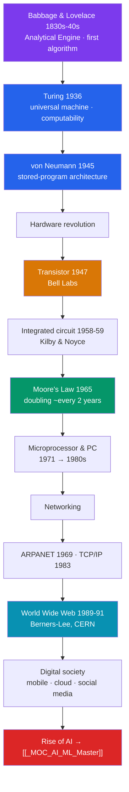

# 💻 The Information Age

> [!abstract] TL;DR
> In under a century, **information** became the defining resource of civilization. The theory came first: **Babbage and Lovelace** imagined a programmable machine in the 1830s–40s, **Turing** defined computation itself in 1936, and **von Neumann** fixed the **stored-program architecture** (1945) nearly all computers still use. The hardware then exploded — the **transistor** (1947), the **integrated circuit** (1958), and **Moore's Law** (1965) drove relentless miniaturization from room-sized machines to the microprocessor and personal computer. Networking them produced **ARPANET** (1969), the **internet** (TCP/IP), and **Berners-Lee's World Wide Web** (1989–91). The result is a **digital transformation** of work, commerce, and communication — globalized, always-on, and now increasingly driven by **artificial intelligence** (see [[_MOC_AI_ML_Master]]).

## Intuition — analogy first

Every earlier revolution in this section changed what we knew about **matter, motion, or life**. The Information Age changed how we handle a fourth thing: **symbols**.

Think of the difference between a **water mill** and a **player piano**. The mill amplifies muscle — it moves stuff. The player piano does something stranger: a roll of punched paper *tells the machine what to do*, and by swapping the roll you get a different tune from the *same* hardware. That separation of the **instructions** from the **machine** is the whole idea. Turing proved that one suitably designed machine, fed the right "roll" (a program), could imitate *any* other — a **universal machine**. Once you can encode words, images, money, and even DNA as strings of symbols, a single kind of device can store, copy, transmit, and transform *all of them*.

The Information Age is what happens when that universal symbol-processor gets small enough, cheap enough, and connected enough to sit in every pocket on Earth.

---

## How the Information Age Was Built — Theory to Network to AI

## Key Concepts

### The Theoretical Foundations

Long before working computers, the *idea* was in place:
- **Charles Babbage** (1791–1871) designed the **Difference Engine** and the general-purpose **Analytical Engine** — a mechanical computer (never completed) with a "mill" (processor) and "store" (memory).
- **Ada Lovelace** (1815–1852), in her 1843 notes, wrote what is often called the **first computer program** (an algorithm for Bernoulli numbers) and foresaw that such a machine could manipulate *any* symbols, not just numbers — including music.
- **Alan Turing** (1912–1954), in "On Computable Numbers" (1936), defined the **Turing machine**, proved the limits of computation (the **halting problem**), and described the **universal machine** — the theoretical stored-program computer. During WWII he helped break the German **Enigma** cipher at Bletchley Park, and in 1950 proposed the **Turing test** for machine intelligence.
- **John von Neumann** described the **stored-program (von Neumann) architecture** in the 1945 EDVAC report — a CPU and a single memory holding *both* data and instructions — the blueprint of almost every computer since (see [[_MOC_Computer_Architecture_Master]]).

### From Vacuum Tubes to Microchips

Early electronic computers — **Colossus** (1943), **ENIAC** (1945), the **Manchester Baby** (first stored-program machine, 1948) — filled rooms with fragile vacuum tubes. Three inventions shrank them relentlessly:

| Milestone | Year | Who | Significance |
|---|---|---|---|
| **Transistor** | 1947 | Bardeen, Brattain, Shockley (Bell Labs) | A tiny, reliable, low-power switch replacing the vacuum tube. |
| **Integrated circuit** | 1958–59 | Jack Kilby (TI), Robert Noyce (Fairchild) | Many transistors fabricated on a single chip. |
| **Moore's Law** | 1965 | Gordon Moore | Observation that transistor count per chip **doubles roughly every two years** — the engine of exponential progress. |

Miniaturization produced the **microprocessor** (Intel **4004**, 1971) and then the **personal computer** — the Altair 8800 (1975), Apple II (1977), and IBM PC (1981) — putting computing on the desktop.

### Networking the World: ARPANET to the Web

- **ARPANET** sent its first message in **1969**; **Vinton Cerf** and **Robert Kahn** designed **TCP/IP**, adopted in **1983**, creating an "internet" of interconnected networks.
- **Tim Berners-Lee**, at **CERN** in **1989–1991**, invented the **World Wide Web** — HTTP, HTML, URLs, and the first browser — turning the internet into a universally accessible information space.
- The **smartphone** (iPhone, 2007), **cloud computing**, and **social media** then made the network mobile, always-on, and social.

### The Digital Transformation and the Rise of AI

Cheap computation and universal connectivity reorganized economies and daily life — commerce, media, money, and labor all became **digital and global** (see [[Globalization_and_the_Digital_Age]]). The newest phase is **artificial intelligence**: from the symbolic AI launched at the 1956 **Dartmouth** workshop, through statistical **machine learning**, to the **deep learning** breakthrough (AlexNet, 2012) and the **transformer**-based large language models of the 2010s–2020s (see [[_MOC_AI_ML_Master]]). Information, once scarce and slow, is now the abundant raw material that intelligent systems refine.

## Primary Sources & Examples

- **Lovelace's Notes on the Analytical Engine (1843):** especially "Note G," the algorithm cited as the first published computer program.
- **Turing, "On Computable Numbers" (1936):** the paper that defined computation and the universal machine.
- **The First Draft of a Report on the EDVAC (von Neumann, 1945):** the document that named the stored-program architecture.
- **Moore, "Cramming More Components onto Integrated Circuits" (*Electronics*, 1965):** the four-page article that became "Moore's Law."
- **Berners-Lee's 1989 proposal ("Information Management: A Proposal"):** the memo, famously annotated "vague but exciting," that launched the Web.

## Common Pitfalls / Misconceptions

- **"The computer was invented by one person / in one place."** It emerged from many hands — Babbage, Lovelace, Turing, von Neumann, and teams at Bell Labs, Manchester, and Pennsylvania.
- **"Moore's Law is a law of physics."** It is an empirical, economic trend in the semiconductor industry — a self-fulfilling roadmap that is now slowing as devices approach atomic scales.
- **"The internet and the Web are the same thing."** The **internet** is the underlying network (1960s–80s); the **Web** (1989–91) is one application running on top of it.
- **"AI is brand new."** The field dates to the 1950s; the recent surge reflects data, compute, and algorithmic advances, not a first invention.
- **"Digital technology is immaterial."** It rests on physical chips, cables, and vast, energy-hungry data centers, and on the quantum physics of semiconductors (see [[The_Modern_Physics_Revolution]]).

## Related Concepts

- [[_MOC_History_of_Science|↑ Section MOC]] — the section hub
- [[The_Modern_Physics_Revolution]] — the quantum physics of semiconductors that made the transistor possible
- [[Darwin_and_Evolution]] — DNA as a *code*, connecting biology to the concept of information
- [[Newton_and_the_Mechanical_Universe]] — the "clockwork" deterministic ideal that mechanical and digital computing literalize
- Cross-vault: [[_MOC_AI_ML_Master]] — the machine learning and AI that now drive the information economy
- Cross-vault: [[_MOC_Computer_Architecture_Master]] — the von Neumann architecture and hardware that realize computation
- Cross-vault: [[Globalization_and_the_Digital_Age]] — the social and economic transformation this technology produced

## Review Questions

1. Explain what a "universal machine" is (Turing) and why the separation of program from hardware is the conceptual core of the Information Age.
2. Name the transistor, the integrated circuit, and Moore's Law, and describe how each contributed to miniaturization.
3. Distinguish the internet from the World Wide Web, giving the key date and inventor(s) for each.

## Sources

- Isaacson, W. (2014). *The Innovators*. Simon & Schuster
- Ceruzzi, P.E. (2003). *A History of Modern Computing* (2nd ed.). MIT Press
- Hodges, A. (1983). *Alan Turing: The Enigma*. Burnett Books
- Berners-Lee, T. (1999). *Weaving the Web*. Harper

#history #historyofscience #computing #internet #turing #digital-age #artificial-intelligence
