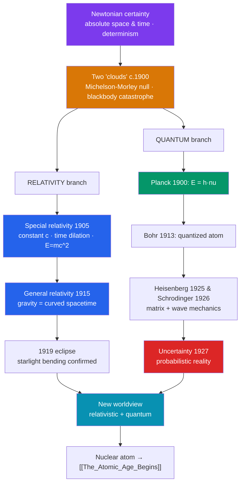

# ⚛️ The Modern Physics Revolution

> [!abstract] TL;DR
> Between roughly **1900 and 1930**, physics tore up the confident, deterministic **Newtonian picture** it had trusted for two centuries. **Einstein's special relativity** (1905) made space and time relative and welded them into spacetime, with **E = mc²**; **general relativity** (1915) recast **gravity as curved spacetime**, confirmed by the bending of starlight in **1919**. In parallel, the **quantum revolution** — **Planck's** quantized energy (1900), **Bohr's** atom (1913), **Heisenberg's** uncertainty (1927), and **Schrödinger's** wave equation (1926) — replaced certainty with **probability** and a strange, discontinuous microworld. Together with the new **nuclear model of the atom** (Rutherford, 1911), these theories redrew reality at the largest and smallest scales, and set the stage for nuclear energy (see [[The_Atomic_Age_Begins]]) and the electronics of the digital age.

## Intuition — analogy first

Newton's universe was like a **perfectly machined pocket watch**: absolute time ticking the same everywhere, particles on definite paths, the whole future computable if you knew the parts. For 200 years the watch kept flawless time.

Then two cracks appeared. First, light refused to behave: no matter how fast you chase a light beam, it always recedes at the *same* speed — as if the watch's second hand looked the same whether you stood still or sprinted. To fix this, Einstein had to let **time itself run at different rates** for different observers. Second, when physicists looked *inside* the atom, the smooth machinery dissolved into **grainy, jumpy, probabilistic** behavior — energy comes in packets, an electron has no definite orbit, and the best you can state is the *odds* of finding it here or there.

The lesson of modern physics is humbling: the clockwork was an excellent approximation for the human-scale world, but reality at very high speeds, very large masses, and very small sizes plays by rules that **defy common sense** — and yet are confirmed to staggering precision.

---

## How Classical Physics Split Into Two Revolutions

## Key Concepts

### The Cracks in Classical Physics

By 1900 two anomalies — Lord Kelvin's "two clouds" — resisted Newtonian explanation: the **Michelson–Morley experiment** (1887) found no luminiferous aether and no change in the speed of light with the Earth's motion, and **blackbody radiation** produced the "ultraviolet catastrophe," where classical theory absurdly predicted infinite energy. Each crack opened a revolution.

### Einstein's Relativity (1905, 1915)

In his 1905 *annus mirabilis*, **Albert Einstein** (1879–1955) published on the photoelectric effect, Brownian motion, and **special relativity**. Special relativity's postulates — the laws of physics are the same for all inertial observers, and the **speed of light is constant** — force **time dilation**, **length contraction**, the **relativity of simultaneity**, and the mass–energy equivalence **E = mc²**.

In **1915**, **general relativity** reconceived **gravity not as a force but as the curvature of spacetime** produced by mass and energy. Its early triumphs — explaining the anomalous precession of Mercury's perihelion and, via **Arthur Eddington's 1919 eclipse expedition**, the predicted **bending of starlight** — made Einstein globally famous. Later confirmations include gravitational redshift, black holes, and **gravitational waves** (detected 2015).

### The Quantum Revolution

| Year | Figure | Breakthrough |
|---|---|---|
| **1900** | **Max Planck** | Energy is **quantized** in packets, E = hν, introducing the quantum of action *h*. |
| **1905** | **Einstein** | Light itself comes in quanta (photons), explaining the photoelectric effect. |
| **1913** | **Niels Bohr** | Atom with **quantized electron orbits**, explaining the hydrogen spectrum. |
| **1924** | **Louis de Broglie** | Matter has **wave** properties — wave–particle duality. |
| **1925** | **Werner Heisenberg** | **Matrix mechanics**; in 1927, the **Uncertainty Principle** (Δx·Δp ≥ ℏ/2). |
| **1926** | **Erwin Schrödinger** | **Wave mechanics** and the wave function ψ; **Max Born** reads |ψ|² as probability. |

The resulting **Copenhagen interpretation** (Bohr, Heisenberg) made **probability**, not certainty, fundamental. Einstein famously dissented — "God does not play dice" — and pressed the **EPR paradox** (1935), launching debates about reality and entanglement that continue today (see [[_MOC_Physics_Master]]).

### The New Atomic Model

The atom was rebuilt in the same era: **J.J. Thomson** discovered the electron (1897); **Ernest Rutherford's** gold-foil experiment revealed a tiny dense **nucleus** (1911); **Bohr** quantized its orbits (1913); and **James Chadwick** found the **neutron** (1932). This nuclear picture, joined to quantum mechanics, explained chemistry and opened the door to **nuclear fission** and the atomic age.

## Primary Sources & Examples

- **Einstein, "On the Electrodynamics of Moving Bodies" (1905):** the special relativity paper, remarkable for citing almost no prior literature.
- **Eddington's 1919 eclipse results:** measurements of starlight deflection near the Sun, reported to the Royal Society — a public confirmation of general relativity.
- **The 1927 Solvay Conference:** the legendary gathering where the quantum "old guard" and "new physics" argued face to face; the group photograph is a who's-who of modern physics.
- **The Bohr–Einstein debates:** documented exchanges over whether quantum mechanics is complete — foundational to later work on entanglement.

## Common Pitfalls / Misconceptions

- **"Relativity means 'everything is relative' / anything goes."** It fixes an absolute — the speed of light — and the laws of physics; only measurements like time and length become observer-dependent.
- **"E = mc² is only about atomic bombs."** It expresses a universal equivalence of mass and energy that operates in stars, particle physics, and even chemical reactions (tinily).
- **"Quantum uncertainty is just measurement clumsiness."** Uncertainty is a fundamental limit on simultaneously definite properties, not merely a technological shortcoming.
- **"Relativity replaced Newton entirely."** Newtonian mechanics is the low-speed, weak-gravity limit of relativity and remains exact enough for engineering.
- **"Quantum weirdness has no real-world use."** It underlies transistors, lasers, MRI, and semiconductors — the basis of modern electronics (see [[The_Information_Age]]).

## Related Concepts

- [[_MOC_History_of_Science|↑ Section MOC]] — the section hub
- [[Newton_and_the_Mechanical_Universe]] — the classical certainty this revolution overturned and generalized
- [[The_Atomic_Age_Begins]] — how the new nuclear physics led to fission, weapons, and reactors
- [[The_Information_Age]] — quantum mechanics as the enabling physics of the transistor and the computer
- Cross-vault: [[_MOC_Physics_Master]] — relativity, quantum mechanics, and atomic structure as living physics

## Review Questions

1. What were the "two clouds" over classical physics around 1900, and which revolution did each provoke?
2. Distinguish special from general relativity in one sentence each, and name one experimental confirmation of each.
3. Why is the Uncertainty Principle a statement about reality rather than about clumsy instruments? Reference Heisenberg and the Copenhagen interpretation.

## Sources

- Kuhn, T.S. (1962). *The Structure of Scientific Revolutions*. University of Chicago Press
- Pais, A. (1982). *Subtle Is the Lord: The Science and the Life of Albert Einstein*. Oxford University Press
- Kumar, M. (2008). *Quantum: Einstein, Bohr, and the Great Debate about the Nature of Reality*. Icon Books
- Isaacson, W. (2007). *Einstein: His Life and Universe*. Simon & Schuster

#history #historyofscience #physics #relativity #quantum-mechanics #einstein #atom
