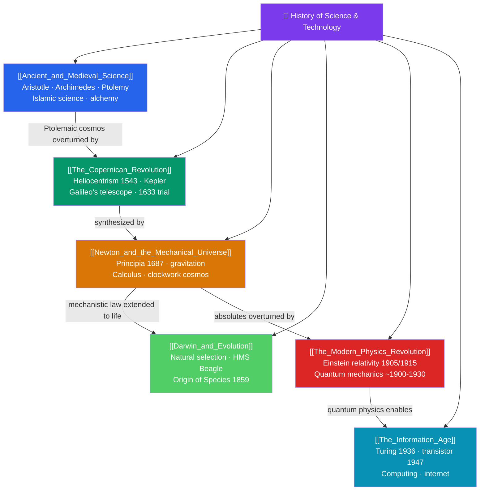

# 🗺️ History of Science & Technology — Map of Content

> [!abstract] What This Section Covers
> This section follows the long arc by which humanity learned to understand and remake the natural world. **Ancient and medieval science** — Greek natural philosophy from Aristotle to Archimedes and Ptolemy, the great Islamic scientific tradition, and medieval alchemy and scholasticism — built the inherited framework. The **Copernican Revolution** shattered the Earth-centered cosmos: Copernicus's heliocentrism (1543), Kepler's laws of planetary motion, and Galileo's telescope and 1633 trial. **Newton and the mechanical universe** then unified the heavens and Earth in the *Principia* (1687), with laws of motion, universal gravitation, and the calculus, portraying a clockwork cosmos. **Darwin and evolution** extended natural law to life itself, with the theory of natural selection in *On the Origin of Species* (1859). The **modern physics revolution** of c. 1900–1930 — Einstein's relativity and the quantum mechanics of Planck, Bohr, and Heisenberg — overturned Newtonian certainties. Finally, the **Information Age** — Turing's theory of computation, the transistor, and the internet — made information the defining resource of our time.

## Concept Map

## Learning Path

1. [[Ancient_and_Medieval_Science]] — Greek natural philosophy, Islamic science, and medieval learning that framed later inquiry.
2. [[The_Copernican_Revolution]] — The overthrow of the geocentric universe by Copernicus, Kepler, and Galileo.
3. [[Newton_and_the_Mechanical_Universe]] — Newton's synthesis of motion and gravity and the clockwork worldview it produced.
4. [[Darwin_and_Evolution]] — Natural selection and the extension of scientific explanation to the living world.
5. [[The_Modern_Physics_Revolution]] — Relativity and quantum mechanics, and the collapse of Newtonian certainty.
6. [[The_Information_Age]] — Computation, the transistor, and the digital networks that define modern life.

## All Notes at a Glance

| Note | Difficulty | What You'll Learn |
|------|------------|-------------------|
| [[Ancient_and_Medieval_Science]] | Intermediate | Aristotelian physics, Archimedes, Ptolemaic astronomy, Islamic science, alchemy, scholasticism |
| [[The_Copernican_Revolution]] | Intermediate | Heliocentrism, Kepler's three laws, Galileo's observations and trial, the end of the geocentric cosmos |
| [[Newton_and_the_Mechanical_Universe]] | Intermediate → Advanced | Laws of motion, universal gravitation, calculus, the Principia, the mechanistic worldview |
| [[Darwin_and_Evolution]] | Intermediate | Natural selection, the voyage of the Beagle, Origin of Species, common descent, its impact |
| [[The_Modern_Physics_Revolution]] | Advanced | Special and general relativity, quantum theory, Planck/Bohr/Heisenberg/Schrödinger, uncertainty |
| [[The_Information_Age]] | Intermediate | Turing and computability, the transistor, the computer, ARPANET and the internet, digital society |

## Key Questions This Section Answers

- How did ancient and medieval thinkers explain the natural world before modern science?
- Why was the shift from a geocentric to a heliocentric cosmos so revolutionary and so contested?
- How did Newton unify terrestrial and celestial motion into a single system of laws?
- Why did Darwin's theory of evolution transform not just biology but humanity's self-understanding?
- How did relativity, quantum mechanics, and computing reshape science and society in the 20th century?

## Related Sections

- [[_MOC_History_Master|↑ History Master MOC]]
- [[_MOC_Cold_War_Modern|← Cold War & Modern Era]]
- [[_MOC_Economic_Social_History|→ Economic & Social History]]
- Cross-vault: [[_MOC_Physics_Master]] — the physics behind Copernicus, Newton, and the modern revolution
- Cross-vault: [[_MOC_Mathematics_Master]] — calculus, and the mathematics underpinning the scientific revolution

#MOC #History #HistoryOfScience
