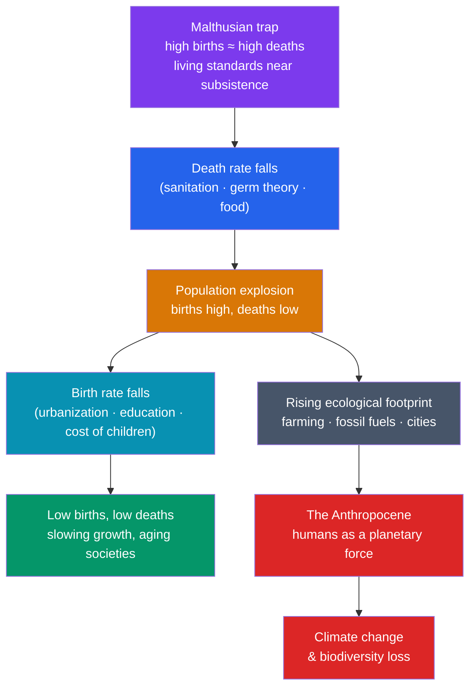

# 🌍 Demographic and Environmental History

> [!abstract] TL;DR
> For almost all of human existence, population was trapped: any gain in food was eaten up by more mouths, so living standards stayed near subsistence — the **"Malthusian trap"** named for **Thomas Malthus** (1798). Then, in barely two centuries, humanity broke out. The **demographic transition** — falling death rates (from the public-health and germ-theory revolutions) followed by falling birth rates — powered a **population explosion** from roughly **1 billion in 1800 to 8 billion today**. **Environmental history**, pioneered by scholars like **Alfred Crosby** and **William Cronon**, studies the reciprocal relationship: how climate and ecology shaped human societies (the Little Ice Age, harvest failures) and how humans have remade the planet — clearing forests, driving extinctions, and now altering the climate itself. That transformation is so profound that scientists propose a new geological epoch, the **Anthropocene**: the age when humanity became a planetary force.

## Intuition — analogy first

Imagine a jar of yeast with a fixed amount of sugar. The yeast multiplies happily — until it presses against the limit of its food, and then starvation, not restraint, halts the growth. For most of history, **human populations behaved like that yeast**. A better harvest or a new crop let numbers rise, but more people meant less food per head, until famine, disease, or war pushed the population back down. Living standards barely improved across millennia because gains were converted into **more people, not richer people**. That is the Malthusian trap.

Then something unprecedented happened. Two forces intervened. First, the **death rate collapsed** — sanitation, germ theory, and later antibiotics meant far more children survived. For a while births still ran high while deaths had fallen, so the population *exploded*. Then, as societies urbanized and children became a cost rather than farm labor, **birth rates fell too**, and growth slowed. That two-stage shift is the demographic transition, and it let humanity escape the yeast-jar for the first time.

But escaping one limit revealed another. Eight billion people, industrialized and hungry for energy, now press against the **planet's** limits rather than the local harvest's. The very same ingenuity that broke the Malthusian trap — fossil fuels, intensive farming — is reshaping the atmosphere and biosphere. The story of demographic history flows directly into the story of environmental history: we escaped the small jar and moved into a bigger one.

---

## How It Works — The Demographic Transition and Its Planetary Costs

## Key Concepts

### Malthus and the Malthusian Trap

In *An Essay on the Principle of Population* (**1798**), the Reverend **Thomas Malthus** argued that population, unchecked, grows **geometrically** (1, 2, 4, 8…) while food supply grows only **arithmetically** (1, 2, 3, 4…). The mismatch means population is always driven back to the limit of subsistence by "positive checks" (famine, disease, war) and "preventive checks" (delayed marriage). The **Malthusian trap** describes the resulting pre-industrial condition: technological gains raise population but not long-run living standards. Malthus proved a poor prophet of the *future* — he wrote just as industrialization was about to shatter the trap — but a good describer of the *past*, which for millennia did hover near subsistence.

### The Demographic Transition

The **demographic transition model** describes the shift, stage by stage, that broke the trap:

| Stage | Birth rate | Death rate | Population | Typical era |
|---|---|---|---|---|
| 1. Pre-transition | High | High (volatile) | Stable, low | Most of history |
| 2. Early transition | High | **Falling** | **Rapid growth** | Industrializing societies |
| 3. Late transition | **Falling** | Low | Growth slows | Maturing economies |
| 4. Post-transition | Low | Low | Stable / aging | Modern developed nations |

The decisive event is the **fall in death rates**, driven largely by the public-health and germ-theory revolution (see [[History_of_Disease_and_Medicine]]); the lag before birth rates follow produces the population surge.

### The Population Explosion

Human numbers were roughly **1 billion around 1800**, reached **2 billion by ~1927**, and then accelerated dramatically — **6 billion by 2000** and about **8 billion by 2022**. This 20th-century explosion, concentrated in the developing world as death rates fell faster than birth rates, is among the most consequential facts of modern history, reshaping labor, cities, resource use, and geopolitics. Growth is now decelerating as fertility falls globally, with many countries facing aging and shrinking populations.

### Environmental History as a Field

**Environmental history** emerged in the 1970s–80s to study the two-way relationship between human societies and the natural world. **Alfred Crosby** (*The Columbian Exchange*, 1972; *Ecological Imperialism*, 1986) showed how the transfer of crops, animals, and pathogens (see [[The_Columbian_Exchange]]) drove conquest and remade global ecology. **William Cronon** (*Changes in the Land*, 1983) and **Donald Worster** traced how economies transformed landscapes. The field insists that nature is not a passive backdrop: **climate, soil, and disease are actors** in history, and human activity is a geological-scale force.

### The Anthropocene and Climate in Historical Perspective

Climate has always shaped history — the **Little Ice Age** (~1300–1850) brought harvest failures, famine, and social upheaval, and some historians link the crises of the 17th century to climatic cooling. What is new is the **reverse causation at global scale**: since industrialization, human greenhouse-gas emissions have begun altering the climate itself. Chemist **Paul Crutzen** and biologist **Eugene Stoermer** popularized the term **Anthropocene** (2000) for a proposed new geological epoch defined by humanity's dominance over Earth's systems. Whether or not it is formally ratified, the concept captures the central theme: humans have become the decisive environmental force on the planet.

## Primary Sources & Examples

- **Malthus, *An Essay on the Principle of Population* (1798):** the founding text of demography and the origin of the "Malthusian" idea; still debated as "Malthusian" limits and "neo-Malthusian" fears recur.
- **Paul Ehrlich, *The Population Bomb* (1968):** a neo-Malthusian bestseller predicting mass famine — largely averted by the **Green Revolution**, illustrating both the power and the peril of demographic prophecy.
- **The Keeling Curve (from 1958):** Charles Keeling's continuous record of atmospheric CO₂ at Mauna Loa is the primary empirical evidence for human-driven climate change.
- **Ice cores and tree rings:** paleoclimate proxies let historians correlate events like the Little Ice Age with documented famines and unrest.

## Common Pitfalls / Misconceptions

- **Thinking Malthus was simply "wrong."** He mistimed the escape (industrialization) but accurately described the pre-modern trap; "Malthusian" dynamics still bind in some times and places.
- **Assuming population always grows.** The demographic transition ends in **low fertility**; the 21st-century challenge for many nations is aging and *decline*, not explosion.
- **Treating environment as mere backdrop.** Climate, soil, and disease are **causal agents** in history, not scenery — a core claim of environmental history.
- **Confusing the Anthropocene's science and politics.** The stratigraphic epoch is still formally debated, but the underlying fact — humanity as a planetary-scale force — is not seriously contested.

## Related Concepts

- [[_MOC_Economic_Social_History|↑ Section MOC]] — the section hub
- [[History_of_Disease_and_Medicine]] — the collapse in death rates that triggered the demographic transition came largely from disease control
- [[History_of_Money_and_Trade]] — trade networks moved the crops and animals (the Columbian exchange) that reshaped both populations and ecologies
- [[Social_Movements_and_Human_Rights]] — resource scarcity and inequality are recurring drivers of the social conflicts reform movements address
- Cross-vault: [[The_Neolithic_Revolution]] — the agricultural origins of both population growth and large-scale human environmental impact
- Cross-vault: [[The_Columbian_Exchange]] — the biological and ecological reshaping of the world after 1492

## Review Questions

1. Explain the "Malthusian trap" and why Malthus was, in a sense, both right about the past and wrong about the future.
2. Walk through the stages of the demographic transition. Which change comes first, births or deaths falling, and why does the ordering produce a population explosion?
3. What does environmental history add to conventional political history, and what does the concept of the "Anthropocene" claim about humanity's relationship to the planet?

## Sources

- Malthus, T. (1798). *An Essay on the Principle of Population*. J. Johnson
- Crosby, A.W. (1986). *Ecological Imperialism: The Biological Expansion of Europe, 900–1900*. Cambridge University Press
- McNeill, J.R. (2000). *Something New Under the Sun: An Environmental History of the Twentieth-Century World*. W.W. Norton
- Livi-Bacci, M. (2017). *A Concise History of World Population* (6th ed.). Wiley-Blackwell

#history #demography #environmental-history #malthus #anthropocene #climate
