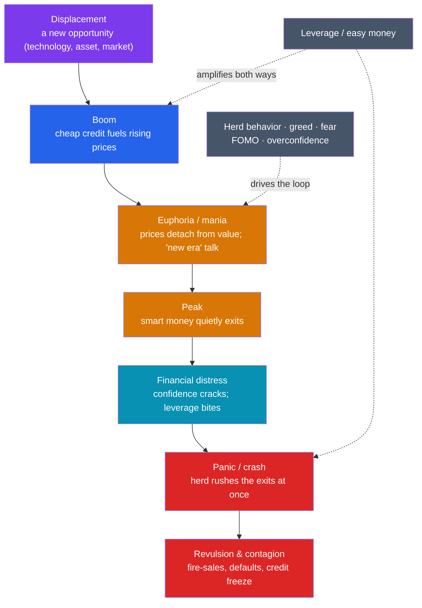

# 📉 Financial History and Crises

> [!abstract] TL;DR
> Financial crises are not random accidents but a **recurring pattern** — manias, panics, and crashes that, in Mark Twain's phrase, "rhyme" across the centuries. From **Tulip Mania (1637)** to the **South Sea Bubble (1720)**, the **Wall Street Crash of 1929**, and the **2008 Global Financial Crisis**, the same script repeats: a plausible new opportunity, easy credit, rising prices that lure ever more buyers, a euphoric peak where price detaches from any underlying value, and then a sudden loss of confidence, a scramble for the exits, and collapse. Economist **Charles Kindleberger** codified this **anatomy of a bubble**, and **Hyman Minsky**'s **"financial instability hypothesis"** explains *why* stability itself breeds the next crisis: long calm periods make lenders and borrowers reckless, until the system is one shock away from collapse. Because the machinery is human — credit, greed, and **herd psychology** — the pattern survives every regulatory "fix."

## Intuition — analogy first

Picture a crowded theater where someone smells smoke. If everyone walks out calmly, all are fine. But the moment enough people **believe others are about to run**, the rational move is to run *first* — and a survivable situation becomes a deadly stampede. Financial crises are stampedes of exactly this kind: what is safe for one person to do (sell before everyone else) becomes catastrophic when everyone does it at once.

The buildup works the same way in reverse. During the boom, watching your neighbor get rich buying tulips, or dot-com stocks, or houses, feels unbearable. So you buy too — not because you've valued the thing carefully, but because **the crowd is moving and you fear being left behind**. Rising prices seem to *prove* the crowd right, which pulls in more buyers, which raises prices further. The logic feeds on itself. This is a **feedback loop powered by human psychology**, not arithmetic.

That is why crises **rhyme**. The specific object changes — tulip bulbs in 1637, internet stocks in 2000, mortgage securities in 2008 — but the underlying machine is the same nervous, imitative human crowd, amplified by credit that lets people bet with borrowed money. You cannot regulate the crowd out of existence, which is why, three centuries after the Dutch tulip trade, the same movie keeps playing with new actors.

---

## How It Works — The Anatomy of a Bubble

## Key Concepts

### Four Crises That Rhyme

| Crisis | Date | The "new opportunity" | How it ended |
|---|---|---|---|
| **Tulip Mania** | 1636–1637 | Rare tulip bulbs in the Dutch Republic; a futures market in bulbs | Prices for single bulbs reached the cost of a house, then collapsed in weeks |
| **South Sea Bubble** | 1720 | Shares in the South Sea Company, promising riches from monopoly trade + government-debt conversion | Share price ~10× in months, then crashed; ruined thousands (Newton among them) |
| **Wall Street Crash** | 1929 | Stocks bought on margin in the Roaring Twenties | Black Thursday/Tuesday; helped trigger the Great Depression (see [[The_Interwar_Years_and_Great_Depression]]) |
| **Global Financial Crisis** | 2007–2009 | US housing + securitized subprime mortgages (MBS, CDOs) | Housing fell, Lehman Brothers failed (2008), near-collapse of the global banking system |

Different objects — bulbs, shares, stocks, mortgages — but the **same shape**: displacement, leveraged boom, euphoria, peak, panic, crash.

### The Anatomy of a Bubble — Kindleberger

Economic historian **Charles Kindleberger**, in *Manias, Panics, and Crashes* (1978), synthesized centuries of episodes into a **stylized life cycle**: (1) **displacement** — an external shock creates a genuinely attractive new opportunity; (2) **boom** — credit expands and prices rise; (3) **euphoria** — speculation detaches prices from fundamentals, often accompanied by "this time is different" and "new era" rhetoric; (4) **crisis/revulsion** — insiders sell, confidence evaporates, and (5) a **panic** and possible contagion follow, sometimes halted only by a **lender of last resort** (a central bank). Kindleberger's point is that crises are **systemic and recurrent**, not the fault of a few bad actors.

### Minsky's Financial Instability Hypothesis

Economist **Hyman Minsky** answered the deeper question: *why* do bubbles keep forming? His **"financial instability hypothesis"** argues that **stability is destabilizing**. During good times, confidence grows and lenders/borrowers take on ever more debt, progressing through three stages:

- **Hedge finance** — income covers both interest and principal (safe).
- **Speculative finance** — income covers interest but not principal; debt must be rolled over.
- **Ponzi finance** — income covers neither; survival depends only on asset prices continuing to rise.

As a boom matures, the system drifts from hedge toward **Ponzi finance**, becoming fragile. Eventually a shock triggers a **"Minsky moment"** — a sudden collapse in asset values as overleveraged players are forced to sell. Crucially, the seeds of the crisis are sown *during* the calm, prosperous years.

### Why They Rhyme — Psychology and Leverage

Two constants make the pattern durable. First, **human psychology**: **herd behavior**, **fear of missing out (FOMO)**, **overconfidence**, and the tendency to extrapolate recent gains into the future are cognitive traits, not historical accidents (see the cross-vault link to cognitive biases below). Second, **leverage**: borrowed money magnifies gains on the way up and losses on the way down, turning a price dip into a cascade of forced selling and defaults. Regulation can dampen specific mechanisms, but as long as credit and crowds exist, the rhyme continues — which is why **Carmen Reinhart and Kenneth Rogoff** titled their crisis history *This Time Is Different* (2009), ironically quoting the phrase uttered before every crash.

## Primary Sources & Examples

- **Charles Mackay, *Extraordinary Popular Delusions and the Madness of Crowds* (1841):** the classic (if partly exaggerated) account of Tulip Mania and the South Sea Bubble; the origin of "madness of crowds."
- **Isaac Newton and the South Sea Bubble:** the great physicist lost a fortune in 1720, reportedly remarking he "could calculate the motions of the heavenly bodies, but not the madness of people" — a vivid case that intelligence is no defense against a mania.
- **John Kenneth Galbraith, *The Great Crash, 1929* (1955):** a narrative anatomy of speculation, margin buying, and denial in the run-up to the crash.
- **The Lehman Brothers bankruptcy (15 September 2008):** the largest bankruptcy in US history and the moment the subprime crisis became a global panic — a modern textbook "Minsky moment."

## Common Pitfalls / Misconceptions

- **"This time is different."** The recurring belief that a new technology or era has repealed the old rules is itself the **classic warning sign** of a bubble, not evidence against one.
- **Blaming crises solely on villains.** Fraud often appears in the wreckage, but Kindleberger and Minsky show the pattern is **systemic** — built into credit and psychology — not merely the work of a few crooks.
- **Thinking regulation ends crises.** Rules can address the *last* crisis's mechanism, but new instruments and the enduring human crowd generate the *next* one; crises evolve rather than disappear.
- **Confusing a bubble's object with its cause.** Tulips, dot-coms, and houses were the *vehicles*; the *engine* is leveraged speculation driven by herd psychology.

## Related Concepts

- [[_MOC_Economic_Social_History|↑ Section MOC]] — the section hub
- [[History_of_Money_and_Trade]] — the credit, banking, and market institutions traced there are the very machinery that bubbles exploit
- [[Demographic_and_Environmental_History]] — like financial systems, populations and ecologies show boom-and-bust dynamics and hard limits
- [[Social_Movements_and_Human_Rights]] — crashes (1929, 2008) trigger mass hardship that fuels labor unrest and political movements
- Cross-vault: [[_MOC_Finance_Master]] — the modern theory of markets, valuation, leverage, and central banking behind these episodes
- Cross-vault: [[_MOC_Psychology_Master]] — the cognitive biases (herd behavior, overconfidence, FOMO, loss aversion) that power every mania and panic
- Cross-vault: [[The_Interwar_Years_and_Great_Depression]] — how the 1929 crash cascaded into the defining economic catastrophe of the 20th century

## Review Questions

1. Lay out Kindleberger's five-stage anatomy of a bubble and map the 2008 Global Financial Crisis onto it.
2. Explain Minsky's financial instability hypothesis, including the hedge → speculative → Ponzi progression. In what sense does *stability* cause the next crisis?
3. Financial crises "rhyme" across four centuries despite completely different assets. Identify the two constant factors that make the pattern recur, and explain why regulation alone cannot eliminate it.

## Sources

- Kindleberger, C.P. & Aliber, R. (1978/2011). *Manias, Panics, and Crashes: A History of Financial Crises*. Palgrave Macmillan
- Minsky, H.P. (1986). *Stabilizing an Unstable Economy*. Yale University Press
- Reinhart, C.M. & Rogoff, K.S. (2009). *This Time Is Different: Eight Centuries of Financial Folly*. Princeton University Press
- Galbraith, J.K. (1955). *The Great Crash, 1929*. Houghton Mifflin

#history #financial-history #bubbles #crises #speculation #minsky
