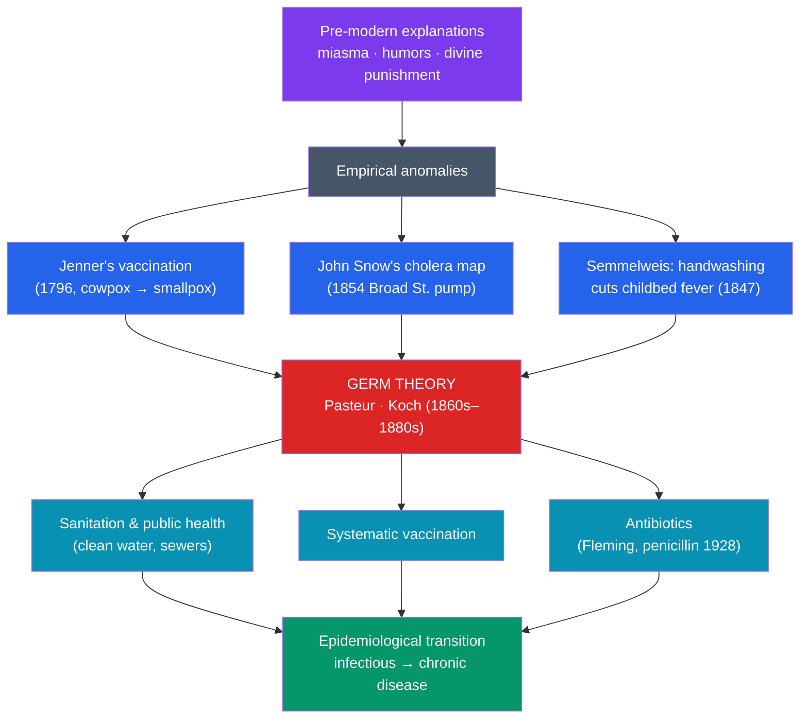

# 🦠 History of Disease and Medicine

> [!abstract] TL;DR
> Epidemics are not footnotes to history — they are **prime movers**. The **Plague of Justinian** (541 CE) and the **Black Death** (1347–1351) each killed a third or more of their populations and reshaped economies and faith; the **Columbian exchange** unleashed a die-off that may have killed **up to 90%** of the indigenous Americas; the **1918 influenza** killed more people than the First World War. For most of that history, medicine was near-powerless because it misunderstood the cause. The **germ theory of disease** — proven by **Louis Pasteur** and **Robert Koch** in the 1860s–1880s — was the hinge: once microbes were known to cause illness, **Edward Jenner**'s earlier vaccination, John Snow's epidemiology, sanitation reform, and eventually **antibiotics** could all be put on a rational footing. The result, captured by the idea of the **epidemiological transition**, was a shift from a world of infectious mass death to one where chronic diseases dominate and human lifespans roughly doubled.

## Intuition — analogy first

Picture a city besieged by an invisible enemy that kills seemingly at random. For millennia, the defenders fought the **wrong war**: they blamed foul-smelling air ("miasma"), divine punishment, or an imbalance of bodily "humors," and so they burned incense, prayed, and bled patients — treatments that did little or actively harmed.

The turning point wasn't a better weapon; it was finally **seeing the enemy**. When Pasteur and Koch proved that specific, invisible **microbes** cause specific diseases, the whole battlefield snapped into focus. Now you could identify the attacker (Koch isolating the anthrax and tuberculosis bacilli), cut its supply lines (clean water severing cholera's route), inoculate the population in advance (vaccines), and later deploy weapons that kill it directly (antibiotics).

The lesson is that **the decisive advance in medicine was conceptual, not merely technical**. For centuries brilliant physicians got worse results than modern nurses, because they had the causal story wrong. Germ theory didn't just add a tool — it rewrote the map of the whole war, and everything from handwashing to public sanitation to the eradication of smallpox flowed from that single corrected idea.

---

## How It Works — From Miasma to Germ Theory to Public Health

## Key Concepts

### Pandemics as Historical Forces

Disease has toppled empires and redirected history as decisively as any war.

| Pandemic | Date | Pathogen | Impact |
|---|---|---|---|
| **Plague of Justinian** | 541–549 CE | *Yersinia pestis* | Killed perhaps a third of the eastern Mediterranean; crippled Justinian's bid to reunify Rome |
| **Black Death** | 1347–1351 | *Yersinia pestis* | Killed ~30–60% of Europe; labor shortages weakened serfdom and raised wages (see [[The_Black_Death]]) |
| **Columbian die-off** | 16th c. onward | Smallpox, measles, influenza | Old World diseases killed up to ~90% of many indigenous American populations, enabling conquest |
| **1918 "Spanish" influenza** | 1918–1920 | H1N1 influenza | ~50 million dead worldwide, more than WWI; struck healthy young adults |

The [[The_Columbian_Exchange|Columbian exchange]] shows disease as an unwitting weapon: the demographic collapse of the Americas owed far more to **imported microbes** against which natives had no immunity than to Spanish steel.

### The Germ Theory of Disease

The reigning theories — **miasma** (disease from "bad air") and the ancient **humoral** system of Hippocrates and Galen — were displaced in a few decades. **Louis Pasteur** disproved spontaneous generation and showed microorganisms cause fermentation and disease (developing pasteurization and vaccines for anthrax and rabies). **Robert Koch** isolated the bacteria causing **anthrax (1876), tuberculosis (1882), and cholera (1883)** and formalized **Koch's postulates** — the logical criteria for proving that a specific microbe causes a specific disease. Germ theory converted medicine from an art of balancing humors into a science of identifiable causes.

### Vaccination

Well before germ theory explained *why* it worked, **Edward Jenner** in **1796** demonstrated that inoculating a boy with **cowpox** protected him against deadly **smallpox** — coining "vaccine" from *vacca* (cow). Jenner's method, later grounded by germ theory and extended by Pasteur, made deliberate immunization possible. Its ultimate triumph was the **global eradication of smallpox**, declared by the WHO in **1980** — the first and still the only human disease driven to extinction.

### Sanitation and Public Health

Even without drugs, **breaking transmission chains** saved millions. In **1854**, physician **John Snow** traced a London cholera outbreak to a single contaminated water pump on **Broad Street**, mapping cases to prove the disease spread through water, not air — a founding act of **epidemiology**. **Edwin Chadwick**'s sanitary reforms and the great Victorian sewer-building programs, and **Ignaz Semmelweis**'s 1847 discovery that **handwashing** slashed deaths from childbed fever, all attacked disease through cleanliness and infrastructure. Public health — clean water, sewers, quarantine, food inspection — arguably extended lifespans more than clinical medicine did.

### Antibiotics and the Epidemiological Transition

**Alexander Fleming**'s chance 1928 observation that *Penicillium* mold killed bacteria led (after Florey and Chain's 1940s development) to **penicillin**, the first mass-produced **antibiotic**, transforming once-lethal infections into curable ones. The cumulative effect of germ theory, vaccination, sanitation, and antibiotics is summarized by **Abdel Omran's** concept of the **epidemiological transition** (1971): societies shift from a regime dominated by **infectious disease and famine** (high, volatile mortality) to one dominated by **chronic and degenerative disease** (heart disease, cancer) as people live long enough to die of old age. This transition underlies the demographic explosion of the modern era (see [[Demographic_and_Environmental_History]]).

## Primary Sources & Examples

- **Thucydides on the Plague of Athens (430 BCE):** one of the earliest clinical descriptions of an epidemic and its social breakdown, written by a survivor.
- **Jenner, *An Inquiry into the Causes and Effects of the Variolae Vaccinae* (1798):** the founding text of vaccination, reporting the cowpox experiments.
- **Snow's cholera map (1854):** his dot-map of deaths clustering around the Broad Street pump is a landmark of both epidemiology and data visualization.
- **Koch's postulates (1884):** the explicit criteria — isolate, culture, reproduce the disease, re-isolate — that set the standard for proving microbial causation.

## Common Pitfalls / Misconceptions

- **Underrating disease as a historical cause.** Battles and treaties fill the textbooks, yet microbes did more to depopulate the Americas or end serfdom than any general.
- **Crediting doctors more than plumbers.** Much of the rise in life expectancy came from **sanitation and clean water**, not clinical treatment; public health is easy to overlook precisely because it *prevents* the disaster.
- **Thinking Jenner "discovered" germ theory.** Jenner's vaccination (1796) *preceded* germ theory by decades; he knew cowpox worked without knowing why. Germ theory (Pasteur, Koch) came later and explained it.
- **Assuming infectious disease is conquered.** Antibiotic resistance, new zoonotic pandemics, and vaccine hesitancy show the transition can stall or reverse; the war is managed, not won.

## Related Concepts

- [[_MOC_Economic_Social_History|↑ Section MOC]] — the section hub
- [[Demographic_and_Environmental_History]] — mortality decline from disease control is the engine of the modern population explosion
- [[History_of_Money_and_Trade]] — the trade networks that moved goods also moved pathogens (plague along the Silk Road, smallpox across the Atlantic)
- [[Social_Movements_and_Human_Rights]] — public health established the principle that the state bears responsibility for population welfare
- Cross-vault: [[The_Black_Death]] — the medieval plague's demographic and social aftershocks in depth
- Cross-vault: [[The_Columbian_Exchange]] — the transfer of Old World disease that devastated the Americas

## Review Questions

1. Explain why the germ theory of disease was a *conceptual* revolution rather than merely a new tool. Name the two scientists most responsible and one disease each isolated or vaccinated against.
2. Jenner's vaccination came decades before germ theory. How is that possible, and what does it reveal about the relationship between practical technique and scientific explanation?
3. Define the epidemiological transition. What kinds of disease dominate before and after it, and which advances (name at least three) drove the shift?

## Sources

- McNeill, W.H. (1976). *Plagues and Peoples*. Anchor Press
- Crosby, A.W. (1972). *The Columbian Exchange: Biological and Cultural Consequences of 1492*. Greenwood
- Omran, A.R. (1971). "The Epidemiologic Transition." *The Milbank Memorial Fund Quarterly*, 49(4)
- Porter, R. (1997). *The Greatest Benefit to Mankind: A Medical History of Humanity*. HarperCollins

#history #medical-history #disease #germ-theory #public-health #epidemiology
