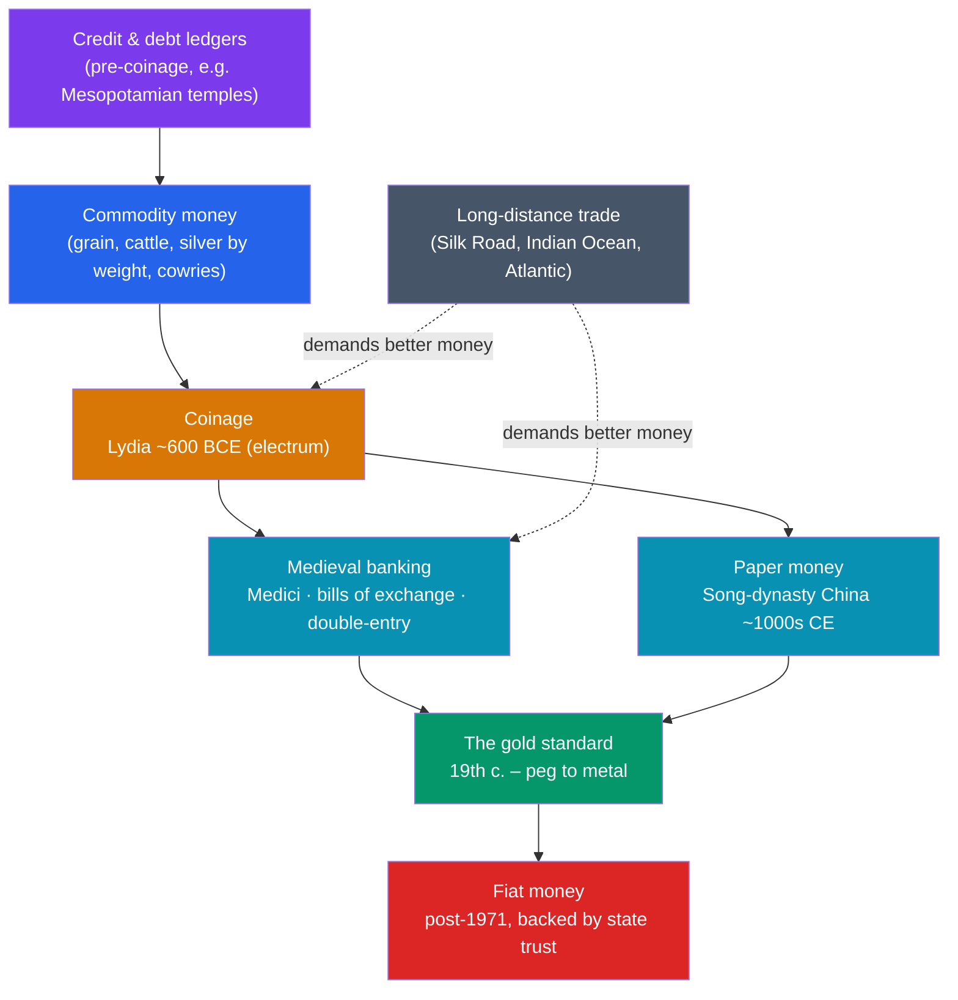

# 💰 History of Money and Trade

> [!abstract] TL;DR
> The textbook story — that people once bartered chickens for shoes, found it clumsy, and *invented* money to fix it — is almost certainly a **myth**. Anthropologist **David Graeber** argued the sequence runs the other way: **credit and debt came first**, recorded as running tabs in temple and village economies, and coined money emerged much later. The first true **coinage** appears in **Lydia around 600 BCE** (stamped electrum), spreading fast because coins let states pay armies and tax markets. Money then evolves in layers: medieval **Italian banking** (the Medici, bills of exchange, double-entry bookkeeping) let value travel without moving gold; **paper money** was pioneered in **Song-dynasty China**; the modern **gold standard** pegged currencies to metal until the 20th century abandoned it for **fiat money** backed only by trust in the state. Trade drove all of it, knitting distant economies into an ever-widening web.

## Intuition — analogy first

Imagine a small village where everyone knows everyone. Your neighbor helps you roof your barn; you don't hand over three goats on the spot — you both simply *remember* that you owe them one. The whole village runs on a mental ledger of favors and obligations. That ledger **is** money in its oldest form: not a coin, but a **record of debt**.

Now the village grows into a city of strangers. You can't remember what you owe a merchant you'll never see again, and they won't trust your memory. So society needs a **portable, impersonal token** everyone will accept — a chunk of stamped metal that says "the bearer is owed this much." Coinage is the moment the private ledger becomes a public, transferable IOU you can hand to anyone.

The popular "barter myth" skips the first scene entirely. It imagines strangers awkwardly swapping goods and inventing coins to grease the deal. But the archaeological and anthropological record suggests the debt-ledger came first, and coins were a *later* solution to a *different* problem — mostly paying soldiers and collecting taxes at scale. Money, in this view, was born from **obligation and the state**, not from the inconvenience of the fish market.

---

## How It Works — The Layered Evolution of Money

## Key Concepts

### The Barter Myth and the Primacy of Credit

Since **Adam Smith**'s *Wealth of Nations* (1776), economics textbooks have opened with a parable: barter is inefficient (the "double coincidence of wants" problem), so people invented money. Anthropologist **David Graeber**, in *Debt: The First 5,000 Years* (2011), pressed a striking objection — **no ethnographer has ever found a functioning barter economy** that later invented money. What the record shows instead are **credit systems**: village tabs, temple accounts, and elaborate debt obligations that long predate coins. Cash barter tends to appear *after* money collapses (e.g. among people who once used coins), not before it. The functions money serves — **medium of exchange, unit of account, store of value** — may have emerged in a different order than the myth implies, with the **unit of account** (a way to measure debt) coming first.

### Commodity Money and the First Coinage

Before coins, value was carried by **commodity money** — things useful or scarce in themselves: cattle (the Latin *pecunia*, money, comes from *pecus*, cattle), grain, salt, cowrie shells, and weighed silver. The leap to **coinage** — standardized metal stamped by an authority to certify weight and purity — is credited to **Lydia** (western Anatolia) around **600 BCE**, using **electrum**, a natural gold-silver alloy; King **Croesus** later issued the first bimetallic gold-and-silver coinage. Coinage spread rapidly through the Greek world because it solved a **state** problem as much as a market one: rulers could pay soldiers uniformly and demand taxes back in the same coin, making money and state power mutually reinforcing.

### Medieval Italian Banking

Medieval commerce faced a hard limit: moving gold across bandit-ridden roads was dangerous. Italian merchant-bankers solved it with **bills of exchange** — a letter promising payment in another city and currency, letting value "travel" as paper while the metal stayed put. Families like the **Bardi** and **Peruzzi** of Florence financed kings (and were ruined when Edward III of England defaulted in the 1340s). The **Medici Bank** (founded 1397) perfected the branch network and, crucially, adopted **double-entry bookkeeping** — recording every transaction as a matched debit and credit — which made large, auditable enterprises possible. These innovations skirted the Church's ban on **usury** through clever pricing of currency exchange.

### Paper Money, the Gold Standard, and Fiat

| Stage | Where / When | Backing | Key Point |
|---|---|---|---|
| **Paper money** | Song-dynasty China (~1000s CE); Europe from the 17th c. | Originally redeemable in metal/goods | State-issued notes; early bouts of over-issue caused inflation |
| **Classical gold standard** | ~1870s–1914 | Fixed weight of gold | Currencies convertible to gold; enabled global trade but constrained policy |
| **Bretton Woods** | 1944–1971 | US dollar pegged to gold; others to the dollar | A gold-*exchange* standard anchoring the postwar order |
| **Fiat money** | After the **1971 "Nixon shock"** | State decree + public trust | Value rests on confidence and legal tender laws, not metal |

**Fiat money** (from Latin *fiat*, "let it be done") has no intrinsic value and no metal backing; it works purely because a government declares it legal tender and people trust it will be accepted tomorrow. This gives states powerful tools (managing the money supply) and powerful temptations (inflation).

### The Long Evolution of Markets

Money and markets co-evolved with **long-distance trade**. The **Silk Road** linked Han China to Rome; the medieval **Indian Ocean** network moved spices, textiles, and silver; the post-1492 **Atlantic economy** fused the hemispheres (see [[The_Columbian_Exchange]]). Each expansion demanded better money and credit, and each is inseparable from the darker ledger of coerced labor and the [[The_Atlantic_Slave_Trade|Atlantic slave trade]]. Markets are not a timeless "natural" state but **historical constructs**, repeatedly built, regulated, and remade by states and merchants.

## Primary Sources & Examples

- **Code of Hammurabi (~1750 BCE):** Babylonian law already fixes prices, interest rates, and debt-forgiveness rules in silver — direct evidence that **debt and credit accounting** predate coinage by over a millennium.
- **The Croeseid:** Lydian gold and silver coins of King Croesus (mid-6th c. BCE) are among the first state-guaranteed bimetallic coins, physically embodying the marriage of money and sovereign authority.
- **Medici account books:** Surviving Medici ledgers demonstrate double-entry bookkeeping in practice — the informational technology that underpins all modern accounting and corporate finance.
- **Marco Polo on Chinese paper money (13th c.):** Polo marveled that the Great Khan made "pure paper" function as money "as if it were gold," astonishing a European used to metal coin.

## Common Pitfalls / Misconceptions

- **"Barter came first, then money."** This tidy sequence is asserted far more often than it is evidenced; the anthropological record points to **credit/debt systems** preceding coinage.
- **Assuming money = coins.** Coins are one *form* of money. For most of history, and again today, most money is **credit** — ledger entries and promises, not metal in a purse.
- **Treating the gold standard as natural or eternal.** The classical gold standard was a brief, roughly 1870s–1914 arrangement, not the default state of money; today's fiat system is historically normal.
- **Seeing markets as pre-political.** Markets require states to define property, enforce contracts, mint or license money, and set weights and measures — they are **built**, not spontaneous.

## Related Concepts

- [[_MOC_Economic_Social_History|↑ Section MOC]] — the section hub
- [[Financial_History_and_Crises]] — once credit and speculation exist, so do bubbles and crashes; this note supplies the monetary foundations they exploit
- [[Social_Movements_and_Human_Rights]] — the labor and abolition questions raised by the commercial economies traced here
- [[Demographic_and_Environmental_History]] — trade networks moved not just goods but people, crops, and disease across continents
- Cross-vault: [[_MOC_Finance_Master]] — the modern theory of money, banking, and markets that this history leads into
- Cross-vault: [[Ancient_Trade_Networks]] — the Silk Road and Indian Ocean systems that pulled money and credit into ever-wider circulation

## Review Questions

1. State the "barter myth" and summarize David Graeber's objection to it. What does the historical evidence suggest actually came first, and why does the distinction matter?
2. Why did coinage emerge and spread when and where it did (Lydia, ~600 BCE)? Explain how the needs of the **state** — not just the market — drove its adoption.
3. Trace the shift from the gold standard to fiat money. What does "fiat" mean, and what does modern money ultimately rest on if not metal?

## Sources

- Graeber, D. (2011). *Debt: The First 5,000 Years*. Melville House
- Ferguson, N. (2008). *The Ascent of Money: A Financial History of the World*. Penguin
- Goetzmann, W.N. (2016). *Money Changes Everything: How Finance Made Civilization Possible*. Princeton University Press
- Davies, G. (2002). *A History of Money: From Ancient Times to the Present Day*. University of Wales Press

#history #economic-history #money #trade #banking #gold-standard
