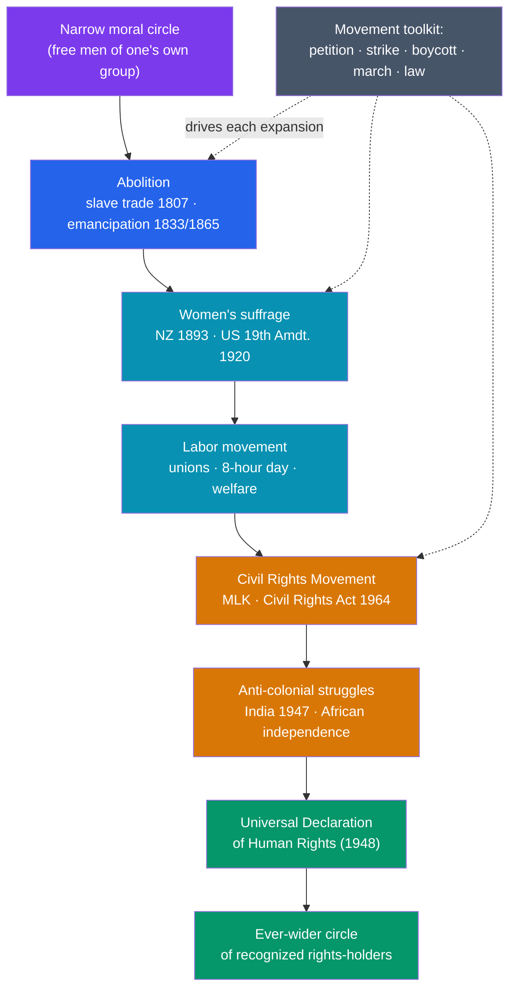

# ✊ Social Movements and Human Rights

> [!abstract] TL;DR
> Rights we now treat as self-evident were **won, not given** — through generations of organized struggle against entrenched power. The **abolition** of slavery (British slave trade banned 1807, empire-wide emancipation 1833; US 13th Amendment 1865) established that no human may be property. **Women's suffrage** (New Zealand first, 1893; US 19th Amendment 1920) and the **labor movement** extended the boundary of who counts as a full member of society. The **US Civil Rights Movement**, led by **Martin Luther King Jr.** and culminating in the **Civil Rights Act of 1964** and Voting Rights Act of 1965, dismantled legal segregation, while **anti-colonial** movements from India to Africa broke European empires. The **Universal Declaration of Human Rights (1948)** made rights a global standard in principle. Philosopher **Peter Singer** calls this long arc the **"expanding circle"** — the steady widening of the community whose interests we are morally bound to respect.

## Intuition — analogy first

Picture a circle drawn around the people whose suffering "counts" — those a society regards as full moral persons deserving protection. For most of history that circle was **small and tightly drawn**: free men of one's own tribe, city, or race. Everyone outside it — the enslaved, women, foreigners, the colonized, the poor — could be exploited without it registering as an injustice.

The history of social movements is the history of **people forcing that circle outward**, usually from the outside. Enslaved people and abolitionists argued the circle must include those in chains. Suffragists insisted it include women. Labor organizers demanded it include workers as more than disposable hands. Colonized peoples claimed it for whole nations. Each expansion was **fiercely resisted** by those inside, because widening the circle meant surrendering privilege — and each was won only through sustained, organized pressure: petitions, strikes, boycotts, marches, and sometimes revolution.

Peter Singer named this the **"expanding circle."** The crucial insight is that moral progress here is not automatic; the circle does not widen on its own. It widens when movements make the excluded **visible** and their exclusion **intolerable** — turning a status quo that once seemed natural into one that seems obviously wrong.

---

## How It Works — The Expanding Circle of Rights

## Key Concepts

### The Abolition of Slavery

The transatlantic slave trade (see [[The_Atlantic_Slave_Trade]]) trafficked over **12 million** Africans and was defended as economically indispensable. Its abolition was one of the first modern moral movements: British campaigners including **William Wilberforce**, **Thomas Clarkson**, and formerly enslaved writers like **Olaudah Equano** built mass petitions, sugar boycotts, and parliamentary pressure. Britain **abolished the slave trade in 1807** and **slavery across its empire in 1833**; the United States ended slavery only through the **Civil War** and the **Thirteenth Amendment (1865)**. Abolition established the foundational human-rights principle that **a person cannot be owned**.

### Women's Suffrage and the Labor Movement

| Movement | Key milestones | Core demand |
|---|---|---|
| **Women's suffrage** | Seneca Falls Convention (1848); **New Zealand** first to grant the national vote (**1893**); UK (1918/1928); US **19th Amendment (1920)** | Political personhood for women |
| **Labor movement** | Trade unions; the fight for the **eight-hour day** (Haymarket, 1886); factory acts; the welfare state | Dignity, safe conditions, and a share of prosperity for workers |

**Women's suffrage** advanced through both persuasion (the American suffragists) and militancy (the British suffragettes' civil disobedience). The **labor movement**, growing out of the Industrial Revolution's harsh factories, used the **strike** as its signature weapon and won the weekend, workplace-safety law, and social insurance — reframing workers as citizens with rights, not merely a cost of production.

### The US Civil Rights Movement

A century after emancipation, Black Americans still faced legal segregation ("Jim Crow") and disenfranchisement. The **Civil Rights Movement** met it with disciplined **nonviolent direct action** — the Montgomery bus boycott (1955–56), lunch-counter sit-ins, and the 1963 March on Washington, where **Martin Luther King Jr.** delivered "I Have a Dream." Drawing on **Gandhian nonviolence**, the movement forced landmark federal law: the **Civil Rights Act of 1964** (banning discrimination in employment and public accommodation) and the **Voting Rights Act of 1965**. It became a template studied and adapted by rights movements worldwide.

### Anti-Colonial Struggles and Decolonization

The same decades saw the **dismantling of European empires**. **Mohandas Gandhi**'s campaigns of *satyagraha* (nonviolent resistance) helped win **Indian independence in 1947**; a wave of African decolonization followed through the 1950s–60s. Anti-colonial movements recast **self-determination** — the right of peoples to govern themselves — as a human right, transforming the map and the membership of the international community.

### The UDHR and the "Expanding Circle"

Reacting to the atrocities of WWII, the newly formed United Nations adopted the **Universal Declaration of Human Rights on 10 December 1948**, drafted by a committee chaired by **Eleanor Roosevelt**. Its 30 articles assert rights "for all members of the human family" regardless of race, sex, or nation — the first global statement of universal rights, later hardened into binding covenants (1966). Philosopher **Peter Singer**'s *The Expanding Circle* (1981) frames this whole history as the progressive enlargement of the moral community — a direction of travel, even where practice still lags far behind the principle.

## Primary Sources & Examples

- **Declaration of the Rights of Man and of the Citizen (1789):** the French Revolution's charter of natural rights — and, in **Olympe de Gouges'** 1791 *Declaration of the Rights of Woman*, an immediate critique of its exclusion of women.
- **Frederick Douglass, "What to the Slave Is the Fourth of July?" (1852):** a formerly enslaved orator turning the nation's founding ideals against its practice of slavery.
- **MLK, "Letter from Birmingham Jail" (1963):** the classic defense of nonviolent civil disobedience against unjust law.
- **Universal Declaration of Human Rights (1948):** the foundational modern text of international human rights; Article 1 opens, "All human beings are born free and equal in dignity and rights."

## Common Pitfalls / Misconceptions

- **Assuming rights were "granted" from above.** Almost every right was **extracted through struggle** by the excluded and their allies, against determined opposition — not gifted by the powerful.
- **Reading progress as inevitable or linear.** The circle has narrowed as well as widened (post-Reconstruction Jim Crow, 20th-century totalitarianisms); expansion is contested and reversible.
- **Confusing declaration with achievement.** The UDHR proclaimed universal rights in 1948; enforcing them remains uneven and incomplete. A stated right is a standard to be fought for, not a fact.
- **Treating movements as single heroes.** Icons like Wilberforce or King are shorthand for **mass movements** of organizers, ordinary participants, and the excluded themselves.

## Related Concepts

- [[_MOC_Economic_Social_History|↑ Section MOC]] — the section hub
- [[History_of_Money_and_Trade]] — the commercial and industrial economies whose labor questions gave rise to abolition and the labor movement
- [[History_of_Disease_and_Medicine]] — public health pioneered the idea that the state owes duties to the welfare of all its people
- [[Demographic_and_Environmental_History]] — resource pressures and inequality frequently spark the social conflicts behind reform
- Cross-vault: [[The_Atlantic_Slave_Trade]] — the system whose abolition launched the modern human-rights tradition
- Cross-vault: [[_MOC_Psychology_Master]] — the social psychology of in-group/out-group bias that the "expanding circle" works against

## Review Questions

1. Explain Peter Singer's "expanding circle" and use it to connect abolition, women's suffrage, and civil rights as episodes of a single longer process.
2. Compare the *methods* of the abolition, suffrage, labor, and civil rights movements. What tactics recur, and why is organized pressure — rather than moral argument alone — usually necessary?
3. What was the significance of the 1948 Universal Declaration of Human Rights, and what is the gap between *declaring* a right and *realizing* it?

## Sources

- Hunt, L. (2007). *Inventing Human Rights: A History*. W.W. Norton
- Singer, P. (1981). *The Expanding Circle: Ethics and Sociobiology*. Farrar, Straus & Giroux
- Branch, T. (1988). *Parting the Waters: America in the King Years, 1954–63*. Simon & Schuster
- Universal Declaration of Human Rights (1948). United Nations

#history #social-history #human-rights #civil-rights #abolition #suffrage
