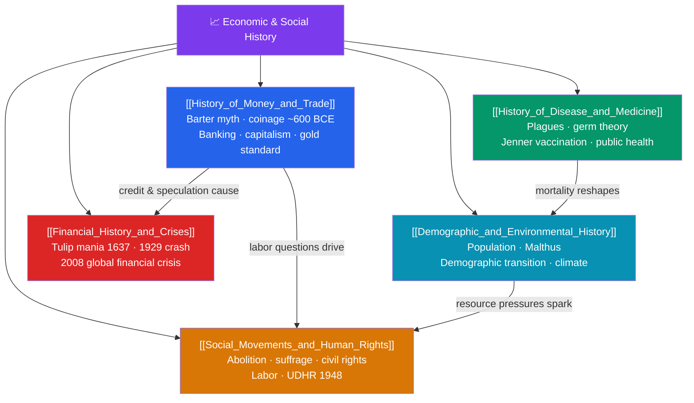

# 🗺️ Economic & Social History — Map of Content

> [!abstract] What This Section Covers
> This capstone section views the human past through the lenses of economy and society rather than kings and battles. The **history of money and trade** examines how exchange evolved — questioning the tidy "barter myth," tracing the first coinage in Lydia (c. 600 BCE), the rise of banking under families like the Medici, and the emergence of capitalism and the gold standard. The **history of disease and medicine** covers the plagues that reshaped civilizations, the germ theory revolution of Pasteur and Koch, Jenner's vaccination, and the public-health advances that doubled human lifespans. **Social movements and human rights** trace the struggles for abolition, women's suffrage, labor rights, and civil rights, culminating in the 1948 Universal Declaration of Human Rights. **Demographic and environmental history** studies population growth, Malthusian limits, the demographic transition, and the deep entanglement of climate and human affairs. Finally, **financial history and crises** dissects recurring manias and crashes — from 1637 tulip mania to the 1929 crash and the 2008 global financial crisis. Together they reveal the structures beneath the surface of events.

## Concept Map

## Learning Path

1. [[History_of_Money_and_Trade]] — How money, banking, and markets evolved from ancient coinage to modern capitalism.
2. [[History_of_Disease_and_Medicine]] — Epidemics, the germ theory revolution, and the rise of public health.
3. [[Demographic_and_Environmental_History]] — Population dynamics, Malthusian debates, and the role of climate in history.
4. [[Social_Movements_and_Human_Rights]] — The long struggles for abolition, suffrage, labor, and civil rights.
5. [[Financial_History_and_Crises]] — Bubbles, panics, and crashes across four centuries of financial capitalism.

## All Notes at a Glance

| Note | Difficulty | What You'll Learn |
|------|------------|-------------------|
| [[History_of_Money_and_Trade]] | Intermediate | The barter myth, Lydian coinage, medieval banking, credit, capitalism, and the gold standard |
| [[History_of_Disease_and_Medicine]] | Intermediate | Plagues, germ theory (Pasteur, Koch), Jenner's vaccine, sanitation, antibiotics, epidemiology |
| [[Social_Movements_and_Human_Rights]] | Intermediate | Abolitionism, women's suffrage, labor movements, civil rights, and the 1948 UDHR |
| [[Demographic_and_Environmental_History]] | Intermediate | Population growth, Malthus, the demographic transition, and climate's influence on history |
| [[Financial_History_and_Crises]] | Intermediate → Advanced | Tulip mania, the South Sea Bubble, the 1929 crash, and the 2008 global financial crisis |

## Key Questions This Section Answers

- How did money and trade evolve, and is the popular "barter-to-money" story actually true?
- How did the germ theory of disease transform medicine and lengthen human life?
- What drove the great social movements for abolition, suffrage, labor, and civil rights?
- How have population growth and environmental change shaped the course of history?
- Why do financial bubbles and crashes recur, from 17th-century tulips to the crisis of 2008?

## Related Sections

- [[_MOC_History_Master|↑ History Master MOC]]
- [[_MOC_History_of_Science|← History of Science & Technology]]
- Cross-vault: [[_MOC_Finance_Master]] — the finance behind bubbles, banking, and financial crises

#MOC #History #EconomicSocialHistory
