# 🏛️ History — Master Map of Content

> [!abstract] About This Vault
> A comprehensive world-history reference: **~90 notes planned across 16 sections**, running the full arc from the historian's craft through human origins, the first civilisations of Mesopotamia and Egypt, classical antiquity, the medieval and Islamic worlds, the Renaissance, the age of exploration, the great revolutions, industrialisation, the World Wars, and the Cold War into the present — capped by two thematic sections on the history of science and on economic & social history. Every note pairs an intuition-first framing with real dates, figures, causes, and consequences, plus review questions. Cross-linked to [[_MOC_Physics_Master]], [[_MOC_Mathematics_Master]], [[_MOC_Finance_Master]], and [[_MOC_Mythology_Master]]. Start at the section matching your era, or follow one of the learning paths below.

> [!success] Vault complete
> All **16 sections** and **86 concept notes** are fully written — plus the master map and all 16 section maps. Every note is built from the `Technical_Concept` template with a Mermaid diagram, key facts and figures, examples, cross-links, and review questions. Completed 2026-07-30. See [[_Vault_Expansion_Roadmap]].

## Vault Architecture

```mermaid
graph TD
    Master["🏛️ History Master"]

    Master --> A["<b>ANCIENT</b>"]
    Master --> B["<b>POST-CLASSICAL</b>"]
    Master --> C["<b>EARLY MODERN</b>"]
    Master --> D["<b>MODERN</b>"]
    Master --> E["<b>THEMATIC</b>"]

    A --> S01["01 · Historiography & Methods"]
    A --> S02["02 · Prehistory & Human Origins"]
    A --> S03["03 · Mesopotamia & Egypt"]
    A --> S04["04 · Classical Antiquity"]
    A --> S05["05 · Ancient India & China"]
    A --> S06["06 · Africa & Pre-Columbian Americas"]

    B --> S07["07 · The Medieval World"]
    B --> S08["08 · Islamic Golden Age"]

    C --> S09["09 · Renaissance & Reformation"]
    C --> S10["10 · Exploration & Colonialism"]

    D --> S11["11 · Enlightenment & Revolutions"]
    D --> S12["12 · Industrial Revolution"]
    D --> S13["13 · The World Wars"]
    D --> S14["14 · Cold War & Modern Era"]

    E --> S15["15 · History of Science & Tech"]
    E --> S16["16 · Economic & Social History"]

    style Master fill:#7c3aed,color:#fff
    style A fill:#b45309,color:#fff
    style B fill:#0891b2,color:#fff
    style C fill:#059669,color:#fff
    style D fill:#dc2626,color:#fff
    style E fill:#2563eb,color:#fff
```

## Sections at a Glance

| # | Section | Notes | Entry Point | Era |
|---|---------|:-----:|-------------|-----|
| 01 | Historiography & Methods | 6 | [[_MOC_Historiography]] | Meta |
| 02 | Prehistory & Human Origins | 5 | [[_MOC_Prehistory]] | to ~3500 BCE |
| 03 | Mesopotamia & Ancient Egypt | 6 | [[_MOC_Mesopotamia_Egypt]] | 3500–1200 BCE |
| 04 | Classical Antiquity | 6 | [[_MOC_Classical_Antiquity]] | 800 BCE–476 CE |
| 05 | Ancient India & China | 5 | [[_MOC_Ancient_India_China]] | 2600 BCE–600 CE |
| 06 | Africa & Pre-Columbian Americas | 5 | [[_MOC_Africa_Pre_Columbian]] | 1000 BCE–1500 CE |
| 07 | The Medieval World | 6 | [[_MOC_Medieval_World]] | 500–1500 CE |
| 08 | Islamic Golden Age | 5 | [[_MOC_Islamic_Golden_Age]] | 632–1258 CE |
| 09 | Renaissance & Reformation | 5 | [[_MOC_Renaissance_Reformation]] | 1300–1650 |
| 10 | Exploration & Colonialism | 5 | [[_MOC_Exploration_Colonialism]] | 1450–1800 |
| 11 | Enlightenment & Revolutions | 5 | [[_MOC_Enlightenment_Revolutions]] | 1650–1850 |
| 12 | Industrial Revolution | 5 | [[_MOC_Industrial_Revolution]] | 1760–1914 |
| 13 | The World Wars | 6 | [[_MOC_World_Wars]] | 1914–1945 |
| 14 | Cold War & Modern Era | 5 | [[_MOC_Cold_War_Modern]] | 1945–present |
| 15 | History of Science & Technology | 6 | [[_MOC_History_of_Science]] | Thematic |
| 16 | Economic & Social History | 5 | [[_MOC_Economic_Social_History]] | Thematic |

---

## Learning Paths

### Path 1 — The Grand Chronological Survey

> Best for: building a coherent timeline of the human story from origins to the present.

[[_MOC_Prehistory]] → [[The_Neolithic_Revolution]] → [[_MOC_Mesopotamia_Egypt]] → [[Sumer_and_the_First_Cities]] → [[_MOC_Classical_Antiquity]] → [[The_Roman_Empire]] → [[_MOC_Medieval_World]] → [[_MOC_Islamic_Golden_Age]] → [[_MOC_Renaissance_Reformation]] → [[_MOC_Exploration_Colonialism]] → [[_MOC_Enlightenment_Revolutions]] → [[_MOC_Industrial_Revolution]] → [[_MOC_World_Wars]] → [[_MOC_Cold_War_Modern]]

---

### Path 2 — The History of Ideas & Science

> Best for: understanding how knowledge itself was built — pairs with the Physics and Mathematics vaults.

[[_MOC_Historiography]] → [[_MOC_Classical_Antiquity]] → [[Athenian_Democracy_and_Greek_Culture]] → [[_MOC_Islamic_Golden_Age]] → [[Islamic_Science_and_Mathematics]] → [[_MOC_History_of_Science]] → [[The_Copernican_Revolution]] → [[Newton_and_the_Mechanical_Universe]] → [[Darwin_and_Evolution]] → [[The_Modern_Physics_Revolution]] → [[The_Information_Age]]

---

### Path 3 — Global & Non-Western History

> Best for: de-centring the European narrative and seeing history as genuinely worldwide.

[[Indus_Valley_Civilization]] → [[Ancient_Chinese_Dynasties]] → [[Chinese_Philosophy_and_the_Silk_Road]] → [[West_African_Empires]] → [[Mesoamerican_Civilizations]] → [[Andean_Civilizations_and_the_Inca]] → [[_MOC_Islamic_Golden_Age]] → [[The_Mongol_Empire]] → [[Gunpowder_Empires_Ottoman_Mughal_Qing]] → [[Decolonization]]

---

### Path 4 — Money, Society & Power (Thematic)

> Best for: readers coming from the Finance / Economics vaults who want the long view.

[[History_of_Money_and_Trade]] → [[The_Columbian_Exchange]] → [[The_Atlantic_Slave_Trade]] → [[Capitalism_Socialism_and_Labor]] → [[Imperialism_and_the_Scramble_for_Africa]] → [[The_Interwar_Years_and_Great_Depression]] → [[Financial_History_and_Crises]] → [[Globalization_and_the_Digital_Age]]

---

## Cross-Vault Links

- **[[_MOC_History_of_Science|History of Science]]** ↔ [[_MOC_Physics_Master]] & [[_MOC_Mathematics_Master]] — the same discoveries, told as *how they happened* rather than *what they say*.
- **[[Financial_History_and_Crises]]** ↔ [[_MOC_Finance_Master]] & [[_MOC_Macroeconomics_Master]] — tulip mania, 1929, and 2008 as recurring human patterns.
- **[[_MOC_Mythology_Master|Mythology]]** — myth *is* how pre-literate and ancient societies recorded and made sense of their history; the two vaults are companions.
- **[[_MOC_Psychology_Master]]** — [[Historical_Bias_and_Revisionism]] and manias/panics connect to memory, bias, and group psychology.

---

## Section MOC Index

- [[_MOC_Historiography]] — The historian's craft: sources, periodisation, bias, archaeology, and quantitative history.
- [[_MOC_Prehistory]] — Human origins: evolution, the Paleolithic, and the Neolithic Revolution.
- [[_MOC_Mesopotamia_Egypt]] — The first civilisations: cities, writing, law, pharaohs, and the Bronze Age collapse.
- [[_MOC_Classical_Antiquity]] — Greece and Rome: democracy, empire, philosophy, and decline.
- [[_MOC_Ancient_India_China]] — The other classical world: Indus Valley, the Mauryas and Guptas, and China's dynasties.
- [[_MOC_Africa_Pre_Columbian]] — Kingdoms and civilisations of Africa and the pre-Columbian Americas.
- [[_MOC_Medieval_World]] — Byzantium, feudalism, the Crusades, the Black Death, and medieval Japan.
- [[_MOC_Islamic_Golden_Age]] — The caliphates, the House of Wisdom, and the Mongol upheaval.
- [[_MOC_Renaissance_Reformation]] — Rebirth of learning, print, the Reformation, and the Scientific Revolution.
- [[_MOC_Exploration_Colonialism]] — Voyages, the Columbian Exchange, slavery, and the gunpowder empires.
- [[_MOC_Enlightenment_Revolutions]] — Reason and the Atlantic revolutions, from 1776 to Bolívar.
- [[_MOC_Industrial_Revolution]] — Steam, capital, labour, nationalism, and new imperialism.
- [[_MOC_World_Wars]] — 1914–1945: total war, the Depression, the Holocaust, and the atomic age.
- [[_MOC_Cold_War_Modern]] — Bipolarity, decolonisation, 1989–91, and globalisation.
- [[_MOC_History_of_Science]] — How knowledge was built, from Greek philosophy to the information age.
- [[_MOC_Economic_Social_History]] — The long history of money, disease, rights, demography, and crises.

#MOC #History #MasterMOC
