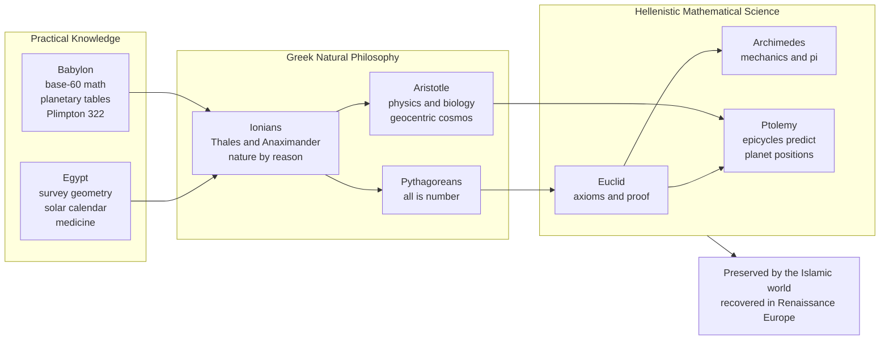

# 🏛️ Ancient and Prehistoric Science

> [!abstract] TL;DR
> Long before the word "science" existed, humans read the sky as a calendar, measured land, and asked what the world is made of. The decisive break came with Greek **natural philosophy** — the revolutionary claim that nature runs on discoverable, rational rules that can be reached by reason, observation, and above all *mathematics*, not myth. From Babylonian planetary tables and Egyptian survey geometry, through Ionian and Pythagorean speculation and Aristotle's vast systematization, to the mathematical peak of Euclid, Archimedes, and Ptolemy, the ancients invented the idea of a law-governed cosmos — bequeathing to later ages both its greatest tools and some of its most durable errors.

---

## Intuition

**Analogy:** Imagine a farming village where, generation after generation, the elders have learned that the river floods a few days after a certain bright star first rises before dawn. For centuries this is *practical* knowledge — a rule of thumb tied to survival, wrapped in ritual and the will of the gods. Then one person stops and asks a different kind of question: not "which god sends the flood?" but "what *natural cause* makes the star and the river move together, and could I predict it from rules alone?"

That shift — from reading the sky as a set of omens to treating it as a machine that obeys discoverable laws — is the birth of science. Prehistoric and early civilizations accumulated astonishing practical know-how (calendars, geometry, medicine). But the Greeks, especially the Ionian philosophers, dared to assume the cosmos is *intelligible*: that behind the chaos of appearances lie a few rational principles, and that human reason and mathematics can reach them. Every later science is a refinement of that one audacious bet.

---

## How It Works

### Core Mechanics

Ancient science was not one thing but a layered accumulation, each stage feeding the next:

1. **Prehistoric practical astronomy.** Megalithic monuments like Stonehenge and countless stone alignments encode solar and lunar events (solstice sunrise, lunar standstills). Bone tally sticks and cave markings suggest lunar counting tens of thousands of years old. The driver was agricultural and religious: *when* to plant, *when* to hold festivals, *when* the seasons turn.

2. **Babylonian mathematical astronomy.** Mesopotamian scribes built a **base-60 (sexagesimal)** positional number system — the reason we still have 60 minutes and 360 degrees. Tablets like **Plimpton 322** list Pythagorean-triple-like relations a millennium before Pythagoras. Crucially, by ~500 BCE the Babylonians produced *predictive* arithmetical tables (ephemerides) forecasting where planets would be, without any physical model — pure pattern extrapolation.

3. **Egyptian practical geometry and the calendar.** Annual Nile floods erased field boundaries, forcing yearly re-surveying — "geometry" literally means *earth-measuring*. Egyptians ran a 365-day civil calendar and compiled medical papyri mixing empirical remedies with magic.

4. **The Greek breakthrough — natural philosophy.** The Ionian **Thales** and **Anaximander** (6th c. BCE) proposed that nature can be explained by *natural causes* and reason rather than divine whim, and asked the founding question: what is the **archē**, the single stuff or principle underlying everything — water, air, the boundless, or (with the atomists) tiny indivisible atoms in a void? This is the invention of rational cosmology.

5. **Pythagorean mathematization.** The Pythagoreans made the deep claim that **number is the essence of reality** — famously discovering that musical consonances correspond to simple integer ratios of string lengths. "All is number" seeded the enduring idea that *nature is written in mathematics*.

6. **Aristotelian systematization.** **Aristotle** (4th c. BCE) fused it all into a comprehensive natural philosophy: logic, physics, cosmology, and genuinely careful empirical **biology** (classifying hundreds of animals). His geocentric cosmos of nested crystalline spheres, four elements, and four causes dominated Western thought for nearly 2000 years — powerful, systematic, and, in its physics, largely wrong.

7. **Hellenistic mathematical science.** In Alexandria the method matured. **Euclid's** *Elements* derived geometry from a handful of axioms by rigorous deductive proof — the template for all systematic knowledge. **Archimedes** fused theory and engineering: levers, buoyancy, and a method-of-exhaustion approximation of pi that foreshadowed calculus. **Ptolemy's** *Almagest* built a geocentric model of epicycles, deferents, and equants that predicted planetary positions accurately for 1400 years — a cautionary triumph of predictive success over physical truth.

### Flow / Architecture



---

## Key Concepts

**Secondary (foundations):**
- **Archē** — the fundamental principle or "stuff" the Presocratics sought; the first genuinely *natural* explanation of the world.
- **Natural philosophy** — explaining nature by reason and natural causes rather than myth; the direct ancestor of modern science.
- **Geocentric cosmos** — Earth-centered universe of nested spheres, the dominant model from Aristotle through Ptolemy.
- **Base-60 and the 360-degree circle** — Babylonian sexagesimal numeracy still embedded in how we measure time and angles.

**Undergraduate (mechanisms):**
- **The axiomatic-deductive method** — Euclid deriving all of geometry from a few self-evident postulates; the model of rigorous knowledge.
- **Method of exhaustion** — Archimedes bounding curved quantities (pi, areas) between inscribed and circumscribed polygons; a rigorous ancestor of the integral.
- **Epicycles, deferents, and equants** — Ptolemy's geometric devices for reproducing observed planetary motion, including retrograde loops.
- **The mathematization of nature** — the Pythagorean-Platonic conviction that reality has an underlying mathematical structure, tested first in musical harmony.

**Graduate (interpretation and critique):**
- **Predictive success vs. truth** — Ptolemaic astronomy predicted well for 1400 years yet was physically false; a permanent lesson about instrumentalism and underdetermination.
- **Why ancient science stalled** — little systematic *experiment*, reverence for authority (Aristotle, Galen), blending of philosophy with observation, and a slavery-based economy that devalued applied mechanics.
- **The transmission chain** — Greek science survived and advanced through the Islamic Golden Age, then re-entered Latin Europe via translation, setting up the Scientific Revolution.
- **Continuity vs. rupture** — historiographical debate over whether ancient natural philosophy was "real science" or a fundamentally different enterprise later transformed.

---

## Python Demo

```python
"""
Two pivotal ancient results, re-derived and visualized:
  1. Eratosthenes measuring the Earth's circumference (~240 BCE)
  2. Archimedes bounding pi with inscribed / circumscribed polygons (~250 BCE)
Requires: numpy, matplotlib
"""
import numpy as np
import matplotlib.pyplot as plt

# ---------------------------------------------------------------
# 1. ERATOSTHENES: the circumference of the Earth
# ---------------------------------------------------------------
# At noon on the summer solstice the Sun was directly overhead at Syene
# (modern Aswan): a vertical stick cast NO shadow. At the same moment in
# Alexandria a stick DID cast a shadow whose angle was ~1/50 of a full
# circle = 7.2 degrees. Because the Sun's rays arrive parallel, that shadow
# angle equals the angular separation of the two cities along the meridian.
shadow_angle_deg = 7.2          # measured shadow angle at Alexandria
distance_km      = 800.0        # Alexandria-to-Syene (~5000 stadia)
circumference    = distance_km * 360.0 / shadow_angle_deg
modern_km        = 40075.0      # true equatorial circumference

err = abs(circumference - modern_km) / modern_km * 100
print(f"Eratosthenes circumference : {circumference:,.0f} km")
print(f"Modern value               : {modern_km:,.0f} km")
print(f"Error                      : {err:.1f} percent")

# ---------------------------------------------------------------
# 2. ARCHIMEDES: pi squeezed between polygons
# ---------------------------------------------------------------
def archimedes_bounds(n_sides):
    theta = np.pi / n_sides                 # half-angle per side at the center
    inscribed    = n_sides * np.sin(theta)  # lower bound on pi
    circumscribed = n_sides * np.tan(theta) # upper bound on pi
    return inscribed, circumscribed

sides = [6, 12, 24, 48, 96]                 # Archimedes stopped at the 96-gon
lows, highs = zip(*[archimedes_bounds(n) for n in sides])
print("\nArchimedes pi bounds:")
for n, lo, hi in zip(sides, lows, highs):
    print(f"  {n:3d}-gon : {lo:.5f} < pi < {hi:.5f}")

# ---------------------------------------------------------------
# Visualization
# ---------------------------------------------------------------
fig, (axL, axR) = plt.subplots(1, 2, figsize=(13, 5.5))

# Left panel: Eratosthenes geometry (angle exaggerated x5 to be visible)
R = 1.0
axL.add_patch(plt.Circle((0, 0), R, fill=False, lw=2, color="#2563eb"))
scale = 5
for ang_deg, label, color in [(90, "Syene\n(no shadow)", "#059669"),
                               (90 + shadow_angle_deg * scale,
                                "Alexandria\n(7.2 deg shadow)", "#dc2626")]:
    a = np.deg2rad(ang_deg)
    x, y = R * np.cos(a), R * np.sin(a)
    axL.plot([x, 1.35 * x], [y, 1.35 * y], color="#444", lw=1.5)   # radial stick
    axL.annotate("", xy=(x, y), xytext=(x + 0.6, y + 0.6),
                 arrowprops=dict(arrowstyle="->", color="#f59e0b", lw=1.6))  # Sun ray
    axL.text(1.5 * x, 1.5 * y, label, ha="center", va="center",
             fontsize=9, color=color)
axL.plot(0, 0, "ko")
axL.text(0.04, -0.1, "center", fontsize=8)
axL.set_xlim(-1.7, 2.0); axL.set_ylim(-1.7, 2.0)
axL.set_aspect("equal"); axL.axis("off")
axL.set_title(f"Eratosthenes: parallel Sun rays + shadow angle\n"
              f"circumference = {circumference:,.0f} km "
              f"({err:.1f}% off modern)")

# Right panel: Archimedes pi convergence
axR.axhline(np.pi, color="k", ls="--", lw=1, label="true pi")
axR.plot(sides, lows,  "o-", color="#059669", label="inscribed (lower bound)")
axR.plot(sides, highs, "s-", color="#dc2626", label="circumscribed (upper bound)")
axR.set_xlabel("number of polygon sides")
axR.set_ylabel("estimate of pi")
axR.set_title("Archimedes: pi squeezed between polygons")
axR.legend(); axR.grid(alpha=0.3)

plt.tight_layout()
plt.savefig("ancient_science.png", dpi=120)
plt.show()
```

Running this prints a circumference within a few percent of the true value and shows Archimedes' bounds tightening toward 3.14159 as the polygons gain sides — both derived with nothing but geometry and careful observation. (The real Eratosthenes worked in *stadia*, whose exact length is uncertain, so his headline accuracy is debated; the *method*, however, is flawless.)

---

## Real-World Applications

- **The 360-degree circle and 60-minute hour** — everyday timekeeping and navigation still run on Babylonian sexagesimal numeracy.
- **Euclidean geometry** — taught essentially unchanged for 2000+ years and still the backbone of engineering drawing, computer graphics, and CAD.
- **Archimedes' principle** — buoyancy calculations for ship design, hydrometers, and density measurement work exactly as he described.
- **The axiomatic method** — Euclid's "define, postulate, prove" template shaped not only mathematics but the deductive structure of physics, logic, and formal computer science.
- **Predictive modeling as a discipline** — Ptolemy's *save the appearances* astronomy is the ancestor of every model judged first by forecast accuracy, from planetary ephemerides to modern data science.

---

## Common Pitfalls

- **"The ancients thought the Earth was flat."** Educated Greeks knew it was a sphere from at least the 5th c. BCE; Eratosthenes *measured* its size. The flat-Earth-ancients story is a modern myth.
- **Confusing prediction with explanation.** Babylonian tables and Ptolemaic epicycles *predicted* planetary positions superbly while being physically wrong — the enduring lesson that a model can work without being true.
- **Reading modern "science" back into antiquity.** Ancient natural philosophy freely mixed empirical observation with metaphysics and rarely used controlled *experiment*; treating it as identical to modern science distorts both.
- **Overrating one authority.** Aristotle's physics and Galen's anatomy were so revered that questioning them became almost heretical for centuries — a reminder that authority can freeze inquiry.
- **Crediting "the Greeks" alone.** Greek achievement stood on Babylonian and Egyptian foundations and was preserved and advanced by the Islamic world; the "Greek miracle" framing erases that dependency.

---

## Related Concepts

- [[The_Presocratics]] — the Ionian and Pythagorean thinkers who invented natural philosophy and the search for the *archē*.
- [[Aristotle]] — the towering systematizer whose geocentric cosmos and physics dominated for ~2000 years.
- [[Euclidean_Geometry]] — the axiomatic-deductive method of the *Elements*, the model for rigorous knowledge.
- [[Number_Systems_and_Real_Line]] — positional number systems, the modern descendants of Babylonian base-60.
- [[Divisibility_and_Primes]] — number-theoretic ideas foreshadowed by Plimpton 322's Pythagorean triples.
- [[The_Celestial_Sphere_and_Coordinates]] — the celestial-sphere framework whose roots lie in ancient geocentric astronomy.
- [[Orbital_Mechanics_and_Celestial_Dynamics]] — the modern physics that finally replaced Ptolemy's epicycles.
- [[Intervals_and_Consonance]] — the integer string-length ratios behind the Pythagorean "all is number".
- [[Pitch_and_the_Harmonic_Series]] — the harmonic ratios first noticed by the Pythagoreans.
- [[Tuning_Systems_and_Temperament]] — the long afterlife of Pythagorean tuning in music.
- [[Ancient_and_Medieval_Science]] — the broader historical arc of pre-modern science and its transmission.
- [[Mesopotamian_Empires]] — the civilizational context of Babylonian astronomy and mathematics.
- [[Ancient_Greece_and_the_Polis]] — the political and cultural setting of Greek natural philosophy.
- [[Explanation_and_Laws_of_Nature]] — the philosophy-of-science question first opened by the idea of a law-governed cosmos.
- [[Kuhn_and_Scientific_Revolutions]] — the paradigm framework that the Aristotelian-to-Copernican shift exemplifies.

> Sibling *History of Science* notes not yet written are referenced in prose: a *History of Science Overview*, *Scientific Method and Empiricism*, *Islamic Golden Age Science*, *Medieval and Renaissance Science*, *The Copernican Revolution*, *The Scientific Revolution Overview*, and *Germ Theory and Modern Medicine* will complete the arc from ancient origins onward.

---

## Review Questions

1. **Conceptual:** What exactly was revolutionary about the Ionian philosophers' question "what is the archē?" — how does asking it differ in kind from a mythological account of nature?
2. **Scenario:** Ptolemy's geocentric model predicted planetary positions accurately for over a millennium yet was physically false. If you were a working astronomer in 1500 CE with no telescope, what evidence or argument could justify *doubting* a model that fits the data so well? What does this reveal about predictive success versus truth?
3. **Trade-off / synthesis:** Ancient science produced Euclidean deduction, Archimedean mechanics, and predictive astronomy, yet largely stalled for centuries. Weigh its strengths (mathematics, natural law, deductive proof, some empirical biology) against its limits (little systematic experiment, reverence for authority, philosophy-observation blending). Which single missing ingredient most plausibly explains why the Scientific Revolution had to wait?

---

## Sources

- Lloyd, G. E. R. *Early Greek Science: Thales to Aristotle* and *Greek Science After Aristotle*. W. W. Norton.
- Lindberg, David C. *The Beginnings of Western Science: The European Scientific Tradition in Philosophical, Religious, and Institutional Context, Prehistory to A.D. 1450*. University of Chicago Press.
- Neugebauer, Otto. *The Exact Sciences in Antiquity*. Dover.
- Netz, Reviel, and William Noel. *The Archimedes Codex*. Da Capo Press.
- [Eratosthenes' measurement of the Earth's circumference (Wikipedia)](https://en.wikipedia.org/wiki/Eratosthenes)

---

#history-of-science #ancient-science #greek-natural-philosophy #archimedes #babylonian-astronomy
