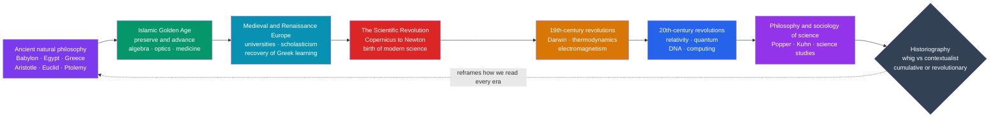

# 📜 History of Science — Overview

> [!abstract] TL;DR
> The **history of science** studies *how* scientific knowledge, methods, instruments, and institutions were actually **built over time** — not a tidy chronology of correct discoveries, but the messy, human, culturally embedded process of observation, argument, instrument-making, and repeated **revolution** that produced our most powerful way of knowing. It is distinct from *doing* science: it studies science **from the outside**, asking who produced knowledge, with what tools and assumptions, and why the "obvious" truths of one century became the discredited errors of the next. Its central debate — **is science cumulative or revolutionary?** — runs through the whole field, and its answer shapes how we teach, fund, and trust science today. This note is the entry point for a six-section vault that tells that story from Babylonian star-catalogues to twenty-first-century Big Science.

---

## Intuition

**Analogy:** Reading the history of science is like reading the **lab notebook of civilization** — not the polished final paper, but the crossed-out equations, the abandoned hypotheses, the arguments in the margins, and the dated entries showing *when* and *how* each idea was reached.

Science did not arrive fully formed and handed down as a settled body of facts. It was **built, argued over, and repeatedly overturned** by real people embedded in their cultures — Babylonian scribes tracking Venus, Greek philosophers reasoning about motion, Baghdad translators correcting Ptolemy, Renaissance canons rearranging the heavens. When you read the notebook rather than the final paper, you see not just *what* we know but *how* we came to know it — which wrong turns we took, why they seemed reasonable at the time, and what it actually took to abandon them. That is the difference between memorizing that the Earth orbits the Sun and understanding **why anyone had ever believed otherwise, and what evidence and argument were required to change their minds.**

---

## How It Works

The history of science is organized both **chronologically** (an arc of eras) and **methodologically** (a set of questions historians ask about each era). The vault mirrors this: the sections follow the arc, while a recurring set of *historiographical* questions — how do we tell the story? — cuts across all of them.

### The Big Arc

1. **Ancient natural philosophy** — Babylonian and Egyptian mathematics and astronomy provided data and technique; the Greeks (**Aristotle**, **Euclid**, **Archimedes**, **Ptolemy**) turned nature into an object of systematic *reasoned* explanation — mostly qualitative and deductive rather than experimental.
2. **The Islamic Golden Age** — from the 8th century, scholars in Baghdad, Córdoba, and Cairo did not merely *preserve* Greek learning; they corrected and extended it, inventing algebra, transforming optics into an experimental discipline, and advancing medicine and astronomy.
3. **Medieval and Renaissance Europe** — the recovery of Greek and Arabic learning through 12th-century translations, the rise of the **university** as an institution, and scholasticism's rigorous dialectic set the stage — and built the framework the revolution would overturn.
4. **The Scientific Revolution** — roughly Copernicus to Newton, the birth of *modern* science: heliocentrism, the experimental method, the mathematization of nature, and new instruments like the telescope and microscope.
5. **The 19th-century revolutions** — Darwinian evolution, thermodynamics, and electromagnetism reorganized biology, energy, and physics, and turned science into a professionalized, institutional enterprise.
6. **The 20th-century revolutions** — relativity, quantum mechanics, the structure of DNA, and computing overturned classical certainties and inaugurated "Big Science."
7. **The philosophy and sociology of science** — Popper, Kuhn, and the science-studies tradition asked *what science is* and *how it changes*, feeding back to reframe how we read every earlier era.

### The Historiographical Questions

Layered on top of the arc are the debates about *how to narrate* it:

- **Whig / triumphalist vs. contextualist.** The **whig** or presentist view reads the past as a steady march toward present truth, praising "forerunners" and dismissing "dead ends." The **contextualist** approach insists on understanding past science *on its own terms* — as contingent, embedded in its culture, and reasonable given its assumptions.
- **Internalist vs. externalist.** Are scientific changes best explained by the internal logic of *ideas and evidence*, or by *external* social, economic, religious, and political forces? Most modern historians blend both.
- **Cumulative vs. revolutionary.** Does science steadily *accumulate* truth, with old theories subsumed as special cases — or does it lurch through discontinuous **paradigm shifts** (Kuhn) that reframe everything, so that old theories are *overthrown* rather than absorbed? This is the field's central tension.



---

## Key Concepts

### Secondary — the shape of the story

- **Science is made, not found.** Knowledge is *produced* by people using instruments, math, and institutions — it does not simply reveal itself.
- **The three great breaks.** The Scientific Revolution (17th c.), the Darwinian revolution (19th c.), and the relativity–quantum revolution (early 20th c.) are the classic turning points every student should be able to place and explain.
- **Instruments matter.** The **telescope**, **microscope**, and later the **particle accelerator** each opened worlds that pure reasoning could not reach — new science often follows new tools.
- **Not a straight line.** "Obvious" past truths — a fixed Earth, phlogiston, spontaneous generation — were reasonable given their evidence and were overturned only with effort.

### Undergraduate — how historians work

- **Internalism vs. externalism.** Explaining a discovery by its *ideas and evidence* versus by its *social, economic, and political context*; the modern consensus integrates both.
- **Presentism and whig history.** Judging the past by the standards of the present distorts it; good history reconstructs why past actors believed what they did, treating even discarded theories as coherent systems.
- **The mathematization of nature.** A defining move of the Scientific Revolution — expressing laws in mathematical form, so that nature becomes something to be *calculated*, not just described.
- **Institutions and the social structure of science.** Academies (the **Royal Society**, 1660), journals (*Philosophical Transactions*, 1665), universities, and later state-funded "Big Science" are the machinery through which claims become accepted knowledge.
- **The "conflict thesis" is too simple.** The idea that science and religion have always been at war is a 19th-century polemic, not an accurate account of a far more entangled history.

### Graduate — the deep debates

- **Kuhn's paradigms and incommensurability.** Normal science, crisis, revolution, and the claim that rival paradigms lack a fully neutral common measure — the framework that made "revolutionary vs. cumulative" the field's organizing question. See [[Kuhn_and_Scientific_Revolutions]].
- **The Sociology of Scientific Knowledge (SSK) and the Strong Programme.** Bloor and Barnes's claim that *all* scientific belief — true and false alike — should be explained symmetrically by social causes; the "science wars" that followed.
- **Realism vs. anti-realism, historicized.** The **pessimistic meta-induction** (most past successful theories turned out false, so why trust present ones?) versus structural realism's reply. Links to [[Scientific_Realism]].
- **Material and experimental history.** Shapin and Schaffer's *Leviathan and the Air-Pump* — how experimental "matters of fact" were *manufactured* through instruments, witnessing, and rhetoric, making even objectivity a historical achievement.
- **Global and postcolonial history of science.** Decentering the "European miracle" narrative to include Chinese, Indian, Islamic, and indigenous knowledge systems and the circulation of knowledge through empire and trade.

---

## Python Demo

This demo visualizes the two defining features of scientific history: a **timeline of paradigm-shifting milestones** (spread across 2,000+ years but clustered near the present) and the **exponential growth of cumulative scientific output** on a log scale — the "exponential of knowledge" that means *most science is recent*. It also prints the **shrinking interval** between successive breakthroughs. Requires only `matplotlib`; `numpy` is optional.

```python
# Visualize the SHAPE of scientific history: milestones + exponential growth.
import matplotlib.pyplot as plt

# 1. Paradigm-shifting milestones: (year, short label). Negative years are BCE.
milestones = [
    (-300, "Euclid"),      (150,  "Ptolemy"),
    (1021, "Alhazen"),     (1543, "Copernicus"),
    (1687, "Newton"),      (1789, "Lavoisier"),
    (1859, "Darwin"),      (1865, "Maxwell"),
    (1905, "Einstein"),    (1927, "Quantum"),
    (1953, "DNA"),         (2012, "Higgs"),
]
years  = [m[0] for m in milestones]
labels = [m[1] for m in milestones]

# 2. Illustrative order-of-magnitude proxy for cumulative recorded science.
#    Exact figures are not the point; the EXPONENTIAL SHAPE is.
g_years = [-300, 0,   500, 1000, 1300, 1500, 1600, 1700, 1800,  1900, 1950, 2000, 2025]
cumul   = [1e1,  2e1, 4e1, 8e1,  2e2,  6e2,  2e3,  1e4,  1e5,   3e6,  2e7,  4e7,  8e7]

# 3. Shrinking gap between successive paradigm shifts.
print("Interval between successive milestones:")
for (y0, l0), (y1, l1) in zip(milestones, milestones[1:]):
    print(f"  {l0:>10} -> {l1:<10}: {y1 - y0:5d} yrs")

fig, (ax1, ax2) = plt.subplots(2, 1, figsize=(11, 8))

# --- Panel 1: milestone timeline ---
ax1.axhline(0, color="#334155", lw=2, zorder=1)
ax1.scatter(years, [0] * len(years), s=90, color="#dc2626", zorder=3)
for i, (yr, lab) in enumerate(milestones):
    dy = 0.28 if i % 2 == 0 else -0.28
    va = "bottom" if dy > 0 else "top"
    ax1.annotate(f"{lab}\n{yr}", xy=(yr, 0), xytext=(yr, dy),
                 ha="center", va=va, fontsize=8,
                 arrowprops=dict(arrowstyle="-", color="#94a3b8"))
ax1.set_ylim(-1, 1); ax1.set_yticks([])
ax1.set_xlabel("Year  (negative = BCE)")
ax1.set_title("Paradigm-shifting milestones: 2,000+ years, clustered near the present")

# --- Panel 2: exponential growth on a log scale ---
ax2.semilogy(g_years, cumul, "o-", color="#2563eb", lw=2, label="cumulative output (proxy)")
for yr in years:
    ax2.axvline(yr, color="#f1c40f", alpha=0.35, lw=1)
ax2.set_xlabel("Year  (negative = BCE)")
ax2.set_ylabel("Cumulative scientific output (log, illustrative)")
ax2.set_title("The exponential of knowledge: most science is recent")
ax2.grid(True, which="both", ls=":", alpha=0.4)
ax2.legend(loc="upper left")

plt.tight_layout()
plt.savefig("history_of_science_shape.png", dpi=120)
plt.show()
```

Running this prints intervals that collapse from centuries (Euclid → Ptolemy: 450 years; Ptolemy → Alhazen: 871 years) to mere decades in the modern era (Einstein → Quantum: 22 years; Quantum → DNA: 26 years), and draws a log-linear growth curve — a straight line on a log axis *is* exponential growth. The visual lesson: measured by output, the overwhelming majority of all science has been done in the last two centuries.

---

## Real-World Applications

- **Science education.** Teaching *how* theories were established — including their false starts — produces deeper understanding and better scientific reasoning than presenting results as finished facts. History-of-science case studies are a staple of "nature of science" curricula.
- **Science policy and R&D forecasting.** Understanding how breakthroughs actually emerge (funding structures, instruments, institutions, serendipity) informs how governments and firms allocate research money and evaluate "Big Science" megaprojects.
- **Distinguishing science from pseudoscience.** The demarcation problem — sharpened by Popper and complicated by Kuhn — has direct bearing on courtrooms, medical regulation, and public-health messaging.
- **Interpreting crises in science.** The **replication crisis**, retractions, and debates over peer review are far less alarming — and far more tractable — when seen against a long history of science as a *self-correcting, fallible* human process rather than an infallible oracle.
- **Bridging the two cultures.** History of science reconnects the sciences with the humanities, giving historians, philosophers, and scientists a shared vocabulary for discussing evidence, objectivity, and progress.

---

## Common Pitfalls

- **Whig history / presentism.** Reading the past as a straight climb toward present truth, cherry-picking "heroes who were right" and mocking those who were "wrong." It flatters the present and obscures why past science was reasonable — the single most common error in popular accounts.
- **The "great man" myth.** Attributing revolutions to lone geniuses in isolation. Newton, Darwin, and Einstein all built on dense networks of predecessors, instruments, correspondents, and institutions; the solitary-genius story erases the collaborative, incremental substrate.
- **Assuming one fixed "scientific method."** There is no single algorithm all scientists follow; method itself has a history and varies by field and era. Treating a schoolbook five-step recipe as timeless is ahistorical.
- **The conflict thesis.** Framing the whole history as "science versus religion." The real relationship — patronage, motivation, opposition, and coexistence — is far more entangled and varies case by case.
- **Confusing history of science with science trivia.** Memorizing dates and "firsts" is not the same as understanding how knowledge was produced, contested, and validated — which is the actual subject.
- **Hindsight bias.** Judging past actors for not seeing what is "obvious" to us, when the relevant evidence, concepts, or instruments did not yet exist.

---

## Related Concepts

This is a **brand-new vault**; its six sections — *Foundations & Ancient/Medieval Science*, *The Scientific Revolution*, *Modern Physics Revolutions*, *Life/Mind/Earth Sciences*, *Philosophy & Sociology of Science*, and *Science/Society & Frontiers* — will hold dedicated overview notes (a *Scientific Revolution overview*, a *Copernican revolution* deep-dive, a *Darwinian revolution* note, a *Philosophy of Science overview*, a *Scientific Method & Empiricism* note, *Scientific Institutions & Societies*, the *Sociology of Scientific Knowledge*, and *Science, Technology & Society*). Those siblings do not exist yet and are referenced here in prose only. The wikilinks below point to **verified** notes elsewhere in the vault:

- [[Ancient_and_Medieval_Science]] — the History-vault companion covering Greek natural philosophy, Islamic transmission, and medieval universities; the deep dive for this vault's first section.
- [[The_Scientific_Revolution]] — the 16th–17th-century break with the inherited framework; the pivot of the whole arc.
- [[The_Copernican_Revolution]] — the overthrow of the Ptolemaic-Aristotelian cosmos; the classic first case study of a paradigm shift.
- [[Newton_and_the_Mechanical_Universe]] — the synthesis that completed the Scientific Revolution and defined "modern science" for two centuries.
- [[Darwin_and_Evolution]] — the 19th-century revolution in biology and humanity's place in nature.
- [[The_Modern_Physics_Revolution]] — relativity and quantum mechanics overturning classical certainty.
- [[Islamic_Science_and_Mathematics]] — how the Islamic Golden Age preserved *and* advanced Greek science.
- [[The_House_of_Wisdom]] — the Baghdad translation movement that carried the ancient corpus forward.
- [[Kuhn_and_Scientific_Revolutions]] — paradigms, normal science, and incommensurability; the source of the "cumulative vs. revolutionary" question.
- [[Popper_and_Falsification]] — the falsificationist alternative and the demarcation problem.
- [[Scientific_Realism]] — whether our best theories are approximately *true*, historicized via the pessimistic meta-induction.
- [[The_Problem_of_Induction]] — the epistemic puzzle underlying all empirical generalization.
- [[What_Is_History_and_Historiography]] — the general historiographical toolkit that history of science specializes.
- **Cross-vault hubs:** [[_MOC_Philosophy_of_Science]] · [[_MOC_History_of_Science]] · [[_MOC_Physics_Master]] · [[_MOC_Mathematics_Master]] · [[_MOC_History_Master]] · [[_MOC_Philosophy_Master]] · [[_MOC_Astronomy_Master]] — history of science is a crossroads linking the specific sciences to History, Philosophy, and Sociology.
- **Founding figures across vaults:** [[Aristotle]] (the framework modern science overturned) · [[Euclidean_Geometry]] (the axiomatic-deductive model of a "science") · [[Newtons_Laws_and_Kinematics]] and [[Special_Relativity_Kinematics]] (the Newton→Einstein transition that is philosophy of science's canonical example) · [[The_Expanding_Universe_and_Hubbles_Law]] (20th-century cosmology as a live paradigm shift).

---

## Review Questions

1. **(Secondary)** The note argues science was "built, not found." Using one concrete example — the shift from a geocentric to a heliocentric cosmos — explain what it means to say a scientific truth was *constructed over time* rather than simply discovered as an obvious fact.
2. **(Undergraduate)** Distinguish the **whig/presentist** approach from the **contextualist** approach to writing the history of science. Give one way each approach could distort our understanding of a discarded theory such as phlogiston chemistry, and explain which pitfall you think is more dangerous for a *scientist* learning history.
3. **(Graduate)** "Is science *cumulative* or *revolutionary*?" State the strongest version of each answer — a Popperian/realist accumulation story and a Kuhnian paradigm-shift story — and explain what the Newton-to-Einstein transition contributes as evidence for each. Which position better survives that case, and at what cost to the idea of scientific *progress toward truth*?

---

## Sources

- Lindberg, D. C. (2007). *The Beginnings of Western Science* (2nd ed.). University of Chicago Press.
- Kuhn, T. S. (1962/1970). *The Structure of Scientific Revolutions* (2nd ed.). University of Chicago Press.
- Shapin, S. (1996). *The Scientific Revolution*. University of Chicago Press.
- Bowler, P. J., & Morus, I. R. (2005). *Making Modern Science: A Historical Survey*. University of Chicago Press.
- Principe, L. M. (2011). *The Scientific Revolution: A Very Short Introduction*. Oxford University Press.

---

#history-of-science #historiography #scientific-progress #paradigm-shifts #natural-philosophy
