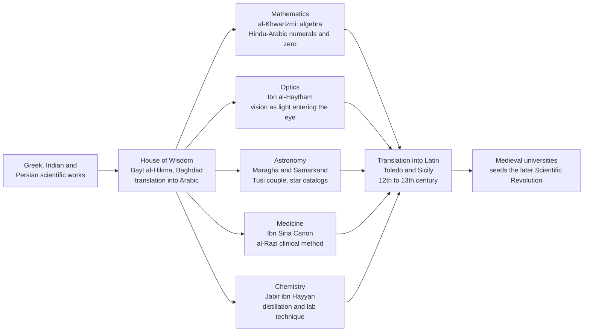

# 🕌 Islamic Golden Age Science

> [!abstract] TL;DR
> From roughly the 8th to the 14th centuries, a cosmopolitan scholarly civilization stretching from Córdoba to Samarkand **preserved, corrected, and vastly extended** Greek, Indian, and Persian science. It gave us **algebra** and the word **algorithm** (al-Khwarizmi), the correct **theory of vision** and an early **experimental method** (Ibn al-Haytham), advanced **astronomy** (the Maragha school, the Tusi couple, Ulugh Beg's star catalog), systematic **medicine** (Avicenna's *Canon*, al-Razi's clinical observation), and the laboratory **techniques of chemistry** (Jabir ibn Hayyan). This was original science, not mere storage — and it was the bridge that carried transformed ancient knowledge into medieval Europe.

## Intuition

**Analogy:** Imagine a priceless library catches fire in one city, and a handful of scattered volumes survive. Now imagine that in a *different*, richer, better-organized city across the world, scholars not only collected every surviving copy but hired the best translators money could buy, then sat down and started *finishing the half-written books* — solving the problems the original authors never cracked, and correcting their mistakes. That second city is the Islamic world from the 8th century onward. When classical learning had scattered in Western Europe, Baghdad's **House of Wisdom** was translating Aristotle, Euclid, and Ptolemy into Arabic, and then far surpassing them.

For roughly 500 years, the cutting edge of science spoke Arabic. The proof survives in the words we still use: *algebra*, *algorithm*, *alchemy*, *alcohol*, *alkali*, *zenith*, *nadir*, *azimuth*, and star names like *Aldebaran*, *Betelgeuse*, *Vega*, and *Rigel*. This note treats that period as a distinct chapter in the history of science — the essential link between the *Ancient and Prehistoric Science* of the Greeks and the *Medieval and Renaissance Science* that fed the Scientific Revolution (both are forthcoming sibling notes in this vault).

---

## How It Works

### The scientific enterprise, in one pipeline

The Islamic Golden Age was, in structural terms, a three-stage machine: **translation** of the inherited corpus, **original advance** across many fields, and **transmission** of the transformed result to Europe.

1. **Patronage and translation (8th–10th c.).** After the Abbasid Caliphate moved its capital to **Baghdad** (762), caliphs such as al-Mansur, Harun al-Rashid, and al-Ma'mun funded a systematic **translation movement**. The **House of Wisdom (Bayt al-Hikma)** became the hub where Greek, Sanskrit, and Pahlavi (Persian) scientific works were rendered into Arabic. Paper-making (learned from Chinese prisoners after the Battle of Talas, 751) made books cheap and copying fast. Science became a *prestigious, well-funded pursuit* across a network of cities — Baghdad, Cairo, Córdoba, Bukhara, Samarkand — not the hobby of isolated monks.

2. **Original advance.** Scholars did not stop at translation. They founded **algebra** as a discipline, overturned the Greek theory of vision, built **observatories** that revised Ptolemy, systematized **medicine** into teachable encyclopedias, and turned alchemy into a set of repeatable **laboratory techniques**.

3. **Transmission to Europe (12th–13th c.).** Through translation centers in **Toledo** (after the Christian reconquest of the city in 1085) and Norman **Sicily**, this Arabic corpus — including the preserved Greek texts — flowed into Latin and seeded the new medieval universities. Much of what Europe later called its own inheritance arrived *via Arabic*.

### Flow of knowledge



---

## Key Concepts

### Secondary — the big picture

- **When and where.** Roughly 750–1400 CE, across the Islamic world from Al-Andalus (Muslim Spain) to Central Asia. Not one country or ethnicity: contributors were Arab, Persian, Central Asian, and of Muslim, Christian, and Jewish faith. "Islamic science" names a shared *civilization and scholarly language* (Arabic), not a single people.
- **The four headline achievements.** (1) **Algebra** — a general method for solving equations, from *al-jabr*. (2) **Optics** — the correct explanation that we see because light enters the eye. (3) **Astronomy** — precise star catalogs and refined planetary models. (4) **Medicine** — encyclopedias used in Europe for centuries.
- **The legacy in words.** *Algebra*, *algorithm*, *alchemy*, *alcohol*, *alkali*, *elixir*, *zenith*, *nadir*, *azimuth*, and hundreds of star names are fossils of this period embedded in modern languages.

### Undergraduate — the mechanics

**Mathematics — al-Khwarizmi (c. 780–850).** His *al-Kitab al-mukhtasar fi hisab al-jabr wa'l-muqabala* ("The Compendious Book on Calculation by Completion and Balancing," c. 820) gave systematic, general procedures for solving linear and quadratic equations. Two operations name the field: *al-jabr* ("restoring/completing" — moving a subtracted term to the other side) and *al-muqabala* ("balancing" — cancelling like terms). His algebra was **rhetorical** (written in words, with no symbols) and, lacking negative numbers, relied on **geometric proof** — literally completing a square (see the demo below). A separate treatise popularized the **Hindu-Arabic numeral system**, including **zero** as a positional placeholder; when Latinized as *Algoritmi*, his name became the word **algorithm**. **Omar Khayyam** (1048–1131) later solved **cubic equations geometrically** by intersecting conic sections, and Islamic mathematicians systematized **trigonometry** (all six trig functions, the law of sines, spherical trig for astronomy).

**Optics — Ibn al-Haytham / Alhazen (c. 965–1040).** His seven-volume *Kitab al-Manazir* (*Book of Optics*, c. 1021) decisively established the **intromission theory** of vision — light travels *from* objects *into* the eye — refuting the Greek **emission theory** (that the eye shoots out rays). He studied reflection, refraction, lenses, mirrors, and the **camera obscura**, and gave a geometric account of how a pinhole forms an *inverted* image. Crucially, he insisted that hypotheses be tested against **controlled observation and experiment**, and that the investigator distrust his own preconceptions — a strong claim for him as an early practitioner of what would become the **scientific method** (a theme this vault develops in its forthcoming *Scientific Method and Empiricism* note).

**Astronomy.** Astronomers compiled precise observational tables (*zij*), refined the **astrolabe**, and built great **observatories** at **Maragha** (1259) and **Samarkand** (where Ulugh Beg's 15th-century star catalog fixed positions for over 1,000 stars without a telescope). The **Maragha school** — including **Nasir al-Din al-Tusi** — devised mathematical constructions such as the **Tusi couple** (two circles producing straight-line motion) to fix inconsistencies in **Ptolemy's** models; several of these constructions reappear in Copernicus's work.

**Medicine.** **Ibn Sina / Avicenna** (980–1037) wrote *al-Qanun fi al-Tibb* (**The Canon of Medicine**), a systematic encyclopedia that was a standard European medical textbook into the 17th century. **Al-Razi / Rhazes** (854–925) exemplified the empirical clinician, producing the first clear **clinical distinction between smallpox and measles**. Care was delivered in **bimaristans** (hospitals) with wards, teaching, and pharmacies.

**Chemistry.** **Jabir ibn Hayyan / Geber** (c. 721–815) and successors turned alchemy into a body of repeatable **laboratory technique** — distillation, crystallization, sublimation, calcination — and classified substances. The apparatus and vocabulary (*alembic*, *alcohol*, *alkali*) passed directly into later chemistry.

### Graduate — the debates

- **The "transmission and influence" thesis.** George Saliba (2007) argues Islamic astronomy was not a dead end but an active, model-revising research program whose mathematical techniques (the Tusi couple, Ibn al-Shatir's non-Ptolemaic models) were available to and plausibly used by **Copernicus** — challenging the tidy "Greeks-to-Renaissance" narrative. The exact channel of transmission remains debated, but the mathematical parallels are striking.
- **The "decline" debate.** Popular narratives blame a single cause (e.g. al-Ghazali's theology). Historians such as **A. I. Sabra** reject monocausal stories, describing instead a long process by which Greek science was **appropriated, naturalized, and only later marginalized** relative to religious sciences — and note that significant work continued into the 15th–16th centuries. The very framing "Golden Age followed by decline" is itself contested as a periodization.
- **"Was it really the scientific method?"** Calling Ibn al-Haytham "the first scientist" flattens history. The careful claim: he practiced key elements — hypothesis, controlled manipulation, mathematical modeling, and testing against observation — early and influentially, within his own intellectual context, and directly shaped Roger Bacon, Witelo, and Kepler.
- **Correcting Eurocentrism.** Treating these centuries as a mere "preservation" holding-pen erases half a millennium of original advance and misrepresents science as a purely European achievement rather than a **global, cumulative human enterprise**.

---

## Python Demo

This demo re-derives **al-Khwarizmi's geometric "completing the square"** — the actual method from his *al-jabr* (c. 820), which used geometry because negative numbers were not yet in use. We solve his own canonical example, `x^2 + 10x = 39`, by literally building and completing a square, then check it against the modern quadratic formula and draw the geometry he drew.

```python
"""
Al-Khwarizmi's geometric 'completing the square' (al-jabr, c. 820 CE).

He solved  x^2 + b*x = c  ("a square and roots equal a number")
by building a geometric square, since negative numbers were not yet used.
We re-derive his method, compare it to the modern formula, and draw the
square he completed. Canonical example from his own book: x^2 + 10x = 39.
"""

import numpy as np
import matplotlib.pyplot as plt
from matplotlib.patches import Rectangle

# --- Equation in al-Khwarizmi's canonical form:  x^2 + b*x = c ---
b, c = 10.0, 39.0

# --- Al-Khwarizmi's method (pure geometry, no negatives) ---
half_b = b / 2.0                      # split the b*x strip into two equal halves
corner = half_b ** 2                  # the little square that 'completes' the figure
big_area = c + corner                 # area of the completed large square
side = np.sqrt(big_area)              # side length of that completed square
x_geometric = side - half_b           # remove the strip we added back off the side

# --- Modern quadratic formula on x^2 + b*x - c = 0, for comparison ---
x_formula = (-b + np.sqrt(b**2 + 4*c)) / 2.0

print(f"Equation:              x^2 + {b:.0f}x = {c:.0f}")
print(f"Half of b:             {half_b:.0f}")
print(f"Completing corner:     {corner:.0f}   (area of the added small square)")
print(f"Completed square:      (x + {half_b:.0f})^2 = {big_area:.0f}")
print(f"Side of big square:    {side:.0f}")
print(f"al-Khwarizmi's root:   x = {x_geometric:.4f}")
print(f"Modern formula root:   x = {x_formula:.4f}")

# --- Visualise the literal geometry al-Khwarizmi drew ---
x = x_geometric
fig, ax = plt.subplots(figsize=(7, 7))

# central x-by-x square (the 'square', x^2)
ax.add_patch(Rectangle((0, 0), x, x, facecolor="#2563eb", edgecolor="k",
                       label=f"x^2  (area {x*x:.0f})"))
# two half-b strips (the 'roots', b*x split into two halves)
ax.add_patch(Rectangle((x, 0), half_b, x, facecolor="#059669", edgecolor="k",
                       label=f"two strips  (area {b*x:.0f})"))
ax.add_patch(Rectangle((0, x), x, half_b, facecolor="#059669", edgecolor="k"))
# the completing corner square, (b/2)^2
ax.add_patch(Rectangle((x, x), half_b, half_b, facecolor="#f59e0b", edgecolor="k",
                       label=f"corner (b/2)^2  (area {corner:.0f})"))

ax.text(x/2, x/2, "x^2", ha="center", va="center", color="w", fontsize=15)
ax.text(x + half_b/2, x/2, "(b/2)x", ha="center", va="center", color="w",
        fontsize=11, rotation=90)
ax.text(x/2, x + half_b/2, "(b/2)x", ha="center", va="center", color="w", fontsize=11)
ax.text(x + half_b/2, x + half_b/2, "(b/2)^2", ha="center", va="center",
        color="w", fontsize=9)

ax.set_xlim(-1, side + 1)
ax.set_ylim(-1, side + 1)
ax.set_aspect("equal")
ax.set_title(f"Completing the square: (x + {half_b:.0f})^2 = {big_area:.0f}  ->  x = {x:.0f}")
ax.legend(loc="upper right", fontsize=9)
plt.tight_layout()
plt.savefig("al_khwarizmi_completing_the_square.png", dpi=120)
plt.show()
```

Running it prints al-Khwarizmi's step-by-step reasoning — half of `b` is 5, the completing corner has area 25, so `(x + 5)^2 = 64`, the big square has side 8, and therefore `x = 3` — matching the modern formula exactly. The plot shows the blue `x^2` square, the two green `(b/2)x` strips, and the gold corner square that literally *completes* the larger square: the whole geometric identity behind `(x + b/2)^2 = c + (b/2)^2`.

---

## Real-World Applications

- **Every algorithm you run.** The word and the concept of a step-by-step, generalizable computational procedure trace to al-Khwarizmi. His treatment of the **Hindu-Arabic numerals** and **zero** is why we compute in decimal positional notation rather than with Roman numerals.
- **Algebra as a universal tool.** From spreadsheets to machine learning, the systematic manipulation of symbolic equations is al-jabr, industrialized.
- **Optics and imaging.** Ibn al-Haytham's analysis of the **camera obscura** and image formation is the direct conceptual ancestor of the pinhole camera, the photographic camera, and every lens system.
- **Observational astronomy and navigation.** Islamic **star catalogs**, **astrolabes**, and trigonometric tables underpinned centuries of navigation and timekeeping; the Arabic **star names** are still standard in modern catalogs.
- **Medical curricula.** Avicenna's *Canon* structured European medical education for 600 years, shaping how clinical knowledge was organized and taught.

---

## Common Pitfalls

- **"They only preserved Greek science."** They founded algebra, overturned Greek optics, revised Ptolemy, and pioneered experimental method. This was original, cumulative research — not a photocopier.
- **Crediting "Arabic numerals" to the Arabs alone.** The decimal positional system originated in **India**; the Islamic world adopted, systematized, and transmitted it — which is exactly why they are more accurately called **Hindu-Arabic numerals**.
- **"Ibn al-Haytham was simply the first scientist."** An anachronism. He practiced key elements of experimental method early and influentially, but within his own context; the modern method is a later, cumulative construction.
- **Treating the era as monolithically "Arab" or purely religious.** Contributors were ethnically and religiously diverse; "Islamic science" denotes a shared civilization and working language, and much of the work was secular natural philosophy.
- **Accepting a single, dramatic "cause of decline."** Historians reject monocausal stories (one theologian, one battle). The reality is a long, contested, multi-factor process — and significant science continued well past the supposed endpoint.

---

## Related Concepts

- [[Islamic_Science_and_Mathematics]] — the History-vault companion covering the same figures from a political-history angle
- [[Ancient_and_Medieval_Science]] — situates this period in the full transmission chain from the Greeks to the Latin West
- [[The_House_of_Wisdom]] — the Baghdad translation institution that supplied the raw corpus
- [[Rise_of_Islam_and_the_Caliphates]] — the Abbasid political order that patronized this science
- [[Al_Andalus]] — the western route (Córdoba, Toledo) through which algebra, numerals, and the *Canon* reached Europe
- [[The_Copernican_Revolution]] — the Maragha models and Tusi couple plausibly fed Copernicus's astronomy
- [[The_Scientific_Revolution]] — the later European break that this tradition helped make possible
- [[Islamic_and_Jewish_Philosophy]] — Avicenna and Averroes as philosophers alongside their scientific work
- [[Rationalism_vs_Empiricism]] — Ibn al-Haytham's insistence on testing hypotheses against observation
- [[Conic_Sections]] — the curves Omar Khayyam intersected to solve cubic equations geometrically
- [[Number_Systems_and_Real_Line]] — the Hindu-Arabic positional decimal system and zero
- [[Trigonometry]] — systematized by Islamic astronomers, including the law of sines and spherical trig
- [[History_of_Disease_and_Medicine]] — the medical tradition of Avicenna, al-Razi, and the bimaristans
- [[The_Celestial_Sphere_and_Coordinates]] — the coordinate framework behind astrolabes and *zij* tables

---

## Review Questions

1. **(Secondary)** How is the single figure of al-Khwarizmi connected to three things we still use every day: the word *algebra*, the word *algorithm*, and the digits on a keypad?
2. **(Undergraduate)** Explain the difference between the **emission** and **intromission** theories of vision, state which one Ibn al-Haytham defended, and describe *how* his approach to settling the question anticipated the scientific method.
3. **(Graduate)** Given the mathematical parallels between the Maragha school's models (the Tusi couple, Ibn al-Shatir) and Copernicus's work, what would you need to establish to move from "striking parallel" to "demonstrated influence," and why is this historiographically important for correcting a Eurocentric account of science?

---

## Sources

- Al-Khalili, J. (2010). *Pathfinders: The Golden Age of Arabic Science*. Allen Lane / Penguin.
- Saliba, G. (2007). *Islamic Science and the Making of the European Renaissance*. MIT Press.
- Lindberg, D. C. (2007). *The Beginnings of Western Science* (2nd ed.). University of Chicago Press.
- Sabra, A. I. (1987). "The Appropriation and Subsequent Naturalization of Greek Science in Medieval Islam." *History of Science*, 25(3), 223–243.
- O'Connor, J. J. & Robertson, E. F. "Abu Ja'far Muhammad ibn Musa Al-Khwarizmi." MacTutor History of Mathematics Archive — https://mathshistory.st-andrews.ac.uk/Biographies/Al-Khwarizmi/

---

#history-of-science #islamic-golden-age #al-khwarizmi #ibn-al-haytham #algebra
