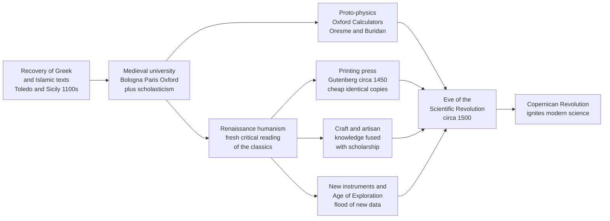

# 🏰 Medieval and Renaissance Science

> [!abstract] TL;DR
> The "Dark Ages" is a Renaissance slander. Between roughly 1100 and 1600, Latin Europe **recovered** the lost Greek and Islamic scientific corpus through the 12th-century translation movement, built a brand-new institution — the **self-governing university** — to teach and debate it, and produced genuine proto-physics (the **mean-speed theorem**, **impetus** theory). The Renaissance then fused this bookish scholarship with **craft/artisan empiricism**, naturalistic art, the **printing press**, and a flood of new data from exploration and new instruments. The result was not a void before the Scientific Revolution but its **launchpad**.

## Intuition — analogy first

Imagine a start-up that "came out of nowhere" to dominate an industry. Look closer and you find a decade of unglamorous groundwork: someone had to acquire the patents (the **recovered texts**), someone had to build the office and hire a permanent staff (the **universities**), someone had to invent the assembly line that let the product be copied cheaply and identically (the **printing press**), and a few overlooked engineers had already prototyped the core technology in a back room (the **Oxford Calculators' kinematics**). The overnight success — Copernicus, Galileo, Newton — only *looks* overnight if you skip the medieval and Renaissance R&D phase.

The technical version: the Scientific Revolution needed four things it did not create — **institutions** that reward disputation, an **inherited corpus** worth arguing with, a **reproduction technology** that lets data accumulate without corruption, and a **culture that trusts direct observation over authority**. The medieval and Renaissance periods assembled all four. Reading the "Dark Ages" as a blank page makes the 17th century a miracle; reading it as an incubation makes it an inevitability.

---

## How It Works

### Core mechanics — the pipeline that produced modern science

1. **Recovery (12th–13th c.).** As Latin scholars pushed into Islamic Spain and Norman Sicily, a **translation movement** centred on **Toledo** (Gerard of Cremona rendered ~70 works) poured Aristotle, Euclid, Ptolemy, Ibn al-Haytham, and Avicenna into Latin. Europe did not start from scratch — it inherited a *corrected and extended* Greek science via the Islamic world (see the sibling note **Islamic_Golden_Age_Science**, not yet written, and [[Islamic_Science_and_Mathematics]]).
2. **Institutionalisation (~1100–1200s).** The **university** — Bologna (1088), Paris (~1150), Oxford (~1096) — was a genuinely new social technology: a permanent, self-governing corporation of masters and students with a *standard curriculum* and legal protections. For the first time, natural philosophy had a stable home that outlived any individual scholar.
3. **Disciplined reasoning — scholasticism.** The **quaestio** and **disputatio** turned teaching into structured argument: state the question, marshal authorities on both sides, resolve, answer objections. **Aquinas** and **Albertus Magnus** wove Aristotle into Christian theology, which paradoxically made Aristotle *the* authority to overturn later. See [[Aquinas_and_Scholasticism]] and [[Faith_and_Reason]].
4. **Proto-physics.** Inside these universities, real quantitative work appeared: the **Oxford Calculators** (Merton College) proved the **mean-speed theorem**; **Nicole Oresme** graphed velocity against time and mused about Earth's rotation; **Jean Buridan** proposed **impetus** to explain projectile motion, cracking Aristotle's physics.
5. **Renaissance fusion (14th–16th c.).** **Humanism** re-read the classics with fresh, critical eyes; naturalistic **art** (linear perspective, dissection-based anatomy) trained a new precision of observation; and — crucially — the wall between the **scholar** and the **artisan/craftsman** began to fall. **Leonardo da Vinci** is the emblem: painter, engineer, anatomist in one notebook.
6. **Acceleration — printing.** **Gutenberg's press (~1450)** let texts, and above all **diagrams, tables, and star charts**, be reproduced cheaply and *identically*. Error no longer accumulated with every copy; data could be shared, checked, and built upon across a continent.
7. **New anomalies.** Better clocks and navigational instruments, and the **Age of Exploration**, generated data the ancients never had — new continents, plants, animals, and stars. "The ancients did not know America" quietly demolished the assumption that Aristotle and Ptolemy had said the last word.

By 1500 Europe held all the ingredients at once — and Copernicus lit the fuse.

### Flow / Architecture



---

## Key Concepts

### Secondary level — the big story
- **The "Dark Ages" is a myth.** The medieval period saw major *technological* advances — the **heavy plough**, **watermills and windmills**, the **mechanical clock**, **eyeglasses**, the **magnetic compass**, and **gunpowder** — and it built the schools and libraries science needed.
- **Universities were invented in the Middle Ages**, not the Renaissance: Bologna, Paris, and Oxford are all older than 1200.
- **The printing press (~1450)** made books cheap. Before it, one scribe copied one book at a time and introduced errors; after it, thousands of identical copies spread ideas fast.

### Undergraduate level — the mechanisms
- **The translation movement** (Toledo, Sicily, 12th–13th c.) reintegrated **Aristotelian natural philosophy** and Greek mathematics into Latin Europe *through* the Islamic world — Europe received a version already improved by al-Khwarizmi's algebra and Ibn al-Haytham's experimental optics.
- **Scholastic method** trained generations in systematic logical **disputation** — the habit of stating a thesis, confronting objections, and resolving them. That discipline of argument is a direct ancestor of scientific reasoning, even where its content (Aristotelian physics) was later discarded.
- **The mean-speed (Merton) theorem:** a body in *uniformly accelerated* motion covers the same distance in a given time as a body moving *uniformly* at the **mean of its initial and final speeds**. Oresme gave a **geometric proof** by plotting speed against time — the area under the graph is the distance. This is Galileo's kinematics, three centuries early (see the Python demo).
- **Impetus theory (Buridan):** a thrown object keeps moving because the thrower impresses an internal "impetus" that gradually dissipates — a conceptual bridge from Aristotle's "the air pushes it" to **inertia**.

### Graduate level — the historiographical debate
- **The continuity vs. rupture question.** Pierre Duhem argued modern science *grew continuously* out of medieval physics (the "Duhem thesis"); others stress a genuine 17th-century rupture. The modern consensus is a middle path: real medieval anticipations existed, but they lacked the *systematic* mathematisation, the institutional experimentalism, and the metaphysical break that define the Scientific Revolution.
- **The "scholar and craftsman" thesis (Edgar Zilsel).** Modern science emerged partly by *fusing* the high-status literate tradition of the universities with the low-status **empirical know-how of artisans, navigators, instrument-makers, and gunners** — a merger the Renaissance made socially possible.
- **Eisenstein's "printing as an agent of change."** The press did not merely spread existing ideas faster; by fixing texts, standardising diagrams, and enabling cumulative cross-checking, it altered the *epistemology* of knowledge itself — arguably a *precondition* for the Scientific Revolution rather than a mere accelerant.
- **The limits of medieval science.** Proto-physics like the mean-speed theorem stayed largely a *logical exercise in kinematics of qualities* — it was rarely connected to real falling bodies or tested empirically. Galileo's leap was to fuse the medieval mathematics of motion with *measurement*.

---

## Python Demo

```python
# Two medieval/Renaissance advances, visualized:
#   (1) The PRINTING diffusion curve: the explosion of book production
#       in Europe after Gutenberg (~1450) as a logistic-style takeoff.
#   (2) The MERTON MEAN-SPEED THEOREM (Oxford Calculators / Oresme):
#       a geometric proof that uniformly accelerated motion covers the
#       same distance as uniform motion at the MEAN speed.
# numpy is optional; used here only for convenience.
import numpy as np
import matplotlib.pyplot as plt

fig, (ax1, ax2) = plt.subplots(1, 2, figsize=(13, 5))

# --- (1) Printing diffusion: cumulative books printed in Europe ---
# Rough historical anchors (order-of-magnitude, millions of volumes):
#   1450 press invented; ~1500 ~20M; ~1550 ~80M; ~1600 ~200M.
years = np.array([1450, 1470, 1490, 1500, 1520, 1550, 1580, 1600])
books_millions = np.array([0.0, 1.5, 12, 20, 45, 80, 140, 200])

# Fit a smooth logistic takeoff for illustration (S-curve of diffusion).
def logistic(t, L, k, t0):
    return L / (1 + np.exp(-k * (t - t0)))

t = np.linspace(1450, 1600, 400)
curve = logistic(t, L=230, k=0.045, t0=1545)

ax1.plot(t, curve, color="#2563eb", lw=2, label="Logistic diffusion model")
ax1.scatter(years, books_millions, color="#dc2626", zorder=5,
            label="Est. cumulative output")
ax1.axvline(1450, color="gray", ls="--", lw=1)
ax1.text(1452, 205, "Gutenberg press\n~1450", fontsize=9)
ax1.set_title("Impact of Printing: European book output, 1450-1600")
ax1.set_xlabel("Year")
ax1.set_ylabel("Cumulative volumes printed (millions)")
ax1.legend(loc="upper left")
ax1.grid(alpha=0.3)

# --- (2) Merton mean-speed theorem: velocity-time graph ---
# Uniformly accelerated motion from v0 to v1 over time T.
v0, v1, T = 2.0, 10.0, 6.0
t2 = np.linspace(0, T, 200)
v_accel = v0 + (v1 - v0) * t2 / T        # the sloped line: uniform acceleration
v_mean = (v0 + v1) / 2                     # the mean speed

# Distance = area under each curve.
dist_accel = np.trapz(v_accel, t2)         # area under the ramp
dist_mean = v_mean * T                      # area of the mean-speed rectangle
assert abs(dist_accel - dist_mean) < 1e-6   # THEOREM: they are equal

ax2.plot(t2, v_accel, color="#7c3aed", lw=2, label="Uniform acceleration")
ax2.axhline(v_mean, color="#059669", lw=2, ls="--",
            label=f"Mean speed = {v_mean:.0f}")
ax2.fill_between(t2, 0, v_mean, color="#059669", alpha=0.15)
# The triangle ABOVE the mean line equals the missing triangle BELOW it:
ax2.fill_between(t2, v_mean, v_accel, where=(v_accel >= v_mean),
                 color="#7c3aed", alpha=0.25, label="Excess triangle")
ax2.fill_between(t2, v_accel, v_mean, where=(v_accel < v_mean),
                 color="#f59e0b", alpha=0.35, label="Deficit triangle")
ax2.set_title("Merton Mean-Speed Theorem (Oresme's geometric proof)")
ax2.set_xlabel("Time")
ax2.set_ylabel("Velocity")
ax2.text(0.3, 11, f"Distance (ramp)  = {dist_accel:.1f}\n"
                  f"Distance (mean) = {dist_mean:.1f}", fontsize=9)
ax2.legend(loc="lower right", fontsize=8)
ax2.grid(alpha=0.3)

plt.tight_layout()
plt.savefig("medieval_renaissance_science.png", dpi=120)
print("Printing: est. 200M+ volumes by 1600, from ~0 in 1450.")
print(f"Mean-speed theorem holds: {dist_accel:.2f} == {dist_mean:.2f} distance units.")
```

The left panel shows why the press mattered: an S-shaped **diffusion curve** — a slow start, an explosive middle, and hundreds of millions of volumes by 1600 — turning individual insights into a shared, cumulative European conversation. The right panel reproduces **Oresme's own argument**: the purple triangle by which the accelerating body *exceeds* the mean speed exactly cancels the amber triangle by which it *falls short* earlier, so the ramp and the mean-speed rectangle enclose **identical areas** — identical distances. That equality is Galileo's law of fall in medieval dress.

---

## Real-World Applications

- **Modern universities and peer review** are lineal descendants of the medieval *studium generale*: self-governing faculties, degrees, formal curricula, and the culture of structured public argument (the *disputatio* is the ancestor of the thesis defence).
- **Version-controlled, reproducible knowledge.** The printing revolution's core insight — that fixing and standardising a text lets errors be caught and improvements accumulate — is the same principle behind scientific journals, standardised datasets, and even software version control.
- **Perspective geometry in graphics.** Renaissance artists' mathematised **linear perspective** (Brunelleschi, Alberti) is the direct root of the projective geometry used in cameras, CAD, and 3D rendering pipelines today.
- **Kinematics teaching.** The mean-speed theorem is exactly the "area under a velocity-time graph equals displacement" result taught in every introductory mechanics course.

---

## Common Pitfalls

- **Believing the "Dark Ages."** The term is a Renaissance and Enlightenment polemic. Medieval Europe advanced clocks, optics, agriculture, and the mathematics of motion, and it built the institutions science needed.
- **Crediting the Renaissance with the university.** Universities are a *medieval* invention (pre-1200); the Renaissance inherited and used them.
- **Treating Islamic science as mere "preservation."** The recovered corpus arrived already *corrected and extended* — algebra, experimental optics, and refined astronomy were Islamic advances, not Greek leftovers. See **Islamic_Golden_Age_Science** (sibling, not yet written) and [[Islamic_Science_and_Mathematics]].
- **Overstating continuity.** The mean-speed theorem and impetus theory were real, but mostly *logical* exercises rarely tied to measurement. Do not collapse the genuine 17th-century rupture into "the medievals already did it."
- **Assuming printing merely spread ideas faster.** Its deeper effect was *epistemic*: standardised diagrams and reliable reproduction changed what it meant to build cumulatively on prior work.
- **Reading Copernicus as a bolt from the blue.** By 1500 the preconditions — texts, universities, printing, craft empiricism, new data — were all in place. The revolution was *incubated*, not spontaneous.

---

## Related Concepts

- [[The_Copernican_Revolution]] — the heliocentric break that these medieval and Renaissance preconditions made possible
- [[The_Scientific_Revolution]] — the 16th–17th-century transformation this note is the launchpad for (the History_of_Science sibling *The_Scientific_Revolution_Overview* is not yet written)
- [[Islamic_Science_and_Mathematics]] — the tradition that corrected and extended Greek science before Europe recovered it
- [[The_House_of_Wisdom]] — the Baghdad translation hub upstream of the Toledo translation movement
- [[Ancient_and_Medieval_Science]] — the companion History-vault survey of Greek, Islamic, and medieval science
- [[Aquinas_and_Scholasticism]] — the scholastic synthesis of Aristotle and Christian theology
- [[Faith_and_Reason]] — the medieval debate that gave natural philosophy its intellectual license
- [[Islamic_and_Jewish_Philosophy]] — Avicenna, Averroes, and Maimonides, transmitters of the reintegrated Aristotle
- [[Aristotle]] — the natural philosopher whose physics medieval science both taught and eventually overturned
- [[The_Printing_Revolution]] — deep dive on Gutenberg and the press modeled in the demo
- [[The_Italian_Renaissance]] — the humanist and artistic milieu that fused scholarship with craft
- [[Humanism_and_the_Arts]] — the fresh critical reading of the classics and naturalistic observation
- [[The_High_Middle_Ages]] — the era that built the universities and the translation movement
- [[The_Age_of_Exploration]] — the flood of new data that undermined ancient authority
- [[Kuhn_and_Scientific_Revolutions]] — the paradigm-shift lens for reading this transition
- [[Euclidean_Geometry]] — the recovered axiomatic model that defined what a "science" should look like
- [[Projective_Geometry]] — the mathematics behind Renaissance linear perspective
- [[Renaissance_and_Baroque]] — the art-historical companion to the naturalistic-observation thread
- [[Space_Perspective_and_Depth]] — how mathematised perspective trained precise visual observation

*Referenced in prose (History_of_Science siblings not yet written): Islamic_Golden_Age_Science, Ancient_and_Prehistoric_Science, The_Scientific_Revolution_Overview, Scientific_Institutions_and_Societies, History_of_Science_Overview, Newtonian_Mechanics_and_the_Principia, The_Birth_of_Modern_Biology.*

---

## Review Questions

1. **(Secondary)** Name three medieval *technological* advances and explain why they, together with the invention of the university, make the "Dark Ages" label misleading.
2. **(Undergraduate)** State the mean-speed theorem in your own words and explain how Oresme's velocity-time graph proves it. Why is this called a "medieval anticipation of Galileo," and what crucial ingredient did it still lack?
3. **(Graduate)** Eisenstein argued that printing was a *precondition* for the Scientific Revolution, not just an accelerant. Contrast this with the Zilsel "scholar-and-craftsman" thesis and the Duhem continuity thesis. Which best explains why modern science emerged in Europe rather than in the equally learned Islamic world, and what evidence would settle the question?

---

## Sources

- Lindberg, D. C. (2007). *The Beginnings of Western Science* (2nd ed.). University of Chicago Press.
- Grant, E. (1996). *The Foundations of Modern Science in the Middle Ages*. Cambridge University Press.
- Clagett, M. (1959). *The Science of Mechanics in the Middle Ages*. University of Wisconsin Press.
- Eisenstein, E. L. (1979). *The Printing Press as an Agent of Change*. Cambridge University Press.
- Shapin, S. (1996). *The Scientific Revolution*. University of Chicago Press.

---

#history-of-science #medieval-science #renaissance #scholasticism #printing-press
