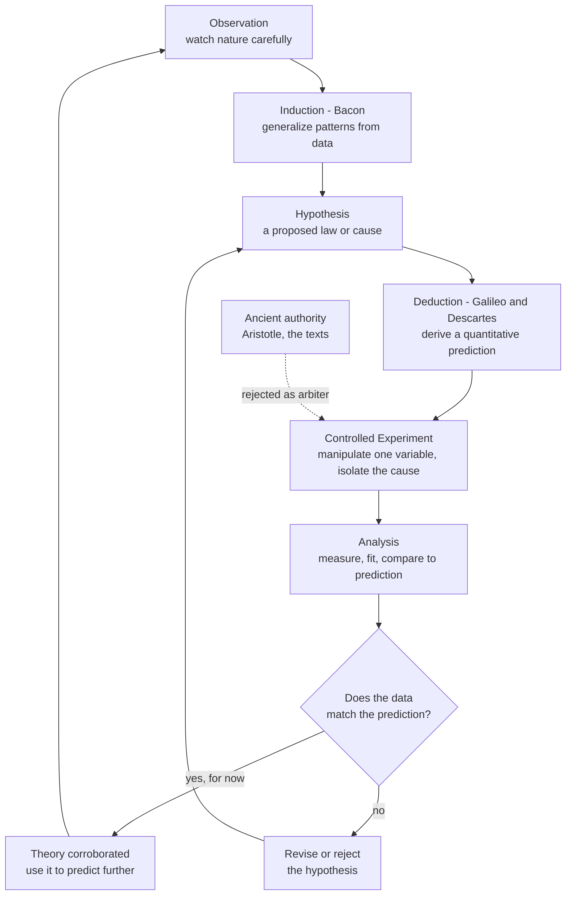

# 🔬 The Scientific Method and the Birth of Empiricism

> [!abstract] TL;DR
> The **scientific method** is the practice of settling questions about nature by **asking nature directly** — through deliberate, controlled **experiment** and careful **observation** — rather than by appealing to ancient **authority** or pure reason. Two innovations fused in the 1600s to make it powerful: **Francis Bacon's** program of systematic **induction** from collected data *(Novum Organum,* 1620), and **Galileo's** insistence that the results be captured in the language of **mathematics** *(distance fallen scales as time squared).* Combined with the philosophy of **experiment**, new **instruments**, and the **hypothetico-deductive** loop of predict-test-revise, this became the methodological engine of the **Scientific Revolution** — and it remains the core of how reliable knowledge about the world is produced. Its motto: *nullius in verba* — take nobody's word for it.

---

## Intuition

**Analogy:** Imagine two people arguing about how nature works — say, whether a heavy cannonball falls faster than a light musket ball. For most of history, you would settle the dispute by citing an *authority*: "Aristotle said heavier bodies fall faster, and the ancients knew best." The argument ends when someone quotes a bigger name. The revolutionary idea of the scientific method is to end the argument a completely different way — **climb the tower, drop both balls, and watch.** Don't take Aristotle's word for it. Don't take *my* word for it. Ask the falling stones themselves, under conditions you control, and let the measurement be the judge.

That single move — *trusting a careful, repeatable observation over even the greatest sage* — sounds obvious today but is startlingly recent. It replaces a chain of citations with a chain of *evidence*, and it makes the humblest experiment able to overturn two thousand years of consensus. The whole edifice of modern science rests on the willingness to say "test it, don't just assert it."

---

## How It Works

### Core Mechanics

The scientific method is less a rigid recipe than a set of interlocking commitments. Four historical innovations, layered together, produced the version that powered the Scientific Revolution:

1. **The shift from authority to observation.** Before the 1600s, knowledge of nature was largely *derived* — read out of the texts of Aristotle, Galen, Ptolemy, or Scripture, and defended by commentary. The new science demanded that claims answer to **nature as the arbiter**. The Royal Society of London took as its motto **"nullius in verba"** — on the word of no one. A duke's opinion and a peasant's opinion both lose to a reproducible measurement.

2. **Baconian induction (empiricism).** **Francis Bacon's** *Novum Organum* (1620) laid out a program: gather organized **observations and experiments**, tabulate the instances in which a phenomenon is present, absent, and varying in degree, and **generalize upward** to the underlying cause. Crucially, Bacon warned against the **"idols of the mind"** — systematic biases (of the Tribe, the Cave, the Marketplace, and the Theatre) that distort perception and reasoning. Science, for Bacon, was to be **collective, empirical, and useful**, a cooperative enterprise rather than the solitary speculation of a genius.

3. **The controlled, quantitative experiment.** The decisive technical move was to stop *passively observing* nature and start **actively interrogating** it — deliberately manipulating conditions to isolate a single cause. **Galileo** rolled balls down **inclined planes** to *slow gravity down* enough to measure it with a water clock. **Robert Boyle** built an **air pump** to create and study a vacuum. **Newton** used a **prism** to decompose and recompose white light. This is nature examined under artificial, instrument-mediated, controlled conditions — an experiment, not an anecdote.

4. **The mathematization of nature.** **Galileo** insisted that "the book of nature is written in the language of mathematics." His **law of falling bodies** — that distance fallen is proportional to the **square of the time** — did not come from stacking anecdotes; it came from idealized experiment plus a **mathematical description** that could generate new, testable **predictions**. Measuring, quantifying, and hunting for mathematical **laws** became the goal. On the other pole stood **René Descartes**, who stressed deductive **reason**, mathematics, and a **mechanical philosophy** of nature-as-machine. The productive tension between **empiricism** (knowledge from experience, Bacon) and **rationalism** (knowledge from reason, Descartes) fed *both* halves of the mature method.

Put together, these commitments yield the **hypothetico-deductive cycle**: form a **hypothesis**, deduce **testable predictions**, run **experiments**, and **revise** when the data disagree. The loop is **self-correcting** — that openness to being proven wrong is precisely what distinguishes science from dogma.

### Flow / Architecture



The dashed line captures the revolutionary break: authority is demoted from *judge* to, at most, *witness*. The experiment, not the text, decides.

---

## Key Concepts

**Secondary (foundations)**
- **Empiricism** — the doctrine that knowledge of the natural world comes from **experience** (observation and experiment), not from authority or pure thought.
- **Experiment vs observation** — an experiment **deliberately changes** conditions to isolate a cause; passive observation merely records what happens to occur.
- **Hypothesis and prediction** — a hypothesis is a testable guess; a prediction is what the hypothesis says you *should* see if it is true.
- **"Nullius in verba"** — the Royal Society's motto, "take nobody's word for it": nature, not reputation, settles disputes.

**Undergraduate (mechanism)**
- **Baconian induction** — building general laws by systematically collecting instances *(present, absent, graded)* and reading off the common cause; the empirical, cumulative, cooperative model of science.
- **The idols of the mind** — Bacon's catalogue of cognitive and cultural **biases** (Tribe, Cave, Marketplace, Theatre) that corrupt inquiry and must be guarded against — an early theory of what we now call cognitive bias.
- **Mathematization of nature** — expressing regularities as quantitative **laws** (Galileo: *d ∝ t²*) so they yield sharp, numerical, falsifiable predictions.
- **Controlled variable** — the discipline of holding everything fixed except the one factor under study, so any change can be attributed to a cause.
- **Instruments as sense-extenders** — telescope, microscope, thermometer, barometer, air pump, and precise clocks let inquiry reach beyond unaided perception and enabled **measurement**.

**Graduate (nuance and critique)**
- **Empiricism vs rationalism** — the epistemological tension between Bacon's *knowledge-from-experience* and Descartes's *knowledge-from-reason*; the mature method draws on both (data *and* mathematical deduction).
- **Hypothetico-deductive method** — the recognition (Whewell, Hempel) that scientists rarely induce blindly; they **conjecture** and then deduce consequences to test, anticipating Popper's falsificationism.
- **Theory-ladenness of observation** — there is no wholly "raw" datum; what counts as an observation is shaped by the theory and instruments used to collect it, complicating naive inductivism.
- **The "scientific method" myth** — there is **no single algorithmic five-step method**. Real science is messier: creative hypothesis-generation, serendipity, social validation, and negotiation over what counts as evidence. What is *real* and powerful is the **cluster of commitments** — empirical testing, quantification, controlled experiment, openness to revision, distrust of mere authority.
- **The problem of induction** — Hume's point that no finite run of confirming instances *logically guarantees* a universal law; a live philosophical wound at the heart of empiricism.

---

## Python Demo

We re-enact **Galileo's inclined-plane / falling-body experiment**. Galileo's claim was that distance fallen grows as **time squared** (`d = ½ g t²`), *contradicting* Aristotle's assertion that heavier bodies fall proportionally faster and that speed is simply constant. We generate noisy "experimental" data, **fit two competing hypotheses** (Aristotle's linear `d ∝ t` vs Galileo's quadratic `d ∝ t²`), let the data **reject** the wrong one, and then **predict** a held-out point — the full empirical loop.

```python
# Re-enacting Galileo: does distance fall as t (Aristotle) or t^2 (Galileo)?
# Demonstrates controlled experiment -> mathematical fitting -> prediction/testing.
import numpy as np
import matplotlib.pyplot as plt

rng = np.random.default_rng(42)

# --- Nature's true law (unknown to the experimenter) ---
g = 9.81  # m/s^2 ; on an inclined plane Galileo used a smaller effective value,
          # but the FORM d = 0.5 * a * t^2 is what matters.
def true_law(t):
    return 0.5 * g * t**2

# --- The controlled experiment: release from rest, time the fall at marked distances ---
t = np.linspace(0.1, 2.0, 12)             # timing marks (independent variable we control)
d_true = true_law(t)
noise = rng.normal(0, 0.15 * d_true.max()/2, size=t.shape)  # realistic measurement noise
d_obs = d_true + noise                    # what the water-clock + ruler actually record

# --- Aristotle's claim: heavier objects fall proportionally faster ---
# Test it: drop two masses in the SAME controlled setup. Time depends only on distance,
# NOT on mass -> Aristotle's proportionality is rejected by the (idealized) data.
for mass in [1.0, 10.0]:
    t_fall = np.sqrt(2 * d_true[-1] / g)  # independent of mass
    print(f"mass={mass:5.1f} kg -> fall time for {d_true[-1]:.2f} m = {t_fall:.3f} s")

# --- Fit two competing hypotheses by least squares ---
# H_Aristotle: d = a * t        (distance linear in time)
a_lin = np.sum(d_obs * t) / np.sum(t * t)
d_lin = a_lin * t

# H_Galileo:   d = c * t^2       (distance quadratic in time)
c_quad = np.sum(d_obs * t**2) / np.sum(t**2 * t**2)
d_quad = c_quad * t**2

def r_squared(y, yhat):
    ss_res = np.sum((y - yhat)**2)
    ss_tot = np.sum((y - y.mean())**2)
    return 1 - ss_res / ss_tot

print(f"\nAristotle  d = a*t   : a = {a_lin:.3f},  R^2 = {r_squared(d_obs, d_lin):.4f}")
print(f"Galileo    d = c*t^2 : c = {c_quad:.3f},  R^2 = {r_squared(d_obs, d_quad):.4f}")
print(f"Galileo's c should recover 0.5*g = {0.5*g:.3f}  ->  fitted {c_quad:.3f}")

# --- Prediction: use Galileo's fitted law on a NEW time, compare to a held-out measurement ---
t_new = 2.5
d_pred = c_quad * t_new**2
d_actual = true_law(t_new) + rng.normal(0, 0.15 * d_true.max()/2)
print(f"\nPrediction at t={t_new}s: Galileo says {d_pred:.2f} m, nature gives {d_actual:.2f} m")

# --- Visualize: (1) d vs t with both fits, (2) d vs t^2 linearity test ---
fig, (ax1, ax2) = plt.subplots(1, 2, figsize=(12, 5))

ax1.scatter(t, d_obs, color="black", zorder=5, label="experimental data")
ax1.plot(t, d_lin, "r--", label=f"Aristotle  d=a*t  (R2={r_squared(d_obs,d_lin):.3f})")
ax1.plot(t, d_quad, "b-", label=f"Galileo  d=c*t^2  (R2={r_squared(d_obs,d_quad):.3f})")
ax1.scatter([t_new], [d_pred], color="blue", marker="*", s=200, label="Galileo prediction")
ax1.set_xlabel("time  t  [s]"); ax1.set_ylabel("distance fallen  d  [m]")
ax1.set_title("Fitting competing hypotheses to data")
ax1.legend(); ax1.grid(alpha=0.3)

# The signature test: plot d against t^2. Galileo's law => a STRAIGHT LINE through origin.
ax2.scatter(t**2, d_obs, color="black", zorder=5, label="data")
ax2.plot(t**2, c_quad * t**2, "b-", label=f"slope = c = {c_quad:.3f} (~0.5g)")
ax2.set_xlabel("time squared  t^2  [s^2]"); ax2.set_ylabel("distance fallen  d  [m]")
ax2.set_title("The t^2 law: linear when plotted vs t^2")
ax2.legend(); ax2.grid(alpha=0.3)

plt.tight_layout()
plt.savefig("galileo_inclined_plane.png", dpi=120)
print("\nSaved figure: galileo_inclined_plane.png")
```

Running this shows three things the way a 1600s experimenter would have argued them: **(1)** the falling time is independent of mass, so Aristotle's "heavier falls proportionally faster" is *rejected*; **(2)** the quadratic fit hugs the data and recovers `c ≈ ½g`, while the linear fit is systematically off — the data **choose** Galileo's law; **(3)** plotting `d` against `t²` yields a **straight line**, the visual signature that turned a messy table of numbers into a clean mathematical *law* that then *predicts* an unseen point. Observation, mathematics, and prediction, welded together.

---

## Real-World Applications

- **The randomized controlled trial (RCT).** Modern medicine's gold standard is Bacon's controlled experiment industrialized: a treatment group and a control group, randomized to isolate the drug's effect from placebo, expectation, and confounders. *Nullius in verba* becomes "no eminent physician's opinion outranks a well-run trial."
- **A/B testing in tech.** Every large web company (Google, Amazon, Netflix) runs thousands of live experiments: split users into control and variant, change one thing, measure the outcome, keep what the data support. This is the inclined-plane logic applied to product design.
- **Physics and engineering to this day.** From the LHC confirming the Higgs boson to a bridge's stress test, the pattern is identical — a quantitative hypothesis yields a numerical prediction, and an instrument-mediated measurement decides.
- **Reproducibility norms and open science.** Pre-registration, shared data, and independent replication are institutional machinery built to enforce the method's core commitment: a result you cannot check is not yet knowledge.
- **Evidence-based practice everywhere.** Public-health policy, agriculture, and even education research now demand controlled comparison and quantified outcomes rather than tradition or authority.

---

## Common Pitfalls

- **Confusing "the scientific method" with a rigid 5-step algorithm.** The textbook flowchart is a simplification. Real inquiry involves creative conjecture, serendipity, and social negotiation. The *commitments* (test, quantify, stay revisable) are real; the tidy recipe is a myth.
- **Mistaking correlation for a controlled result.** Passive observation ("smokers get more cancer") can suggest a cause but cannot isolate it. Without controlling confounders, you have not run Bacon's experiment — you have collected an anecdote at scale.
- **Ignoring theory-ladenness.** Believing observation is perfectly "raw." What you measure and how you interpret it is shaped by your theory and instruments; blind inductivism underestimates this.
- **Confirmation over refutation.** Seeking only data that supports your hypothesis. Bacon's "idols" and Popper's falsificationism both warn: the informative test is the one that could prove you *wrong*.
- **Fitting a curve and declaring victory.** A model that hugs your data may still be false — it might overfit, or a rival model might fit as well. Prediction on *new* data, not fit to old data, is the real test.
- **Treating authority as evidence.** "A Nobel laureate says so" is a reason to look, not a reason to conclude. The whole point of *nullius in verba* is that reputation is not proof.

---

## Related Concepts

- [[Inductive_Logic]] — the formal reasoning that underwrites Bacon's move from collected instances to general laws, and its inherent limits.
- [[Scientific_Reasoning_and_Method]] — the systematic modern treatment of inductivism, hypothetico-deduction, and confirmation that this note's history feeds into.
- [[Descartes_and_Rationalism]] — the rationalist pole (reason and deduction) whose tension with Baconian empiricism shaped the mature method.
- [[British_Empiricism]] — Locke, Berkeley, and Hume systematized the empiricist claim that all knowledge derives from experience.
- [[Rationalism_vs_Empiricism]] — the epistemological debate over the *sources* of knowledge that sits directly beneath the Bacon-versus-Descartes contrast.
- [[The_Problem_of_Induction]] — Hume's argument that no finite set of observations logically proves a universal law: the philosophical wound in naive empiricism.
- [[Popper_and_Falsification]] — the twentieth-century refinement holding that testability, not confirmation, marks genuine science.
- [[Kuhn_and_Scientific_Revolutions]] — the counterpoint stressing that science advances through paradigm shifts, not smooth cumulative induction.
- [[Explanation_and_Laws_of_Nature]] — what it means to capture nature in a mathematical *law*, the goal Galileo set.
- [[Newtons_Laws_and_Kinematics]] — Newton's *Principia* was the crowning fusion of experiment and mathematics that this method made possible.
- [[Aristotle]] — the authority whose physics (heavier bodies fall faster) the new experimental method famously overturned.
- [[Statistical_Inference_and_Hypothesis_Testing]] — the modern quantitative machinery for deciding whether data support or reject a hypothesis.
- [[Learning_Myths_and_Neuromyths]] — a present-day case study in why claims must be tested against evidence rather than accepted on authority.

*Sibling History-of-Science notes referenced in prose — The Copernican Revolution, The Scientific Revolution Overview, Newtonian Mechanics and the Principia, Scientific Institutions and Societies, Philosophy of Science Overview, and History of Science Overview — are planned for this vault but not yet written.*

---

## Review Questions

**Secondary**
1. Before the Scientific Revolution, how did people typically settle a dispute about how nature works, and what did the scientific method propose to do instead? Explain what "nullius in verba" means and why it was radical.

**Undergraduate**
2. Francis Bacon championed **induction** while Galileo championed **mathematization** through controlled experiment. Given a table of falling-body measurements, describe concretely how you would (a) use Bacon's approach to spot a pattern and (b) use Galileo's approach to turn that pattern into a testable mathematical law. Why is the combination stronger than either alone?

**Graduate**
3. The "textbook scientific method" (observe → hypothesize → predict → experiment → conclude) is widely taught yet philosophers call it a myth. Using the **problem of induction**, the **theory-ladenness of observation**, and the **hypothetico-deductive** critique, argue whether there is any defensible sense in which a single "scientific method" exists. What core commitments survive the critique, and why do they still make science reliable?

---

## Sources

- Bacon, Francis. *Novum Organum* (1620). — The founding text of inductive empiricism and the "idols of the mind."
- Galileo Galilei. *Dialogues Concerning Two New Sciences* (1638). — The inclined-plane experiments and the mathematization of motion.
- Shapin, Steven. *The Scientific Revolution.* University of Chicago Press, 1996. — A concise, critical social history of the period.
- Dear, Peter. *Revolutionizing the Sciences: European Knowledge and Its Ambitions, 1500–1700.* Princeton University Press, 2001. — On the fusion of experiment, mathematics, and instruments.
- Andersen, Hanne & Hepburn, Brian. "Scientific Method." *Stanford Encyclopedia of Philosophy* (2021). — https://plato.stanford.edu/entries/scientific-method/

---

#history-of-science #scientific-method #empiricism #francis-bacon #galileo
