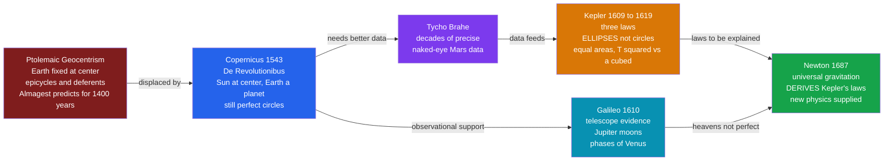

# 🌅 The Copernican Revolution

> [!abstract] TL;DR
> The **Copernican Revolution** was the roughly 150-year shift from an Earth-centered to a Sun-centered cosmos — **Copernicus** (1543) proposed it as a mathematical hypothesis, **Tycho Brahe** supplied the precise data, **Kepler** proved planets move in **ellipses** obeying three quantitative laws, **Galileo's telescope** (1609–10) found direct observational evidence, and **Newton** (1687) finally *explained* it all with universal gravitation. It displaced humanity from the center of creation, overturned a 2000-year-old cosmology fused with Aristotle and scripture, and became the founding event — and the archetype — of the entire Scientific Revolution.

---

## Intuition

**Analogy:** For roughly 1400 years, everyone *knew* the Earth stood still at the center of the universe — and the evidence felt overwhelming. You can feel that the ground under you doesn't move. Drop a stone and it lands straight down, not miles to the west. The Sun visibly rises in the east, arcs overhead, and sets in the west. Common sense, everyday physics, and holy scripture all agreed: the heavens turn around a motionless Earth.

Copernicus dared to swap the roles. What if the thing that *looks* like it's standing still is the very thing that's whirling — that the Earth is just another planet spinning once a day and circling the Sun once a year, and the "moving" heavens are an illusion produced by our own motion? It is the same trick as sitting on a train pulling out of a station: for a moment you'd swear the *other* train slid backward, until you realize *you're* the one moving. This single swap — demoting the Earth from the throne of creation to one more planet in the crowd — was so radical it took a century, a burned heretic, a duke's observatory, and a new invention pointed at the sky to win. And in winning, it launched modern science.

---

## How It Works

### The system it had to overthrow: Ptolemaic geocentrism

The reigning model was not a superstition — it was a triumph of ancient mathematics. In the **Almagest** (c. 150 CE), Ptolemy placed a fixed Earth at the center and had the Sun, Moon, and planets ride on nested circles: a large **deferent** circle, with each planet riding a smaller **epicycle** turning on top of it, offset by an **equant** point to fix the timing. This machinery **predicted planetary positions well enough to survive for 1400 years**. It was fused with **Aristotle's physics** (heavy Earth naturally rests at the center; the heavens are perfect, unchanging, made of a fifth element moving in perfect circles) and, in medieval Christendom, with **theological readings of scripture**. To deny it was to deny common sense, physics, and God at once.

### The revolution as a relay race

No single person did it. The Copernican Revolution is best understood as a chain in which each figure solved the problem the previous one exposed:

1. **Copernicus (1543)** — In *De Revolutionibus Orbium Coelestium*, published as he lay dying, he put the **Sun at the center** and made Earth a planet that rotates daily and orbits yearly. His motivation was largely **elegance and harmony**: heliocentrism *explains* why Mercury and Venus never stray far from the Sun, and it turns the baffling **retrograde motion** of the planets into a natural consequence of Earth overtaking slower outer planets — no special epicycle needed. But he kept the ancient dogma of **perfect circles** (and so still needed small epicycles), so at first his model was *not* obviously more accurate than Ptolemy's. It was a hypothesis, not yet a proof.
2. **The obstacles** — Heliocentrism defied common sense (we feel no motion), broke Aristotelian physics (why would a heavy Earth move, and why aren't we flung off?), and made a bold prediction it *seemingly failed*: if Earth orbits, nearby stars should show **stellar parallax** — a tiny annual shift against distant stars. None was observed. Copernicus's correct answer — the stars are simply too far away for the shift to be seen — sounded like special pleading. It was a genuinely **hard sell**.
3. **Tycho Brahe** — At his observatory Uraniborg, Tycho spent decades making the **most precise naked-eye planetary observations ever taken**, accurate to a couple of arcminutes. He himself favored a hybrid model (planets orbit the Sun; the Sun orbits a fixed Earth), but his real gift was **data** — the empirical bedrock everything after would be built on.
4. **Kepler** — Inheriting Tycho's meticulous **Mars** observations, Kepler spent years failing to fit them to circles. An 8-arcminute discrepancy he refused to ignore forced him to abandon 2000 years of dogma and discover his **three laws**: (1) orbits are **ellipses** with the Sun at one **focus**; (2) a planet sweeps **equal areas in equal times** (it speeds up when close); (3) the period squared is proportional to the semi-major axis cubed, $T^2 \propto a^3$. Now the heliocentric model was **genuinely, quantitatively superior** — precise and predictive.
5. **Galileo** — Turning the newly invented **telescope** to the sky (1609–10), Galileo found evidence that geocentrism could not absorb: **four moons orbiting Jupiter** (so not everything circles the Earth), the full cycle of **phases of Venus** (only possible if Venus orbits the Sun), and **craters, mountains, and sunspots** showing the heavens are neither perfect nor unchanging. His advocacy in the *Dialogue Concerning the Two Chief World Systems* led to his **1633 trial and condemnation** by the Inquisition — the iconic (and often oversimplified) clash of new science with entrenched authority.
6. **Newton (1687)** — The revolution was only *completed* when Newton's **universal gravitation** in the *Principia* **derived Kepler's laws from a single force law**, unifying the physics of falling apples and orbiting moons. He supplied the **new physics** the moving Earth had demanded — the reason we aren't flung off is the same reason the Moon doesn't fly away.

### Why it counts as a *revolution*

This is Thomas **Kuhn's** paradigm case. Heliocentrism was not merely a new fact slotted into the old framework; it was a **wholesale reframing** of humanity's place in the cosmos that made the old questions obsolete and demanded an entirely new physics. That total gestalt-switch is exactly what Kuhn meant by a **scientific revolution** — and the "Copernican Revolution" is its archetype.



---

## Key Concepts

### Secondary Level
- **Geocentric vs heliocentric** — geocentric puts a fixed Earth at the center; heliocentric puts the Sun at the center with Earth as one orbiting planet.
- **Retrograde motion** — the occasional *backward* drift of a planet against the stars. Geocentrism faked it with epicycles; heliocentrism explains it as Earth overtaking a slower outer planet, like passing a slower car on the highway.
- **De Revolutionibus (1543)** — Copernicus's book, published on his deathbed, that proposed the Sun-centered cosmos.
- **The telescope** — the new instrument (c. 1608, improved by Galileo in 1609) that turned astronomy from naked-eye guesswork into direct observation.

### Undergraduate Level
- **Epicycle–deferent–equant** — Ptolemy's three-part geometric machinery for matching planetary positions without abandoning circles; predictively strong, physically fictitious.
- **Kepler's three laws** — ellipses with the Sun at a focus (1st); equal areas in equal times / conservation of angular momentum (2nd); $T^2 \propto a^3$ (3rd, the "harmonic law").
- **Stellar parallax** — the annual apparent shift of nearby stars that heliocentrism *predicts*. Its absence to the naked eye was a genuine objection; it was finally measured by Bessel in **1838**, confirming Earth's motion.
- **Galilean evidence** — Jupiter's moons (not all bodies orbit Earth), the full phases of Venus (Venus orbits the Sun), and sunspots and lunar craters (the heavens are not perfect and unchanging).
- **Instrumentalism vs realism** — Osiander's unsigned preface framed the model as a mere calculating *device*, not literal truth — an early skirmish over whether scientific models describe reality.

### Graduate Level
- **The 8-arcminute anomaly** — Kepler's refusal to discard a tiny residual in Tycho's Mars data is a case study in how precise measurement forces conceptual revolution; it is why he abandoned circles.
- **Kuhnian paradigm shift** — incommensurability, the accumulation of anomalies, and the gestalt-switch from one worldview to another; the Copernican Revolution is Kuhn's central historical exemplar.
- **The physics gap** — heliocentrism was *empirically* superior after Kepler yet *dynamically* unmotivated until Newton; the revolution highlights the difference between a predictive kinematics and an explanatory dynamics.
- **The Galileo affair in context** — the 1616 admonition and 1633 trial involved not just science-vs-church but Counter-Reformation politics, patronage, scriptural hermeneutics, and Galileo's own polemical missteps — a caution against tidy "reason vs faith" narratives.
- **Displacement of the anthropocentric cosmos** — the "Copernican principle" generalizes the loss of a central position into a methodological stance: we occupy no special vantage point in the universe.

---

## Python Demo

```python
# The Copernican Revolution, made quantitative in two figures:
#   (A) RE-DERIVE Kepler's Third Law from planetary data: T^2 vs a^3 is a straight line.
#   (B) SHOW that a heliocentric model produces RETROGRADE MOTION for free:
#       simulate Earth and Mars orbiting the Sun and plot Mars's apparent
#       path on the sky as seen from the moving Earth -- the backward loop
#       that geocentrism had to fake with epicycles emerges from pure geometry.
import numpy as np
import matplotlib.pyplot as plt

# ---------------------------------------------------------------
# (A) Kepler's Third Law: T^2 proportional to a^3
# Real orbital data. In units of AU (semi-major axis) and years (period),
# Kepler's harmonic law predicts T^2 = a^3 exactly (slope = 1 through origin).
# ---------------------------------------------------------------
planets = ["Mercury", "Venus", "Earth", "Mars",
           "Jupiter", "Saturn", "Uranus", "Neptune"]
a_AU  = np.array([0.387, 0.723, 1.000, 1.524, 5.203, 9.537, 19.191, 30.07])   # semi-major axis
T_yr  = np.array([0.241, 0.615, 1.000, 1.881, 11.862, 29.457, 84.011, 164.79]) # orbital period

x = a_AU**3        # a^3
y = T_yr**2        # T^2

# Least-squares fit of T^2 against a^3
slope, intercept = np.polyfit(x, y, 1)
print(f"Kepler III fit:  T^2 = {slope:.4f} * a^3 + {intercept:.4f}")
print("Kepler predicts slope = 1.0000 and intercept = 0 in AU-year units.")

# ---------------------------------------------------------------
# (B) Retrograde motion from a heliocentric model (circular approximation)
# ---------------------------------------------------------------
a_E, T_E = 1.000, 1.000     # Earth: 1 AU, 1 year
a_M, T_M = 1.524, 1.881     # Mars:  1.524 AU, 1.881 years
incl = np.radians(1.85)     # Mars orbital inclination -> a real loop on the sky

# Sample a bit more than one synodic period so we capture one retrograde episode
t = np.linspace(0.0, 2.2, 2000)                 # years
theta_E = 2*np.pi * t / T_E
theta_M = 2*np.pi * t / T_M

# Heliocentric positions (Sun at origin); Mars orbit tilted by 'incl'
earth = np.array([a_E*np.cos(theta_E), a_E*np.sin(theta_E), np.zeros_like(t)])
mars  = np.array([a_M*np.cos(theta_M),
                  a_M*np.sin(theta_M)*np.cos(incl),
                  a_M*np.sin(theta_M)*np.sin(incl)])

# Geocentric vector: how Mars looks FROM the moving Earth
rel = mars - earth
lon = np.degrees(np.arctan2(rel[1], rel[0]))                      # ecliptic longitude
lat = np.degrees(np.arctan2(rel[2], np.hypot(rel[0], rel[1])))    # ecliptic latitude
lon = np.unwrap(np.radians(lon))                                  # remove 360 wrap
lon = np.degrees(lon)

# ---------------------------------------------------------------
# Plot both results
# ---------------------------------------------------------------
fig, (ax1, ax2) = plt.subplots(1, 2, figsize=(13, 5.2))

# (A) Kepler's third-law line
xs = np.linspace(0, x.max()*1.05, 100)
ax1.plot(xs, slope*xs + intercept, "r--", lw=1.8,
         label=f"fit: slope = {slope:.3f}")
ax1.scatter(x, y, s=55, zorder=5, color="#2563eb")
for name, xi, yi in zip(planets, x, y):
    ax1.annotate(name, (xi, yi), textcoords="offset points",
                 xytext=(6, -4), fontsize=8)
ax1.set_xlabel(r"$a^3$  (AU$^3$)")
ax1.set_ylabel(r"$T^2$  (years$^2$)")
ax1.set_title("Kepler's Third Law:  $T^2 \\propto a^3$")
ax1.legend()
ax1.grid(alpha=0.3)

# (B) Mars's apparent path on the sky -> retrograde loop
ax2.plot(lon, lat, "-", color="#d97706", lw=1.5)
# Mark direction of motion at the start and highlight the retrograde segment
d_lon = np.gradient(lon)
retro = d_lon < 0                                   # westward = retrograde
ax2.plot(lon[retro], lat[retro], ".", color="#dc2626", ms=4,
         label="retrograde (westward)")
ax2.set_xlabel("apparent ecliptic longitude (deg)")
ax2.set_ylabel("apparent ecliptic latitude (deg)")
ax2.set_title("Mars from moving Earth:\nthe retrograde loop emerges geometrically")
ax2.legend()
ax2.grid(alpha=0.3)

plt.tight_layout()
plt.savefig("copernican_revolution.png", dpi=130)
print("Saved copernican_revolution.png")
# plt.show()
```

Running this prints a fitted slope of essentially **1.000** for $T^2$ vs $a^3$ across five orders of magnitude of orbital size — Kepler's harmonic law, re-derived from data in three lines of numpy. The second panel shows Mars tracing a mostly eastward path across the sky that suddenly **loops backward** (the red retrograde segment) for a few weeks near opposition. Ptolemy needed a dedicated epicycle to manufacture that loop; in the heliocentric model it falls out for free, purely because the faster Earth overtakes the slower Mars.

---

## Real-World Applications

- **Spaceflight and orbital mechanics** — every satellite, interplanetary probe, and Hohmann transfer is computed from Kepler's laws (as generalized by Newton). The revolution's mathematics is literally the operating manual for the space age.
- **The cosmic distance ladder** — heliocentric parallax (Earth's orbit as a measuring baseline) is the first rung for stellar distances; the parallax Copernicus's critics couldn't find is now the foundation of astrometry missions like **Gaia**.
- **Exoplanet detection** — the transit and radial-velocity methods that find planets around other stars are Kepler's laws applied to other suns; the **Kepler Space Telescope** is named for exactly this legacy.
- **The Copernican principle in cosmology** — the assumption that we occupy no special location underpins the modern homogeneous, isotropic models of the universe.
- **A template for scientific reasoning** — the pattern *precise data → mathematical law → unifying theory* became the reusable method of physical science.

---

## Common Pitfalls

- **"Copernicus proved the Earth moves."** — He didn't. His 1543 model used circles and epicycles and was not clearly more accurate than Ptolemy's. It was a hypothesis; **Kepler's ellipses** made it superior and **Galileo's telescope** gave direct evidence.
- **"Everyone was stupid to believe geocentrism."** — Geocentrism was empirically well-supported, predictively successful for 1400 years, and consistent with the best physics of the day. Heliocentrism made a prediction (parallax) that *appeared to fail*. Believing the Earth was fixed was the reasonable position given the evidence available.
- **"The Church simply hated science."** — The Galileo affair mixed theology with Counter-Reformation politics, scientific under-determination (parallax still unobserved), patronage, and Galileo's personal provocations. Flattening it into "reason vs faith" distorts the history.
- **Confusing kinematics with dynamics.** — Kepler described *how* planets move; he could not say *why*. The revolution stayed physically unmotivated until **Newton** supplied the force law. Predicting is not the same as explaining.
- **Assuming the switch was quick.** — It took roughly 150 years and multiple generations (1543 to Newton's 1687 *Principia*) for heliocentrism to become the accepted paradigm.

---

## Related Concepts

- [[Orbital_Mechanics_and_Celestial_Dynamics]] — Kepler's three laws and Newton's derivation of them worked out in full mathematical detail.
- [[Newtons_Laws_and_Kinematics]] — the "new physics" that finally explained *why* a moving Earth doesn't fling us off and why planets obey Kepler's laws.
- [[Telescopes_and_Detectors]] — the instrument Galileo pointed skyward, whose descendants still test cosmology today.
- [[Formation_of_the_Solar_System]] — the modern heliocentric solar system whose ordering Copernicus first got right.
- [[Kuhn_and_Scientific_Revolutions]] — the philosophy of paradigm shifts for which the Copernican Revolution is the central historical example.
- [[Kant_and_the_Copernican_Turn]] — Kant's self-styled "Copernican revolution" in philosophy, borrowing the metaphor of reversing the observer and the observed.
- [[Scientific_Realism]] — the realism-vs-instrumentalism debate first joined in Osiander's preface: is the model *true*, or just a calculating device?
- [[Popper_and_Falsification]] — heliocentrism's parallax prediction as a case of a bold, testable (and much-later confirmed) claim.
- [[The_Scientific_Revolution]] — the broader 16th–17th century transformation of which this is the founding event.
- [[Newton_and_the_Mechanical_Universe]] — the Newtonian capstone that completed the revolution.
- [[Ancient_and_Medieval_Science]] — the Ptolemaic and Aristotelian cosmos that had to be overturned.
- [[Islamic_Science_and_Mathematics]] — the astronomers who preserved and refined Ptolemy (and whose models Copernicus drew on) across the medieval centuries.
- [[The_Italian_Renaissance]] — the humanist recovery of ancient texts and the intellectual climate that made the challenge thinkable.

> Sibling notes planned for this vault — *Ancient and Prehistoric Science*, *The Scientific Revolution Overview*, *Newtonian Mechanics and the Principia*, *Scientific Method and Empiricism*, *Science and Religion*, *Kuhn's Paradigms and Scientific Revolutions*, and *History of Science Overview* — will connect here once written.

---

## Review Questions

**Secondary**
1. In everyday terms, what does retrograde motion look like in the night sky, and how does a Sun-centered model explain it without any epicycles?

**Undergraduate**
2. Copernicus's 1543 model was not clearly more accurate than Ptolemy's. What specifically did **Kepler** and **Galileo** each add that turned heliocentrism from a hypothesis into a compelling theory? Given the evidence available in 1600, was it *rational* to still doubt that the Earth moved?

**Graduate**
3. Using Kuhn's framework, argue whether the Copernican Revolution is best described as a single "paradigm shift" or a sequence of distinct shifts (Copernicus, Kepler, Newton). What does the ~150-year gap between *De Revolutionibus* and the *Principia* — during which heliocentrism was empirically favored but dynamically unexplained — reveal about the difference between predictive success and genuine scientific acceptance?

---

## Sources

- Kuhn, Thomas S. *The Copernican Revolution: Planetary Astronomy in the Development of Western Thought.* Harvard University Press, 1957.
- Kuhn, Thomas S. *The Structure of Scientific Revolutions.* University of Chicago Press, 1962.
- Koestler, Arthur. *The Sleepwalkers: A History of Man's Changing Vision of the Universe.* Hutchinson, 1959.
- Gingerich, Owen. *The Book Nobody Read: Chasing the Revolutions of Nicolaus Copernicus.* Walker & Company, 2004.
- [Stanford Encyclopedia of Philosophy — Nicolaus Copernicus](https://plato.stanford.edu/entries/copernicus/)
- [NASA — Johannes Kepler and the Three Laws of Planetary Motion](https://science.nasa.gov/resource/orbits-and-keplers-laws/)

---

#history-of-science #copernican-revolution #heliocentrism #kepler #galileo
