# ⚡ The History of Electricity and Magnetism

> [!abstract] TL;DR
> Electricity and magnetism began as **two unrelated parlor curiosities** — sparks from rubbed amber and lodestones that point north — and over roughly one century were revealed to be **two faces of a single force**. **Franklin** turned static electricity into a quantitative science and tamed lightning; **Volta's battery** gave experimenters a steady electric *current*; **Oersted, Ampère, and Faraday** discovered the deep link — a current makes magnetism, and a *changing* magnet makes electricity; **Maxwell** compressed it all into four equations that predicted self-propagating **electromagnetic waves** traveling at a speed computable from two lab-measured constants — a speed that turned out to **equal the speed of light**, proving *light itself is electromagnetism*; and **Hertz** produced radio waves in the lab, confirming it. This is the **paradigm of scientific unification**: it electrified civilization *and* directly precipitated Einstein's relativity.

---

## Intuition

**Analogy:** Imagine two utterly separate parlor tricks. In one, you rub a rod of amber on wool and it crackles, throws sparks, and makes your hair stand up — the ancient Greeks called amber *elektron*. In the other, a peculiar grey stone, the lodestone, mysteriously swings to point north and tugs at bits of iron. For over two thousand years these looked like completely different curiosities — one about sparks, one about rocks — with no reason to connect them.

Then, across a single astonishing century, experimenters discovered the two tricks were **secretly the same trick performed from different angles**. Move a magnet near a wire and — out of nowhere — electricity flows. Send electricity through a wire and — out of nowhere — it becomes a magnet that swings a compass. The sparks and the rock were never separate; they were two shadows cast by one hidden object. **Maxwell** finally walked around to look at the object itself, wrote down its shape in equations, and got the breathtaking bonus: the object also casts a *third* shadow we had been staring at our whole lives without recognizing it — **light**. Two parlor tricks had become a unified force of nature, and that force would go on to power the modern world.

---

## How It Works

### The two ancient curiosities

Both effects were known in antiquity but stayed strictly separate. **Static electricity**: amber (*elektron*) rubbed with fur attracts light objects and sparks. **Magnetism**: naturally magnetized lodestone attracts iron and, when floated, aligns north–south — the basis of the **magnetic compass**, which by the medieval period had become the single most important navigational instrument on Earth, enabling the great ocean voyages that reshaped the world (the same maritime revolution behind the astronomy of [[The_Copernican_Revolution]]). In **1600**, William **Gilbert** published *De Magnete*, argued that the **Earth itself is a giant magnet** (explaining the compass), carefully separated magnetic attraction from the amber effect, and coined the Latin word *electricus* — giving us "**electricity**." Crucially, Gilbert treated them as *two different phenomena*.

### Franklin: static electricity becomes a science

In the mid-1700s **Benjamin Franklin** transformed electricity from entertainment into serious quantitative study. He proposed a **single-fluid theory** with a **conservation law**: charge is neither created nor destroyed, only transferred, so a body has an excess ("**positive**") or deficit ("**negative**") — vocabulary and a conservation principle we still use. He argued **lightning is simply a large electrical spark**, tested it (the famous and dangerous **kite experiment**, 1752), and turned the theory into world-changing technology: the **lightning rod**. The newly invented **Leyden jar** (an early capacitor) let experimenters *store* charge and deliver it on demand, making controlled experiments possible.

### Volta: the battery and the birth of steady current

The pivotal enabling technology came from a dispute. **Galvani** saw frog legs twitch and posited "**animal electricity**." **Alessandro Volta** disagreed, and in **1800** built the **voltaic pile** — stacked discs of two different metals separated by brine-soaked cloth: the first **battery**. For the first time, humans had a source of **steady, continuous electric current** rather than a one-off static spark. This was transformative: steady current is the *tool* that made every later discovery possible — **electrolysis** (the decomposition of compounds by current, which launched electrochemistry, see [[Electrochemistry]]) and, above all, electromagnetism.

### The unification: electricity and magnetism are linked

With steady current available, the deep connection surfaced fast:

1. **Oersted (1820)** — while lecturing, Hans Christian Ørsted noticed a **compass needle deflects when a current flows** in a nearby wire. Electricity *produces* magnetism. The two-thousand-year wall between the phenomena cracked.
2. **Ampère (1820s)** — André-Marie Ampère immediately turned this into precise **mathematics**: currents exert forces on each other, and he formulated the quantitative laws of what he named **electrodynamics**.
3. **Faraday (1831)** — Michael Faraday found the converse and completed the symmetry: a **changing magnetic field induces an electric current** (**electromagnetic induction**). Magnetism *produces* electricity. Now each could make the other; they were plainly two aspects of one thing. Induction is the operating principle of every **generator** and **transformer** (see [[Faradays_Law_and_Induction]]).

### Faraday and the field concept

Faraday — a self-taught bookbinder's apprentice and arguably the greatest experimentalist in history — also made a **conceptual leap** as important as any experiment. Rejecting mysterious instantaneous "action at a distance," he pictured charges and magnets as filling the surrounding space with **lines of force** — a real, physical **field** that is a *condition of space itself*. This idea, distrusted as unmathematical by many contemporaries, became one of the most fertile concepts in all of physics, running straight through relativity and quantum field theory.

### Maxwell: the great synthesis and light

In the **1860s** James Clerk **Maxwell** gave Faraday's fields exact mathematical form. His set of equations (see [[Maxwells_Equations]]) unified electricity and magnetism into a single **electromagnetic field**. To make the equations self-consistent Maxwell added a missing term (the "displacement current"), and the completed system made a stunning prediction: the field can sustain **self-propagating waves** — a changing electric field creates a magnetic field, whose change recreates the electric field, leapfrogging through empty space. The wave's speed was fixed entirely by two constants measurable on a lab bench, the electric constant $\varepsilon_0$ and the magnetic constant $\mu_0$:

$$c = \frac{1}{\sqrt{\varepsilon_0 \mu_0}}$$

Plugging in the numbers gave $\approx 3 \times 10^8$ m/s — **exactly the measured speed of light**. Maxwell had not been studying optics at all, yet his equations declared that **light is an electromagnetic wave**. It remains one of the greatest unifications in the history of physics.

### Hertz: experimental confirmation

Theory needed a test. In **1887** Heinrich **Hertz** built a spark-gap transmitter and a loop receiver and **generated and detected invisible electromagnetic waves** — radio waves — measuring their speed and showing they reflect and refract just like light. Maxwell was confirmed. Hertz had opened the **electromagnetic spectrum** (radio, microwave, infrared, visible, ultraviolet, and later X-rays), the physical basis of all wireless technology (see [[Electromagnetic_Waves_and_Radiation]] and [[Frequency_Spectrum]]).

```mermaid
graph LR
    S["Ancient curiosities<br/>amber sparks and lodestones<br/>elektron and the compass<br/>two separate mysteries"]
    G["Gilbert 1600<br/>De Magnete<br/>Earth is a magnet<br/>coins the word electricity"]
    F["Franklin 1750s<br/>static electricity as science<br/>lightning is electrical<br/>charge conserved, plus and minus"]
    V["Volta 1800<br/>the voltaic pile<br/>first BATTERY<br/>steady electric CURRENT"]
    O["Oersted 1820<br/>a current deflects a compass<br/>electricity MAKES magnetism"]
    A["Ampere 1820s<br/>mathematical law of currents<br/>electrodynamics"]
    R["Faraday 1831<br/>electromagnetic INDUCTION<br/>changing magnet makes current<br/>the FIELD concept"]
    M["Maxwell 1865<br/>four equations unify E and B<br/>predicts EM waves at speed c<br/>LIGHT IS ELECTROMAGNETISM"]
    H["Hertz 1887<br/>makes and detects radio waves<br/>confirms Maxwell<br/>opens the EM spectrum"]

    S --> G --> F --> V
    V --> O --> A --> R --> M --> H
    O --> M

    style S fill:#7c3aed,color:#fff
    style F fill:#d97706,color:#fff
    style V fill:#0891b2,color:#fff
    style O fill:#16a34a,color:#fff
    style R fill:#dc2626,color:#fff
    style M fill:#2563eb,color:#fff
    style H fill:#334155,color:#fff
```



---

## Key Concepts

### Secondary Level
- **Two curiosities, one force.** Static electricity (amber sparks) and magnetism (lodestones, the compass) were thought separate for ~2000 years, then found to be the same phenomenon.
- **Franklin's charge.** Charge is conserved and comes in *positive* and *negative*; lightning is a giant electric spark, tamed by the lightning rod.
- **The battery (Volta, 1800).** The first source of *steady* electric current — the tool that unlocked everything after.
- **The two-way link.** A current makes a magnet (**Oersted**); a *moving* magnet makes a current (**Faraday**). This is why generators and electric motors work.
- **Light is a wave of electromagnetism (Maxwell).** The same force that makes sparks and moves compasses *is* light.

### Undergraduate Level
- **Electromagnetic induction.** $\text{EMF} = -\,d\Phi_B/dt$: only a *changing* magnetic flux drives a current — the basis of generators, transformers, and induction charging.
- **The field concept.** Faraday's lines of force replaced action-at-a-distance with a local **field** filling space; Maxwell made it mathematical. Fields, not forces, became physics' primary objects.
- **Maxwell's relation $c = 1/\sqrt{\varepsilon_0 \mu_0}$.** The wave speed follows purely from electrostatic and magnetostatic constants — a numerical coincidence too exact to be coincidence, revealing light's nature.
- **The electromagnetic spectrum.** Radio, microwave, IR, visible, UV, X-ray, gamma — all the same wave phenomenon differing only in frequency/wavelength (Hertz opened this door).
- **Displacement current.** Maxwell's added term makes the equations consistent and is exactly what allows waves to propagate through vacuum.

### Graduate Level
- **Relativity latent in Maxwell.** Maxwell's equations are *not* invariant under Galilean transformations; the constancy of $c$ they imply is incompatible with Newtonian velocity addition. Resolving this forced Einstein's **special relativity** — electromagnetism *is* a relativistic theory, and the magnetic field is a relativistic consequence of the electric field (see [[Special_Relativity_Kinematics]]).
- **Gauge structure and unification as a template.** Electromagnetism is the prototype **U(1) gauge theory**; its success became the model for later unifications — the **electroweak** theory (electromagnetism + weak force) and the **Standard Model** — and inspires the ongoing quest for quantum gravity.
- **Fields as fundamental ontology.** Faraday–Maxwell fields carry energy and momentum, seeded the concept of the field that quantum field theory later quantized into photons; the field became more fundamental than the particles within it.
- **Potentials and the reality of fields.** The vector and scalar potentials $A$ and $\phi$ — mathematical conveniences to Maxwell — acquire physical reality in the **Aharonov–Bohm effect**, sharpening what "the field is real" means.

---

## Python Demo

```python
# Re-derive the great electromagnetic UNIFICATION numerically, and visualize
# the two experiments that made it inevitable:
#   (A) MAXWELL'S REALIZATION: compute the speed of an electromagnetic wave from
#       the two lab-measured electric/magnetic constants, c = 1/sqrt(eps0*mu0),
#       and show it EQUALS the measured speed of light -> light IS electromagnetism.
#   (B) FARADAY'S INDUCTION (1831): a CHANGING magnetic flux induces an EMF.
#   (C) A propagating EM wave: E and B perpendicular to each other and to travel.
import numpy as np
import matplotlib.pyplot as plt
from mpl_toolkits.mplot3d import Axes3D  # noqa: F401  (registers the 3d projection)

# ============================================================
# (A) MAXWELL'S UNIFICATION: c from the two measured constants
# ============================================================
eps0 = 8.8541878128e-12    # electric constant  (vacuum permittivity), F/m
mu0  = 1.25663706212e-6    # magnetic constant  (vacuum permeability), H/m
c_measured = 299792458.0   # measured speed of light, m/s

c_derived = 1.0 / np.sqrt(eps0 * mu0)          # Maxwell's relation
rel_err = abs(c_derived - c_measured) / c_measured

print("Maxwell's electromagnetic unification")
print(f"  c from constants  1/sqrt(eps0*mu0) = {c_derived:,.1f} m/s")
print(f"  measured speed of light            = {c_measured:,.1f} m/s")
print(f"  relative difference                = {rel_err:.2e}")
print("  -> the two agree: LIGHT IS AN ELECTROMAGNETIC WAVE\n")

# ============================================================
# (B) FARADAY'S INDUCTION:  EMF = -N * A * dB/dt
# ============================================================
N  = 200        # turns in the coil
A  = 0.01       # coil area, m^2
f  = 5.0        # frequency of the changing field, Hz
B0 = 0.5        # peak flux density, T

t    = np.linspace(0, 0.4, 1000)          # seconds
B    = B0 * np.sin(2*np.pi*f*t)           # a CHANGING magnetic field through the coil
dBdt = np.gradient(B, t)                  # its rate of change
emf  = -N * A * dBdt                      # induced voltage (Faraday's law)

# ============================================================
# (C) A PROPAGATING EM WAVE:  E along y, B along z, travel along x,  |B| = |E|/c
# ============================================================
E0  = 1.0
lam = 1.0                                 # wavelength (arbitrary units)
k   = 2*np.pi / lam                       # wavenumber
x   = np.linspace(0, 3*lam, 60)           # positions along direction of travel
Ey  = E0 * np.cos(k*x)                    # electric field oscillates in y
Bz  = np.cos(k*x)                         # magnetic field oscillates in z (rescaled to E0)

# ------------------------- Figure -------------------------
fig = plt.figure(figsize=(15, 4.7))

# (A) the speed-of-light match
ax1 = fig.add_subplot(1, 3, 1)
vals = [c_derived, c_measured]
bars = ax1.bar(["1/sqrt(eps0*mu0)", "measured c"], vals,
               color=["#2563eb", "#16a34a"])
ax1.set_ylim(2.90e8, 3.02e8)
ax1.set_ylabel("speed  (m/s)")
ax1.set_title("Maxwell's stunning match:\nEM-wave speed = speed of light")
for b, v in zip(bars, vals):
    ax1.text(b.get_x()+b.get_width()/2, v, f"{v:,.0f}",
             ha="center", va="bottom", fontsize=8)

# (B) Faraday induction (twin y-axes: field and induced voltage)
ax2  = fig.add_subplot(1, 3, 2)
ax2.plot(t, B, color="#7c3aed", lw=1.8)
ax2.set_xlabel("time  (s)")
ax2.set_ylabel("magnetic field B  (T)", color="#7c3aed")
ax2.tick_params(axis="y", labelcolor="#7c3aed")
ax2b = ax2.twinx()
ax2b.plot(t, emf, color="#dc2626", lw=1.8)
ax2b.set_ylabel("induced EMF  (V)", color="#dc2626")
ax2b.tick_params(axis="y", labelcolor="#dc2626")
ax2.set_title("Faraday 1831: a CHANGING field\ninduces a voltage,  EMF = -N A dB/dt")

# (C) the propagating EM wave in 3D
ax3   = fig.add_subplot(1, 3, 3, projection="3d")
zeros = np.zeros_like(x)
ax3.plot(x, Ey, zeros, color="#2563eb", lw=2, label="E (electric)")
ax3.plot(x, zeros, Bz, color="#dc2626", lw=2, label="B (magnetic)")
ax3.quiver(x, zeros, zeros, zeros, Ey, zeros,
           color="#2563eb", arrow_length_ratio=0.0, linewidth=0.6, alpha=0.5)
ax3.quiver(x, zeros, zeros, zeros, zeros, Bz,
           color="#dc2626", arrow_length_ratio=0.0, linewidth=0.6, alpha=0.5)
ax3.set_xlabel("direction of travel  x")
ax3.set_ylabel("E")
ax3.set_zlabel("B")
ax3.set_title("Self-propagating EM wave:\nE and B perpendicular to travel")
ax3.legend(loc="upper right", fontsize=8)

plt.tight_layout()
plt.savefig("electricity_and_magnetism_history.png", dpi=130)
print("Saved electricity_and_magnetism_history.png")
# plt.show()
```

Running this prints a speed derived purely from two static lab constants — `299,792,457.9 m/s` — matching the measured speed of light to a **relative difference of ~10⁻⁹**, i.e. essentially exact. That single line of numpy re-enacts Maxwell's greatest moment: two numbers from electrostatics and magnetostatics, combined, *are* the speed of light. The second panel shows the induced EMF peaking exactly where the magnetic field changes *fastest* (and vanishing at the field's peaks) — Faraday's law, that only *change* induces voltage. The third panel shows the electric and magnetic fields oscillating in perpendicular planes, marching together down the direction of travel: a picture of light itself.

---

## Real-World Applications

- **Electrified civilization.** Faraday's induction is the operating principle of every **electric generator** (mechanical motion → electricity) and **electric motor** (electricity → motion), and of the **transformer** that makes long-distance AC power transmission possible. Grids, lighting, and industry all descend directly from 1831.
- **Global communication.** Hertz's radio waves became the **telegraph, telephone, radio, television, radar, Wi-Fi, GPS, and mobile networks** — the entire wireless world is applied Maxwell.
- **The Second Industrial Revolution.** Electric power, the telegraph, and electrified manufacturing drove the late-19th-century industrial surge (see [[The_Second_Industrial_Revolution]], building on [[The_First_Industrial_Revolution]]).
- **Medicine and imaging.** MRI (electromagnetic induction plus resonance), X-ray imaging, and every diagnostic that uses the EM spectrum rest on this physics.
- **The full spectrum as a tool.** Astronomy across radio, infrared, visible, UV, X-ray, and gamma; microwave ovens; fiber-optic internet — all exploit that these are one phenomenon at different frequencies.

---

## Common Pitfalls

- **"A steady magnet next to a wire produces current."** — It does not. Only a **changing** flux induces an EMF ($-d\Phi/dt$). A stationary magnet gives zero current; you must move it, change it, or change the circuit. This is the single most common misunderstanding of Faraday's law.
- **"Maxwell discovered electromagnetism from scratch."** — He synthesized and mathematized decades of experimental work by Franklin, Volta, Oersted, Ampère, and especially **Faraday**. His genius was unification and the predictive leap to light — not solitary invention. The "lone genius" framing erases the relay of experimenters.
- **"Franklin proved lightning was electric with the kite, and it was safe."** — The kite experiment was extraordinarily dangerous (others were electrocuted attempting similar tests), and the popular story is romanticized; his lasting contribution was the *quantitative* single-fluid, charge-conservation framework, not one dramatic stunt.
- **"Electricity and magnetism are two forces that happen to interact."** — They are **one force** (the electromagnetic field). Whether you *see* an electric or a magnetic effect depends on your motion relative to the charges — a relativistic fact, not a coincidence.
- **"c came out equal to light's speed by luck."** — The agreement is exact and is *why* we conclude light is electromagnetic. Treating it as coincidence misses the entire point of the unification.
- **Confusing Volta's steady current with Franklin's static charge.** — Static electricity is a stored imbalance discharged in an instant; Volta's pile provides a *continuous flow*. Nearly all of electromagnetism required the latter.

---

## Related Concepts

- [[The_Copernican_Revolution]] — the founding archetype of scientific revolution in this vault; the compass that made its navigation-driven astronomy possible is the same magnetism unified here.
- [[History_of_Science_Overview]] — the entry point situating electromagnetism among the 19th-century revolutions (Darwin, thermodynamics, electromagnetism) that reorganized science.
- [[The_Scientific_Revolution]] — the 16th–17th-century birth of modern science whose mathematization-of-nature method Maxwell brought to its highest 19th-century expression.
- [[The_Second_Industrial_Revolution]] — the electrification of industry and communication that this physics made possible.
- [[The_First_Industrial_Revolution]] — the steam-and-iron predecessor that electricity would supersede as the age's defining technology.
- [[Maxwells_Equations]] — the four equations, worked out in full, that unify E and B and predict electromagnetic waves.
- [[Faradays_Law_and_Induction]] — the physics deep-dive on $\text{EMF} = -d\Phi_B/dt$, generators, and transformers.
- [[Electromagnetic_Waves_and_Radiation]] — how the fields propagate as light and radio; the full electromagnetic spectrum.
- [[Magnetism_and_Biot_Savart]] — the quantitative law for the magnetic field of a current (Oersted and Ampère's discovery made precise).
- [[Electric_Fields_and_Coulombs_Law]] — the electrostatics of Franklin's charges, given mathematical form.
- [[Gauss_Law_and_Electric_Potential]] — two of Maxwell's four equations in their static-field form.
- [[Special_Relativity_Kinematics]] — the theory Maxwell's constant $c$ directly forced into being; electromagnetism is inherently relativistic.
- [[Frequency_Spectrum]] — the signals-and-systems view of the electromagnetic spectrum Hertz opened.
- [[Fourier_Transform]] — the mathematics of decomposing electromagnetic signals into their frequency components.
- [[Electrochemistry]] — the chemistry Volta's battery launched: electrolysis and the current-driven decomposition of compounds.

> Sibling notes planned for this section — *The Scientific Revolution Overview*, *The Relativity Revolution*, *The Quantum Revolution*, *Thermodynamics and Energy*, *The Chemical Revolution*, *Science, Technology and Society*, and *The Reach and Future of Science* — will connect here once written; they are referenced above in prose.

---

## Review Questions

**Secondary**
1. For thousands of years people saw amber sparks and compass-pointing lodestones as two unrelated curiosities. Describe one experiment from the 1800s that showed they are actually the *same* force, and explain in plain words what it demonstrated.

**Undergraduate**
2. Maxwell computed the speed of an electromagnetic wave as $c = 1/\sqrt{\varepsilon_0 \mu_0}$ using two constants measured in electrostatics and magnetostatics experiments — with no reference to light. When the number came out equal to the measured speed of light, why was this considered a *proof* that light is an electromagnetic wave rather than a mere numerical coincidence? What role did **Hertz** play afterward?

**Graduate**
3. It is often said that "special relativity was already hiding inside Maxwell's equations." Explain precisely what this means: which property of Maxwell's equations is incompatible with Galilean relativity, and how does resolving that incompatibility lead to the constancy of $c$ and to the view that the magnetic force is a relativistic manifestation of the electric force? Then argue why the electromagnetic unification became the *template* for later unifications (electroweak, the Standard Model).

---

## Sources

- Whittaker, E. T. (1951). *A History of the Theories of Aether and Electricity*. Nelson.
- Gooding, D., & James, F. A. J. L. (Eds.) (1985). *Faraday Rediscovered: Essays on the Life and Work of Michael Faraday*. Stockton Press.
- Maxwell, J. C. (1865). "A Dynamical Theory of the Electromagnetic Field." *Philosophical Transactions of the Royal Society*, 155, 459–512.
- Purcell, E. M., & Morin, D. J. (2013). *Electricity and Magnetism* (3rd ed.). Cambridge University Press.
- Forbes, N., & Mahon, B. (2014). *Faraday, Maxwell, and the Electromagnetic Field: How Two Men Revolutionized Physics*. Prometheus Books.

---

#history-of-science #electromagnetism #faraday #maxwell #unification
