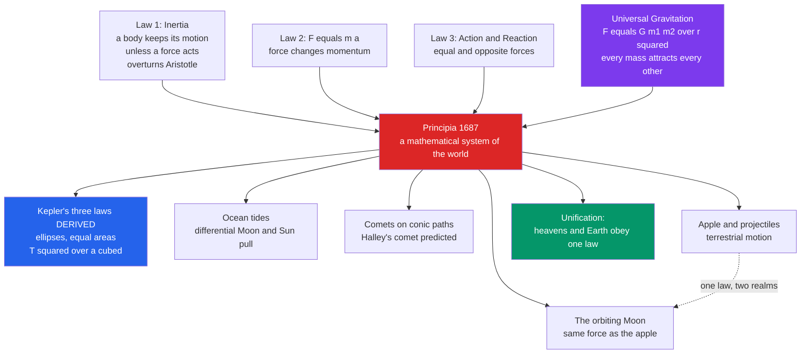

# 🍎 Newtonian Mechanics and the Principia

> [!abstract] TL;DR
> In 1687 Isaac Newton published the **_Philosophiae Naturalis Principia Mathematica_** and, from just **three laws of motion** plus a single law of **universal gravitation** ($F = G m_1 m_2 / r^2$), derived the orbits of the planets, the ocean tides, the paths of comets, and the fall of an apple — all at once. The decisive stroke was **unification**: the *same* force that pulls an apple to the ground holds the Moon in its orbit, abolishing the ancient divide between a corrupt Earth and perfect heavens. Newton *mathematically derived* **Kepler's three laws** from his physics, showing that a handful of principles explain a vast range of phenomena. This completed the Scientific Revolution, installed the **mechanical, deterministic** worldview, and became the very **template of what a scientific theory should be** — a standard so successful it seemed final, until relativity and quantum mechanics revealed even it to be a superb *approximation*.

---

## Intuition

**Analogy:** Toss a ball and it arcs to the ground. Throw it harder and it lands farther away. Now imagine throwing it so hard — ignoring air — that by the time it "falls," the ground has curved away beneath it, so it keeps missing the Earth forever. That is an **orbit**: the Moon is simply an apple that was thrown sideways fast enough to keep falling around us. Newton's genius was to see that **falling and orbiting are the same event**, governed by one force.

Before Newton, the heavens and the Earth were assumed to run on *different rules* — planets moved in perfect circles by their own celestial nature, while earthly things fell because it was their "place" to. Newton's audacious bet was that **there are no two sets of rules**: a single mathematical law of gravity, plus three laws of motion, governs the apple, the cannonball, the Moon, the planets, and the comets alike. When the arithmetic actually came out right — when the Moon's measured acceleration matched surface gravity scaled down by the inverse square of its distance — the universe revealed itself to be one **comprehensible mathematical machine**. That result, more than any single fact, defined what science aspires to be.

---

## How It Works

### The Principia (1687)

Prompted by **Edmond Halley** — who, arguing with Hooke and Wren about the force behind Kepler's ellipses, went to Cambridge to ask Newton what curve an inverse-square force would produce, and got the instant answer "an ellipse" — Newton spent roughly two years writing a **mathematical system of the world**. The *Principia* is austere: written in the language of **classical geometry** (not the calculus Newton had privately invented), it proceeds like Euclid, from definitions and axioms to rigorously proved propositions. Book I builds the general mechanics of forces; Book II treats motion in resisting media; **Book III, "The System of the World,"** turns the machinery on the real cosmos and delivers the planets, the Moon, the tides, and the comets. It is one of the most important books ever written.

### The Three Laws of Motion

A compact, universal foundation for *all* mechanics:

1. **Law of Inertia.** A body remains at rest, or in uniform straight-line motion, *unless acted on by a net force*. This overturns **Aristotle**, for whom motion required a continuous mover; Newton (following Galileo and Descartes) makes *uniform motion the natural state* and treats **force as the cause of change**, not of motion itself.
2. **$F = ma$.** A net force changes a body's **momentum**; more precisely, force equals the rate of change of momentum ($F = dp/dt$). This is the quantitative engine — give the forces, and the future trajectory follows.
3. **Action–Reaction.** For every force there is an *equal and opposite* force. Bodies interact in pairs; this conserves momentum and lets gravity act *mutually* between Sun and planet.

### Universal Gravitation

The revolutionary unifying insight: **every mass attracts every other mass** with a force proportional to both masses and *inversely proportional to the square of the distance between them*:

$$F = G\,\frac{m_1 m_2}{r^2}$$

The *same* $G$, the *same* law, governs the falling apple, the orbiting Moon, and the planets circling the Sun. The ancient **celestial/terrestrial divide dissolves**. The famous "apple and the Moon" test makes it quantitative: if surface gravity is $g$ at the Earth's radius $R_\oplus$, then at the Moon's distance $r$ the acceleration should be $g\,(R_\oplus/r)^2$ — and that number matches the Moon's *actual* centripetal acceleration $4\pi^2 r / T^2$ to about one percent.

### Explaining Kepler — the Decisive Triumph

Newton did not *assume* Kepler's laws; he **derived** them. From $F = ma$ plus the inverse-square force, mathematics forces the conclusions:

- **1st law (ellipses):** a bound orbit under inverse-square gravity is a *conic section* — for planets, an **ellipse with the Sun at one focus**.
- **2nd law (equal areas):** because gravity is a *central* force, **angular momentum is conserved**, so the planet–Sun line sweeps **equal areas in equal times** (fast near perihelion, slow near aphelion).
- **3rd law ($T^2 \propto a^3$):** the square of the orbital period is proportional to the cube of the semi-major axis — a direct consequence of the inverse-square dependence.

He went further: the **tides** as the differential pull of Moon and Sun on the oceans; the **precession of the equinoxes**; and **comets** as bodies on long conic orbits — leading Halley to predict the return of *his* comet. A few principles explaining an enormous range of phenomena: the hallmark of a great theory.



---

## Key Concepts

### Secondary — the core picture

- **Three laws of motion** — inertia, $F = ma$, and action–reaction: the universal grammar of mechanics.
- **Universal gravitation** — one inverse-square law binding apple, Moon, and planets.
- **Unification of the heavens and the Earth** — the single most important conceptual move; there is *one* physics, not two.
- **Newton explains Kepler** — the planetary laws Kepler found empirically *fall out* of Newton's physics as theorems.

### Undergraduate — the mechanisms

- **Inverse-square force yields conic-section orbits** — bound orbits are ellipses, unbound ones parabolas or hyperbolas (comets).
- **Angular momentum conservation** — because gravity is *central*, the areal velocity is constant: this *is* Kepler's second law.
- **The vis-viva relation** — orbital speed and size are linked by energy conservation, fixing the semi-major axis and hence the period.
- **Calculus as the language of change** — Newton (and independently **Leibniz**) invented the calculus of derivatives and integrals that makes continuously varying motion computable; the bitter **priority dispute** followed. Mathematics and physics grew up together.
- **The clockwork universe** — a cosmos of matter, forces, and law, in principle predictable from initial conditions (later dramatized as *Laplace's demon*): the mechanical, deterministic worldview.

### Graduate — foundations, method, and limits

- **"Hypotheses non fingo" ("I feign no hypotheses").** Newton *derived* gravity's law from the phenomena mathematically but *refused to speculate on its cause* — how mass pulls across empty space. He described the *what* and declined the *why*, sharpening the tension between **description and explanation**.
- **Action at a distance** — an unexplained instantaneous force across a vacuum troubled contemporaries (Leibniz, Huygens) and remained a puzzle until **fields** and, ultimately, **general relativity** recast gravity as spacetime curvature.
- **Absolute space and time** — Newton's fixed backdrop for motion, contested by Leibniz's relationism and eventually dissolved by relativity.
- **The eventual limits.** Newtonian mechanics reigned for ~200 years and even *predicted the existence of Neptune* from anomalies in Uranus's orbit (1846). But it fails in the **fast / strong-gravity** regime (superseded by **relativity**, which also explained Mercury's residual perihelion precession) and at the **atomic scale** (superseded by **quantum mechanics**). The greatest theory ever written turned out to be an *approximation* — a profound lesson about the provisional nature of scientific "truth."

---

## Python Demo

This demo makes the central claim concrete: **Newton explains Kepler**. We numerically integrate the two-body problem — a planet moving under an inverse-square pull toward a fixed Sun — using a **symplectic (velocity-Verlet) integrator** that conserves energy so the orbit closes cleanly. From the *raw simulated trajectory* we then read off all three of Kepler's laws, and finally check the "apple and the Moon" unification.

```python
"""
Newton explains Kepler, by simulation.
  (1) Integrate a planet under inverse-square gravity  -> orbit is an ELLIPSE (Kepler 1)
  (2) Equal timesteps sweep EQUAL AREAS                -> Kepler 2 (angular momentum)
  (3) Vary orbit size -> T^2 is proportional to a^3    -> Kepler 3
  (4) "Apple and the Moon": surface gravity scaled by the inverse-square of the
      Earth-Moon distance ratio reproduces the Moon's centripetal acceleration.
Requires: numpy, matplotlib
"""
import numpy as np
import matplotlib.pyplot as plt

GM = 1.0  # gravitational parameter of the Sun (units chosen so G*M_sun = 1)

def accel(r):
    """Inverse-square acceleration toward the origin (the Sun)."""
    d = np.linalg.norm(r)
    return -GM * r / d**3

def simulate(r0, v0, dt, tmax):
    """Velocity-Verlet (symplectic) integration of the two-body problem."""
    r, v = np.array(r0, float), np.array(v0, float)
    a = accel(r)
    ts, rs, vs = [0.0], [r.copy()], [v.copy()]
    t = 0.0
    while t < tmax:
        r = r + v * dt + 0.5 * a * dt**2      # position update
        a_new = accel(r)
        v = v + 0.5 * (a + a_new) * dt        # velocity update
        a = a_new
        t += dt
        ts.append(t); rs.append(r.copy()); vs.append(v.copy())
    return np.array(ts), np.array(rs), np.array(vs)

def period_from_sim(ts, rs):
    """Orbital period = time for the position angle to advance by 2*pi."""
    ang = np.unwrap(np.arctan2(rs[:, 1], rs[:, 0]))
    ang = ang - ang[0]
    k = np.searchsorted(ang, 2 * np.pi)
    a0, a1, t0, t1 = ang[k - 1], ang[k], ts[k - 1], ts[k]
    return t0 + (2 * np.pi - a0) * (t1 - t0) / (a1 - a0)   # linear interpolation

# --- Main orbit: launch perpendicular to the radius, slower than circular -> ellipse
r0, v0 = [1.0, 0.0], [0.0, 0.9]     # v_circ at r=1 is 1.0, so 0.9 -> a mild ellipse
ts, rs, vs = simulate(r0, v0, dt=0.002, tmax=5.2)

# Angular momentum L = x*vy - y*vx should be CONSTANT (this IS Kepler's 2nd law)
L = rs[:, 0] * vs[:, 1] - rs[:, 1] * vs[:, 0]
print(f"Angular momentum L: min={L.min():.6f}  max={L.max():.6f}  (constant => Kepler 2)")

# --- Kepler 2: equal timesteps sweep equal areas. Compare a window at perihelion vs aphelion.
radii = np.linalg.norm(rs, axis=1)
i_peri, i_apo = np.argmin(radii), np.argmax(radii)
K = 60  # same number of timesteps => same elapsed time at both ends

def wedge_area(pts):
    poly = np.vstack([[0, 0], pts])          # triangle fan from the Sun
    x, y = poly[:, 0], poly[:, 1]
    return 0.5 * abs(np.dot(x, np.roll(y, -1)) - np.dot(y, np.roll(x, -1)))  # shoelace

peri_pts = rs[i_peri:i_peri + K]
apo_pts  = rs[i_apo:i_apo + K]
print(f"Area swept in {K} steps near perihelion: {wedge_area(peri_pts):.5f}")
print(f"Area swept in {K} steps near aphelion : {wedge_area(apo_pts):.5f}  (equal => Kepler 2)")

# --- Kepler 3: vary the orbit, measure T from the simulation, check T^2 vs a^3
speeds = [0.70, 0.80, 0.90, 0.95, 0.99]
a_list, T_list = [], []
for v in speeds:
    a_semimajor = 1.0 / (2.0 / 1.0 - v**2 / GM)          # vis-viva at r0 = 1
    t2, r2, _ = simulate([1.0, 0.0], [0.0, v], dt=0.001, tmax=9.0)
    a_list.append(a_semimajor); T_list.append(period_from_sim(t2, r2))
a_arr, T_arr = np.array(a_list), np.array(T_list)
print("\nKepler 3 check (T^2 / a^3 should be constant ~ 4*pi^2 =", f"{4*np.pi**2:.3f}):")
for a, T in zip(a_arr, T_arr):
    print(f"  a={a:.3f}  T={T:.3f}  T^2/a^3={T**2 / a**3:.3f}")

# --- Apple and the Moon: ONE inverse-square law spans both scales
g_surface = 9.81          # m/s^2 at Earth's surface (the falling apple)
R_earth   = 6.371e6       # m
r_moon    = 3.844e8       # m, Earth-Moon distance
T_moon    = 27.32 * 86400 # s, sidereal month
a_predicted = g_surface * (R_earth / r_moon) ** 2       # surface g scaled by 1/r^2
a_actual    = 4 * np.pi**2 * r_moon / T_moon ** 2        # measured centripetal accel
print(f"\nApple & Moon: predicted Moon accel = {a_predicted:.3e} m/s^2")
print(f"              actual   Moon accel = {a_actual:.3e} m/s^2  "
      f"(ratio {a_predicted / a_actual:.3f})")

# --- Visualize: the ellipse + equal-area wedges, and the T^2-vs-a^3 line
fig, (axO, axK) = plt.subplots(1, 2, figsize=(13, 5.6))

axO.plot(rs[:, 0], rs[:, 1], color="#2563eb", lw=1.5, label="simulated orbit")
axO.plot(0, 0, marker="*", ms=18, color="#f59e0b", label="Sun (focus)")
axO.fill(np.vstack([[0, 0], peri_pts])[:, 0], np.vstack([[0, 0], peri_pts])[:, 1],
         color="#dc2626", alpha=0.6, label="equal-time wedge (perihelion, fast)")
axO.fill(np.vstack([[0, 0], apo_pts])[:, 0], np.vstack([[0, 0], apo_pts])[:, 1],
         color="#059669", alpha=0.6, label="equal-time wedge (aphelion, slow)")
axO.set_aspect("equal"); axO.grid(alpha=0.3)
axO.set_title("Kepler 1 & 2 from Newton: an ellipse,\nequal areas in equal times")
axO.legend(loc="upper right", fontsize=8)

axK.plot(a_arr**3, T_arr**2, "o", color="#7c3aed", ms=9, label="simulated orbits")
slope = np.polyfit(a_arr**3, T_arr**2, 1)[0]
xline = np.linspace(0, (a_arr**3).max(), 50)
axK.plot(xline, slope * xline, "--", color="#334155",
         label=f"fit slope={slope:.2f}  (4*pi^2={4*np.pi**2:.2f})")
axK.set_xlabel("a^3  (semi-major axis cubed)")
axK.set_ylabel("T^2  (period squared)")
axK.set_title("Kepler 3 from Newton:\nT^2 proportional to a^3")
axK.legend(); axK.grid(alpha=0.3)

plt.tight_layout()
plt.savefig("newton_explains_kepler.png", dpi=120)
plt.show()
```

Running it shows the angular momentum pinned to a constant, the perihelion and aphelion wedges coming out to the **same area** despite wildly different arc lengths, the ratio $T^2/a^3$ holding steady near $4\pi^2$ across five different orbits, and the Moon's predicted and measured accelerations agreeing to about **one percent** — Newton's laws, and nothing else, reproducing all three of Kepler's empirical rules plus the "apple and the Moon" unification.

---

## Real-World Applications

- **Spaceflight and orbital mechanics.** Every satellite launch, Hohmann transfer, gravity-assist flyby, and interplanetary trajectory is computed with Newtonian gravity; general relativity is only a small correction for most missions. See [[Orbital_Mechanics_and_Celestial_Dynamics]].
- **Engineering and the Industrial Revolution.** Statics, dynamics, structural loads, machines, and ballistics all rest on $F = ma$ and the conservation laws that follow.
- **Predictive astronomy.** Ephemerides, eclipse prediction, and the discovery of **Neptune** (1846) from Uranus's orbital anomalies are Newtonian triumphs; the same method flagged Mercury's *residual* anomaly that Newton could *not* explain, pointing toward relativity.
- **Tides and navigation.** Tide tables derive from the differential lunar and solar pull Newton first quantified.
- **The template of a scientific theory.** Fields from economics to systems biology still aspire to Newton's ideal: a few mathematical laws with broad, precise, testable predictive reach.

---

## Common Pitfalls

- **Thinking the apple "fell on Newton's head" and that was that.** The story is a later embellishment; the real work was the *quantitative* apple-and-Moon calculation and the geometric proof that inverse-square force gives ellipses.
- **Confusing Kepler's laws with Newton's.** Kepler *described* the orbits empirically; Newton *explained* them from deeper laws. The relationship is exactly *phenomenological rule* versus *underlying theory*.
- **Reading $F = ma$ as "force causes motion."** Force causes *change* in motion (acceleration). Uniform motion needs *no* force — the whole point of the first law and the break with Aristotle.
- **Assuming Newton explained *why* gravity acts.** He explicitly did not — *"hypotheses non fingo."* He gave the mathematical law, not a mechanism; the "why" waited for fields and general relativity.
- **Believing a hyper-successful theory must be final.** Newtonian mechanics looked complete for two centuries and is still *wrong* at high speed and small scale. Predictive success is not the same as ultimate truth.
- **Using a non-symplectic integrator for orbits.** Naive Euler or plain RK4 numerically leaks energy and makes the orbit spiral; a symplectic method (as in the demo) keeps it closed — a practical echo of energy conservation.

---

## Related Concepts

- [[History_of_Science_Overview]] — the entry point placing Newton's synthesis as the culmination of the Scientific Revolution.
- [[The_Copernican_Revolution]] — the heliocentric break that Newton's physics *completed* and put on a causal foundation.
- [[Scientific_Method_and_Empiricism]] — the "derive laws from phenomena" method Newton embodied in his *Rules of Reasoning*.
- [[Newtons_Laws_and_Kinematics]] — the Physics-vault treatment of the three laws worked out quantitatively.
- [[Work_Energy_and_Conservation]] — energy and momentum conservation, the through-line the demo relies on.
- [[Lagrangian_Mechanics]] — the elegant reformulation of Newtonian mechanics via a variational principle.
- [[Hamiltonian_Mechanics]] — the phase-space reformulation underlying the symplectic integrator used above.
- [[Orbital_Mechanics_and_Celestial_Dynamics]] — Kepler's laws and two-body motion in the Astronomy vault.
- [[Conic_Sections]] — the ellipses, parabolas, and hyperbolas that inverse-square orbits trace.
- [[Differentiation]] — the calculus of change Newton co-invented to make this physics possible.
- [[Riemann_Integration]] — the integral half of the calculus, the language of accumulated motion.
- [[Systems_of_ODEs]] — the differential-equation viewpoint underlying the numerical two-body integration.
- [[The_Modern_Physics_Revolution]] — how relativity and quantum mechanics later exposed the limits of Newtonian physics.
- [[Special_Relativity_Kinematics]] — the fast-regime theory that superseded Newtonian kinematics.
- [[Introduction_to_General_Relativity]] — gravity re-explained as spacetime curvature, resolving action-at-a-distance.
- [[Schrodinger_Equation]] — the atomic-scale mechanics that replaced Newtonian dynamics for the very small.
- [[Wave_Particle_Duality_and_Uncertainty]] — the quantum break with deterministic, clockwork prediction.
- [[Kuhn_and_Scientific_Revolutions]] — the paradigm framework in which the Newton-to-Einstein shift is the canonical example.
- [[Scientific_Realism]] — whether a theory later shown "false" (like Newton's) was ever approximately true.
- [[Newton_and_the_Mechanical_Universe]] — the History-vault companion on Newton's cultural and philosophical impact.
- [[The_Enlightenment]] — the age whose confidence in reason and law was modeled on Newton's success.

> Forthcoming *History of Science* siblings referenced in prose (not yet written): a *Scientific Revolution Overview* stitching Copernicus-to-Newton, a *Relativity Revolution* deep-dive, and a *Quantum Revolution* deep-dive that together document Newtonian mechanics' eventual limits.

---

## Review Questions

1. **(Secondary)** In your own words, why is it fair to say Newton *unified* the heavens and the Earth? Name one phenomenon on Earth and one in the sky that his *single* law of gravity explains, and state what each ancient tradition assumed instead.
2. **(Undergraduate)** Kepler discovered that planets sweep equal areas in equal times. Explain *why* this must be true for **any** central force (not just gravity), and connect it to a conserved quantity. Then explain why the *specific* inverse-square form is needed to get **ellipses** rather than some other closed curve.
3. **(Graduate)** Newton wrote *"hypotheses non fingo,"* declining to explain *how* gravity acts across empty space, while giving a law that predicted superbly for two centuries. Assess this stance: was refusing a mechanism a scientific virtue or an evasion? Use the later history — fields, general relativity, and Newtonian mechanics' eventual demotion to an *approximation* — to argue whether predictive success should count as evidence of *truth*.

---

## Sources

- Newton, I. (1687/1999). *The Principia: Mathematical Principles of Natural Philosophy* (I. B. Cohen & A. Whitman, Trans.). University of California Press.
- Westfall, R. S. (1980). *Never at Rest: A Biography of Isaac Newton*. Cambridge University Press.
- Cohen, I. B., & Smith, G. E. (Eds.) (2002). *The Cambridge Companion to Newton*. Cambridge University Press.
- Chandrasekhar, S. (1995). *Newton's Principia for the Common Reader*. Oxford University Press.
- [Philosophiæ Naturalis Principia Mathematica (Wikipedia)](https://en.wikipedia.org/wiki/Philosophi%C3%A6_Naturalis_Principia_Mathematica)

---

#history-of-science #newton #principia #classical-mechanics #universal-gravitation
