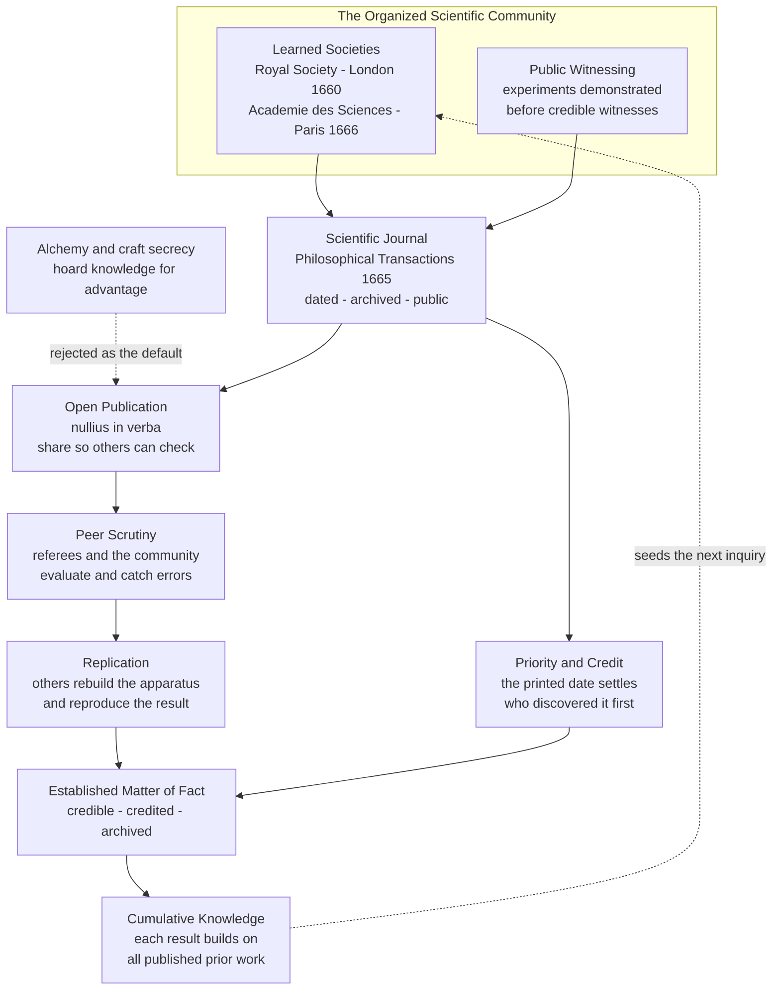

# 🏛️ Scientific Institutions and Societies

> [!abstract] TL;DR
> The Scientific Revolution did not just produce new **ideas** — it invented the **social machinery** that turns isolated discoveries into a **cumulative, self-correcting, communal** enterprise. Four institutions arrived together in the 1660s: the **learned society** *(the Royal Society of London, 1660; the French Académie des Sciences, 1666)*, the **scientific journal** *(the Royal Society's Philosophical Transactions, 1665, the first of its kind)*, the practice of **public witnessing and replication** of experiments, and the cultural **norm of open publication** — *nullius in verba*, "take nobody's word for it." Together these gave science a **memory**, a **communication system**, a way to **assign credit and priority**, and a **community** to catch errors. Over the following centuries this hardened into **peer review**, the **professionalization** of the scientist, and the **Big Science** of the modern era — and it strains today under the **replication crisis** and **publish-or-perish** pressures. Understanding these institutions is essential to understanding how scientific knowledge is actually *produced and validated*, not just discovered.

---

## Intuition

**Analogy:** Imagine a brilliant person who makes a real discovery about the world but writes it only in a private, encrypted notebook that no one else ever reads — the way a **medieval alchemist** hid his recipes so no rival could steal them. When that person dies, the knowledge dies too. No one checked it, so we never learned it was half wrong. No one could build on it, so the next generation starts from zero. A lone genius scribbling in secret cannot build **reliable, cumulative** science, no matter how clever, because there is no community to *verify* the claim, no permanent *record* to preserve it, and no *ledger* saying who found what first.

Now imagine the opposite: a **club** whose whole purpose is that members bring their findings into the open, **demonstrate the experiment in front of witnesses**, write it up in a **dated, printed, archived bulletin** that goes out to everyone, and let the rest of the community pick it apart, reproduce it, and stand on it to reach the next result. That is the invention of the Scientific Revolution that we most take for granted. Not a telescope or an equation — a **social contract**. Science became a *team sport with rules*: share openly, show your evidence, credit the finder, and let the community be the judge. The learned society, the peer-reviewed journal, the public experiment, and the norm of open publishing are that rulebook. They are why science *accumulates* while alchemy merely *repeated itself* for a thousand years.

---

## How It Works

### Why institutions, not just individuals

We tend to narrate science as a parade of lone geniuses — Galileo, Newton, Darwin, Einstein. But a genius who cannot **communicate**, whose claim cannot be **verified**, who receives no **credit** and leaves no **archive**, produces no science at all — only a rumor. Reliable knowledge is a **social** achievement. It requires: (1) **communication** so findings travel; (2) **verification** so errors are caught; (3) **credit and priority** so people are motivated to publish rather than hoard; (4) **archiving** so knowledge persists across generations; and (5) a **community** whose collective scrutiny confers credibility. The Scientific Revolution's deepest innovation was building the **institutions that supply all five**. That is what made knowledge *cumulative* and *reliable*, and it is the subject that the planned sibling note *The Sociology of Scientific Knowledge* (see also [[Sociology_of_Knowledge_and_Science]]) examines in full.

### The learned societies

Organized communities of natural philosophers gave science a **permanent home**. The **Royal Society of London for Improving Natural Knowledge** (founded 1660, chartered 1662) and the French **Académie des Sciences** (1666) were the templates: members met regularly, **demonstrated experiments publicly**, corresponded across borders, and **collectively evaluated** claims. Earlier models pointed the way — the short-lived Italian **Accademia dei Lincei** (1603, which counted Galileo among its members) and Francis Bacon's utopian vision of **"Solomon's House"** in *New Atlantis* (1627), an imagined state-funded research institute. The Royal Society was a self-governing gentlemen's club; the French Académie was a **salaried, state-directed** body under royal patronage — two enduring models (independent society vs. state institution) still visible in science funding today. These bodies institutionalized the empirical program described in [[Scientific_Method_and_Empiricism]]: nature, demonstrated in the room, was the arbiter.

### The scientific journal

In 1665 the Royal Society's secretary **Henry Oldenburg** launched **_Philosophical Transactions_** — the **first scientific journal**, still published today — mere months after the Paris **_Journal des Savants_**. This created a genuinely new institution: the **periodical scientific publication**. A journal article is **dated**, **archived**, and **public**. That combination does three things at once. It **establishes priority** — the printed date settles who discovered a result first, converting the old zero-sum race to secrecy into an incentive to *publish quickly and openly*. It creates science's **collective memory** — a permanent, searchable record that outlives any individual. And it becomes the **communication system** that lets a researcher in one city read, check, and build on a result from another. Oldenburg's vast correspondence network became a **clearing-house**: he solicited reports, dated them on arrival, and circulated them — an early editorial function that would later formalize into refereeing.

### Open publication versus secrecy

This required a profound **cultural shift**. The prior norm, inherited from **alchemy and the craft guilds**, was **secrecy**: knowledge was power, hidden for personal, commercial, or magical advantage, encoded in ciphers and anagrams. The new norm was **openness** — publish so that others can *verify and build upon* your work. The Royal Society stamped this ethic into its motto **_nullius in verba_**: "on the word of no one" — do not accept a claim on authority; **show the evidence** so anyone may check it. Openness became both an **epistemic** value (public evidence is checkable) and a **social** one (shared knowledge advances everyone). The tension with **commercial and military secrecy** never fully disappeared — and it recurs today in industrial R&D, classified research, and patent strategy — but the *default* of science flipped from *hide* to *disclose*.

### Public witnessing, replication, and peer scrutiny

How does a mere claim become an accepted **"matter of fact"**? Steven **Shapin** and Simon **Schaffer**'s landmark study *Leviathan and the Air-Pump* (1985) analyzed how Robert **Boyle** established facts using his **air pump**: through **public witnessing** by credible observers and, in principle, **replication** by others who built their own apparatus. Experimental credibility was **socially constructed** — it mattered *who* counted as a trustworthy witness (in the 1660s, typically gentlemen, whose social standing vouched for their honesty), how vividly the experiment was reported so distant readers could be **"virtual witnesses,"** and whether the result could be reproduced. From these demonstrations and the correspondence networks grew the ancestor of modern **peer review**: the collective evaluation of claims. Formal refereeing — external experts vetting a manuscript before publication — developed gradually and only became standard practice in the **mid-20th century**, far later than most people assume. It remains the community's chief mechanism for catching errors and conferring credibility, with well-known strengths (independent scrutiny) and flaws (slowness, conservatism, bias, and reviewers who can be fooled).

### The norms of science and professionalization

Sociologist Robert **Merton** (1942) distilled the ideal **ethos** of the scientific community into four norms, remembered as **CUDOS**: **C**ommunalism (findings are shared property, not private), **U**niversalism (claims are judged by impersonal criteria, not the claimant's identity), **D**isinterestedness (the reward system discourages fraud and self-dealing), and **O**rganized **S**kepticism (all claims are subject to structured, communal doubt). These describe how the institutions are *supposed* to work; real science often deviates, which is exactly what the sociology of science studies. Meanwhile the **role** of the scientist professionalized: from **gentleman-amateurs** and **patronage** clients toward a **salaried, university- and state-funded career**. The very word **"scientist"** was coined only in **1833** (by William Whewell). The 19th-century **German research university** model fused teaching with original research and the **laboratory**, and the 20th century brought **"Big Science"** — the huge, state-funded, team-based projects (see the planned siblings *The Atomic Age* and *Science, Technology and Society*) that made the institution-building of the 1660s a matter of national budgets.

### Flow / Architecture



---

## Key Concepts

**Secondary (foundations)**
- **Learned society** — an organized community of scientists who meet, demonstrate, correspond, and collectively evaluate claims; e.g., the **Royal Society** (1660) and the **Académie des Sciences** (1666).
- **Scientific journal** — a dated, archived, public periodical of research reports; the first was the Royal Society's **_Philosophical Transactions_** (1665).
- **_Nullius in verba_** — "take nobody's word for it": the Royal Society's motto and the core of the **open-publication** norm — show the evidence rather than assert on authority.
- **Peer review** — evaluation of a scientific claim by other qualified members of the community before it is accepted or published.

**Undergraduate (mechanism)**
- **Priority and credit** — the printed publication date establishes who found a result **first**, turning the incentive away from secrecy and toward *fast, open* disclosure.
- **Open publication vs. secrecy** — the cultural flip from the guarded knowledge of **alchemy and the guilds** to the norm of sharing so others can verify and build; openness as both an epistemic and a social value.
- **Public witnessing and virtual witnessing** — establishing a "matter of fact" by demonstrating experiments before credible observers, and by writing them up vividly enough that distant readers become "virtual witnesses" (Shapin & Schaffer).
- **Replication** — independent reproduction of a result as the deepest test of its reliability; central in principle, unevenly practiced.
- **Professionalization** — the shift from gentleman-amateurs and patronage to a salaried, university- and state-funded scientific career; the word **"scientist"** was coined in **1833**.

**Graduate (nuance and critique)**
- **Mertonian norms (CUDOS)** — Communalism, Universalism, Disinterestedness, Organized Skepticism: the *idealized* normative structure of the scientific community, against which real behavior (secrecy, priority disputes, fraud, bias) can be measured.
- **The social construction of experimental fact** — Shapin & Schaffer's argument that experimental credibility depended on social conventions (who counts as a trustworthy witness, how results are reported), not on brute nature alone — a founding text of the **sociology of scientific knowledge**.
- **The limits and pathologies of peer review** — conservatism, slowness, reviewer bias, susceptibility to fraud, and the "Matthew effect" (credit accruing to the already-eminent); institutions that catch some errors and manufacture others.
- **The replication crisis** — the 2010s discovery that large fractions of published findings (notably in psychology and biomedicine) fail to replicate, exposing distortions from **publish-or-perish**, p-hacking, and publication bias — and prompting reforms: **preregistration**, **open data**, **registered reports**.
- **Open access, preprints, and metrics** — the modern re-litigation of *nullius in verba*: paywalled journals vs. **open-access** and **preprint servers** (arXiv, bioRxiv), and the double-edged rise of **citation metrics** and impact factors as proxies for quality.

---

## Python Demo

We **model why the social organization of science accelerates discovery**. Treat knowledge as a growing pile of building blocks, where a **new discovery is a recombination of two existing published ideas** (the "ideas are combinations of prior ideas" view of innovation). In an **open, networked** regime every researcher can combine **any** two published blocks, so the number of accessible combinations scales with the *square* of the shared corpus. In a **closed, secretive** regime knowledge fragments into `m` isolated silos and you can only recombine ideas **within** your own silo — cutting the available combinations by a factor of `m`, because a block in silo A can never be combined with a block in silo B. Both regimes saturate at the same finite frontier of knowable facts; open science just gets there **far faster**. The second panel charts the historically observed **exponential growth of the scientific literature** (de Solla Price's "law" that the number of journals has doubled roughly every 15 years since ~1750).

```python
# Why open, networked science compounds faster than closed, secretive work.
# Model: a new discovery recombines TWO published ideas.
#   OPEN   -> any two of P published blocks are combinable  (~ P^2 pairs)
#   CLOSED -> m secret silos; only within-silo pairs count  (~ P^2 / m pairs)
# Both saturate at a finite frontier M of knowable facts.
import numpy as np
import matplotlib.pyplot as plt

M   = 1000    # finite frontier: total discoverable facts
r   = 3e-5    # recombination rate constant
m   = 8       # number of isolated secret silos in the closed regime
T   = 400     # timesteps
P0  = 5       # seed knowledge

def simulate(fragmentation):
    """fragmentation = 1 for open; = m for closed (silo penalty)."""
    P = [float(P0)]
    for _ in range(T):
        cur = P[-1]
        # accessible pairs of published ideas, reduced by the silo penalty,
        # and slowed as we approach the finite frontier (1 - P/M).
        pairs = 0.5 * cur * (cur - 1) / fragmentation
        growth = r * pairs * (1.0 - cur / M)
        P.append(min(M, cur + max(0.0, growth)))
    return np.array(P)

open_k   = simulate(fragmentation=1)   # any two published ideas combine
closed_k = simulate(fragmentation=m)   # only within-silo combinations

def time_to(frac, series):
    idx = np.argmax(series >= frac * M)
    return idx if series[idx] >= frac * M else None

print(f"Open   reaches 90% of the frontier at step: {time_to(0.9, open_k)}")
print(f"Closed reaches 90% of the frontier at step: {time_to(0.9, closed_k)}")
print(f"Knowledge at final step -> open: {open_k[-1]:.0f}, closed: {closed_k[-1]:.0f}")

# Historical growth of the scientific literature (Price's Law of exponential growth).
# ~10 journals in 1750, doubling roughly every 15 years.
years    = np.arange(1700, 2001, 5)
n_1750   = 10.0
doubling = 15.0
journals = n_1750 * 2 ** ((years - 1750) / doubling)

fig, (ax1, ax2) = plt.subplots(1, 2, figsize=(13, 5))

ax1.plot(open_k,   color="#1b7837", lw=2.5, label="Open / networked  (nullius in verba)")
ax1.plot(closed_k, color="#762a83", lw=2.5, ls="--", label=f"Closed / secretive  ({m} silos)")
ax1.axhline(M, color="grey", ls=":", lw=1, label="Frontier of knowable facts")
ax1.set_xlabel("Time  (research generations)")
ax1.set_ylabel("Accumulated verified knowledge (blocks)")
ax1.set_title("Open science compounds faster\n(recombination scales with the SHARED corpus)")
ax1.legend(loc="lower right"); ax1.grid(alpha=0.3)

ax2.semilogy(years, journals, color="#2166ac", lw=2.5)
ax2.set_xlabel("Year")
ax2.set_ylabel("Number of scientific journals (log scale)")
ax2.set_title("The exponential rise of the scientific literature\n(Price's Law: doubling ~ every 15 years)")
ax2.grid(alpha=0.3, which="both")
ax2.annotate("Philosophical\nTransactions, 1665",
             xy=(1700, n_1750 * 2 ** ((1700 - 1750) / doubling)),
             xytext=(1720, 2), fontsize=9,
             arrowprops=dict(arrowstyle="->", color="black"))

plt.tight_layout()
plt.savefig("scientific_institutions.png", dpi=120)
print("\nSaved figure: scientific_institutions.png")
```

The left panel makes the institutional argument quantitative: because a discovery *builds on all published prior work*, the open regime's growth is driven by the **entire shared corpus**, while secrecy walls knowledge into silos and throws away every cross-silo combination — so the open curve races to the frontier while the closed one crawls. The right panel shows the empirical fingerprint of the institutions this note describes: once the journal and the society existed, the scientific literature grew **exponentially** for three centuries. The machinery worked.

---

## Real-World Applications

- **Modern journals and peer review.** *Nature*, *Science*, *Cell*, *PNAS*, and tens of thousands of specialist journals are the lineal descendants of *Philosophical Transactions* — still dating submissions to fix priority, still using referees to gate credibility.
- **Preprint servers and open access.** **arXiv** (physics/CS, 1991) and **bioRxiv/medRxiv** revived *nullius in verba* for the internet age: post openly and immediately, let the whole community referee in public. Open-access mandates from funders (Plan S) push the same norm.
- **Reproducibility reforms.** In response to the **replication crisis**, journals and funders now push **preregistration**, **registered reports**, **open data/code**, and independent **replication** projects — 21st-century institutional machinery enforcing the 17th-century ideal that a result you cannot check is not yet knowledge.
- **Software engineering as institutionalized peer review.** Modern **code review** (pull requests, required approvals) is a direct structural analog: a change is not merged into the shared codebase until peers have scrutinized it — see [[Code_Review_Best_Practices]].
- **Open-source and open-standards communities.** The IETF's rough-consensus-and-running-code, and open-source projects generally, run on the Mertonian norms — communal ownership, public scrutiny, credit via commit history — showing the model generalizes far beyond natural science.
- **National academies and funding bodies.** Today's national academies, the NSF, and the CNRS are the institutional heirs of the Royal Society and the Académie des Sciences — the "Solomon's House" that Bacon only imagined, now realized as state science policy.

---

## Common Pitfalls

- **The lone-genius myth.** Narrating science purely as individual brilliance ignores that a claim becomes *knowledge* only after communal communication, verification, credit, and archiving. Newton stood on published giants — and published through the Royal Society.
- **Assuming peer review is ancient and infallible.** Formal external refereeing is largely a **20th-century** development, and it is a filter, not a proof: it is slow, conservative, biasable, and has repeatedly failed to catch fraud or error. Peer review lowers the error rate; it does not zero it.
- **Confusing "published" with "true."** Publication confers *credibility*, not certainty. The replication crisis is the reminder that a large fraction of published claims do not hold up — publication is the *start* of scrutiny, not its end.
- **Treating the Mertonian norms as description rather than ideal.** CUDOS is how science is *supposed* to behave. Real science features priority races, secrecy, bias, and the Matthew effect. The gap between norm and practice is a feature to analyze, not a scandal to deny.
- **Ignoring who counts as a witness.** Credibility has always been partly social. Historically, "credible witnesses" were gentlemen; today, prestige of institution and journal still shapes what gets believed. Universalism is an aspiration, not an automatic guarantee.
- **Letting metrics eat the mission.** **Publish-or-perish**, citation counts, and impact factors are proxies for quality that, when made targets, distort behavior (salami-slicing, p-hacking, citation cartels) — Goodhart's law applied to the institutions of science.

---

## Related Concepts

- [[Scientific_Method_and_Empiricism]] — the empirical, experiment-first method that the learned societies **institutionalized** and enforced through *nullius in verba*.
- [[History_of_Science_Overview]] — the parent survey; this note is the "social infrastructure" chapter of the Scientific Revolution.
- [[The_Copernican_Revolution]] — the intellectual break whose successors needed societies and journals to consolidate and communicate their results.
- [[Sociology_of_Knowledge_and_Science]] — the modern sociological study of how communities socially construct, validate, and stratify knowledge; the deep theory behind witnessing, credibility, and the Mertonian norms.
- [[The_Printing_Revolution]] — the prior technology without which the dated, archived, mass-circulated **scientific journal** would have been impossible.
- [[The_Scientific_Revolution]] — the broader historical event of which these institutions are the social-organizational dimension.
- [[The_Enlightenment]] — the movement that the new societies, journals, and public experiments helped spread across 18th-century Europe.
- [[Newton_and_the_Mechanical_Universe]] — Newton served as Royal Society president; the *Principia* was published under the Society's imprimatur, a case study in institution-mediated science.
- [[Popper_and_Falsification]] — a philosophical crystallization of "organized skepticism": a claim earns standing by surviving communal attempts to refute it.
- [[Kuhn_and_Scientific_Revolutions]] — reframes scientific consensus as something a **community** holds (paradigms), foregrounding the social dimension this note describes.
- [[Scientific_Realism]] — the debate over *what* the communal validation machinery is ultimately tracking about the world.
- [[Code_Review_Best_Practices]] — the contemporary software-engineering analog of peer review and communal scrutiny of shared work.
- [[Social_Capital_and_Trust]] — learned societies function as trust networks; credibility and witnessing run on exactly this social capital.
- [[Work_Organizations_and_Bureaucracy]] — the professionalization and bureaucratization of science (universities, labs, funding agencies) that grew from these first societies.

*Planned History-of-Science siblings referenced above — The Scientific Revolution Overview, The Sociology of Scientific Knowledge, Science, Technology and Society, The Ethics and Politics of Science, The Reach and Future of Science, and The Atomic Age — are part of this vault's roadmap but not yet written.*

---

## Review Questions

**Secondary**
1. Name the first scientific journal and the year it began, and explain in your own words what the Royal Society's motto *nullius in verba* means. Why was replacing the norm of **secrecy** with the norm of **open publication** so important for building reliable science?

**Undergraduate**
2. A researcher makes a genuine discovery but keeps it entirely secret until they can profit from it. Using the ideas of **priority/credit**, **verification**, **archiving**, and **cumulative recombination** from this note, explain concretely how the *institutions* of science (the society, the dated journal, public witnessing, peer scrutiny) change that researcher's incentives and why the community as a whole discovers more, faster, when knowledge is shared. Relate this to the open-vs-closed model in the Python demo.

**Graduate**
3. Merton's **CUDOS** norms describe science as communal, universalist, disinterested, and organized-skeptical — yet the **replication crisis**, **publish-or-perish** metrics, and priority disputes show real science deviating sharply from that ideal. Drawing on Shapin & Schaffer's account of the **social construction of matters of fact** and the **limits of peer review**, argue whether these deviations are (a) failures of otherwise sound institutions to be reformed, or (b) evidence that scientific credibility is *inherently* social and negotiated. What reforms (preregistration, open data, open access) follow from your view, and what would they *not* fix?

---

## Sources

- Shapin, Steven & Schaffer, Simon. *Leviathan and the Air-Pump: Hobbes, Boyle, and the Experimental Life.* Princeton University Press, 1985. — The foundational study of public witnessing and the social establishment of experimental "matters of fact."
- Merton, Robert K. "The Normative Structure of Science" (1942), in *The Sociology of Science.* University of Chicago Press, 1973. — The CUDOS norms of the scientific community.
- de Solla Price, Derek J. *Little Science, Big Science.* Columbia University Press, 1963. — The exponential growth of the scientific literature and the transition to Big Science.
- The Royal Society. "History of the Royal Society" and "Philosophical Transactions: 350 years of publishing." — https://royalsociety.org/about-us/history/
- Csiszar, Alex. *The Scientific Journal: Authorship and the Politics of Knowledge in the Nineteenth Century.* University of Chicago Press, 2018. — On how the journal and refereeing became the institutions we know.

---

#history-of-science #royal-society #scientific-journals #peer-review #open-science
