# 🔬 The Birth of Modern Biology

> [!abstract] TL;DR
> Biology became a **science** the moment people stopped taking the word of ancient authorities and started **looking, cutting, magnifying, and counting** for themselves. In one remarkable arc from the Renaissance to the 19th century, **Vesalius** rebuilt anatomy on direct human dissection, **Harvey** used *experiment and quantitative reasoning* to prove blood circulates in a closed loop, **Hooke** and **Leeuwenhoek** turned the microscope into a window onto a hidden universe of cells and "animalcules," **Linnaeus** imposed a universal order on the chaos of living things, and **Schleiden**, **Schwann**, and **Virchow** unified it all under the **cell theory**. Life stopped being a matter of Galen's authority and folklore and became something you could **dissect, magnify, classify, and explain** — laying the foundations for the great unifying theories to come: evolution, genetics, and molecular biology.

---

## Intuition

**Analogy:** Imagine your only guide to a foreign city is a 1,400-year-old map, revered as sacred, copied by hand for generations, and never checked against the streets themselves. It shows a river where there is now a boulevard, a gate that was demolished centuries ago. Everyone *knows* the map is authoritative, so when the streets disagree with it, they assume they misread the streets. Then one day someone decides to walk the city with the map in hand and simply **draw what they actually see**. Suddenly the map is exposed as a beautiful fiction, and a real one can be built.

That is exactly what happened to biology. For over a millennium the "map" was **Galen's** anatomy and physiology and **Aristotle's** biology — much of it inferred from animal dissection, some of it flatly wrong, all of it revered. Modern biology was born when people began to *walk the city*: Vesalius dissecting actual human bodies and drawing the truth; Harvey tracing where the blood really goes and proving it flows in a loop; Leeuwenhoek grinding a lens and discovering an entire living world no one had ever seen; Linnaeus giving every organism a precise two-word address. **Observation, experiment, instruments, and classification** replaced ancient authority — and life became knowable.

---

## How It Works

### Core Mechanics

Modern biology did not emerge from a single discovery but from four reinforcing strands, each answering a different question about *how* to study life:

1. **Start point: the tyranny of ancient authority.** From antiquity through the Renaissance, medicine and biology were dominated by **Galen** (2nd c. CE), whose physiology and anatomy — partly extrapolated from apes and pigs because human dissection was restricted — contained deep errors, and by **Aristotle's** natural history. Texts were revered *over* fresh observation; to disagree with Galen was almost heresy. The precondition for progress was the willingness to **look again**.

2. **Anatomy — Vesalius and observation over authority.** **Andreas Vesalius** published *De Humani Corporis Fabrica* in **1543** — the very year of Copernicus's heliocentric book. Basing anatomy on direct, systematic **human dissection** and stunningly accurate illustration, he publicly corrected dozens of Galen's mistakes. Vesalius established the principle that the body is known by *cutting and seeing*, not by citation — the birth of modern anatomy.

3. **Physiology — Harvey and the experimental method.** **William Harvey** published *De Motu Cordis* in **1628**, using **experiment and quantitative reasoning** to prove that blood **circulates** in a closed loop driven by the heart as a pump — demolishing Galen's model in which the liver continuously *makes* blood from food and the tissues *consume* it. Harvey simply computed how much blood the heart moves per hour: the number is so enormous that no body could produce or absorb it, so the blood *must* recirculate. Physiology became **quantitative** (see the demo below).

4. **Instruments — the microscope reveals a hidden world.** **Robert Hooke's** *Micrographia* (**1665**) coined the word **"cell"** when he saw the box-like pores of cork. **Antonie van Leeuwenhoek**, grinding his own superb single-lens microscopes, discovered **"animalcules"** — bacteria, protozoa, sperm, and blood cells — an entire invisible living universe. New instruments opened worlds that reasoning alone could never reach.

5. **Classification — Linnaeus imposes order.** **Carl Linnaeus** in *Systema Naturae* (**1735**) built a hierarchical classification of all known life and standardized **binomial nomenclature**: every species gets a two-word Latin name, *Genus species* (e.g., *Homo sapiens*). This gave biology a **universal language** and imposed order on runaway biodiversity — though Linnaeus still saw species as **fixed** creations, a pre-evolutionary view.

6. **The origin of life itself.** Alongside all this ran fierce debate over **spontaneous generation** — do maggots simply arise from rotting meat? **Francesco Redi** (1668) and later **Louis Pasteur** (1859) disproved it with controlled experiments (covered flasks, swan-necked flasks). Developmental biology argued **preformation vs. epigenesis**: is the organism preformed in miniature, or does it build up gradually?

7. **The unifying theory — cell theory.** **Matthias Schleiden** (plants, 1838) and **Theodor Schwann** (animals, 1839) proposed that **all living things are made of cells**, the basic unit of life. **Rudolf Virchow** (1855) completed it with *omnis cellula e cellula* — **all cells arise from pre-existing cells**. Cell theory did for biology what atomic theory did for chemistry: it provided a single foundational unit.

8. **Toward evolution and molecular biology.** Accumulating anatomy, classification, microscopy, fossils, and biogeography set the stage for the **Darwinian revolution** — a unifying explanation for life's diversity and relatedness — and, a century later, the **molecular biology** revolution that would explain the cell's inner machinery.

### Flow / Architecture

```mermaid
graph LR
    subgraph Authority["Ancient Authority"]
      Gal["Galen anatomy<br/>and physiology<br/>much of it wrong"]
      Ari["Aristotle biology<br/>reverence for texts"]
    end
    subgraph Observe["Observation and Dissection"]
      Ves["Vesalius 1543<br/>human dissection<br/>accurate anatomy"]
    end
    subgraph Experiment["Experiment and Measurement"]
      Har["Harvey 1628<br/>blood circulates<br/>quantitative proof"]
    end
    subgraph Instrument["Instruments"]
      Hoo["Hooke 1665<br/>coined the word cell"]
      Lee["Leeuwenhoek<br/>animalcules and microbes"]
    end
    subgraph Order["Classification"]
      Lin["Linnaeus 1735<br/>binomial nomenclature<br/>Genus species"]
    end
    subgraph Unify["Unifying Theory"]
      Cell["Cell theory 1839<br/>Schleiden and Schwann<br/>Virchow all cells from cells"]
      Evo["Darwinian evolution<br/>then molecular biology"]
    end
    Gal --> Ves
    Ari --> Ves
    Ves --> Har
    Har --> Hoo
    Hoo --> Lee
    Lee --> Lin
    Lin --> Cell
    Cell --> Evo

    style Gal fill:#334155,color:#fff
    style Ari fill:#334155,color:#fff
    style Ves fill:#dc2626,color:#fff
    style Har fill:#d97706,color:#fff
    style Hoo fill:#0891b2,color:#fff
    style Lee fill:#0891b2,color:#fff
    style Lin fill:#059669,color:#fff
    style Cell fill:#7c3aed,color:#fff
    style Evo fill:#2563eb,color:#fff
```



---

## Key Concepts

### Secondary — the foundations
- **Observation over authority.** The core move: trust careful looking and dissection over ancient texts. Vesalius embodied it in anatomy.
- **The experimental method in biology.** Harvey did not just observe — he *intervened and measured*, applying the physicist's approach to a living body.
- **Binomial nomenclature.** Every species named *Genus species* in Latin — a universal, unambiguous label (*Homo sapiens*, *Escherichia coli*).
- **The cell.** The basic structural and functional unit of life, first glimpsed by Hooke and made a universal principle by cell theory.

### Undergraduate — the mechanisms
- **Quantitative physiology.** Harvey's argument is a *calculation*: stroke volume times heart rate proves the pumped volume is impossibly large to be made fresh — so blood must circulate.
- **Instrument-driven discovery.** The microscope did not refine an existing question; it revealed **new objects** (cells, microbes) that reshaped what biology was about — a pattern where tools precede theory.
- **Hierarchical classification.** Linnaean ranks (**Kingdom → Phylum → Class → Order → Family → Genus → Species**) nest groups within groups, a structure that would later be reinterpreted as an evolutionary tree.
- **Refuting spontaneous generation.** Redi and Pasteur used **controls** — covered vs. open, straight-necked vs. swan-necked flasks — to isolate the single variable of airborne contamination; a template of experimental design.

### Graduate — interpretation and significance
- **Pre-evolutionary classification.** Linnaeus's fixed "types" were a *practical* ordering, not a causal theory; Darwin later supplied the causal engine that turned the nested hierarchy into common descent. See [[Phylogenetics_and_the_Tree_of_Life]].
- **Cell theory as unification.** By declaring one universal unit, cell theory made biology *mechanistically continuous* from microbes to whales — the conceptual ground on which biochemistry, genetics, and molecular biology were later built.
- **Observation vs. experiment vs. classification.** These are three distinct epistemic tools; the "birth of modern biology" is really the story of their integration, not the triumph of any one.
- **Why biology "matured late."** Life's complexity, variability, and the difficulty of controlled experiment meant biology reached its great unifying theories (evolution, cell theory) roughly two centuries after physics reached Newtonian mechanics.

---

## Python Demo

This demo reconstructs **Harvey's quantitative argument** — the elegant early use of arithmetic to overturn a 1,400-year-old theory — and pairs it with a **Linnaean classification tree** showing how binomial nomenclature organizes biodiversity. It prints Harvey's numbers, then visualizes both ideas. Requires only `matplotlib`; `numpy` is optional and not needed here.

```python
"""
The Birth of Modern Biology, quantified:
  1. Harvey's 1628 argument that blood must CIRCULATE (it is pumped far too
     fast to be made fresh and consumed, as Galen believed).
  2. A Linnaean classification tree of Homo sapiens (1735), showing the
     nested ranks and the binomial 'Genus species' name.
Requires: matplotlib   (numpy optional, not used)
"""
import matplotlib.pyplot as plt

# =====================================================================
# 1. HARVEY'S QUANTITATIVE ARGUMENT
# ---------------------------------------------------------------------
# Galen taught that the liver continuously MAKES blood from food and the
# tissues USE IT UP. Harvey asked a quantitative question no one had asked:
# how much blood does the heart actually move? If the number is absurd, the
# blood cannot be made and consumed each pass -- it must RECIRCULATE.
stroke_volume_L = 0.060      # blood ejected per heartbeat (~60 mL)
heart_rate_bpm  = 70         # beats per minute
total_blood_L   = 5.0        # total blood in an adult body
daily_food_L    = 2.0        # rough daily food + drink intake (Galen's "source")

per_min  = stroke_volume_L * heart_rate_bpm
per_hour = per_min * 60
per_day  = per_hour * 24

print("HARVEY'S ARGUMENT (1628)")
print(f"  Blood pumped per minute : {per_min:8.2f} L")
print(f"  Blood pumped per hour   : {per_hour:8.1f} L")
print(f"  Blood pumped per day    : {per_day:8.0f} L")
print(f"  Total blood in body     : {total_blood_L:8.1f} L")
print(f"  The heart moves the body's ENTIRE blood volume "
      f"{per_hour / total_blood_L:.0f}x every HOUR")
print(f"  Per day it moves {per_day / daily_food_L:.0f}x more blood "
      f"than the body could possibly eat")
print("  => blood cannot be made fresh and used up; it must RECIRCULATE\n")

# =====================================================================
# FIGURE
# =====================================================================
fig, (axL, axR) = plt.subplots(1, 2, figsize=(13, 6))

# --- Panel L: the four volumes, on a log scale ---
labels = ["Daily food\nintake", "Total blood\nin body",
          "Pumped\nper hour", "Pumped\nper day"]
values = [daily_food_L, total_blood_L, per_hour, per_day]
colors = ["#059669", "#2563eb", "#d97706", "#dc2626"]

bars = axL.bar(labels, values, color=colors)
axL.set_yscale("log")
axL.set_ylabel("Litres (log scale)")
axL.set_title("Harvey 1628: the heart moves impossibly much blood\n"
              "to be made fresh each pass -> it must circulate")
for b, v in zip(bars, values):
    axL.text(b.get_x() + b.get_width() / 2, v * 1.2, f"{v:,.0f} L",
             ha="center", va="bottom", fontsize=9)
axL.grid(axis="y", which="both", ls=":", alpha=0.4)

# --- Panel R: Linnaean classification of Homo sapiens ---
ranks = ["Kingdom", "Phylum", "Class", "Order", "Family", "Genus", "Species"]
taxa  = ["Animalia", "Chordata", "Mammalia", "Primates",
         "Hominidae", "Homo", "Homo sapiens"]
n = len(ranks)
axR.set_xlim(0, 10)
axR.set_ylim(0.3, n + 0.7)
axR.axis("off")
axR.set_title("Linnaeus 1735: nested ranks +\n"
              "binomial name  'Genus species'")
for i, (rk, tx) in enumerate(zip(ranks, taxa)):
    y = n - i
    box_color = "#dc2626" if rk == "Species" else "#0891b2"
    axR.text(2.6, y, rk, ha="right", va="center", fontsize=10, color="#334155")
    axR.text(3.0, y, tx, ha="left", va="center", fontsize=11, color="white",
             bbox=dict(boxstyle="round,pad=0.3", fc=box_color, ec="none"))
    if i < n - 1:                      # arrow to the next (narrower) rank
        axR.annotate("", xy=(3.4, y - 0.72), xytext=(3.4, y - 0.28),
                     arrowprops=dict(arrowstyle="->", color="#94a3b8"))

plt.tight_layout()
plt.savefig("birth_of_modern_biology.png", dpi=120)
plt.show()
```

Running this prints that the heart pumps about **252 L/hour** and **6,048 L/day** — moving the body's entire 5 L of blood roughly **50 times every hour** and pumping over **3,000 times** more than a person could eat in a day. Galen's "made fresh and consumed" model is quantitatively impossible; the blood *must* return and be reused. The right panel shows how Linnaeus's nested ranks funnel from the broad *Animalia* down to the precise binomial *Homo sapiens* — one universal address for every living thing.

---

## Real-World Applications

- **Binomial nomenclature is still law.** Every species you read about — *Escherichia coli*, *SARS-CoV-2*'s host *Rhinolophus*, *Panthera leo* — carries a Linnaean name governed by international codes of nomenclature; it is the backbone of biodiversity databases, medicine, and conservation.
- **Cell theory underpins all of medicine.** Cancer (uncontrolled cell division), stem-cell therapy, histology, and every diagnostic biopsy rest on Virchow's principle that all cells come from cells.
- **Harvey's circulation model runs cardiology.** Cardiac output, ejection fraction, and stroke volume — the exact quantities Harvey reasoned about — are measured daily in ICUs and echocardiograms.
- **The microscope built microbiology.** Leeuwenhoek's animalcules became the germ theory of disease, antibiotics, and the entire field of microbiology and immunology.
- **Refuting spontaneous generation founded sterile technique.** Pasteur's disproof directly produced pasteurization, aseptic surgery, and food-safety practice.

---

## Common Pitfalls

- **"Vesalius/Harvey instantly overturned Galen."** In reality, Galenic medicine persisted for generations after each discovery; paradigm change in biology was slow and contested, not a clean switch.
- **Reading evolution into Linnaeus.** Linnaeus's hierarchy looks like a family tree, but he believed species were **fixed and separately created**. The tree became *evolutionary* only with Darwin, a century later. See [[Natural_Selection_and_Adaptation]].
- **Crediting Hooke with "discovering the cell."** Hooke saw and named the empty *walls* of dead cork cells; he did not grasp the cell as the living unit of life. That synthesis waited for Schleiden, Schwann, and Virchow.
- **Assuming the microscope "just improved" old biology.** Its deeper effect was to reveal *entirely new objects* (microbes, cells) that redefined the subject — an instrument-driven revolution, not a refinement.
- **Treating spontaneous generation as obviously silly.** Given the evidence available, it was a *reasonable* hypothesis; only carefully controlled experiments (Redi, Pasteur) could settle it — a lesson in why controls matter.
- **Whig history of biology.** Praising "the ones who were right" and mocking Galen ignores that his system was coherent, useful, and rational given its evidence — the same presentism warned against in [[History_of_Science_Overview]].

---

## Related Concepts

The dedicated *History of Science* siblings that continue this arc — a **Scientific Revolution Overview**, **Scientific Method and Empiricism**, **Germ Theory and Modern Medicine**, **The Darwinian Revolution**, and **The Molecular Biology Revolution** — are referenced here in prose because they are not yet written. The wikilinks below point to **verified** notes elsewhere in the vault:

- [[The_Scientific_Revolution]] — the broader 16th–17th-century break with inherited authority; biology's transformation is one front of it.
- [[History_of_Science_Overview]] — the entry point situating this story among the three great scientific revolutions.
- [[Ancient_and_Prehistoric_Science]] — the Aristotelian and Galenic starting point of "reverence for texts over fresh observation."
- [[Medieval_and_Renaissance_Science]] — the recovery of ancient learning and institutional setting that Vesalius and Harvey worked within.
- [[Islamic_Golden_Age_Science]] — the transmission chain (including Ibn al-Nafis's earlier insight into pulmonary circulation) that preserved and advanced the corpus Harvey inherited.
- [[The_Cell_Theory_and_Cell_Types]] — the Biology-vault deep dive on Schleiden, Schwann, Virchow, and the cell as life's unit.
- [[The_Circulatory_and_Respiratory_Systems]] — the modern physiology of the closed circulatory loop Harvey proved.
- [[Phylogenetics_and_the_Tree_of_Life]] — how the Linnaean nested hierarchy became an evolutionary tree.
- [[Evidence_for_Evolution]] — anatomy, classification, fossils, and biogeography that set the stage for Darwin.
- [[Natural_Selection_and_Adaptation]] — the causal engine that reinterpreted fixed Linnaean "types" as common descent.
- [[The_History_of_Life_on_Earth]] — the fossil and biogeographic record that accumulated during this period.
- [[Bacteria_and_Archaea]] — the "animalcules" Leeuwenhoek first saw through his lenses.
- [[Vaccines_and_Antibiotics]] — the medicine that grew from the microscope and the refutation of spontaneous generation.
- [[Renaissance_and_Baroque]] — the artistic culture of accurate observation and anatomical drawing that shaped Vesalius's *Fabrica*.
- [[The_Italian_Renaissance]] — the humanist rediscovery and print culture that made Vesalius's illustrated anatomy possible.
- [[Aristotle]] — the natural historian whose fixed, teleological biology framed the pre-modern view of life.

---

## Review Questions

1. **(Secondary)** The note says biology "became a science when people started *looking carefully*." Using either Vesalius or Leeuwenhoek as an example, explain concretely what changed when observation replaced ancient authority.
2. **(Undergraduate)** Reconstruct Harvey's quantitative argument in your own words. Why is the *volume* of blood the heart pumps per hour a fatal problem for Galen's "made and consumed" model, and what does it force you to conclude instead?
3. **(Graduate)** Linnaeus built a nested hierarchy of life yet believed species were fixed and separately created; Darwin later gave that same hierarchy an evolutionary meaning. Explain how the *identical* classificatory structure could be read first as divine order and then as common descent — and what this reveals about the difference between **describing** a pattern and **explaining** it.

---

## Sources

- Vesalius, A. (1543). *De Humani Corporis Fabrica*. (See facsimiles and commentary in Saunders & O'Malley, *The Illustrations from the Works of Andreas Vesalius*, Dover.)
- Harvey, W. (1628). *Exercitatio Anatomica de Motu Cordis et Sanguinis in Animalibus* ("On the Motion of the Heart and Blood in Animals").
- Bowler, P. J., & Morus, I. R. (2005). *Making Modern Science: A Historical Survey*. University of Chicago Press.
- Magner, L. N. (2002). *A History of the Life Sciences* (3rd ed.). CRC Press.
- [History of biology (Wikipedia)](https://en.wikipedia.org/wiki/History_of_biology)

---

#history-of-science #history-of-biology #harvey-circulation #linnaeus #cell-theory
