# ⚗️ The Chemical Revolution

> [!abstract] TL;DR
> The **Chemical Revolution** was the late-18th-century overthrow of **phlogiston theory** by **Antoine Lavoisier**, who applied the **balance scale** and precise **mass measurement** to chemistry, insisted that **matter is conserved**, and showed that combustion, rusting, and respiration are all **combination with oxygen** — not the loss of a phantom substance. By weighing everything, including the *gases*, Lavoisier dissolved a plausible-but-wrong theory and founded **modern chemistry**: the oxygen theory of combustion, the **law of conservation of mass**, a rational **nomenclature**, and a modern concept of chemical **elements**. Half a century later **John Dalton** added **atoms** and the laws of **definite and multiple proportions**, turning chemistry into an exact, quantitative, atomic science and setting the road toward **Mendeleev's periodic table**. It is the textbook case of how *careful measurement overthrows an entrenched theory*.

---

## Intuition

**Analogy:** For most of the 18th century, burning was explained by a mysterious fire-substance called **phlogiston** that things supposedly *released* as they burned — wood was rich in phlogiston, ash was wood with the phlogiston gone. It was a genuinely useful idea: it unified combustion, rusting, and breathing under one story, and it *felt* obvious, because burning things visibly shrink to a little ash. Then someone put the fire on a **balance scale**. When you burn (calcine) a metal like tin or mercury, the leftover powder weighs *more* than the metal you started with. If burning **releases** phlogiston, the product should get **lighter** — yet it got **heavier**. The theory's defenders were reduced to claiming phlogiston had "negative weight," a fudge that fooled no scale.

Lavoisier's revolution was, at heart, **applying the balance scale to chemistry** the way Newton had applied mathematics to the heavens: insist that matter is neither created nor destroyed, weigh *everything* including the invisible gases, and let the numbers rule. When you do, the phantom evaporates and the real chemistry appears — the metal did not *lose* phlogiston, it **absorbed oxygen from the air**, and the mass it gained is exactly the mass of oxygen the air lost. Careful measurement turned the alchemy of fire into the science of chemistry.

---

## How It Works

### The theory that had to fall: phlogiston

By the early 1700s (Stahl, building on Becher) chemistry had a reigning framework. Every combustible or "calcinable" body was thought to contain **phlogiston**, a fire-principle. **Burning** and **calcination** (what we now call oxidation, e.g. a metal turning to a powdery "calx") were the *escape* of phlogiston into the air; **smelting** an ore back to metal with charcoal was the metal *reabsorbing* phlogiston from the charcoal. This did real explanatory work: it linked combustion, rusting, respiration, and smelting into one picture, and it correctly noticed that charcoal is "phlogiston-rich."

Its fatal flaw was **quantitative**. Metals *gain* weight on calcination — known since the 17th century but not treated as decisive. Under phlogiston, losing something should mean losing weight. The awkward rescue — that phlogiston has *negative* weight, or "levity" — was a classic case of patching a theory to survive contrary evidence rather than abandoning it. The theory was undone the moment someone took the scale seriously.

### The methodological key: weigh everything, conserve mass

The deeper move of the Chemical Revolution was **method**, not any single fact. Following the mathematization of physics (see [[The_Scientific_Revolution]] and [[The_Copernican_Revolution]]), Lavoisier imposed a rule chemistry had lacked: in a **closed system**, the total mass **before** a reaction equals the total mass **after**. Nothing is created or destroyed; matter is only **rearranged**. That single accounting discipline forces you to track the invisible participants — the **gases** — because a metal that gains weight in a *sealed* vessel must have taken that mass from *something inside the vessel*. Chemistry became a **balance sheet**.

### The enabling discovery: gases are not one thing (pneumatic chemistry)

Lavoisier could only close the books because a generation of **pneumatic chemists** had shown that "air" is a *mixture of distinct gases*, each isolable and characterizable:

- **Joseph Black** isolated "fixed air" (carbon dioxide) and showed it was chemically distinct, released from limestone.
- **Henry Cavendish** isolated "inflammable air" (hydrogen) and, later, showed that burning it produces *water*.
- **Joseph Priestley** (and independently **Carl Scheele**) isolated, in 1774, a gas in which candles burned fiercely and mice thrived — he called it **"dephlogisticated air."** It was **oxygen**.

Priestley interpreted his gas *through* phlogiston. Lavoisier reinterpreted the same gas and saw a **new element**.

### Lavoisier's oxygen revolution

Antoine **Lavoisier** performed the decisive **closed-system** experiments — most famously heating mercury in a sealed retort connected to a fixed volume of air. The mercury formed a red calx (mercuric oxide); the air lost about **one-fifth** of its volume; the calx, reheated, gave back exactly that "eminently respirable air." His conclusions demolished phlogiston:

1. Combustion, calcination (rusting), and respiration are all the **combination of a substance with oxygen** — not the loss of phlogiston.
2. The mass a metal *gains* equals the mass of **oxygen removed from the air** — mass is **conserved**.
3. Phlogiston is **unnecessary**; a theory that needs a weightless, undetectable substance to survive should be discarded.

Lavoisier named the gas **oxygène** ("acid-former"), is routinely called the **"father of modern chemistry,"** and — a grim footnote to the age — was **guillotined in 1794** during the Terror of [[The_French_Revolution]]; the judge reportedly said "the Republic has no need of savants."

### The founding deliverables

- **Law of conservation of mass** — matter is neither created nor destroyed in a chemical reaction, only rearranged. This is the bedrock that makes **balanced chemical equations** and **stoichiometry** possible.
- **A rational nomenclature** — with Guyton de Morveau, Berthollet, and Fourcroy, Lavoisier's 1787 *Méthode de nomenclature chimique* replaced alchemical mystique ("oil of vitriol," "butter of antimony") with systematic names (*sulfuric acid*, *antimony chloride*) that *encode composition*.
- **A modern concept of elements** — in the 1789 *Traité élémentaire de chimie*, an element is an operationally simple substance **not yet decomposed** by any experiment, and he published a **first table of elements** (though it wrongly included "light" and "caloric").

### Dalton's atoms complete the quantitative turn

In the early 1800s **John Dalton** supplied the *microscopic* picture that made the numbers inevitable. Matter is made of indivisible **atoms**; each element has a characteristic **atomic weight**; compounds are atoms combined in small **whole-number ratios**. This explained two empirical regularities at a stroke: the **law of definite proportions** (a given compound always has the same mass ratio of elements) and Dalton's own **law of multiple proportions** (when two elements form more than one compound, the masses of one that combine with a fixed mass of the other stand in *small integer* ratios). Integer ratios are exactly what you expect if reality is made of discrete, countable atoms. Chemistry was now **atomic, exact, and quantitative** — and the accumulating list of elements and atomic weights led, by 1869, to **Mendeleev's** [[Periodic_Table_and_Periodic_Trends|periodic table]], which organized the elements by their properties and even predicted undiscovered ones.

```mermaid
graph LR
    OldParadigm["PHLOGISTON THEORY<br/>Stahl, c.1700<br/>burning RELEASES a fire-substance<br/>unifies combustion, rusting, respiration"]
    Anomaly{"ANOMALY<br/>metals GAIN weight on calcination<br/>a released substance should LOSE weight"}
    Patch["Rescue attempt<br/>phlogiston has NEGATIVE weight<br/>patch fails on the scale"]
    Method["METHODOLOGICAL KEY<br/>apply the BALANCE SCALE to chemistry<br/>weigh everything, including gases<br/>demand a CLOSED SYSTEM"]
    Pneumatic["PNEUMATIC CHEMISTRY<br/>air is a MIXTURE of gases<br/>Black fixed-air, Cavendish inflammable-air<br/>Priestley dephlogisticated-air 1774"]
    Lavoisier["LAVOISIER, 1770s to 1780s<br/>sealed mercury calx experiment<br/>gas is a NEW ELEMENT: OXYGEN<br/>combustion is COMBINATION with oxygen"]
    Conservation["LAW OF CONSERVATION OF MASS<br/>mass before equals mass after<br/>metal mass gained equals oxygen mass lost"]
    Modern["MODERN CHEMISTRY<br/>oxygen theory, rational nomenclature<br/>elements as undecomposable substances"]
    Dalton["DALTON, c.1808<br/>atoms with characteristic weights<br/>definite and multiple proportions<br/>integer mass ratios"]
    Periodic["MENDELEEV, 1869<br/>periodic table<br/>elements ordered, gaps predicted"]

    OldParadigm --> Anomaly
    Anomaly --> Patch
    Anomaly --> Method
    Method --> Pneumatic
    Pneumatic --> Lavoisier
    Lavoisier --> Conservation
    Conservation --> Modern
    Modern --> Dalton
    Dalton --> Periodic
    Patch -. "discarded as unnecessary" .-> Modern

    style OldParadigm fill:#78350f,color:#fff
    style Anomaly fill:#b45309,color:#fff
    style Patch fill:#7f1d1d,color:#fff
    style Method fill:#334155,color:#fff
    style Pneumatic fill:#0891b2,color:#fff
    style Lavoisier fill:#dc2626,color:#fff
    style Conservation fill:#059669,color:#fff
    style Modern fill:#2563eb,color:#fff
    style Dalton fill:#7c3aed,color:#fff
    style Periodic fill:#9333ea,color:#fff
```



---

## Key Concepts

### Secondary — the story in one arc

- **Phlogiston theory** — the reigning 18th-century idea that burning *releases* a fire-substance; plausible, unifying, and *wrong*.
- **The killer fact** — calcined (burned) metals weigh **more**, not less; a scale, not an argument, sank the theory.
- **Oxygen** — Priestley's "dephlogisticated air," reinterpreted by Lavoisier as a **new element**; combustion is **combining with oxygen**.
- **Conservation of mass** — in a closed vessel, matter is only rearranged; the mass a metal gains is the mass of oxygen the air loses.
- **Lavoisier** — the "father of modern chemistry"; rational **nomenclature**, a modern idea of **elements**, guillotined in 1794.

### Undergraduate — the mechanism and the numbers

- **Calcination = oxidation.** "Calx" is a metal oxide; charcoal smelting is reduction. The whole phlogiston bookkeeping was oxidation and reduction read *backwards*.
- **Closed-system experiment.** The sealed-retort mercury experiment is decisive precisely because nothing can enter or leave; see [[States_of_Matter_and_Gas_Laws]] for why tracking the *gas volume* matters.
- **Pneumatic chemistry.** Black (CO₂), Cavendish (H₂, and water synthesis), Priestley/Scheele (O₂) — isolating gases was the *precondition* for closing the mass balance.
- **Law of definite proportions (Proust).** A pure compound has a **fixed** elemental mass ratio, independent of how it was made.
- **Law of multiple proportions (Dalton).** For two elements forming several compounds, the mass ratios reduce to **small integers** — e.g. CO vs CO₂ gives oxygen ratios of 1:2.
- **Stoichiometry.** Conservation of mass is what lets us **balance equations** and compute yields; see [[Stoichiometry_and_the_Mole]].

### Graduate — the philosophy of the revolution

- **A paradigm shift, textbook-grade.** Kuhn treated the oxygen/phlogiston episode as a canonical case of *anomaly → crisis → revolution*; Priestley and Lavoisier saw the *same gas* through incommensurable frameworks. See [[Kuhn_and_Scientific_Revolutions]].
- **Underdetermination and ad hoc rescue.** "Negative-weight phlogiston" is the classic illustration of a **degenerating** research program propping up a theory with auxiliary hypotheses rather than facing the anomaly.
- **The role of instruments and standards.** Lavoisier's revolution rode on **precision balances** and calibrated gas volumes — objectivity as a *material* achievement, not merely a logical one.
- **Language as theory.** The 1787 nomenclature reform embedded Lavoisier's *composition-based* theory into the very *names* of substances — reforming the vocabulary was inseparable from winning the argument.
- **From element to atom to periodicity.** Lavoisier's operational elements + Dalton's atomic weights + Avogadro/Cannizzaro's clarification of molecules → the ordered regularities that Mendeleev's periodic law systematized. Modern [[Atomic_Structure_and_Subatomic_Particles|atomic structure]] later *explained* that periodicity.

---

## Python Demo

This demo makes the Chemical Revolution *quantitative*. **Part 1** models the classic **mercury-calx / metal-oxidation** reaction as a **closed-system mass ledger**: a metal absorbs oxygen *from the sealed air*, and we show that (a) the **total mass is conserved**, (b) the metal *gains* exactly the mass of oxygen it absorbed — the fact phlogiston (which predicted mass *loss*) got wrong — and (c) the air *loses* that same mass. **Part 2** verifies **Dalton's law of definite / multiple proportions** from tabulated compound data: for a fixed mass of one element, the combining masses of the other fall into **small integer ratios**. Requires `numpy` and `matplotlib`.

```python
# The Chemical Revolution, quantified: conservation of mass + definite/multiple proportions.
import numpy as np
import matplotlib.pyplot as plt

# ============================================================
# PART 1 — Closed-system mass ledger for metal + oxygen -> metal oxide
# Example: 2 Hg + O2 -> 2 HgO (the mercury calx). Everything in a SEALED vessel.
# ============================================================
M_Hg, M_O = 200.59, 16.00           # molar masses (g/mol)
mol_Hg    = 2.0                      # moles of mercury we start with
# Stoichiometry: 2 Hg + O2 -> 2 HgO, so O atoms consumed = mol_Hg (one O per Hg)
mol_O_atoms = mol_Hg

metal_start = mol_Hg * M_Hg          # mass of mercury before
o2_in_air   = mol_O_atoms * M_O      # mass of oxygen sitting in the sealed air
inert_air   = 400.0                  # nitrogen etc. that just rides along (inert)
total_start = metal_start + o2_in_air + inert_air

# After reaction: all the metal + all its oxygen are now the SOLID calx (oxide);
# the oxygen has left the gas phase.
calx_mass   = metal_start + o2_in_air        # HgO solid = metal + absorbed oxygen
o2_left     = 0.0                             # oxygen fully consumed here
total_end   = calx_mass + o2_left + inert_air

print("=== PART 1: closed-system mass ledger (2 Hg + O2 -> 2 HgO) ===")
print(f"Mercury metal (start)      : {metal_start:8.2f} g")
print(f"Oxygen in sealed air       : {o2_in_air:8.2f} g")
print(f"Inert gas (rides along)    : {inert_air:8.2f} g")
print(f"TOTAL before               : {total_start:8.2f} g")
print("-" * 44)
print(f"Solid calx HgO (after)     : {calx_mass:8.2f} g")
print(f"Oxygen remaining in gas    : {o2_left:8.2f} g")
print(f"TOTAL after                : {total_end:8.2f} g")
print("-" * 44)
print(f"Mass GAINED by the solid   : +{calx_mass - metal_start:7.2f} g "
      f"(exactly the oxygen absorbed)")
print(f"Conservation check dM       : {total_end - total_start:8.2f} g "
      f"({'CONSERVED' if np.isclose(total_end, total_start) else 'VIOLATED'})")
print("Phlogiston PREDICTED the solid should LOSE mass -> falsified by the scale.\n")

# ============================================================
# PART 2 — Definite / multiple proportions (Dalton) from compound data
# For a FIXED mass of the first element, the second element's mass is an integer multiple.
# ============================================================
# (name, mass of element A per sample, mass of element B per sample)  [grams]
compounds = [
    ("Water  H2O",           "O", 2.02,  16.00),  # H : O
    ("Hydrogen peroxide H2O2","O", 2.02,  32.00),  # H : O   -> O doubles
    ("Carbon monoxide CO",    "O", 12.01, 16.00),  # C : O
    ("Carbon dioxide  CO2",   "O", 12.01, 32.00),  # C : O   -> O doubles
]
print("=== PART 2: law of multiple proportions (integer mass ratios) ===")
# Water/peroxide share element A = H; CO/CO2 share element A = C.
pairs = [(0, 1, "per 2.02 g H"), (2, 3, "per 12.01 g C")]
ratio_labels, ratio_vals = [], []
for i, j, per in pairs:
    n_i, a_i, b_i = compounds[i]
    n_j, a_j, b_j = compounds[j]
    # normalise B to the SAME fixed mass of A, then take the ratio of B masses
    bi_norm = b_i / a_i
    bj_norm = b_j / a_j
    r = bj_norm / bi_norm
    print(f"{n_i:26s} vs {n_j:26s} O-ratio {per} = {r:.2f}  ~ small integer")
    ratio_labels.append(f"{n_j.split()[0]}/{n_i.split()[0]}")
    ratio_vals.append(r)

# ============================================================
# VISUALIZATION
# ============================================================
fig, (ax1, ax2) = plt.subplots(1, 2, figsize=(13, 5.2))

# --- Panel 1: stacked mass balance, before vs after (closed system) ---
labels   = ["BEFORE\n(metal + O2 + inert)", "AFTER\n(calx + O2 + inert)"]
metal_b  = [metal_start, 0.0]
calx_b   = [0.0,         calx_mass]
o2_b     = [o2_in_air,   o2_left]
inert_b  = [inert_air,   inert_air]
x = np.arange(2)
ax1.bar(x, metal_b, 0.55, label="metal (Hg)",     color="#94a3b8")
ax1.bar(x, o2_b,    0.55, bottom=metal_b, label="oxygen gas", color="#dc2626")
ax1.bar(x, calx_b,  0.55, bottom=np.add(metal_b, o2_b),
        label="calx (HgO)", color="#2563eb")
ax1.bar(x, inert_b, 0.55, bottom=np.add(np.add(metal_b, o2_b), calx_b),
        label="inert gas", color="#cbd5e1")
ax1.axhline(total_start, ls="--", color="#059669", lw=2,
            label=f"total = {total_start:.0f} g (conserved)")
ax1.set_xticks(x); ax1.set_xticklabels(labels)
ax1.set_ylabel("Mass (g)")
ax1.set_title("Conservation of mass in a SEALED vessel\nthe solid GAINS the oxygen's mass")
ax1.legend(fontsize=8, loc="upper center", ncol=2)

# --- Panel 2: multiple-proportions integer ratios ---
colors = ["#7c3aed", "#d97706"]
bars = ax2.bar(ratio_labels, ratio_vals, color=colors, width=0.5)
for b, v in zip(bars, ratio_vals):
    ax2.text(b.get_x() + b.get_width()/2, v + 0.03, f"{v:.2f}",
             ha="center", fontsize=11, fontweight="bold")
ax2.axhline(2.0, ls=":", color="#334155", label="integer ratio = 2")
ax2.axhline(1.0, ls=":", color="#94a3b8")
ax2.set_ylim(0, 2.6)
ax2.set_ylabel("Oxygen mass ratio (fixed mass of C or H)")
ax2.set_title("Law of multiple proportions (Dalton)\ndiscrete atoms -> small integer ratios")
ax2.legend(fontsize=9)

plt.tight_layout()
plt.savefig("chemical_revolution.png", dpi=120)
plt.show()
```

Running it prints a ledger where the sealed vessel's **total mass is identical before and after** (`dM = 0.00 g`), while the **solid gains exactly the mass of oxygen** it absorbed — the observation that phlogiston, predicting mass *loss*, could never accommodate. Part 2 prints oxygen ratios of **2.00** for both H₂O₂ vs H₂O and CO₂ vs CO: for a fixed mass of hydrogen or carbon, the second compound holds *exactly twice* the oxygen — the crisp integer signature of matter built from **discrete atoms**.

---

## Real-World Applications

- **Every balanced chemical equation** you have ever written rests on Lavoisier's **conservation of mass**; stoichiometry, reaction yields, and limiting-reagent calculations are the daily engineering use of that principle. See [[Stoichiometry_and_the_Mole]].
- **Combustion and emissions engineering** — engines, furnaces, and power plants are designed around the oxygen theory: fuel + O₂ → CO₂ + H₂O, with mass and energy balances that would be impossible under phlogiston.
- **Systematic chemical nomenclature** — the IUPAC naming that lets a chemist in Tokyo and one in São Paulo mean the same molecule descends directly from Lavoisier's 1787 reform.
- **Analytical chemistry and mass conservation** — gravimetric analysis, titration bookkeeping, and modern mass-balance-based process control (from breweries to refineries) are conservation-of-mass in industrial practice.
- **The atomic bookkeeping of the periodic table** — Dalton's atomic weights and the definite/multiple-proportions laws are the historical root of the [[Periodic_Table_and_Periodic_Trends|periodic table]] that organizes all of chemistry and materials science.

---

## Common Pitfalls

- **"Phlogiston was just stupid."** It was a *good* theory for its evidence — it unified combustion, respiration, and smelting and made correct qualitative predictions. Sneering at it (whig history) misses the actual lesson: a coherent theory can be plausible and still be dissolved by careful *measurement*.
- **Thinking one experiment "disproved" phlogiston.** No single result did. The weight-gain anomaly was known for a century and *tolerated*; what changed was Lavoisier's *systematic insistence* on closed systems and mass conservation across many reactions.
- **Crediting Lavoisier with discovering oxygen.** Priestley and Scheele *isolated* the gas first. Lavoisier's contribution was **interpretation** — recognizing it as an element and rebuilding combustion theory around it. Discovery and understanding are not the same act.
- **Forgetting the gas.** The whole error was ignoring the *invisible* reactant. Beginners still "lose" mass in reactions by forgetting that a gas entered or escaped — the exact mistake conservation of mass forbids.
- **Confusing conservation of mass with conservation of the substances.** Atoms are conserved and rearranged; the *compounds* are not. The ash is lighter than the log only because CO₂ and water vapor floated away, not because matter vanished.
- **Reading Dalton's atoms as the modern atom.** Dalton's atoms were indivisible and featureless; subatomic structure ([[Atomic_Structure_and_Subatomic_Particles]]) came a century later and *revised* several of his specifics while vindicating the integer-ratio insight.

---

## Related Concepts

This vault section (*The Scientific Revolution*) will grow sibling notes — a **Scientific Revolution overview**, a **Scientific Method & Empiricism** note, a **Birth of Modern Biology** note, and a companion on **Thermodynamics & Energy** — that do not yet exist and are referenced here in prose only. The wikilinks below are **verified** notes elsewhere in the vault:

- [[History_of_Science_Overview]] — the entry point for this vault; places the Chemical Revolution among the "three great breaks."
- [[Medieval_and_Renaissance_Science]] — the alchemical and natural-philosophical background that Lavoisier's nomenclature and elements *replaced*.
- [[Islamic_Golden_Age_Science]] — earlier experimental chemistry (alchemy, distillation) that supplied technique and substances.
- [[The_Scientific_Revolution]] — the broader 16th–17th-century mathematization of nature that Lavoisier extended into chemistry.
- [[The_Copernican_Revolution]] — the archetypal paradigm shift whose method (quantitative, systematic) the Chemical Revolution mirrors in chemistry.
- [[The_Modern_Physics_Revolution]] — the *next* great overthrow; conservation of mass later merged into mass–energy conservation.
- [[Kuhn_and_Scientific_Revolutions]] — Kuhn's canonical treatment of the oxygen/phlogiston episode as anomaly → crisis → revolution.
- [[The_Enlightenment]] — the intellectual milieu of Lavoisier's Paris; reason, measurement, and reform of institutions and language.
- [[The_French_Revolution]] — the upheaval that funded, then executed, Lavoisier ("the Republic has no need of savants").
- [[Stoichiometry_and_the_Mole]] — the direct chemical descendant: conservation of mass operationalized as balanced equations and mole ratios.
- [[Atomic_Structure_and_Subatomic_Particles]] — what Dalton's atom became once electrons, protons, and neutrons were found.
- [[Periodic_Table_and_Periodic_Trends]] — where accumulating elements and atomic weights led, via Mendeleev.
- [[Inorganic_Acids_Bases_and_Redox]] — calcination as *oxidation*; the redox framework that superseded phlogiston bookkeeping.
- [[States_of_Matter_and_Gas_Laws]] — the pneumatic-chemistry substrate: treating gases as weighable, measurable participants.
- [[Chemical_Thermodynamics]] and [[Laws_of_Thermodynamics]] — the 19th-century successor questions about heat and energy (Lavoisier's "caloric" was chemistry's next theory to fall).

---

## Review Questions

1. **(Secondary)** Phlogiston theory said that burning *releases* a substance. State the single quantitative observation that this prediction gets wrong, and explain in one sentence how Lavoisier's oxygen theory accounts for it instead.
2. **(Undergraduate)** You heat a metal in a *sealed* flask and the solid inside gets heavier, yet the flask as a whole weighs the same before and after. Explain how *both* facts are true simultaneously, and identify exactly where the extra mass of the solid came from. How does this experiment refute "negative-weight phlogiston"?
3. **(Graduate)** Kuhn used the phlogiston-to-oxygen shift as a model paradigm change in which Priestley and Lavoisier "saw different things" in the same gas. Argue *for* and *against* reading this episode as a genuine incommensurable revolution rather than as ordinary theory-choice settled by decisive weighing experiments. What does the "negative-weight" rescue reveal about when an entrenched theory should be abandoned?

---

## Sources

- Lavoisier, A. (1789). *Traité élémentaire de chimie* [*Elements of Chemistry*], trans. R. Kerr (1790). Dover reprint.
- Kuhn, T. S. (1962/1970). *The Structure of Scientific Revolutions* (2nd ed.), esp. ch. VI on oxygen. University of Chicago Press.
- Bowler, P. J., & Morus, I. R. (2005). *Making Modern Science: A Historical Survey*, ch. 3–4. University of Chicago Press.
- Principe, L. M. (2011). *The Scientific Revolution: A Very Short Introduction*. Oxford University Press.
- Brock, W. H. (1993). *The Norton History of Chemistry* (also *The Fontana History of Chemistry*). W. W. Norton.

---

#history-of-science #chemical-revolution #lavoisier #oxygen #conservation-of-mass
