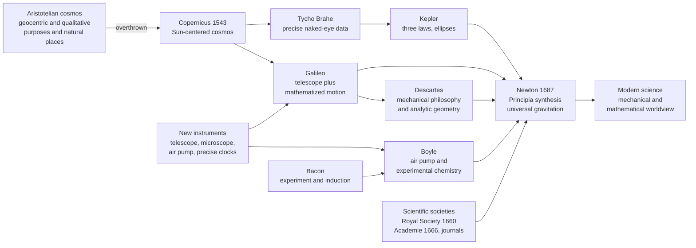

# 🔭 The Scientific Revolution

> [!abstract] TL;DR
> In roughly **150 years — from Copernicus (1543) to Newton (1687)** — Europeans rebuilt their entire picture of reality. The cosmos went from a cozy, finite sphere of purposes and meanings to an **infinite clockwork of matter in motion governed by mathematical laws**. This was less a single discovery than a wholesale change in *what counts as knowledge, how you get it, and what the universe fundamentally IS.* It fused several interlocking transformations — **heliocentrism, the experimental-mathematical method, the mechanical philosophy, new instruments, and scientific societies** — which **Newton's *Principia*** finally welded into one system that explained heaven and earth alike. Historian Herbert Butterfield called it the most important event since the rise of Christianity; it is, arguably, where the modern world and our modern way of knowing began.

---

## Intuition

**Analogy:** Imagine inheriting a beautifully bound *encyclopedia of the universe* that your family has trusted for sixty generations. It says the Earth sits still at the center, the heavens are perfect and unchanging, heavy things fall because they *want* to reach their natural home, and everything in nature has a *purpose* built into it. For two thousand years, to "know" something meant to find the right page and cite it.

Now imagine one generation that stops trusting the book and starts **running its own experiments and doing the arithmetic**. Instead of asking "what does the encyclopedia say heavy objects do?", Galileo rolls balls down a ramp and *times them*. Instead of assuming the heavens are flawless, he points a telescope and sees craters on the Moon and moons around Jupiter — things the book swears cannot exist. And instead of describing nature in words about purposes, this generation insists the universe is a **giant machine of particles pushing on particles**, and that "the book of nature is written in the language of mathematics."

That is the Scientific Revolution. What changes is not one fact but the *standard for a valid answer*: not the citation of an ancient authority, but a claim you can **measure, calculate, and repeat.** Once that standard takes hold, knowledge stops being a fixed inheritance and becomes a self-correcting, cumulative project — which is exactly what modern science is.

---

## How It Works

### Core Mechanics

The Scientific Revolution was not one change but **six interlocking ones**, each feeding the others, that together converted medieval natural philosophy into recognizably *modern science*: new **content**, new **method**, a new **worldview**, and new **institutions**.

1. **Copernican astronomy (the new content).** **Copernicus** (*De Revolutionibus*, 1543) put the **Sun at the center**, demoting Earth to a mere planet. **Tycho Brahe** compiled the most precise naked-eye observations ever made; **Kepler** distilled Tycho's data into three mathematical laws, replacing perfect circles with **ellipses**; and **Galileo's telescope** delivered physical evidence — lunar mountains, Jupiter's moons, the phases of Venus — that the old perfect, Earth-centered heavens could not survive.

2. **The experimental-mathematical method (the new way of knowing).** Nature was to be interrogated by **controlled experiment** and described in **equations**, not settled by textual authority. **Bacon** championed systematic observation and induction; **Galileo** mathematized motion; **Boyle** turned chemistry into a discipline of repeatable, publicly witnessed experiments. Two one-sided ideals — Baconian induction "up from data" and Cartesian deduction "down from principles" — frame the method that real science blends.

3. **The mechanical philosophy (the new worldview).** The universe was reconceived as **matter in motion governed by mathematical laws — a giant clockwork mechanism** (Descartes, Boyle, Newton). This *replaced* Aristotle's qualitative physics of purposes, natural places, and substantial forms with a world of **particles, forces, and quantities**: mechanistic, deterministic, mathematical. Historians call this the **"disenchantment" of nature** — the cosmos stops being a meaningful organism and becomes a machine.

4. **New instruments (extended senses and quantities).** The **telescope** opened the sky, the **microscope** opened the world of the very small, the **air pump** created vacuums to test theories of matter, and increasingly **precise clocks** made motion measurable. Instruments made nature yield *numbers* and revealed phenomena no ancient could have seen.

5. **Scientific societies (the new institutions).** Science became a **collective, public enterprise**. The **Royal Society** (1660) and the **Académie des Sciences** (1666) institutionalized experiment, demonstration, and peer scrutiny; **journals** like *Philosophical Transactions* (1665) — riding the earlier printing revolution — created a permanent, cumulative, international record.

6. **Newton's synthesis (the capstone).** **Newton's *Principia*** (1687) unified **terrestrial and celestial physics** under **universal gravitation** and **three laws of motion**, deriving Kepler's ellipses, Galileo's falling bodies, the tides, and the paths of comets from a handful of mathematical principles. It was the triumphant proof that the *whole* cosmos obeys discoverable mathematical law — and it became the very model of what a scientific theory should be.

### Flow / Architecture



---

## Key Concepts

**Secondary (foundations):**
- **Heliocentrism** — the Sun-centered cosmos of Copernicus, refined by Kepler's ellipses and defended by Galileo's telescope; the opening move that dethroned a stationary Earth.
- **The mechanical philosophy** — the core worldview shift: nature as **matter in motion**, a **clockwork machine** obeying mathematical law, replacing Aristotle's purposes and qualities.
- **The experimental method** — knowledge tested by deliberate, repeatable experiment rather than settled by ancient authority.
- **Newton's synthesis** — the *Principia* (1687) unifying the physics of the heavens and the earth under a few universal laws.

**Undergraduate (mechanisms):**
- **The mathematization of nature** — Galileo's dictum that the "book of nature is written in the language of mathematics"; physical law expressed as equation, not qualitative description.
- **Induction vs. deduction** — Bacon's ideal of building knowledge *up* from systematic observation versus Descartes's ideal of deducing it *down* from indubitable first principles; two poles that actual practice combines.
- **Instruments as epistemic tools** — telescope, microscope, and air pump not merely *aiding* the senses but generating new phenomena and quantitative data unavailable to antiquity.
- **Institutionalized science** — societies, chartered patronage, public demonstration, and journals turning natural philosophy into a cumulative, self-correcting *collective* enterprise.

**Graduate (interpretation and critique):**
- **The "disenchantment" of nature** — the shift from a purposeful, meaning-laden cosmos to a value-neutral mechanism; a metaphysical and cultural transformation, not merely a scientific one.
- **Continuity vs. rupture** — the historiographical debate over whether there was a single "Revolution" at all, given deep continuities with medieval and Islamic science and its gradual, uneven, non-European-inflected character.
- **Predictive success vs. explanatory truth** — the recurring lesson (Ptolemaic epicycles, then rival planetary models) that a framework can *predict* superbly while being *physically* wrong.
- **Why here, why then** — the debated confluence of causes: the recovery and critique of ancient and Islamic learning, printing, the Reformation loosening authority, commerce and exploration flooding Europe with new data, patronage, and the fusion of craftsman know-how with scholarly theory.

---

## Python Demo

```python
"""
Visualizing the Scientific Revolution, ~1543-1687.
  Panel 1: a TIMELINE of the key figures (lifespans) and their landmark works,
           from Copernicus (1543) to Newton (1687) -- the ~150-year span and
           its acceleration toward Newton's synthesis.
  Panel 2: an INFLUENCE NETWORK showing who built on whom
           (Tycho's data -> Kepler's laws -> Newton; Galileo's mechanics -> Newton).
Requires: matplotlib   (numpy optional; not needed here)
"""
import matplotlib.pyplot as plt
from matplotlib.patches import FancyArrowPatch

# (name, birth, death, landmark_work_year, work_label)
figures = [
    ("Copernicus",  1473, 1543, 1543, "De Revolutionibus"),
    ("Tycho Brahe", 1546, 1601, 1580, "precise sky catalog"),
    ("Galileo",     1564, 1642, 1610, "Sidereus Nuncius"),
    ("Kepler",      1571, 1630, 1609, "three planetary laws"),
    ("Descartes",   1596, 1650, 1637, "mechanical philosophy"),
    ("Boyle",       1627, 1691, 1661, "Sceptical Chymist"),
    ("Newton",      1643, 1727, 1687, "Principia"),
]

fig, (ax1, ax2) = plt.subplots(1, 2, figsize=(15, 6.5))

# ---------------- Panel 1: timeline of figures + works ----------------
figures_sorted = sorted(figures, key=lambda f: f[1])
colors = plt.cm.viridis([i / len(figures_sorted) for i in range(len(figures_sorted))])
for i, (name, birth, death, wy, wl) in enumerate(figures_sorted):
    ax1.barh(i, death - birth, left=birth, height=0.55, color=colors[i], alpha=0.85)
    ax1.plot(wy, i, "*", color="crimson", markersize=15, zorder=5)  # landmark work
    ax1.text(birth - 3, i, name, ha="right", va="center",
             fontsize=9, fontweight="bold")
    ax1.text(wy, i + 0.33, f"{wl}\n{wy}", ha="center", va="bottom",
             fontsize=7, color="crimson")

# highlight the ~150-year revolution span, Copernicus 1543 -> Newton 1687
ax1.axvspan(1543, 1687, color="gold", alpha=0.12)
for yr in (1543, 1687):
    ax1.axvline(yr, color="gray", ls="--", lw=1)
ax1.annotate("~150 years\nCopernicus 1543 -> Newton 1687",
             xy=(1615, len(figures_sorted) - 0.4), ha="center", fontsize=9,
             bbox=dict(boxstyle="round", fc="lightyellow", ec="gray"))
ax1.set_yticks([])
ax1.set_xlim(1450, 1745)
ax1.set_xlabel("year (CE)")
ax1.set_title("Timeline: figures and landmark works of the Scientific Revolution")
ax1.grid(axis="x", alpha=0.3)

# ---------------- Panel 2: influence network ----------------
# manual layout: x ~ era (left = earlier), y ~ lane, all arrows funnel into Newton
pos = {
    "Copernicus": (0.0, 3.0),
    "Tycho":      (1.0, 3.7),
    "Galileo":    (1.2, 1.3),
    "Kepler":     (2.2, 3.0),
    "Descartes":  (2.4, 0.5),
    "Boyle":      (3.0, 1.8),
    "Newton":     (4.3, 2.1),
}
edges = [
    ("Copernicus", "Kepler",    "heliocentrism"),
    ("Copernicus", "Galileo",   "heliocentrism"),
    ("Tycho",      "Kepler",    "data"),
    ("Kepler",     "Newton",    "orbit laws"),
    ("Galileo",    "Newton",    "mechanics"),
    ("Galileo",    "Descartes", "inertia"),
    ("Descartes",  "Newton",    "mechanical philosophy"),
    ("Boyle",      "Newton",    "experiment"),
]
for a, b, lbl in edges:
    xa, ya = pos[a]
    xb, yb = pos[b]
    ax2.add_patch(FancyArrowPatch((xa, ya), (xb, yb),
                                  arrowstyle="-|>", mutation_scale=14,
                                  color="steelblue", alpha=0.6, lw=1.4,
                                  connectionstyle="arc3,rad=0.12"))
    ax2.text((xa + xb) / 2, (ya + yb) / 2, lbl, fontsize=6.5, color="steelblue",
             ha="center", va="center",
             bbox=dict(boxstyle="round,pad=0.1", fc="white", ec="none", alpha=0.7))
for name, (x, y) in pos.items():
    is_newton = (name == "Newton")
    ax2.scatter(x, y, s=1700 if is_newton else 950,
                color="crimson" if is_newton else "#4c72b0",
                edgecolors="k", zorder=3)
    ax2.text(x, y, name, ha="center", va="center", color="white",
             fontsize=8 if is_newton else 7, fontweight="bold", zorder=4)
ax2.set_xlim(-0.7, 5.1)
ax2.set_ylim(-0.1, 4.3)
ax2.axis("off")
ax2.set_title("Influence network: the cumulative chain into Newton's synthesis")

plt.tight_layout()
plt.savefig("scientific_revolution.png", dpi=120)
plt.show()
```

The timeline makes the **acceleration** visible: a long, thin lead-in from Copernicus, then a dense cluster of overlapping lifetimes (Galileo, Kepler, Descartes, Boyle) whose work compounds into Newton's 1687 capstone. The network panel shows why no single figure "invented" modern science: **Tycho's data feeds Kepler's laws, Galileo's mechanics and Descartes's mechanical philosophy feed Newton**, and every arrow converges on the *Principia*.

---

## Real-World Applications

- **The template of a scientific theory.** Newton's *Principia* — a few axioms, mathematically deriving a vast range of phenomena — became the model every later theory (electromagnetism, relativity, quantum mechanics) is measured against.
- **The experimental-mathematical method itself.** Controlled experiment plus quantitative modelling, born here, is the operating system of all modern natural science and engineering.
- **Scientific institutions.** Today's peer-reviewed journals, academies, learned societies, and the norm of publicly reproducible results descend directly from the Royal Society and the Académie.
- **The mechanical worldview in engineering.** Treating machines, structures, and even economies as systems of measurable forces and quantities — the deterministic, calculable picture — underwrites classical engineering and much of applied science.
- **The Enlightenment and modernity.** The confidence that reason and method can master nature fuelled the Enlightenment, the Industrial Revolution, and the modern conviction that problems are, in principle, solvable by systematic inquiry.

---

## Common Pitfalls

- **"It was a sudden, clean break made by lone geniuses."** It unfolded over ~150 years, built on medieval and Islamic astronomy and mathematics, and depended on data-gatherers like Tycho and communities like the Royal Society — not solitary heroes.
- **"Science and religion were simply at war."** Many key figures (Kepler, Boyle, Newton) were deeply religious and saw their work as reading God's rational design. Galileo's trial was a dramatic clash, not the whole story.
- **"'Scientific Revolution' is an uncontested fact."** The term was popularized in the 20th century (Koyré, Butterfield); historians debate how *revolutionary* and how *unified* it really was. Steven Shapin opens his classic study, "There was no such thing as the Scientific Revolution, and this is a book about it."
- **"Bacon or Descartes invented the scientific method."** They articulated influential but one-sided *ideals* — pure induction, pure deduction; real science blends observation, experiment, and mathematics rather than following either alone.
- **"Everyone accepted heliocentrism at once."** Copernicanism was resisted for over a century on scientific, religious, and common-sense grounds — the Earth *feels* stationary. It took Kepler's ellipses, Galileo's evidence, and finally Newton's physics to secure it.
- **"Confusing prediction with explanation."** Predictive success is not truth: geocentric and heliocentric models both "saved the appearances" for a time, and the era's lasting lesson is that a working model can still be physically wrong.

---

## Related Concepts

- [[The_Copernican_Revolution]] — the heliocentric opening move (Copernicus, Kepler, Galileo) that this overview synthesizes into the wider revolution.
- [[Newton_and_the_Mechanical_Universe]] — the capstone synthesis; Newton unifying celestial and terrestrial physics under universal law.
- [[Newtons_Laws_and_Kinematics]] — the actual physics of the *Principia*, the mathematical core the revolution produced.
- [[The_Scientific_Revolution]] — the History-vault companion telling the same story within early-modern European history.
- [[Ancient_and_Prehistoric_Science]] — the ancient natural philosophy (Aristotle, Ptolemy) that the revolution overthrew and partly built upon.
- [[Ancient_and_Medieval_Science]] — the medieval and transmission background that made the revolution possible.
- [[Islamic_Science_and_Mathematics]] — the Islamic Golden Age astronomy and mathematics that preserved and advanced the tradition Europe inherited.
- [[Aristotle]] — the qualitative, purpose-driven physics and geocentric cosmos the mechanical philosophy replaced.
- [[Descartes_and_Rationalism]] — the mechanical philosophy and analytic geometry, and the deductive pole of the new method.
- [[British_Empiricism]] — the Baconian, experiment-first strand that grew into the empiricist tradition.
- [[Rationalism_vs_Empiricism]] — the deduction-vs-induction debate that framed how the new knowledge was to be won.
- [[Explanation_and_Laws_of_Nature]] — the philosophy-of-science question of what a "law of nature" is, opened wide by this era.
- [[Kuhn_and_Scientific_Revolutions]] — the paradigm-shift framework historians use to interpret the era, and its central case study.
- [[Orbital_Mechanics_and_Celestial_Dynamics]] — the modern celestial mechanics that grew out of Kepler and Newton.
- [[The_Printing_Revolution]] — the technology that let exact data, star tables, and diagrams circulate identically across Europe.
- [[The_Enlightenment]] — the intellectual movement the Scientific Revolution's confidence in reason and method directly fuelled.

> Sibling *History of Science* notes not yet written are referenced in prose and will deepen this arc: a *History of Science Overview*, *Scientific Method and Empiricism*, *Scientific Institutions and Societies*, *Medieval and Renaissance Science*, *Newtonian Mechanics and the Principia*, *The Chemical Revolution*, *Kuhn Paradigms and Scientific Revolutions*, *The Sociology of Scientific Knowledge*, and *Science, Technology and Society*.

---

## Review Questions

1. **Conceptual:** The Scientific Revolution is often described as a change in "what counts as an answer." Explain that shift concretely, contrasting reliance on Aristotelian and Ptolemaic authority with the new standard of measurement, calculation, and repeatable experiment. Why is this a change in *epistemology*, not just in *content*?
2. **Scenario:** You are a natural philosopher in 1660 with a telescope, an air pump, Tycho's tables, and Kepler's laws, but no theory linking them. Which of the era's six interlocking components (Copernican astronomy, experimental method, mechanical philosophy, instruments, societies, synthesis) are already in your hands, and what exactly is Newton adding in 1687 that you cannot yet do?
3. **Trade-off / synthesis:** Historians debate whether there was a single "Scientific Revolution" at all, citing continuities with medieval and Islamic science and its gradual, uneven character. Weigh the case for "revolution" (a genuine rupture in method, worldview, and institutions) against the case for "evolution" (cumulative continuity). Which framing better serves a *history of science*, and what does each risk distorting?

---

## Sources

- Shapin, Steven. *The Scientific Revolution*. University of Chicago Press, 1996.
- Butterfield, Herbert. *The Origins of Modern Science, 1300–1800*. Bell, 1949.
- Cohen, H. Floris. *The Scientific Revolution: A Historiographical Inquiry*. University of Chicago Press, 1994.
- Henry, John. *The Scientific Revolution and the Origins of Modern Science*. 3rd ed., Palgrave Macmillan, 2008.
- [Scientific Revolution (Stanford Encyclopedia of Philosophy / Wikipedia overview)](https://en.wikipedia.org/wiki/Scientific_Revolution)

---

#history-of-science #scientific-revolution #mechanical-philosophy #newton #17th-century
