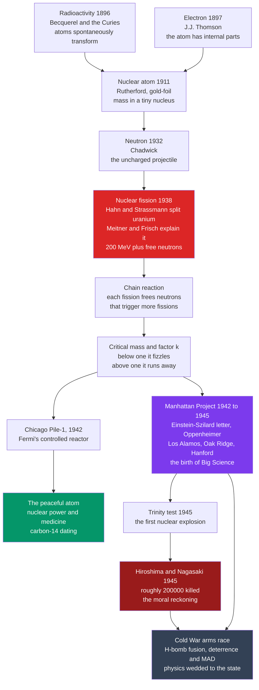

# ☢️ The Atomic Age

> [!abstract] TL;DR
> In barely half a century, physics went from **wondering whether atoms even exist** to **splitting them open** and releasing the energy that lights the stars — then packing that energy into a weapon that could end civilization. The chain runs: unravel the atom's structure (**radioactivity → nucleus → neutron**), discover **nuclear fission** and the **chain reaction**, and — driven by the fear of a Nazi bomb — mount the **Manhattan Project**, the first true **"Big Science"** effort. The *same* $E = mc^2$ that explains sunlight fit inside the bombs that killed roughly **200,000 people at Hiroshima and Nagasaki**. The Atomic Age is where abstract science collided with world history: physicists learned that discovering how nature works can hand humanity **godlike, terrifying power**, and that science had become **powerful, expensive, state-directed, secret, and morally fraught**.

---

## Intuition

**Analogy:** Imagine spending your life proving that a locked box has an *inside* — that matter is made of tiny indivisible balls. Then someone shows you the "ball" is itself a box, with a dense core; then that the core can be *cracked open*; and when you crack it, out pours energy a *million times* greater than any chemical fire, plus a few sparks that can crack the neighboring boxes too. Now picture a room packed with those boxes: crack one, its sparks crack two, those crack four, and in a heartbeat the whole room detonates. That runaway is a **nuclear chain reaction** — and the difference between a **safe pile of boxes** and a **bomb** is nothing more than *how many* are packed together: the **critical mass**.

In just fifty years physicists went from the *idea* of the atom to the *reality* of releasing the binding energy locked in its nucleus. The astonishing part is not only the physics — it is that the *same equation*, $E = mc^2$, describes why the Sun shines **and** what happens over a city at 8:15 a.m. Discovering how nature works turned out to be inseparable from deciding what to do with that knowledge, and the scientists who split the atom found that pure curiosity had delivered them the power to destroy the world.

---

## How It Works

### Probing the atom: the rapid unravelling (1896–1932)

For most of the nineteenth century the atom was a useful bookkeeping device with no known internal structure. In under four decades that changed completely:

1. **Radioactivity (1896).** **Henri Becquerel** found that uranium salts fog a photographic plate in the dark, all by themselves. **Marie and Pierre Curie** showed this was a property of the *atoms themselves* — a **spontaneous nuclear transformation**, not a chemical reaction — and isolated new radioactive elements, **polonium** and **radium**. The atom was revealed to be *transformable* and *energy-rich*.
2. **The electron (1897).** **J.J. Thomson** measured the charge-to-mass ratio of cathode rays and found a particle ~2000 times lighter than hydrogen. The atom had **internal parts** and was no longer indivisible.
3. **The nuclear atom (1911).** In **Ernest Rutherford's** gold-foil experiment, a few alpha particles bounced *straight back* — "as if you had fired a 15-inch shell at tissue paper and it came back." The atom is **almost entirely empty space** with nearly all its mass in a **tiny, dense, positively charged nucleus**. Rutherford later identified the **proton** (1919).
4. **The neutron (1932).** **James Chadwick** discovered the **neutron** — a neutral nuclear particle. This was the crucial *tool*: with no charge, a neutron is not repelled by the nucleus, so it can *penetrate* and *strike* it. The projectile that would split the atom was now in hand.

The cumulative result: the atom was no longer a featureless ball but a **structured, transformable, energy-rich object** — a picture that dovetailed with the parallel quantum revolution (a forthcoming *Quantum Revolution* companion note will trace that thread; see [[Atomic_Models_and_Spectroscopy]] and [[Atomic_Structure_and_Subatomic_Particles]]).

### Marie Curie: a landmark figure

**Marie Skłodowska Curie** pioneered the study of radioactivity (a word she coined), discovered **polonium** and **radium**, and remains the only person to win Nobel Prizes in **two** sciences — **Physics (1903)** and **Chemistry (1911)** — achieved against enormous barriers as a woman in a field that largely refused to admit her. Her work founded a research program that led directly toward the nucleus. It also carried a hidden cost: the **health dangers of radiation** were then unknown, and she died of aplastic anemia almost certainly caused by her exposures — her notebooks are still radioactive today. (A forthcoming *Women and Underrepresented Scientists* note will develop this theme of contribution amid exclusion.)

### Nuclear fission and the chain reaction (1938–1942)

In late 1938 **Otto Hahn** and **Fritz Strassmann** bombarded uranium with neutrons and found **barium** — an element roughly *half* uranium's mass — among the products. The chemistry was undeniable but made no sense under the physics of the day. The *interpretation* came from **Lise Meitner** and her nephew **Otto Frisch**: the uranium nucleus had **split in two**. Meitner used Bohr's liquid-drop model to show the fragments fly apart with about **200 MeV** of energy, and — invoking $E = mc^2$ — that this energy comes from a **mass defect**, a tiny bit of the nucleus's mass converted directly into energy. Frisch named it **fission**, after biological cell division.

Two facts made this world-historical:

- Each fission also releases **2–3 free neutrons**.
- Those neutrons can strike *other* uranium nuclei and split them too.

That is the recipe for a **self-sustaining chain reaction**. Meitner's role was decisive yet under-credited: Hahn alone received the 1944 Nobel, and hers became the famous **"Nobel that got away."** In December 1942, beneath the stands of a Chicago squash court, **Enrico Fermi's Chicago Pile-1** achieved the first **controlled, self-sustaining chain reaction** — proof that the physics worked, and the fork in the road toward both **reactor** and **bomb**.

### Criticality: the physics of the threshold

The behaviour of a chain reaction is governed by a single number, the **effective multiplication factor $k$** — the average number of neutrons from one fission that go on to cause *another* fission:

- $k < 1$ — **subcritical**: the reaction **dies out**.
- $k = 1$ — **critical**: it holds **steady** (a controlled reactor).
- $k > 1$ — **supercritical**: it grows **exponentially** (a bomb).

Because too many neutrons escape from a small lump before being captured, there is a minimum amount of fissile material — the **critical mass** — needed to reach $k \geq 1$. Building a bomb was therefore less about *whether* fission works than about the brutal engineering of **enriching enough fissile material** (uranium-235 or plutonium-239) and slamming it together fast enough. The demo below simulates exactly this threshold.

### From physics to the state: the Manhattan Project (1942–1945)

Fearing that **Nazi Germany** might build a fission bomb first, refugee physicists **Leó Szilárd** and Eugene Wigner persuaded **Albert Einstein** to sign a 1939 letter warning President Roosevelt. The result was the **Manhattan Project**: a vast, secret, government-run program of unprecedented **scale, secrecy, and cost** — scientific direction under **J. Robert Oppenheimer** at **Los Alamos**, uranium enrichment at **Oak Ridge**, plutonium production at **Hanford**, and roughly 130,000 people at a cost of about $2 billion. This was the **birth of "Big Science"**: huge teams, industrial budgets, military management, and the state as patron and director of research. On **16 July 1945** the **Trinity test** in New Mexico produced the first nuclear explosion, and Oppenheimer later recalled the line from the Bhagavad Gita: *"Now I am become Death, the destroyer of worlds."*



### Hiroshima and the moral reckoning

On **6 and 9 August 1945**, atomic bombs destroyed **Hiroshima** and **Nagasaki**, killing on the order of **200,000 people**, most of them civilians. For the scientists this was a **profound moral crisis** and a **loss of innocence**. Some had tried to stop this use: the **Franck Report** (June 1945) urged a demonstration rather than a surprise attack on a city; **Szilárd** circulated a petition against military use. Oppenheimer said the physicists had "known sin." The Atomic Age forced a permanent question that pure science had largely dodged before: **what is the scientist responsible for?** (A forthcoming *Ethics and Politics of Science* note develops this; compare [[Just_War_and_the_Ethics_of_Violence]] and [[Research_Ethics_and_Human_Subjects]].)

### The Cold War and Big Science

The bomb did not end with the war; it defined the peace. The **arms race** drove fission bombs to the vastly more powerful **hydrogen (fusion) bomb** — Edward **Teller's** thermonuclear weapon, championed over Oppenheimer's objections (Oppenheimer's security clearance was revoked in 1954). Nuclear **deterrence** and **Mutually Assured Destruction (MAD)** made physics a **strategic national resource**, and research became **permanently entangled with the state**: military funding, national laboratories, classification, and secrecy. Physics, once the freest of curiosities, was now **militarized** and central to national survival. (These themes anchor a forthcoming *Science, Technology and Society* note; see also [[Origins_of_the_Cold_War]] and [[The_Modern_Physics_Revolution]].)

### The peaceful atom

Nuclear science is fundamentally **dual-use**. The same physics gave:

- **Nuclear power** — reactors generating electricity, with genuine promise (low-carbon, energy-dense) and hard problems: catastrophic accidents (**Chernobyl 1986**, **Fukushima 2011**), long-lived **radioactive waste**, and proliferation risk.
- **Nuclear medicine** — radioisotopes for imaging (PET) and cancer therapy.
- **Radioisotope dating** — **carbon-14** dating revolutionized **archaeology**, and **radiometric dating** of rocks fixed the **age of the Earth** at ~4.54 billion years, transforming geology (see [[Radiometric_Dating]] and [[Geologic_Time_Scale]]).

### The legacy — why it matters

The Atomic Age transformed the **relationship between science and society**. Unravelling the atom led through fission and the chain reaction to the Manhattan Project, the bomb, and the Cold War, and in doing so it made science **powerful, expensive, state-directed, secret, and morally fraught**. It is the defining example of science's **double-edged power** — to illuminate the workings of the stars *and* to destroy cities — and it raised enduring questions about **the responsibility of the scientist**, **dual-use research**, and how a society governs knowledge that cannot be un-discovered. Every later debate over dangerous research — recombinant DNA, gain-of-function virology, powerful AI — is fought in the long shadow of 1945.

---

## Key Concepts

### Secondary — the essential story

- **Radioactivity** — atoms spontaneously transform and emit energy (Becquerel, the Curies).
- **The nuclear atom** — nearly all the mass sits in a tiny central nucleus (Rutherford).
- **Nuclear fission** — a heavy nucleus splits, releasing energy *and* neutrons (Hahn, Strassmann, Meitner, Frisch, 1938).
- **Chain reaction and critical mass** — enough fissile material, and each fission triggers more, exponentially.
- **The Manhattan Project** — a secret wartime crash program that built the first atomic bombs; the birth of "Big Science."

### Undergraduate — the mechanisms

- **The neutron as key** — being uncharged, it penetrates the nucleus, unlike protons or alphas repelled by the Coulomb barrier.
- **Mass–energy equivalence** — the ~200 MeV per fission comes from a **mass defect** via $E = mc^2$; see [[Relativistic_Dynamics]].
- **Multiplication factor $k$** — the average neutrons-per-fission that cause the next fission; $k<1$, $k=1$, $k>1$ separate fizzle, steady, and runaway.
- **Reactor vs bomb** — a reactor holds $k \approx 1$ with control rods and moderators; a bomb forces $k \gg 1$ by rapidly assembling a supercritical mass (see [[Nuclear_Reactions_Fission_Fusion]]).
- **Big Science** — large teams, industrial budgets, state direction, secrecy — a new *mode* of doing science.

### Graduate — deeper physics and history

- **Fission vs fusion** — fission splits heavy nuclei (uranium, plutonium); fusion (the H-bomb, and the Sun) *joins* light nuclei, releasing far more energy per nucleon. Both are explained by the **nuclear binding-energy curve** peaking near iron-56 (see [[Nuclear_Structure]]).
- **Prompt vs delayed neutrons** — controllable reactors are possible *only* because a small fraction of neutrons are emitted with a delay, slowing the response enough for mechanical control; prompt-critical excursions are what make reactor accidents (and bombs) violent.
- **Enrichment and the real bottleneck** — natural uranium is 99.3% non-fissile U-238; separating fissile U-235, or breeding Pu-239, was the true industrial challenge (Oak Ridge, Hanford).
- **The scientist's dilemma** — the Franck Report, Szilárd's petition, Oppenheimer's later opposition to the H-bomb, and the postwar Pugwash movement pose the still-open question of scientists' **moral responsibility** and the governance of **dual-use** knowledge.

---

## Python Demo

This simulates the heart of the Atomic Age: the **nuclear chain reaction and criticality**. We model neutron multiplication generation by generation — each fission releasing $k$ neutrons that may cause further fissions — and show that below critical ($k<1$) the reaction dies out, at $k=1$ it is steady, and above ($k>1$) it grows **exponentially** into a bomb. We then use $E = mc^2$ to convert fissions into energy, showing that fully fissioning **1 kg of uranium** converts about **1 gram of mass** into roughly **20 kilotons** of TNT-equivalent.

```python
"""
The nuclear chain reaction and criticality, by simulation.
  (1) Neutron multiplication: each fission releases k neutrons that go on to
      cause further fissions, so fissions in generation g scale like k**g.
        k < 1  subcritical   -> the reaction DIES OUT
        k = 1  critical       -> STEADY (a controlled reactor)
        k > 1  supercritical  -> GROWS EXPONENTIALLY (a bomb)
      The threshold in k is the physics behind CRITICAL MASS.
  (2) Use E = m c**2 to turn fissions into energy: fully fissioning ~1 kg of
      uranium-235 converts ~1 gram of mass to energy, about 20 kilotons of TNT.
Requires: numpy, matplotlib
"""
import numpy as np
import matplotlib.pyplot as plt

# ---- Physical constants and per-fission energetics --------------------------
c         = 2.998e8          # speed of light, m/s
MeV_J     = 1.602e-13        # joules per MeV
E_fission = 200 * MeV_J      # ~200 MeV released per U-235 fission, in joules
KT_TNT_J  = 4.184e12         # joules in one kiloton of TNT
NA        = 6.022e23         # Avogadro's number

# ---- (1) Neutron multiplication over generations ----------------------------
generations = np.arange(0, 81)
k_values = {
    "subcritical  k=0.95":  0.95,
    "critical     k=1.00":  1.00,
    "supercritical k=1.03": 1.03,
    "bomb         k=2.00":  2.00,
}
# fissions in generation g, starting from a single fission
fissions = {label: k ** generations for label, k in k_values.items()}

print("Fissions after 80 generations (starting from 1):")
for label, series in fissions.items():
    print(f"  {label:22s} -> {series[-1]:.3e}")

# ---- (2) Energy from E = m c^2 for fully fissioning 1 kg of U-235 -----------
mass_kg     = 1.0
atoms       = mass_kg * 1000.0 / 235.0 * NA   # U-235 atoms in 1 kg
E_total     = atoms * E_fission               # total energy if every atom fissions
mass_defect = E_total / c**2                  # mass converted to energy (E = m c^2)
kt_yield    = E_total / KT_TNT_J

print(f"\nFully fissioning {mass_kg:.0f} kg of U-235:")
print(f"  atoms fissioned        = {atoms:.3e}")
print(f"  energy released        = {E_total:.3e} J")
print(f"  equivalent TNT         = {kt_yield:.1f} kilotons")
print(f"  mass converted (E/c^2) = {mass_defect*1000:.3f} grams  (out of 1000 g)")

# cumulative energy for the runaway (bomb) chain, generation by generation
bomb_series   = fissions["bomb         k=2.00"]
cum_fissions  = np.cumsum(bomb_series)
cum_energy_kt = cum_fissions * E_fission / KT_TNT_J

# ---- Visualize --------------------------------------------------------------
fig, (axA, axB) = plt.subplots(1, 2, figsize=(13, 5.6))

colors = {"subcritical  k=0.95":  "#2563eb", "critical     k=1.00":  "#059669",
          "supercritical k=1.03": "#f59e0b", "bomb         k=2.00":  "#dc2626"}
for label, series in fissions.items():
    axA.semilogy(generations, series, lw=2, color=colors[label], label=label)
axA.axhline(1.0, color="#334155", ls=":", lw=1)
axA.set_xlabel("neutron generation")
axA.set_ylabel("fissions this generation (log scale)")
axA.set_title("Chain reaction & criticality:\nthe multiplication factor k decides everything")
axA.legend(fontsize=8, loc="center left")
axA.grid(alpha=0.3, which="both")
axA.text(30, 3e-2, "k < 1: dies out (subcritical)", color="#2563eb", fontsize=8)
axA.text(2, 1e19, "k > 1: runs away (a bomb)", color="#dc2626", fontsize=8)

axB.plot(generations, cum_energy_kt, lw=2.5, color="#dc2626",
         label="cumulative yield (k = 2.0)")
axB.axhline(15, color="#334155", ls="--", lw=1.2, label="Hiroshima ~15 kt")
axB.set_xlabel("neutron generation  (~10 ns each)")
axB.set_ylabel("cumulative energy released  (kilotons TNT)")
axB.set_title("From E = m c^2 to kilotons:\na runaway chain in under a microsecond")
axB.set_ylim(0, 25)
axB.legend(fontsize=9, loc="upper left")
axB.grid(alpha=0.3)

plt.tight_layout()
plt.savefig("nuclear_chain_reaction.png", dpi=120)
plt.show()
```

Running it prints the four multiplication curves diverging wildly by the 80th generation — the subcritical case decaying toward zero, the critical case pinned at 1, and the bomb case reaching ~$10^{24}$ fissions — and shows that fully fissioning 1 kg of uranium converts about **0.9 grams of mass** into roughly **20 kilotons** of energy. The right panel is a "hockey stick": nothing, nothing, nothing, then within a handful of generations (a fraction of a microsecond) the cumulative energy vaults past the Hiroshima yield. That sudden vertical wall *is* the difference between a lump of metal and a city-destroying weapon, and the reason **critical mass** is the whole ballgame.

---

## Real-World Applications

- **Nuclear power** — commercial reactors hold $k \approx 1$ with control rods and moderators to boil water and spin turbines; ~10% of world electricity. The physics of the demo, deliberately kept *critical* rather than *supercritical*.
- **Nuclear weapons and deterrence** — fission and thermonuclear arsenals still shape geopolitics via deterrence and MAD; nonproliferation regimes exist precisely because the knowledge cannot be un-learned.
- **Nuclear medicine** — PET scans, radiotherapy, and diagnostic tracers use manufactured radioisotopes.
- **Radiometric dating** — carbon-14 dates organic remains for archaeology; uranium-lead and other schemes date rocks and meteorites, underpinning the geologic time scale ([[Radiometric_Dating]]).
- **The "Big Science" template** — CERN, the Human Genome Project, the Apollo program, and large AI labs all inherit the Manhattan Project's model of large teams, state or institutional funding, and mission direction.

---

## Common Pitfalls

- **Confusing fission with fusion.** Fission *splits* heavy nuclei (bombs of 1945, power reactors); fusion *joins* light nuclei (the Sun, the H-bomb). Fusion releases more energy per nucleon; the binding-energy curve explains both ([[Nuclear_Structure]]).
- **Thinking a reactor can explode like a bomb.** A power reactor cannot become a nuclear *bomb* — its fuel is far too dilute (low enrichment) to reach the prompt-supercritical $k$ a weapon needs. Reactor disasters (Chernobyl, Fukushima) are steam explosions, fires, and meltdowns, not nuclear detonations.
- **Believing the hard part was the physics.** By 1940 the physics was largely understood; the Manhattan Project's real challenge was *industrial* — enriching uranium and breeding plutonium at scale.
- **Crediting fission's discovery to Hahn alone.** The chemical detection was Hahn and Strassmann's, but the *physical interpretation* was Meitner and Frisch's — the archetypal "Nobel that got away."
- **Treating science as morally neutral because "knowledge is neutral."** The Atomic Age is the standard counterexample: dual-use knowledge, once created, forces choices, and the scientists themselves debated their responsibility (Franck Report, Szilárd's petition).
- **Assuming $k>1$ instantly means an explosion.** Real assemblies must stay supercritical *long enough*, before they blow themselves apart; premature disassembly ("fizzle") is why weapon design is hard.

---

## Related Concepts

- [[History_of_Science_Overview]] — the entry point situating the Atomic Age as the moment science gained world-historical power.
- [[Nuclear_Reactions_Fission_Fusion]] — the Physics-vault treatment of fission, fusion, and reactor/weapon physics.
- [[Nuclear_Structure]] — the binding-energy curve that explains *why* splitting heavy nuclei releases energy.
- [[Radioactive_Decay]] — the spontaneous nuclear transformation the Curies discovered, and the basis of dating.
- [[Relativistic_Dynamics]] — $E = mc^2$ and mass–energy equivalence, the source of fission's enormous yield.
- [[Special_Relativity_Kinematics]] — the relativity framework in which mass–energy equivalence lives.
- [[Atomic_Structure_and_Subatomic_Particles]] — the Chemistry-vault picture of protons, neutrons, and electrons.
- [[Atomic_Models_and_Spectroscopy]] — how the structured, quantized atom was pieced together.
- [[Wave_Particle_Duality_and_Uncertainty]] — the parallel quantum revolution that reshaped atomic physics.
- [[The_Modern_Physics_Revolution]] — the History-vault companion on relativity, the quantum, and their aftermath.
- [[World_War_II]] — the war that spurred the Manhattan Project and saw the bombs used.
- [[Origins_of_the_Cold_War]] — the arms race and superpower standoff the bomb created.
- [[The_Holocaust]] — the Nazi context that drove refugee physicists to warn Roosevelt.
- [[Radiometric_Dating]] — the peaceful use of radioactivity that fixed the age of the Earth.
- [[Geologic_Time_Scale]] — deep time, calibrated by the radioactive clocks nuclear science provided.
- [[Just_War_and_the_Ethics_of_Violence]] — the ethical frame for judging Hiroshima and nuclear deterrence.
- [[Research_Ethics_and_Human_Subjects]] — the broader question of scientists' responsibility for their work.
- [[AI_Alignment_and_Existential_Risk]] — the modern dual-use, "cannot-be-undiscovered" debate that echoes 1945.

> Forthcoming *History of Science* siblings referenced in prose (not yet written): a **Quantum Revolution** deep-dive on the parallel reshaping of atomic physics; an **Ethics and Politics of Science** note on the moral reckoning and the scientist's responsibility; a **Science, Technology and Society** note on Big Science and the militarization of research; a **Women and Underrepresented Scientists** note on Curie and Meitner; and a **Scientific Institutions and Societies** note on national labs and state-funded science.

---

## Review Questions

1. **(Secondary)** Explain, in your own words, why a lump of uranium below its *critical mass* does nothing dramatic, while the same material above critical mass can explode. What single quantity captures the difference, and what do its values less than, equal to, and greater than one mean?
2. **(Undergraduate)** Nuclear fission releases about 200 MeV per event, roughly a *million* times more than a chemical reaction per atom. Using $E = mc^2$, explain *where* that energy comes from, and estimate how much mass is converted when 1 kg of uranium fully fissions. Why does this make nuclear weapons and reactors so much more energy-dense than any chemical explosive or fuel?
3. **(Graduate)** The Manhattan Project marked the birth of "Big Science" and forced a reckoning with scientists' moral responsibility. Drawing on the Einstein–Szilárd letter, the Franck Report, and Oppenheimer's later opposition to the H-bomb, argue whether the scientists who built the bomb bear moral responsibility for Hiroshima — and assess how that precedent should shape today's governance of dual-use research such as gain-of-function virology or advanced AI.

---

## Sources

- Rhodes, R. (1986). *The Making of the Atomic Bomb*. Simon & Schuster.
- Bird, K., & Sherwin, M. J. (2005). *American Prometheus: The Triumph and Tragedy of J. Robert Oppenheimer*. Knopf.
- Sime, R. L. (1996). *Lise Meitner: A Life in Physics*. University of California Press.
- Meitner, L., & Frisch, O. R. (1939). "Disintegration of Uranium by Neutrons: A New Type of Nuclear Reaction." *Nature*, 143, 239–240.
- [Manhattan Project (Atomic Heritage Foundation)](https://ahf.nuclearmuseum.org/ahf/history/manhattan-project/)
- [Discovery of nuclear fission (Wikipedia)](https://en.wikipedia.org/wiki/Discovery_of_nuclear_fission)

---

#history-of-science #atomic-age #nuclear-physics #manhattan-project #big-science
