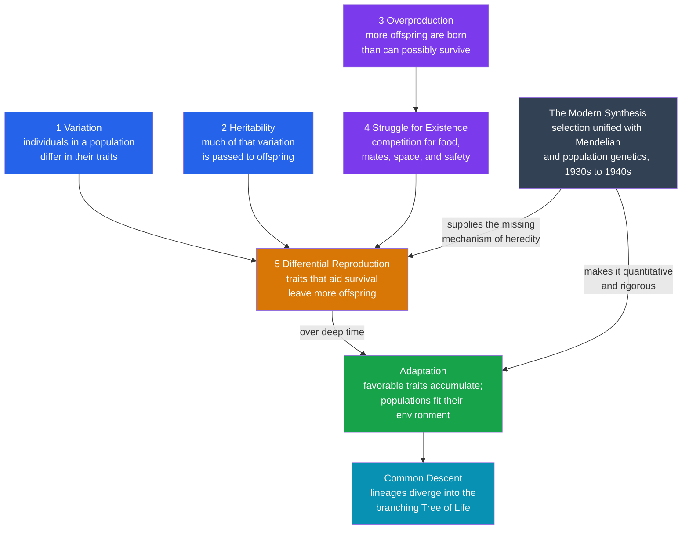

# 🧬 The Darwinian Revolution

> [!abstract] TL;DR
> The **Darwinian Revolution** was the mid-19th-century transformation in which **Charles Darwin** — and, independently, **Alfred Russel Wallace** — showed that the staggering diversity and exquisite *apparent design* of life require **no designer**. Given three cheap ingredients — **variation**, **heritability**, and a **struggle to survive** — nature itself does the "designing" automatically, slowly, across **deep time**: this is **natural selection** (*On the Origin of Species*, 1859). All living things share **common ancestry** (the tree of life), adaptation is the accumulated residue of differential survival, and a blind, mechanical algorithm can produce eyes, wings, and us. Darwin lacked a correct theory of heredity — the gap **Mendel's genetics** would later fill in the **Modern Synthesis** (1930s–40s). The revolution gave biology its unifying theory and reframed humanity's place in nature as profoundly as Copernicus reframed Earth's place in the cosmos.

---

## Intuition

**Analogy:** Imagine finding a watch lying on a heath. Its gears mesh, its hands turn, its parts conspire toward a purpose — telling time. Surely, argued the theologian **William Paley** in 1802, such intricate contrivance implies a **watchmaker**. And the living world is full of contrivances far more exquisite than any watch: the vertebrate **eye**, with its focusing lens, light-sensitive retina, and self-adjusting iris, seems to shout *design* even more loudly than the watch does. For most of human history, the perfect-seeming fit between organisms and their world was the single most persuasive argument that a divine Designer must exist. How else could an eye be so good?

Darwin's dangerous idea was that the watch can build **itself** — with no watchmaker at all. Take a population of things that *vary*, that *pass their features to offspring*, and that *make more copies than can survive*. Now the arithmetic is merciless: whichever variants happen to survive and reproduce a little better leave more descendants, so their features spread. Repeat for thousands of generations and the population **accumulates** whatever works — sharper eyes, stronger wings, better camouflage — not because anyone aimed at it, but because the losers simply left fewer offspring. The "designer" is just the impersonal filter of who lived and bred. A **blind, mindless, purposeless process**, running on ordinary variation and death over vast stretches of geological time, produces the very appearance of purpose that once seemed to demand a mind. That single move — replacing the Designer with an *algorithm* — displaced humanity from the center of creation as surely as Copernicus displaced the Earth from the center of the cosmos.

---

## How It Works

### The picture Darwin had to overthrow

By 1830 the reigning account of life rested on three pillars, each reasonable given the evidence of the day:

- **Natural theology.** Paley's *watchmaker* argument treated the fit of organism to environment as direct evidence of a benevolent Creator. Adaptation *was* the proof of God — the best-organized scientific fact of the age pointed straight at design.
- **The fixity of species.** Following **Linnaeus**, species were seen as **essences** — fixed, discrete kinds created separately and unchanging since creation. A dog could vary within limits, but never become anything but a dog. This is **essentialism**: each species has an immutable inner nature.
- **A young Earth.** Biblical chronology (famously Ussher's 4004 BCE) allowed only a few thousand years — nowhere near enough time for slow change to matter.

Earlier thinkers had guessed that species *transmute*. Darwin's own grandfather **Erasmus Darwin** speculated about it in verse, and **Jean-Baptiste Lamarck** (1809) proposed a real mechanism: the **inheritance of acquired characteristics** — a giraffe stretches for high leaves, and its offspring inherit slightly longer necks. But Lamarck's mechanism was wrong (stretched necks are not passed on), and evolutionary speculation without a *correct, testable mechanism* remained fringe. The missing piece was not the *idea* of change but a **causal engine** that could drive it.

### The voyage and the accumulation of anomalies

From 1831 to 1836 Darwin sailed as naturalist aboard **HMS Beagle**, and the trip loaded him with facts that the fixed-species picture could not digest:

- **The Galápagos.** Finches and giant tortoises differed subtly **from island to island**, each suited to local conditions — yet all resembled South American mainland forms. Why would a Creator make slightly different tortoises for adjacent volcanic islands?
- **Biogeography.** Island species consistently resemble the **nearest mainland** species, not species from similar climates elsewhere. That is exactly what *descent from colonizing ancestors* predicts, and exactly what *independent creation* does not.
- **Fossils.** Extinct South American mammals (giant armadillo-like *Glyptodon*) resembled *living* local forms — succession in place, as if the living were descended from the dead.
- **Deep time.** Reading **Charles Lyell's** *Principles of Geology* on the voyage, Darwin absorbed **gradualism**: the Earth was shaped by slow, still-operating causes over immense ages — providing the vast **time** that slow biological change required.
- **Malthus.** Back home in 1838, reading **Thomas Malthus** on human population, Darwin grasped the key: populations breed **geometrically** but resources grow at best **arithmetically**, so there is a perpetual **struggle for existence**. That struggle is the sieve.

### The logic of natural selection

Darwin's argument in the *Origin* (1859) is famous for its almost syllogistic economy. It needs only observable premises:

1. **Variation.** Individuals in any population differ — in size, color, speed, beak shape, disease resistance.
2. **Heritability.** Much of that variation is **passed to offspring**; like tends to beget like.
3. **Overproduction.** Every species produces **far more offspring** than can possibly survive to reproduce.
4. **Struggle for existence.** Therefore there is competition — for food, mates, space, safety — and most individuals die without reproducing.
5. **Differential reproduction (fitness).** The survivors are **not a random sample**: individuals whose heritable variations give even a slight edge survive and reproduce **more**.

The conclusion follows automatically: over generations, advantageous variations **accumulate**, populations become better **adapted**, and — as different populations adapt to different conditions and diverge — new **species** form. Darwin called it **"descent with modification."** Crucially, the same logic implies **common descent**: trace lineages backward and they **merge**, so *all* life forms a single branching **tree** sharing common ancestors. Darwin bolstered the argument with an everyday analogy everyone already accepted — **artificial selection**. Breeders had transformed wolves into chihuahuas and wild mustard into cabbage, broccoli, and kale in mere centuries by choosing which individuals bred. Nature, Darwin argued, does the same thing, only *unconsciously* and over far longer time.



### Wallace and independent discovery

Darwin sat on his theory for two decades, hoarding evidence and dreading the storm. In 1858 a letter from a young naturalist in the Malay Archipelago, **Alfred Russel Wallace**, laid out essentially the **same mechanism** Darwin had privately worked out. Rather than being scooped, Darwin arranged a **joint presentation** to the Linnean Society in 1858, then rushed the *Origin* into print in 1859. Natural selection is thus a textbook case of **simultaneous, independent discovery** — evidence that the idea was, in a sense, "ripe": the pieces (Malthus, Lyell's deep time, biogeography, breeders' results) were on the table for anyone who assembled them.

### The evidence: a consilience

The power of Darwin's case came from **consilience** — many independent lines of evidence converging on the same conclusion:

- **Biogeography** — island-vs-mainland patterns of resemblance.
- **The fossil record** — succession over time and later-discovered **transitional forms** (*Archaeopteryx*, feathered dinosaurs, whale-with-legs *Ambulocetus*).
- **Comparative anatomy** — **homologous structures**: the same underlying bone plan in a human arm, a bat wing, a whale flipper, a horse leg — sensible only as modified inheritance, not fresh design.
- **Embryology** — vertebrate embryos pass through strikingly similar early stages.
- **Vestigial organs** — the human appendix, whale pelvic bones, blind cave-fish eyes: useless remnants that make sense only as leftovers of ancestry.
- **Artificial selection** — the living proof that heritable variation plus selection reshapes populations fast.

### The missing mechanism — and the Modern Synthesis

Darwin's theory had one gaping hole: **heredity**. He assumed **blending inheritance** — offspring average their parents' traits. But blending is fatal to his own theory: any new advantageous variant would be **diluted by half each generation**, washing out before selection could act, like a drop of ink stirred into water. Engineer Fleeming Jenkin pressed exactly this objection, and Darwin never fully answered it. Unknown to him, a monk named **Gregor Mendel** had already found the answer (1866): heredity is **particulate**, not blending — genes are discrete units that segregate intact and can hide as recessives, so variation is *preserved*, not diluted. Mendel's work was ignored until **rediscovered around 1900**.

For a generation the two ideas seemed *opposed*: early geneticists thought mutation, not selection, drove evolution. The reconciliation came in the **Modern Synthesis** (roughly 1918–1950), when **R. A. Fisher**, **J. B. S. Haldane**, and **Sewall Wright** built **population genetics** — showing mathematically that **Mendelian inheritance plus natural selection**, acting on the allele frequencies of a population, *is* the engine of evolution. **Theodosius Dobzhansky** (*Genetics and the Origin of Species*, 1937) and **Ernst Mayr** wove genetics, systematics, and paleontology into a single coherent framework. The synthesis made evolution **quantitative, testable, and rigorous** — the foundation of modern evolutionary biology, later extended by **molecular biology** (DNA sequence as the ultimate homology) and **evo-devo**.

---

## Key Concepts

### Secondary Level
- **Natural selection** — nature "chooses" which individuals survive and reproduce; over time this makes populations fit their environment, no designer required.
- **Adaptation** — a trait shaped by selection that helps an organism survive and reproduce (a moth's camouflage, a cactus's spines).
- **Common descent** — all living things are related, descended from shared ancestors; life forms one great family tree.
- **Artificial selection** — humans breeding dogs, cattle, or crops for desired traits: the fast-forward demonstration of how selection reshapes a species.
- **Deep time** — the Earth is billions of years old, giving slow evolution the enormous stretch of time it needs.

### Undergraduate Level
- **Variation, heritability, differential fitness** — the three necessary and sufficient conditions; wherever all three hold, adaptive evolution *must* occur.
- **Fitness** — not "strength" but **reproductive success**: how many surviving offspring a variant leaves relative to others.
- **Descent with modification** — Darwin's own phrase; evolution is genealogical continuity plus gradual change.
- **Consilience of evidence** — biogeography, fossils, homology, embryology, and vestigial organs independently converging; the whole is far stronger than any single line.
- **Blending vs particulate inheritance** — why Darwin's assumed blending heredity would have doomed his own theory, and how Mendel's discrete genes rescued it.
- **The Modern Synthesis** — the 1930s–40s fusion of Darwinian selection with Mendelian and population genetics (Fisher, Haldane, Wright, Dobzhansky, Mayr).

### Graduate Level
- **Population genetics** — evolution formalized as change in **allele frequencies**; the Hardy-Weinberg equilibrium as the null model against which selection, drift, mutation, and migration are measured. See [[Population_Genetics_and_Hardy_Weinberg]].
- **Fisher's fundamental theorem** — the rate of increase in mean fitness equals the additive genetic variance in fitness; selection is quantitatively predictable.
- **Genetic drift and the neutral theory** — Wright's stochastic sampling and Kimura's argument that *most* molecular variation is selectively neutral, complicating a purely adaptationist view.
- **Levels and units of selection** — gene-, individual-, and group-level selection; kin selection and inclusive fitness (Hamilton) explaining altruism.
- **The adaptationist debate** — Gould and Lewontin's "spandrels" critique: not every trait is an optimized adaptation; constraint, drift, and historical contingency also shape form.
- **Universal Darwinism** — the abstraction of "variation + heritable replication + selection" into a **substrate-neutral algorithm** applicable beyond biology (Dawkins, Dennett).

---

## Python Demo

```python
# THE BLIND ALGORITHM MADE VISIBLE.
# There is no designer in this code. We give a population only three things --
# heritable variation, random mutation, and a rule for who reproduces
# (fitness) -- and watch ADAPTATION emerge on its own: the trait distribution
# marches toward the optimum and mean fitness climbs, generation after
# generation, purely from variation + selection.
import numpy as np
import matplotlib.pyplot as plt

rng = np.random.default_rng(42)

def evolve(n_pop=3000, n_gen=60, optimum=8.0, sel_strength=1.0,
           mut_sd=0.15, start_mean=0.0, start_sd=1.0):
    """One run of blind variation + selection.
    Returns: dict of trait snapshots, mean trait per generation,
             mean population fitness per generation."""
    # Start FAR from the optimum, with heritable variation around start_mean.
    trait = rng.normal(start_mean, start_sd, size=n_pop)

    mean_trait = np.empty(n_gen)
    mean_fit   = np.empty(n_gen)
    snap_gens  = (0, 5, 15, n_gen - 1)
    snapshots  = {}

    for g in range(n_gen):
        # FITNESS: a Gaussian peaked at the optimum. This is NOT a goal the
        # organisms "aim for" -- it is only the environment's rule for who
        # survives and breeds. sel_strength = how sharply fitness falls off
        # away from the optimum (i.e. the strength of selection pressure).
        fitness = np.exp(-sel_strength * (trait - optimum) ** 2)

        mean_trait[g] = trait.mean()
        mean_fit[g]   = fitness.mean()
        if g in snap_gens:
            snapshots[g] = trait.copy()

        # REPRODUCTION proportional to fitness (fitter -> more offspring).
        p = fitness / fitness.sum()
        parents = rng.choice(n_pop, size=n_pop, p=p)
        # Offspring INHERIT the parent's trait plus a small random MUTATION.
        # Mutation is undirected: it does not "know" where the optimum is.
        trait = trait[parents] + rng.normal(0.0, mut_sd, size=n_pop)

    return snapshots, mean_trait, mean_fit

OPT = 8.0
snaps, mean_strong, fit_strong = evolve(sel_strength=1.0)   # strong selection
_,     mean_weak,   fit_weak   = evolve(sel_strength=0.1)   # weak selection

# --- Report: adaptation without a designer ---
print(f"Optimum trait value            : {OPT:.2f}")
print(f"Start mean trait  (gen 0)      : {mean_strong[0]:.2f}")
print(f"Final mean trait  (strong sel) : {mean_strong[-1]:.2f}")
print(f"Final mean trait  (weak sel)   : {mean_weak[-1]:.2f}")
print(f"Mean fitness  gen 0 -> final   : {fit_strong[0]:.3f} -> {fit_strong[-1]:.3f}")

# ---------------------------------------------------------------
# Visualize the population adapting over generations
# ---------------------------------------------------------------
fig, (ax1, ax2, ax3) = plt.subplots(1, 3, figsize=(15, 4.6))

# (A) Trait DISTRIBUTION shifting toward the optimum over generations.
colors = ["#94a3b8", "#60a5fa", "#2563eb", "#16a34a"]
for (g, vals), c in zip(sorted(snaps.items()), colors):
    ax1.hist(vals, bins=40, range=(-3, 11), density=True,
             alpha=0.55, color=c, label=f"generation {g}")
ax1.axvline(OPT, color="#dc2626", ls="--", lw=1.8, label="optimum")
ax1.set_xlabel("heritable trait value")
ax1.set_ylabel("population density")
ax1.set_title("Trait distribution marches to the optimum\n(no designer, just selection)")
ax1.legend(fontsize=8)

# (B) Mean trait vs generation, strong vs weak selection.
ax2.axhline(OPT, color="#dc2626", ls="--", lw=1.5, label="optimum")
ax2.plot(mean_strong, color="#16a34a", lw=2, label="strong selection")
ax2.plot(mean_weak,   color="#d97706", lw=2, label="weak selection")
ax2.set_xlabel("generation")
ax2.set_ylabel("mean trait value")
ax2.set_title("Selection pressure sets the pace of adaptation")
ax2.legend(fontsize=8)

# (C) Mean population fitness CLIMBING over generations.
ax3.plot(fit_strong, color="#16a34a", lw=2, label="strong selection")
ax3.plot(fit_weak,   color="#d97706", lw=2, label="weak selection")
ax3.set_xlabel("generation")
ax3.set_ylabel("mean population fitness")
ax3.set_title("Fitness climbs: the population 'discovers' the peak")
ax3.legend(fontsize=8)

plt.tight_layout()
plt.savefig("darwinian_revolution.png", dpi=130)
print("Saved darwinian_revolution.png")
plt.show()
```

Running this prints a starting mean trait near **0** and a final mean near the **optimum of 8** — the population has *adapted*, though nothing in the code ever told any organism which way to move. Panel A shows the trait histogram sliding rightward from generation 0 to the last generation and piling up against the red optimum line; panel B shows that **stronger selection climbs faster** (the weak-selection run lags well behind); panel C shows **mean fitness rising** toward its ceiling as the population "finds" the peak. The whole spectacle of apparent design falls out of three lines of blind bookkeeping — inherit, mutate, reproduce-in-proportion-to-fitness — which is exactly Darwin's point.

---

## Real-World Applications

- **Antibiotic and pesticide resistance** — bacteria and insects are *evolving in real time* under the selection pressure we apply. Overusing antibiotics is literally running Darwin's algorithm to breed superbugs; understanding selection is the basis of stewardship and combination therapy.
- **Directed evolution** — chemists (Frances Arnold, Nobel 2018) apply variation + selection *in the lab* to breed enzymes and antibodies that no designer could rationally engineer — Darwinism as an industrial tool.
- **Genetic algorithms and evolutionary computation** — variation + selection abstracted into an optimization method in computer science, used for scheduling, circuit and antenna design, and neural-architecture search; the blind algorithm reused wholesale on silicon.
- **The immune system** — clonal selection is Darwinism *inside your body*: B-cells that bind a pathogen better are selected to proliferate, evolving antibodies over days.
- **Conservation and agriculture** — small-population genetics, inbreeding depression, and crop/livestock breeding all rest directly on the Modern Synthesis.
- **A unifying frame for all biology** — as Dobzhansky put it, "nothing in biology makes sense except in the light of evolution"; medicine, ecology, and genomics all read their data through it.

---

## Common Pitfalls

- **"Survival of the fittest = survival of the strongest."** Fitness means **reproductive success**, not muscle. A drab, sickly-looking beetle that leaves more offspring is fitter than a magnificent one that leaves none. The phrase (coined by Spencer, adopted by Darwin) invites this error constantly.
- **"Evolution has a goal / is progress toward humans."** Natural selection is **blind and non-teleological** — it optimizes *local* reproductive success, not "higher" forms. Parasites that lost organs are as evolved as we are. There is no ladder, only a branching bush.
- **"Individuals evolve."** Individuals **develop**; **populations evolve**. Selection sorts among individuals, but the heritable change accumulates in the population's allele frequencies over generations.
- **"Darwin proved it all in 1859."** He established **common descent** and made a powerful case for selection, but **left heredity unexplained** and could not answer the blending objection. The mechanism was only secured by **Mendel + the Modern Synthesis** decades later.
- **"Acceptance was instant and total."** Scientists accepted **evolution/common descent** fairly quickly, but **natural selection as the main mechanism** was widely doubted until the 1930s–40s — the so-called "eclipse of Darwinism." Conflating the two distorts the history.
- **The "God-of-the-gaps" / irreducible-complexity trap.** Claiming a complex organ "could not evolve" repeats Paley; Darwin himself sketched how eyes evolve through functional intermediates (a light-sensitive patch is better than none).
- **Confusing Lamarck with Darwin.** Inheritance of *acquired* characteristics (Lamarck) is not natural selection; the giraffe's neck lengthened because longer-necked variants reproduced more, not because individuals stretched.

---

## Related Concepts

- [[Natural_Selection_and_Adaptation]] — the biology-vault deep dive on the mechanism itself; this note is the *historical* and revolutionary framing of that same idea.
- [[Evidence_for_Evolution]] — the full consilience (fossils, homology, embryology, biogeography, molecular data) that turned Darwin's argument into settled science.
- [[Phylogenetics_and_the_Tree_of_Life]] — common descent made rigorous: reconstructing the branching tree Darwin drew as his only *Origin* figure.
- [[Speciation_and_Macroevolution]] — how one lineage becomes two, completing the "and new species form" step of the argument.
- [[The_History_of_Life_on_Earth]] — the deep-time narrative the fossil record and Lyell's geology made available to Darwin.
- [[Population_Genetics_and_Hardy_Weinberg]] — the quantitative core of the Modern Synthesis; evolution as change in allele frequencies.
- [[Mendelian_Inheritance_Patterns]] — the particulate heredity, unknown to Darwin, that resolved the blending objection.
- [[Natural_Selection_Genetic_Drift_and_Bottlenecks]] — selection set alongside the stochastic forces (drift) that the neutral theory later emphasized.
- [[Molecular_Evolution_and_Phylogenetics]] — DNA sequence as the ultimate homology, the molecular extension of the synthesis.
- [[Evolutionary_Dynamics_and_Fitness_Landscapes]] — the systems/complexity view of adaptation as hill-climbing on a fitness landscape (the Python demo above in miniature).
- [[Cooperation_and_Evolutionary_Game_Theory]] — how altruism and cooperation arise under selection, extending Darwinism to social behavior.
- [[Darwin_and_Evolution]] — the History-vault companion placing Darwin in his broader cultural and intellectual context.
- [[The_Copernican_Revolution]] — the earlier displacement of humanity from the *cosmic* center; the standard comparison for Darwin's displacement from the *biological* center.
- [[Kuhn_and_Scientific_Revolutions]] — the paradigm-shift framework; the Darwinian Revolution is one of its canonical biological examples.

> Sibling notes planned for this vault — *The Birth of Modern Biology*, *The Molecular Biology Revolution*, *Germ Theory and Modern Medicine*, *Science and Religion*, *The Sociology of Scientific Knowledge*, and *The Modern Physics Revolution* — will connect here once written; they are referenced in prose above. Darwinism's reach into computer science (**genetic algorithms**) and complexity science (**universal Darwinism**) links this note to the AI-ML and Systems Thinking vaults.

---

## Review Questions

**Secondary**
1. Paley argued that an eye is so well-designed it must have a designer, just as a watch implies a watchmaker. In your own words, how does natural selection produce an eye *without* a designer? What are the three ingredients the process needs?

**Undergraduate**
2. Darwin's theory had a fatal-looking hole: under the **blending inheritance** he assumed, any new advantageous variant would be halved every generation and vanish before selection could act. Explain why **Mendel's particulate inheritance** solves this, and why the **Modern Synthesis** — not the *Origin* itself — is what finally secured natural selection as biology's central mechanism.

**Graduate**
3. Historians distinguish the rapid acceptance of **common descent** from the long dispute over **natural selection** during the "eclipse of Darwinism" (c. 1880–1930). Using Kuhn's framework, analyze whether the Darwinian Revolution is best described as a single paradigm shift in 1859 or a protracted, multi-stage one completed only by the population geneticists. What does the parallel with the ~150-year Copernican Revolution suggest about how *mechanisms*, not just *facts*, drive scientific revolutions?

---

## Sources

- Darwin, C. (1859). *On the Origin of Species by Means of Natural Selection*. John Murray.
- Mayr, E. (1982). *The Growth of Biological Thought: Diversity, Evolution, and Inheritance*. Harvard University Press.
- Bowler, P. J. (2003). *Evolution: The History of an Idea* (3rd ed.). University of California Press.
- Dennett, D. C. (1995). *Darwin's Dangerous Idea: Evolution and the Meanings of Life*. Simon & Schuster.
- Ruse, M. (1979/1999). *The Darwinian Revolution: Science Red in Tooth and Claw*. University of Chicago Press.
- [Stanford Encyclopedia of Philosophy — Evolution](https://plato.stanford.edu/entries/evolution/)
- [Stanford Encyclopedia of Philosophy — Natural Selection](https://plato.stanford.edu/entries/natural-selection/)

---

#history-of-science #darwin #natural-selection #evolution #modern-synthesis
