# 🌌 The Expanding Universe

> [!abstract] TL;DR
> In a single generation, **cosmology turned from philosophy into a precise, testable science.** **Hubble** proved that the faint "spiral nebulae" are entire **galaxies** far beyond the Milky Way (1924), then found that they are all **rushing away from us with a velocity proportional to their distance** — Hubble's law, $v = H_0 d$ (1929). The universe is **expanding**; run the film backward and everything was once packed into an unimaginably hot, dense point — the **Big Bang**, about **13.8 billion years ago**. Decisively confirmed by the **cosmic microwave background** (1965) and the cosmic **abundance of hydrogen and helium**, the Big Bang gave humanity a scientific origin story. Modern **precision cosmology** (COBE, WMAP, Planck) nailed the numbers to a few percent — yet revealed that roughly **95% of the universe is unknown dark matter and dark energy.**

---

## Intuition

**Analogy:** For almost all of human history the universe was assumed to be **eternal and unchanging** — a fixed black backdrop with the same stars hanging in the same places forever. It was the stage, not the play. Then astronomers made a startling measurement: the distant galaxies are all **rushing away from us**, and the farther one is, the *faster* it flees. Picture a balloon with dots drawn on its surface. As you inflate it, every dot moves away from every other dot, and the dots that start farther apart separate faster — yet no single dot is the "center" of the expansion. That is our universe: **space itself is stretching**, carrying the galaxies apart like dots on the inflating balloon or raisins in rising bread.

Now play that expansion in reverse. If everything is flying apart today, then yesterday it was closer together, and long ago it was crammed into a single blazing point. The universe, it turns out, **had a beginning** — a definite birthday roughly 13.8 billion years ago. That realization did something no telescope alone could: it converted the deepest question humans ever asked — *where did all this come from?* — from a matter of myth and metaphysics into a matter of **measurement.**

---

## How It Works

### The cosmos we started with: static, eternal, and small

For millennia the universe was thought **static and eternal**, and possibly no bigger than the Milky Way itself. Even in the 20th century this ran deep: when **Einstein** applied his new **general relativity** to the whole cosmos in 1917, his equations *insisted* the universe must expand or contract. Convinced it should be static, he inserted a fudge factor — the **cosmological constant** — purely to hold it still. Cosmology was still closer to philosophy than to physics: grand, speculative, and almost impossible to test. The revolution that follows is the story of it becoming a science.

### The discovery chain

The transformation happened as a relay of measurements, each answering the question the previous one raised:

1. **The Great Debate (1920).** Astronomers argued over the scale of the universe. **Harlow Shapley** held that the faint spiral "nebulae" were gas clouds *within* our Milky Way, which was essentially the whole universe. **Heber Curtis** argued they were separate **"island universes"** — distant galaxies in their own right. Neither side had the distances to settle it.

2. **Hubble resolves it (1924).** **Edwin Hubble** found **Cepheid variable stars** inside the Andromeda "nebula." Cepheids pulse with a period tied to their true brightness, so they act as **standard candles**: compare true brightness to apparent brightness and you get the distance. Andromeda came out **far beyond** the Milky Way — it was a **separate galaxy**. In one stroke the known universe ballooned from a single galaxy to a cosmos teeming with billions of them.

3. **Hubble's law (1929).** Measuring the **redshifts** of galaxies — the stretching of their light toward longer, redder wavelengths — Hubble found the light was shifted as if the galaxies were **receding**, and the recession velocity was **proportional to distance**: $v = H_0 d$. This is not galaxies flying *through* space away from a central explosion; it is **space itself expanding**, stretching the light in transit. Crucially, **every observer sees the same recession** — there is **no center**, exactly as with the dots on the balloon.

4. **Theory was already there.** General relativity had quietly predicted this. **Alexander Friedmann** (1922) derived expanding and contracting solutions from Einstein's equations, and the Belgian priest-physicist **Georges Lemaître** (1927), independently, not only derived the expansion but proposed the universe began from a single **"primeval atom."** Theory and observation converged: the universe is dynamic.

5. **The Big Bang (from the 1930s–40s).** Extrapolate the expansion *backward* and the galaxies merge, densities and temperatures soar, and you reach an initial hot, dense state — the **Big Bang**, roughly 13.8 billion years ago. It was genuinely controversial. The rival **Steady State** theory (Hoyle, Bondi, Gold) kept an eternal, unchanging-on-average universe by having new matter continuously created. Fred **Hoyle** coined the name "Big Bang" on the radio partly in *mockery* — and the mocking name stuck.

6. **The confirmations (1965 onward).** The debate was settled by **prediction**. A hot early universe should have left a faint, uniform **afterglow** — cooled by expansion to microwave wavelengths. In 1965 **Penzias and Wilson** stumbled onto exactly this **cosmic microwave background (CMB)** as an inexplicable hiss in their antenna. Independently, **Big Bang nucleosynthesis** predicted the primordial ratio of **hydrogen to helium** — and it matches observation. The Big Bang won decisively; Steady State could explain neither.

7. **Precision cosmology and the dark universe.** Satellites **COBE, WMAP,** and **Planck** mapped the CMB's tiny temperature ripples with exquisite precision, pinning the age, geometry, and composition of the universe to a few percent. But the numbers exposed a shock: ordinary matter is only about **5%** of the universe. Unseen **dark matter** holds galaxies together, and — from the 1998 discovery that the expansion is *accelerating* — a mysterious **dark energy** dominates. The standard model, **Lambda-CDM**, fits the data beautifully while leaving **~95% of reality** unexplained.

```mermaid
graph LR
    S["Static eternal cosmos<br/>Milky Way maybe the whole thing<br/>Einstein adds a cosmological constant<br/>to keep it still"]
    GD["Great Debate 1920<br/>Shapley versus Curtis<br/>are spiral nebulae inside our galaxy<br/>or separate island universes"]
    H24["Hubble 1924<br/>Cepheid standard candles in Andromeda<br/>Andromeda is a separate GALAXY<br/>the universe is vastly larger"]
    H29["Hubble 1929<br/>galaxies are redshifted<br/>velocity proportional to distance<br/>v equals H0 times d"]
    EXP["Expanding universe<br/>space itself stretching<br/>no center, every observer sees recession"]
    FL["Friedmann and Lemaitre<br/>expanding solutions of relativity<br/>Lemaitre primeval atom"]
    BB["Big Bang<br/>run the expansion backward<br/>hot dense beginning<br/>about 13.8 billion years ago"]
    CONF["Confirmations<br/>cosmic microwave background 1965<br/>Penzias and Wilson<br/>hydrogen and helium abundances"]
    PREC["Precision cosmology<br/>COBE WMAP Planck<br/>Lambda-CDM model<br/>dark matter and dark energy dominate"]

    S -->|"challenged by"| GD
    GD -->|"resolved by"| H24
    H24 -->|"then measures redshifts"| H29
    H29 -->|"implies"| EXP
    FL -->|"relativity predicts"| EXP
    EXP -->|"run backward"| BB
    BB -->|"confirmed by"| CONF
    CONF -->|"refined into"| PREC

    style S fill:#7f1d1d,color:#fff
    style H24 fill:#2563eb,color:#fff
    style H29 fill:#2563eb,color:#fff
    style EXP fill:#0891b2,color:#fff
    style FL fill:#7c3aed,color:#fff
    style BB fill:#d97706,color:#fff
    style CONF fill:#16a34a,color:#fff
    style PREC fill:#334155,color:#fff
```



---

## Key Concepts

### Secondary Level
- **Galaxy** — an "island universe" of billions of stars. The Milky Way is one of *hundreds of billions* of galaxies; before Hubble, many thought it was the entire cosmos.
- **Redshift** — light from a receding galaxy is stretched toward the red end of the spectrum, the cosmic version of how a passing siren drops in pitch. More redshift means faster recession.
- **Hubble's law** — the farther a galaxy is, the faster it recedes: $v = H_0 d$. This straight-line relationship is the fingerprint of an expanding universe.
- **The Big Bang** — the hot, dense beginning of the universe roughly **13.8 billion years ago**, reached by running the expansion backward in time.
- **Cosmic microwave background (CMB)** — the faint microwave "afterglow" of the Big Bang, filling all of space; its discovery in 1965 clinched the theory.

### Undergraduate Level
- **The expansion of space** — galaxies are not flying *through* static space from a central blast; **space itself stretches** and carries them apart, which is why there is **no center** and why every observer sees the same Hubble law.
- **The Hubble constant $H_0$** — the current expansion rate, about **70 km/s per megaparsec**. Its inverse, the **Hubble time** $1/H_0 \approx 14$ billion years, is a first estimate of the age of the universe.
- **Standard candles and the distance ladder** — Cepheid variables (and later Type Ia supernovae) whose known intrinsic brightness lets astronomers measure distances, the essential ingredient in Hubble's diagram.
- **Big Bang nucleosynthesis** — in the first few minutes, the universe forged its light elements; the predicted **~75% hydrogen / ~25% helium** ratio matches observation, a second independent pillar of the Big Bang.
- **Steady State vs. Big Bang** — the mid-century rivalry; a real scientific controversy decided by the CMB and light-element abundances, not by authority.

### Graduate Level
- **The Friedmann equations** — the general-relativistic equations governing a homogeneous, isotropic universe. The **scale factor** $a(t)$ describes expansion, and $H \equiv \dot a / a$ generalizes the Hubble constant into a time-varying **Hubble parameter**.
- **Cosmological redshift vs. Doppler shift** — cosmological redshift is $1 + z = a_{\text{now}} / a_{\text{emit}}$: it reflects how much space has *stretched* since emission, not a local velocity through space, though at low $z$ it mimics a Doppler recession.
- **Lambda-CDM and the dark sector** — the concordance model: roughly **5% baryons, 27% cold dark matter, 68% dark energy** (a cosmological constant, Einstein's rejected term now resurrected). Dark matter is inferred from galaxy rotation and lensing; dark energy from the **1998 accelerating-expansion** supernova surveys.
- **The Hubble tension** — early-universe (CMB/Planck) and late-universe (local distance-ladder) measurements of $H_0$ disagree at high significance (~67 vs. ~73 km/s/Mpc); an unresolved crack that may point to new physics.
- **The horizon and flatness problems** — fine-tunings of the hot Big Bang that motivated **cosmic inflation**, a brief, exponential expansion in the first instant that seeds structure and flattens geometry.

---

## Python Demo

```python
"""
The Expanding Universe: re-deriving Hubble's Law from galaxy data.
  Panel A: HUBBLE DIAGRAM -- recession velocity vs distance for a realistic
           galaxy catalog. The straight line v = H0 * d is the signature of an
           expanding universe. Fitting the slope gives the Hubble constant H0;
           inverting it (1/H0) estimates the AGE of the universe.
  Panel B: the RAISIN-BREAD / balloon analogy -- an expanding grid of galaxies.
           From ANY chosen galaxy, velocity arrows grow with distance (v = H*d),
           so every galaxy sees all the others recede.
  Panel C: NO CENTER -- v vs d measured from two DIFFERENT galaxies gives the
           SAME Hubble law, so no galaxy is special and there is no center.
Requires: numpy, matplotlib
"""
import numpy as np
import matplotlib.pyplot as plt

rng = np.random.default_rng(42)

# ---------------------------------------------------------------
# (A) Re-derive Hubble's law from a realistic galaxy catalog.
# Distances in megaparsecs (Mpc), velocities in km/s.
# We build mock data with a TRUE H0 = 70 km/s/Mpc plus scatter from
# galaxies' own random ("peculiar") motions -- exactly Hubble's situation
# in 1929: a noisy but unmistakable straight line.
# ---------------------------------------------------------------
H0_true = 70.0                                    # km/s/Mpc (the answer we hope to recover)
d = np.sort(rng.uniform(5, 400, 40))              # galaxy distances, Mpc
peculiar = rng.normal(0, 400, d.size)             # random local motions, km/s
v_obs = H0_true * d + peculiar                     # measured recession velocity

# Fit a line through the origin, v = H0 * d.
#   least-squares slope = sum(d*v) / sum(d*d)
H0_fit = np.sum(d * v_obs) / np.sum(d * d)

# Invert H0 to get the "Hubble time" ~ a first estimate of the age of the universe.
Mpc_km   = 3.0857e19        # kilometers in one megaparsec
sec_year = 3.1557e7         # seconds in one year
H0_si    = H0_fit / Mpc_km  # convert km/s/Mpc -> 1/seconds
age_Gyr  = (1.0 / H0_si) / sec_year / 1e9

print(f"True   H0 = {H0_true:5.1f} km/s/Mpc")
print(f"Fitted H0 = {H0_fit:5.1f} km/s/Mpc   (recovered from noisy data)")
print(f"Hubble time 1/H0 = {age_Gyr:.1f} billion years   (rough age of the universe)")

# ---------------------------------------------------------------
# (B) & (C) Expanding grid -> raisin-bread analogy and 'no center'.
# Physical position r = a(t) * x for comoving coord x; velocity v = da/dt * x = H * r.
# So from ANY galaxy, v is proportional to separation d, with the SAME H -> no center.
# ---------------------------------------------------------------
gx, gy = np.meshgrid(np.arange(6), np.arange(6))
X = np.column_stack([gx.ravel(), gy.ravel()]).astype(float)   # comoving positions
H_grid = 0.30                                                 # arbitrary cartoon units

def hubble_from(observer_idx):
    """Return positions, separation vectors, distances, and speeds seen from one galaxy."""
    r0 = X[observer_idx]
    sep = X - r0
    dist = np.linalg.norm(sep, axis=1)
    speed = H_grid * dist                # |v| = H * d
    return sep, dist, speed

# ---------------------------------------------------------------
# Plot all three panels
# ---------------------------------------------------------------
fig, (axA, axB, axC) = plt.subplots(1, 3, figsize=(16, 5))

# (A) Hubble diagram + fit + age annotation
dd = np.linspace(0, d.max() * 1.05, 100)
axA.scatter(d, v_obs, s=45, color="#2563eb", zorder=5, label="galaxies (mock data)")
axA.plot(dd, H0_fit * dd, "r--", lw=2, label=f"fit: v = {H0_fit:.1f} d")
axA.set_xlabel("distance d  (Mpc)")
axA.set_ylabel("recession velocity v  (km/s)")
axA.set_title("Hubble diagram: v = H0 * d")
axA.legend(loc="upper left")
axA.grid(alpha=0.3)
axA.text(0.05, 0.70,
         f"H0 = {H0_fit:.0f} km/s/Mpc\nage ~ 1/H0 = {age_Gyr:.1f} Gyr",
         transform=axA.transAxes, fontsize=10,
         bbox=dict(boxstyle="round", fc="lightyellow", ec="gray"))

# (B) expanding grid with velocity arrows from one galaxy (raisin bread)
obs = 14                                                   # a galaxy inside the grid
sep, dist, speed = hubble_from(obs)
axB.scatter(X[:, 0], X[:, 1], s=25, color="#7c3aed")
axB.quiver(X[:, 0], X[:, 1], sep[:, 0] * H_grid, sep[:, 1] * H_grid,
           angles="xy", scale_units="xy", scale=1,
           color="#d97706", width=0.005, alpha=0.85)
axB.scatter(X[obs, 0], X[obs, 1], s=130, color="crimson", zorder=6, label="you are here")
axB.set_title("Raisin bread: from any galaxy,\nall others recede (v grows with d)")
axB.set_xlabel("space (comoving units)")
axB.legend(loc="upper left")
axB.set_aspect("equal")

# (C) no center: v vs d from two different observers -> identical Hubble law
for idx, col, name in [(14, "#2563eb", "observer A"), (0, "#16a34a", "observer B")]:
    _, dist_i, speed_i = hubble_from(idx)
    axC.scatter(dist_i, speed_i, s=35, color=col, alpha=0.7, label=name)
axC.set_xlabel("distance from observer  (units)")
axC.set_ylabel("recession speed  (units)")
axC.set_title("No center: every observer sees\nthe same linear Hubble law")
axC.legend()
axC.grid(alpha=0.3)

plt.tight_layout()
plt.savefig("expanding_universe.png", dpi=130)
print("Saved expanding_universe.png")
# plt.show()
```

Running this recovers a fitted slope of about **70 km/s/Mpc** from noisy data — Hubble's law re-derived in a single line of numpy — and inverting it prints an age of roughly **14 billion years**, astonishingly close to the true 13.8 Gyr from a back-of-the-envelope $1/H_0$. Panel B shows that from a chosen galaxy the recession arrows *lengthen with distance*, the raisin-bread picture; and Panel C overlays the velocity-distance relation as seen from two *different* galaxies — the lines coincide, demonstrating that **no galaxy is the center**. (Historical note: Hubble's own 1929 slope was about **500** km/s/Mpc because his Cepheid distance calibration was badly off — a reminder that the *linear relationship* was the real discovery, while the precise value of $H_0$ took another 70 years to pin down.)

---

## Real-World Applications

- **A scientific origin story.** For the first time, the age and history of the universe are *measured* numbers (13.8 billion years, to about a percent), not articles of faith — reshaping cosmology, philosophy, and how humanity understands its own place in time.
- **The cosmic distance ladder and modern astronomy.** Cepheids and Type Ia supernovae calibrated by Hubble's method are how astronomers gauge distances across the observable universe, feeding everything from galaxy surveys to $H_0$ measurements.
- **Precision tests of fundamental physics.** The CMB and the expansion history are among the most stringent laboratories for general relativity, particle physics, and the nature of dark matter and dark energy — physics that no Earth-bound experiment can reach.
- **Technology spun off from cosmology.** The satellites and detectors built to map the CMB (COBE, WMAP, Planck) drove advances in cryogenics, microwave electronics, and image analysis; Penzias and Wilson's serendipitous discovery came straight out of telecommunications research at Bell Labs.
- **A template for testable cosmology.** Turning "where did the universe come from?" into a falsifiable, prediction-driven science established the model that later frameworks — inflation, dark energy, and beyond — must all live up to.

---

## Common Pitfalls

- **"Galaxies are flying through space away from a central explosion."** No. **Space itself expands**, stretching the distances between galaxies. There is no center and no edge that things are flying away from; the Big Bang happened *everywhere at once*, not at one point in pre-existing space.
- **"Redshift is just a Doppler shift."** At small distances it looks like one, but cosmological redshift comes from the **stretching of space** during the light's journey ($1 + z = a_{\text{now}}/a_{\text{emit}}$), not from a local velocity. Distant galaxies can even recede faster than light without violating relativity, because it is space expanding, not motion through space.
- **"The Big Bang was an explosion in a void."** It was not an explosion *in* space but an expansion *of* space, starting from a hot, dense state that already filled the entire universe. Asking "what is it expanding into?" or "what came before?" may not even be well-posed questions.
- **"$1/H_0$ is the exact age of the universe."** The Hubble time is only a first approximation. Because the expansion rate has changed over cosmic history (decelerating under gravity, then accelerating under dark energy), the true age requires integrating the Friedmann equations; the two effects happen to nearly cancel, so $1/H_0 \approx 14$ Gyr lands close to the real 13.8 Gyr.
- **"Hubble measured $H_0$ correctly the first time."** His 1929 value (~500 km/s/Mpc) implied an absurd universe younger than the Earth, because his distance calibration was wrong. Nailing $H_0$ took decades — and its precise value is *still* contested (the **Hubble tension**).
- **"Einstein's cosmological constant was just a blunder."** He called it his "biggest blunder" for using it to force a static universe — but the term returned in triumph as **dark energy**, now the dominant component of the cosmos.

---

## Related Concepts

- [[The_Copernican_Revolution]] — the first great cosmic demotion (Earth is not the center); the expanding universe is its modern, ultimate extension (we occupy no special place *or time*).
- [[The_Expanding_Universe_and_Hubbles_Law]] — the Astronomy-vault deep dive on the physics and mathematics of Hubble's law and cosmic expansion.
- [[The_Big_Bang_and_Cosmic_Microwave_Background]] — the detailed astrophysics of the hot Big Bang and the CMB that confirmed it.
- [[Big_Bang_Nucleosynthesis]] — the forging of hydrogen and helium in the first minutes, the second independent pillar of the Big Bang.
- [[The_Friedmann_Equations_and_Cosmological_Models]] — the general-relativistic equations governing the scale factor and the expansion history.
- [[Introduction_to_General_Relativity]] — the theory whose Friedmann–Lemaître solutions *predicted* expansion before Hubble measured it.
- [[Cosmology_and_Expanding_Universe]] — the Physics-vault relativistic treatment of cosmological models and the metric of an expanding universe.
- [[The_Cosmic_Distance_Ladder]] — Cepheids, standard candles, and the chain of distance measurements underpinning the Hubble diagram.
- [[Types_of_Galaxies]] — the "island universes" whose recognition (Hubble, 1924) enlarged the cosmos beyond the Milky Way.
- [[The_Milky_Way_Galaxy]] — our own galaxy, once mistaken for the entire universe in the Great Debate.
- [[Stellar_Nucleosynthesis]] — how stars forge the heavy elements ("we are made of star-stuff"), continuing the cosmic origin story after the Big Bang.
- [[Dark_Matter]] — the unseen mass that binds galaxies, one of the two dark components of Lambda-CDM.
- [[Dark_Energy_and_the_Accelerating_Universe]] — the 1998 discovery of accelerating expansion and the resurrected cosmological constant.
- [[Cosmic_Inflation_and_the_Early_Universe]] — the brief, exponential expansion proposed to solve the horizon and flatness problems of the hot Big Bang.
- [[Laws_of_Thermodynamics]] — the thermodynamic backbone of a cooling, expanding universe and its entropy history.

> Sibling *History of Science* notes planned for this section — *The Relativity Revolution*, *The Quantum Revolution*, *Thermodynamics and Energy*, *Kuhn's Paradigms and Scientific Revolutions*, and *The Reach and Future of Science* — will connect here once written; the relativity revolution supplied the theoretical framework, and the "95% dark universe" is a flagship example of science's open frontier.

---

## Review Questions

**Secondary**
1. Using the balloon-with-dots picture, explain why *every* galaxy sees all the others moving away from it, and why this means the universe has **no center**. What does "run the film backward" tell us about how the universe began?

**Undergraduate**
2. Hubble's law is $v = H_0 d$. Explain (a) how a redshift measurement gives $v$ and a standard candle like a Cepheid gives $d$; (b) why the *inverse* of the Hubble constant, $1/H_0$, is a rough estimate of the age of the universe; and (c) why cosmologists insisted the Big Bang needed *independent* confirmation — and what the CMB and the hydrogen-to-helium ratio each contributed.

**Graduate**
3. The mid-century Big Bang vs. Steady State debate is a textbook case of theory choice by prediction. Identify the decisive observations that falsified Steady State, and contrast that clean resolution with today's **Hubble tension** and the **dark sector**. In what sense is modern cosmology simultaneously the most *precise* and the most *incomplete* it has ever been, and what would count as a genuine paradigm shift now?

---

## Sources

- Hubble, Edwin. "A Relation Between Distance and Radial Velocity Among Extra-Galactic Nebulae." *Proceedings of the National Academy of Sciences*, vol. 15, no. 3, 1929, pp. 168–173.
- Weinberg, Steven. *The First Three Minutes: A Modern View of the Origin of the Universe.* Basic Books, 1977 (updated 1993).
- Singh, Simon. *Big Bang: The Origin of the Universe.* Fourth Estate, 2004.
- Penzias, A. A., and R. W. Wilson. "A Measurement of Excess Antenna Temperature at 4080 Mc/s." *The Astrophysical Journal*, vol. 142, 1965, pp. 419–421.
- [NASA — What Is the Big Bang? (Science)](https://science.nasa.gov/universe/the-big-bang/)
- [ESA — Planck and the Cosmic Microwave Background](https://www.esa.int/Science_Exploration/Space_Science/Planck)

---

#history-of-science #cosmology #big-bang #hubble #expanding-universe
