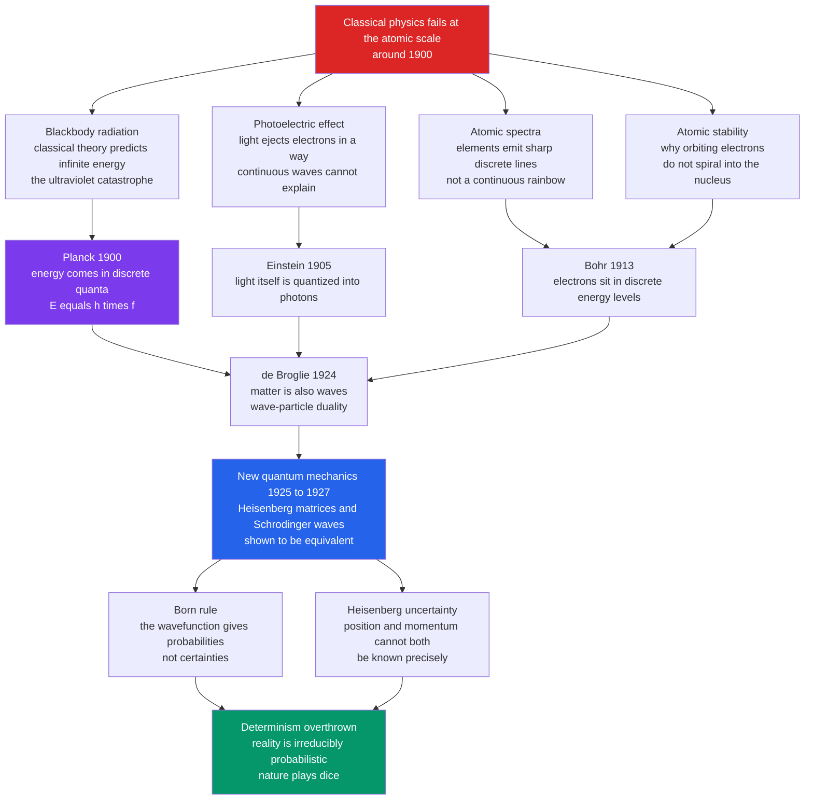

# ⚛️ The Quantum Revolution

> [!abstract] TL;DR
> Between roughly **1900 and 1927**, physics discovered that the atomic world does **not** obey the smooth, deterministic clockwork of Newton. Energy comes in discrete **quanta** ($E = hf$); light and matter are **both wave and particle**; you cannot know a particle's **position and momentum** at once; and outcomes are **fundamentally probabilistic** — "God does not play dice," Einstein protested, but nature does. Triggered by classical physics' *failures* at the atomic scale — the **blackbody "ultraviolet catastrophe,"** the **photoelectric effect**, discrete **atomic spectra**, and the puzzle of why atoms don't collapse — the revolution ran from **Planck's** reluctant quantum, through **Einstein's** photon and **Bohr's** atom, to the full **quantum mechanics** of **Heisenberg** and **Schrödinger** and **Born's** probabilistic wavefunction. It overturned classical **determinism** as radically as relativity overturned absolute space and time, became **the most precisely tested theory in the history of science**, and underpins essentially all modern electronics — while its *meaning* remains one of physics' deepest unsolved problems.

---

## Intuition

**Analogy:** Zoom in far enough and reality stops behaving like anything you have ever touched. Imagine a staircase that from a distance looks like a smooth ramp — but up close you find you can only ever stand on discrete **steps**, never in between; that is energy being **quantized**. Now imagine a coin that is genuinely *both* heads and tails while it spins, and only *becomes* one or the other the instant you slap it down and look — and that no amount of skill lets you predict which; that is a quantum **superposition** collapsing to a random outcome. Finally imagine that the harder you pin down *exactly where* the coin is, the more hopelessly blurred *how fast it is moving* becomes, as a law of nature and not of your eyesight; that is the **uncertainty principle**.

The everyday world feels solid, continuous, and predictable because we live at a scale where the quantum "steps" are unimaginably fine and the randomness averages out. The quantum revolution was the shocking discovery that this comfortable **Newtonian clockwork** — where a demon knowing every position and velocity could compute the entire future — is only an *approximation* that breaks down completely at the scale of atoms, where reality is **discrete, dual, fuzzy, and irreducibly random**. What makes it more than mysticism is that this strange framework predicts experiments to **twelve decimal places** — no theory in history has ever matched it.

---

## How It Works

### The classical crises (around 1900)

By 1900, Newtonian mechanics and Maxwell's electromagnetism seemed to have nearly finished physics. Then four stubborn anomalies at the atomic scale refused to yield — the kind of accumulating discrepancies that, in [[Kuhn_and_Scientific_Revolutions|Kuhn's]] account, precede a scientific revolution:

1. **Blackbody radiation — the "ultraviolet catastrophe."** Classical theory (the **Rayleigh–Jeans law**) predicted that a hot object should radiate *infinite* energy at short wavelengths, since it assigned equal energy to every possible vibration mode and there are infinitely many at high frequency. Experiment showed the spectrum *peaks and falls* instead. Classical physics did not just get a number wrong — it predicted an absurdity. (This is what the [Python demo](#python-demo) re-derives.)
2. **The photoelectric effect.** Light shining on a metal ejects electrons — but *whether* it does depends on the light's **frequency (color)**, not its brightness. Dim blue light works; intense red light does nothing. A continuous *wave* picture of light, where energy accumulates smoothly, cannot explain this threshold.
3. **Atomic spectra.** Heated elements emit light only at sharp, **discrete wavelengths** — a barcode of lines unique to each element — rather than a continuous rainbow. Classical physics offered no reason for these specific, quantized lines.
4. **Why atoms don't collapse.** In Rutherford's planetary atom, an orbiting electron is an accelerating charge, which by Maxwell's equations must radiate energy and spiral into the nucleus in about $10^{-11}$ seconds. Matter should not be stable at all. It obviously is.

These were not loose ends; they were signals that the classical framework *failed* in a whole new regime — exactly the situation described in [[Scientific_Method_and_Empiricism]], where anomalies force method and theory to change together.

### Planck's quantum (1900)

To fit the blackbody curve, **Max Planck** made a desperate mathematical assumption: that the oscillators in the walls of a hot cavity can only **emit and absorb energy in discrete lumps**, or *quanta*, of size

$$E = hf$$

where $f$ is frequency and $h = 6.626 \times 10^{-34}\ \text{J·s}$ is a new fundamental constant of nature (**Planck's constant**). Forbidding tiny high-frequency vibrations from soaking up energy tamed the ultraviolet divergence and matched experiment exactly. Planck considered it an *ad hoc* trick and spent years trying to explain it away classically. He had, without believing it, discovered the quantum.

### Einstein and the photon (1905)

**Albert Einstein** took the quantum literally. In the same "miracle year" as special relativity (see [[The_Modern_Physics_Revolution]]), he proposed that light *itself* is quantized into particle-like packets — later called **photons** — each carrying energy $E = hf$. A single photon knocks out a single electron only if its frequency is high enough; this explained the photoelectric effect precisely. It also forced a paradox: light is *both* a wave (interference, diffraction) *and* a stream of particles. Notably, it was **this** work, not relativity, that won Einstein the **1921 Nobel Prize** — see [[Photoelectric_Effect_and_Compton]].

### Bohr's atom (1913)

**Niels Bohr** grafted the quantum onto Rutherford's atom: electrons occupy only **discrete, stable energy levels** and radiate light only when *jumping* between them, emitting a photon whose energy equals the gap. This reproduced hydrogen's spectral lines with startling accuracy and explained atomic stability. It was a half-classical patchwork — the **"old quantum theory"** — but it worked well enough to prove the atom is quantized. This is the seed of modern [[Atomic_Structure_and_Subatomic_Particles|atomic structure]] and [[Quantum_Chemistry_and_Atomic_Orbitals|orbital chemistry]].

### Wave–particle duality (1924)

**Louis de Broglie** made the audacious symmetric leap: if waves (light) can be particles, then particles (electrons) can be **waves**, with wavelength $\lambda = h/p$. Within three years, electron beams were shown to **diffract** off crystals, producing interference fringes — direct proof that matter is wavelike. The emblem of the whole idea is the **double-slit experiment**: fire electrons one at a time and each lands as a single dot, yet the *accumulated pattern* is wave interference (the second half of the [Python demo](#python-demo)). Everything is both wave and particle, depending on how you look — the core of [[Wave_Particle_Duality_and_Uncertainty]].

### The new quantum mechanics (1925–1927)

Between 1925 and 1927 the full theory arrived, in two guises that looked utterly different:

- **Werner Heisenberg's matrix mechanics** treated observables as non-commuting matrices, dispensing with electron "orbits" entirely.
- **Erwin Schrödinger's wave mechanics** described the electron by a continuous **wavefunction** $\psi$ evolving via the [[Schrodinger_Equation|Schrödinger equation]].

Schrödinger and others soon proved the two formulations are **mathematically equivalent**. But what *is* $\psi$? **Max Born** supplied the shocking answer: $|\psi|^2$ gives the **probability** of finding the particle at a location. The wavefunction encodes not what *is*, but the **odds** of what you will measure. Certainty is gone; only probabilities are predictable.

### The uncertainty principle (1927)

Heisenberg then showed this fuzziness is a law of nature, not a limit of instruments:

$$\Delta x \,\Delta p \ \ge\ \frac{\hbar}{2}$$

The more precisely a particle's **position** ($x$) is defined, the less defined its **momentum** ($p$) must be, and vice versa — not because measuring disturbs it, but because a particle simply *does not possess* sharp values of both at once. This is the formal end of classical determinism: even in principle, the future is not fully computable from the present.



---

## Key Concepts

### Secondary — the core picture

- **Quantization.** Energy, and other quantities, come in **discrete lumps**, not a continuous flow — the staircase, not the ramp.
- **Wave–particle duality.** Light and matter behave as **both** waves and particles; which face you see depends on the experiment.
- **The photon and $E = hf$.** Light is bundled into quanta whose energy is set by frequency, explaining the photoelectric effect.
- **Probability, not certainty.** Quantum mechanics predicts the **odds** of outcomes, not the outcomes themselves — a decisive break with Newtonian [[Newtonian_Mechanics_and_the_Principia|clockwork prediction]].

### Undergraduate — the mechanisms

- **Planck's law vs. Rayleigh–Jeans.** Quantizing oscillator energies cures the ultraviolet catastrophe by suppressing high-frequency modes (the demo below).
- **The wavefunction and the Born rule.** $\psi$ evolves deterministically via the Schrödinger equation, but **measurement** yields a random result with probability $|\psi|^2$ — deterministic evolution, probabilistic observation.
- **Heisenberg uncertainty.** $\Delta x\,\Delta p \ge \hbar/2$ is a structural feature of wave descriptions (a Fourier trade-off), not a technological limitation.
- **Superposition.** A quantum system can be in a combination of states at once; measurement "selects" one — the basis of a [[Qubits_and_the_Bloch_Sphere|qubit]].
- **Bohr's energy levels.** Discrete orbits explain why each element's spectrum is a fixed barcode of lines.

### Graduate — foundations and interpretation

- **The measurement problem.** Unitary Schrödinger evolution is continuous and reversible, yet measurement appears to cause a sudden, irreversible **collapse**. Reconciling the two is quantum mechanics' deepest open question — see [[Measurement_and_the_No_Cloning_Theorem]].
- **The Copenhagen interpretation.** Bohr and Heisenberg's stance: the wavefunction is our knowledge, measurement collapses it, and **complementarity** means wave and particle descriptions are mutually exclusive but jointly necessary.
- **The Einstein–Bohr debates and EPR.** Einstein argued quantum mechanics must be *incomplete* (hidden variables); the 1935 **EPR paradox** made "spooky action at a distance" precise.
- **Bell's theorem and entanglement.** John Bell (1964) showed that *no* local-hidden-variable theory can reproduce quantum predictions; experiments confirm quantum mechanics and hence genuine **nonlocality** — the foundation of [[Entanglement_and_Bell_States]] and the 2022 Nobel Prize.
- **Schrödinger's cat.** A thought experiment dramatizing superposition scaled up to absurdity, sharpening *where* the quantum-classical boundary lies (decoherence is the modern answer).
- **Rival interpretations.** Many-worlds, de Broglie–Bohm pilot waves, and objective-collapse theories all reproduce the *same* predictions — the interpretation debate is, so far, **empirically underdetermined**, a live case for [[Scientific_Realism|scientific realism]] and the philosophy of science.

---

## Python Demo

This demo **re-derives the birth of quantum theory**. Part 1 reproduces the historical trigger: the classical **Rayleigh–Jeans** blackbody prediction *diverges* at short wavelengths (the **ultraviolet catastrophe**), while **Planck's** quantized law — built on the single assumption $E = hf$ — peaks and falls, matching experiment. Part 2 illustrates **wave–particle duality**: particles fired one at a time each land as a single dot, yet the accumulated pattern is wave **interference**, emerging purely statistically. Requires `numpy` and `matplotlib`.

```python
"""
The birth of quantum theory, re-derived by simulation.

PART 1 - PLANCK'S BLACKBODY LAW vs the ULTRAVIOLET CATASTROPHE
  Classical physics (Rayleigh-Jeans) predicts a hot body's spectral radiance
  DIVERGES as wavelength -> 0 (infinite energy: the "ultraviolet catastrophe").
  Planck's fix -- assume energy comes in discrete quanta E = h f -- gives a
  curve that peaks and falls, matching experiment. That single assumption
  launched quantum theory.

PART 2 - THE DOUBLE-SLIT, one particle at a time
  Fire particles one by one at two slits. Each lands as a single dot, yet the
  accumulated pattern is wave-like interference fringes -- wave-particle
  duality: the interference is a PROBABILITY distribution built up statistically.

Requires: numpy, matplotlib
"""
import numpy as np
import matplotlib.pyplot as plt

# ----- Physical constants (SI) -----
h  = 6.62607015e-34   # Planck constant  (J s)
c  = 2.99792458e8     # speed of light   (m/s)
kB = 1.380649e-23     # Boltzmann const. (J/K)

# =====================================================================
# PART 1: Blackbody radiation -- Rayleigh-Jeans vs Planck
# =====================================================================
T  = 5000.0                              # temperature (K)
wl = np.linspace(1e-7, 3e-6, 2000)       # wavelengths 100 nm .. 3000 nm

# Classical Rayleigh-Jeans law: diverges like 1/lambda^4 as lambda -> 0
rayleigh_jeans = 2.0 * c * kB * T / wl**4

# Planck's law: the quantum fix (finite -- peaks, then falls)
planck = (2.0 * h * c**2 / wl**5) / (np.exp(h * c / (wl * kB * T)) - 1.0)

# Wien's displacement law: where Planck's curve peaks
wl_peak = 2.897771955e-3 / T
print(f"Planck peak wavelength at {T:.0f} K : {wl_peak*1e9:.0f} nm")
print(f"Rayleigh-Jeans at 100 nm : {rayleigh_jeans[0]:.3e}  (classical blow-up)")
print(f"Planck         at 100 nm : {planck[0]:.3e}  (finite -- catastrophe cured)")

# =====================================================================
# PART 2: Double-slit interference built one particle at a time
# =====================================================================
rng = np.random.default_rng(42)

wl_e = 5.0e-11     # de Broglie wavelength of the particle (m)
d    = 1.0e-6      # slit separation (m)
a    = 3.0e-7      # slit width (m)
L    = 1.0         # slit-to-screen distance (m)

x     = np.linspace(-4e-3, 4e-3, 1200)      # screen coordinate (m)
beta  = np.pi * a * x / (wl_e * L)          # single-slit envelope phase
delta = np.pi * d * x / (wl_e * L)          # two-slit interference phase
envelope = np.sinc(beta / np.pi)**2         # np.sinc(y) = sin(pi y)/(pi y)
prob = envelope * np.cos(delta)**2          # intensity == probability density
prob /= prob.sum()

def sample_hits(n):
    """Sample n particle landing positions from the interference distribution."""
    idx = rng.choice(len(x), size=n, p=prob)
    return x[idx]

counts = [200, 2000, 40000]
hits = {n: sample_hits(n) for n in counts}

# =====================================================================
# Visualize
# =====================================================================
fig = plt.figure(figsize=(13, 8))

# --- Blackbody panel (top) ---
axB = fig.add_subplot(2, 1, 1)
axB.plot(wl*1e9, rayleigh_jeans, color="#dc2626", lw=2,
         label="Rayleigh-Jeans (classical): ultraviolet catastrophe")
axB.plot(wl*1e9, planck, color="#2563eb", lw=2,
         label="Planck (quantized E = h f): matches experiment")
axB.axvline(wl_peak*1e9, color="#059669", ls="--", alpha=0.8,
            label=f"Planck peak ~ {wl_peak*1e9:.0f} nm")
axB.set_ylim(0, planck.max()*1.6)
axB.set_xlabel("Wavelength (nm)")
axB.set_ylabel("Spectral radiance  (W / m^3 / sr)")
axB.set_title(f"Blackbody at {T:.0f} K: classical theory blows up, Planck's quanta cure it")
axB.legend(loc="upper right", fontsize=9)
axB.grid(alpha=0.3)

# --- Double-slit buildup panels (bottom row) ---
for j, n in enumerate(counts):
    ax = fig.add_subplot(2, 3, 4 + j)
    ax.hist(hits[n]*1e3, bins=120, range=(-4, 4), color="#7c3aed")
    ax.set_title(f"{n} particles")
    ax.set_xlabel("Screen position (mm)")
    ax.set_yticks([])
    if j == 0:
        ax.set_ylabel("particle count")

fig.text(0.5, 0.47, "Wave-particle duality: discrete dots accumulate into wave fringes",
         ha="center", fontsize=11)
plt.tight_layout(rect=(0, 0, 1, 0.99))
plt.savefig("quantum_revolution_demo.png", dpi=120)
plt.show()
```

Running it prints the classical Rayleigh–Jeans value at 100 nm as an enormous number while Planck's stays finite — the ultraviolet catastrophe cured by one quantum assumption — and draws the two blackbody curves plus the double-slit pattern *emerging from randomness*: at 200 particles the screen looks like noise, but by 40,000 the wave fringes are unmistakable, even though every particle arrived as a single, discrete dot.

---

## Real-World Applications

- **Semiconductors and all of computing.** The transistor, the diode, and the integrated circuit rest on the quantum **band theory** of solids; without quantum mechanics there is no microchip. See [[Semiconductors_and_Devices]].
- **Lasers and LEDs.** Stimulated emission between quantized energy levels — Einstein's 1917 insight — powers lasers, fiber-optic communication, and every LED. See [[Laser_Physics]].
- **Medical imaging.** **MRI** exploits nuclear spin quantization; PET and other modalities rely on quantum-scale physics.
- **Atomic clocks and GPS.** Timekeeping via quantized atomic transitions gives the sub-nanosecond precision that satellite navigation depends on.
- **Chemistry and materials.** Quantized orbitals explain bonding, the periodic table, and reaction rates — see [[Quantum_Chemistry_and_Atomic_Orbitals]].
- **Quantum computing and cryptography.** Superposition and [[Entanglement_and_Bell_States|entanglement]] are now engineering *resources*, not just curiosities — see [[Quantum_Computing_Overview]]. The strange theory that broke classical physics now builds tomorrow's machines, echoing the earlier information revolution chronicled in [[The_Information_Age]].

---

## Common Pitfalls

- **"Uncertainty is just clumsy measurement."** No — $\Delta x\,\Delta p \ge \hbar/2$ says the particle *does not possess* sharp values of both; disturbance-by-measurement is a separate, weaker effect often confused with it.
- **Treating the wavefunction as a physical thing spread in space.** $\psi$ is a *probability amplitude*; $|\psi|^2$ gives odds. Reifying it invites confusion about "collapse" and about what is really moving.
- **Thinking observation requires a conscious observer.** "Measurement" means irreversible interaction with a macroscopic environment (**decoherence**), not a human looking. The Schrödinger's-cat mysticism trades on this slip.
- **Believing quantum weirdness stays in the lab.** Quantum mechanics governs everything; classical behavior *emerges* from it by averaging and decoherence. The classical world is the special case, not the other way around.
- **Assuming an interpretation is settled physics.** Copenhagen, many-worlds, and pilot-wave theory make identical predictions; choosing among them is (so far) philosophy, not experiment — a caution about mistaking a favored [[Scientific_Realism|realist picture]] for proven fact.
- **Reading "God does not play dice" as the final word.** Einstein *lost* this argument empirically: Bell tests rule out the local-realist world he wanted. Deference to a great name is no substitute for the evidence.

---

## Related Concepts

This note is the first of the *Modern Physics Revolutions* section. Sibling deep-dives referenced here in prose but **not yet written** — a *Relativity Revolution*, a *The Atomic Age* (fission, the bomb, nuclear power), a *Computing and Information Revolution*, and a *Sociology of Scientific Knowledge* — will follow. The wikilinks below point to **verified** notes across the vault:

- [[History_of_Science_Overview]] — the entry point placing the quantum revolution as one of the two great 20th-century breaks with classical certainty.
- [[Newtonian_Mechanics_and_the_Principia]] — the deterministic clockwork worldview that the quantum revolution overthrew at the atomic scale.
- [[The_Modern_Physics_Revolution]] — the History-vault companion covering relativity *and* quantum mechanics together as the classical-to-modern pivot.
- [[Newton_and_the_Mechanical_Universe]] — the mechanical, deterministic cosmos whose limits quantum mechanics exposed.
- [[Scientific_Method_and_Empiricism]] — how accumulating anomalies force theory *and* method to change; the quantum crises are a textbook case.
- [[Kuhn_and_Scientific_Revolutions]] — the paradigm-shift framework in which the quantum break is a canonical revolution.
- [[Scientific_Realism]] — the interpretation debate as a live problem: do our best theories describe reality, or only predict it?
- [[Wave_Particle_Duality_and_Uncertainty]] — the Physics-vault quantitative treatment of duality and the uncertainty principle.
- [[Schrodinger_Equation|Schrödinger Equation]] — the wave equation governing $\psi$; the mathematical heart of the new mechanics.
- [[Photoelectric_Effect_and_Compton]] — the experiments that established the photon and light's particle nature.
- [[Atomic_Models_and_Spectroscopy]] — Bohr's quantized atom and the spectral lines it explains.
- [[Quantum_Statistical_Mechanics]] — Planck's blackbody problem placed in its statistical-mechanics setting.
- [[Interference_and_Diffraction]] — the wave physics behind the double-slit pattern the demo reproduces.
- [[Atomic_Structure_and_Subatomic_Particles]] — the Chemistry-vault picture of the quantized atom.
- [[Quantum_Chemistry_and_Atomic_Orbitals]] — how quantization built the modern theory of bonding and the periodic table.
- [[Entanglement_and_Bell_States]] — nonlocality made precise; the resolution of the Einstein–Bohr debate.
- [[Measurement_and_the_No_Cloning_Theorem]] — the measurement problem and collapse in modern quantum-information language.
- [[Qubits_and_the_Bloch_Sphere]] — superposition turned into a computational resource.
- [[Quantum_Computing_Overview]] — the technological frontier the revolution ultimately enabled.
- [[The_Information_Age]] — the computing revolution that quantum-based semiconductors made possible.

---

## Review Questions

1. **(Secondary)** In your own words, what does it mean to say energy is **quantized**? Use the staircase-versus-ramp analogy, then explain how *assuming* energy comes in lumps of size $E = hf$ resolves the "ultraviolet catastrophe" that classical physics could not.
2. **(Undergraduate)** The double-slit experiment fires electrons **one at a time**, and each lands as a single dot — yet an interference pattern builds up. Explain how this single fact demonstrates *both* the particle nature *and* the wave nature of matter, and connect the emerging fringes to the **Born rule** ($|\psi|^2$ as probability).
3. **(Graduate)** Einstein insisted "God does not play dice" and argued quantum mechanics was *incomplete*. State the **EPR** challenge and how **Bell's theorem** plus later experiments answered it. What does this episode reveal about the difference between the **predictive success** of quantum mechanics and the **interpretation** of what it means — and how does that distinction bear on the debate between scientific realism and instrumentalism?

---

## Sources

- Kuhn, T. S. (1978). *Black-Body Theory and the Quantum Discontinuity, 1894–1912*. Oxford University Press.
- Kumar, M. (2008). *Quantum: Einstein, Bohr, and the Great Debate about the Nature of Reality*. Icon Books.
- Pais, A. (1991). *Niels Bohr's Times, in Physics, Philosophy, and Polity*. Oxford University Press.
- Baggott, J. (2011). *The Quantum Story: A History in 40 Moments*. Oxford University Press.
- [History of quantum mechanics (Wikipedia)](https://en.wikipedia.org/wiki/History_of_quantum_mechanics)

---

#history-of-science #quantum-revolution #planck #heisenberg #wave-particle-duality
