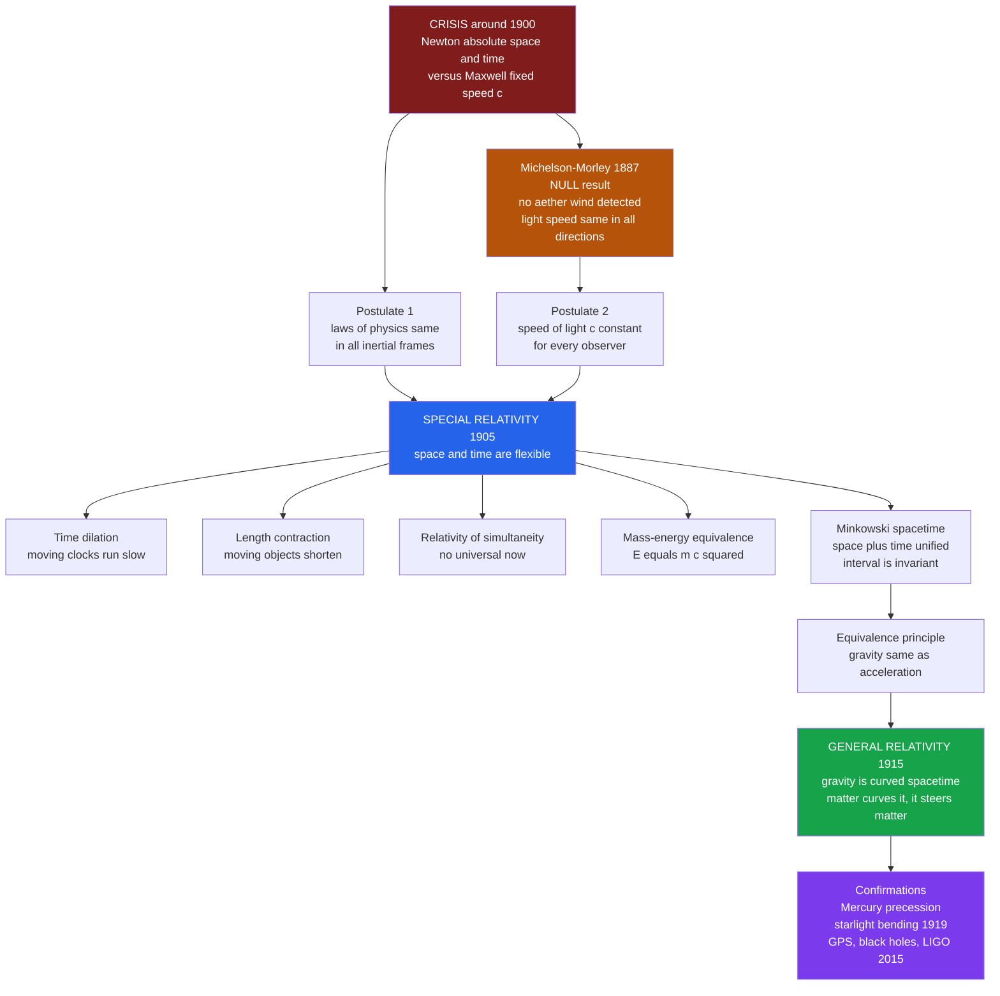

# 🌀 The Relativity Revolution

> [!abstract] TL;DR
> Between **1905 and 1915**, a young patent clerk named **Albert Einstein** demolished the two most self-evident facts in physics: that space is a fixed stage and time a universal clock ticking identically everywhere. **Special relativity** (1905), built from just **two postulates**, showed that moving clocks run slow, moving objects contract, simultaneity is relative, and mass is frozen energy, $E = mc^2$. **General relativity** (1915) then reconceived **gravity itself** — not as a force, but as the **curvature of a unified spacetime** bent by mass and energy. Wildly counterintuitive yet confirmed to exquisite precision by Mercury's orbit, starlight bending, GPS, and gravitational waves, relativity stands with quantum theory as one of the **two pillars of modern physics**.

---

## Intuition

**Analogy:** In Newton's universe, imagine a single giant grandfather clock hanging in the sky above everything, its pendulum swinging out one identical *now* for the whole cosmos — a soldier on Earth, a comet near Jupiter, and an alien on a distant star all share the same tick. Beneath that clock stretches a fixed, rigid stage of space, an unchanging grid you could in principle paint onto the void. This felt as obvious as anything could: of course a second is a second everywhere, and of course a meter is a meter. You can *feel* that time flows and space just sits there.

Einstein smashed both. There is **no universal clock and no fixed stage**. Time itself runs *slower* for a moving observer — not as an illusion but as a physical fact you can measure with real atomic clocks on airplanes. Lengths *shrink* along the direction of motion. Two events that are simultaneous for you happen at *different times* for someone gliding past. And mass is not separate from energy — it *is* energy, related by the most famous equation ever written. Then, ten years later, Einstein went further: **gravity is just the shape of spacetime**. A planet orbiting the Sun is not being pulled by an invisible rope; it is coasting in a straight line through a spacetime that the Sun's mass has *curved* — the way a marble circles the funnel of a bent trampoline. The "obvious" absolutes of space and time turned out to be flexible, stitched together into a single bending fabric. It is among the most mind-bending revolutions in the history of thought — and among the most thoroughly proven.

---

## How It Works

### The crisis that forced the revolution

By roughly **1900**, classical physics stood on two magnificent but *incompatible* pillars:

1. **Newtonian mechanics** assumed **absolute space** and **absolute time** — an unchanging backdrop and a universal clock. Velocities simply add: throw a ball at 20 mph from a train moving 60 mph, and a trackside observer sees 80 mph. This is common sense, and for centuries it worked flawlessly.
2. **Maxwell's electromagnetism** (1860s) unified electricity, magnetism, and light, and it contained a hard number: light travels at a **fixed speed $c \approx 3 \times 10^8$ m/s**. But *fixed relative to what?* Every known wave — sound, water ripples — travels through a medium. Physicists therefore assumed a luminiferous **aether** filling all space, the stationary stuff light waved through, and $c$ was light's speed *relative to the aether*.

If the aether existed, the Earth plowing through it at 30 km/s should create an **aether wind** — light should measure faster with the wind and slower against it. In **1887**, the **Michelson-Morley experiment** used an ultra-sensitive interferometer to detect this wind. It expected a clear fringe shift. It found **nothing** — a **null result**, repeated with ever-greater precision. Light's speed was the *same* in every direction regardless of Earth's motion. This was a genuine contradiction gnawing at the heart of physics: Newton's velocity addition and Maxwell's constant $c$ could not both be right.

### Special relativity from two postulates (1905)

In his "miracle year," Einstein resolved the crisis not by patching the aether but by **taking Maxwell literally** and throwing out Newton's absolutes. He built everything on two deceptively simple postulates:

- **Principle of relativity:** the laws of physics are identical in all **inertial** (non-accelerating) frames. There is no experiment that reveals absolute rest — the aether is unnecessary and undetectable.
- **Constancy of light speed:** light travels at $c$ for **every** observer, no matter how fast the source or observer moves.

Hold both at once and common sense buckles. If *everyone* measures the same $c$, then something else must give — and what gives is **space and time themselves**. The consequences, all captured by the **Lorentz factor** $\gamma = 1/\sqrt{1 - v^2/c^2}$:

- **Time dilation** — a moving clock runs slow by the factor $\gamma$. Muons created in the upper atmosphere reach the ground only because their internal clocks slow down.
- **Length contraction** — a moving object shortens along its direction of travel by $1/\gamma$.
- **Relativity of simultaneity** — events simultaneous in one frame are not in another. There is **no universal "now."**
- **Mass-energy equivalence** — $E = mc^2$. Mass and energy are two faces of one quantity; a tiny mass hides an enormous energy.

**Minkowski** (1908) then revealed the deep unity: space and time are not separate but woven into a four-dimensional **spacetime**, and while different observers disagree about times and lengths, they *all* agree on the **spacetime interval** between two events. Absolute time was abolished; an absolute *interval* took its place. This is the radical core: measurements depend on the observer's motion, yet an invariant survives underneath. Relativity is not "everything is relative" — it is a theory of what stays **invariant**.

### General relativity: gravity as curved spacetime (1915)

Special relativity only covered *inertial* frames and said nothing about **gravity**. Einstein's next leap began with his "happiest thought": a person in free fall feels no gravity. From this he distilled the **equivalence principle** — **gravity is locally indistinguishable from acceleration.** Standing in a windowless box, you cannot tell whether you are on Earth's surface or in a rocket accelerating at $9.8 \text{ m/s}^2$.

Pursuing this for eight years (with crucial mathematics from Riemann's geometry and help from Grossmann), Einstein arrived at his masterpiece: **gravity is not a force but the curvature of spacetime.** Mass and energy tell spacetime how to bend; the curvature tells matter how to move. As **John Wheeler** put it: *"Matter tells spacetime how to curve, and spacetime tells matter how to move."* Planets orbit not because a force reaches across space, but because they follow the straightest possible paths (**geodesics**) through a spacetime warped by the Sun. Newton's gravity became a geometric theory.

### The confirmations

General relativity made bold, testable predictions that Newton could not match:

- **Mercury's perihelion precession** — the tiny, stubborn 43 arcseconds-per-century drift in Mercury's orbit that had defied Newtonian explanation for decades fell out of Einstein's equations *exactly*.
- **Bending of starlight** — Einstein predicted the Sun's gravity would deflect passing starlight by twice the Newtonian amount. **Eddington's 1919 eclipse expedition** measured it and confirmed Einstein, splashing his name across the world's front pages overnight.
- **Gravitational redshift** — light climbing out of a gravity well loses energy and reddens; confirmed in the lab and by white dwarfs.
- **Modern tests** — **GPS satellites** must correct for both special- and general-relativistic time shifts or navigation would drift kilometers per day; **gravitational lensing** maps dark matter; **black holes** are imaged; and in **2015 LIGO** directly detected **gravitational waves** — ripples in spacetime from colliding black holes, a century after Einstein predicted them.



---

## Key Concepts

### Secondary Level
- **Absolute vs relative time** — Newton believed one clock ticked for the whole universe; Einstein showed time runs at different rates for different observers depending on their motion.
- **The speed of light is constant** — no matter how fast you chase a light beam, it always races away from you at the same speed $c$. This single stubborn fact forces everything else.
- **Time dilation** — a clock moving fast relative to you runs slow. Real and measured, not an illusion.
- **$E = mc^2$** — mass is a concentrated form of energy; even a small mass holds enormous energy, which is why the Sun and nuclear reactors work.
- **Gravity as curved space** — instead of an invisible pulling force, massive objects like the Sun *warp* the space around them, and planets roll along those curves.

### Undergraduate Level
- **The two postulates** — the principle of relativity (same laws in all inertial frames) plus the constancy of $c$; from these two lines all of special relativity is derived.
- **Lorentz factor** — $\gamma = 1/\sqrt{1 - v^2/c^2}$; the universal "stretch factor" governing time dilation ($\times \gamma$) and length contraction ($\div \gamma$); equals 1 at rest and diverges as $v \to c$.
- **Relativity of simultaneity** — the surprising death of universal "now": whether two spatially separated events are simultaneous depends on the observer's motion.
- **Spacetime interval** — the frame-independent quantity $s^2 = c^2 t^2 - x^2 - y^2 - z^2$; observers disagree on $t$ and $x$ but *all* agree on $s$. Invariance, not chaos.
- **Equivalence principle** — the local indistinguishability of gravity and acceleration; the seed of general relativity and the reason all objects fall at the same rate.
- **Geodesics** — free-falling bodies follow the straightest possible paths through curved spacetime; "orbit" is just coasting on a curved geometry.

### Graduate Level
- **Lorentz transformations and Minkowski geometry** — the linear coordinate transformations preserving the spacetime interval; special relativity as the pseudo-Euclidean geometry of flat spacetime with signature $(+,-,-,-)$.
- **The Einstein field equations** — $G_{\mu\nu} = 8\pi G/c^4 \, T_{\mu\nu}$; ten coupled nonlinear PDEs relating spacetime curvature (Einstein tensor) to the stress-energy of matter and fields. Deceptively compact, ferociously hard to solve.
- **The Schwarzschild solution** — the first exact solution (1916), describing spacetime outside a spherical mass; predicts the event horizon and black holes, and yields Mercury's precession and light bending.
- **Stress-energy tensor** — the source of gravity is not mass alone but the full $T_{\mu\nu}$ (energy density, momentum, pressure, stress), which is why energy and pressure themselves gravitate.
- **Correspondence principle** — general relativity reduces to Newtonian gravity in the weak-field, low-velocity limit ($v \ll c$, weak curvature); Newton's theory is an approximation, not an error.
- **Open frontier** — general relativity (smooth, deterministic, geometric) and quantum theory (discrete, probabilistic) remain unreconciled; a full theory of **quantum gravity** is the great unfinished project of physics.

---

## Python Demo

```python
# The Relativity Revolution, made quantitative in four figures:
#   (A) TIME DILATION and LENGTH CONTRACTION: the Lorentz factor gamma vs v/c,
#       diverging as speed approaches c.
#   (B) THE TWIN PARADOX in hard numbers: how much LESS a traveling twin ages.
#   (C) MICHELSON-MORLEY: expected aether-wind fringe shift vs the observed NULL.
#   (D) E = m c^2: the energy locked in a gram of mass.
import numpy as np
import matplotlib.pyplot as plt

c = 299_792_458.0  # speed of light, m/s

# ---------------------------------------------------------------
# The Lorentz factor: the heart of special relativity
# ---------------------------------------------------------------
def gamma(beta):                      # beta = v / c
    return 1.0 / np.sqrt(1.0 - beta**2)

beta = np.linspace(0.0, 0.999, 1000)  # v/c from rest to almost light speed
g = gamma(beta)

# ---------------------------------------------------------------
# (B) Twin paradox: traveling twin flies at 0.8c for 10 years of Earth time
# ---------------------------------------------------------------
v_frac   = 0.80
earth_yr = 10.0
travel_yr = earth_yr / gamma(v_frac)          # moving twin's clock runs slow
print("TWIN PARADOX")
print(f"  Speed = {v_frac}c, gamma = {gamma(v_frac):.4f}")
print(f"  Earth twin ages   : {earth_yr:.2f} years")
print(f"  Traveling twin ages: {travel_yr:.2f} years")
print(f"  The traveler is YOUNGER by {earth_yr - travel_yr:.2f} years\n")

# A meter stick at 0.8c contracts along its motion:
print("LENGTH CONTRACTION")
print(f"  A 1.00 m rod at {v_frac}c measures {1.0/gamma(v_frac):.3f} m\n")

# ---------------------------------------------------------------
# (D) E = m c^2 for one gram of matter
# ---------------------------------------------------------------
E_gram = 0.001 * c**2                          # joules in 1 g of mass
print("MASS-ENERGY EQUIVALENCE")
print(f"  E = mc^2 for 1 gram = {E_gram:.3e} J")
print(f"  Roughly {E_gram/3.6e6:.2e} kWh -- a small city's daily power.\n")

# ---------------------------------------------------------------
# (C) Michelson-Morley: expected fringe shift vs the null result
# Earth's orbital speed ~ 30 km/s would give a measurable shift IF an aether
# existed. Expected shift ~ (L/lambda) * (v/c)^2 fringes.
# ---------------------------------------------------------------
L      = 11.0                                   # effective arm length, meters
lam    = 500e-9                                 # sodium light wavelength, m
v_orb  = 30_000.0                               # Earth orbital speed, m/s
expected_shift = (L / lam) * (v_orb / c)**2     # predicted fringe shift
observed_shift = 0.01                           # ~null (upper bound, fringes)
print("MICHELSON-MORLEY 1887")
print(f"  Aether theory PREDICTS a fringe shift of ~{expected_shift:.3f}")
print(f"  Experiment OBSERVED  ~{observed_shift:.3f} (a null result)")
print("  => No aether wind. Light speed is the same in all directions.")

# ---------------------------------------------------------------
# Visualize
# ---------------------------------------------------------------
fig, ax = plt.subplots(2, 2, figsize=(13, 9))

# (A) Lorentz factor / time dilation curve
ax[0, 0].plot(beta, g, color="#2563eb", lw=2)
ax[0, 0].axhline(1, color="gray", ls=":", lw=1)
ax[0, 0].axvline(0.8, color="#dc2626", ls="--", lw=1)
ax[0, 0].scatter([0.8], [gamma(0.8)], color="#dc2626", zorder=5)
ax[0, 0].annotate("0.8c: clocks run\n1.67x slower",
                  xy=(0.8, gamma(0.8)), xytext=(0.35, 4.5),
                  arrowprops=dict(arrowstyle="->", color="#dc2626"), fontsize=9)
ax[0, 0].set_xlabel("speed  v / c")
ax[0, 0].set_ylabel(r"Lorentz factor  $\gamma$")
ax[0, 0].set_title("Time dilation blows up near light speed")
ax[0, 0].set_ylim(0, 8)
ax[0, 0].grid(alpha=0.3)

# (A') Length contraction: proper length shrinks by 1/gamma
ax[0, 1].plot(beta, 1.0 / g, color="#16a34a", lw=2)
ax[0, 1].axvline(0.8, color="#dc2626", ls="--", lw=1)
ax[0, 1].scatter([0.8], [1.0 / gamma(0.8)], color="#dc2626", zorder=5)
ax[0, 1].set_xlabel("speed  v / c")
ax[0, 1].set_ylabel("measured length / rest length")
ax[0, 1].set_title("Length contraction: moving objects shorten")
ax[0, 1].set_ylim(0, 1.05)
ax[0, 1].grid(alpha=0.3)

# (C) Michelson-Morley: expected vs observed fringe shift
ax[1, 0].bar(["Aether theory\n(predicted)", "Experiment\n(observed)"],
             [expected_shift, observed_shift],
             color=["#b45309", "#334155"])
ax[1, 0].set_ylabel("fringe shift (fringes)")
ax[1, 0].set_title("Michelson-Morley 1887: the null result that killed the aether")
for i, val in enumerate([expected_shift, observed_shift]):
    ax[1, 0].text(i, val + 0.01, f"{val:.2f}", ha="center", fontsize=10)
ax[1, 0].grid(axis="y", alpha=0.3)

# (D) Twin paradox: ages accumulated over one round trip
years = np.linspace(0, earth_yr, 100)
ax[1, 1].plot(years, years, color="#334155", lw=2, label="Earth twin")
ax[1, 1].plot(years, years / gamma(v_frac), color="#2563eb", lw=2,
              label=f"Traveling twin at {v_frac}c")
ax[1, 1].fill_between(years, years / gamma(v_frac), years,
                      color="#2563eb", alpha=0.12)
ax[1, 1].set_xlabel("Earth elapsed time (years)")
ax[1, 1].set_ylabel("age accumulated (years)")
ax[1, 1].set_title("Twin paradox: the traveler ages less")
ax[1, 1].legend()
ax[1, 1].grid(alpha=0.3)

plt.tight_layout()
plt.savefig("relativity_revolution.png", dpi=130)
print("\nSaved relativity_revolution.png")
# plt.show()
```

Running this prints the twin who flies at 0.8c for ten Earth-years returning aged only **6 years** — physically **4 years younger** than the twin who stayed home. The Lorentz-factor panel shows $\gamma$ climbing gently at everyday speeds but rocketing toward infinity as $v \to c$, which is *why* nothing with mass can reach light speed. The Michelson-Morley bars make the crisis visceral: the aether theory predicted a clear fringe shift, and the experiment saw essentially **nothing** — the empirical hammer blow that special relativity was built to explain. And $E = mc^2$ turns a single gram of matter into roughly $9 \times 10^{13}$ joules, the energy that powers stars and bombs alike.

---

## Real-World Applications

- **GPS navigation** — satellite clocks tick faster than ground clocks by about 38 microseconds per day (general-relativistic altitude effect minus special-relativistic speed effect). Without relativistic correction, GPS positions would drift by roughly **10 km per day**. Relativity is running in your phone right now.
- **Nuclear energy and the stars** — $E = mc^2$ quantifies the energy released when nuclei fuse (the Sun) or split (reactors and weapons); the "missing" mass becomes energy exactly as Einstein predicted.
- **Particle accelerators** — the LHC accelerates protons to 0.999999991c; their time dilation, mass-energy, and collision products are all computed with special relativity as routine engineering, not exotic theory.
- **Gravitational-wave astronomy** — LIGO and Virgo detect spacetime ripples from merging black holes and neutron stars, opening a wholly new window on the universe founded entirely on general relativity.
- **Cosmology** — general relativity is the mathematical framework for the expanding universe, the Big Bang, black holes, and gravitational lensing used to weigh dark matter and map the cosmos.
- **Medical and lab technology** — muon lifetimes, synchrotron radiation, and precision atomic clocks (which have measured time dilation over height differences of *centimeters*) all rely on relativistic physics.

---

## Common Pitfalls

- **"Relativity means everything is relative / subjective."** The exact opposite. Relativity is about what is **invariant** — the speed of light, the spacetime interval, the laws of physics. It replaces false absolutes (universal time) with deeper, observer-independent ones. The cultural slogan inverts the science.
- **"Time dilation is just an illusion or a measurement error."** It is a real physical effect. Atomic clocks flown on aircraft, muons surviving to the ground, and GPS satellites all confirm that moving clocks genuinely tick slow.
- **"The twin paradox is a genuine contradiction."** It is not. The situation is *not* symmetric: the traveling twin **accelerates** to turn around, breaking the symmetry, so the twins' frames are not equivalent. The traveler unambiguously ages less. It only *seems* paradoxical if you forget the acceleration.
- **"Nothing can ever go faster than light because of a cosmic speed-limit sign."** The limit is structural: as $v \to c$, the Lorentz factor and required energy diverge to infinity, so accelerating a massive object to $c$ would take infinite energy. Massless things (light) *must* travel at exactly $c$.
- **"General relativity proved Newton wrong."** Newton is a superb **approximation** in the weak-field, low-speed regime and is still used to fly spacecraft. Relativity *contains* Newton as a limiting case — the classic lesson that a "final" theory can be a special case of a deeper one.
- **"Gravity is a force in general relativity."** In Einstein's picture there is no gravitational force at all; objects follow geodesics (straightest paths) through curved spacetime. What we feel as gravity's "pull" is the geometry of spacetime, not a pulling agent.

---

## Related Concepts

- [[The_Modern_Physics_Revolution]] — the History-vault companion telling how relativity and quantum theory together overturned classical physics in the early 20th century.
- [[Special_Relativity_Kinematics]] — the full mathematical machinery of Lorentz transformations, time dilation, and length contraction worked out in the Physics vault.
- [[Relativistic_Dynamics]] — energy, momentum, and $E = mc^2$ developed rigorously, including relativistic mass and four-momentum.
- [[Spacetime_and_Four_Vectors]] — Minkowski's unified spacetime, the invariant interval, and the four-vector formalism.
- [[Introduction_to_General_Relativity]] — the equivalence principle, curved spacetime, and the Einstein field equations in detail.
- [[Schwarzschild_Solution_and_Black_Holes]] — the first exact solution of Einstein's equations, event horizons, and the origin of Mercury's precession and light bending.
- [[Cosmology_and_Expanding_Universe]] — general relativity applied to the whole cosmos: expansion, the Big Bang, and cosmological models.
- [[Maxwells_Equations]] — the electromagnetic theory whose constant $c$ was incompatible with Newtonian velocity addition and triggered the crisis.
- [[Newtons_Laws_and_Kinematics]] — the absolute-space-and-time physics that relativity overthrew and now contains as a low-speed approximation.
- [[Gravitational_Waves]] — ripples in spacetime predicted by Einstein in 1916 and directly detected by LIGO in 2015.
- [[Black_Hole_Physics]] — the astrophysical objects that are pure general relativity made manifest.
- [[The_Expanding_Universe_and_Hubbles_Law]] — the observational cosmology that Einstein's geometry underpins.
- [[The_Big_Bang_and_Cosmic_Microwave_Background]] — the cosmic origin story framed entirely in general-relativistic spacetime.
- [[Newton_and_the_Mechanical_Universe]] — the Newtonian synthesis whose absolutes of space and time relativity dethroned.
- [[Kuhn_and_Scientific_Revolutions]] — the paradigm-shift framework for which relativity is a textbook modern example of a scientific revolution.
- [[Scientific_Realism]] — the debate over whether relativity's spacetime is literally real or a supremely useful model.
- [[The_Copernican_Revolution]] — the earlier displacement of humanity from the cosmic center; relativity displaced our absolute frame of reference.
- [[The_Scientific_Revolution_Overview]] — the 17th-century birth of the Newtonian worldview that relativity would later transcend.
- [[Scientific_Method_and_Empiricism]] — how the Michelson-Morley null result and Eddington's eclipse embody theory tested against decisive experiment.
- [[History_of_Science_Overview]] — the vault's map placing the Relativity Revolution in the sweep of scientific history.

> Sibling *History of Science* notes planned for this vault — *Newtonian Mechanics and the Principia*, *Electricity and Magnetism History*, *The Quantum Revolution*, *The Atomic Age*, *The Expanding Universe*, and *Science, Technology and Society* — are referenced here in prose and will connect once written.

---

## Review Questions

**Secondary**
1. Newton believed a second was the same everywhere in the universe. Give one concrete example (such as a real experiment or a piece of everyday technology) showing that a moving clock actually runs slow, and explain in plain words why this is *not* just a mistake in measurement.

**Undergraduate**
2. The Michelson-Morley experiment expected to detect an "aether wind" and found nothing. Explain why this null result was such a deep problem for classical physics, and how Einstein's two postulates turned the "failure" into the foundation of special relativity. Why does the constancy of $c$ force space and time to become flexible?

**Graduate**
3. General relativity is often said to have "overthrown" Newtonian gravity, yet engineers still use Newton's laws to fly spacecraft. Reconcile these claims using the correspondence principle. Then argue, drawing on the Kuhnian view of scientific revolutions, whether relativity is better described as *replacing* Newtonian mechanics or *subsuming* it — and what this episode teaches about the status of any current "final" theory, including relativity itself awaiting unification with quantum theory.

---

## Sources

- Einstein, Albert. *Relativity: The Special and the General Theory*. 1916 (Crown reprint, 1961).
- Pais, Abraham. *Subtle Is the Lord: The Science and the Life of Albert Einstein*. Oxford University Press, 1982.
- Misner, Charles W., Thorne, Kip S., and Wheeler, John A. *Gravitation*. W. H. Freeman, 1973.
- Thorne, Kip S. *Black Holes and Time Warps: Einstein's Outrageous Legacy*. W. W. Norton, 1994.
- [Stanford Encyclopedia of Philosophy — Einstein's Philosophy of Science](https://plato.stanford.edu/entries/einstein-philscience/)
- [NASA — Gravitational Waves and the LIGO Detection](https://www.nasa.gov/feature/goddard/2016/nsf-s-ligo-has-detected-gravitational-waves)

---

#history-of-science #relativity #einstein #spacetime #time-dilation
