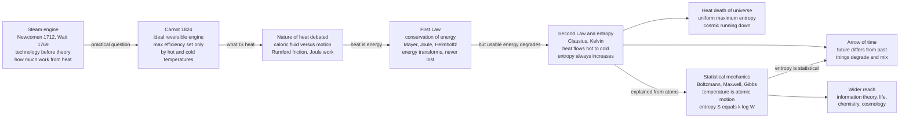

# 🔥 Thermodynamics and the Concept of Energy

> [!abstract] TL;DR
> Thermodynamics is the one great science that grew **backward from a machine**. Engineers were already building **steam engines** that transformed Britain before anyone could say *what heat is* or *why an engine works*. Asked the blunt practical question — **"how much work can we squeeze out of heat?"** — nineteenth-century physicists uncovered two of the deepest laws in all of science: **energy is never created or destroyed** but only converted between forms (the **First Law**, conservation of energy), and yet in every real process usable energy **inexorably degrades into useless disorder** (the **Second Law**, the rise of **entropy**). The Second Law hands time its **arrow** — the reason the past differs from the future — and hints that the whole universe is slowly running down. **Boltzmann's statistical mechanics** finally explained all of it from the jostling of unseen **atoms**: temperature is average motion, and entropy just counts the overwhelmingly more numerous *disordered* arrangements. From a factory boiler grew a framework that now reaches into information theory, the origin of life, chemistry, and the fate of the cosmos.

---

## Intuition

**Analogy:** Picture a village that has been **using a machine for a hundred years without knowing why it works.** The steam engine came *first*. Thomas Newcomen (1712) and James Watt (1769) built engines that pumped mines dry and drove factories — the roaring heart of the Industrial Revolution — while nobody had a correct theory of what heat even was. This is the rare, beautiful case where **technology outran science**: the working machine posed a question so urgent and so profitable that a whole new physics had to be invented to answer it. Mine owners did not want philosophy; they wanted to know **how much more coal buys how much more work** — and whether there was a limit.

Chasing that one question — *how much work can heat do?* — led somewhere no one expected. First came a hard ceiling: Sadi Carnot proved that **no engine, however cleverly built, can beat a limit set purely by its hot and cold temperatures.** Then came a unifying miracle: **energy** — mechanical, thermal, chemical, electrical — is a single conserved quantity that merely changes costume; you can never get something for nothing (**First Law**). And then came a haunting asymmetry: every real conversion **wastes** a little, spreading energy into a more disordered, less useful form that can never be fully gathered back (**Second Law**). Stir milk into coffee and it never un-stirs; heat flows from hot to cold and never spontaneously back. That one-way slide — measured by a quantity called **entropy** that only ever climbs — is why time has a **direction** at all. The engine in the factory turned out to contain the secret of why the future is different from the past.

---

## How It Works

### Core Mechanics

Thermodynamics assembled itself, over roughly 1712 to 1900, in a chain where each link answered a puzzle raised by the last.

1. **The engine before the science (Newcomen 1712, Watt 1769).** The **steam engine** converted the chemical energy of coal, via heat, into mechanical work on a scale that reorganized human society — powering pumps, looms, locomotives, and ships. It *worked* long before it was *understood*. Thermodynamics is science running to catch up with technology, and the question that started the chase was ruthlessly practical: **efficiency** — more work per lump of coal.

2. **Carnot and the ideal engine (Sadi Carnot, 1824).** In *Reflections on the Motive Power of Fire*, Carnot imagined a **perfect, idealized engine** running a reversible cycle (the **Carnot cycle**) and proved a stunning result: the **maximum possible efficiency depends only on the temperature difference** between the hot source and the cold sink — nothing else — and **no real engine can ever exceed it.** He found the hard *limit* while still believing the *wrong* theory of heat (that heat was a conserved fluid), a rare case of a correct, foundational insight built on a faulty premise.

3. **The nature of heat: caloric fluid versus motion.** The century's great dispute: is heat a weightless **substance** (the "caloric" fluid) that flows from hot to cold, or is it the **motion** of tiny particles? **Count Rumford** (Benjamin Thompson, 1798), boring cannon barrels, noticed that friction produced **seemingly unlimited heat** — impossible if heat were a finite fluid squeezed out of the metal. **James Joule** (1840s), with meticulous paddle-wheel experiments, showed that a **fixed amount of mechanical work always produces the same fixed amount of heat.** Heat is not a substance; it is a **form of energy**, the disordered motion of matter.

4. **The First Law: conservation of energy (Mayer, Joule, Helmholtz, ~1840s).** Independently, **Julius Robert von Mayer**, **James Joule**, and **Hermann von Helmholtz** arrived at one of the most general principles in all of science: **energy can be transformed between forms — mechanical, thermal, chemical, electrical — but is never created or destroyed.** This unified phenomena that had looked utterly separate, tying heat, motion, chemistry, and electricity into a single ledger that always balances. You cannot build a perpetual-motion machine of the first kind: **nothing is free.**

5. **The Second Law and entropy (Clausius, Kelvin, ~1850s).** Conservation was not the whole story. **Rudolf Clausius** and **William Thomson (Lord Kelvin)** recognized a deep asymmetry: **heat flows spontaneously from hot to cold, never the reverse without doing work.** Clausius named a new quantity, **entropy**, a measure of energy's *unavailability* to do work — of disorder — and stated the law that governs the universe: **in any isolated system, entropy never decreases.** Usable energy always degrades. This gives time an **arrow**: the future is the direction of higher entropy. No perpetual-motion machine of the second kind is possible either.

6. **The heat death of the universe.** Kelvin and Clausius drew the cosmic conclusion: if entropy always rises, the universe drifts toward a final state of **uniform temperature and maximum entropy** — a lukewarm soup where no energy is available to do any work, no structure can form, nothing can happen. This bleak nineteenth-century vision of cosmic **running-down** is the arrow of time written across all of space.

7. **Statistical mechanics (Maxwell, Boltzmann, Gibbs, ~1870s onward).** The final step explained thermodynamics from the **motion of atoms**. **James Clerk Maxwell** and **Ludwig Boltzmann** showed that **temperature is the average kinetic energy** of molecules, and — Boltzmann's masterstroke, carved on his tombstone — that **entropy counts the number of microscopic arrangements** consistent with a macroscopic state: **S = k log W**, where W is the number of **microstates**. The Second Law is therefore not an iron prohibition but a matter of **overwhelming probability**: disordered arrangements are astronomically more numerous than ordered ones, so systems drift toward disorder essentially always, though not strictly *forbidden* to reverse. Boltzmann championed atoms before they were widely accepted, was fiercely attacked, and died by his own hand in 1906 — shortly before experiments vindicated him completely.

### Flow / Architecture



---

## Key Concepts

**Secondary (foundations):**
- **Energy** — the single conserved currency of the universe; the capacity to do work, existing in interchangeable forms (kinetic, potential, thermal, chemical, electrical).
- **Heat versus work** — two ways energy is transferred: **work** is organized, directed transfer (a piston pushing); **heat** is disordered transfer down a temperature gradient. Both are energy *in transit*, not stuff a body "contains."
- **First Law** — conservation of energy: the energy of an isolated system is constant; you cannot get out more than you put in. Nothing is free.
- **Second Law** — entropy of an isolated system never decreases; heat flows hot to cold, usable energy degrades, and time gains a direction.

**Undergraduate (mechanisms):**
- **The Carnot limit** — maximum efficiency of a heat engine is `1 - Tc/Th`, fixed by the cold and hot **absolute temperatures** alone; a hard ceiling no design can beat. It is why waste heat is unavoidable and why power plants dump warmth into rivers and cooling towers.
- **Entropy as a state function** — Clausius defined entropy so that `dS = dQ_reversible / T`; a property of a state, not of a path, that bookkeeps energy's unavailability.
- **The mechanical equivalent of heat** — Joule's constant linking mechanical work to heat produced, the experimental death of the caloric theory and birth of energy conservation.
- **Kinetic theory** — gases as swarms of colliding particles; **temperature is proportional to average kinetic energy**, pressure is molecular bombardment, connecting the macroscopic gas laws to microscopic motion.

**Graduate (interpretation and depth):**
- **Boltzmann entropy, S = k log W** — the microscopic definition: entropy measures the **logarithm of the number of microstates** realizing a macrostate. Order is rare, disorder is common, so systems flow to disorder by sheer counting.
- **The Second Law as statistics, not law** — entropy decrease is not forbidden, merely *fantastically improbable* for macroscopic systems; the arrow of time is emergent and probabilistic. This raises **Loschmidt's reversibility paradox** (microscopic laws are time-symmetric — where does the arrow come from?) and the puzzle of the universe's **low-entropy initial condition**.
- **Free energy** — the *useful* part of energy (Helmholtz `F = U - TS`, Gibbs `G = H - TS`); reactions and processes proceed spontaneously when free energy falls, marrying the First and Second Laws into a single criterion that governs chemistry and biology.
- **Entropy and information** — Boltzmann's `S = k log W` and Shannon's information entropy are the **same mathematics**, linking thermodynamics to information theory via **Maxwell's demon** and **Landauer's principle** (erasing one bit must dissipate at least `k T ln 2` of heat — *information is physical*).

---

## Python Demo

```python
"""
The Second Law as STATISTICS: entropy, irreversibility, and the arrow of time.

We simulate a gas of N molecules that all START crammed into the LEFT half of a
box (as if a partition was just removed). Each molecule random-walks; over time
the gas SPONTANEOUSLY spreads to fill the whole box, the fraction on each side
approaches 50/50, and the coarse-grained ENTROPY rises to its maximum -- and it
essentially NEVER returns to the all-on-one-side state. That one-way slide is the
ARROW OF TIME, and Boltzmann's point is that it is not a law but overwhelming
PROBABILITY: disordered arrangements vastly outnumber ordered ones (S = k log W).

A final panel shows the CARNOT efficiency ceiling: no heat engine, however clever,
can beat 1 - Tc/Th. Requires: numpy, matplotlib.
"""
import numpy as np
import matplotlib.pyplot as plt

rng = np.random.default_rng(0)

# ---- parameters ----
N          = 800            # number of gas molecules
steps      = 4000           # simulation frames
step_size  = 0.012          # random-walk kick per frame
kB         = 1.380649e-23   # Boltzmann constant, J/K
nbins      = 10             # coarse-graining: cells per axis for entropy

# ---- initial state: EVERY molecule packed into the LEFT half of a unit box ----
pos = np.empty((N, 2))
pos[:, 0] = rng.uniform(0.0, 0.5, N)   # x in the left half only
pos[:, 1] = rng.uniform(0.0, 1.0, N)   # y anywhere

frac_left = np.empty(steps)
entropy   = np.empty(steps)
snap_at   = {0: "t = 0: all molecules on the LEFT (low entropy)",
             steps // 30: "early: rushing through the opening",
             steps - 1: "late: filled, about 50/50 (max entropy)"}
snapshots = {}

for t in range(steps):
    # random-walk kick, then reflect off the four walls of the unit box
    pos += rng.normal(0.0, step_size, size=(N, 2))
    pos[pos > 1.0] = 2.0 - pos[pos > 1.0]   # reflect at upper walls
    pos[pos < 0.0] = -pos[pos < 0.0]        # reflect at lower walls

    frac_left[t] = np.mean(pos[:, 0] < 0.5)

    # coarse-grained Boltzmann/Gibbs entropy: count how molecules fill the cells
    ix = np.clip((pos[:, 0] * nbins).astype(int), 0, nbins - 1)
    iy = np.clip((pos[:, 1] * nbins).astype(int), 0, nbins - 1)
    counts = np.bincount(ix * nbins + iy, minlength=nbins * nbins).astype(float)
    p = counts / counts.sum()
    p = p[p > 0]
    entropy[t] = -kB * np.sum(p * np.log(p))   # Gibbs entropy, J/K

    if t in snap_at:
        snapshots[t] = pos.copy()

S_max = kB * np.log(nbins * nbins)   # entropy of a perfectly uniform gas

# ================================ plotting ================================
fig = plt.figure(figsize=(15, 8.5))
gs  = fig.add_gridspec(2, 3, height_ratios=[1.0, 1.0])

# --- top row: three snapshots of the spreading gas ---
for col, t in enumerate(sorted(snap_at)):
    ax = fig.add_subplot(gs[0, col])
    P = snapshots[t]
    ax.scatter(P[:, 0], P[:, 1], s=6, alpha=0.55, color="crimson")
    ax.axvline(0.5, color="gray", ls="--", lw=1)
    ax.set_xlim(0, 1); ax.set_ylim(0, 1)
    ax.set_xticks([]); ax.set_yticks([])
    ax.set_title(snap_at[t], fontsize=9)

# --- bottom-left: fraction on the left approaches 1/2 ---
ax1 = fig.add_subplot(gs[1, 0])
ax1.plot(frac_left, color="steelblue", lw=1)
ax1.axhline(0.5, color="k", ls="--", lw=1, label="equilibrium 0.5")
ax1.set_ylim(0.4, 1.02)
ax1.set_xlabel("time step"); ax1.set_ylabel("fraction on left side")
ax1.set_title("Gas spreads: 100% left  ->  ~50/50", fontsize=10)
ax1.legend(fontsize=8)

# --- bottom-middle: entropy climbs to its maximum and stays there ---
ax2 = fig.add_subplot(gs[1, 1])
ax2.plot(entropy, color="darkgreen", lw=1)
ax2.axhline(S_max, color="k", ls="--", lw=1, label="max entropy (uniform)")
ax2.set_xlabel("time step"); ax2.set_ylabel("entropy  S  (J/K)")
ax2.set_title("Entropy only RISES: the arrow of time", fontsize=10)
ax2.legend(fontsize=8)

# --- bottom-right: the Carnot efficiency ceiling ---
ax3 = fig.add_subplot(gs[1, 2])
Tc = 300.0                                  # cold reservoir, ~room temperature
Th = np.linspace(310, 1500, 300)            # hot reservoir temperature
eta_carnot = 1.0 - Tc / Th                  # Carnot limit
ax3.plot(Th, eta_carnot, color="purple", lw=2, label="Carnot limit 1 - Tc/Th")
ax3.fill_between(Th, eta_carnot, 1.0, color="red", alpha=0.12,
                 label="forbidden: no engine can reach here")
ax3.scatter([800], [1 - Tc / 800], color="purple", zorder=5)
ax3.scatter([800], [0.35], color="orange", zorder=5,
            label="real engine (always below)")
ax3.set_xlabel("hot-reservoir temperature Th  (K)")
ax3.set_ylabel("maximum efficiency")
ax3.set_ylim(0, 1)
ax3.set_title("No engine beats the Carnot limit", fontsize=10)
ax3.legend(fontsize=7, loc="lower right")

fig.suptitle("The Second Law: entropy, irreversibility, and the Carnot ceiling",
             fontsize=13, fontweight="bold")
fig.tight_layout(rect=[0, 0, 1, 0.97])
plt.savefig("thermodynamics_second_law.png", dpi=120)
plt.show()

print(f"Final fraction on left : {frac_left[-1]:.3f}  (started at 1.000)")
print(f"Final entropy / max     : {entropy[-1] / S_max:.3f}")
print(f"Carnot limit at Th=800K : {1 - Tc/800:.3f}  (real engines fall below)")
```

The snapshots show a gas that started **entirely on the left** filling the whole box; the fraction curve slides from 1.0 to about 0.5 and stays there; and the entropy curve climbs to its ceiling and never comes back down — a picture of **irreversibility emerging from perfectly reversible little kicks**. Boltzmann's insight is exactly this: nothing forbids all 800 molecules from happening to wander back to the left at once, but the odds are so absurdly small (`1 / 2^800`, far fewer than atoms in the universe) that it *never happens*. The last panel shows the other half of the story — the **Carnot ceiling** that no engine, real or imagined, can breach.

---

## Real-World Applications

- **Power generation.** Every coal, gas, and nuclear plant is a heat engine bounded by the **Carnot limit**; this is why they run boilers as hot as materials allow and dump waste heat into rivers or cooling towers. Roughly a third of the fuel's energy becomes electricity — the rest is Second-Law tax.
- **Refrigerators, heat pumps, and air conditioning.** Running an engine *backwards* pumps heat from cold to hot, but only by **spending work** — the Second Law forbids doing it for free, which sets the theoretical efficiency (coefficient of performance) of every fridge and heat pump.
- **Chemistry and materials.** **Free energy** (`G = H - TS`) decides which reactions run spontaneously, which way equilibria shift, and which materials are stable; it is the master variable of chemical engineering, metallurgy, and battery design.
- **Biology and the origin of life.** Living things build exquisite local order (cells, proteins, brains) by **exporting even more disorder to their surroundings** — dissipating heat and entropy so the *total* still rises. Metabolism is an engine that pays its entropy bill to the environment.
- **Computing and information.** **Landauer's principle** ties logic to thermodynamics: erasing a bit must dissipate at least `k T ln 2` of heat. This sets an ultimate floor on the energy cost of computation and connects entropy to information via **Maxwell's demon**.
- **Cosmology and the arrow of time.** The universe's steady rise in entropy — from a smooth, low-entropy Big Bang toward clumping, star-burning, and eventual dispersal — is why time flows one way and underlies the long-run "heat death" scenario.

---

## Common Pitfalls

- **"Heat and temperature are the same thing."** Temperature measures *average* molecular kinetic energy; heat is *energy transferred* because of a temperature difference. A spark is hotter (higher temperature) than a bathtub but carries far less heat energy.
- **"Entropy just means messiness."** The rigorous meaning is the **count of microstates** (`S = k log W`) or energy's unavailability to do work — not a vague notion of a tidy room. Something can look "messy" yet be low-entropy, and vice versa.
- **"The Second Law forbids order or evolution."** It only forbids **total** entropy from falling in an *isolated* system. Open systems (a fridge, a cell, a planet bathed in sunlight) can build local order indefinitely by dumping more entropy outside. Life does not violate the Second Law; it exploits it.
- **"Carnot got it right, so his theory of heat was right."** Carnot derived the correct efficiency limit while still believing the *false* caloric (heat-as-fluid) theory. A correct conclusion can rest on a wrong premise — one of history's most striking examples.
- **"Energy conservation and entropy increase are the same law."** They are separate and even in tension: the **First Law** says the *amount* of energy is fixed; the **Second Law** says its *quality* (availability to do work) always degrades. Energy is conserved, usefulness is not.
- **"Entropy can never decrease."** In statistical mechanics it *can* — it is merely astronomically improbable for large systems. The Second Law is a statement of overwhelming probability, not an absolute prohibition; treating it as inviolable law hides Boltzmann's deepest insight.

---

## Related Concepts

- [[The_Scientific_Revolution_Overview]] — the mechanical, mathematical worldview that thermodynamics extended from motion to heat and energy.
- [[The_First_Industrial_Revolution]] — the steam-powered upheaval whose engines *preceded* and provoked the science of thermodynamics.
- [[Laws_of_Thermodynamics]] — the modern physics statement of the Zeroth through Third Laws whose history this note tells.
- [[Entropy_and_Second_Law]] — the rigorous physics of entropy and the Second Law, the technical core behind the historical story.
- [[Kinetic_Theory_of_Gases]] — the atoms-in-motion picture linking temperature and pressure to molecular kinetic energy.
- [[Classical_Statistical_Mechanics]] — Boltzmann and Gibbs deriving thermodynamics from microscopic states, S = k log W in full.
- [[Work_Energy_and_Conservation]] — the mechanics of work and energy conservation that the First Law generalized to heat.
- [[Chemical_Thermodynamics]] — free energy, enthalpy, and entropy governing whether chemical reactions proceed.
- [[Metabolism_and_Bioenergetics]] — how living cells run as engines that pay their entropy bill to the environment.
- [[Entropy_and_Information_Content]] — Shannon entropy, mathematically the same object as Boltzmann's thermodynamic entropy.
- [[Entropy_in_Thermodynamics_and_Statistical_Mechanics]] — the explicit bridge between physical and informational entropy.
- [[Maxwell_Demon_and_the_Physics_of_Information]] — the thought experiment probing whether information can cheat the Second Law.
- [[Landauer_Principle_and_Thermodynamics_of_Computation]] — the minimum heat cost of erasing information; "information is physical."
- [[Information_Theory_Overview]] — the wider field where entropy became the currency of communication and inference.
- [[Dissipative_Structures_and_Nonequilibrium]] — how order and life arise far from equilibrium while total entropy still rises.
- [[Information_and_Entropy_in_Systems]] — entropy as an organizing idea across complex adaptive systems.
- [[The_Expanding_Universe_and_Hubbles_Law]] — the cosmic backdrop for the arrow of time and the "heat death" scenario.
- [[History_of_Science_Overview]] — the vault-wide map into which this episode of the history of science fits.

> Sibling *History of Science* notes not yet written are referenced in prose and will extend this arc: an *Electricity and Magnetism History* (the other great nineteenth-century unification, which met thermodynamics in the concept of energy), a *Science, Technology and Society* note (the theme of technology preceding and shaping theory), and a *Modern Cosmology and the Expanding Universe* note (the arrow of time on the largest scale).

---

## Review Questions

1. **Conceptual:** Thermodynamics is often called the science that "grew backward from a machine." Explain precisely what that means using the steam engine, and describe how the single practical question — *how much work can we get from heat?* — led step by step to the First and Second Laws. Why is this history unusual in the relationship between technology and science?
2. **Scenario:** An inventor shows you an engine running between a boiler at 600 K and a river at 300 K, claiming 60% efficiency, and separately a sealed, insulated device whose internal entropy she says slowly *decreases* on its own. Using the Carnot limit and the Second Law, explain what is wrong with each claim, and state what is (and is not) actually forbidden.
3. **Trade-off / synthesis:** The First Law says energy is conserved; the Second Law says usable energy always degrades. Explain why these are *not* the same statement and can even seem to conflict, then show how **free energy** and Boltzmann's `S = k log W` reconcile them — and how the same entropy concept reaches into information theory and the origin of biological order.

---

## Sources

- Carnot, Sadi. *Reflections on the Motive Power of Fire*. 1824. (Dover reprint, 1960.)
- Atkins, Peter. *The Laws of Thermodynamics: A Very Short Introduction*. Oxford University Press, 2010.
- Von Baeyer, Hans Christian. *Warmth Disperses and Time Passes: The History of Heat*. Modern Library, 1999.
- Cardwell, Donald. *From Watt to Clausius: The Rise of Thermodynamics in the Early Industrial Age*. Cornell University Press, 1971.
- [History of thermodynamics (Wikipedia overview)](https://en.wikipedia.org/wiki/History_of_thermodynamics)

---

#history-of-science #thermodynamics #entropy #conservation-of-energy #carnot
