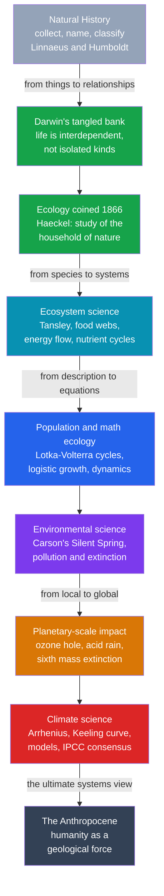

# 🌍 Ecology and Environmental Science

> [!abstract] TL;DR
> **Ecology** and **environmental science** trace how science stopped cataloging organisms as isolated specimens and learned to see them as **nodes in interconnected systems** — food webs, energy flows, nutrient cycles, and ultimately the whole **biosphere**. The arc runs from centuries of **natural history** (Linnaeus's naming, Humboldt's holistic vision), through Darwin's "**tangled bank**" of interdependent life and Haeckel's coining of "**ecology**" (1866), to the **ecosystem** concept (Tansley), the **mathematical** modeling of populations (**Lotka-Volterra** cycles), and finally **environmental science** — the moment science detected that *humanity itself* is now altering the entire planet. The **Keeling curve** (rising atmospheric CO₂ since 1958), the **ozone hole**, mass extinction, and the proposed **Anthropocene** epoch made this a science whose object became a **planetary emergency** — and a case study in how scientific evidence collides with values, politics, and the manufacture of doubt.

---

## Intuition

**Analogy:** Early naturalists were **stamp collectors of life**. They roamed the world pinning beetles into cases, pressing ferns into books, and giving every creature a tidy two-word Latin name — a magnificent catalog of individual *things*. But a stamp collection tells you nothing about the *postal system*. The revolutionary insight of ecology was that **nothing lives alone**: every organism is a node in a vast web of eating, being eaten, competing, and cooperating, and energy and matter flow through that web the way letters flow through a postal network. You cannot understand the wolf by studying the wolf; you must study the wolf-and-elk-and-grass-and-soil *together*, as one system.

Once you learn to see **relationships and systems** instead of isolated things, something alarming comes into focus that no single-species study could ever reveal: the whole system has a **budget** — of carbon, of nitrogen, of species — and that budget can be pushed out of balance. Zoom the lens all the way out to the entire biosphere, start keeping the books, and you discover that **one species — us — is now rewriting the planet's chemistry**. The very habit of thinking in systems is what let science detect human-driven climate change and mass extinction. That is how a science of pond weeds and finches became one of the most consequential sciences of our age.

---

## How It Works

### From natural history to ecology: studying relationships, not just things

For most of its history, the science of life was **natural history**: observe, collect, describe, and classify. **Carl Linnaeus** (18th century) gave it a universal filing system — *binomial nomenclature* and the ranked hierarchy of kingdom-to-species — turning a chaos of local names into a shared global catalog. This was indispensable, but it was fundamentally a science of **static kinds**: fix the specimen, name it, shelve it.

The crack in that framework was the dawning sense that organisms are **embedded in their surroundings**. **Alexander von Humboldt**, on his South American expeditions (early 1800s), measured how vegetation zones marched up a mountainside with altitude and temperature, and famously imagined **nature as a single interconnected whole** — a "web of life" bound by physical conditions. Then came **Darwin**. The closing image of *On the Origin of Species* (1859) is a "**tangled bank**, clothed with many plants of many kinds, with birds singing on the bushes, with various insects flitting about, and with worms crawling through the damp earth" — all "dependent upon each other in so complex a manner." Darwin's theory made those dependencies *causal*: species are shaped by their **relationships** — competition, predation, mutualism — not created in isolation (see [[The_Darwinian_Revolution]] and [[The_Birth_of_Modern_Biology]]).

In **1866** the German zoologist **Ernst Haeckel** gave the new perspective a name: **Ökologie** — from the Greek *oikos*, "household" — the study of the "household of nature," the relations of organisms to their environment and to one another. The word marked the shift from cataloging **species** to studying **systems**.

### Ecology becomes a systems science: food webs, energy flow, ecosystems

The conceptual leap of the 20th century was to treat a patch of nature as an **integrated system with measurable throughput**. Key moves:

- **Food webs and trophic levels.** **Charles Elton** (1920s) formalized who-eats-whom into *food chains* and *webs*, the *pyramid of numbers*, and the *ecological niche* — an organism defined by its **role** in the community.
- **The ecosystem.** In **1935** the British botanist **Arthur Tansley** coined **ecosystem**: the biological community *plus* its physical environment, treated as **one interacting unit**. This deliberately fused the living and non-living into a single object of study.
- **Energy flow.** **Raymond Lindeman** (1942) and the brothers **Eugene and Howard Odum** turned ecology quantitative by tracking **energy** as it flows from sunlight → plants → herbivores → carnivores, with roughly **90% lost at each trophic transfer** (the "10% rule"). An ecosystem became something you could put on an **energy budget**, like an engineer's flow diagram.
- **Nutrient cycling and succession.** Matter, unlike energy, **cycles** — the carbon, nitrogen, and phosphorus **biogeochemical cycles** loop through organisms, soil, water, and air. **Frederic Clements** and later **Henry Gleason** debated **ecological succession** — how communities develop over time toward (or not toward) a stable state.

This is ecology as a **systems science**: the object is the *pattern of interactions and flows*, not any single organism (compare [[Ecosystems_and_Energy_Flow]], [[General_Systems_Theory]], and [[Feedback_Loops_and_Causality]]).

### Population and mathematical ecology: revealing dynamics

If ecology is about systems, systems can be **modeled**. In the 1920s **Alfred Lotka** and **Vito Volterra** independently wrote down coupled differential equations for **predator and prey**. The equations predicted something no static description could: populations need not settle to a constant — they can **oscillate perpetually**, predator peaks chasing prey peaks in an endless cycle (reproduced in the demo below). This was a landmark: **mathematics revealed dynamics** — cycles, stability, and eventually **chaos** — hidden inside the tangle of interactions.

The toolkit grew: the **logistic equation** with its **carrying capacity** (population growth that self-limits as resources run short), **competition models** (Lotka-Volterra competition, the competitive-exclusion principle), and **metapopulation** theory. Ecology became a **quantitative, predictive** science of interacting populations — a natural home for the ideas of feedback, nonlinearity, and tipping points that [[Complex_Adaptive_Systems]] and [[Bifurcations_and_Tipping_Points]] make general.

### Environmental science: science meets society

By the mid-20th century, ecology collided with the **consequences of industrial civilization**. The catalyzing moment was **Rachel Carson's *Silent Spring*** (1962), which marshaled ecological evidence that the pesticide **DDT** was **biomagnifying** up food chains, thinning bird eggshells, and silencing the songbirds of spring. Carson's book — attacked ferociously by the chemical industry — turned an academic science into a **public and political force**, helping launch the modern **environmental movement**, the first **Earth Day** (1970), and agencies like the U.S. **EPA**. **Environmental science** emerged as the applied, interdisciplinary field studying **human impacts**: pollution, habitat loss, extinction, and resource depletion. Here science becomes inseparable from **values and policy** — a theme the planned sibling notes *The Ethics and Politics of Science* and *Science, Technology, and Society* will develop.

### The discovery of planetary-scale human impact

The crucial modern turn was evidence that humanity alters not just local ecosystems but **whole Earth systems**:

- **The ozone hole.** In the 1970s **Rowland and Molina** showed that **CFCs** destroy stratospheric **ozone**; the Antarctic "hole" was detected in **1985**. The response — the **1987 Montreal Protocol** — became the great **success story** of science-driven global policy (see [[Atmospheric_Chemistry_and_Stratospheric_Ozone]]).
- **Acid rain** from sulfur emissions, addressed by cap-and-trade in the 1990s.
- **Biodiversity loss** — the recognition of a human-caused **"sixth mass extinction,"** with extinction rates orders of magnitude above background (compare [[Mass_Extinctions_and_Paleoclimate]]).
- Above all, **climate change** — the reshaping of the planet's **energy balance** itself.

### Climate science: detecting a planet-altering signal

The physics is old. In **1896** the Swedish chemist **Svante Arrhenius** calculated that doubling atmospheric CO₂ would warm the Earth by several degrees — the first quantitative **greenhouse-effect** estimate (see [[Greenhouse_Effect_and_Radiative_Forcing]]). But was CO₂ actually *rising*? The decisive evidence came from **Charles David Keeling**, who from **1958** made painstaking continuous measurements atop **Mauna Loa**. His record — the **Keeling curve** — showed atmospheric CO₂ climbing **year after year**, with a seasonal "wiggle" from the Northern Hemisphere's breathing forests superimposed on a relentless upward trend (reproduced in the demo). It was the first clear, undeniable sign that humans were changing the **global** atmosphere. Later came **paleoclimate** archives (**ice cores** linking CO₂ and temperature across ice ages — see [[Paleoclimatology_and_Ice_Cores]]), physics-based **climate models** ([[Climate_Models_and_Projections]], [[Climate_Sensitivity_and_Feedbacks]]), and the **IPCC** consensus ([[Anthropogenic_Climate_Change]]). Climate science is now one of the most important — and politically fraught — sciences on Earth.

### The Anthropocene: humanity as a planetary force

The ultimate systems view is that humans are now a **geological agent**. The proposed **Anthropocene** epoch names the idea that our species reshapes the **climate**, the **biogeochemical cycles** (we fix more nitrogen than all natural processes combined), and the **fossil record** (extinctions, plastics, radionuclides). Humanity and nature become **one coupled system** — the framing behind **planetary boundaries** ([[Sustainability_and_Planetary_Boundaries]]) and [[Ecological_Resilience_and_Ecosystems]].



---

## Key Concepts

### Secondary Level
- **Ecology** — the study of how living things interact with each other and their environment; the science of the "web of life."
- **Food web / food chain** — who eats whom; energy passes from the sun to plants to animals, with most of it lost as heat at each step.
- **Ecosystem** — a community of organisms *plus* the non-living environment (soil, water, air), working together as one system.
- **The Keeling curve** — the graph showing atmospheric carbon dioxide rising steadily since 1958; the clearest single piece of evidence that humans are changing the climate.
- **Greenhouse effect** — gases like CO₂ trap heat in the atmosphere, warming the planet; adding more CO₂ warms it further.
- ***Silent Spring*** — Rachel Carson's 1962 book on pesticide harm that helped start the environmental movement.

### Undergraduate Level
- **Trophic levels and energy flow** — producers, primary/secondary consumers, decomposers; the ~10% rule of energy transfer and why food chains are short.
- **Biogeochemical cycles** — the carbon, nitrogen, and phosphorus cycles; matter cycles while energy flows through.
- **Ecological succession** — Clementsian "climax community" vs Gleasonian individualistic views of how communities assemble.
- **Population dynamics** — exponential vs **logistic growth**, **carrying capacity**, and the **Lotka-Volterra** predator-prey and competition models.
- **The niche and competitive exclusion** — Elton's functional niche; Gause's principle that two species cannot indefinitely occupy the identical niche.
- **The greenhouse effect and radiative forcing** — Arrhenius's 1896 calculation; CO₂, methane, and the planetary energy balance.
- **Historical instruments** — Keeling's Mauna Loa record; ice-core CO₂–temperature correlation as paleoclimate evidence.

### Graduate Level
- **Systems ecology and thermodynamics** — the Odums' energy-flow accounting; ecosystems as open, dissipative systems far from equilibrium.
- **Nonlinear population dynamics** — limit cycles, the paradox of enrichment, and **chaos** in ecological models (May's logistic-map work, 1976).
- **Stability, resilience, and regime shifts** — Holling's **resilience** vs engineering stability; **tipping points** and alternative stable states in lakes, reefs, and forests (see [[Ecological_Resilience_and_Ecosystems]], [[Bifurcations_and_Tipping_Points]]).
- **Climate sensitivity and feedbacks** — equilibrium climate sensitivity, water-vapor and ice-albedo feedbacks, the detection-and-attribution logic of the IPCC.
- **Earth-system science and planetary boundaries** — the Rockström/Steffen framework quantifying safe operating limits (carbon, nitrogen, biodiversity).
- **The Anthropocene debate** — stratigraphic "golden spike" candidates (1950s bomb radionuclides, plastics) and the epistemics of naming a human-made epoch.
- **Science–policy interface** — the "**manufacture of doubt**" (Oreskes & Conway's *Merchants of Doubt*), post-normal science, and acting under deep uncertainty on long-horizon global risk.

---

## Python Demo

```python
# TWO FOUNDATIONAL PICTURES OF THIS SCIENCE, SIDE BY SIDE.
#
# LEFT: the LOTKA-VOLTERRA predator-prey equations (1920s) -- the moment
# ecology became MATHEMATICAL. There is no equilibrium plateau here: two
# interacting species produce endless COUPLED OSCILLATIONS. This revealed that
# populations are a DYNAMICAL SYSTEM, not a list of isolated head-counts.
#
# RIGHT: a stylized reconstruction of the KEELING CURVE -- steadily rising
# atmospheric CO2 with a seasonal "wiggle" -- the first clear evidence that
# HUMANITY is altering the whole planet's atmosphere. (Real data: Scripps /
# NOAA Mauna Loa; here we reconstruct its shape so the script is self-contained.)
import numpy as np
import matplotlib.pyplot as plt

# ------------------------------------------------------------------
# 1. LOTKA-VOLTERRA PREDATOR-PREY MODEL
#    dx/dt = alpha*x - beta*x*y      (prey: grow, get eaten)
#    dy/dt = delta*x*y - gamma*y     (predators: eat-and-breed, starve)
# ------------------------------------------------------------------
alpha, beta, gamma, delta = 1.0, 0.1, 1.5, 0.075   # classic parameters
x0, y0 = 10.0, 5.0                                  # start: 10 prey, 5 predators
T, dt = 60.0, 0.001
n = int(T / dt)
t = np.linspace(0.0, T, n)
x = np.empty(n); y = np.empty(n)
x[0], y[0] = x0, y0

def derivs(x, y):
    return (alpha * x - beta * x * y,      # prey rate
            delta * x * y - gamma * y)     # predator rate

# Integrate with 4th-order Runge-Kutta (accurate on these stiff-ish cycles).
for i in range(n - 1):
    k1x, k1y = derivs(x[i],            y[i])
    k2x, k2y = derivs(x[i] + 0.5*dt*k1x, y[i] + 0.5*dt*k1y)
    k3x, k3y = derivs(x[i] + 0.5*dt*k2x, y[i] + 0.5*dt*k2y)
    k4x, k4y = derivs(x[i] + dt*k3x,     y[i] + dt*k3y)
    x[i+1] = x[i] + (dt/6.0)*(k1x + 2*k2x + 2*k3x + k4x)
    y[i+1] = y[i] + (dt/6.0)*(k1y + 2*k2y + 2*k3y + k4y)

# The system has a fixed point at (gamma/delta, alpha/beta); populations
# orbit it forever rather than settling on it.
x_star, y_star = gamma / delta, alpha / beta
print("Lotka-Volterra equilibrium (never reached, only orbited):")
print(f"  prey* = {x_star:.1f},  predator* = {y_star:.1f}")
print(f"  prey range   : {x.min():.1f} to {x.max():.1f}")
print(f"  predator range: {y.min():.1f} to {y.max():.1f}")

# ------------------------------------------------------------------
# 2. KEELING CURVE (stylized reconstruction, 1958 -> 2023)
#    rising, slightly ACCELERATING trend + annual seasonal cycle
# ------------------------------------------------------------------
years = np.linspace(1958, 2023, 65 * 12)          # monthly resolution
yr = years - 1958.0
trend = 315.0 + 0.90 * yr + 0.009 * yr**2         # ppm: accelerating rise
seasonal = 3.0 * np.cos(2 * np.pi * (years - 1958.0 + 0.29))  # NH breathing
co2 = trend + seasonal
print(f"\nKeeling curve reconstruction: {co2[0]:.0f} ppm (1958) "
      f"-> {co2[-1]:.0f} ppm (2023)")

# ------------------------------------------------------------------
# Visualize both foundational pictures
# ------------------------------------------------------------------
fig, (ax1, ax2, ax3) = plt.subplots(1, 3, figsize=(16, 4.8))

# (A) Predator-prey time series: the classic coupled oscillation.
ax1.plot(t, x, color="#16a34a", lw=1.8, label="prey (e.g. hares)")
ax1.plot(t, y, color="#dc2626", lw=1.8, label="predators (e.g. lynx)")
ax1.set_xlabel("time")
ax1.set_ylabel("population")
ax1.set_title("Lotka-Volterra: populations as a\ncoupled dynamical system")
ax1.legend(fontsize=8)

# (B) Phase portrait: the closed orbit that never reaches equilibrium.
ax2.plot(x, y, color="#2563eb", lw=1.2)
ax2.plot(x_star, y_star, "k*", ms=13, label="equilibrium\n(orbited, not reached)")
ax2.plot(x0, y0, "o", color="#d97706", ms=7, label="start")
ax2.set_xlabel("prey population")
ax2.set_ylabel("predator population")
ax2.set_title("Phase portrait: an endless closed cycle")
ax2.legend(fontsize=8)

# (C) Keeling curve: the signature of human-driven change.
ax3.plot(years, co2, color="#7c3aed", lw=0.9)
ax3.set_xlabel("year")
ax3.set_ylabel("atmospheric CO2  (ppm)")
ax3.set_title("Keeling curve: rising CO2 with a\nseasonal wiggle (stylized)")

plt.tight_layout()
plt.savefig("ecology_environmental_science.png", dpi=130)
print("Saved ecology_environmental_science.png")
plt.show()
```

Panel A shows the hallmark of mathematical ecology: predator and prey populations rise and crash in **linked cycles** — prey boom, predators feast and multiply, prey crash from overpredation, predators then starve, and the cycle repeats forever. Panel B plots the same run as a **phase portrait**, a closed loop orbiting the equilibrium star without ever landing on it: proof that an ecosystem is a **dynamical system**, not a set of independent head-counts. Panel C reconstructs the **Keeling curve**, the steadily climbing CO₂ trace whose "wiggle" is the Northern Hemisphere's forests inhaling each summer and exhaling each winter — the first data ever to show, unmistakably, that our species is changing the whole planet's air.

---

## Real-World Applications

- **Fisheries and wildlife management** — logistic growth and predator-prey models set catch quotas and inform culling/reintroduction (e.g. wolves in Yellowstone triggering a trophic cascade); ecology directly governs billions of dollars of harvest.
- **Conservation biology** — minimum viable population size, habitat-corridor design, and extinction-risk modeling all descend from population ecology; the IUCN Red List operationalizes "sixth extinction" science.
- **Climate policy** — the Keeling curve, ice cores, and climate models underpin the IPCC assessments, the Paris Agreement, carbon pricing, and net-zero targets — the highest-stakes translation of science into global policy.
- **Pollution regulation** — biomagnification science (post-*Silent Spring*) drove DDT bans; ozone science drove the **Montreal Protocol**, the model success of science-led international action.
- **Ecosystem services and natural-capital accounting** — valuing pollination, water purification, and carbon sequestration to bring ecology into economics and land-use decisions.
- **Earth-system monitoring** — satellite remote sensing of deforestation, ocean color, and CO₂; the **planetary boundaries** dashboard for tracking humanity's safe operating space.
- **Restoration and rewilding** — succession theory and resilience science guide how to rebuild degraded forests, wetlands, and reefs.

---

## Common Pitfalls

- **"Ecology just means being green / environmentalism."** Ecology is a **rigorous science** of interactions and systems; *environmentalism* is a social/political movement it informs. Conflating them lets critics dismiss data as advocacy.
- **"The balance of nature is a stable, self-restoring equilibrium."** Modern ecology shows systems are often **dynamic, cyclic, or chaotic**, with multiple stable states and tipping points — not a gentle homeostasis that always returns. The Lotka-Volterra *cycle* (not a plateau) is the corrective image.
- **"Correlation in the Keeling curve isn't proof of human cause."** The attribution rests on **converging physics**: isotopic fingerprints (the CO₂ carries the light-carbon signature of fossil fuels), the known greenhouse mechanism (Arrhenius, 1896), stratospheric cooling, and models — not on the trend line alone.
- **"Scientific uncertainty means we don't really know / shouldn't act."** The **manufacture of doubt** (documented for tobacco and then climate) weaponizes normal scientific uncertainty; robust *consensus* on the core claims coexists with uncertainty on details. Mistaking one for the other paralyzes policy.
- **"Ecosystems have a purpose or strive toward balance."** This is teleological thinking; ecosystem structure emerges from selection and physical constraints (see [[The_Darwinian_Revolution]]), not design or goal-seeking.
- **"Local success solves the global problem."** Cleaning one river is not the same as bending a planetary-scale curve; the hard lesson of environmental science is that **global, long-horizon** problems resist local, short-term fixes.
- **"The Anthropocene is settled science."** It is a **live scientific debate** (formal epoch vs informal concept, and which "golden spike" marks it) — powerful as a framing, not yet a ratified geological unit.

---

## Related Concepts

- [[The_Darwinian_Revolution]] — evolution by natural selection is the theoretical bedrock beneath ecology; species and their interactions are products of descent with modification, and Darwin's "tangled bank" is ecology's founding image.
- [[The_Birth_of_Modern_Biology]] — the earlier natural-history and taxonomic tradition (Linnaeus, the study of organisms) out of which ecology grew as a science of relationships.
- [[History_of_Science_Overview]] — the vault's map of how the sciences developed; this note is the case of a *systems* science that became a planetary emergency.
- [[Ecosystems_and_Energy_Flow]] — the Biology-vault deep dive on trophic levels, the 10% rule, and energy budgets that this note frames historically.
- [[Population_Ecology]] — logistic growth, carrying capacity, and the population models (including Lotka-Volterra) reproduced in the demo.
- [[Community_Ecology]] — food webs, niches, competition, and succession: the interaction-web view at the community scale.
- [[Biogeochemical_Cycles]] — the carbon, nitrogen, and phosphorus cycles whose human disruption defines the Anthropocene.
- [[Biodiversity_and_Conservation]] — the science behind the "sixth mass extinction" and the conservation response.
- [[Natural_Selection_and_Adaptation]] — the mechanism that shapes the players in every ecological interaction.
- [[Greenhouse_Effect_and_Radiative_Forcing]] — the physics (Arrhenius onward) of why rising CO₂ warms the planet.
- [[Anthropogenic_Climate_Change]] — the Meteorology-vault synthesis of the evidence, attribution, and consensus this note narrates historically.
- [[Paleoclimatology_and_Ice_Cores]] — the deep-time CO₂–temperature record that put the Keeling curve in context.
- [[Climate_Models_and_Projections]] — the physics-based models that turn the greenhouse effect into future projections.
- [[Climate_Sensitivity_and_Feedbacks]] — how much warming per doubling of CO₂, and the feedbacks that set it.
- [[Atmospheric_Chemistry_and_Stratospheric_Ozone]] — the ozone-hole story and the Montreal Protocol success.
- [[Mass_Extinctions_and_Paleoclimate]] — the deep-time extinction record against which the modern "sixth extinction" is measured.
- [[Ecological_Resilience_and_Ecosystems]] — Holling's resilience, alternative stable states, and regime shifts: the systems-thinking view of ecosystems.
- [[Sustainability_and_Planetary_Boundaries]] — the Earth-system framework quantifying a "safe operating space" for humanity.
- [[Complex_Adaptive_Systems]] — ecosystems as canonical complex adaptive systems (emergence, adaptation, feedback).
- [[Bifurcations_and_Tipping_Points]] — the mathematics of abrupt regime shifts in climate and ecosystems.
- [[General_Systems_Theory]] and [[Feedback_Loops_and_Causality]] — the general systems-thinking toolkit that ecology exemplifies in the natural world.

> Planned sibling notes in this vault — *The Ethics and Politics of Science*, *Science, Technology, and Society*, and *Pseudoscience and the Demarcation Problem* — will connect here once written; they are referenced in prose above, since environmental science is a prime case study in how evidence, values, and the "manufacture of doubt" collide.

---

## Review Questions

**Secondary**
1. Early naturalists mostly collected and named individual species, like assembling a stamp album. What new question did *ecology* ask that a catalog of species could never answer — and how does a food web illustrate the difference between studying "things" and studying "relationships"?

**Undergraduate**
2. The Lotka-Volterra equations predict that predator and prey populations **oscillate** rather than settling to a constant "balance of nature." Explain the feedback loop that drives the cycle (prey up → ? → ? → prey down → …), and describe what a *phase portrait* of the system looks like and why it never reaches the equilibrium point.

**Graduate**
3. The Keeling curve is a rising line with a seasonal wiggle — yet by itself a rising line is not proof of human causation. Lay out the **multiple independent lines of evidence** (isotopic fingerprint, the Arrhenius greenhouse mechanism, ice-core paleoclimate, stratospheric cooling, models) that together attribute the rise to fossil-fuel emissions. Then discuss, using the "manufacture of doubt" concept, why robust scientific *consensus* on the core claim has nonetheless been so politically contested — and what this says about the relationship between scientific evidence, values, and policy.

---

## Sources

- Carson, R. (1962). *Silent Spring*. Houghton Mifflin.
- Worster, D. (1994). *Nature's Economy: A History of Ecological Ideas* (2nd ed.). Cambridge University Press.
- Oreskes, N., & Conway, E. M. (2010). *Merchants of Doubt: How a Handful of Scientists Obscured the Truth on Issues from Tobacco Smoke to Global Warming*. Bloomsbury.
- Weart, S. R. (2008). *The Discovery of Global Warming* (rev. ed.). Harvard University Press.
- Steffen, W., et al. (2011). "The Anthropocene: conceptual and historical perspectives." *Philosophical Transactions of the Royal Society A*, 369(1938), 842–867.
- [Scripps Institution of Oceanography — The Keeling Curve](https://keelingcurve.ucsd.edu/)
- [IPCC — Assessment Reports](https://www.ipcc.ch/reports/)

---

#history-of-science #ecology #environmental-science #climate-science #systems
