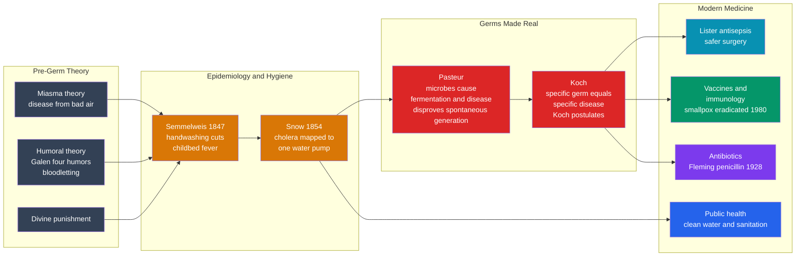

# 🦠 Germ Theory and the Rise of Modern Medicine

> [!abstract] TL;DR
> For almost all of human history, disease was blamed on **bad air** *(miasma)*, an **imbalance of the four humors** *(Galen → bloodletting)*, or **divine punishment**, and physicians killed roughly as often as they cured. The **germ theory of disease** — the realization that specific, invisible **living microorganisms** cause specific diseases — is one of the most **lifesaving ideas ever conceived**. Built on the early epidemiology of **John Snow** and the hygiene of **Ignaz Semmelweis**, made real by **Louis Pasteur** *(microbes cause fermentation and disease)* and rigorously proven by **Robert Koch** *(one germ, one disease; Koch's postulates)*, it transformed medicine from a largely ineffective or harmful craft into a **science**. Its children — **antisepsis, vaccines, antibiotics, and public health** — together roughly **doubled human lifespan**. It is the model case of how a single scientific insight can reshape civilization.

---

## Intuition

**Analogy:** Imagine a village where people keep dying, and everyone "knows" the cause is the foul smell drifting off the marsh — so they burn incense, hang herbs, and wait for the wind to change. Nobody dreams that the real killer is a living thing too small to see, riding in the water everyone drinks from the same well. As long as you blame the *smell*, you fight the wrong enemy: you can perfume the whole town and the deaths continue. The moment someone proves there is an **invisible living enemy in the well**, everything changes — you can board up the well, boil the water, wash your hands, and eventually hunt the creature down and kill it.

That is exactly the leap the germ theory represents. For millennia medicine attacked shadows — bad air, imbalanced humors, angry gods — and its main "treatments" *(bleeding, purging)* often made patients worse. Once you know that a **specific microbe causes a specific disease**, you gain a target you can actually fight: you can **wash and sterilize** to keep it out, **vaccinate** to prime the body against it, **filter the water and build the sewers** to deny it a route, and eventually **kill it with antibiotics**. A single idea turned death sentences into curable conditions.

---

## How It Works

### Core Mechanics

The germ theory did not arrive fully formed. It was assembled over roughly forty years, and — crucially — the **public-health payoff began *before* microbes were even confirmed**, because careful epidemiology could act on the *pattern* of disease without yet knowing the cause.

1. **The starting point: disease without a cause.** From antiquity into the 19th century, three overlapping frameworks dominated. **Miasma theory** held that disease rose from *bad air* — rotting, smelly organic matter. **Humoral theory**, inherited from **Galen** *(2nd c. CE)*, held that illness was an *imbalance of four humors* (blood, phlegm, black and yellow bile), so the cure was to *rebalance* them by **bloodletting**, purging, and blistering — interventions that were frequently useless or lethal. A third strand read disease as **divine punishment**. None gave a mechanism you could reliably act on; medicine was, on average, barely better than doing nothing.

2. **Epidemiology and hygiene — acting before the germ is found.** Two precursors showed that disease follows *discoverable patterns*. In **1847**, **Ignaz Semmelweis** noticed that mothers delivered by doctors *(who came straight from dissecting corpses)* died of "childbed fever" far more often than those delivered by midwives. He mandated **handwashing in chlorinated lime** and death rates collapsed — yet, lacking a theory of *why*, he was ridiculed and rejected in his lifetime, a tragedy of premature discovery. In **1854**, physician **John Snow** traced a lethal London **cholera** outbreak to a single contaminated **water pump** on Broad Street by **mapping the deaths** — they clustered around that pump, not spread evenly as bad air would predict. He had the pump handle removed and the outbreak subsided. Snow founded **epidemiology** and evidence-based public health: **data over dogma**, years before the cholera bacterium was ever seen. *(See the demo below.)*

3. **Pasteur — germs made real.** **Louis Pasteur** delivered the experimental proof. His **swan-neck flask** experiments disproved **spontaneous generation** *(broth stays sterile if airborne microbes cannot reach it)*, showing that microbes come only from other microbes. He proved that **microorganisms drive fermentation** — and, by extension, spoilage and disease — invented **pasteurization** *(gentle heating to kill microbes)*, and developed the first **rationally designed vaccines** *(anthrax, rabies)*. Pasteur turned "invisible living things cause change" from speculation into laboratory fact and founded **microbiology**.

4. **Koch — one germ, one disease.** **Robert Koch** supplied the rigor. He isolated the bacteria for **anthrax**, **tuberculosis**, and **cholera**, and formalized **Koch's postulates**: to prove a microbe *causes* a disease you must find it in every case, isolate and grow it in pure culture, reproduce the disease by inoculating a healthy host, and re-isolate the same microbe from that host. This is a model of **causal inference** — a checklist for distinguishing "this germ is present" from "this germ is the cause." Koch launched the *golden age of bacteriology*, in which the microbes behind disease after disease were identified.

5. **Antisepsis and surgery.** **Joseph Lister** applied germ theory to the operating table, spraying **carbolic acid** to kill microbes during surgery — **antisepsis** — which later matured into **asepsis** *(sterilizing instruments, gowns, and environment so germs never arrive)*. Combined with **anesthesia** *(ether and chloroform, which made operations survivable and bearable)*, surgery went from a last resort with catastrophic infection rates to a routine, survivable intervention.

6. **Vaccines and immunology.** The vaccine story runs from **Edward Jenner's** empirical **smallpox** vaccination *(1796, decades before germ theory)* through **Pasteur's** rational vaccines to modern **immunology** and the understanding of **herd immunity**. Its crowning achievement is the **global eradication of smallpox in 1980** — a disease that killed hundreds of millions, erased by science and coordinated public health. The **mRNA COVID vaccines** are the latest chapter.

7. **Antibiotics.** **Alexander Fleming's** chance observation of **penicillin** *(1928)* opened the antibiotic era — "miracle drugs" that made once-fatal bacterial infections curable and underpin modern surgery, chemotherapy, and childbirth. But bacteria **evolve**: overuse selects for **antibiotic resistance**, a live and worsening crisis — natural selection in real time, a Darwinian problem demanding a Darwinian response.

8. **Public health — the biggest win.** The largest gains in human lifespan came not from clinics but from **sanitation, clean water, sewage systems, vaccination, and hygiene** — all downstream of germ theory and epidemiology. These drove the **demographic transition** and, alongside nutrition, roughly **doubled human life expectancy** over a century. Arguably, public health has saved more lives than all of clinical medicine combined.

### Flow / Architecture



---

## Key Concepts

### Secondary — the foundations

- **Germ theory of disease.** Specific, tiny **living microorganisms** — bacteria, viruses, fungi, parasites — cause specific infectious diseases, replacing bad air, humors, and divine punishment.
- **Miasma vs germ theory.** Miasma blamed *smell and bad air*; germ theory identifies a *concrete, transmissible living agent* you can block, kill, or vaccinate against.
- **Epidemiology.** The study of *how disease spreads through a population* — who gets sick, where, and when — which can reveal a cause from the *pattern* alone, even before the microbe is identified.
- **Vaccination.** Training the immune system with a harmless preview of a pathogen so it can fight the real infection later.

### Undergraduate — the mechanisms

- **Koch's postulates.** The four criteria — found in every case, isolated in pure culture, reproduces the disease when inoculated, re-isolated afterward — that establish a microbe as the *cause* of a disease. A template of **causal inference**.
- **Disproving spontaneous generation.** Pasteur's **swan-neck flask**: broth exposed to air but *not* to settling airborne microbes stays sterile indefinitely — the decisive control showing life comes only from life.
- **Antisepsis vs asepsis.** Antisepsis *kills* microbes on a wound or in the field *(Lister's carbolic acid)*; asepsis *prevents* them from ever arriving *(sterile instruments, gloves, gowns)*.
- **Herd immunity threshold.** When a large enough fraction of a population is immune, each infection produces fewer than one new case on average, so the pathogen cannot sustain a chain of transmission — protecting even the unvaccinated.
- **The basic reproduction number R0.** The average number of new infections one case produces in a fully susceptible population; control means driving the *effective* reproduction number **below 1**.

### Graduate — interpretation and significance

- **Data before mechanism.** Snow and Semmelweis achieved life-saving control *without* knowing the microbe — a profound point about how epidemiology can act correctly on a pattern while the underlying cause is still unknown, and about the difference between **prediction and explanation**.
- **The tragedy of premature discovery.** Semmelweis was right and rejected because he had *evidence* but no accepted *theory* to make it credible — a case study in how paradigms gate what counts as knowledge, echoing debates in the philosophy of science.
- **Antibiotic resistance as evolution in action.** Overuse of antibiotics is a selection pressure that predictably breeds resistant strains — the germ theory's own child colliding with the **Darwinian revolution**; the "arms race" is natural selection on a clinical timescale.
- **Clinical vs population medicine.** The single largest driver of increased lifespan was *public health* (water, sewage, vaccination), not bedside treatment — a reminder that the highest-leverage interventions are often systemic and preventive rather than curative.
- **Why it matters.** Germ theory is the paradigm of a single insight that *reshaped civilization*: it made medicine a science, enabled antisepsis, vaccines, antibiotics, and sanitation, and — with nutrition — roughly doubled human life expectancy.

---

## Python Demo

This demo reconstructs **John Snow's founding act of epidemiology** — the 1854 Broad Street cholera outbreak — and pairs it with a modern **SIR** transmission model. Part 1 shows that cholera deaths **cluster around one contaminated water pump** (the germ/water hypothesis), *not* spread evenly as the "bad air" *(miasma)* hypothesis would predict; Part 2 shows the epidemic curve **collapsing after the pump handle is removed**; Part 3 shows how understanding transmission lets you **control** an epidemic by pushing the effective reproduction number below 1 through vaccination. Requires `numpy` and `matplotlib`.

```python
"""
John Snow and the birth of EPIDEMIOLOGY (London, 1854), plus a modern SIR
model of transmission and control.

Part 1: Reproduce Snow's founding insight -- cholera deaths CLUSTER around one
        contaminated water PUMP (Broad Street), which the reigning "miasma /
        bad air" theory could not explain (bad air would spread deaths evenly).
Part 2: Show the epidemic curve collapsing after the pump handle is removed.
Part 3: A simple SIR model showing how understanding transmission lets you
        control an epidemic -- vaccination that pushes the effective R below 1.

Requires: numpy, matplotlib
"""
import numpy as np
import matplotlib.pyplot as plt

rng = np.random.default_rng(1854)

# ---------------------------------------------------------------------
# PART 1 -- Snow's spot map: where did the cholera deaths fall?
# ---------------------------------------------------------------------
# A schematic Soho street grid. The DEADLY Broad Street pump is at the origin;
# other neighbourhood pumps drew from cleaner sources.
broad_street_pump = np.array([0.0, 0.0])
other_pumps = np.array([[ 3.5,  2.0],
                        [-3.0,  2.5],
                        [ 1.0, -3.5],
                        [-2.5, -2.0]])

# GERM/WATER hypothesis: deaths radiate OUT from the ONE contaminated pump,
# because people carried its water home. Model as a 2-D cluster centred on it,
# denser nearer the pump (people fetch water from the closest source).
n_deaths = 500
radius = rng.exponential(scale=1.4, size=n_deaths)      # distance from bad pump
theta = rng.uniform(0, 2 * np.pi, size=n_deaths)
deaths = broad_street_pump + np.c_[radius * np.cos(theta), radius * np.sin(theta)]

# MIASMA hypothesis (the null): "bad air" hangs over the whole district, so
# deaths should be scattered ~uniformly, NOT clustered on one pump.
miasma_deaths = rng.uniform(-6, 6, size=(n_deaths, 2))

dist_to_bad = np.linalg.norm(deaths - broad_street_pump, axis=1)
dist_miasma = np.linalg.norm(miasma_deaths - broad_street_pump, axis=1)

within_1 = np.mean(dist_to_bad < 1.0) * 100
print("SNOW'S SPOT MAP, 1854")
print(f"  Germ/water model : {within_1:.0f}% of deaths within 1 unit of the Broad St pump")
print(f"  Miasma/bad-air   : only {np.mean(dist_miasma < 1.0) * 100:.0f}% that close")
print("  => deaths CLUSTER on one pump; 'bad air' cannot explain the pattern.\n")

# ---------------------------------------------------------------------
# PART 2 -- The epidemic curve and the pump-handle removal
# ---------------------------------------------------------------------
days = np.arange(0, 40)
handle_removed = 22                       # Snow persuaded the parish on ~day 22
# exponential rise while the pump feeds new infections, sharp decay afterwards
curve = np.where(
    days < handle_removed,
    8 * np.exp(0.18 * days),
    8 * np.exp(0.18 * handle_removed) * np.exp(-0.45 * (days - handle_removed)),
)
daily_deaths = rng.poisson(np.maximum(curve, 0))

# ---------------------------------------------------------------------
# PART 3 -- SIR model: transmission you understand is transmission you can stop
# ---------------------------------------------------------------------
def sir(R0, n_days=160, gamma=0.1, I0=1e-4):
    """Simple discrete SIR. Returns infected fraction over time."""
    beta = R0 * gamma
    S, I, R = 1 - I0, I0, 0.0
    I_t = []
    for _ in range(n_days):
        dS = -beta * S * I
        dI = beta * S * I - gamma * I
        dR = gamma * I
        S, I, R = S + dS, I + dI, R + dR
        I_t.append(I)
    return np.array(I_t)

R0 = 2.5
threshold = 1 - 1 / R0                     # herd-immunity threshold
p_vax = min(threshold + 0.05, 0.99)        # vaccinate just past the threshold
R_eff = R0 * (1 - p_vax)                    # effective reproduction number
I_free = sir(R0)                            # uncontrolled epidemic
I_vax = sir(R_eff)                          # vaccinated -> R_eff < 1
print("SIR CONTROL")
print(f"  R0 = {R0}: herd-immunity threshold = vaccinate {threshold * 100:.0f}% of people")
print(f"  Vaccinate {p_vax * 100:.0f}% -> effective R = {R_eff:.2f} (< 1): epidemic cannot take off.\n")

# ---------------------------------------------------------------------
# FIGURE
# ---------------------------------------------------------------------
fig, ax = plt.subplots(2, 2, figsize=(13, 10))

# Panel A: the spot map
axA = ax[0, 0]
axA.scatter(deaths[:, 0], deaths[:, 1], s=10, c="#dc2626", alpha=0.5, label="cholera deaths")
axA.scatter(*broad_street_pump, marker="s", s=200, c="black", zorder=5,
            label="Broad St pump (contaminated)")
axA.scatter(other_pumps[:, 0], other_pumps[:, 1], marker="^", s=120, c="#2563eb",
            zorder=5, label="other pumps (clean)")
axA.set_title("Snow's spot map: deaths cluster on ONE pump")
axA.set_xlim(-6, 6); axA.set_ylim(-6, 6); axA.set_aspect("equal")
axA.legend(loc="upper right", fontsize=8); axA.grid(alpha=0.2)

# Panel B: deaths vs distance from the Broad Street pump
axB = ax[0, 1]
bins = np.linspace(0, 8, 17)
axB.hist(dist_to_bad, bins=bins, color="#dc2626", alpha=0.8,
         label="germ/water model (observed)")
axB.hist(dist_miasma, bins=bins, color="#64748b", alpha=0.5,
         label="miasma / bad-air model")
axB.set_xlabel("distance from Broad Street pump")
axB.set_ylabel("number of deaths")
axB.set_title("Deaths concentrate near the pump,\nnot spread evenly as 'bad air' predicts")
axB.legend(fontsize=8); axB.grid(alpha=0.2)

# Panel C: epidemic curve + pump handle removed
axC = ax[1, 0]
axC.bar(days, daily_deaths, color="#dc2626", alpha=0.8)
axC.axvline(handle_removed, color="black", ls="--")
axC.text(handle_removed + 0.5, daily_deaths.max() * 0.85,
         "pump handle\nremoved", fontsize=9)
axC.set_xlabel("day of outbreak"); axC.set_ylabel("daily deaths")
axC.set_title("Remove the handle -> the outbreak collapses")
axC.grid(alpha=0.2)

# Panel D: SIR with and without vaccination
axD = ax[1, 1]
axD.plot(I_free * 100, color="#dc2626", lw=2, label=f"no control  (R0 = {R0})")
axD.plot(I_vax * 100, color="#059669", lw=2,
         label=f"vaccinate {p_vax * 100:.0f}%  (R_eff = {R_eff:.2f})")
axD.set_xlabel("day"); axD.set_ylabel("% of population infected")
axD.set_title("SIR: understanding transmission enables control")
axD.legend(fontsize=8); axD.grid(alpha=0.2)

plt.tight_layout()
plt.savefig("germ_theory_epidemiology.png", dpi=120)
plt.show()
```

Running this prints that in the germ/water model roughly **half the deaths fall within one unit of the Broad Street pump** while the miasma model scatters them everywhere, and that for `R0 = 2.5` you must vaccinate about **60%** of the population to reach herd immunity. The four panels tell the whole story: **(A)** the spot map where deaths visibly *pool* around one pump; **(B)** the distance histogram where the germ/water pattern spikes near the pump while "bad air" stays flat; **(C)** the epidemic curve that **collapses the moment the pump handle is removed** — Snow's decisive intervention; and **(D)** the SIR model where an uncontrolled outbreak *(red)* is flattened to nothing once vaccination pushes the effective reproduction number below 1 *(green)*. Epidemiology, made visual.

---

## Real-World Applications

- **Modern outbreak response.** Every cholera, Ebola, or COVID investigation still uses Snow's method: **map the cases, find the common source, cut the transmission link.** Contact tracing, case mapping, and "flatten the curve" are direct descendants of the Broad Street pump.
- **Surgery and hospital hygiene.** Sterile fields, autoclaved instruments, surgical scrubs, and the modern obsession with **hand hygiene** all trace to Semmelweis and Lister; hospital-acquired-infection control is germ theory operationalized.
- **Vaccination programs.** From childhood immunization schedules to the **eradication of smallpox (1980)** and near-eradication of polio, to **mRNA COVID vaccines**, all rest on the germ theory plus immunology and herd-immunity math.
- **Food and water safety.** **Pasteurization**, water chlorination, sewage treatment, and food-safety regulation are germ theory applied to daily life — arguably the highest life-saving return of any technology.
- **Antimicrobial stewardship.** Because antibiotic **resistance** is evolution under selection, hospitals now restrict and rotate antibiotics; drug discovery races a moving target set by natural selection.

---

## Common Pitfalls

- **"Germ theory was accepted instantly."** It took decades and fierce resistance. Semmelweis was ridiculed and died discredited; miasma theory persisted for a generation after Snow. Paradigm change was slow and contested.
- **Confusing correlation with cause.** Snow's clustering *suggested* the pump; **Koch's postulates** were invented precisely to prove that a microbe *causes* a disease rather than merely accompanying it. Association is not causation.
- **Treating miasma theory as stupid.** Given the evidence available, "disease comes from filthy, smelly conditions" was a *reasonable* hypothesis — and it usefully motivated sanitation. It failed only where a specific transmissible agent, not smell, was doing the work.
- **Thinking clinical medicine drove the lifespan gains.** The largest gains came from **public health** — clean water, sewers, vaccination — not from doctors' treatments. Overcrediting the clinic misreads the history.
- **Assuming antibiotics are a permanent victory.** Bacteria evolve. Overuse breeds **resistance**, and the pipeline of new antibiotics is thin — the "miracle drug" era is not guaranteed to last.
- **Forgetting germs can be beneficial.** The germ theory can slide into "all microbes are enemies." Most microbes are harmless or essential — the **gut microbiome** and countless environmental microbes keep us alive.

---

## Related Concepts

The History-of-Science sibling *The Neuroscience and Mind Sciences* — the parallel scientific conquest of the brain and mind — is referenced here in prose because it is not yet written. The wikilinks below all point to **verified** notes in the vault:

- [[The_Birth_of_Modern_Biology]] — the microscope, cell theory, and refutation of spontaneous generation that made microbes visible and set the stage for germ theory.
- [[The_Darwinian_Revolution]] — the evolutionary logic behind antibiotic resistance; germ theory and Darwin's theory collide in the resistance crisis.
- [[The_Molecular_Biology_Revolution]] — which later explained microbes, immunity, and mRNA vaccines at the level of genes and molecules.
- [[Scientific_Method_and_Empiricism]] — the controlled-experiment and *data-over-authority* logic that Snow, Pasteur, and Koch each embodied; Koch's postulates are causal inference in action.
- [[Ancient_and_Prehistoric_Science]] — the Galenic, humoral, and Aristotelian medicine that germ theory overturned.
- [[Islamic_Golden_Age_Science]] — the medieval transmission and advance of medicine *(Ibn Sina's Canon)* between antiquity and the modern era.
- [[The_Scientific_Revolution_Overview]] — the broader break with inherited authority of which medicine's transformation is one front.
- [[History_of_Science_Overview]] — the entry point situating this story among the great scientific revolutions.
- [[Vaccines_and_Antibiotics]] — the Biology-vault deep dive on how vaccines and antibiotics actually work at the cellular level.
- [[Bacteria_and_Archaea]] — the microbes Pasteur and Koch identified as disease agents.
- [[Viruses]] — the sub-microbial pathogens germ theory later expanded to include.
- [[The_Innate_Immune_System]] — the body's first-line defense that vaccines and immunology build on.
- [[The_Adaptive_Immune_System]] — the memory-based immunity that makes vaccination possible.
- [[Natural_Selection_and_Adaptation]] — the evolutionary engine behind antibiotic resistance, a Darwinian problem inside modern medicine.
- [[Population_Ecology]] — the population-dynamics mathematics *(growth, R0, thresholds)* underlying the SIR epidemic model.
- [[Public_Health_and_Epidemiology]] — the modern discipline Snow founded, and its methods for tracing and controlling disease.
- [[Infectious_Disease_Vaccines_and_Immunity]] — the contemporary Health-vault treatment of transmission, immunity, and vaccination.
- [[Global_Health_and_Health_Systems]] — how sanitation, vaccination, and clean water produced the greatest gains in human lifespan.
- [[The_Future_of_Health_and_Medicine]] — where the germ-theory lineage heads next, from mRNA platforms to resistance.

---

## Review Questions

**Secondary**

1. Before germ theory, what did people believe caused disease, and why were treatments like bloodletting often harmful? Explain in your own words what the germ theory says instead and why it was such a powerful idea.

**Undergraduate**

2. John Snow stopped a cholera outbreak *before* anyone had seen the cholera bacterium. Using the Broad Street pump story, explain how **mapping cases** let him identify the source and act, and why the *clustering* of deaths refuted the miasma "bad air" hypothesis. What does this reveal about the relationship between finding a pattern and knowing a cause?

**Graduate**

3. Semmelweis had strong statistical evidence that handwashing saved lives yet was rejected, while Koch's postulates later gave germ theory decisive credibility. Using both cases, argue what it takes for a medical claim to be *accepted* — evidence, mechanism, theory, or institutional authority — and connect this to antibiotic resistance as a present-day example where the science is clear but the response lags.

---

## Sources

- Snow, John. *On the Mode of Communication of Cholera* (2nd ed., 1855). — The founding text of epidemiology, including the Broad Street pump investigation.
- Koch, Robert. "Die Ätiologie der Tuberkulose" (1882) and the formulation of Koch's postulates. — Establishing specific microbes as specific causes.
- Porter, Roy. *The Greatest Benefit to Mankind: A Medical History of Humanity.* W. W. Norton, 1997. — Sweeping history of medicine from antiquity to the modern era.
- Johnson, Steven. *The Ghost Map: The Story of London's Most Terrifying Epidemic.* Riverhead Books, 2006. — Narrative history of Snow, cholera, and the birth of epidemiology.
- [Germ theory of disease (Wikipedia)](https://en.wikipedia.org/wiki/Germ_theory_of_disease)
- [1854 Broad Street cholera outbreak (Wikipedia)](https://en.wikipedia.org/wiki/1854_Broad_Street_cholera_outbreak)

---

#history-of-science #germ-theory #pasteur #koch #epidemiology
