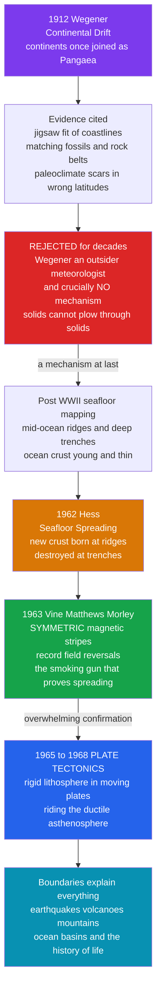

# 🌍 Plate Tectonics and the Earth Science Revolution

> [!abstract] TL;DR
> **Plate tectonics** is the unifying theory of the solid Earth: its rigid outer shell — the **lithosphere** — is broken into a dozen or so **plates** that glide over the ductile mantle beneath, so **continents drift**, ocean floors are continually **created at ridges** and **destroyed at trenches**, and nearly every earthquake, volcano, and mountain range sits along a **plate boundary**. The idea began as **Alfred Wegener's continental drift** (1912) — inspired by the jigsaw fit of Africa and South America, matching fossils, and rock belts that cross oceans — and was **ridiculed for half a century** because Wegener was a meteorologist and, fatally, had **no mechanism**: how could solid continents plow through solid ocean floor? The revolution came from the **seafloor**: post-WWII mapping revealed the mid-ocean ridge system, **Harry Hess** proposed **seafloor spreading**, and the **symmetric magnetic stripes** of Vine–Matthews–Morley (1963) proved it — the ocean crust is a "tape recorder" of Earth's periodic magnetic reversals. Between roughly 1965 and 1968 the whole science flipped. It is the textbook example of a "crazy" idea vindicated, a Kuhnian paradigm shift, and a lesson in how long correct science can be resisted when the *mechanism* is missing.

---

## Intuition

**Analogy:** Look at a world map — really look. The bulge of Brazil tucks neatly into the notch beneath West Africa. It is almost *too* obvious, the way two torn halves of the same photograph line up. Anyone can see it, and people had noticed it since the first good Atlantic maps. In 1912 **Alfred Wegener** said out loud what the map was screaming: these continents were once **joined**, and they have **drifted apart**. For this he was mocked for the better part of fifty years — not because the fit was unconvincing, but because he could not answer one devastating question: *by what force does a continent sail across the seafloor like a ship through water?* A pattern without a mechanism is, to a scientist, just a coincidence.

Then, in the 1960s, the evidence came from an unexpected place: the **bottom of the ocean**. New sonar and magnetic surveys revealed a globe-encircling mountain range down the middle of the ocean basins and, running parallel to it, a **symmetric zebra pattern** of magnetized rock — identical on both sides of the ridge, like a barcode mirrored about a center line. There was only one explanation: the seafloor is being manufactured at the ridge, splitting and spreading outward in both directions, tape-recording the Earth's flipping magnetic field as it cools. The continents were never plowing through anything — they are **passengers** riding on vast plates of rock, ocean floor and continent together. Wegener was right after all. It is the cleanest case in the history of science of a rejected idea becoming the **unifying theory of an entire discipline** — and of just how long good evidence can take to win.

---

## How It Works

### The foundation: deep time

Plate tectonics is unthinkable without a prior revolution — the discovery of **deep time**. If the Earth were a few thousand years old, as biblical chronology (Ussher's 4004 BCE) held, there would be no time for continents to travel or oceans to open. In the late 1700s **James Hutton** looked at tilted, eroded, re-buried rock at Siccar Point and saw "no vestige of a beginning, no prospect of an end" — an Earth shaped by the same slow processes still operating today. **Charles Lyell** systematized this into **uniformitarianism**: *"the present is the key to the past."* The everyday rates of erosion, deposition, and volcanism, extrapolated over immense spans, are enough to build and destroy whole landscapes. This vast, patient Earth was the same gift that let **Darwin** imagine slow biological change (see [[The_Darwinian_Revolution]]); geology and evolution grew up on the same clock.

For over a century deep time was only *relative* — layer B is younger than layer A. The absolute scale arrived with **radiometric dating** (see [[The_Atomic_Age_Begins]] and [[Radiometric_Dating]]): radioactive isotopes decay at fixed rates, so the ratio of parent to daughter atoms in a rock is a clock. In 1953 **Clair Patterson** dated the Earth by lead isotopes in meteorites to **~4.5 billion years**. That is the stage on which plate tectonics plays out.

### Act I: Wegener and continental drift (1912)

Wegener assembled a **consilience** of clues that all pointed to a former supercontinent he named **Pangaea**:

- **The jigsaw fit** — the coastlines of the Atlantic, and better still the edges of the *continental shelves*, nest together.
- **Matching fossils across oceans** — the reptile *Mesosaurus* and the fern *Glossopteris* appear on both sides of the Atlantic, in continents now separated by thousands of kilometers of salt water they could never have crossed.
- **Continuous rock belts** — mountain ranges and distinctive strata stop dead at one coast and resume, matching, on another continent, like a torn newspaper whose print lines up.
- **Paleoclimate scars in the wrong places** — glacial scratches in tropical Africa and India, coal (tropical swamp) in Antarctica — sensible only if those lands once sat at very different latitudes.

Each clue alone is explicable away; together they form a pattern that cries out for a single cause. Wegener's cause: the continents were once one, and have **drifted**.

### Act II: the rejection

Wegener was largely **dismissed**, and the reasons are a case study in how science can resist a correct idea:

1. **No mechanism.** This was the fatal flaw. Wegener vaguely invoked tidal and centrifugal forces, which physicists (notably **Harold Jeffreys**) showed were orders of magnitude too weak, and which would have crumpled continents. Solid granite cannot plow through solid basalt. Without a plausible engine, the fit of the continents looked like numerology.
2. **Disciplinary boundaries.** Wegener was a **meteorologist and polar explorer** — an *outsider* to geology. The establishment guarded its turf, and an interloper's grand unification was easy to wave away.
3. **The sociology of resistance.** Reputations, textbooks, and careers were built on a static Earth of fixed continents and sunken land-bridges. A discipline does not abandon its framework because one man draws a suggestive map. (The **sociology of scientific knowledge** — how community, authority, and interest shape which claims are accepted — is the natural lens here.)

Wegener died on the Greenland ice in 1930, his idea in exile.

### Act III: the seafloor speaks

The revolution came from technology and war. **Post-WWII** sonar, echo-sounding, and magnetometers — many developed for submarine detection — let oceanographers map the ocean floor for the first time. What they found was astonishing:

- A **globe-encircling mid-ocean ridge** system, ~65,000 km of submarine mountains, with a rift valley down its crest.
- Deep **trenches** at the ocean margins, the sites of the world's greatest earthquakes.
- Ocean crust that was **surprisingly young and thinly sedimented** — nowhere older than ~200 million years, versus billions for continents.

In 1962 **Harry Hess** proposed **seafloor spreading** (calling it, tellingly, "an essay in geopoetry"): hot mantle rises beneath the ridge, new basaltic crust is born and pushed outward in both directions, cools, and eventually plunges back into the mantle at the trenches. The continents do not plow through the ocean floor — they **ride along** with it, passively, as the seafloor conveyor carries them. *At last, a mechanism.*

### Act IV: the magnetic-stripe smoking gun (1963)

Hess's idea needed a decisive test, and it came from **paleomagnetism** (see [[Geomagnetism_and_Paleomagnetism]]). When molten basalt cools past the **Curie temperature**, magnetic minerals lock in the direction of Earth's field at that moment. And Earth's field, geologists had learned, **periodically reverses** — north and south magnetic poles swap, at irregular intervals of tens of thousands to millions of years.

**Fred Vine, Drummond Matthews, and Lawrence Morley** (1963) put the two ideas together and made a startling prediction: if seafloor spreads from a ridge while the field flips, the crust should record **alternating bands of normal and reversed magnetization**, and — because crust spreads in *both* directions equally — those bands should be **symmetric mirror images across the ridge axis**. Magnetic surveys confirmed exactly this **zebra-stripe pattern**. The seafloor is a **tape recorder** of geomagnetic history, and its symmetry is proof of spreading. Better still, matching the stripe *widths* to the independently dated *reversal timescale* yields the **spreading rate** directly. This is the evidence the Python demo below reproduces.

### Act V: plate tectonics, the synthesis (1965–1968)

Between roughly 1965 and 1968 the pieces snapped together into **plate tectonics**. **J. Tuzo Wilson** identified the third boundary type — the **transform fault** — and the concept of plates as rigid caps. **Dan McKenzie, Jason Morgan, and Xavier Le Pichon** cast the whole thing in the rigorous geometry of rigid spherical plates moving on a sphere (Euler poles). The unified picture:

- Earth's rigid **lithosphere** is fractured into ~15 major and minor **plates** that move a few centimeters per year over the ductile **asthenosphere**.
- **Divergent boundaries** (mid-ocean ridges) — plates pull apart, new crust forms; the Atlantic widens.
- **Convergent boundaries** (subduction zones, trenches) — plates collide, one dives under, forming volcanoes and mountains; crust is destroyed.
- **Transform boundaries** (e.g., the San Andreas Fault) — plates slide past each other, grinding out earthquakes.

One theory now explained **earthquakes, volcanoes, mountain-building, ocean basins, the fit of the continents, and the distribution of life** — the same unifying power that Newton gave physics and Darwin gave biology.



---

## Key Concepts

### Secondary Level
- **Continental drift** — Wegener's idea that today's continents were once joined in Pangaea and have moved apart.
- **The jigsaw fit** — coastlines and continental shelves across the Atlantic nest together like puzzle pieces.
- **Seafloor spreading** — new ocean floor is made at mid-ocean ridges and moves outward, carrying the continents with it.
- **Plate** — a rigid slab of Earth's outer shell; the surface is a mosaic of about a dozen of them.
- **Plate boundary** — where plates meet; this is where nearly all earthquakes and volcanoes happen.
- **Deep time** — the Earth is about 4.5 billion years old, giving continents ample time to travel.

### Undergraduate Level
- **Lithosphere vs asthenosphere** — the rigid plate (crust plus rigid upper mantle) rides on the slowly flowing, ductile asthenosphere below.
- **Three boundary types** — **divergent** (ridges, crust created), **convergent** (subduction/collision, crust destroyed or crumpled), **transform** (sliding, San Andreas).
- **Magnetic reversals and paleomagnetism** — basalt freezes in the field direction as it cools past the Curie point; the field flips periodically, so cooling crust records a reversal history.
- **The Vine–Matthews–Morley hypothesis** — spreading + reversals ⇒ **symmetric magnetic stripes**; their symmetry proves spreading and their widths give spreading rate.
- **Uniformitarianism** — "the present is the key to the past" (Hutton, Lyell); slow present-day processes, over deep time, explain the geological record.
- **The mechanism problem** — Wegener's decades-long rejection turned entirely on the absence of a plausible driving force.

### Graduate Level
- **Mantle convection and slab pull** — the modern engine: cold, dense subducting slabs pulling plates (slab pull) and ridge-push, driven by mantle convection and Earth's internal heat; plates are the cold upper boundary layer of a convecting mantle.
- **Rigid-plate kinematics on a sphere** — plate motions as rotations about **Euler poles**; McKenzie–Parker, Morgan, Le Pichon formalization; relative vs absolute (hotspot) reference frames.
- **The geomagnetic polarity timescale (GPTS)** — calibrating marine magnetic anomalies against radiometrically dated reversal boundaries (Cande & Kent) to read spreading rates and reconstruct plate motion history.
- **Wilson cycle** — the cyclic opening and closing of ocean basins (rift → ocean → subduction → collision → supercontinent), see [[Wilson_Cycle_and_Supercontinents]].
- **Plate tectonics as a Kuhnian revolution** — anomaly accumulation under a static-Earth paradigm, crisis, and rapid gestalt switch once the seafloor data arrived; ~50 years from proposal to consensus.
- **Tectonics, climate, and life** — plate configurations control ocean gateways, CO₂ weathering feedbacks, biogeography, and the timing of some mass extinctions (see [[Mass_Extinctions_and_Paleoclimate]]).

---

## Python Demo

```python
# THE SEAFLOOR TAPE RECORDER, REPRODUCED.
# The single most decisive evidence for plate tectonics was the SYMMETRIC
# magnetic striping of the ocean floor. Here we model it from scratch:
#   1. New basaltic crust is manufactured at a mid-ocean ridge (x = 0) and
#      carried OUTWARD in BOTH directions at a fixed half-spreading rate.
#   2. As it cools, each parcel of crust freezes in the POLARITY of Earth's
#      magnetic field at that moment. The field REVERSES at known times
#      (the geomagnetic polarity timescale).
#   3. Because crust spreads symmetrically, the frozen stripes form a mirror-
#      image "barcode" about the ridge -- the smoking gun for spreading.
# We then play scientist: read the stripe boundaries, match them to the dated
# reversal timescale, and RECOVER the spreading rate. Finally we sketch the
# continental "fit" (matching coastlines + fossil belts) that first inspired
# Wegener.
import numpy as np
import matplotlib.pyplot as plt

rng = np.random.default_rng(0)

# ---------------------------------------------------------------
# 1. The geomagnetic polarity timescale (GPTS): real reversal
#    boundary ages in millions of years (Ma), spanning the last
#    ~5 Myr (Brunhes / Matuyama / Gauss / Gilbert chrons).
# ---------------------------------------------------------------
reversal_ages = np.array([0.78, 0.99, 1.07, 1.19, 1.78, 1.95,
                          2.58, 3.03, 3.11, 3.22, 3.33, 3.58,
                          4.18, 4.29, 4.48, 4.62, 4.80, 4.89])

def polarity(age):
    """Field polarity frozen into crust of a given age.
    +1 = normal (like today), -1 = reversed. Age 0 sits in the
    present-day Brunhes NORMAL chron; polarity flips at each boundary."""
    flips = np.searchsorted(reversal_ages, np.abs(age))
    return np.where(flips % 2 == 0, 1.0, -1.0)

# ---------------------------------------------------------------
# 2. Manufacture the seafloor. Crust age = distance / rate, so a
#    faster ridge spreads the SAME reversal history over a WIDER
#    band -- that is how stripe widths encode spreading rate.
# ---------------------------------------------------------------
TRUE_HALF_RATE = 25.0            # mm/yr  ==  km per Myr (a brisk ridge)
x_km       = np.linspace(-130, 130, 6000)   # distance from ridge axis (km)
crust_age  = np.abs(x_km) / TRUE_HALF_RATE  # symmetric age: age = dist / rate
crust_pol  = polarity(crust_age)            # the frozen-in stripe pattern

# ---------------------------------------------------------------
# 3. Play scientist: detect stripe boundaries on the POSITIVE side,
#    match them (in order) to the dated reversals, and fit a line
#    through the origin  ->  slope = recovered spreading rate.
# ---------------------------------------------------------------
xp, pp     = x_km[x_km > 0], crust_pol[x_km > 0]
flip_idx   = np.where(np.diff(pp) != 0)[0]
boundary_x = 0.5 * (xp[flip_idx] + xp[flip_idx + 1])   # measured distances (km)
rate_est   = np.sum(boundary_x * reversal_ages) / np.sum(reversal_ages ** 2)

print("=== Recovering the spreading rate from magnetic stripes ===")
print(f"True half-spreading rate      : {TRUE_HALF_RATE:.2f} mm/yr")
print(f"Stripe boundaries detected    : {boundary_x.size} (per side)")
print(f"RECOVERED half-spreading rate : {rate_est:.2f} mm/yr")
print(f"Full spreading rate (both)    : {2 * rate_est:.2f} mm/yr")

# ---------------------------------------------------------------
# 4. A synthetic continental "fit": one jagged rift edge, split and
#    drifted apart, with fossil belts that line up across the ocean.
# ---------------------------------------------------------------
lat  = np.linspace(-52, 8, 300)
edge = 5.0 * np.sin((lat + 25) / 18.0) + rng.normal(0, 0.6, lat.size)  # shared rift
GAP  = 14.0
sa_edge, af_edge = edge - GAP, edge + GAP     # South America / Africa coasts today
fossil_lats = np.array([-45.0, -22.0, -3.0])  # Mesosaurus / Glossopteris bands

# ===============================================================
# VISUALIZE
# ===============================================================
fig = plt.figure(figsize=(14, 8))
gs  = fig.add_gridspec(2, 2, height_ratios=[1, 1.35], hspace=0.35, wspace=0.25)

# (A) The symmetric magnetic-stripe barcode about the ridge axis.
axA = fig.add_subplot(gs[0, :])
axA.imshow(crust_pol.reshape(1, -1), aspect="auto", cmap="binary",
           vmin=-1, vmax=1, extent=[x_km.min(), x_km.max(), 0, 1])
axA.axvline(0, color="#dc2626", lw=2.5)
axA.text(0, 1.05, "mid-ocean ridge axis", color="#dc2626",
         ha="center", va="bottom", fontsize=9, fontweight="bold")
axA.set_yticks([])
axA.set_xlabel("distance from ridge axis (km)")
axA.set_title("Seafloor magnetic stripes: a SYMMETRIC barcode "
              "(black = normal, white = reversed)\n"
              "mirror symmetry about the ridge is the proof of seafloor spreading")

# (B) Stripe-boundary distance vs dated reversal age -> spreading rate.
axB = fig.add_subplot(gs[1, 0])
axB.scatter(reversal_ages, boundary_x, color="#2563eb", zorder=5,
            label="matched stripe boundaries")
tt = np.linspace(0, reversal_ages.max(), 50)
axB.plot(tt, rate_est * tt, color="#16a34a", lw=2,
         label=f"linear fit: rate = {rate_est:.1f} mm/yr")
axB.set_xlabel("reversal age (Ma, from dated timescale)")
axB.set_ylabel("stripe-boundary distance (km)")
axB.set_title("Stripe width + dated reversals = spreading RATE")
axB.legend(fontsize=8)

# (C) The continental fit that inspired Wegener.
axC = fig.add_subplot(gs[1, 1])
axC.fill_betweenx(lat, sa_edge - 26, sa_edge, color="#c9a56a", alpha=0.85)
axC.fill_betweenx(lat, af_edge, af_edge + 26, color="#8a9a5b", alpha=0.85)
axC.plot(edge, lat, "k--", lw=1.2, alpha=0.6, label="original rift (Pangaea)")
axC.text(sa_edge.mean() - 13, 4, "South\nAmerica", ha="center", fontsize=9)
axC.text(af_edge.mean() + 13, 4, "Africa", ha="center", fontsize=9)
for i, f in enumerate(fossil_lats):
    j = int(np.argmin(np.abs(lat - f)))
    axC.plot([sa_edge[j], af_edge[j]], [f, f], ":", color="#b91c1c", lw=1.3)
    axC.scatter([sa_edge[j], af_edge[j]], [f, f], color="#b91c1c", zorder=6,
                label="matching fossil belt" if i == 0 else None)
axC.set_xlabel("longitude (schematic)")
axC.set_ylabel("latitude")
axC.set_title("Wegener's clue: fitting coastlines + fossils")
axC.legend(fontsize=8, loc="lower left")

plt.savefig("plate_tectonics_evidence.png", dpi=130, bbox_inches="tight")
print("Saved plate_tectonics_evidence.png")
plt.show()
```

Running this prints a **recovered half-spreading rate of ~25 mm/yr**, matching the value baked into the model — exactly the trick real geophysicists used, only they *didn't* know the rate in advance and read it off the seafloor. Panel A is the payoff: a **symmetric black-and-white barcode**, identical on both sides of the red ridge axis, that no static-Earth theory can explain but that spreading predicts trivially. Panel B shows why the stripes are quantitative — boundary distance grows linearly with the independently dated reversal age, and the slope *is* the spreading rate. Panel C sketches Wegener's original inspiration: two coastlines that nest and fossil belts that line up straight across an ocean. Two independent lines of evidence, separated by fifty years, converging on one conclusion — the continents move.

---

## Real-World Applications

- **Earthquake and volcano hazard** — because quakes and eruptions cluster on plate boundaries, tectonics turns hazard from mystery into map. It underpins seismic building codes, tsunami warning systems, and volcanic monitoring that save lives (see [[Seismology_and_Earthquakes]]).
- **Resource exploration** — oil and gas accumulate in specific tectonic settings (rifted margins, foreland basins); ore deposits concentrate along subduction arcs and spreading centers. Plate reconstructions guide where to drill and mine.
- **Reading Earth history** — reconstructing past plate positions explains ancient climates, ocean circulation gateways (e.g., the opening of Drake Passage cooling Antarctica), and the deep history of oceans and life.
- **Biogeography and evolution** — the drift of continents split and rejoined ecosystems, shaping where species live and diverge (marsupials in Australia, the Great American Biotic Interchange), directly extending the [[The_Darwinian_Revolution]] story.
- **GPS geodesy** — space-based measurement now clocks plates moving centimeters per year in real time, confirming spreading rates the magnetic stripes first revealed and feeding earthquake-cycle models.
- **Planetary comparison** — Earth's active plate tectonics (versus the stagnant lids of Mars and Venus) is a key variable in why our planet has a long-lived carbon-silicate climate thermostat and, perhaps, habitability.

---

## Common Pitfalls

- **"Wegener discovered plate tectonics."** He proposed *continental drift* and marshaled superb evidence, but he had **no viable mechanism** and never conceived of rigid plates or seafloor spreading. Plate tectonics is the 1960s synthesis built by many hands (Hess, Vine, Matthews, Wilson, McKenzie, Morgan, Le Pichon). Crediting it all to Wegener flattens the real, more instructive history.
- **"He was rejected because scientists were closed-minded."** The rejection was, given the evidence of the day, largely *reasonable*: his proposed forces genuinely were far too weak, and a pattern with no mechanism is scientifically weak. The lesson is about the **necessity of a mechanism**, not simple dogmatism — though disciplinary gatekeeping did play a role.
- **"Continents plow through the ocean floor."** Wegener's own (wrong) picture. Continents are **passengers**; the whole plate — ocean floor *and* continent — moves together as new crust is added at ridges and old crust sinks at trenches.
- **"The magnetic stripes are painted stripes of different rock."** They are the *same* basalt, differing only in the **frozen-in direction of magnetization** — a record of field reversals, invisible to the eye and read only with a magnetometer.
- **"Earth's magnetic reversals happen like clockwork."** Reversals are **irregular**, spaced anywhere from tens of thousands to millions of years apart. It is precisely this *irregular* pattern that makes the stripe sequence a unique, matchable fingerprint for dating and correlation.
- **"Sea-floor spreading means the Earth is expanding."** No — crust created at ridges is balanced by crust **destroyed at subduction zones**; Earth's radius is constant. The expanding-Earth idea was a rival hypothesis that subduction killed.
- **"Acceptance was instant once the stripes appeared."** The synthesis was fast *by the standards of science* (a few years in the mid-1960s) but the whole arc from Wegener to consensus took roughly **fifty years** — the point of the story.

---

## Related Concepts

- [[The_Scientific_Revolution_Overview]] — the original template of a paradigm overthrow (Copernicus to Newton); plate tectonics is its 20th-century echo in the Earth sciences.
- [[The_Darwinian_Revolution]] — the parallel unifying revolution in biology; both leaned on **deep time**, and continental drift reshaped the biogeography Darwin relied on.
- [[Kuhn_and_Scientific_Revolutions]] — the paradigm-shift framework; plate tectonics is one of its cleanest textbook cases (crisis, anomaly, rapid gestalt switch).
- [[Continental_Drift_and_the_Plate_Tectonics_Revolution]] — the Earth-Science-vault deep dive on the same episode from the geologist's technical angle; this note is its history-and-philosophy framing.
- [[Seafloor_Spreading_and_Ocean_Basins]] — the mechanism (ridges, crust production, ocean-basin evolution) in geophysical detail.
- [[Geomagnetism_and_Paleomagnetism]] — how basalt records the field and how reversals are read; the physics behind the Python demo.
- [[Radiometric_Dating]] — the isotopic clocks that fixed the Earth's ~4.5-billion-year age and calibrated the reversal timescale.
- [[Geologic_Time_Scale]] — the deep-time framework on which drift and spreading play out.
- [[The_Atomic_Age_Begins]] — the nuclear physics that made radiometric dating possible.
- [[Subduction_Zones_and_Mountain_Building]] — where crust is destroyed and mountains rise; the convergent half of the plate cycle.
- [[Mantle_Convection_and_Hotspots]] — the modern engine driving the plates.
- [[Wilson_Cycle_and_Supercontinents]] — the long-term rhythm of ocean basins opening and closing, Pangaea and beyond.
- [[Seismology_and_Earthquakes]] — the boundary phenomenon that both maps the plates and threatens human life.
- [[Mass_Extinctions_and_Paleoclimate]] — how plate configurations feed into climate and the history of life.

> Sibling *History of Science* notes planned for this vault — *The Sociology of Scientific Knowledge* (how community and authority shape acceptance, the natural lens on Wegener's rejection), *Ecology and Environmental Science*, and a dedicated *Deep Time and the Age of the Earth* — are referenced in prose above and will link here once written.

---

## Review Questions

**Secondary**
1. Wegener pointed to the way South America and Africa fit together, plus matching fossils on both sides of the Atlantic, to argue the continents were once joined. Why did most scientists reject his idea for fifty years even though the fit was so striking?

**Undergraduate**
2. Explain how **seafloor spreading** plus **magnetic reversals** produce a *symmetric* pattern of magnetic stripes on the ocean floor. Why is the *symmetry* about the ridge axis the decisive proof of spreading — and how can the stripe *widths*, combined with a dated reversal timescale, be used to compute the spreading rate?

**Graduate**
3. Historians and philosophers of science often cite plate tectonics as a model **Kuhnian revolution**. Using the arc from Wegener (1912) to the synthesis (~1965–1968), analyze the roles of (a) accumulated **anomalies** under the static-Earth paradigm, (b) the absence and eventual arrival of a **mechanism**, and (c) **disciplinary and sociological** resistance. Compare with the Darwinian Revolution: what does the ~50-year lag in *both* cases suggest about how *mechanisms*, not merely *facts*, drive scientific change?

---

## Sources

- Oreskes, N. (1999). *The Rejection of Continental Drift: Theory and Method in American Earth Science*. Oxford University Press.
- Oreskes, N. (ed.) (2001). *Plate Tectonics: An Insider's History of the Modern Theory of the Earth*. Westview Press.
- Wegener, A. (1929/1966). *The Origin of Continents and Oceans* (4th ed., trans. J. Biram). Dover.
- Vine, F. J., & Matthews, D. H. (1963). "Magnetic Anomalies over Oceanic Ridges." *Nature*, 199, 947–949.
- Hess, H. H. (1962). "History of Ocean Basins." In *Petrologic Studies: A Volume in Honor of A. F. Buddington*, Geological Society of America.
- [USGS — This Dynamic Earth: The Story of Plate Tectonics](https://pubs.usgs.gov/gip/dynamic/dynamic.html)

---

#history-of-science #plate-tectonics #continental-drift #wegener #seafloor-spreading
