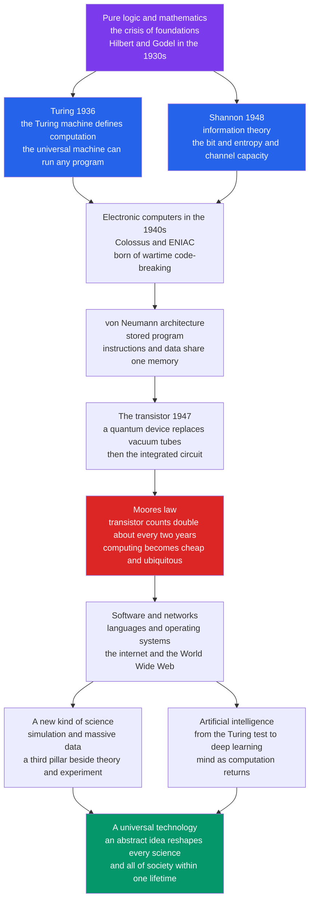

# 💻 The Computing and Information Revolution

> [!abstract] TL;DR
> The computing and information revolution is the **fastest and most total** scientific-technological upheaval in history: within a single lifetime an **abstract idea from pure logic** became a **universal technology** that reshaped every other science and all of daily life. It began not in a laboratory but in mathematics — **Alan Turing** (1936) formalized *what it means to compute* with the imaginary **Turing machine** and the **universal machine** that can run any program, the blueprint of the general-purpose computer. **Claude Shannon** (1948) then founded **information theory**, defining *information* quantitatively as the **bit** and setting the exact limits of compression and reliable communication. Wartime code-breaking (Bletchley, **Colossus**) and the first electronic computers (**ENIAC**) turned theory into hardware; the **von Neumann architecture** — instructions and data in one memory — still defines computers today. The quantum-mechanical **transistor** (1947) and the **microchip** made computing cheap, and **Moore's law** — transistor counts doubling roughly every two years — drove decades of exponential improvement. On that hardware grew software, the **internet**, and now **artificial intelligence**, making computation a "third pillar" of science alongside theory and experiment, and redefining *information* and *computation* as fundamental concepts of nature.

---

## Intuition

**Analogy:** In the 1930s a young mathematician asked a strange, almost childish question — *"what does it actually mean to compute?"* — and answered it with an imaginary machine: an infinite paper tape, a head that reads and writes symbols one square at a time, and a tiny table of rules. Picture a patient clerk with an endless notebook and a pocket rulebook, doing nothing but "read the current symbol, write a symbol, move left or right, change your mood." That absurdly simple picture turned out to capture *everything* that can ever be mechanically calculated — and one special version of it, fed a description of any other clerk's rulebook, could **imitate that clerk perfectly**. That single idea, a machine that can become any machine, is the seed of every computer, phone, and app now running civilization.

What makes this revolution unique in the history of science is the sequence: an idea from **pure logic** (computation) plus a new **science of information** (the bit) plus a **quantum device** (the transistor) fused into one **universal** technology. Unlike the [[The_Quantum_Revolution|quantum]] or Darwinian revolutions, which transformed *one* domain of nature, computing became a tool that transformed *every* domain — climate, genomes, galaxies, economies, language — and reorganized society itself, all within about seventy years.

---

## How It Works

### The revolution began in abstract mathematics

The strangest fact about the computer is that it was **invented before it was built**. In 1936, chasing a problem in mathematical logic (David Hilbert's *Entscheidungsproblem*, the "decision problem"), **Alan Turing** defined computation precisely with an idealized device — the **Turing machine** — and proved that some questions are **undecidable**: no machine can ever answer them, most famously whether an arbitrary program will halt or loop forever (see [[The_Halting_Problem_and_Undecidability]]). Independently, **Alonzo Church** reached the same boundary using his **lambda calculus** (see [[Recursive_Functions_and_Lambda_Calculus]]), and **Kurt Gödel's** incompleteness theorems had already shown that formal systems have inescapable limits. The **Church–Turing thesis** — that *anything* effectively computable is computable by a Turing machine — became the bedrock of computer science (see [[Turing_Machines_and_the_Church_Turing_Thesis]]). Crucially, Turing described a **universal machine**: one machine that, given a description of any other, simulates it. That is the abstract blueprint for the **general-purpose, programmable computer** — the reason one device runs a spreadsheet, a game, and a language model.

### Shannon and the science of information

Twelve years later, **Claude Shannon's** 1948 paper *A Mathematical Theory of Communication* did for **information** what Turing did for computation: made it a rigorous, measurable quantity. Shannon defined the **bit** as the fundamental unit, **entropy** as the average information (or surprise) in a source, and **channel capacity** as the exact maximum rate at which data can be sent reliably over a noisy line (see [[Information_Theory_Overview]] and [[Entropy_and_Information_Content]]). Two of his results are pillars of the digital age: the **source coding theorem** — you cannot compress a source below its entropy without losing information (see [[Source_Coding_Theorem_and_Data_Compression]]) — and the **noisy-channel coding theorem** — you *can* communicate essentially error-free up to the channel capacity (see [[Channel_Capacity_and_the_Noisy_Channel_Theorem]]). Earlier, in his 1937 master's thesis, Shannon had shown that **Boolean logic maps onto electrical switching circuits** — the theoretical basis of all digital design (see [[Boolean_Algebra_and_Logic_Gates]]). "Information" became a scientific concept, and every JPEG, ZIP file, Wi-Fi link, and error-correcting code descends directly from Shannon.

### From Babbage to ENIAC to von Neumann

The *idea* of a programmable machine predates electronics. In the 1830s **Charles Babbage** designed the mechanical **Analytical Engine**, and **Ada Lovelace** wrote what is often called the first algorithm and grasped that such a machine could manipulate *symbols*, not just numbers — a genuinely modern insight (a fuller treatment belongs in a forthcoming *Women and Underrepresented Scientists* note). A century later, **World War II** turned necessity into invention: Turing helped break the German Enigma at **Bletchley Park**, and the **Colossus** machines attacked the Lorenz cipher — early large-scale electronic computing born of wartime "Big Science." In the United States, **ENIAC** (1945) was among the first general-purpose electronic computers, programmed by rewiring and famously operated by a team of women mathematicians. The decisive design idea came in 1945: the **von Neumann architecture**, in which **program instructions and data live in the same memory**, so a machine can modify its own instructions and be reprogrammed by loading new code rather than rewiring. Almost every computer since — from mainframes to your phone — is a von Neumann machine (see [[CPU_Datapath_and_Control]]).

### The transistor, the microchip, and Moore's law

The enabling hardware was a **quantum-mechanical device**. In 1947 **Bardeen, Brattain, and Shockley** at Bell Labs invented the **transistor** — a tiny semiconductor switch whose behavior rests directly on the [[The_Quantum_Revolution|quantum]] band theory of solids — replacing bulky, hot, unreliable vacuum tubes. The **integrated circuit** (Kilby and Noyce, late 1950s) etched many transistors onto one chip of silicon, and miniaturization took off. In 1965 **Gordon Moore** observed that the number of transistors on a chip was **doubling roughly every two years** — **Moore's law**, an empirical, self-fulfilling trend that held for half a century, taking chips from a few thousand transistors to over one hundred billion (the [Python demo](#python-demo) plots this). Exponential hardware made computing **cheap, small, and ubiquitous**, putting more power in a smartphone than the machines that guided Apollo.

### Software, networks, and the internet

On raw hardware grew layer upon layer of abstraction: **programming languages**, **operating systems**, and the **personal computer** that put computing on every desk. The most transformative layer was connection. The **internet** — descended from ARPANET and standardized on TCP/IP — linked machines worldwide, and the **World Wide Web** (Tim Berners-Lee, 1989) made global information instantly navigable. Communication, commerce, and knowledge went digital; information became **instantly global and near-free to copy**, an economic and social shift as deep as the printing press.

### Computing as a new kind of science, and the rise of AI

Computers did not merely serve science — they became a **third pillar** of it, alongside theory and experiment. **Simulation** now models climate, galaxy formation, protein folding, and nuclear weapons; **massive data analysis** finds patterns no human could; and **artificial intelligence** accelerates discovery across fields. AI is also the revolution's return to its origin: Turing's 1950 question *"Can machines think?"* and his **imitation game** (the "Turing test") launched a field that ran through 1950s symbolic AI, endured "AI winters," and exploded with **deep learning** and **large language models** (see [[Neural_Network_Basics]]). AI revives the old idea of **mind as computation** — now with striking practical results, and with serious questions about reliability, bias, work, and power.



---

## Key Concepts

### Secondary — the core story

- **Computation was defined before computers existed.** Turing's imaginary machine (1936) fixed the meaning of "compute" using only logic and paper — the theory came *first*.
- **The universal machine.** One machine that can imitate any other is the blueprint for the general-purpose, reprogrammable computer — why a single device runs everything.
- **Information is measured in bits.** Shannon (1948) made "information" a precise scientific quantity; the **bit** is its unit, and **entropy** measures how much information a source carries.
- **The transistor and Moore's law.** A tiny quantum switch, mass-produced on silicon chips whose transistor count **doubled every two years**, made computing exponentially cheaper — the engine of the digital age.

### Undergraduate — the mechanisms

- **Church–Turing thesis and undecidability.** Turing machines and Church's lambda calculus define the same class of computable functions; some problems (the **halting problem**) are provably beyond *any* computer. See [[The_Limits_of_Computation]].
- **Boolean logic as circuits.** Shannon showed AND/OR/NOT logic maps onto switching circuits, making digital hardware a physical realization of Boolean algebra. See [[Boolean_Algebra_and_Logic_Gates]].
- **Entropy and the compression limit.** A source's entropy $H$ is the *floor* on lossless compression; codes like **Huffman** approach it (the demo below). See [[Huffman_Coding]].
- **Channel capacity.** Shannon's noisy-channel theorem gives the exact ceiling on reliable data rate, and proves error-free communication is possible up to it. See [[Channel_Capacity_and_the_Noisy_Channel_Theorem]].
- **von Neumann architecture.** The stored-program design (shared memory for code and data, a CPU that fetches–decodes–executes) still structures today's machines. See [[CPU_Datapath_and_Control]].

### Graduate — depth and frontiers

- **Complexity, not just computability.** Beyond *what* is computable lies *how efficiently*: the classes P and NP and the open **P versus NP** question are the deepest unsolved problems in computer science. See [[P_versus_NP]].
- **The physics of information.** Information is physical: **Landauer's principle** ties erasing a bit to a minimum energy cost, linking Shannon's entropy to thermodynamic entropy and the limits of computation. See [[Landauer_Principle_and_Thermodynamics_of_Computation]].
- **Simulation as a third epistemology.** Large-scale simulation (climate models, lattice QCD, molecular dynamics) generates knowledge in ways that are neither classical theory nor classical experiment, raising new questions of verification and validation.
- **Deep learning and mind-as-computation.** Modern neural networks revive the computational theory of mind at scale, forcing a re-examination of what "intelligence," "understanding," and the Turing test really mean. See [[Neural_Network_Basics]].
- **The end of Moore's law.** As transistors approach atomic scale, classical scaling stalls, pushing the field toward parallelism (GPUs), specialized accelerators, and post-CMOS ideas including quantum computing. See [[GPU_Architecture_and_CUDA]].

---

## Python Demo

Two foundational quantitative pillars of the revolution, side by side. **Part 1** plots **Moore's law**: real transistor counts of landmark chips from the 1971 Intel 4004 to modern many-billion-transistor processors, on a **log scale**, where sustained exponential growth appears as a straight line — a doubling roughly every two years for fifty years. **Part 2** makes **Shannon's information theory** concrete: it computes the **entropy** (bits per symbol) of a skewed source, builds a tiny **Huffman code**, and shows the average code length squeezing down **toward the entropy limit** — a direct demonstration that *information equals bits*. Requires `numpy` and `matplotlib`.

```python
"""
Two pillars of the computing and information revolution.

PART 1 - MOORE'S LAW
  Real transistor counts of landmark microprocessors, 1971..2023, plotted on a
  LOG scale. Exponential growth becomes a straight line; a least-squares fit
  recovers the famous "doubling every ~2 years."

PART 2 - SHANNON ENTROPY and HUFFMAN CODING
  Compute the entropy H (bits/symbol) of a skewed source, build a Huffman code,
  and show the average code length L satisfies  H <= L < H + 1  --  optimal
  compression approaches the information-theoretic limit. Information = bits.

Requires: numpy, matplotlib
"""
import heapq
from collections import Counter
import numpy as np
import matplotlib.pyplot as plt

# =====================================================================
# PART 1: Moore's law -- landmark chips (year, transistor count)
# =====================================================================
chips = [
    ("Intel 4004",      1971,        2_300),
    ("Intel 8080",      1974,        6_000),
    ("Intel 8086",      1978,       29_000),
    ("Intel 80286",     1982,      134_000),
    ("Intel 80386",     1985,      275_000),
    ("Intel 80486",     1989,    1_180_000),
    ("Pentium",         1993,    3_100_000),
    ("Pentium II",      1997,    7_500_000),
    ("Pentium 4",       2000,   42_000_000),
    ("Core 2 Duo",      2006,  291_000_000),
    ("Core i7",         2008,  731_000_000),
    ("IBM z13 (est.)",  2015, 4_000_000_000),
    ("AMD Epyc Rome",   2019, 39_500_000_000),
    ("Apple M1 Ultra",  2022, 114_000_000_000),
    ("Apple M2 Ultra",  2023, 134_000_000_000),
]
years  = np.array([c[1] for c in chips], dtype=float)
counts = np.array([c[2] for c in chips], dtype=float)

# Fit a line to log2(counts) vs year -> slope gives bits of growth per year
slope, intercept = np.polyfit(years, np.log2(counts), 1)
doubling_time = 1.0 / slope
print("PART 1 - Moore's law")
print(f"  fitted growth      : {slope:.3f} log2-units per year")
print(f"  => doubling time   : {doubling_time:.2f} years")
print(f"  4004 (1971)        : {counts[0]:,.0f} transistors")
print(f"  M2 Ultra (2023)    : {counts[-1]:,.0f} transistors")
print(f"  growth factor      : {counts[-1] / counts[0]:,.0f}x in 52 years")

# =====================================================================
# PART 2: Shannon entropy and Huffman coding
# =====================================================================
# A skewed source: some symbols far more likely than others (like English text)
message = ("the quick brown fox jumps over the lazy dog " * 6
           + "eeeeeeee ttttt aaaa ooo n") 
freq = Counter(message)
symbols = list(freq)
probs = np.array([freq[s] for s in symbols], dtype=float)
probs /= probs.sum()

# Shannon entropy H = -sum p log2 p  (bits per symbol)
H = -np.sum(probs * np.log2(probs))

def huffman_code_lengths(freq):
    """Build a Huffman tree; return {symbol: codeword_length}."""
    heap = [[w, i, s] for i, (s, w) in enumerate(freq.items())]
    heapq.heapify(heap)
    counter = len(heap)
    lengths = {s: 0 for s in freq}
    # Merge until one tree remains, tracking depth of each leaf.
    trees = {s: [s] for s in freq}
    while len(heap) > 1:
        w1, _, a = heapq.heappop(heap)
        w2, _, b = heapq.heappop(heap)
        for s in trees[a] + trees[b]:
            lengths[s] += 1               # every symbol below gains one bit
        merged_syms = trees[a] + trees[b]
        counter += 1
        node = f"node{counter}"
        trees[node] = merged_syms
        heapq.heappush(heap, [w1 + w2, counter, node])
    return lengths

lengths = huffman_code_lengths(freq)
L = sum(probs[i] * lengths[symbols[i]] for i in range(len(symbols)))  # avg bits/symbol
fixed = np.ceil(np.log2(len(symbols)))       # naive fixed-length code
print("\nPART 2 - Shannon entropy and Huffman")
print(f"  alphabet size      : {len(symbols)} symbols")
print(f"  entropy H          : {H:.3f} bits/symbol  (the limit)")
print(f"  Huffman avg length : {L:.3f} bits/symbol  (H <= L < H+1)")
print(f"  fixed-length code  : {fixed:.0f} bits/symbol")
print(f"  Huffman vs fixed   : {100*(1 - L/fixed):.1f}% smaller")

# =====================================================================
# Visualize
# =====================================================================
fig, (axM, axH) = plt.subplots(1, 2, figsize=(14, 6))

# --- Moore's law (log scale) ---
fit_years = np.linspace(years.min(), years.max(), 100)
fit_counts = 2 ** (slope * fit_years + intercept)
axM.semilogy(fit_years, fit_counts, "--", color="#dc2626",
             label=f"fit: doubling every {doubling_time:.1f} years")
axM.semilogy(years, counts, "o", color="#2563eb", ms=7)
for name, yr, ct in [chips[0], chips[8], chips[-1]]:
    axM.annotate(name, (yr, ct), textcoords="offset points",
                 xytext=(6, -4), fontsize=8)
axM.set_title("Moore's law: transistors per chip, 1971 to 2023")
axM.set_xlabel("Year")
axM.set_ylabel("Transistors per chip (log scale)")
axM.legend(loc="upper left", fontsize=9)
axM.grid(True, which="both", alpha=0.3)

# --- Entropy vs Huffman vs fixed-length ---
bars = ["Entropy H\n(limit)", "Huffman\n(optimal code)", "Fixed length\n(naive)"]
vals = [H, L, fixed]
colors = ["#059669", "#2563eb", "#9ca3af"]
axH.bar(bars, vals, color=colors)
for i, v in enumerate(vals):
    axH.text(i, v + 0.05, f"{v:.2f}", ha="center", fontsize=10)
axH.axhline(H, color="#059669", ls="--", alpha=0.7)
axH.set_title("Shannon: optimal coding approaches the entropy limit")
axH.set_ylabel("Bits per symbol")
axH.set_ylim(0, fixed * 1.25)

plt.tight_layout()
plt.savefig("computing_information_revolution_demo.png", dpi=120)
plt.show()
```

Running it prints a doubling time close to **two years** and a **~58,000,000x** growth in transistor count over five decades, then shows the Huffman code shrinking the message to just above its **entropy** — visible proof that entropy is a real, hittable floor and that "information = bits" is a quantitative law, not a metaphor.

---

## Real-World Applications

- **Every digital device.** Phones, laptops, cars, and appliances are von Neumann machines built from transistors, running software — the direct legacy of Turing's universal machine and Shannon's logic circuits.
- **Compression and streaming.** JPEG, MP3, H.264, ZIP, and gzip are applied information theory; they push file sizes toward Shannon's entropy limit, making the streaming internet possible. See [[Source_Coding_Theorem_and_Data_Compression]].
- **Reliable communication.** Error-correcting codes on Wi-Fi, 5G, deep-space probes, and QR codes realize Shannon's noisy-channel theorem, delivering near-perfect data over imperfect channels. See [[Channel_Capacity_and_the_Noisy_Channel_Theorem]].
- **Computational science.** Climate models, drug discovery, genomics, astrophysics, and weather forecasting run on simulation — the "third pillar" of modern science.
- **Artificial intelligence.** Search, translation, recommendation, and generative models rest on deep learning trained on GPUs — computing's current frontier and a return to mind-as-computation. See [[Neural_Network_Basics]] and [[GPU_Architecture_and_CUDA]].
- **The information economy.** Search engines, cloud computing, e-commerce, and social media are entire industries that exist only because information became cheap to store, copy, and move.

---

## Common Pitfalls

- **"Turing built the first computer."** Turing's 1936 machine was a *mathematical abstraction* to define computability; the theory preceded and enabled hardware. Conflating the concept with a physical machine erases what made the revolution unique.
- **Confusing information with meaning.** Shannon's "information" measures **statistical surprise in bits**, not semantic significance. A page of random noise has high Shannon information but no meaning; the two are deliberately separate.
- **Treating Moore's law as a law of nature.** It is an *empirical, economic, self-fulfilling* trend, not a physical law. It is now stalling as transistors near atomic size — expecting it to continue forever is a mistake.
- **Assuming "computable" means "efficiently computable."** Turing settled *what* can be computed; complexity theory (P vs NP) governs *how fast*. Many problems are computable in principle but hopelessly slow in practice.
- **Believing digital means lossless or safe.** Analog-to-digital conversion, lossy compression, and finite precision all discard information; and digitization created entirely new risks — surveillance, misinformation, and cyberattacks — not just conveniences.
- **Reifying AI as "thinking."** Modern models are powerful pattern learners; the Turing test measures *behavioral imitation*, not understanding. Mistaking fluency for comprehension repeats a decades-old category error.

---

## Related Concepts

This note sits in the *Life, Mind, and Earth Sciences* section of the History of Science vault. Sibling deep-dives referenced here in prose but **not yet written** — a *The Neuroscience and Mind Sciences* note, a *The Reach and Future of Science* note, a *Science, Technology, and Society* note, a *Women and Underrepresented Scientists* note (Ada Lovelace, the ENIAC programmers), and an *Atomic Age / Big Science* note — will follow. The wikilinks below point to **verified** notes across the vault:

- [[History_of_Science_Overview]] — the entry point placing computing as arguably the defining scientific-technological revolution of our era.
- [[The_Quantum_Revolution]] — the quantum band theory of solids that made the transistor possible; hardware for the digital age is applied quantum physics.
- [[Turing_Machines_and_the_Church_Turing_Thesis]] — the formal definition of computation and the universal machine at the heart of this history.
- [[The_Halting_Problem_and_Undecidability]] — Turing's proof that some problems are beyond *any* computer, the flip side of what computation can do.
- [[Recursive_Functions_and_Lambda_Calculus]] — Church's lambda calculus, the equivalent formalization of computability developed in parallel with Turing's.
- [[The_Limits_of_Computation]] — the boundary of the computable, the theoretical frame around the whole revolution.
- [[Theory_of_Computation_Overview]] — the modern field that grew directly from Turing's and Church's 1930s work.
- [[P_versus_NP]] — the deepest open question about *efficient* computation, the sequel to Turing's question of *possible* computation.
- [[Information_Theory_Overview]] — Shannon's field: the science of information, entropy, compression, and channels.
- [[Entropy_and_Information_Content]] — the quantitative definition of information (the bit) that the demo computes.
- [[Source_Coding_Theorem_and_Data_Compression]] — Shannon's compression limit, realized by the Huffman code in the demo.
- [[Huffman_Coding]] — the optimal prefix code that approaches the entropy bound.
- [[Channel_Capacity_and_the_Noisy_Channel_Theorem]] — Shannon's ceiling on reliable communication, the basis of all error correction.
- [[Landauer_Principle_and_Thermodynamics_of_Computation]] — information is physical; erasing a bit has a thermodynamic cost linking Shannon and thermodynamics.
- [[Boolean_Algebra_and_Logic_Gates]] — Shannon's 1937 insight that logic maps onto switching circuits, the basis of digital hardware.
- [[CPU_Datapath_and_Control]] — the fetch–decode–execute realization of the von Neumann stored-program architecture.
- [[GPU_Architecture_and_CUDA]] — the parallel hardware powering deep learning as Moore's law slows.
- [[Neural_Network_Basics]] — modern AI, the revolution's current frontier and its return to mind-as-computation.

---

## Review Questions

1. **(Secondary)** In your own words, what did Turing's 1936 "machine" actually accomplish, given that no physical computer existed yet? Explain why the idea of a **universal machine** — one machine that can run any program — is the reason a single smartphone can be a camera, a game console, and a calculator.
2. **(Undergraduate)** Shannon's **entropy** sets a floor on how far a message can be losslessly compressed. Using the demo's result that a Huffman code lands just above the entropy $H$, explain why $H \le L < H + 1$ for the average code length, and why "high Shannon information" is *not* the same as "high meaning."
3. **(Graduate)** The computing revolution fused three ingredients — an abstract idea from **pure logic** (Turing's computation), a new **science of information** (Shannon's bit), and a **quantum device** (the transistor). Argue whether this makes it categorically different from earlier scientific revolutions such as the Newtonian or [[The_Quantum_Revolution|quantum]] revolutions, and assess the claim that computation and information have become *fundamental concepts of nature* on par with energy and matter.

---

## Sources

- Dyson, G. (2012). *Turing's Cathedral: The Origins of the Digital Universe*. Pantheon.
- Gleick, J. (2011). *The Information: A History, a Theory, a Flood*. Pantheon.
- Shannon, C. E. (1948). "A Mathematical Theory of Communication." *Bell System Technical Journal*, 27, 379–423, 623–656.
- Turing, A. M. (1936). "On Computable Numbers, with an Application to the Entscheidungsproblem." *Proceedings of the London Mathematical Society*, 42, 230–265.
- Isaacson, W. (2014). *The Innovators: How a Group of Hackers, Geniuses, and Geeks Created the Digital Revolution*. Simon & Schuster.
- [History of computing hardware (Wikipedia)](https://en.wikipedia.org/wiki/History_of_computing_hardware)

---

#history-of-science #computing #information-theory #turing #moores-law
