# 🧬 The Molecular Biology Revolution

> [!abstract] TL;DR
> **Darwin** explained *why* life evolves and **Mendel** proved that heredity comes in discrete, particulate units — but neither knew *what a gene is made of* or *how it works*. The mid-20th-century molecular biology revolution cracked that open. In one astonishing arc, biologists showed that the gene is **DNA** (Avery 1944; Hershey–Chase 1952), that DNA is a **double helix** whose complementary strands reveal their own copying mechanism (Watson, Crick, **Franklin**, 1953), that a **triplet genetic code** maps DNA's four-letter alphabet onto proteins (Nirenberg, Khorana, 1961–66), and that biological information flows **DNA → RNA → protein** — Crick's **central dogma**. Biology became an **information science**. That insight launched genomics, recombinant DNA, PCR, the Human Genome Project, and CRISPR — turning humanity from a *reader* of the code of life into an *editor* of it.

---

## Intuition

**Analogy:** Suppose you had spent a century proving, from the outside, that a machine *reliably passes its behaviour to its copies* — that offspring machines inherit their parents' features in clean, countable ratios — but you had never once opened the case. You know inheritance is real and lawful; you have no idea what carries it. Then someone finally pries the case open and finds, to everyone's shock, that the whole thing runs on **source code**: a program written in an alphabet of just four letters, stored on a twisted two-track tape, copied letter-for-letter before every split, and *read out* to manufacture every part of the machine.

That is exactly what happened to heredity. Darwin's evolution and Mendel's genetics established *that* traits pass down in discrete units; they could not say *what* those units were. The molecular revolution opened the case and found a literal **code** — DNA's double helix — that stores genetic information, copies itself, and is read to build an organism. And once you can *read* code, you can eventually *edit* it. That is precisely where biology now stands, with CRISPR.

---

## How It Works

### Core Mechanics

The revolution was not one discovery but a **chain of linked answers**, each exposing the next question:

1. **The missing mechanism (the setup).** By 1900, biology had two half-answers. [[Natural_Selection_and_Adaptation|Darwin]] (1859) explained the *engine* of evolution but had **no theory of inheritance** — he vaguely imagined blending, which would dilute variation away. Meanwhile **Gregor Mendel's** pea experiments (1865, rediscovered around 1900) proved heredity is **particulate**: discrete "factors" (genes) that come in **dominant and recessive** versions and segregate in clean numerical ratios (the famous **3:1** monohybrid cross). Mendel showed *that* genes exist and behave lawfully — but not *what they are made of* or *how they act*. That was the molecular question.

2. **Genes live on chromosomes.** **Thomas Hunt Morgan's** fruit-fly work (around 1910) located genes on **chromosomes**: genes are physically *linked* when on the same chromosome, and the frequency of recombination between them lets you **map** their linear order. Genetics became a rigorous, quantitative, experimental science — yet the *chemical identity* of the gene was still unknown.

3. **The gene is DNA, not protein.** Chromosomes contain both **protein** and **DNA**, and most scientists bet on protein — with 20 amino acids it seemed rich enough to carry information, whereas DNA's mere four bases looked too *simple and repetitive*. Two experiments overturned that intuition. **Avery–MacLeod–McCarty (1944)** showed the "transforming principle" that transfers traits between bacteria is **DNA**. **Hershey–Chase (1952)**, radioactively labelling phage protein and DNA separately, showed only the **DNA** enters the bacterium to program new virus. The molecule of heredity was identified.

4. **The double helix (1953).** **James Watson** and **Francis Crick** deduced that DNA is a **double helix** — two antiparallel strands wound around each other, with **A pairing to T** and **G pairing to C**. Their model rested crucially on **Rosalind Franklin's** X-ray crystallography (the celebrated **"Photo 51"**), which revealed the helical geometry, and on **Chargaff's rules** (that A = T and G = C in amount). The structure was not just beautiful — it was *self-explanatory*: complementary base pairing means **each strand is a template for the other**, so the molecule reveals its own copying mechanism. Watson and Crick's famous understatement: *"It has not escaped our notice that the specific pairing we have postulated immediately suggests a possible copying mechanism for the genetic material."*

5. **The Franklin controversy.** Franklin's decisive crystallographic data — especially Photo 51 — was shown to Watson **without her knowledge or consent**. Her contribution was underplayed for decades. She died of cancer in 1958, four years before the 1962 Nobel Prize to Watson, Crick, and Wilkins; the Nobel is **not awarded posthumously**, so she could not have shared it regardless — but the episode remains a defining case of the **under-recognition of women in science** (a theme a dedicated *Women and Underrepresented Scientists* note will develop).

6. **Cracking the genetic code.** If DNA stores information, *how does a four-letter alphabet specify proteins built from 20 amino acids?* The answer: **codons** — non-overlapping **triplets** of bases, each specifying one amino acid. **Marshall Nirenberg** and **Har Gobind Khorana** deciphered the full table (1961–1966): 4³ = **64 codons** encoding 20 amino acids plus stop signals. The code is **redundant** (several codons per amino acid) and **nearly universal** across all life — from bacteria to humans — which is powerful evidence of **common ancestry** (see [[Evidence_for_Evolution]]).

7. **The central dogma.** Crick framed the flow of biological information: **DNA → RNA → protein**. **Transcription** copies a gene from DNA into messenger **RNA**; **translation** reads the mRNA codons on the ribosome to assemble a protein. Genes became *information*, and biology became an *information science*. Later work added nuance — **reverse transcription** (RNA → DNA, in retroviruses like HIV) and **epigenetics** (heritable regulation without changing the sequence) — but the core flow still organizes the field.

8. **Scaling up: the genomics era.** Understanding the code led to **rewriting** it. **Recombinant DNA / genetic engineering** (1970s) let scientists cut and splice genes; **PCR** amplified tiny DNA samples; **DNA sequencing** let us *read* genomes; the **Human Genome Project** (completed 2003) read all ~3 billion letters of human DNA; and **CRISPR** now edits the code precisely and cheaply. Biology moved from **reading** life to **writing** it.

### Flow / Architecture

```mermaid
graph LR
    subgraph Particulate["Heredity is Particulate"]
      Men["Mendel 1865<br/>discrete genes<br/>dominant and recessive<br/>3 to 1 ratios"]
      Chr["Morgan 1910<br/>genes on chromosomes<br/>linked and mappable"]
    end
    subgraph Identity["What is the Gene?"]
      DNA["Avery 1944 and<br/>Hershey Chase 1952<br/>the gene is DNA<br/>not protein"]
    end
    subgraph Structure["The Structure"]
      Helix["Watson Crick Franklin 1953<br/>double helix<br/>A pairs T and G pairs C<br/>each strand templates the other"]
    end
    subgraph Meaning["Reading the Code"]
      Code["Nirenberg Khorana 1966<br/>triplet genetic code<br/>64 codons to 20 amino acids<br/>nearly universal"]
      Dogma["Central Dogma<br/>DNA to RNA to protein<br/>transcription then translation"]
    end
    subgraph Engineer["Reading to Writing"]
      Genomics["Recombinant DNA and PCR<br/>DNA sequencing<br/>Human Genome Project 2003<br/>CRISPR gene editing"]
    end
    Men --> Chr --> DNA --> Helix --> Code --> Dogma --> Genomics

    style Men fill:#334155,color:#fff
    style Chr fill:#334155,color:#fff
    style DNA fill:#dc2626,color:#fff
    style Helix fill:#7c3aed,color:#fff
    style Code fill:#0891b2,color:#fff
    style Dogma fill:#059669,color:#fff
    style Genomics fill:#d97706,color:#fff
```



---

## Key Concepts

### Secondary — the foundations
- **Gene.** The discrete unit of heredity Mendel inferred from **3:1** ratios — a "factor" passed intact from parent to offspring, existing in **dominant** and **recessive** forms.
- **DNA.** The molecule that actually carries genetic information — a long chain of four bases: **A, T, G, C**.
- **Double helix.** DNA's two-strand twisted-ladder shape; the rungs are **base pairs** (A–T, G–C).
- **Genetic code.** The lookup table mapping three-letter DNA/RNA **codons** to amino acids — the "cipher" of life.

### Undergraduate — the mechanisms
- **Complementary base pairing.** A binds only T, G binds only C. This is *why* the helix can copy itself: split the two strands and each specifies its partner. It is the structural basis of **replication** (see [[DNA_Structure_and_Replication]]).
- **Transcription and translation.** Transcription rewrites a gene from DNA into **mRNA** (T becomes U); translation reads mRNA codons on the ribosome to build a protein (see [[Transcription_and_RNA_Processing]], [[Translation_and_the_Genetic_Code]]).
- **Redundancy (degeneracy).** With **64** codons for only **20** amino acids, most amino acids have several codons. Redundancy concentrates at the **third codon base** ("wobble"), so many single-base changes are **silent** — a built-in error buffer.
- **Point mutations.** A single base change can be **silent** (same amino acid), **missense** (different amino acid — e.g., sickle-cell anemia), or **nonsense** (a premature stop). The demo below classifies all three.

### Graduate — interpretation and significance
- **Structure as explanation.** The double helix is a landmark because its *form immediately implied its function*. Rarely in biology does a static structure hand you the dynamic mechanism (copying) for free — comparable to how atomic structure explained the periodic table.
- **Universality as evidence of common descent.** That nearly every organism uses the *same* codon table is not required by chemistry; it is a **frozen accident** shared by inheritance from a last universal common ancestor — a molecular confirmation of Darwin's tree of life (see [[Molecular_Evolution_and_Phylogenetics]]).
- **The central dogma's limits.** "Information flows one way" is a first approximation. **Retroviruses** run RNA → DNA; **prions** propagate protein conformation; **epigenetics** transmits regulatory state heritably (see [[Gene_Regulation_and_Epigenetics]]). The dogma organizes biology without being an absolute law.
- **From analysis to synthesis.** The deepest shift is philosophical: once heredity is *information you can read and write*, biology becomes an **engineering** discipline. CRISPR and synthetic biology make the genome a design surface — raising ethical questions a *The Ethics and Politics of Science* note will address.

---

## Python Demo

This demo makes the **genetic code** and the **central dogma** concrete. It builds the full 64-codon standard code, runs **transcription** (DNA → mRNA) and **translation** (mRNA → protein) on the opening of the real human **beta-globin (HBB)** gene, then demonstrates the code's **redundancy** and classifies every possible single-base **point mutation** as *silent*, *missense*, or *nonsense* — including the actual **sickle-cell** mutation (GAG → GTG, Glu → Val). It needs only `matplotlib`; `numpy` is optional and unused.

```python
"""
The Molecular Biology Revolution, computed:
  1. TRANSCRIPTION   DNA coding strand -> mRNA  (T -> U)
  2. TRANSLATION     mRNA codons -> protein via the standard genetic code
  3. REDUNDANCY      64 codons encode only 20 amino acids + stop
  4. POINT MUTATIONS classified silent / missense / nonsense,
     including the real SICKLE-CELL mutation in human beta-globin.
Requires: matplotlib   (numpy optional, not used)
"""
import matplotlib.pyplot as plt
from collections import Counter

# ------------------------------------------------------------------
# The STANDARD GENETIC CODE: 64 RNA codons -> amino acid (1-letter),
# '*' = STOP. Built the classic way with bases in U, C, A, G order.
# ------------------------------------------------------------------
bases = "UCAG"
AA = ("FFLLSSSSYY**CC*W"
      "LLLLPPPPHHQQRRRR"
      "IIIMTTTTNNKKSSRR"
      "VVVVAAAADDEEGGGG")
CODONS = [a + b + c for a in bases for b in bases for c in bases]
CODON_TABLE = dict(zip(CODONS, AA))

AA_NAME = {
    "A": "Ala", "R": "Arg", "N": "Asn", "D": "Asp", "C": "Cys",
    "E": "Glu", "Q": "Gln", "G": "Gly", "H": "His", "I": "Ile",
    "L": "Leu", "K": "Lys", "M": "Met", "F": "Phe", "P": "Pro",
    "S": "Ser", "T": "Thr", "W": "Trp", "Y": "Tyr", "V": "Val",
    "*": "STOP",
}
COMPLEMENT = {"A": "T", "T": "A", "G": "C", "C": "G"}

# ------------------------------------------------------------------
# 1. TRANSCRIPTION and 2. TRANSLATION (the central dogma)
# ------------------------------------------------------------------
def transcribe(coding_dna):
    return coding_dna.replace("T", "U")           # coding strand -> mRNA

def template_strand(coding_dna):
    return "".join(COMPLEMENT[b] for b in coding_dna)

def translate(mrna):
    protein = ""
    for i in range(0, len(mrna) - 2, 3):
        aa = CODON_TABLE[mrna[i:i + 3]]
        if aa == "*":
            break
        protein += aa
    return protein

# Opening of the human beta-globin (HBB) coding strand.
# Codon 7 (GAG = Glu) -> GTG (Val) is the famous SICKLE-CELL mutation.
coding = "ATGGTGCACCTGACTCCTGAGGAGAAGTCTGCC"
mrna   = transcribe(coding)
templ  = template_strand(coding)
prot   = translate(mrna)

print("THE CENTRAL DOGMA on human beta-globin (HBB) start:")
print(f"  coding DNA  5'-{coding}-3'")
print(f"  template    3'-{templ}-5'")
print(f"  mRNA        5'-{mrna}-3'")
print("  protein     " + "-".join(AA_NAME[a] for a in prot))
print()

# ------------------------------------------------------------------
# 3. REDUNDANCY: how many codons encode each amino acid?
# ------------------------------------------------------------------
degeneracy = Counter(AA)          # e.g. L -> 6, M -> 1, W -> 1
print("REDUNDANCY: 64 codons -> 20 amino acids + stop")
print(f"  most degenerate : Leu/Ser/Arg = {degeneracy['L']} codons each")
print(f"  unique          : Met/Trp     = 1 codon each")
print()

# ------------------------------------------------------------------
# 4. POINT MUTATIONS: silent / missense / nonsense
# ------------------------------------------------------------------
def classify(rna_codon, rna_mutant):
    old, new = CODON_TABLE[rna_codon], CODON_TABLE[rna_mutant]
    if old == new:
        return "silent"
    if new == "*":
        return "nonsense"
    return "missense"

examples = [
    ("CTG", "CTA", "Leu->Leu  3rd-base wobble"),
    ("GAG", "GTG", "Glu->Val  = SICKLE-CELL anemia"),
    ("AAG", "TAG", "Lys->STOP truncated protein"),
]
print("POINT MUTATIONS (one letter, big or no consequence):")
for old_c, new_c, note in examples:
    kind = classify(transcribe(old_c), transcribe(new_c))
    print(f"  {old_c} -> {new_c}  [{kind:8}]  {note}")
print()

# Systematic scan: every single-base substitution in the whole gene,
# tallied by codon position to expose the wobble effect.
rna_bases = "UCAG"
pos_outcomes = {1: Counter(), 2: Counter(), 3: Counter()}
overall = Counter()
for i in range(0, len(mrna) - 2, 3):
    codon = mrna[i:i + 3]
    if CODON_TABLE[codon] == "*":
        continue
    for pos in range(3):
        for b in rna_bases:
            if b == codon[pos]:
                continue
            mutant = codon[:pos] + b + codon[pos + 1:]
            kind = classify(codon, mutant)
            pos_outcomes[pos + 1][kind] += 1
            overall[kind] += 1

# ==================================================================
# VISUALIZATION
# ==================================================================
fig, (ax1, ax2, ax3) = plt.subplots(1, 3, figsize=(16, 5.2))

# --- Panel 1: redundancy of the code (codons per amino acid) ---
items  = sorted(degeneracy.items(), key=lambda kv: kv[1])
names  = [AA_NAME[a] for a, _ in items]
counts = [c for _, c in items]
palette = plt.cm.viridis([(c - 1) / 5 for c in counts])
ax1.barh(range(len(names)), counts, color=palette)
ax1.set_yticks(range(len(names)))
ax1.set_yticklabels(names, fontsize=8)
ax1.set_xlabel("number of codons")
ax1.set_title("Redundancy of the genetic code\n64 codons -> 20 amino acids + stop")
for i, c in enumerate(counts):
    ax1.text(c + 0.05, i, str(c), va="center", fontsize=8)

# --- Panel 2: mutation outcome by codon position (the wobble buffer) ---
kinds  = ["silent", "missense", "nonsense"]
kcolor = {"silent": "#059669", "missense": "#d97706", "nonsense": "#dc2626"}
positions = [1, 2, 3]
bar_w = 0.25
for j, k in enumerate(kinds):
    vals = []
    for p in positions:
        tot = sum(pos_outcomes[p].values())
        vals.append(100 * pos_outcomes[p][k] / tot)
    xs = [p + (j - 1) * bar_w for p in positions]
    ax2.bar(xs, vals, width=bar_w, label=k, color=kcolor[k])
ax2.set_xticks(positions)
ax2.set_xticklabels(["1st base", "2nd base", "3rd base"])
ax2.set_ylabel("percent of point mutations")
ax2.set_title("Why the 3rd base barely matters\noutcome vs codon position")
ax2.legend(fontsize=8)

# --- Panel 3: overall mutation spectrum of the gene fragment ---
sizes = [overall[k] for k in kinds]
ax3.pie(sizes,
        labels=[f"{k}\n{s}" for k, s in zip(kinds, sizes)],
        colors=[kcolor[k] for k in kinds], autopct="%1.0f%%",
        startangle=90, wedgeprops=dict(width=0.45))
ax3.set_title("All single-base mutations in the\nbeta-globin fragment")

plt.tight_layout()
plt.savefig("molecular_biology_revolution.png", dpi=120)
plt.show()
```

Running it prints the beta-globin fragment transcribed and translated to **Met-Val-His-Leu-Thr-Pro-Glu-Glu-Lys-Ser-Ala**, confirms that **Leu, Ser, and Arg** each have **6** codons while **Met and Trp** have only **1**, and classifies the three named mutations — the middle one being the exact **Glu → Val** change that causes sickle-cell anemia. The figure shows that **third-base** mutations are overwhelmingly **silent** (the code's error buffer), while **second-base** mutations are almost always **missense or nonsense** — a quantitative window onto why the genetic code is structured the way it is.

---

## Real-World Applications

- **Medicine.** Molecular genetics underpins diagnosis and treatment of thousands of **genetic diseases** (cystic fibrosis, sickle-cell, Huntington's), **cancer** (driver mutations in oncogenes and tumor suppressors), **pharmacogenomics** and personalized dosing, and **mRNA vaccines** — which are literally the central dogma deployed as therapy, delivering mRNA so your ribosomes translate a target antigen.
- **Gene editing.** **CRISPR-Cas9** lets clinicians *rewrite* pathogenic sequences; the first approved CRISPR therapies (for sickle-cell and beta-thalassemia) directly target the beta-globin system used in the demo (see [[Gene_Therapy_and_CRISPR]], [[CRISPR_and_Genome_Editing]]).
- **Genomics and biotech.** **PCR**, **DNA sequencing**, and **recombinant DNA** built modern biotechnology — from insulin produced in engineered bacteria to synthetic biology (see [[PCR_and_DNA_Sequencing]], [[Recombinant_DNA_and_Cloning]], [[Genomics_and_Bioinformatics]]).
- **Forensics and ancestry.** DNA fingerprinting, paternity testing, and consumer ancestry rest on reading variation across the genome (see [[Human_Genome_and_Genetic_Variation]]).
- **Evolutionary biology.** **Molecular phylogenetics** reconstructs the tree of life from DNA and protein sequences, confirming and refining Darwin's picture of common descent (see [[Molecular_Evolution_and_Phylogenetics]], [[Phylogenetics_and_the_Tree_of_Life]]).
- **Agriculture.** GMO crops, marker-assisted breeding, and gene-edited livestock apply the same read-and-write toolkit to the food supply.

---

## Common Pitfalls

- **"Watson and Crick discovered DNA."** They discovered its **structure** (the double helix), not DNA itself (isolated by Miescher in 1869) nor that it is the genetic material (Avery; Hershey–Chase). Structure was the *keystone*, not the whole arch.
- **Erasing Rosalind Franklin.** The popular story often omits that **Franklin's** X-ray data (Photo 51) was essential and shared without her consent. Correcting this is not revisionism — it is accurate history and a case study in the under-recognition of women in science.
- **Treating the central dogma as an unbreakable law.** Information does *not* only flow one way: **reverse transcription** (RNA → DNA) and **epigenetic** inheritance are real. The dogma is an organizing principle, not an absolute.
- **"One gene, one trait, one destiny."** Most traits are **polygenic** and environmentally modulated; a single gene rarely dictates a complex phenotype. Genetic determinism overstates the reach of the sequence.
- **Assuming all mutations are harmful.** The demo shows a large fraction of point mutations are **silent**. Mutation is also the *raw material of evolution* — without it, natural selection has nothing to act on (see [[Evidence_for_Evolution]]).
- **Whig history — "they were bound to find it."** The protein-versus-DNA debate was genuinely open, and DNA winning was *surprising* given how "simple" it looked. Presenting the outcome as inevitable erases the real uncertainty of the science.

---

## Related Concepts

Dedicated *History of Science* siblings that surround this note — **The Darwinian Revolution**, **Germ Theory and Modern Medicine**, **Women and Underrepresented Scientists**, **The Ethics and Politics of Science**, and **The Reach and Future of Science** — are referenced above **in prose** because they are not yet written. The wikilinks below point to **verified** notes elsewhere in the vault:

- [[The_Birth_of_Modern_Biology]] — the previous act: how observation, the microscope, and cell theory made biology a science, setting up the molecular question.
- [[History_of_Science_Overview]] — the entry point situating molecular biology among the great scientific revolutions.
- [[Mendelian_Inheritance_Patterns]] — Mendel's discrete "factors" and dominant/recessive ratios: heredity is particulate.
- [[Mendelian_Genetics]] — the Biology-vault companion on segregation, independent assortment, and the 3:1 cross.
- [[Chromosomal_Theory_of_Inheritance]] — Morgan's fruit flies: genes are physically located on chromosomes.
- [[Chromosomal_Basis_of_Inheritance]] — the Biology-vault treatment of linkage and mapping.
- [[DNA_Structure_and_Replication]] — the double helix and how complementary pairing enables copying.
- [[Nucleic_Acids]] — the chemistry of DNA and RNA: bases, backbone, and pairing.
- [[Transcription_and_RNA_Processing]] — the first arrow of the central dogma, DNA to mRNA.
- [[Translation_and_the_Genetic_Code]] — codons, ribosomes, and the near-universal code deciphered by Nirenberg and Khorana.
- [[DNA_Repair_and_Mutation]] — how point mutations arise and are (mostly) corrected.
- [[Gene_Regulation_and_Epigenetics]] — the "nuances" beyond the central dogma: heritable regulation without sequence change.
- [[Molecular_Evolution_and_Phylogenetics]] — using sequences to reconstruct the tree of life; the code's universality as evidence of common descent.
- [[Phylogenetics_and_the_Tree_of_Life]] — the Biology-vault view of molecular trees.
- [[Evidence_for_Evolution]] — how molecular data joined anatomy and fossils to confirm evolution.
- [[Natural_Selection_and_Adaptation]] — Darwin's engine, now supplied with a molecular mechanism of variation and heredity.
- [[Human_Genome_and_Genetic_Variation]] — reading all ~3 billion letters and the diversity within them.
- [[DNA_Sequencing_Technologies]] — the tools that made genomics scalable.
- [[PCR_and_DNA_Sequencing]] — amplifying and reading DNA in the lab.
- [[Recombinant_DNA_and_Cloning]] — the 1970s birth of genetic engineering.
- [[Genomics_and_Bioinformatics]] — computing on genomes at scale.
- [[Gene_Therapy_and_CRISPR]] — rewriting the code: from reading life to editing it.
- [[CRISPR_and_Genome_Editing]] — the mechanism and applications of precise gene editing.
- [[Genetic_Engineering_and_Enhancement_Ethics]] — the ethics of designer babies, enhancement, and germline editing.
- [[Principles_of_Biomedical_Ethics]] — the framework for genetic privacy, consent, and clinical genomics.
- [[Applications_and_Bioethics]] — biotechnology's benefits and the questions it raises.

---

## Review Questions

1. **(Secondary)** Mendel proved that heredity comes in discrete units and Darwin proposed that species evolve — yet historians say a "mechanism was missing." In your own words, what specific question about heredity did *neither* man answer, and which mid-20th-century discoveries finally answered it?
2. **(Undergraduate)** Explain how the *structure* of the DNA double helix "immediately suggests a copying mechanism." What is it about complementary base pairing (A–T, G–C) that lets one molecule become two identical copies, and why did this make DNA a satisfying answer to "what is a gene made of"?
3. **(Graduate)** The genetic code is **redundant** and **nearly universal**. Using the demo's finding that third-base mutations are mostly silent while second-base mutations are usually missense or nonsense, argue (a) how redundancy buffers organisms against mutation, and (b) why the *universality* of the code is considered strong evidence for common ancestry rather than for chemical necessity.

---

## Sources

- Watson, J. D., & Crick, F. H. C. (1953). "Molecular Structure of Nucleic Acids: A Structure for Deoxyribose Nucleic Acid." *Nature*, 171, 737–738.
- Judson, H. F. (1996). *The Eighth Day of Creation: Makers of the Revolution in Biology* (expanded ed.). Cold Spring Harbor Laboratory Press.
- Maddox, B. (2002). *Rosalind Franklin: The Dark Lady of DNA*. HarperCollins.
- Alberts, B., et al. (2022). *Molecular Biology of the Cell* (7th ed.). W. W. Norton. (Central dogma, transcription, translation, genetic code.)
- [History of molecular biology (Wikipedia)](https://en.wikipedia.org/wiki/History_of_molecular_biology)
- [The Genetic Code — NCBI Bookshelf, *Molecular Biology of the Cell*](https://www.ncbi.nlm.nih.gov/books/NBK26887/)

---

#history-of-science #molecular-biology #dna #double-helix #genetic-code
