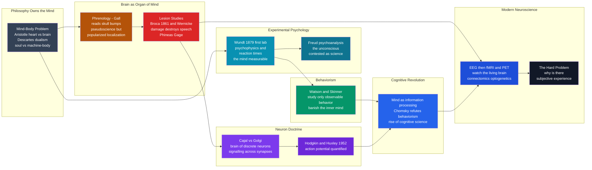

# 🧠 The Neuroscience and Mind Sciences

> [!abstract] TL;DR
> The mind sciences chronicle science's hardest **self-referential** project: turning **thought, perception, and consciousness** — the very things doing the studying — into objects of experiment. The arc runs from millennia of **philosophy** owning "the soul" and the mind-body problem (*is the mind the brain, or something separate?*), through the wrong-but-productive fad of **phrenology**, to the real breakthrough that specific functions **live in specific brain regions** (Broca's lesion studies, Phineas Gage). The **neuron doctrine** (Cajal) revealed the brain's discrete cellular hardware, later made *quantitative* by Hodgkin and Huxley's action potential. Meanwhile **Wundt** founded experimental psychology in 1879, making the mind **measurable** through psychophysics and reaction times; **Freud** made the unconscious culturally central but scientifically contested; **behaviorism** banished the inner mind as unobservable; and the 1950s **cognitive revolution** brought the mind back as **information processing** — mind-as-computation — spawning cognitive science. Modern **brain imaging** (EEG, fMRI, PET) now lets us *watch the living brain think*. Yet the **hard problem of consciousness** — *why is there subjective experience at all?* — still resists, marking the frontier where science, philosophy, and AI meet.

---

## Intuition

**Analogy:** Imagine trying to photograph your own camera *while looking through it* — the instrument you need is the very thing you are trying to capture. That is the predicament of the mind sciences. Every other science studies something *out there*: a falling stone, a cell, a distant galaxy. But when science turns to the mind, the observer and the observed collapse into one. How do you weigh a thought? How do you put a *feeling* on a laboratory bench? How do you run a controlled experiment on **consciousness** when consciousness is what is running the experiment?

For most of history the answer was simply: *you don't.* The mind belonged to **philosophy and religion** — it was "the soul," a topic for argument, not measurement. Making it **empirical** meant finding sneaky, sideways footholds: not measuring "the mind" directly, but measuring things the mind *does* that leave physical traces. How long it takes to press a button (**reaction time**). The smallest change in a light you can *notice* (**psychophysics**). What happens to a person's speech when a specific lump of brain is destroyed (**lesions**). The tiny voltage a single **neuron** fires. The glow of blood flowing to a working brain region (**fMRI**). Each of these is a keyhole. The history of the mind sciences is the story of prying open more and more keyholes — from phrenology's bumps and Freud's couch to a living brain lighting up on a screen — while the biggest question, *why any of this feels like anything from the inside*, stubbornly stays on the far side of the door.

---

## How It Works

### The starting problem: the mind belonged to philosophy

Two ancient disputes framed everything that followed. First, **where does the mind live?** **Aristotle** placed thought and sensation in the **heart**, treating the brain as a mere radiator to cool the blood; the Hippocratic writers and later **Galen** correctly located mind and sensation in the **brain**. Second, and deeper, the **mind-body problem**: *is the mind the same thing as the physical body, or something separate?* In the 17th century **René Descartes** gave the sharpest dualist answer — an immaterial, thinking **soul** interacting with a mechanical, clockwork **body** (he even guessed the pineal gland as their meeting point). Dualism made the mind *special* but also *scientifically untouchable*: if thought is non-physical, no scalpel or instrument can reach it. Making the mind an object of **experiment**, rather than of argument, was the central challenge the next three centuries had to solve.

### The brain becomes the organ of mind

The first move was to tie mind firmly to **brain**, and then to specific **places** in the brain.

1. **Phrenology (Gall, early 1800s).** Franz Joseph Gall proposed that mental "faculties" (benevolence, combativeness, language) sat in distinct brain organs whose size bulged the overlying **skull** — so you could read character from head **bumps**. As a method it was **pseudoscience**; skull shape does not track mental traits. But phrenology planted a revolutionary and ultimately correct seed: that the brain is not a uniform pudding but is **functionally localized** — different parts do different jobs.

2. **Lesion studies (Broca, 1861; Wernicke, 1874).** The real breakthrough came from injury. Paul **Broca** examined a patient who could understand language but could only say "tan"; after death, a lesion sat in a specific left-frontal region — now **Broca's area**. Damage to one small spot destroyed one specific ability: **speech production**. Carl **Wernicke** soon found a different region whose damage wrecked **comprehension**. The lesion method — *destroy a part, see what function disappears* — gave rigorous, replicable evidence that **specific functions map to specific regions**. The case of **Phineas Gage**, whose personality transformed after an iron rod destroyed his frontal lobes, drove home that even *character* is brain-dependent. The mind does its work in physical tissue.

### The neuron doctrine: the brain's hardware

If the brain does the mind's work, *what is the brain made of?* Around 1900, **Camillo Golgi** (whose silver stain first made single cells visible) argued the nervous system was one continuous fused **net**. **Santiago Ramón y Cajal**, using Golgi's own stain, argued the opposite and won: the brain is built of **discrete cells** — **neurons** — that communicate across tiny gaps, later named **synapses**. This is the **neuron doctrine**: the cell is the basic signalling unit of the nervous system. Decades later, **Alan Hodgkin** and **Andrew Huxley** (1952) made it **quantitative**, writing equations for how ion currents generate the **action potential** — the electrical "spike" a neuron fires. The mind now had a physical, *measurable* substrate: a network of electrical cells (see the demo).

### Experimental psychology: the mind made measurable

In **1879**, **Wilhelm Wundt** opened the first psychology **laboratory** in Leipzig and declared psychology an **experimental science independent of philosophy**. His tools measured the mind indirectly: **reaction times** (how long mental operations take) and **psychophysics** — the **Weber-Fechner** laws relating physical **stimulus** intensity to **perceived** sensation (perception grows as the *logarithm* of intensity; see the demo). For the first time, sensation and response yielded **numbers and curves**. Alongside the lab tradition, **Sigmund Freud** built **psychoanalysis** — a sweeping theory of the **unconscious**, dreams, and repression. Its cultural impact was enormous, but its scientific status is contested: critics, above all **Karl Popper**, argued it was **unfalsifiable** — able to explain any outcome after the fact and therefore not testable. Freud's legacy is real but complicated.

### Behaviorism, then the cognitive revolution

Frustrated that introspection was private and unverifiable, **John Watson** and later **B. F. Skinner** launched **behaviorism**: study only **observable behavior** — stimulus, response, **conditioning** — and treat the inner "mind" as an unscientific black box. Rigorous and productive (it built learning theory), it was also **limited**: it could not easily explain language, planning, or mental imagery. In the **1950s–60s** the **cognitive revolution** brought the mind roaring back, now legitimized by a new metaphor: the **computer**. If a machine can store, transform, and process **information**, then so can a mind — the "black box" could be modeled as **information processing**. **Noam Chomsky's** devastating 1959 review of Skinner's *Verbal Behavior* showed behaviorism could not account for the generativity of language. Out of the fusion of psychology, **linguistics**, **artificial intelligence**, neuroscience, and philosophy came **cognitive science**: the mind as **computation**.

### Modern neuroscience and the tools revolution

Finally, instruments let scientists **watch the living brain at work**. **EEG** recorded electrical rhythms from the scalp; **PET** and especially **fMRI** (1990s) imaged blood flow, mapping *which regions activate during which tasks*. Newer tools — **optogenetics** (switching specific neurons on with light), **connectomics** (mapping the full wiring diagram), and **computational neuroscience** — plus large **brain-mapping initiatives**, made neuroscience a major **integrative science** spanning molecules to cognition. Yet one thing resists every instrument: the **hard problem of consciousness** — *why is there subjective experience at all?* We can correlate brain states with reports, but *why* neural activity is accompanied by an inner *felt* quality remains open. The mind sciences advanced enormously and still meet a frontier where science, philosophy, and AI converge.



---

## Key Concepts

### Secondary — the big story
- **Mind-body problem** — the ancient question of whether the mind *is* the brain or something separate; Descartes' **dualism** (soul vs machine-body) is the classic "separate" answer.
- **Localization of function** — different parts of the brain do different jobs. Phrenology guessed it wrongly from skull bumps; lesion studies proved it correctly.
- **The neuron** — the brain is built of billions of tiny electrical **cells** that signal to each other; it is the basic unit of the nervous system.
- **Making the mind measurable** — you cannot weigh a thought, but you can time a reaction and chart how perception changes with stimulus. That sideways trick made psychology a science.
- **Behaviorism vs the cognitive revolution** — first psychology studied only visible **behavior** and banned "the mind"; then the **computer** metaphor let the mind back in as **information processing**.

### Undergraduate — the mechanisms
- **The lesion method** — infer a region's function by observing the deficit its damage produces (Broca's area for speech production, Wernicke's for comprehension). Powerful but correlational.
- **The neuron doctrine** — Cajal's win over Golgi: the nervous system is **discrete cells communicating across synapses**, not a continuous reticulum; the cellular basis of all neural signalling.
- **Psychophysics and the Weber-Fechner law** — perceived intensity scales as the **logarithm** of physical intensity ($S = k \ln(I/I_0)$); the **just-noticeable-difference** is a roughly constant *fraction* of the stimulus (Weber's law). The first quantitative laws of mind.
- **Falsifiability and Freud** — Popper's demarcation critique: a theory that explains *every* outcome (as psychoanalysis seemed to) makes no risky predictions and so fails as science. A case study in the demarcation problem.
- **The computer metaphor** — modeling cognition as symbol manipulation / information processing; the founding move of cognitive science and the bridge to AI.

### Graduate — interpretation and open problems
- **Correlation vs mechanism in imaging** — fMRI shows *where* blood flows during a task (a correlate), not *how* the computation is done; reverse-inference ("region X lit up, therefore the subject felt Y") is a notorious fallacy.
- **The easy problems vs the hard problem** — Chalmers' distinction: explaining *functions* (discrimination, integration, report) is tractable; explaining *why* there is subjective **experience** accompanying them is the "hard problem" that resists functional reduction.
- **Multiple realizability and functionalism** — if mental states are defined by their causal/computational *role*, the same mind could in principle run on neurons or silicon, decoupling psychology from any one substrate.
- **Levels of explanation** — Marr's computational/algorithmic/implementational levels: mind and brain are studied at different, complementary levels, and confusing them (or demanding only one) breeds pseudo-disputes.
- **The recurring self-reference problem** — whether a system can *fully* model itself, and whether mind, brain, and computation are three descriptions of one thing or genuinely distinct, remains the deep open question of the field.

---

## Python Demo

This demo captures the two poles of the mind sciences in one figure. **Part 1** simulates a **leaky integrate-and-fire neuron** — the neuron doctrine made *quantitative*: a cell accumulates input current, leaks charge, and fires a **spike** the instant its voltage crosses threshold, giving the brain's basic unit as a physical electrical device. **Part 2** reproduces the **Weber-Fechner law** of psychophysics — the mind made *measurable*: perceived intensity grows as the **logarithm** of physical stimulus intensity, and the smallest noticeable change is a constant *fraction* of the stimulus. Requires only `numpy` and `matplotlib`.

```python
"""
The two poles of the mind sciences, in code:
  PART 1 -- THE BRAIN AS AN ELECTRICAL DEVICE
     A leaky integrate-and-fire (LIF) neuron: voltage accumulates,
     leaks, and SPIKES when it crosses threshold (the neuron doctrine,
     made quantitative in the spirit of Hodgkin-Huxley).
  PART 2 -- THE MIND MADE MEASURABLE
     The Weber-Fechner law of psychophysics: perceived intensity is the
     LOGARITHM of physical intensity, and the just-noticeable-difference
     is a constant FRACTION of the stimulus (Weber's law).
Requires: numpy, matplotlib
"""
import numpy as np
import matplotlib.pyplot as plt

# =====================================================================
# PART 1: LEAKY INTEGRATE-AND-FIRE NEURON
# =====================================================================
tau_m    = 10.0    # membrane time constant (ms)
V_rest   = -70.0   # resting potential (mV)
V_thresh = -55.0   # firing threshold (mV)
V_reset  = -75.0   # reset potential after a spike (mV)
V_spike  =  20.0   # drawn spike peak (mV), for visualization only
R_m      = 1.0     # membrane resistance (arbitrary units)
dt       = 0.1     # time step (ms)
T        = 200.0   # total duration (ms)

def simulate_lif(I_input):
    """Integrate dV/dt = (-(V - V_rest) + R*I)/tau; spike + reset at threshold.
    Returns the voltage trace and the list of spike times (ms)."""
    steps = int(T / dt)
    V = np.full(steps, V_rest)
    spike_times = []
    for t in range(1, steps):
        dV = (-(V[t-1] - V_rest) + R_m * I_input) * dt / tau_m
        V[t] = V[t-1] + dV
        if V[t] >= V_thresh:      # THRESHOLD CROSSED -> fire a spike
            V[t-1] = V_spike      # draw the spike tip
            V[t]   = V_reset      # reset the membrane
            spike_times.append(t * dt)
    return V, spike_times

time = np.arange(0, T, dt)
V_trace, spikes = simulate_lif(I_input=18.0)
print(f"PART 1  LIF neuron fired {len(spikes)} spikes in {T:.0f} ms "
      f"({len(spikes) / (T/1000):.0f} Hz)")

# F-I curve: firing RATE as a function of input current -> shows a hard
# threshold (no firing until input is strong enough), the signature of a
# neuron as an all-or-none device.
currents = np.linspace(0, 40, 80)
rates = np.array([len(simulate_lif(I)[1]) / (T / 1000.0) for I in currents])
i_thresh = currents[np.argmax(rates > 0)]
print(f"PART 1  Neuron stays silent until input current ~ {i_thresh:.1f} "
      f"(rheobase), then fires faster with stronger input")

# =====================================================================
# PART 2: WEBER-FECHNER PSYCHOPHYSICS
# =====================================================================
I0 = 1.0                       # absolute threshold intensity
k  = 1.0                       # Fechner constant
I  = np.linspace(I0, 100, 500)
S  = k * np.log(I / I0)        # PERCEIVED intensity (Fechner's log law)
weber_fraction = 0.10          # Weber's law: a ~10% change is just noticeable
jnd = weber_fraction * I       # absolute just-noticeable-difference grows with I
print(f"PART 2  Physical intensity x100 -> perceived intensity only x{S[-1]/ (k*np.log(10/I0)):.2f} "
      f"relative to a 10x step: perception COMPRESSES the physical range")

# =====================================================================
# FIGURE
# =====================================================================
fig, (axA, axB, axC) = plt.subplots(1, 3, figsize=(16, 4.8))

# --- Panel A: the neuron's membrane voltage spiking ---
axA.plot(time, V_trace, color="#7c3aed", lw=1.4)
axA.axhline(V_thresh, color="#dc2626", ls="--", lw=1.2, label="firing threshold")
axA.axhline(V_rest,   color="#94a3b8", ls=":",  lw=1.0, label="resting potential")
axA.set_xlabel("time (ms)")
axA.set_ylabel("membrane potential (mV)")
axA.set_title("Brain as electrical device:\nintegrate-and-fire neuron SPIKING")
axA.legend(fontsize=8, loc="upper right")

# --- Panel B: the F-I curve (threshold + gain) ---
axB.plot(currents, rates, color="#6d28d9", lw=2)
axB.axvline(i_thresh, color="#dc2626", ls="--", lw=1.2,
            label="firing threshold (rheobase)")
axB.set_xlabel("input current (arbitrary units)")
axB.set_ylabel("firing rate (Hz)")
axB.set_title("The neuron doctrine made quantitative:\ninput strength -> spike rate")
axB.legend(fontsize=8, loc="upper left")

# --- Panel C: the mind made measurable (Weber-Fechner) ---
axC.plot(I, S, color="#0891b2", lw=2.4, label="perceived  S = k ln(I / I0)")
axC.plot(I, I / I.max() * S.max(), color="#94a3b8", ls="--", lw=1.4,
         label="if perception were linear")
axC.set_xlabel("physical stimulus intensity  I")
axC.set_ylabel("perceived intensity  S")
axC.set_title("Mind made measurable:\nWeber-Fechner logarithmic perception")
axC.legend(fontsize=8, loc="lower right")

plt.tight_layout()
plt.savefig("neuroscience_and_mind_sciences.png", dpi=130)
print("Saved neuroscience_and_mind_sciences.png")
plt.show()
```

Running this prints that the neuron stays **silent** until the input current exceeds a threshold (its *rheobase*), then fires faster as the drive grows — the all-or-none logic Cajal's cells and Hodgkin-Huxley's equations formalized. Panel A shows the sawtooth **spike train** of the membrane voltage climbing to threshold and resetting; panel B shows the **F-I curve** with its hard threshold and rising gain. Panel C shows the psychophysical law: as physical intensity runs from 1 to 100, *perceived* intensity climbs only along a **compressed logarithmic curve** — doubling a dim light is vivid, doubling a bright one is barely noticed. Together they show the field's two triumphs: the **brain** rendered as measurable electrical hardware, and the **mind** rendered as lawful, quantifiable behavior.

---

## Real-World Applications

- **Clinical neuropsychology and neurology** — the lesion logic of Broca and Gage underlies how strokes and tumors are localized from their deficits, and how aphasia, neglect, and amnesia are diagnosed and rehabilitated.
- **Brain-computer interfaces and neural prosthetics** — decoding spike trains and cortical activity to drive robotic limbs or cursors is the neuron doctrine plus computational neuroscience turned into assistive technology.
- **fMRI and cognitive neuroscience research** — imaging maps language, memory, emotion, and decision circuits, guiding neurosurgical planning (avoiding eloquent cortex) and probing psychiatric disorders.
- **Psychophysics in engineering and design** — Weber-Fechner and signal-detection theory set audio loudness scales (decibels), display brightness/contrast, sensory testing, and even how compression codecs discard imperceptible detail.
- **Behaviorist techniques in practice** — conditioning and reinforcement schedules power behavior therapy, animal training, habit-formation apps, and the reward loops engineered into software.
- **AI and cognitive modeling** — the mind-as-computation metaphor seeded artificial neural networks, cognitive architectures, and the whole research program of building and testing computational models of thought.

---

## Common Pitfalls

- **"Phrenology was pure nonsense with nothing to offer."** Its *method* (reading bumps) was pseudoscience, but its *core idea* — functional **localization** — was a genuine and correct advance that framed the lesion studies which followed. Dismissing it wholesale misreads the history.
- **Reading a lesion as a "center."** That damaging region X abolishes function Y does **not** prove Y "lives" only in X; X may be one node in a distributed network, or a relay whose loss disrupts distant areas. Localization is real but rarely as tidy as a single "speech center."
- **Reverse inference from imaging.** "The amygdala lit up, so the subject felt fear" is a fallacy: many states activate a region, so activation does not entail the specific mental state. fMRI shows correlation, not the computation or the experience.
- **Treating Freud as settled science or as worthless.** Psychoanalysis is neither: it was hugely influential and clinically generative, yet much of it is **unfalsifiable** in Popper's sense. Collapsing this nuance in either direction distorts both the science and the history.
- **Confusing behaviorism's rigor with completeness.** Studying only observable behavior was methodologically disciplined but could not explain language, imagery, or planning; mistaking its rigor for a full theory of mind is exactly the error the cognitive revolution corrected.
- **Assuming imaging "solved" consciousness.** Mapping neural *correlates* of consciousness is progress on the "easy" problems; it does not touch the **hard problem** of why there is subjective experience at all. Announcing the mystery closed is premature.
- **Whig history of the mind sciences.** Mocking Aristotle's "mind in the heart" or Descartes' dualism ignores that each was reasonable given its evidence; the same presentism warned against throughout the *History of Science Overview*.

---

## Related Concepts

The dedicated *History of Science* siblings that extend this arc — **Induction, Falsification, and Popper** (the demarcation logic behind the Freud critique), **Pseudoscience and the Demarcation Problem** (where phrenology sits), **The Computing and Information Revolution** (the machine metaphor that fueled the cognitive revolution), and **The Reach and Future of Science** (the still-open hard problem and the limits of self-explanation) — are referenced here in prose because they are not yet written. The wikilinks below point to **verified** notes elsewhere in the vault:

- [[The_Birth_of_Modern_Biology]] — the sibling story of life becoming a science through dissection, the microscope, and the cell; the mind sciences are biology's hardest, latest frontier.
- [[History_of_Science_Overview]] — the entry point situating the mind sciences among the great scientific transformations.
- [[Ancient_and_Prehistoric_Science]] — the Aristotelian/Galenic starting point of the heart-vs-brain and soul debates.
- [[The_Mind_Body_Problem]] — the philosophy-of-mind deep dive on the central question this whole history tries to make empirical.
- [[Dualism_vs_Physicalism]] — Descartes' soul-vs-machine framing and its modern physicalist rivals.
- [[Descartes_and_Rationalism]] — the thinker whose dualism made the mind vivid but scientifically untouchable.
- [[Aristotle]] — the natural philosopher who placed mind in the heart and framed the pre-modern view.
- [[Consciousness_and_the_Hard_Problem]] — the persistent mystery of subjective experience that still resists neuroscience.
- [[Functionalism_and_Machine_Minds]] — the mind-as-computation thesis that underwrote the cognitive revolution and AI.
- [[Popper_and_Falsification]] — the demarcation criterion behind the standard scientific critique of psychoanalysis.
- [[Neuron_Structure_and_Function]] — the modern anatomy of Cajal's discrete signalling cell.
- [[Action_Potentials_and_Resting_Membrane_Potential]] — the electrical spike the Python demo simulates.
- [[Hodgkin_Huxley_Model_and_Computational_Neurons]] — the equations that made the neuron doctrine quantitative.
- [[Language_and_the_Brain]] — the modern neuroscience of Broca's and Wernicke's areas.
- [[Neuroimaging_Methods]] — EEG, PET, and fMRI, the tools that let us watch the living brain.
- [[Consciousness_and_Neural_Correlates]] — the search for the brain basis of awareness.
- [[History_and_Schools_of_Psychology]] — the psychology-vault survey from Wundt through behaviorism to cognitivism.
- [[Sensation_and_Perception]] — the psychophysics (Weber-Fechner, signal detection) that made the mind measurable.
- [[Classical_Conditioning]] — the Pavlovian half of the behaviorist program.
- [[Operant_Conditioning]] — Skinner's reinforcement learning, behaviorism's core method.
- [[Psychodynamic_Theories]] — Freud's theory of the unconscious and its contested legacy.
- [[The_Cognitive_Revolution]] — the cognitive-science-vault deep dive on the mind's return as information processing.
- [[Computational_Theory_of_Mind]] — the formal thesis that cognition is computation.
- [[Cognitive_Science_Overview]] — the interdisciplinary field born from the revolution.

---

## Review Questions

**Secondary**
1. The note says the mind sciences face a uniquely hard problem: "the instrument you need is the very thing you are trying to capture." Explain what this means, and give two concrete "keyhole" methods scientists used to study the mind *indirectly* rather than measuring it head-on.

**Undergraduate**
2. Phrenology (reading skull bumps) was pseudoscience, yet historians credit it with a real contribution. What correct idea did it popularize, and how did **Broca's** lesion studies turn that idea from a fad into rigorous science? What does the lesion method let you infer, and what can it *not* prove?

**Graduate**
3. Behaviorism banished "the mind" as unobservable; the cognitive revolution brought it back as "information processing"; modern fMRI now images the brain during thought. Yet Chalmers argues none of this touches the **hard problem** of consciousness. Explain the distinction between the "easy" problems and the "hard" problem, and assess whether *any* amount of neural correlation could, in principle, close it — or whether the mind sciences are structurally unable to fully explain the one thing doing the explaining.

---

## Sources

- Finger, S. (1994). *Origins of Neuroscience: A History of Explorations into Brain Function*. Oxford University Press.
- Gardner, H. (1985). *The Mind's New Science: A History of the Cognitive Revolution*. Basic Books.
- Boring, E. G. (1950). *A History of Experimental Psychology* (2nd ed.). Appleton-Century-Crofts.
- Chalmers, D. J. (1996). *The Conscious Mind: In Search of a Fundamental Theory*. Oxford University Press.
- Kandel, E. R., et al. (2021). *Principles of Neural Science* (6th ed.), historical introduction. McGraw-Hill.
- [History of neuroscience (Wikipedia)](https://en.wikipedia.org/wiki/History_of_neuroscience)

---

#history-of-science #neuroscience #history-of-psychology #cognitive-revolution #brain
