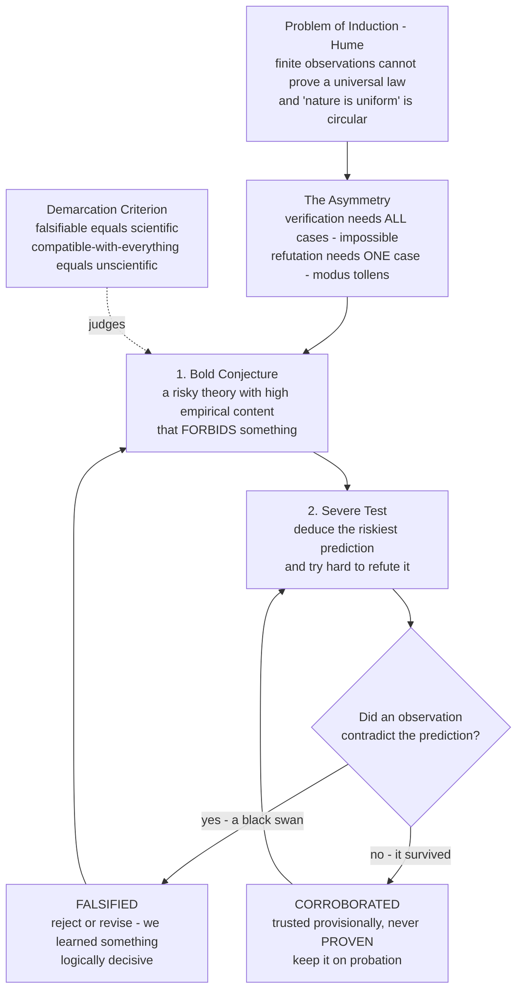

# 🦢 Induction, Falsification, and Popper

> [!abstract] TL;DR
> No matter how many white swans you see, you can never *prove* the law "all swans are white" — but a **single black swan** refutes it forever. This **logical asymmetry** between confirmation and refutation is the seed of **Karl Popper's** philosophy of science. Faced with **David Hume's** devastating **problem of induction** — that no pile of confirming instances can ever justify a universal law — Popper's move was to give up on *proving* theories at all. Real science, he argued, advances by **conjecture and refutation**: it proposes **bold, risky theories** that *forbid* things and then tries its hardest to *break* them through **severe tests**. A theory is **scientific** only if it is **falsifiable** — if some possible observation could prove it wrong. What survives our fiercest attempts to kill it is never *verified*, only **corroborated**: trusted, provisionally, for now.

---

## Intuition

**Analogy:** Suppose you want to establish the law *"all swans are white."* You travel the world counting swans. After one thousand white swans you feel confident; after a million you feel almost certain. But here is the trap Hume pointed out: **you can never finish counting.** There is always the next swan, in the next lake, that you have not seen. No finite tally, however enormous, *logically forces* the universal claim to be true — the very next swan could be black. Confirmation can pile up forever and still fall infinitely short of *proof*.

Now flip it around. To *refute* the law, you do not need to see every swan. You need **one black swan.** A single counterexample settles the matter with total logical finality: "all swans are white" is now false, and no amount of white swans can rescue it. This is the asymmetry that changes everything. **Verification of a universal law is impossible; refutation of it takes just one case.** Popper's radical suggestion was to build the whole idea of science around the strong side of that asymmetry: don't waste effort trying to *confirm* your theories — that is a dead end. Instead make your theories **bold and precise enough that reality could smash them**, then go looking for the black swan. The theory that stubbornly refuses to die under your best attacks has earned your provisional trust — not because it is proven, but because it has *survived*.

---

## How It Works

### The problem of induction (Hume)

Science reasons **inductively**: it observes a finite number of cases and leaps to a **universal law**. *"Every observed piece of copper conducts electricity, therefore all copper conducts electricity."* *"The sun has risen every morning, therefore it will rise tomorrow."* This inference — from *some observed* to *all, including the unobserved future* — is the engine of every scientific generalization.

**David Hume** (1739) noticed that this engine has no logical foundation. Two problems:

1. **No finite set of instances entails a universal claim.** "All observed X are Y" simply does not logically imply "all X are Y." The conclusion says more than the premises; the argument is *not deductively valid*. Adding more instances never closes the gap — a million confirmations is still not *all* cases.
2. **The rescue is circular.** You might reply: "Induction works because **nature is uniform** — the future resembles the past." But *how do you know nature is uniform?* Only from experience: it has been uniform *so far*. That is itself an inductive argument — using induction to justify induction. The justification **presupposes what it sets out to prove.**

The verdict is stark: **the core reasoning of empirical science cannot be logically justified.** This is not a minor technicality; it is a hole beneath the entire empiricist project (see [[Scientific_Method_and_Empiricism]]).

### The verification trap

The **logical positivists** of the early twentieth century tried to make "scientific" mean **verifiable** — a statement is meaningful and scientific if it can be confirmed by observation. But Hume's problem sinks this criterion. A **universal law** ("all swans are white," "all electrons have charge *e*") can *never* be conclusively verified, because verification would require checking every case, everywhere, for all time — including the future. Confirmation can nudge a law's **probability** upward, but it can never reach **certainty**. Verification, as a criterion for science, is unreachable.

### Popper's move: exploit the asymmetry

**Karl Popper** (*The Logic of Scientific Discovery*, 1934) saw that Hume's problem is fatal only if science is in the business of *proving* things. So stop trying. Popper grabbed the **logical asymmetry** between verification and falsification:

- To **verify** "all swans are white" you need to check *every* swan — impossible.
- To **falsify** it you need *one* non-white swan — and the refutation is **deductively valid**. The rule is **modus tollens**: *if the theory says all swans are white, and here is a black swan, then the theory is false.* No induction required. The logic is airtight.

Refutation is **logically decisive** where confirmation never can be. Science, Popper argued, should be reorganized around the operation that *actually works*.

### Conjecture and refutation

Popper's picture of scientific method:

1. **Conjecture boldly.** Propose a theory with **high empirical content** — one that says a great deal, forbids a great deal, and sticks its neck out with **risky, precise predictions.** Where the conjecture comes from (a dream, a guess, an analogy) does not matter; there is no "logic of discovery."
2. **Test severely.** Deduce the theory's riskiest consequences and *try to refute them.* Design the experiment most likely to produce a black swan. The best test is the one the theory might *fail*.
3. **Eliminate error.** If a test refutes the theory, discard or revise it — you have *learned* something definite. If the theory *survives*, it is not proven true; it is **corroborated** — it has withstood testing *so far*.
4. **Repeat.** Science is a **self-critical, error-eliminating** loop. *"We learn from our mistakes."* Knowledge grows not by accumulating confirmations but by killing off falsehoods and keeping the survivors on probation.

### Falsifiability as the criterion of demarcation

This gives Popper his famous answer to the **demarcation problem** — *what separates science from non-science?* A theory is **scientific if and only if it is falsifiable**: it must **forbid** some observable state of affairs, so that *some possible experiment could prove it wrong*.

Popper's motivating contrast:

- **Einstein's general relativity** made a **risky prediction**: starlight passing the Sun would bend by *exactly 1.75 arcseconds* (double the Newtonian value). It *forbade* every other value. Eddington's 1919 eclipse could have refuted it outright — instead it survived. **That risk is the mark of science.**
- **Marxist history** and **Freudian psychoanalysis** struck Popper as different in kind. They seemed able to *explain any outcome whatsoever.* Whatever a patient does confirms the theory; whatever history does, the theory accommodates. A theory **compatible with every possible observation forbids nothing** — and a theory that forbids nothing predicts nothing, tests nothing, risks nothing. *"A theory that explains everything explains nothing."* Such theories are, for Popper, **unscientific** — not necessarily false or worthless, but not *science*.

**Empirical content = how much a theory forbids = its degree of falsifiability.** The bolder and more falsifiable a theory (while remaining unfalsified), the *better* it is — because it says more and risks more. Popper's chief villain is the **ad hoc rescue**: patching a refuted theory with excuses that *reduce* its content and shield it from future tests. That is the move that turns a science into a pseudoscience.

### Flow / Architecture



---

## Key Concepts

**Secondary (foundations)**
- **Induction** — reasoning from particular observations to a general rule; the everyday engine behind every scientific law.
- **The black swan** — the single counterexample that refutes a universal claim; the emblem of Popper's asymmetry.
- **Falsifiable** — a claim is falsifiable if some possible observation could show it to be false. "It will rain here tomorrow" is falsifiable; "it will rain somewhere someday" is not.
- **Conjecture and refutation** — Popper's slogan for how science works: guess boldly, then try to prove yourself wrong.

**Undergraduate (mechanism)**
- **The problem of induction (Hume)** — no finite run of confirming instances *logically entails* a universal law, and the appeal to nature's uniformity is circular; empirical science has no deductive foundation.
- **Verification vs falsification asymmetry** — universal laws cannot be verified (would need infinitely many cases) but *can* be falsified by one counterexample via **modus tollens**; refutation is deductively valid, confirmation is not.
- **Demarcation criterion** — falsifiability marks the boundary between science and non-science; a theory must *forbid* something observable.
- **Corroboration** — the status of a theory that has passed severe tests: *not* proven, *not* even shown probable, merely "survived so far." A deliberately weaker notion than "confirmed."
- **Empirical content / boldness** — how much a theory forbids; the more it forbids (and survives), the more informative and the better it is.

**Graduate (nuance and critique)**
- **The Duhem-Quine thesis** — you cannot test a hypothesis *in isolation*. Any prediction relies on **auxiliary assumptions** (instrument theory, background conditions). When a test fails, logic alone does not tell you *which* assumption to blame — so falsification is never as clean as naive Popper suggests; you can always save the core hypothesis by revising an auxiliary.
- **Naive vs sophisticated falsificationism** — the naive rule "reject a theory at the first anomaly" simply does not match real science, which tolerates anomalies. Popper's later work and Lakatos's **research programmes** soften the rule.
- **The Kuhnian objection** — historically, scientists do *not* abandon a paradigm at the first refuting result; they treat anomalies as puzzles to be solved, and switch theories only in a **crisis** (see [[Kuhn_and_Scientific_Revolutions]]).
- **Does confirmation really not matter?** — we clearly *do* place more trust in well-tested theories; a purely negative epistemology struggles to explain why corroborated theories are rational to *rely on* (e.g., in engineering). **Bayesian** accounts (see [[Bayesian_Reasoning]]) recover graded confirmation that Popper rejected.
- **Corroboration vs probability** — Popper insisted corroboration is *not* a probability and that bold (low-prior) theories are *better*, directly opposing the Bayesian and inductivist instinct that we should believe the *more probable* hypothesis.

---

## Python Demo

Two experiments in one figure. **(a)** We simulate a rational agent accumulating **white-swan observations** and watch its **Bayesian confidence** in the universal law "all swans are white" climb *toward* certainty but **never reach it** — then a **single black swan** collapses that confidence to exactly zero. This is the verification/falsification **asymmetry** made quantitative. **(b)** We contrast a **falsifiable** theory (a sharp, risky prediction that some observations would *contradict*) with an **unfalsifiable** one (compatible with *any* outcome), showing why **falsifiability equals empirical content**.

```python
# Popper's asymmetry + falsifiability, made concrete.
# (a) Bayesian confidence in "all swans are white" rises toward but never reaches 1
#     under white swans, then collapses to 0 on one black swan.
# (b) A falsifiable theory forbids most outcomes; an unfalsifiable one forbids nothing.
import numpy as np
import matplotlib.pyplot as plt

# ----- (a) The swan model -----------------------------------------------------
# Rival hypotheses about theta = the fraction of swans that are white.
# theta = 1.00 is the UNIVERSAL LAW "all swans are white".
# theta < 1.00 are alternatives ("some swans are not white").
thetas = np.array([0.50, 0.70, 0.90, 1.00])
prior  = np.ones(len(thetas)) / len(thetas)      # flat prior over hypotheses

def bayes_update(post, saw_white):
    # P(white | theta) = theta ;  P(non-white | theta) = 1 - theta
    like = thetas if saw_white else (1.0 - thetas)
    post = post * like
    return post / post.sum()

N_white = 60
post = prior.copy()
confidence = []                                   # P(theta = 1.0) = P("all swans white")
for _ in range(N_white):
    post = bayes_update(post, saw_white=True)
    confidence.append(post[-1])

# ...then a SINGLE black swan arrives:
post_after_black = bayes_update(post, saw_white=False)
conf_after_black = post_after_black[-1]           # exactly 0.0

confidence = np.array(confidence)
print(f"After {N_white} white swans, confidence in 'all swans white' = {confidence[-1]:.6f}")
print(f"(never reaches 1.0 -- verification is impossible)")
print(f"After 1 black swan, confidence collapses to = {conf_after_black:.6f}")
print(f"(one refutation is logically decisive)")

# ----- (b) Falsifiable vs unfalsifiable theory --------------------------------
# Observation axis: e.g. the deflection of starlight near the Sun, in arcseconds.
x = np.linspace(-0.5, 3.0, 500)

# Falsifiable theory (Einstein 1919): predicts a SHARP value ~1.75", forbids the rest.
pred, band = 1.75, 0.30
allowed_falsifiable = ((x > pred - band) & (x < pred + band)).astype(float)

# Unfalsifiable theory: "the light will bend by some amount" -> allows EVERYTHING.
allowed_unfalsifiable = np.ones_like(x)

emp_content_f = 1.0 - allowed_falsifiable.mean()    # fraction of outcomes FORBIDDEN
emp_content_u = 1.0 - allowed_unfalsifiable.mean()  # = 0
print(f"\nEmpirical content (fraction of outcomes forbidden):")
print(f"  falsifiable theory   = {emp_content_f:.2f}  (risks a lot -> scientific)")
print(f"  unfalsifiable theory = {emp_content_u:.2f}  (forbids nothing -> unscientific)")

# ----- Visualize --------------------------------------------------------------
fig, ax = plt.subplots(2, 2, figsize=(13, 9))

# Panel 1: the asymmetry as a trajectory (rise, then collapse).
steps = np.arange(1, N_white + 1)
ax[0, 0].plot(steps, confidence, color="tab:blue", lw=2, label="confidence under white swans")
ax[0, 0].axhline(1.0, color="gray", ls=":", lw=1)
ax[0, 0].text(2, 1.005, "certainty (1.0) -- never reached", fontsize=9, color="gray")
ax[0, 0].scatter([N_white + 1], [conf_after_black], color="red", s=120, zorder=5,
                 marker="X", label="one BLACK swan -> collapse to 0")
ax[0, 0].annotate("verification: rises but\nnever reaches 1",
                  xy=(N_white, confidence[-1]), xytext=(18, 0.55),
                  arrowprops=dict(arrowstyle="->", color="tab:blue"), fontsize=9)
ax[0, 0].annotate("refutation:\nmodus tollens, instant",
                  xy=(N_white + 1, 0.0), xytext=(28, 0.2),
                  arrowprops=dict(arrowstyle="->", color="red"), fontsize=9)
ax[0, 0].set_xlabel("number of swans observed")
ax[0, 0].set_ylabel("P( 'all swans are white' )")
ax[0, 0].set_title("(a) The confirm-vs-refute asymmetry")
ax[0, 0].set_ylim(-0.05, 1.1)
ax[0, 0].legend(loc="center right", fontsize=8)
ax[0, 0].grid(alpha=0.3)

# Panel 2: the asymmetry as two bars -- max confirmation vs one refutation.
ax[0, 1].bar(["millions of\nwhite swans", "one\nblack swan"],
             [confidence[-1], 1.0], color=["tab:blue", "tab:red"])
ax[0, 1].set_ylabel("logical certainty attained")
ax[0, 1].set_title("(b) You cannot PROVE a law by piling up confirmations,\n"
                   "but ONE counterexample DISPROVES it")
ax[0, 1].set_ylim(0, 1.15)
ax[0, 1].text(0, confidence[-1] + 0.03, "< 1: never certain", ha="center", fontsize=9)
ax[0, 1].text(1, 1.02, "= 1: certain it is FALSE", ha="center", fontsize=9)
ax[0, 1].grid(alpha=0.3, axis="y")

# Panel 3: a FALSIFIABLE theory -- narrow allowed band, most outcomes forbidden.
ax[1, 0].fill_between(x, allowed_falsifiable, color="tab:green", alpha=0.35,
                      label="outcomes the theory ALLOWS")
ax[1, 0].axvline(pred, color="tab:green", ls="--", label="risky prediction ~1.75 arcsec")
ax[1, 0].scatter([0.3], [0.5], color="red", marker="X", s=140,
                 zorder=5, label="a possible REFUTING observation")
ax[1, 0].scatter([1.61], [0.5], color="black", marker="o", s=80,
                 zorder=5, label="actual 1919 result -> corroborated")
ax[1, 0].set_title(f"(c) FALSIFIABLE theory  (forbids {emp_content_f:.0%} of outcomes)")
ax[1, 0].set_xlabel("possible observation (starlight deflection, arcsec)")
ax[1, 0].set_yticks([])
ax[1, 0].set_ylim(0, 1.2)
ax[1, 0].legend(loc="upper right", fontsize=8)

# Panel 4: an UNFALSIFIABLE theory -- allows everything, forbids nothing.
ax[1, 1].fill_between(x, allowed_unfalsifiable, color="tab:red", alpha=0.30,
                      label="outcomes the theory ALLOWS = everything")
ax[1, 1].scatter([0.3], [0.5], color="red", marker="X", s=140, zorder=5,
                 label="'refuting' observation -- but it's ALLOWED too")
ax[1, 1].set_title(f"(d) UNFALSIFIABLE theory  (forbids {emp_content_u:.0%} of outcomes)")
ax[1, 1].set_xlabel("possible observation (any value whatsoever)")
ax[1, 1].set_yticks([])
ax[1, 1].set_ylim(0, 1.2)
ax[1, 1].legend(loc="upper right", fontsize=8)

plt.tight_layout()
plt.savefig("popper_asymmetry_and_falsifiability.png", dpi=120)
print("\nSaved figure: popper_asymmetry_and_falsifiability.png")
```

Running this shows the whole thesis in one image: **(a)** confidence in the universal law climbs steadily as white swans accumulate but *asymptotes below 1.0* — induction can never close the gap — then plunges to exactly **0** the instant a black swan appears; **(b)** the two-bar summary that you cannot *prove* a law no matter how much confirmation you gather, yet **one** counterexample *disproves* it with certainty; **(c)** the falsifiable theory allows only a narrow band of outcomes and *forbids the rest* (high empirical content, so a stray observation could kill it), while **(d)** the unfalsifiable theory allows *everything*, forbids nothing, risks nothing, and can never be refuted — Popper's diagnosis of a pseudoscience that "explains everything and predicts nothing."

---

## Real-World Applications

- **The 1919 Eddington eclipse.** General relativity's forbidden-everything-but-1.75-arcseconds prediction is Popper's textbook case of a genuine scientific risk. Newton predicted half as much; either could have failed. The result corroborated Einstein — and became the model of a **bold conjecture surviving a severe test.**
- **Clinical trials and the null hypothesis.** The **null-hypothesis significance test** is falsificationist in spirit: you do not "prove" a drug works; you set up a null that the data can **reject**. Pre-registration and stopping rules exist precisely to stop researchers from *ad hoc* rescuing a favored hypothesis after the fact.
- **Detecting pseudoscience.** Popper's criterion remains the front-line diagnostic against **astrology, conspiracy theories, and "unfalsifiable" claims**: ask *what observation would prove this wrong?* If the answer is "nothing could," it is not doing science. Courts (e.g., *McLean v. Arkansas*, 1982) have invoked falsifiability to distinguish science from creationism.
- **Software and engineering testing.** You cannot *prove* a program correct by running passing test cases (verification is unreachable), but one failing test **falsifies** correctness — the exact asymmetry Dijkstra summarized as *"testing shows the presence, not the absence, of bugs."*
- **The scientist's self-image.** More than any competing account, falsificationism shaped how working scientists *narrate their own method* — the ethos of "try to disprove your own hypothesis," conflict-of-interest disclosure, and prizing risky predictions over safe ones.

---

## Common Pitfalls

- **Confusing "unfalsifiable" with "false" or "meaningless."** Popper's point is about *demarcation*, not truth or value. A metaphysical claim can be unfalsifiable yet meaningful, even fruitful — it just is not (yet) *science*.
- **Naive falsificationism — abandoning a theory at the first anomaly.** Real science tolerates anomalies for years (the anomalous perihelion of Mercury, dark-matter discrepancies). Treating every failed prediction as an instant refutation both misdescribes history and would leave us with no theories at all.
- **Ignoring the Duhem-Quine thesis.** Because predictions depend on **auxiliary assumptions**, a failed test never points cleanly at *the* hypothesis. You can always blame the apparatus, a background condition, or an auxiliary — so "clean" falsification is a logical ideal, not a lab reality.
- **The ad hoc rescue.** The subtle failure mode Popper warned against: saving a refuted theory by adding excuses that **shrink its empirical content** ("the psychic's powers vanish when skeptics watch"). Each patch makes the theory forbid *less* — the slide from science to pseudoscience.
- **Overreach against confirmation.** Insisting confirmation is *worthless* clashes with obvious practice: we build bridges on corroborated theories precisely because they are well-tested. Bayesian confirmation theory recovers the graded trust Popper's austere account denies.
- **Treating "corroborated" as "proven."** Popper is emphatic that a surviving theory is *never* established as true or even probable — only "not yet refuted." Forgetting this collapses his position back into the inductivism he rejected.

---

## Related Concepts

- [[Popper_and_Falsification]] — the Philosophy-vault companion; the systematic philosophical treatment of the criterion this note frames historically.
- [[The_Problem_of_Induction]] — Hume's challenge in full; the wound Popper's whole program is a response to.
- [[Kuhn_and_Scientific_Revolutions]] — the great counter-account: science does *not* fall to single refutations but shifts by **paradigm** in a crisis; the main historical critique of naive falsificationism.
- [[Scientific_Realism]] — if theories are only ever "corroborated," never proven, in what sense are our best theories *true*? Popper was a realist who thought we approach truth without ever certifying arrival.
- [[Explanation_and_Laws_of_Nature]] — what a "universal law" is, the very thing induction reaches for and falsification tests.
- [[Scientific_Method_and_Empiricism]] — the HoS sibling on Bacon and Galileo; falsificationism is the twentieth-century refinement of that method's self-correcting loop.
- [[History_of_Science_Overview]] — the map of the vault this note sits in.
- [[Inductive_Logic]] — the formal reasoning whose limits Hume exposed and Popper tried to route around.
- [[Bayesian_Reasoning]] — the rival, *confirmation-based* epistemology powering this note's swan demo; recovers the graded belief Popper denied.
- [[Abductive_Reasoning_and_Inference_to_Best_Explanation]] — the "inference to the best explanation" alternative to both pure induction and pure falsification.
- [[Scientific_Reasoning_and_Method]] — the applied critical-thinking treatment of hypothesis testing, confirmation, and falsification.
- [[Rationalism_vs_Empiricism]] — the epistemological backdrop; Popper is often read as sidestepping the empiricist reliance on induction altogether.
- [[Skepticism]] — Hume's inductive skepticism is a special case of the broader skeptical tradition.
- [[Logical_Fallacies_Overview]] — "unfalsifiable" and "explains everything" claims connect to informal fallacies like unfalsifiability and moving the goalposts.

*Sibling History-of-Science notes referenced in prose — Philosophy of Science Overview, Kuhn: Paradigms and Scientific Revolutions, Lakatos, Feyerabend and Beyond, Scientific Realism and Its Critics, Pseudoscience and the Demarcation Problem, and The Reach and Future of Science — are planned for this vault (Section 05) but not yet written; the Philosophy-vault notes above cover the same ground for now.*

---

## Review Questions

**Secondary**
1. You have seen ten thousand white swans and no black ones. Explain, using the swan example, why this does **not** prove that "all swans are white," yet a single black swan **would** disprove it. What is this difference called?

**Undergraduate**
2. Popper claimed a theory is scientific only if it is **falsifiable**. Take two example claims — one from physics and one you consider pseudoscientific — and for each state *what observation would prove it wrong.* Use your answers to explain what Popper meant by a theory's **empirical content** and why "explains everything" is a criticism, not a compliment.

**Graduate**
3. The **Duhem-Quine thesis** says a hypothesis is never tested in isolation, and **Kuhn** showed scientists rarely abandon a paradigm at the first anomaly. Do these objections *refute* falsificationism, or merely force a more sophisticated version? In your answer, distinguish naive from sophisticated falsificationism, explain why a Bayesian would say confirmation *does* matter, and assess whether "corroboration without confirmation" is a coherent basis for trusting scientific theories in practice.

---

## Sources

- Popper, Karl. *The Logic of Scientific Discovery* (1934 / English 1959). — The founding statement of falsifiability and the demarcation criterion.
- Popper, Karl. *Conjectures and Refutations: The Growth of Scientific Knowledge* (1963). — The Marxism/Freud vs Einstein contrast and "bold conjectures, severe tests."
- Hume, David. *An Enquiry Concerning Human Understanding* (1748), Section IV. — The original problem of induction.
- Thornton, Stephen. "Karl Popper." *Stanford Encyclopedia of Philosophy* (2023). — https://plato.stanford.edu/entries/popper/
- Vickers, John. "The Problem of Induction." *Stanford Encyclopedia of Philosophy* (2022). — https://plato.stanford.edu/entries/induction-problem/

---

#history-of-science #popper #falsification #problem-of-induction #demarcation
