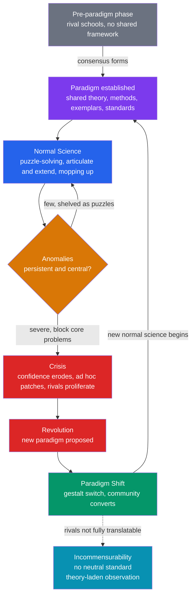

# 🔄 Kuhn, Paradigms, and Scientific Revolutions

> [!abstract] TL;DR
> In *The Structure of Scientific Revolutions* (1962), **Thomas Kuhn** — a physicist-turned-historian — argued from the actual **history** of science that science does *not* advance by steady, cumulative accumulation of truths. Instead it alternates long stretches of **normal science** (routine puzzle-solving inside an accepted **paradigm**) with rare, discontinuous **revolutions** in which one paradigm is *replaced* by another. Anomalies pile up, confidence cracks into **crisis**, and the community undergoes a **gestalt switch** to a new worldview. His most radical claim — **incommensurability** — holds that rival paradigms use terms differently, define problems differently, and share no neutral standard to judge between them, so scientists in different paradigms in a real sense "live in different worlds." Grounded in real cases (Copernican, chemical, relativity, quantum, plate tectonics), it became one of the most cited academic works ever — and made "paradigm shift" a household phrase.

---

## Intuition

**Analogy:** We like to imagine science as a steady climb up a mountain toward truth, each generation laying another brick on a growing edifice — Newton on Galileo, Einstein on Newton, ever upward, never demolishing what came before. Kuhn shattered that picture. Real science, he argued, spends *most* of its time doing routine housekeeping inside an accepted worldview: solving well-defined puzzles the way you'd solve a crossword, confident the answers exist. Then, slowly, clues stop fitting. The anomalies pile up until the whole grid has to be thrown out and re-drawn — a **crisis**, then a **revolution**. And here is the disorienting part: after the switch, scientists don't merely *know more*. They **see the world differently**, the way you can stare at the duck-rabbit drawing and suddenly the duck flips into a rabbit — same ink, different animal. The old view and the new one may not even be fully translatable into each other.

That flip — not a smoother climb but a sudden reframing of what you are even looking at — is the heart of Kuhn's account of how science actually changes.

---

## How It Works

Kuhn was trained as a physicist, but writing a history of early thermodynamics and reading Aristotle's physics on its own terms convinced him that the standard story — science as the patient, logical accumulation of facts favored by both the **logical positivists** and by [[Popper_and_Falsification|Popper]]'s falsificationism — simply did not match what historians found on the page. Science, he claimed, moves in a **cycle**, and most of that cycle is *not* about testing fundamentals at all.

### The Kuhnian cycle

1. **Pre-paradigm phase.** A young field is a babble of competing schools, each with its own facts, methods, and metaphysics, with no shared framework. Fact-gathering is nearly random because there is no agreement on what counts as relevant. (Optics before Newton; the study of electricity before Franklin.)
2. **A paradigm is established.** One achievement is so compelling that it wins over the community and becomes the shared framework. Now everyone plays the same game.
3. **Normal science.** With fundamentals settled, effort turns to **puzzle-solving** — articulating and extending the paradigm, refining constants, matching theory to observation more precisely. This is *conservative by design*: a scientist who fails to solve a puzzle blames herself, not the paradigm. Kuhn called it "mopping up." It is cumulative, productive, and deep — precisely *because* it does not re-litigate foundations. See [[Scientific_Institutions_and_Societies]] for how training and journals enforce this.
4. **Anomalies accumulate.** Some puzzles resist. A few stubborn ones are shelved indefinitely. But when anomalies are **persistent, central, and block practically urgent work**, they can no longer be ignored — Mercury's precessing perihelion under Newtonian gravity, the ultraviolet catastrophe in classical radiation theory, the matching coastlines and fossil beds across the Atlantic that fixed-continent geology could not explain.
5. **Crisis.** Confidence erodes. Previously taboo foundational debate revives. Ad hoc patches proliferate. Rival proposals multiply. The paradigm is strained near breaking.
6. **Revolution / paradigm shift.** A crisis resolves when a new paradigm *replaces* the old — not by a single knockdown proof but by a mix of superior puzzle-solving promise and community persuasion. Kuhn describes it as a **gestalt switch** or even a "conversion." Old scientists often never convert; the field advances, in Planck's grim phrase, "one funeral at a time." A new normal science then begins, and the cycle repeats.

### Paradigm, incommensurability, and theory-laden observation

Three concepts do the real work.

- **Paradigm** — Kuhn's central and famously slippery idea (one critic counted ~21 distinct uses). At its broadest it is a **disciplinary matrix**: the whole shared apparatus of a community — laws, models, instruments, standards, values, and metaphysical commitments. At its most concrete it is an **exemplar**: the canonical worked problem-solutions (the inclined plane, the pendulum) that students absorb and then reason by resemblance to. A paradigm shapes what questions are legitimate, what counts as data, and even what scientists *perceive*.
- **Theory-laden observation** — there is no pure, neutral "seeing." What a scientist observes is shaped by the paradigm. Priestley, working in the **phlogiston** framework, made oxygen but *saw* "dephlogisticated air"; Lavoisier, in the emerging **oxygen** framework, saw the same jar of gas as an element supporting combustion. Same apparatus, same reading — different fact. This directly undermines the empiricist dream of theory-neutral observation that underwrites naive [[Scientific_Method_and_Empiricism|empiricism]].
- **Incommensurability** — Kuhn's most radical and contested claim: rival paradigms have "no common measure." Their key terms shift meaning ("mass" is frame-invariant in Newton, energy-and-frame-dependent in Einstein), they rank problems and virtues differently, and there is no paradigm-neutral algorithm to decide between them. Theory choice therefore involves **judgment, persuasion, and shared values** — accuracy, scope, simplicity, fruitfulness, consistency — not logic and evidence alone. Which is why he said adherents of different paradigms "practice their trades in different worlds."



The picture is **cyclical and punctuated**, not a smooth ramp. Progress *within* a paradigm is real and fast; progress *across* paradigms is a rupture in which some old questions, achievements, and even ways of seeing are lost even as new ones are gained.

---

## Key Concepts

### Secondary Level
- **Paradigm** — the whole shared framework (ideas, methods, standard examples) a scientific community works inside, like the agreed rules of a game.
- **Normal science** — the everyday work of solving puzzles *within* the accepted framework, not questioning it.
- **Anomaly** — a result the current framework cannot explain (like Mercury's odd orbit under Newton's gravity).
- **Paradigm shift** — a revolution where the old framework is thrown out and replaced, changing how scientists see the world (geocentric to heliocentric, Newton to Einstein).

### Undergraduate Level
- **Disciplinary matrix vs exemplar** — the two main senses of "paradigm": the broad shared apparatus of a field, and the concrete textbook problem-solutions students learn from and reason by analogy to.
- **Crisis** — the phase when anomalies become numerous and central, confidence in the paradigm loosens, and foundational debate (normally taboo) revives.
- **Theory-laden observation** — the claim that what one *observes* is shaped by one's paradigm, so there is no neutral, framework-free "fact" (Priestley's "dephlogisticated air" vs Lavoisier's "oxygen").
- **Gestalt switch** — Kuhn's model of conversion: like the duck-rabbit flip, the community suddenly *reorganizes* the same phenomena under a new framework rather than deriving the new view step-by-step.
- **Kuhn vs Popper** — where [[Popper_and_Falsification|Popper]] says good scientists should *try to refute* their theory, Kuhn says normal scientists *presuppose* it, and that "dogmatism" is functional — it lets a field drill deep.

### Graduate Level
- **Incommensurability, three strands** — *methodological* (no paradigm-neutral rule ranks theories), *semantic* (key terms are not fully inter-translatable across paradigms), *perceptual* (adherents literally see different things). Post-1969 Kuhn softened this to *local* incommensurability of a few interconnected terms.
- **The rationality debate** — the 1965 London confrontation with Popper, and the reactions of Lakatos (research programmes with a protected *hard core* and a *progressive vs degenerating* criterion) and Feyerabend ("*anything goes*"), fought over whether Kuhn had made theory choice *irrational*.
- **The sociological turn** — by locating theory choice in community judgment and shared values, Kuhn opened the door to the sociology of scientific knowledge and the "Strong Programme" (Bloor, Barnes) — a reading he resisted, insisting reasons still governed choice even if they underdetermined it. See [[Sociology_of_Knowledge_and_Science]].
- **Threat to convergent realism** — if paradigms are incommensurable and revolutions discontinuous, is science *converging on truth* or just getting better at puzzle-solving? This feeds the "pessimistic meta-induction" against [[Scientific_Realism|scientific realism]].
- **Kuhn-loss** — the underappreciated point that revolutions can *lose* explanatory achievements, not just gain them (Newtonian gravity explained *why* bodies fall; general relativity re-describes gravity and, in a sense, dissolves the old "why").

---

## Python Demo

```python
# Two panels modelling Kuhn's account of scientific change:
#   (A) The PUNCTUATED cycle: simulate "normal science" as anomalies slowly
#       accumulating against a dominant paradigm until they cross a CRISIS
#       threshold, triggering a REVOLUTION that resets to a new paradigm.
#       The result is NOT smooth accumulation -- it is long stable plateaus
#       interrupted by rapid drops (punctuated equilibrium).
#   (B) THEORY-LADEN observation / incommensurability: the SAME data, seen as
#       "anomalous" under the old paradigm (a forced linear fit leaves large
#       systematic residuals) but as "signal" under the new paradigm (a curve
#       that fits). What counts as an anomaly is framework-relative.
import numpy as np
import matplotlib.pyplot as plt

rng = np.random.default_rng(42)

# ---------------------------------------------------------------
# (A) Punctuated anomaly accumulation and paradigm shifts
# ---------------------------------------------------------------
n_steps          = 400
crisis_threshold = 10.0          # anomalies tolerated before crisis breaks
anomalies        = np.zeros(n_steps)
current          = 0.0
paradigm_bounds  = [0]           # time-steps where a new paradigm begins
revolutions      = []            # time-steps where a revolution fires

for t in range(n_steps):
    # Normal science: anomalies drift upward with noisy, uneven increments
    current += rng.exponential(0.12)
    anomalies[t] = current
    if current >= crisis_threshold:
        # CRISIS -> REVOLUTION: the new paradigm dissolves the backlog,
        # but is not born perfect (a little residual anomaly remains).
        revolutions.append(t)
        paradigm_bounds.append(t)
        current = rng.uniform(0.0, 1.5)
paradigm_bounds.append(n_steps)

# For contrast: the naive "cumulative" myth -- anomalies would just pile up
naive_cumulative = np.cumsum(rng.exponential(0.12, n_steps))

# ---------------------------------------------------------------
# (B) Theory-laden observation: same data, two paradigms
# ---------------------------------------------------------------
x    = np.linspace(0, 10, 40)
true = 2.0 + 0.5 * x + 0.35 * x**2          # the underlying reality
obs  = true + rng.normal(0, 1.6, x.size)    # the actual measurements

p_old  = np.polyfit(x, obs, 1)              # OLD paradigm: insists on a line
old_ft = np.polyval(p_old, x)
p_new  = np.polyfit(x, obs, 2)              # NEW paradigm: sees the curve
new_ft = np.polyval(p_new, x)

# ---------------------------------------------------------------
# Plot
# ---------------------------------------------------------------
fig, (ax1, ax2) = plt.subplots(1, 2, figsize=(13.5, 5.4))
palette = ["#2563eb", "#7c3aed", "#059669", "#d97706", "#0891b2", "#db2777"]

# (A) punctuated pattern with shaded paradigm regimes
for i in range(len(paradigm_bounds) - 1):
    lo, hi = paradigm_bounds[i], paradigm_bounds[i + 1]
    ax1.axvspan(lo, hi, color=palette[i % len(palette)], alpha=0.10)
    ax1.text((lo + hi) / 2, crisis_threshold * 1.02, f"Paradigm {i+1}",
             ha="center", va="bottom", fontsize=8, color="#374151")

ax1.plot(anomalies, color="#111827", lw=1.8, label="anomalies vs a paradigm")
ax1.plot(naive_cumulative, color="#9ca3af", lw=1.3, ls=":",
         label="the myth: smooth accumulation")
ax1.axhline(crisis_threshold, color="#dc2626", ls="--", lw=1.3,
            label="crisis threshold")
for r in revolutions:
    ax1.axvline(r, color="#dc2626", lw=1.0, alpha=0.6)
ax1.annotate("revolution\n(gestalt switch)", xy=(revolutions[0], crisis_threshold),
             xytext=(revolutions[0] + 12, crisis_threshold * 0.55), fontsize=8,
             arrowprops=dict(arrowstyle="->", color="#dc2626"))
ax1.set_ylim(0, crisis_threshold * 1.25)
ax1.set_xlabel("time (normal-science steps)")
ax1.set_ylabel("unresolved anomaly load")
ax1.set_title("Kuhn's punctuated cycle:\nlong plateaus, then rapid revolutions")
ax1.legend(loc="upper left", fontsize=8)
ax1.grid(alpha=0.25)

# (B) theory-laden observation: same data, two readings
ax2.scatter(x, obs, s=42, color="#111827", zorder=5, label="the same observations")
ax2.plot(x, old_ft, color="#dc2626", ls="--", lw=1.8,
         label="OLD paradigm fit (forced line)")
ax2.plot(x, new_ft, color="#059669", lw=1.8, label="NEW paradigm fit (curve)")
# draw the OLD paradigm's residuals -- these ARE the "anomalies"
for xi, yi, fi in zip(x, obs, old_ft):
    ax2.plot([xi, xi], [yi, fi], color="#dc2626", alpha=0.30, lw=0.8)
ax2.set_xlabel("independent variable")
ax2.set_ylabel("measured value")
ax2.set_title("Theory-laden observation:\n'anomaly' vs 'signal' is paradigm-relative")
ax2.legend(loc="upper left", fontsize=8)
ax2.grid(alpha=0.25)

plt.tight_layout()
plt.savefig("kuhn_paradigm_shifts.png", dpi=130)
print(f"Revolutions fired at steps: {revolutions}")
print(f"Number of paradigms lived through: {len(paradigm_bounds) - 1}")
print("Saved kuhn_paradigm_shifts.png")
# plt.show()
```

Panel A makes the central Kuhnian point visual: the anomaly load does **not** climb smoothly (the grey dotted "myth" line) — it builds up under a paradigm, slams into the crisis threshold, and *collapses* as a revolution installs a fresh paradigm, over and over. The trace is a **sawtooth of long plateaus punctuated by sudden drops**, exactly the discontinuous pattern Kuhn read out of the history of science and the opposite of steady cumulative progress. Panel B dramatizes **theory-laden observation**: the *same* black data points are "anomalous" scatter that the old paradigm's straight line cannot absorb (the red residual sticks), yet become clean "signal" once the new paradigm's curve is adopted. What is an anomaly and what is a fact is not read off nature neutrally — it depends on the framework you bring.

---

## Real-World Applications

- **The [[The_Copernican_Revolution|Copernican Revolution]] (Kuhn's own first case study).** His 1957 book *The Copernican Revolution* set up the argument: Ptolemaic astronomy was a rich normal-science tradition whose accumulating anomalies (ballooning epicycles, calendar drift) forced a crisis, resolved not by a single datum but by a century-long gestalt switch through Copernicus, Kepler, Galileo, and Newton.
- **The [[The_Chemical_Revolution|chemical revolution]] — his favorite exemplar.** The phlogiston-to-oxygen switch (Priestley vs Lavoisier) is Kuhn's textbook illustration of theory-laden observation: the same experiment, incommensurably described.
- **The [[The_Relativity_Revolution|relativity]] and [[The_Quantum_Revolution|quantum]] revolutions.** The precession of Mercury and the ultraviolet catastrophe are canonical anomalies that broke the Newtonian and classical-physics paradigms; "mass," "space," and "time" acquire new meanings, the semantic core of incommensurability.
- **[[Continental_Drift_and_the_Plate_Tectonics_Revolution|Plate tectonics]] — a 20th-century revolution in real time.** Wegener's continental drift was dismissed for decades as anomaly-mongering until seafloor-spreading and paleomagnetic data crossed a threshold in the 1960s and geology underwent a genuine paradigm shift — a vivid, well-documented Kuhnian case.
- **Beyond science.** "Paradigm shift" migrated into business, technology strategy, and the social sciences (often loosely). Kuhn also reshaped how funding, textbooks, and training are understood as the machinery that *sustains* normal science.

---

## Common Pitfalls

- **"Paradigm just means theory."** It is far broader — theories *plus* methods, instruments, exemplars, values, and metaphysics shared by a community. That breadth is exactly why paradigms are hard to change and why shifts are traumatic.
- **"Incommensurable means totally incomparable, so science is irrational."** Kuhn explicitly rejected this. He held rivals *can* be compared and rationally debated; what he denied is a fully *neutral, algorithmic* measure and complete inter-translatability. After 1969 he limited it to *local* incommensurability of a few terms.
- **"Kuhn proved science is just politics or fashion."** He denied making science "a matter of mob psychology." Theory choice is governed by shared epistemic *values* (accuracy, scope, simplicity, fruitfulness, consistency) that constrain choice even though they underdetermine it. The sociology-of-science and "science wars" often ran further than Kuhn endorsed.
- **"Revolutions are pure irrational conversions."** The gestalt/conversion language is real, but Kuhn also stresses the new paradigm's superior *puzzle-solving record* as the rational pull.
- **"Kuhn and Popper are simply opposites."** They agree science is fallible and problem-driven. They disagree on whether working scientists *should* try to refute their framework ([[Popper_and_Falsification|Popper]]: yes) or *presuppose* it (Kuhn: normal science requires it).
- **Reading the cycle as a clean law.** Kuhn described a *pattern* abstracted from history, not a mechanism that fires identically every time; many episodes fit loosely, and critics note the model works better for physics than for, say, biology.

---

## Related Concepts

- [[Kuhn_and_Scientific_Revolutions]] — the Philosophy-vault companion; the *philosophical* deep-dive on paradigms, the three strands of incommensurability, and the Lakatos/Feyerabend debate (this note is the *historical* deep-dive tying Kuhn to the vault's actual revolutions).
- [[The_Copernican_Revolution]] — Kuhn's founding case study and the archetypal paradigm shift.
- [[The_Chemical_Revolution]] — the phlogiston-to-oxygen switch, Kuhn's favorite example of theory-laden observation.
- [[The_Relativity_Revolution]] — Newton-to-Einstein: Mercury's perihelion as anomaly, "mass" as the semantic core of incommensurability.
- [[The_Quantum_Revolution]] — the ultraviolet catastrophe as anomaly and the discontinuous break with classical physics.
- [[Continental_Drift_and_the_Plate_Tectonics_Revolution]] — a fully documented 20th-century Kuhnian revolution in the Earth sciences.
- [[Newtonian_Mechanics_and_the_Principia]] — the paradigm that relativity and quantum theory displaced.
- [[Scientific_Method_and_Empiricism]] — the naive-empiricist picture of neutral observation that theory-ladenness undermines.
- [[Scientific_Institutions_and_Societies]] — the training, journals, and communities that sustain normal science and gatekeep paradigms.
- [[Popper_and_Falsification]] — Kuhn's chief foil on scientific rationality: falsification as *norm* vs normal science as *description*.
- [[Scientific_Realism]] — incommensurability and revolutionary discontinuity fuel the case against convergent realism.
- [[The_Problem_of_Induction]] — paradigms supply the background against which any regularity is even *seen* as projectible.
- [[Sociology_of_Knowledge_and_Science]] — the sociological turn Kuhn triggered and (uneasily) inspired.
- [[History_of_Science_Overview]] — the vault's map of the revolutions this framework is meant to explain.

> Sibling notes planned for this section — *Philosophy of Science Overview*, *Induction, Falsification, and Popper*, *Lakatos, Feyerabend, and Beyond*, *The Sociology of Scientific Knowledge*, and *Scientific Realism and Its Critics* — will connect here once written.

---

## Review Questions

**Secondary**
1. In your own words, what is the difference between "normal science" and a "scientific revolution"? Give one example of a paradigm shift from the history of science.

**Undergraduate**
2. Kuhn claims observation is "theory-laden" and that competing paradigms are "incommensurable." Using the phlogiston-vs-oxygen episode, explain what each claim means and how they reinforce each other. Why does theory-laden observation threaten the empiricist idea of neutral facts?

**Graduate**
3. Kuhn was accused of relativism and irrationalism: if paradigms are incommensurable and theory choice is not purely logical, is science just fashion? Reconstruct Kuhn's defense (his appeal to shared epistemic values) and assess it against Lakatos's *research programmes* and Feyerabend's "anything goes." Does grounding the account in real cases — Copernican, quantum, plate tectonics — strengthen or weaken the charge of relativism?

---

## Sources

- Kuhn, Thomas S. *The Structure of Scientific Revolutions*, 2nd ed. (with the 1969 "Postscript"). University of Chicago Press, 1970.
- Kuhn, Thomas S. *The Copernican Revolution: Planetary Astronomy in the Development of Western Thought.* Harvard University Press, 1957.
- Lakatos, I. & Musgrave, A. (eds.). *Criticism and the Growth of Knowledge.* Cambridge University Press, 1970 (the Kuhn–Popper–Lakatos–Feyerabend confrontation).
- Bird, Alexander. "Thomas Kuhn." *Stanford Encyclopedia of Philosophy*, 2022. https://plato.stanford.edu/entries/thomas-kuhn/
- Oreskes, Naomi. *The Rejection of Continental Drift: Theory and Method in American Earth Science.* Oxford University Press, 1999 (plate tectonics as a Kuhnian case).

---

#history-of-science #kuhn #paradigm-shift #scientific-revolutions #incommensurability
