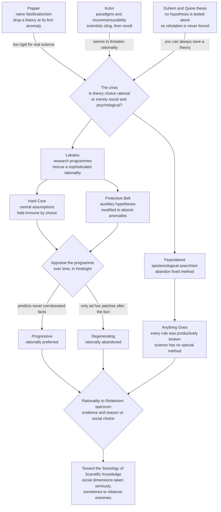

# 🧭 Lakatos, Feyerabend, and Beyond: The Rationality Debates

> [!abstract] TL;DR
> After **Popper** said *"falsify your theories"* and **Kuhn** replied *"no — scientists cling to paradigms and only switch in revolutions,"* the philosophy of science faced a crisis: **is theory choice rational, or merely social and psychological?** **Imre Lakatos** tried to rescue rationality with **research programmes** — each has a **hard core** of assumptions held immune by methodological choice, wrapped in a **protective belt** of auxiliary hypotheses that absorb anomalies. You never falsify a single hypothesis; you judge a *programme over time* and call it **progressive** if it keeps predicting **novel, corroborated facts**, or **degenerating** if it only makes **ad hoc patches** after the fact. **Paul Feyerabend** went the other way: studying the real history (especially Galileo) he concluded there is **no fixed scientific method** at all — every rule has been productively broken — so *"anything goes,"* an **epistemological anarchism**. Their clash dismantled the myth of a single "scientific method," opened the door to the **sociology of scientific knowledge**, and forced today's mature view: science has **no algorithm** but does have reliable practices, shared values, and error-correcting institutions.

---

## Intuition

**Analogy:** Imagine two rival football teams that can *never actually lose a match* — the rulebook lets a losing team keep rewriting the score after the final whistle. So you can't judge them by wins and losses. How do you tell the good team from the bad one? You watch them **over a whole season** and ask a different question: *which team keeps scoring bold, surprising goals nobody expected* — and which one only survives by quietly editing the scoreboard after every game it was about to lose? The first team is **thrilling and improving**; the second is **coasting on excuses**. Nobody can point to a single decisive defeat, yet everyone in the stands can *see* which team is going somewhere.

That is exactly Lakatos's picture of science. Because you can *always* save a theory by adjusting its background assumptions, no single experiment ever forces a "loss." So Lakatos says: stop hunting for the one fatal defeat, and instead track the **season-long trajectory**. A **progressive** research programme keeps making risky new predictions that come true; a **degenerating** one only patches holes to explain away what already went wrong. Feyerabend, watching the same messy history, drew the wilder conclusion — that there's **no fixed rulebook at all**, and that the greatest scientists won precisely by *breaking* whatever rules the referees of their day tried to enforce.

---

## How It Works

### The problem Kuhn left behind

By the late 1960s the two dominant pictures of science were at war, and both seemed broken:

- **Popper's naive falsificationism** was too rigid. It said a genuine theory sticks its neck out and gets *dropped the moment* an observation contradicts it. But real scientists don't behave that way — when Uranus's orbit disagreed with Newton, nobody threw out Newtonian mechanics; they **postulated a new planet** (Neptune) and were vindicated. Dropping theories at the first anomaly would have killed every great theory in its infancy. (See [[Induction_Falsification_and_Popper]] and, in the Philosophy vault, [[Popper_and_Falsification]].)
- **Kuhn's paradigms** seemed to threaten **rationality** itself. If competing paradigms are **incommensurable** — if they can't even be fully translated into each other's terms — and if scientists convert to a new paradigm the way people undergo a gestalt switch or a religious conversion, then **theory choice looks non-rational**: a matter of social pressure, generational turnover, and psychology rather than evidence and logic. (See [[Kuhn_Paradigms_and_Scientific_Revolutions]] and, in the Philosophy vault, [[Kuhn_and_Scientific_Revolutions]].)

The central question of the era: **can we give a *rational* account of science that actually fits its messy history?** Lakatos and Feyerabend — colleagues and sparring partners at the London School of Economics, who planned a joint book titled *For and Against Method* cut short by Lakatos's death in 1974 — gave opposite answers.

### The Duhem–Quine thesis: why falsification is never forced

Underneath everything sits a logical fact that both men took seriously. **No hypothesis is ever tested in isolation.** When you run an experiment you rely on a whole bundle: the core theory, auxiliary assumptions, instrument theories, background conditions. If the prediction fails, logic tells you only that *something* in the bundle is false — **not which part**. This is the **Duhem–Quine thesis** (Pierre Duhem, W.V.O. Quine).

The consequence is devastating for naive falsificationism: you can **always** save any hypothesis "come what may" by blaming and adjusting some auxiliary assumption instead. Falsification is therefore **never logically compelled**, so choosing between theories needs criteria *beyond* simple refutation. Lakatos built his whole system as an answer to this problem; Feyerabend read it as proof that no clean method could exist. (The problem-of-induction backdrop is in [[The_Problem_of_Induction]].)

### Lakatos: research programmes and the hard core

Lakatos's **"methodology of scientific research programmes"** is a **sophisticated falsificationism** — a deliberate middle path between Popper and Kuhn. His key move is to change the **unit of appraisal**. We don't evaluate a lone hypothesis or even a single theory; we evaluate a **research programme** that unfolds over decades. Each programme has two parts:

1. **The hard core.** A small set of central assumptions — Newton's three laws plus gravitation, or the Darwinian principle of natural selection — treated as **irrefutable by methodological decision**. Scientists agree, by a **"negative heuristic,"** *not* to aim their refutations at the core. Anomalies are never allowed to count against it directly.
2. **The protective belt.** A surrounding layer of **auxiliary hypotheses**, initial conditions, and instrument assumptions. When an anomaly appears, the **"positive heuristic"** directs scientists to **modify the belt**, not the core — adding a new planet, a new force term, a new correction. The belt takes the hits so the core survives.

This exactly *uses* the Duhem–Quine freedom rather than being defeated by it: because you can always redirect a refutation into the belt, the interesting question is never "was the core refuted?" (it never is) but **"are the belt's modifications any good?"**

### Progressive vs degenerating: the rational criterion

Here is Lakatos's decisive contribution — a way to be rational *without* decisive falsifications. A programme's belt-adjustments come in two flavours:

- **Progressive.** Each modification is **"theoretically progressive"** if it predicts some **novel fact** — something surprising and *not* already known — and **"empirically progressive"** if that novel prediction is later **corroborated**. The programme is growing: it keeps anticipating new phenomena and being proved right. (Adams and Le Verrier didn't just excuse Uranus's wobble; they **predicted a new planet at a specific location**, and telescopes found Neptune there.)
- **Degenerating.** Each modification is merely **ad hoc** — it is bolted on *after the fact* only to accommodate an anomaly already observed, predicting **nothing new**. The programme has stopped anticipating and started **making excuses**. It still "fits the data," but only by patching.

**Rationality lies in preferring the progressive programme and abandoning the degenerating one** — but crucially, this judgment can usually only be made **over time and in hindsight**. A programme may degenerate for years and then stage a comeback, so Lakatos warns against declaring a "crucial experiment" in the heat of the moment. There is a rational standard (novel content), but it is a **historical, retrospective** one — not a single knockout blow. This threads the needle between Popper (there *is* a standard) and Kuhn (but it isn't instant, algorithmic falsification).

### Feyerabend: against method and "anything goes"

Paul Feyerabend took the wild road. In *Against Method* (1975) he studied the actual history of science — above all **Galileo's** defence of Copernicanism — and concluded something radical: **there is no fixed, universal scientific method.** Every methodological rule anyone has ever proposed — *don't hold onto refuted theories, always respect the observations, be consistent, don't use ad hoc hypotheses* — has at some point been **deliberately violated, and the violation drove progress.**

Galileo, Feyerabend argued, *won* precisely by breaking the rules: he asked people to trust a new, poorly understood **telescope** over the plain evidence of their senses; he used **propaganda, rhetoric, and psychological tricks**; he held onto Copernicanism despite genuine unanswered objections (like the missing stellar parallax). Had Galileo obeyed the tidy rules of "good method," heliocentrism would have been strangled at birth. Feyerabend's provocative conclusion:

> *"The only principle that does not inhibit progress is: **anything goes**."*

This is **epistemological anarchism**. Science, on this view, has **no special epistemic status** that automatically elevates it above other traditions of knowledge; the idea of one privileged Method is a myth used to police inquiry.

### Feyerabend's deeper points (not just provocation)

Feyerabend is constantly **misread as anti-science**. His serious claims are subtler and worth separating from the fireworks:

- **A warning against methodological dogmatism.** Freezing any one method into law would have blocked past breakthroughs; it will block future ones. Rules are tools, not commandments.
- **A defence of pluralism and proliferation.** We should actively cultivate **competing theories**, even implausible ones. Rival theories sharpen each other, expose hidden assumptions, and surface evidence that a monopoly theory would never look for. **Theoretical monoculture is dangerous.**
- **Skepticism about scientific imperialism.** Feyerabend distrusted **experts dominating a free society**. He argued citizens should have democratic say over science's role, and that other traditions deserve a hearing rather than automatic dismissal.

The label "anarchism" is partly theatrical; the substance is a plea for **openness, pluralism, and humility** about method.

### The rationality-to-relativism spectrum

The whole era can be read as a spectrum over **one question: how much is science governed by evidence and reason, versus by social factors and choice?**



Reading left-to-right in spirit: **Popper and Lakatos** (science *is* rational, with method and standards) → **Kuhn** (rationality is paradigm-relative) → **Feyerabend** (no fixed method) → **the sociologists** (knowledge as socially constructed). This is the debate that shaped late-twentieth-century philosophy of science.

### Toward the sociology of science — and a mature view

These debates **opened the door** to the **sociology of scientific knowledge (SSK)** and "science studies," which took the *social* dimensions of science seriously — how consensus is actually manufactured in labs, negotiations, and institutions. The strong programme (Edinburgh: Barnes, Bloor) and laboratory studies (Latour, Woolgar) pushed toward treating scientific facts as socially *constructed*, sometimes to relativist extremes that provoked the 1990s **"science wars."** (See [[Sociology_of_Knowledge_and_Science]] and the planned History-of-Science sibling *The Sociology of Scientific Knowledge*.)

Where did the dust settle? Most philosophers today reject **both** naive extremes:

- **Against** the myth of a single algorithmic "scientific method" — there is no five-step recipe that mechanically cranks out truth.
- **Against** radical relativism — science's stunning predictive and technological track record is not a mere social accident.

The **mature view** is **pluralistic, naturalistic, and historically informed**: science has **no single algorithm** but *does* have **reliable practices**, shared **cognitive values** (Kuhn's own list: accuracy, consistency, scope, simplicity, fruitfulness), and **error-correcting institutions** (peer review, replication, open criticism). Frameworks like **Bayesian confirmation theory** try to make "weighing evidence" precise without pretending it's mechanical. Science is best understood as **reliable but not algorithmic** — exactly the ground Lakatos and Feyerabend fought over. (For the broader map, see [[Philosophy_of_Science_Overview]].)

---

## Key Concepts

### Secondary Level
- **Research programme** — a big, long-lived family of theories sharing a common core, judged as a whole over time rather than one experiment at a time.
- **Hard core** — the central ideas of a programme that scientists agree *not* to give up (like Newton's laws of motion).
- **Protective belt** — the outer, adjustable assumptions that get changed to explain away surprises so the core survives.
- **Progressive vs degenerating** — a *good* programme keeps predicting exciting new things that turn out true; a *stale* one only invents excuses after being proven wrong.
- **"Anything goes"** — Feyerabend's slogan that there is no single rulebook every scientist must follow.

### Undergraduate Level
- **Sophisticated falsificationism** — Lakatos's revision of Popper: don't falsify lone hypotheses; compare whole programmes by their track record of **novel corroborated predictions**.
- **Novel fact / novel content** — a prediction of something **surprising and not already known**; corroborating novel facts is what makes a programme *empirically progressive*. Ad hoc moves add none.
- **Negative and positive heuristic** — the "rules" of a programme: the negative heuristic shields the hard core; the positive heuristic guides how to develop the protective belt.
- **Duhem–Quine thesis (underdetermination)** — because a hypothesis is only ever tested together with auxiliaries, a failed prediction never tells you *which* assumption to blame, so refutation is never logically forced.
- **Epistemological anarchism** — Feyerabend's thesis that no fixed methodological rules hold universally; every rule has been productively broken.
- **Theoretical pluralism / proliferation** — the deliberate cultivation of competing theories so they can criticize and improve one another.
- **Incommensurability** — Kuhn's idea (which triggered the crisis) that rival paradigms lack a common measuring stick, making theory choice look non-rational.

### Graduate Level
- **The unit-of-appraisal shift** — Lakatos's core methodological innovation is moving appraisal from *statement* (Popper) to *programme* (a diachronic series of theories); this is what makes rationality *historical*.
- **Retrospective vs prospective rationality** — Lakatos's criterion identifies progressive programmes reliably only **in hindsight**; this invites the charge that it gives **no forward-looking advice** ("license to be a fool" — his critics) and reduces to writing history with hindsight.
- **Rational reconstruction and "internal vs external" history** — Lakatos's programme for *rewriting* the history of science to display its rationality, relegating the "irrational" residue to sociology/psychology — a move Feyerabend and the SSK school attacked as circular.
- **Feyerabend's incommensurability and meaning-holism** — his argument (sharper than Kuhn's) that theoretical terms change meaning across theories, undercutting theory-neutral observation and crucial experiments.
- **The demarcation payoff** — research-programme methodology reframes the **demarcation problem**: pseudoscience is not "unfalsifiable" but **degenerating** (endlessly ad hoc, no novel content) — a subtler line than Popper's. (See the planned History-of-Science sibling *Pseudoscience and the Demarcation Problem*.)
- **From methodology to sociology** — how the failure to find a purely rational algorithm legitimized the **strong programme** and laboratory studies, and where the **science wars** and later "post-truth" anxieties trace back to this lineage.
- **Naturalized, Bayesian, and values-based successors** — contemporary attempts (Bayesian confirmation, Laudan's problem-solving model, values-in-science debates) to keep a defensible rationality without a single algorithm.

---

## Python Demo

We model **Lakatos's central claim**: two rival research programmes can run for a whole "season" without either being decisively falsified, yet a rational observer can still tell them apart — by tracking the **rate of successful novel predictions** over time. The **progressive** programme keeps risking novel predictions that get corroborated (its novel content grows); the **degenerating** programme mostly bolts on **ad hoc patches** after the fact (novel content flatlines). We then plot both trajectories.

```python
# Lakatos: progressive vs degenerating research programmes made visible.
# Two rival programmes face the SAME stream of empirical episodes over time.
# At each episode a programme either:
#   (a) risks a NOVEL prediction that gets corroborated  -> progressive (adds new content)
#   (b) makes an AD HOC PATCH to its protective belt after the fact -> degenerating (no new content)
# KEY POINT: neither programme is ever decisively FALSIFIED -- both keep "fitting" the data
# by patching their belt. Yet Lakatos's criterion (rate of successful NOVEL predictions)
# cleanly separates the rational winner from the loser, in hindsight, over time.
import numpy as np
import matplotlib.pyplot as plt

rng = np.random.default_rng(7)

N = 80                              # empirical episodes over each programme's history
episodes = np.arange(1, N + 1)

def run_programme(p_risk_novel, p_success_given_risk):
    """Simulate one research programme over N episodes.
    p_risk_novel          : prob it STICKS ITS NECK OUT with a novel prediction
    p_success_given_risk  : prob a risked novel prediction is then corroborated
    Returns (novel_success 0/1, ad_hoc 0/1, cumulative novel content)."""
    novel_success = np.zeros(N)
    ad_hoc        = np.zeros(N)
    for i in range(N):
        if rng.random() < p_risk_novel:            # it dared to predict something new
            if rng.random() < p_success_given_risk:
                novel_success[i] = 1               # corroborated novel fact -> progressive
            else:
                ad_hoc[i] = 1                       # novel prediction failed -> patch the belt
        else:
            ad_hoc[i] = 1                           # no novelty risked -> patch a known anomaly
    return novel_success, ad_hoc, np.cumsum(novel_success)

# PROGRESSIVE: frequently risks novel predictions, and they usually succeed.
prog_succ,  prog_adhoc,  prog_cum  = run_programme(p_risk_novel=0.75, p_success_given_risk=0.80)
# DEGENERATING: rarely risks novelty; the few attempts mostly fail,
# so it survives almost entirely by ad hoc patching.
degen_succ, degen_adhoc, degen_cum = run_programme(p_risk_novel=0.20, p_success_given_risk=0.30)

# "Progressiveness" metric = rolling rate of successful NOVEL predictions.
def rolling_rate(x, w=12):
    return np.convolve(x, np.ones(w) / w, mode="same")

prog_rate, degen_rate = rolling_rate(prog_succ), rolling_rate(degen_succ)

print(f"Corroborated NOVEL facts   -- progressive : {int(prog_cum[-1])}")
print(f"Corroborated NOVEL facts   -- degenerating: {int(degen_cum[-1])}")
print(f"Ad hoc patches             -- progressive : {int(prog_adhoc.sum())}")
print(f"Ad hoc patches             -- degenerating: {int(degen_adhoc.sum())}")
print("Neither programme was ever decisively falsified -- both still 'fit' the data by patching.")
print("Lakatos: rationally prefer the PROGRESSIVE programme by its growth in novel content.")

# ---- Visualize the two trajectories ----
fig, (ax1, ax2) = plt.subplots(1, 2, figsize=(13, 5))

ax1.plot(episodes, prog_cum,  color="#16a34a", lw=2.3, label="progressive")
ax1.plot(episodes, degen_cum, color="#dc2626", lw=2.3, label="degenerating")
ax1.set_xlabel("empirical episode over time")
ax1.set_ylabel("cumulative corroborated NOVEL predictions")
ax1.set_title("Novel content: progressive keeps growing,\ndegenerating flatlines")
ax1.legend(fontsize=9); ax1.grid(alpha=0.3)

ax2.plot(episodes, prog_rate,  color="#16a34a", lw=2.3, label="progressive")
ax2.plot(episodes, degen_rate, color="#dc2626", lw=2.3, label="degenerating")
ax2.axhline(0.1, color="#64748b", ls="--", lw=1.2, label="near-zero: mere patching")
ax2.set_xlabel("empirical episode over time")
ax2.set_ylabel("progressiveness = rolling rate of novel successes")
ax2.set_title("Lakatos's criterion:\nnovel-prediction rate over time")
ax2.legend(fontsize=9); ax2.grid(alpha=0.3); ax2.set_ylim(-0.02, 1.0)

plt.tight_layout()
plt.savefig("lakatos_research_programmes.png", dpi=130)
print("Saved lakatos_research_programmes.png")
plt.show()
```

Running this prints a large pile of **corroborated novel facts** for the progressive programme and almost none for the degenerating one, while the ad-hoc-patch counts flip the other way — the degenerating programme is a **patch factory**. The left panel shows the progressive programme's novel content climbing steadily while the degenerating one stays nearly flat; the right panel shows its **progressiveness metric** riding high while the degenerating programme's rate hugs the "mere patching" line near zero. The moral is precisely Lakatos's: **neither programme was ever knocked out by a single falsifying experiment**, yet a rational scientist can still justifiably back the progressive one — not by a knockout blow, but by its **season-long record of surprising, corroborated predictions.**

---

## Real-World Applications

- **The Newton-to-Neptune episode.** The textbook case of a *progressive* move: rather than abandon Newtonian gravity when Uranus misbehaved, Adams and Le Verrier adjusted the belt by **predicting an unseen planet at a computed position** — and Neptune was found. Contrast the later attempt to explain Mercury's perihelion by a hypothetical planet **Vulcan**, which was *degenerating* (ad hoc, never found); the anomaly instead fell to a rival progressive programme, **general relativity**.
- **Diagnosing pseudoscience.** Lakatos reframes the **demarcation problem**: astrology, "creation science," and conspiracy theories aren't damned merely for being unfalsifiable — they are **degenerating**, endlessly adding excuses to accommodate failures while predicting **nothing new**. This is a sharper, more usable test than naive falsificationism.
- **Evaluating live research programmes.** Working scientists implicitly ask Lakatos's question about, say, string theory, MOND vs dark matter, or a struggling drug-target hypothesis: *is this programme still generating novel, testable, corroborated predictions, or just parameters and epicycles to fit what we already see?*
- **Science policy and funding.** Feyerabend's plea for **theoretical pluralism** underwrites the case for funding rival approaches rather than betting everything on one consensus paradigm — the "monoculture is fragile" argument in research strategy.
- **Science and democracy debates.** Feyerabend's skepticism toward **expert domination** echoes through modern controversies over the authority of scientific advisory bodies, "follow the science," and public participation in technical decisions.
- **Foundations of the sociology of science.** These debates gave intellectual license to laboratory studies and STS (science and technology studies), which now inform how we understand replication crises, consensus formation, and misinformation.

---

## Common Pitfalls

- **Reading Feyerabend as "anti-science."** *"Anything goes"* is a claim about the **absence of a universal method**, plus a defence of pluralism — not a claim that science is worthless or that astrology equals astrophysics. He was attacking **method-worship**, not evidence.
- **Thinking a hard core can be "immune" to evidence forever.** The core is protected *by methodological choice*, not by magic. If the whole programme **degenerates**, the core goes down with it. Immunity is a temporary research strategy, not a truth guarantee.
- **Calling any belt-modification "ad hoc."** Modifying the protective belt is **normal, healthy science** when the modification **predicts a novel fact** (Neptune). It is only *degenerating* when it predicts nothing new and merely accommodates a known anomaly. The novel-content test, not the mere act of patching, is what matters.
- **Expecting Lakatos to tell you what to believe *right now*.** His criterion is **retrospective**: programmes can degenerate and then recover, so there is no rational rule forcing you to abandon a lagging programme at time *t*. Critics (including Feyerabend) charged this gives **advice only to historians**, not to working scientists.
- **Collapsing Lakatos and Kuhn together.** Both reject naive falsificationism and both look at history, but Lakatos insists there is a **trans-paradigm rational standard** (novel content); Kuhn is far more willing to let the standards themselves be **paradigm-relative**. They are on **opposite sides** of the rationality debate.
- **Sliding from "no algorithm" to "no rationality."** The mature lesson is that rejecting a single mechanical method does **not** entail relativism. Science can be **reliable without being algorithmic** — the error is treating those as the only two options.

---

## Related Concepts

- [[Kuhn_Paradigms_and_Scientific_Revolutions]] — the paradigm-shift and incommensurability thesis that *triggered* the rationality crisis Lakatos and Feyerabend responded to (History-of-Science sibling).
- [[Induction_Falsification_and_Popper]] — the naive falsificationism Lakatos refines into "sophisticated" form and Feyerabend rejects outright; the shared starting point (History-of-Science sibling).
- [[Scientific_Realism_and_Its_Critics]] — the parallel debate over whether our best theories are *true*, which the rationality debates directly bear on (does progress track reality?).
- [[Philosophy_of_Science_Overview]] — the Section 05 hub that situates Popper, Kuhn, Lakatos, and Feyerabend in the larger arc of philosophy of science.
- [[Kuhn_and_Scientific_Revolutions]] — the Philosophy-vault companion on paradigms and incommensurability.
- [[Popper_and_Falsification]] — the Philosophy-vault companion on falsificationism and the demarcation criterion.
- [[The_Problem_of_Induction]] — Hume's underlying wound in empiricism; the Duhem–Quine underdetermination that makes falsification non-forcing is its close cousin.
- [[Scientific_Realism]] — the Philosophy-vault treatment of realism vs anti-realism, the metaphysical stakes behind "progress."
- [[Sociology_of_Knowledge_and_Science]] — the sociological turn (SSK, strong programme, science wars) these debates opened the door to.
- [[Scientific_Reasoning_and_Method]] — the systematic treatment of method, confirmation, and hypothesis-testing that the "no single method" thesis complicates.
- [[Inductive_Logic]] — the formal machinery of generalizing from evidence, and its limits, that sits beneath appraisal of programmes.
- [[Scientific_Method_and_Empiricism]] — the History-of-Science account of the "scientific method" myth these debates helped dismantle.
- [[The_Copernican_Revolution]] — Galileo's defence of Copernicanism is Feyerabend's central case study in *Against Method*.
- [[Scientific_Institutions_and_Societies]] — the error-correcting institutions (peer review, societies) that anchor the mature "reliable-but-not-algorithmic" view of science.
- [[History_of_Science_Overview]] — the vault's map of how methodological ideas evolved alongside the science itself.

> Sibling History-of-Science notes still referenced in prose — *The Sociology of Scientific Knowledge* and *Pseudoscience and the Demarcation Problem* — are planned for this Section 05 folder but not yet written; their cross-vault anchors (Sociology and Logic vaults) are linked above.

---

## Review Questions

**Secondary**
1. Lakatos says a research programme has a "hard core" and a "protective belt." Using an everyday example (or Newton's laws), explain what each part does when a surprising observation shows up. Then, in your own words, what makes one research programme "progressive" and another "degenerating"?

**Undergraduate**
2. Because of the **Duhem–Quine thesis**, you can always save a theory from any experiment by adjusting a background assumption — so no theory is ever *forced* to be false. Explain how Lakatos turns this apparent disaster for falsificationism into the *foundation* of his method, and how the demand for **novel corroborated predictions** lets him call one programme rationally superior to another **without any single decisive falsification**.

**Graduate**
3. Lakatos aims to **rescue scientific rationality** with a retrospective, trans-paradigm standard (novel content), while Feyerabend concludes **"anything goes"** and denies any fixed method. (a) Reconstruct the strongest version of *each* position, distinguishing Feyerabend's serious defence of pluralism from his provocations. (b) Feyerabend charged that Lakatos's methodology, being purely *retrospective*, is really "anarchism in disguise" that gives no forward-looking advice. Is that fair? (c) Explain how *both* thinkers helped move philosophy of science toward the **sociology of scientific knowledge**, and why most philosophers today reject both a single "scientific method" *and* radical relativism in favour of a **pluralistic, naturalistic** picture of science as reliable-but-not-algorithmic.

---

## Sources

- Lakatos, Imre. *The Methodology of Scientific Research Programmes* (Philosophical Papers, Vol. 1). Cambridge University Press, 1978. — The definitive statement of hard core, protective belt, and progressive vs degenerating programmes.
- Feyerabend, Paul. *Against Method* (1975; 4th ed., Verso, 2010). — Epistemological anarchism, the Galileo case study, and "anything goes."
- Lakatos, Imre & Musgrave, Alan (eds.). *Criticism and the Growth of Knowledge*. Cambridge University Press, 1970. — The landmark volume where Popper, Kuhn, Lakatos, and Feyerabend directly debate.
- Chalmers, A. F. *What Is This Thing Called Science?* (4th ed.). Hackett/Open University Press, 2013. — Accessible chapters on Lakatos and Feyerabend and the rationality debates.
- Preston, John. "Paul Feyerabend." *Stanford Encyclopedia of Philosophy* (2020). — https://plato.stanford.edu/entries/feyerabend/
- Musgrave, Alan & Pigden, Charles. "Imre Lakatos." *Stanford Encyclopedia of Philosophy* (2021). — https://plato.stanford.edu/entries/lakatos/

---

#history-of-science #lakatos #feyerabend #research-programmes #against-method
