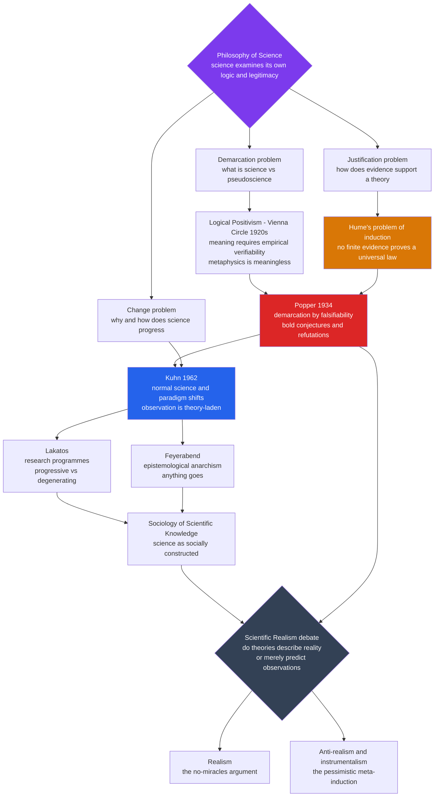

# 🧭 Philosophy of Science — Overview

> [!abstract] TL;DR
> **Philosophy of science** is science turning its gaze on **itself** — the systematic examination of what makes a claim *scientific*, how **evidence** can justify a theory, why (or whether) science **progresses**, and what our best theories really tell us about **reality**. It asks the reflective questions a practicing scientist usually brackets: *What separates science from pseudoscience* (the **demarcation** problem)? *How can finite observations justify a universal law* (the **problem of induction**)? *Does science accumulate truth or lurch through **paradigm shifts**?* The field's modern arc runs from the **logical positivists'** verification principle, through **Popper's** falsificationism, **Kuhn's** paradigms, the **Lakatos–Feyerabend** debates and the **sociology of scientific knowledge**, to the still-live **scientific realism** dispute. Its payoff is epistemic humility with teeth: it sharpens the line between science and pseudoscience, exposes the real limits of evidence, and guards against both naïve **scientism** and cynical **relativism**. This note is the conceptual companion to the [[History_of_Science_Overview]] — history tells *what happened*; philosophy of science asks *what it means*.

---

## Intuition

**Analogy:** A master carpenter can build a flawless staircase without ever asking *why* the joints hold. But a different, deeper question haunts the workshop: **"What actually makes my method reliable — and where might it quietly deceive me?"** That is the shift from *doing* the craft to *interrogating* it. Philosophy of science is exactly this move applied to science as a whole: not "how do I run the experiment?" but "what makes experiment a *trustworthy* route to truth, and what are the hidden cracks in that trust?"

Here is the crack that started it all. Science works **spectacularly well** — it predicts eclipses to the second and puts probes on comets. Yet its central engine seems, on inspection, logically shaky. Every scientific law is a **universal claim** ("all electrons have charge *e*", "all copper conducts"), but we only ever observe a **finite** number of cases. No matter how many white swans you tally, the next one could be black — so no amount of confirming evidence can ever *prove* a universal law, while a *single* counterexample can refute it. That asymmetry between confirmation and refutation is not a minor technicality; it sits at the foundation of the most successful knowledge-producing method humanity has. Philosophy of science is the discipline that stares straight at that crack and asks what science can and cannot honestly claim.

---

## How It Works

### Three foundational questions

Almost every school of thought in the field is an attempt to answer one or more of three questions about science itself:

1. **The demarcation problem — *what is science?*** What distinguishes genuine science from **pseudoscience** (astrology, homeopathy), from **metaphysics**, or from mere **opinion**? This is not an academic parlor game: courts rule on whether "creation science" may be taught, regulators decide which medical claims count as evidence-based, and the phrase "is X *really* a science?" carries enormous cultural weight. The proposed criteria — the positivists' **verifiability**, Popper's **falsifiability** — each capture something real yet none draws a perfectly sharp line.

2. **The justification problem — *how does evidence support theory?*** Science reasons by **induction**: it infers universal laws from finite observations, expecting the future to resemble the past. But **David Hume** showed that induction cannot be *logically* justified. No run of confirming instances *entails* a universal claim, and defending induction by saying "it has worked before, so it will keep working" simply *assumes the uniformity of nature* — the very thing in question. This is the [[The_Problem_of_Induction]], a live wound at the heart of empiricism (see [[Humes_Skepticism]]).

3. **The change problem — *why does science progress, or does it?*** Is science a steady **accumulation** of truths, each theory a refinement of the last — or does it advance through discontinuous **revolutions** that overthrow and *replace* their predecessors? The answer decides whether science is converging on reality or merely swapping one worldview for another.

### The arc of positions

The twentieth century produced a remarkable dialectical sequence, each stage a reaction to the last:

- **Logical positivism / logical empiricism (the Vienna Circle, 1920s–30s).** Meaningful statements must be either **analytically true** (logic and math) or **empirically verifiable**; everything else — metaphysics, theology — is literally *meaningless*. Science, resting on observation, became the paradigm of legitimate knowledge. The program was rigorous and clarifying but proved self-undermining: the **verification principle itself is not verifiable**, universal laws can never be conclusively verified, and observation turned out to be **theory-laden** rather than a neutral bedrock. See [[Scientific_Method_and_Empiricism]].

- **Popper and falsificationism (1934 onward).** **Karl Popper** reframed the demarcation criterion: what marks a theory as scientific is not that it can be *verified* but that it can be **falsified** — that it makes **risky predictions** which could turn out wrong. Science advances by **bold conjectures and ruthless attempted refutations**; we never *prove* a theory, we only fail (so far) to refute it. Einstein's relativity, which staked its life on a precise, checkable prediction of starlight bending, is scientific; a theory compatible with *every* possible observation (Popper's targets were astrology and certain readings of Marxism and psychoanalysis) is not. See [[Popper_and_Falsification]].

- **Kuhn and paradigms (1962).** **Thomas Kuhn's** *The Structure of Scientific Revolutions* delivered the historical counterpunch. Actual science, he argued, is not a steady falsify-and-replace grind. It alternates long stretches of **normal science** — puzzle-solving within an accepted **paradigm** — with occasional **crises** that erupt into **revolutionary paradigm shifts**. Rival paradigms are **incommensurable** (they lack a fully neutral common measure), **observation is theory-laden**, and paradigm change has **social and psychological** dimensions closer to a Gestalt switch than a proof. See [[Kuhn_and_Scientific_Revolutions]].

- **The post-Kuhnian debates.** **Imre Lakatos** tried to rescue rationality with **research programmes** judged **progressive or degenerating** by whether they predict novel facts. **Paul Feyerabend** went the other way — *"anything goes"*, **epistemological anarchism**, the claim that no single method explains science's successes. And the **Sociology of Scientific Knowledge** (the Edinburgh "Strong Programme", and Shapin and Schaffer's studies) argued that scientific belief — true and false alike — must be explained by **social causes**, treating knowledge as in part **socially constructed**. Together they eroded confidence in any single "scientific method" and ignited the **rationality-versus-relativism** "science wars".

- **The scientific realism debate (running throughout).** Do our best theories **describe reality** — are electrons and curved spacetime *real* — or are they just **useful instruments** for organizing and predicting observations? **Realists** wield the **no-miracles argument**: it would be a miracle for a false theory to be so predictively successful. **Anti-realists / instrumentalists** answer with the **pessimistic meta-induction**: the history of science is a graveyard of once-successful theories (phlogiston, caloric, the luminiferous ether) later judged false, so why trust ours? See [[Scientific_Realism]].

### Flow / Architecture



---

## Key Concepts

### Secondary — the core questions

- **Demarcation.** The problem of drawing a line between **science** and **non-science** (pseudoscience, metaphysics, opinion). Why it matters: astrology, creationism, and quack medicine all *claim* the authority of science.
- **Induction.** Reasoning from **particular observations to general laws** — the everyday engine of empirical science, and the one Hume showed cannot be logically guaranteed.
- **Falsifiability.** A theory is scientific, for Popper, if it **forbids** something — if there is a possible observation that would prove it wrong. A theory compatible with everything explains nothing.
- **Paradigm.** Kuhn's term for the shared framework of assumptions, methods, and exemplars that a scientific community works *within* during **normal science**.
- **Scientism vs relativism.** Two opposite errors the field guards against: treating science as **infallible and total** (scientism) versus treating it as **just another belief system** with no special claim to truth (relativism).

### Undergraduate — the mechanisms and arguments

- **The verification principle** and its self-refutation — logical positivism's criterion of meaning, which fails its own test.
- **Theory-ladenness of observation** — there is no wholly "raw" datum; what counts as a measurement is shaped by the theory and instruments used to obtain it, undermining the positivist idea of a neutral observational bedrock.
- **The hypothetico-deductive method** — conjecture a hypothesis, deduce testable consequences, and check them; Popper's picture of how science actually reasons, contrasted with naïve inductivism.
- **Underdetermination of theory by data** — for any finite body of evidence, **multiple incompatible theories** can fit it equally well, so data alone cannot single out the true theory (the Duhem–Quine thesis).
- **Incommensurability** — Kuhn's claim that rival paradigms lack a fully shared vocabulary and standards, so a "crucial experiment" cannot cleanly decide between them.
- **The no-miracles argument vs the pessimistic meta-induction** — the two headline arguments of the realism debate.

### Graduate — the deep debates

- **The Duhem–Quine thesis and holism** — hypotheses are never tested in isolation but only as part of a **web of belief**; a failed prediction never tells you *which* auxiliary assumption to blame, so falsification is rarely as decisive as Popper hoped.
- **The new riddle of induction (Goodman's "grue")** — even granting induction, *which* regularities we project is not fixed by the evidence, deepening Hume's problem into a puzzle about lawlikeness itself.
- **Bayesian confirmation theory** — the modern probabilistic reconstruction of how evidence *raises* the credence of a hypothesis without ever reaching certainty; a formal answer to how confirmation works (and its subjectivity problems). See [[Bayesian_Reasoning]].
- **The Strong Programme and the symmetry principle** — Bloor and Barnes's demand that *true* and *false* beliefs be explained by the **same kind** of social causes; the provocation behind the "science wars".
- **Structural realism** — Worrall's attempt to have it both ways: what survives theory change and is genuinely tracked is the **mathematical structure** of relations, not the underlying entities.
- **Models of explanation** — from Hempel's **deductive-nomological** model (to explain is to subsume under a **law**) and its counterexamples, to **causal** and **mechanistic** accounts of what makes an explanation *good*. See [[Explanation_and_Laws_of_Nature]].

---

## Python Demo

Two of philosophy of science's deepest problems are best *felt* rather than merely stated. This demo visualizes both.

**Panel 1 — the confirmation/induction asymmetry.** We model belief in the universal hypothesis *H = "all swans are white"* using **Bayesian updating**. Each observed white swan multiplies the odds in favor of *H*, so confidence **rises toward 1 but never reaches it** — no finite run of white swans can *prove* the universal claim. Then a **single black swan** appears: the likelihood of that observation under *H* is zero, so the posterior **collapses instantly to 0**. That vertical cliff is Hume's asymmetry and Popper's falsification in one picture.

**Panel 2 — underdetermination of theory by data.** We fit **several different models** to the *same* seven noisy data points. A line, a cubic, a wiggly high-degree polynomial, and a sine wave all pass through (or near) every point — they are **empirically equivalent on the evidence** yet **disagree wildly** about what happens between and beyond the data. Data alone cannot pick the "true" curve.

```python
# Two central problems of philosophy of science, visualized.
#   (1) The confirmation/induction asymmetry: evidence -> 1 but never proves it;
#       one counterexample collapses the universal claim.
#   (2) Underdetermination: many theories fit the same finite data.
import numpy as np
import matplotlib.pyplot as plt

rng = np.random.default_rng(1)

# ----- Panel 1: Bayesian confidence in "all swans are white" -----
# Two hypotheses:
#   H  = "ALL swans are white"      -> P(white | H)  = 1.0 always
#   ~H = "not all swans are white"  -> P(white | ~H) = theta < 1 (whites still common)
prior_H = 0.5
theta   = 0.80          # under ~H, a random swan is white with prob theta
n_white = 40            # a long run of confirming observations
# Sequence: 40 white swans, then ONE black swan (the falsifier).
observations = ["white"] * n_white + ["black"]

post = prior_H
history = []
for obs in observations:
    if obs == "white":
        like_H, like_notH = 1.0, theta
    else:  # a black swan is IMPOSSIBLE under H
        like_H, like_notH = 0.0, (1 - theta)
    # Bayes: posterior odds = prior odds * likelihood ratio
    num = like_H * post
    den = like_H * post + like_notH * (1 - post)
    post = num / den if den > 0 else 0.0
    history.append(post)

history = np.array(history)
print(f"Confidence after {n_white} white swans: {history[n_white-1]:.6f}  (never 1.0)")
print(f"Confidence after the black swan:        {history[-1]:.6f}  (collapse)")

# ----- Panel 2: underdetermination -- many curves, same 7 points -----
x_data = np.linspace(0, 6, 7)
true_fn = lambda x: 0.5 * x + 1.0                 # the "real" law (unknown to us)
y_data = true_fn(x_data) + rng.normal(0, 0.35, size=x_data.shape)
xs = np.linspace(-0.5, 6.5, 400)

# Four incompatible models fit to the SAME data:
p1 = np.poly1d(np.polyfit(x_data, y_data, 1))     # straight line
p3 = np.poly1d(np.polyfit(x_data, y_data, 3))     # cubic
p6 = np.poly1d(np.polyfit(x_data, y_data, 6))     # interpolates all 7 points exactly
# A sine model fitted (grid search over frequency for best least-squares offset+amp):
def sine_fit(x, y):
    best = None
    for w in np.linspace(0.3, 2.5, 400):
        A = np.column_stack([np.sin(w * x), np.cos(w * x), np.ones_like(x)])
        coef, *_ = np.linalg.lstsq(A, y, rcond=None)
        res = np.sum((A @ coef - y) ** 2)
        if best is None or res < best[0]:
            best = (res, w, coef)
    return best[1], best[2]
w, c = sine_fit(x_data, y_data)
sine_pred = lambda x: c[0]*np.sin(w*x) + c[1]*np.cos(w*x) + c[2]

# ----- Plot -----
fig, (ax1, ax2) = plt.subplots(1, 2, figsize=(13, 5))

ax1.plot(range(1, len(history) + 1), history, color="#2563eb", lw=2)
ax1.scatter([n_white], [history[n_white-1]], color="#059669", zorder=5,
            label="after 40 white swans")
ax1.scatter([len(history)], [history[-1]], color="#dc2626", zorder=5,
            label="one black swan -> collapse")
ax1.axhline(1.0, ls=":", color="gray")
ax1.annotate("approaches 1\nnever reaches it", xy=(n_white, history[n_white-1]),
             xytext=(12, 0.55), fontsize=9,
             arrowprops=dict(arrowstyle="->", color="#059669"))
ax1.set_xlabel("number of swans observed")
ax1.set_ylabel("confidence that ALL swans are white")
ax1.set_title("Confirmation is asymmetric:\nno finite evidence proves a universal law")
ax1.set_ylim(-0.05, 1.08)
ax1.legend(loc="center right"); ax1.grid(alpha=0.3)

ax2.scatter(x_data, y_data, color="black", zorder=6, s=60, label="7 data points")
ax2.plot(xs, p1(xs), "-",  color="#2563eb", label="linear")
ax2.plot(xs, p3(xs), "--", color="#059669", label="cubic")
ax2.plot(xs, p6(xs), "-.", color="#d97706", label="degree-6 (interpolates)")
ax2.plot(xs, sine_pred(xs), ":", color="#dc2626", lw=2, label="sine")
ax2.set_xlabel("x"); ax2.set_ylabel("y")
ax2.set_title("Underdetermination:\nmany theories fit the same finite data")
ax2.set_ylim(y_data.min() - 3, y_data.max() + 3)
ax2.legend(loc="upper left", fontsize=8); ax2.grid(alpha=0.3)

plt.tight_layout()
plt.savefig("philosophy_of_science_induction_underdetermination.png", dpi=120)
print("\nSaved figure: philosophy_of_science_induction_underdetermination.png")
```

The left panel makes Hume's point unmissable: the confidence curve *climbs asymptotically* toward certainty across forty confirming swans, then a single black swan sends it off a cliff to zero — **confirmation is gradual and never complete, but refutation is instant and total**. The right panel makes the Duhem–Quine point equally vivid: four mutually contradictory "laws" thread the same seven observations, so the data **underdetermine** which is true — we choose among them using *extra-empirical* virtues like simplicity, exactly the move philosophy of science interrogates.

---

## Real-World Applications

- **Courtrooms and the law.** In *McLean v. Arkansas* (1982) and *Kitzmiller v. Dover* (2005), U.S. courts leaned explicitly on **demarcation criteria** — including testability and falsifiability — to rule that "creation science" and "intelligent design" are not science and may not be taught as such. Philosophy of science became case law.
- **Medicine and evidence hierarchies.** The scaffolding of **evidence-based medicine** — randomized controlled trials, systematic reviews, pre-registration — is applied philosophy of science: an institutional answer to *what counts as adequate justification* and how to defeat confirmation bias.
- **Public-health messaging and policy.** Distinguishing robust science from motivated pseudoscience — on vaccines, climate, nutrition — depends on the very tools (falsifiability, replication, the difference between a hypothesis and an unfalsifiable claim) this field forged.
- **Research funding and the "progress" question.** Lakatos's distinction between **progressive** and **degenerating** research programmes maps directly onto how agencies judge whether a line of inquiry is still generating novel predictions or merely patching failures with ad hoc excuses.
- **Machine learning and model selection.** Underdetermination is a daily engineering reality: many models fit the training data, so practitioners invoke **Occam's razor**, regularization, and out-of-sample testing — the same extra-empirical virtues philosophers analyze. Bayesian confirmation theory (see [[Bayesian_Reasoning]]) is now literal code.

---

## Common Pitfalls

- **Treating falsifiability as a simple on/off switch.** The Duhem–Quine thesis shows hypotheses are tested only in bundles with auxiliary assumptions; a failed prediction never says *which* belief to abandon. Real demarcation is a matter of degree and scientific *practice*, not a one-line litmus test.
- **Conflating "not yet proven" with "unscientific."** A theory can be perfectly scientific and currently unconfirmed, or even false. Scientific status is about the *kind* of claim (testable, risky) — not about being correct.
- **Reading Kuhn as "science is irrational / just politics."** Kuhn stressed the *reasons* paradigms shift and the extraordinary success of normal science. Inflating incommensurability into "anything goes" is Feyerabend's radicalism, not Kuhn's, and it slides toward corrosive relativism.
- **Naïve realism about every theoretical term.** The pessimistic meta-induction is a genuine warning: the ether and caloric were posited by successful theories and do not exist. Believing today's every entity is real "because the theory works" ignores that history.
- **Scientism — treating science as the *only* legitimate knowledge.** Philosophy of science shows science rests on assumptions (the uniformity of nature, the intelligibility of the world) that science itself cannot prove, and that value questions lie outside its remit.
- **Assuming there is one fixed "scientific method."** Post-Kuhn, most philosophers reject a single universal algorithm; methods vary across physics, biology, and the historical sciences. Teaching the schoolbook five-step recipe as timeless is ahistorical.

---

## Related Concepts

This note is the section-opener for the vault's *Philosophy & Sociology of Science* section. Sibling deep-dives — an *Induction, Falsification & Popper* note, a *Kuhn, Paradigms & Scientific Revolutions* note, a *Lakatos, Feyerabend & Beyond* note, a *Sociology of Scientific Knowledge* note, a *Scientific Realism & Its Critics* note, and a *Pseudoscience & the Demarcation Problem* note — are planned for this vault and referenced above in prose only. The wikilinks below point to **verified** notes elsewhere in the vault:

- [[Scientific_Method_and_Empiricism]] — the History-of-Science companion on how empirical method arose; philosophy of science examines the *logic and limits* of that method.
- [[History_of_Science_Overview]] — the vault's master overview; history supplies the case studies that philosophy of science theorizes.
- [[The_Problem_of_Induction]] — Hume's challenge in the Philosophy vault; the justification problem in its purest form.
- [[Popper_and_Falsification]] — the falsificationist answer to demarcation, treated in depth in the Philosophy vault.
- [[Kuhn_and_Scientific_Revolutions]] — paradigms, normal science, and incommensurability; the change problem's canonical treatment.
- [[Scientific_Realism]] — the realism-versus-anti-realism debate and the pessimistic meta-induction.
- [[Explanation_and_Laws_of_Nature]] — the deductive-nomological model and its rivals; what a scientific *explanation* and a *law* are.
- [[Humes_Skepticism]] — the broader skeptical framework from which the problem of induction descends.
- [[Rationalism_vs_Empiricism]] — the epistemological backdrop: are the sources of knowledge reason or experience?
- [[Scientific_Reasoning_and_Method]] — the Logic-vault treatment of inductivism, hypothetico-deduction, and confirmation.
- [[Inductive_Logic]] — the formal machinery of inference from instances to generalizations, and its inherent limits.
- [[Bayesian_Reasoning]] — the probabilistic reconstruction of confirmation used in this note's Python demo.
- [[Abductive_Reasoning_and_Inference_to_Best_Explanation]] — the "no-miracles" style of argument that grounds scientific realism.
- [[Causal_Reasoning]] — mechanistic and causal accounts of explanation beyond mere subsumption under laws.
- [[Statistical_Inference_and_Hypothesis_Testing]] — the everyday quantitative decision procedure that operationalizes falsification.
- **Canonical case studies across this vault:** [[The_Copernican_Revolution]] and [[Newtonian_Mechanics_and_the_Principia]] (a textbook paradigm shift), and the [[Newtonian_Mechanics_and_the_Principia]] → [[The_Relativity_Revolution]] transition (philosophy of science's favorite example of theory change), plus [[The_Darwinian_Revolution]] as a case in the *historical* sciences.
- **Cross-vault hub:** [[_MOC_Philosophy_of_Science]] — the Philosophy vault's dedicated section on these questions.

---

## Review Questions

1. **(Secondary)** Explain the **problem of demarcation** in your own words and give one real example where deciding "is this science?" actually mattered. Why is Popper's **falsifiability** criterion appealing, and what is one claim it would rule *out* of science?

2. **(Undergraduate)** Using the swan example from the Python demo, explain the **asymmetry between confirmation and refutation** and why it motivated Popper's falsificationism over the positivists' verificationism. Then describe how **underdetermination** (many curves, same data) complicates the tidy story that "the evidence decides."

3. **(Graduate)** State the strongest form of the **no-miracles argument** for scientific realism and the strongest form of the **pessimistic meta-induction** against it. Using the Newton-to-Einstein transition, assess whether **structural realism** genuinely resolves the tension or merely relocates it. What does your answer imply about whether science "progresses toward truth"?

---

## Sources

- Chalmers, A. F. (2013). *What Is This Thing Called Science?* (4th ed.). University of Queensland Press / Hackett. — The standard undergraduate introduction to the whole arc.
- Popper, K. (1959). *The Logic of Scientific Discovery*. Hutchinson. — Falsificationism and the demarcation criterion.
- Kuhn, T. S. (1962/1970). *The Structure of Scientific Revolutions* (2nd ed.). University of Chicago Press. — Paradigms, normal science, and revolutions.
- Godfrey-Smith, P. (2003). *Theory and Reality: An Introduction to the Philosophy of Science*. University of Chicago Press. — A lucid modern survey through positivism, Popper, Kuhn, and beyond.
- Okasha, S. (2016). *Philosophy of Science: A Very Short Introduction* (2nd ed.). Oxford University Press. — Concise, reliable coverage of induction, explanation, realism, and demarcation.
- Hansson, S. O. (2021). "Science and Pseudo-Science." *Stanford Encyclopedia of Philosophy*. — https://plato.stanford.edu/entries/pseudo-science/

---

#history-of-science #philosophy-of-science #demarcation #induction #scientific-method
