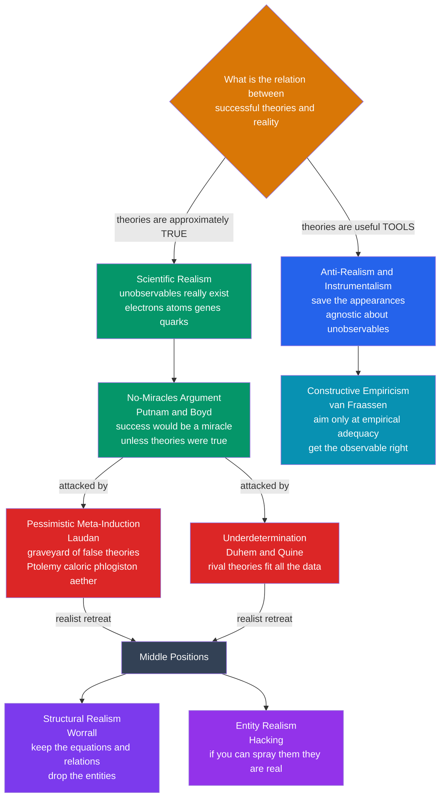

# 🔬 Scientific Realism and Its Critics

> [!abstract] TL;DR
> When a physicist says **"electrons exist,"** are electrons *really there* like tables and chairs — or is "electron" a **useful fiction** that helps us predict what our instruments will read? **Scientific realism** says our best mature theories are *approximately true* and the unobservable entities they posit — electrons, atoms, genes, quarks — **really exist**; scientific progress is convergence on truth. **Anti-realism / instrumentalism** says theories are just **tools for saving the appearances**: get the *observable* right and stay agnostic about the rest. The strongest argument *for* realism is the **no-miracles argument** — the astonishing predictive and technological success of science would be a *miracle* unless its theories were latching onto reality. The strongest argument *against* is the **pessimistic meta-induction** — the history of science is a **graveyard** of once-successful theories now known false (Ptolemaic astronomy, phlogiston, caloric, the luminiferous aether), so *today's* successful theories are probably false too. Sophisticated **middle positions** — **structural realism** ("keep the equations, drop the ontology") and **entity realism** ("if you can spray them, they're real") — try to bank the best of both. This is philosophy of science's deepest question about what our best knowledge *actually means*.

---

## Intuition

**Analogy:** Imagine two engineers who each own a black box that reliably prints tomorrow's weather from today's readings. Both boxes are *astonishingly* accurate. The first engineer opens hers, finds gears and dials, and says: "It works because these parts *mirror the real atmosphere* — the fronts, pressures, and currents out there correspond to the mechanism in here. Nothing else could explain accuracy this good; to deny it is to believe in **miracles**." The second engineer has opened *many* such boxes over the years and reports something sobering: their innards **never** matched reality — each was a clever contraption that happened to work, later replaced by a *wholly different* contraption that worked even better. He trusts the *outputs*, not the *guts*: "Success tells me the box is **empirically adequate**, not that its picture of the hidden machinery is *true*."

Both engineers stare at the same flawless track record and draw *opposite* lessons about what lies behind the observable dials. Swap "black box" for "our best physical theory" and "hidden machinery" for "unobservable entities like electrons and fields," and you have the scientific realism debate — the deepest interpretive question we can ask about science: **does it describe reality, or merely save the appearances?**

---

## How It Works

### Core Mechanics

The whole debate is a duel of **inferences to the best explanation** (IBE) — and *counter*-inferences — over one fact: our best science *works*, spectacularly.

1. **The question.** What is the relationship between **successful scientific theories** and **reality**? Everyone agrees the theories *predict well and power technology*. The fight is over what that success *licenses us to believe* — especially about the **unobservable** entities the theories posit (you cannot see an electron unaided; you infer it).

2. **Scientific realism** (the intuitive default of most working scientists). Standard realism bundles three theses: a **metaphysical** one (there is a mind-independent world with definite structure, *including* unobservables); a **semantic** one (theoretical claims are taken *literally* — "there are electrons" is true or false, not shorthand); and an **epistemic** one (our mature, predictively successful theories are **approximately true**, so belief in their posited entities is *warranted*). Progress is **convergence on truth**: newer theories are closer to reality than older ones.

3. **The no-miracles argument** (Putnam, Boyd — the strongest case *for* realism). Realism "is the only philosophy that does not make the success of science a miracle." A *false* theory making dozens of **precise, novel, successful** predictions — the bending of starlight, the existence of Neptune at specific coordinates, the Higgs boson — would be an *astonishing coincidence*. The best explanation of that success is that the theory got something *right about the world*. **Success is explained by truth.**

4. **Anti-realism / instrumentalism** (the critics). Several varieties:
   - **Instrumentalism** — theories are **calculating devices** for organizing observations; whether they are "true" is a category mistake, like asking if a hammer is "true."
   - **Van Fraassen's constructive empiricism** — the most sophisticated modern version. Science aims not at truth but at **empirical adequacy**: getting the *observable* right ("saving the phenomena"). Accepting a theory means believing only that it is empirically adequate, and staying **agnostic** — not disbelieving — about unobservables. Believing *more* than the observable evidence requires is epistemically reckless.

5. **The pessimistic meta-induction** (Laudan — the strongest case *against* realism). Turn the realist's own history against them. The past is a **graveyard** of theories that were *empirically successful in their day* yet are now regarded as **false**, their central terms non-referring: **Ptolemaic astronomy**, the **crystalline spheres**, the **phlogiston** theory of combustion, the **caloric** theory of heat, the **luminiferous aether**, **Newtonian absolute space**. By straightforward **induction** on that track record, *today's* successful theories are *probably also false* — so success does **not** warrant belief in the truth of a theory or the existence of its entities. Today's electrons may go the way of the aether.

6. **Underdetermination** (a related anti-realist lever). Theories are **underdetermined by evidence**: multiple *incompatible* theories can fit **all** the observations equally well, so evidence alone cannot tell us which is *true* (the **Duhem-Quine** problem). If the data cannot single out the true theory, the unobservable reality is beyond empirical reach.

7. **The middle positions** (banking the best of both):
   - **Structural realism** (Worrall) — what *survives* theory change is not the *entities* but the mathematical **structure** and relations. **Fresnel's equations** of optics survived intact even after the aether that "carried" the light waves was abandoned. Commit to the *structure*, not the ontology: "the equations survive even when the ontology changes."
   - **Entity realism** (Hacking) — believe in the entities you can **manipulate and use as tools**, even while theories about them come and go. *"If you can spray them, they're real"* — when you fire individual electrons at a target to test something *else*, you are treating them as real objects, not fictions.

### Flow / Architecture



---

## Key Concepts

### Secondary — the core split
- **Realism vs. anti-realism.** Realists say our best theories are *approximately true* and their unobservable entities *really exist*; anti-realists say theories are *useful tools* for prediction, and we needn't believe the unobservable story literally.
- **The observable / unobservable line.** *Everyone* is a realist about tables, comets, and the Moon. The fight is only over what we can't see unaided — electrons, curved spacetime, quarks, genes.
- **The two headline arguments.** *For* realism: the **no-miracles argument** (success would be a miracle if theories were false). *Against* it: the **pessimistic meta-induction** (past successful theories were false, so ours probably are too).

### Undergraduate — the machinery of the debate
- **Success explained by truth (IBE).** The no-miracles argument is an *inference to the best explanation* applied to science as a whole. Its persuasive core is **novel** predictive success — predicting something *unexpected and previously unobserved* (Neptune, starlight deflection) seems to require the theory got the world right, not merely curve-fit known data.
- **Constructive empiricism vs. old instrumentalism.** Van Fraassen is *not* the old instrumentalist: he agrees theoretical claims are literally true-or-false. He simply declines to *believe* more than **empirical adequacy** requires, staying **agnostic** (not dismissive) about unobservables.
- **The graveyard, historicized.** The pessimistic meta-induction draws its force from real episodes in *this vault*: the **phlogiston-to-oxygen** switch of [[The_Chemical_Revolution]] and the **aether-to-relativity** switch of [[The_Relativity_Revolution]]. Each dead theory was *predictively successful and research-guiding* in its day.
- **Underdetermination.** The **Duhem-Quine** thesis: evidence never *deductively* forces a single theory, because you always test a *bundle* of hypotheses plus auxiliaries; a failed prediction never says *which* member to blame. Links to [[The_Problem_of_Induction]] and [[Popper_and_Falsification]].

### Graduate — the sophisticated frontier
- **Divide and conquer** (Kitcher, Psillos). The realist's best reply to the meta-induction: distinguish the **working posits** genuinely responsible for a theory's predictive success from the **idle parts**. The parts doing the work (Fresnel's *equations*) were *retained*; only the idle ontology (the *aether*) was dropped — so mature science *does* accumulate truth, just not where the pessimist looks.
- **Structural realism** (Worrall, reviving Poincaré). Keep the no-miracles argument *and* survive the meta-induction by committing only to preserved **mathematical structure**. *Epistemic* structural realism: we know the *relations*, not the intrinsic natures of the relata. *Ontic* structural realism: structure is *all there is* — congenial to quantum field theory, where "particles" are field excitations.
- **Entity realism** (Hacking). Reverse the usual order: commit to *entities* you can **causally manipulate**, and be *anti-realist about theories*. Experimental practice — spraying electrons, building with them — grounds belief better than any high theory.
- **The bad-lot objection** (van Fraassen). IBE tells us to accept the *best available* explanation — but that is only truth-conducive if the *true* theory is in our candidate pool at all. We may just be picking the **best of a bad lot**. This undercuts the no-miracles argument from within.
- **Connection to Kuhn and SSK.** The debate collides with [[Kuhn_and_Scientific_Revolutions]]: if paradigm shifts are **incommensurable**, are theories *converging on truth* at all, or just *changing*? And the **Sociology of Scientific Knowledge** presses harder still — if "facts" are in part *socially constructed*, what is left of realism? Realism functions as the main **bulwark against relativism** in the science wars.

---

## Python Demo

This demo makes the two dueling arguments *quantitative and visual*. **Panel A** renders the **no-miracles** intuition as a rough Bayesian update: as a theory racks up *successful novel predictions*, the probability that it is *at least approximately true* climbs sharply — because a *false* theory getting many precise novel predictions right would be a wild coincidence. **Panel B** renders the **pessimistic meta-induction** as a *graveyard timeline*: historically successful theories plotted from their era of dominance to the moment they were abandoned as false — inductive evidence that *current* successes may share the fate. Requires `numpy` and `matplotlib`.

```python
# The two dueling arguments of the scientific realism debate, quantified.
import numpy as np
import matplotlib.pyplot as plt

# ----- Panel A: the NO-MIRACLES argument as a Bayesian bump -----
# A roughly-true theory yields a correct NOVEL prediction with high prob s_true.
# A false theory getting a precise NOVEL prediction right is a lucky coincidence: s_false.
# After n successful novel predictions, update the odds that the theory is approx-true.
prior_true = 0.30                      # modest prior: theory is approximately true
s_true     = 0.90                      # P(novel prediction succeeds | theory approx-true)
n = np.arange(0, 16)
prior_odds = prior_true / (1.0 - prior_true)

def posterior_true(s_false):
    lr        = (s_true / s_false) ** n         # likelihood ratio over n independent successes
    post_odds = prior_odds * lr
    return post_odds / (1.0 + post_odds)

curves = {0.30: "coincidence is easy  s_false=0.30",
          0.15: "coincidence is hard  s_false=0.15",
          0.05: "coincidence is a miracle  s_false=0.05"}

# ----- Panel B: the PESSIMISTIC META-INDUCTION as a graveyard timeline -----
# (theory, year it became dominant, year it was abandoned as false, what killed it)
graveyard = [
    ("Crystalline celestial spheres", -350, 1610, "telescope, Kepler"),
    ("Ptolemaic geocentric astronomy",  150, 1600, "Copernicus, Kepler"),
    ("Effluvial theory of electricity", 1600, 1750, "Franklin's fluid"),
    ("Phlogiston theory of combustion", 1700, 1785, "Lavoisier, oxygen"),
    ("Caloric theory of heat",          1770, 1850, "thermodynamics"),
    ("Newtonian absolute space+time",   1687, 1905, "special relativity"),
    ("Luminiferous aether",             1820, 1905, "Einstein, Michelson-Morley"),
]

fig, (axA, axB) = plt.subplots(2, 1, figsize=(11, 9))

# --- Panel A plot ---
for s_false, label in curves.items():
    axA.plot(n, posterior_true(s_false), "o-", lw=2, label=label)
axA.axhline(prior_true, color="#94a3b8", ls="--", lw=1.5,
            label=f"prior P(true) = {prior_true:.2f}")
axA.annotate("the no-miracles bump:\nsuccess sharply raises\nP(theory approx-true)",
             xy=(6, 0.9), xytext=(7.5, 0.55), fontsize=9,
             arrowprops=dict(arrowstyle="->", color="#334155"))
axA.set_xlabel("Number of successful NOVEL predictions")
axA.set_ylabel("P(theory approximately true | successes)")
axA.set_title("Panel A — No-Miracles Argument: predictive success pushes belief toward truth")
axA.set_ylim(0, 1.02)
axA.grid(True, ls=":", alpha=0.4)
axA.legend(loc="lower right", fontsize=8)

# --- Panel B plot ---
now = 2026
for i, (name, born, died, killer) in enumerate(graveyard):
    axB.barh(i, died - born, left=born, height=0.55,
             color="#2563eb", alpha=0.85, zorder=2)          # era of empirical success
    axB.plot(died, i, "X", color="#dc2626", ms=13, zorder=3) # moment of abandonment
    axB.text(born - 40, i, name, ha="right", va="center", fontsize=8.5)
    axB.text(died + 25, i, f"false: {killer}", ha="left", va="center",
             fontsize=7.5, color="#dc2626")
axB.axvline(now, color="#059669", ls="--", lw=1.5)
axB.text(now - 30, len(graveyard) - 0.4, "today's\nsuccessful theories?",
         ha="right", va="top", fontsize=8.5, color="#059669")
axB.set_yticks([])
axB.set_xlim(-600, 2300)
axB.set_xlabel("Year   (negative = BCE)   —   blue bar = era of empirical success, red X = shown false")
axB.set_title("Panel B — Pessimistic Meta-Induction: the graveyard of successful-but-false theories")

# The tension, printed:
print("NO-MIRACLES: after 8 successful novel predictions, with s_false=0.05,")
print(f"   P(approx-true) rises from {prior_true:.2f} to {posterior_true(0.05)[8]:.3f}")
print("META-INDUCTION: yet every theory below was ALSO empirically successful --")
print(f"   {len(graveyard)} of {len(graveyard)} on this list were later shown false.")
print("The realism debate lives in the tension between these two facts.")

plt.tight_layout()
plt.savefig("scientific_realism_debate.png", dpi=120)
plt.show()
```

Running it prints the tension in one breath: the no-miracles update drives `P(approx-true)` from 0.30 up past 0.99 after only a handful of successful novel predictions — *yet* every theory in the graveyard cleared exactly that bar in its own day and was still overthrown. Panel A is the realist's optimism curve; Panel B is the anti-realist's cemetery. The debate is the argument over which panel governs *our* theories.

---

## Real-World Applications

- **Interpreting frontier physics.** Whether the **quark** or the **Higgs field** or **10-dimensional strings** are "real" versus "useful bookkeeping" is a *live* version of this debate among physicists themselves — string theory's decades without novel confirmed predictions is exactly the realist's uneasy case. See [[The_Quantum_Revolution]].
- **Medicine and unobservable mechanisms.** Does a drug work *because* it binds a real receptor, or is "receptor" a model that predicts dose-response? Realism about mechanisms shapes how much we extrapolate from models to *new* patients and conditions.
- **Structural continuity in theory change.** Engineers still use **Newtonian mechanics** for bridges and orbits though it is *strictly false* — a daily vindication of structural realism (the *equations* remain accurate in their domain even after the *ontology* of absolute space died). See [[Newtonian_Mechanics_and_the_Principia]].
- **Machine-learning models as instruments.** A deep network can predict superbly while being *uninterpretable* — a modern, sharp instance of instrumentalism: empirically adequate, ontologically opaque. The realism debate reframes the whole "predictive accuracy vs. mechanistic understanding" tension in ML.
- **Guarding against relativism.** In science-education and public-trust contexts, realism is the reasoned answer to "it's all just theories / social construction," while anti-realism tempers naive claims that "science reads reality straight off nature." Both correctives matter.

---

## Common Pitfalls

- **"Realism = certainty that theories are exactly true."** No. Realists claim *approximate* truth and remain fallibilists. The thesis is about *warranted belief*, not proof — the meta-induction attacks the inference *from success to truth*, not science's success itself.
- **"Anti-realists deny unobservables exist / say theoretical terms are meaningless."** Wrong for the serious version. Van Fraassen's constructive empiricism takes theories *literally* and stays *agnostic* about unobservables — he declines to *believe* more than empirical adequacy requires, he does not *disbelieve*.
- **"The pessimistic meta-induction shows science doesn't work."** It shows past *successful* theories were false — which *presupposes* they worked. It targets realism's *interpretation* of success, not the success.
- **"Unobservable just means very small or far away."** The line is about what a suitably placed human could observe *unaided*; it is famously vague — microscopes? Jupiter's moons through a telescope? — which is itself the standard objection to constructive empiricism.
- **"The no-miracles argument is a knockdown proof."** It is itself an inference to the best explanation, so it inherits IBE's vulnerabilities — van Fraassen's *bad-lot* objection and the charge of **circularity** (using scientific-style reasoning to justify trusting scientific reasoning).
- **"Structural realism is a free lunch."** Newman's objection: "we know only the structure" risks collapsing into a near-trivial cardinality claim unless you can say *which* structure is real — specifying that is the hard, unfinished part.

---

## Related Concepts

The other notes of this section — a *Philosophy of Science overview*, an *Induction, Falsification and Popper* deep-dive, a *Kuhn, Paradigms and Scientific Revolutions* deep-dive, a *Lakatos, Feyerabend and Beyond* note, and *The Sociology of Scientific Knowledge* — are planned but not yet written and are referenced here in prose only. The wikilinks below point to **verified** notes elsewhere in the vault:

- [[Scientific_Realism]] — the Philosophy-vault companion; the analytic-philosophy treatment of the *same* debate (this note is the history-of-science deep-dive that historicizes it). Start there for van Fraassen's semantics and the divide-and-conquer reply in detail.
- [[Kuhn_and_Scientific_Revolutions]] — incommensurability and paradigm shifts supply the historical fuel for the pessimistic meta-induction and challenge "convergence on truth."
- [[The_Problem_of_Induction]] — the meta-induction *is* an induction, and underdetermination is inductive slack at the theory level; realism inherits induction's fragility.
- [[Popper_and_Falsification]] — Popper was a *realist* (theories aim at truth / verisimilitude) yet an anti-inductivist; a sharp contrast case for how realism and method combine.
- [[Explanation_and_Laws_of_Nature]] — realism about unobservables travels with realism about laws and causal structure; IBE is the shared engine.
- [[The_Chemical_Revolution]] — the **phlogiston-to-oxygen** switch: a canonical graveyard case where a successful theory's central entity turned out not to exist.
- [[The_Relativity_Revolution]] — the **aether-to-relativity** switch: the structural realist's favorite case (Fresnel's equations survived; the aether did not).
- [[Newtonian_Mechanics_and_the_Principia]] — the theory whose *approximate* survival in its domain, despite being strictly false, is daily evidence for structural realism.
- [[The_Quantum_Revolution]] — where the realism-about-unobservables question becomes physically urgent: are wavefunctions and fields *real*, or instruments?
- [[History_of_Science_Overview]] — the vault entry point; frames the "cumulative vs. revolutionary" question that this debate answers metaphysically.
- **Cross-vault:** [[Universals_and_Realism]] (the *general* metaphysical realism debate that scientific realism specializes) and [[Scientific_Method_and_Empiricism]] (the empiricist roots of the anti-realist stance).

---

## Review Questions

1. **(Secondary)** A physicist says "electrons exist." Explain, using the black-box analogy, how a *realist* and an *instrumentalist* would each interpret that sentence differently — and what observable fact they *both* agree on.
2. **(Undergraduate)** State the **no-miracles argument** and the **pessimistic meta-induction** precisely. Explain how they can *both* be inferences to the best explanation pointing in *opposite* directions, and use the fate of the **luminiferous aether** to illustrate the pessimist's case.
3. **(Graduate)** Structural realism claims to survive *both* the meta-induction *and* the no-miracles argument. Using the **Fresnel-to-Maxwell** transition, explain how it is engineered to do this, then state the **Newman objection** and assess whether it makes structural realism collapse into triviality. How does the "divide and conquer" reply differ in strategy?

---

## Sources

- van Fraassen, B. C. (1980). *The Scientific Image*. Oxford University Press.
- Laudan, L. (1981). "A Confutation of Convergent Realism." *Philosophy of Science*, 48(1), 19–49.
- Putnam, H. (1975). *Mathematics, Matter and Method* (the no-miracles formulation). Cambridge University Press.
- Worrall, J. (1989). "Structural Realism: The Best of Both Worlds?" *Dialectica*, 43(1–2), 99–124.
- Hacking, I. (1983). *Representing and Intervening*. Cambridge University Press. / Chakravartty, A. (2017). "Scientific Realism," *Stanford Encyclopedia of Philosophy*.

---

#history-of-science #scientific-realism #instrumentalism #no-miracles #pessimistic-meta-induction
