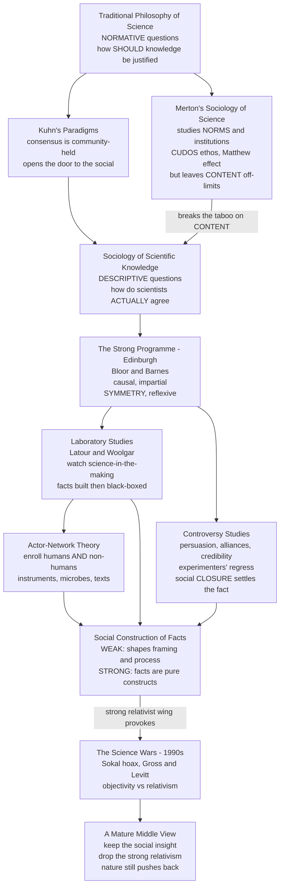

# 🔬 The Sociology of Scientific Knowledge

> [!abstract] TL;DR
> The **Sociology of Scientific Knowledge (SSK)** and the broader field of **science studies** turned science into an object of **anthropological fieldwork**: instead of asking the philosopher's *normative* question — how *should* science reason its way to truth — they asked the *descriptive* one — how do scientists **actually** come to **agree** on what counts as a fact? The answers were provocative. The **Strong Programme** (Bloor and Barnes, Edinburgh) demanded that *all* beliefs, true and false alike, be explained by the **same** social causes (the **symmetry principle**). **Laboratory studies** (Latour and Woolgar) watched fact-making up close and described "facts" as **socially constructed** achievements that harden into unquestioned **black boxes** once a controversy **closes**. **Actor-network theory** extended the cast to include instruments and microbes. And **controversy studies** showed that disputes are settled by **persuasion, credibility, alliances, and funding** as much as by decisive data — the **experimenters' regress** meaning the data are rarely decisive on their own. The radical, relativist wing of this program — the claim that facts are *nothing but* social constructs — ignited the **science wars** of the 1990s, complete with the **Sokal hoax**. The lasting lesson is a mature middle: science is genuinely a **social practice**, yet nature still **pushes back**, so the social insight can be kept **without** the relativism.

---

## Intuition

**Analogy:** Traditional philosophy of science was like a **judge writing rules of evidence** — laying down, in the abstract, how a rational mind *ought* to weigh proof to arrive at the truth. The sociologists of scientific knowledge did something completely different: they walked into the lab like an **anthropologist dropping into an unfamiliar tribe**, notebook in hand, and simply *watched what the natives did* — which claims they trusted, whom they cited, how they argued at the coffee machine, what a grant reviewer wanted, which experiment everyone agreed had "worked" and why. They were not asking *how science should reach truth*. They were asking a stranger, more empirical question: **how does this community actually manufacture agreement?**

What they saw was unsettling to the tidy textbook picture. A raw result does not walk in and announce itself as a **fact**. It becomes a fact only after it survives a **social gauntlet** — replication attempts, citations, peer scrutiny, the backing of credible people, the closing of a controversy in which one side out-argued, out-funded, and out-allied the other. This is illuminating: it explains the *messy human process* by which scientific consensus is really built. It is also provocative: if facts are made through **negotiation and persuasion**, does emphasizing science's social side merely *explain how it works* — or does it *explain away* science's claim to describe an objective world? That double edge is the whole story of SSK.

---

## How It Works

### From normative philosophy to descriptive sociology

Classical philosophy of science (Popper, Carnap, the logical empiricists) was **normative and prescriptive**: it asked how knowledge is *justified*, how theories *should* be tested, and how to *demarcate* science from pseudoscience — see [[Philosophy_of_Science_Overview]], [[Scientific_Method_and_Empiricism]], and [[Induction_Falsification_and_Popper]]. SSK made a hard turn to the **descriptive and sociological**: forget for a moment how science *ought* to work; go find out how, as a matter of observable social fact, scientists **actually** reach agreement, and how **social factors** — interests, institutions, careers, credibility, power, and money — shape what ends up counted as knowledge. The pivot was licensed by [[Kuhn_Paradigms_and_Scientific_Revolutions]]: once Kuhn had reframed a **paradigm** as something a *community* holds and defends, and scientific change as partly a matter of persuasion and generational turnover, the door was open to treating the **content** of science itself as a sociological object.

### Merton's gentler sociology — and the taboo SSK broke

There had long been a sociology *of* science. Robert **Merton** (from the 1940s) studied science's **institutions, norms, and reward systems**: the ideal **CUDOS ethos** — Communalism, Universalism, Disinterestedness, Organized Skepticism — the priority races, and the **Matthew effect** by which credit accrues to the already-eminent (all covered in [[Scientific_Institutions_and_Societies]]). But Mertonian sociology observed a strict **taboo**: it studied the *social surroundings* of science while treating the **content** of scientific knowledge — the actual facts and theories — as **off-limits**, to be explained only by nature and reason. SSK's founding gesture was to **break that taboo**: if the sociologist can explain why a lab is organized as it is, why not also explain *why its members believe what they believe about nature itself*?

### The Strong Programme — symmetry

The **Edinburgh school** (David **Bloor**, Barry **Barnes**) issued the most radical version in Bloor's four tenets. A properly scientific sociology of knowledge must be:

1. **Causal** — explain beliefs by the conditions (social, psychological, and other) that *bring them about*.
2. **Impartial** — study truth and falsity, rationality and irrationality, success and failure **even-handedly**; all require explanation.
3. **Symmetrical** — use the **same kinds of cause** to explain both true and false beliefs. You may **not** explain accepted science by saying "it's just true / rational" while explaining rejected science by "social bias." That double standard smuggles in the very verdict you are supposed to investigate.
4. **Reflexive** — the same explanatory patterns apply to sociology itself.

The **symmetry principle** is the heart of it, and its most controversial move: knowledge is to be treated as a **social product** whose acceptance is explained the same way whether we now regard it as right or wrong. (The Python demo below operationalizes exactly this even-handed stance — beliefs update from evidence *and* social forces regardless of which side is "correct.")

### Laboratory studies — watching facts get built

In **_Laboratory Life_** (1979), Bruno **Latour** and Steve **Woolgar** embedded for two years in a Salk Institute endocrinology lab and reported like ethnographers. Their striking claim: scientists mostly produce **inscriptions** — traces, graphs, spectrometer readouts, tables — and a statement climbs a ladder of **facticity** from a hedged conjecture ("it is possible that…") to a bald, un-attributed **fact** ("X is Y") as it accumulates support and sheds the modalities that mark it as someone's claim. A stabilized fact becomes a **black box** — a settled result no one bothers to re-open — and its *social* history of construction is then forgotten precisely *because* it succeeded. Facts, on this view, are a **social achievement**, not a delivery from nature received passively.

### Actor-network theory — enrolling humans and things

Latour's later **actor-network theory (ANT)** extended symmetry to **non-humans**. Knowledge, for ANT, is built by assembling **heterogeneous networks** in which humans *and* things — instruments, reagents, microbes, funding bodies, texts — are **enrolled** as allies. Pasteur did not simply *discover* microbes; he built a laboratory network that let the microbes **act** in ways that convinced others. Science is **network-building**: a claim is strong when its network is dense and hard to dispute, weak when rivals can unpick the alliances. ANT is enormously influential and endlessly contested — critics charge it dissolves the line between people and things and between describing and endorsing.

### Controversy studies, closure, and the experimenters' regress

A signature method is to study a **controversy before it closes** — while the outcome is still live and the social machinery is visible. Harry **Collins** showed that whether an experiment "worked" is itself **negotiable**: to know your apparatus is detecting real gravitational waves you need a *correct* theory of what a good detector does — but that theory is exactly what the experiment was supposed to settle. This circle is the **experimenters' regress**. Because the data alone cannot break it, closure is reached **socially** — by persuasion, alliance-building, the credibility of the people involved, control of key journals, and funding — until one side's account becomes the taken-for-granted fact and the controversy is declared over.



### The spectrum of social construction

The single greatest source of confusion in this whole debate is failing to distinguish two very different claims:

- **Weak / moderate constructivism** — social factors shape *which* problems get chosen, *which* methods and framings prevail, *who* is believed, and the *process* by which consensus is reached. This is widely accepted, richly documented, and genuinely illuminating.
- **Strong / radical constructivism** — scientific facts are *entirely* social constructs with **no privileged claim** to describe a mind-independent reality; nature drops out as an explanation. This is the controversial thesis that verges on **relativism**.

Much of the heat in the field, and nearly all of the science wars, comes from **conflating** the modest, defensible weak thesis with the provocative strong one.

### The science wars

In the 1990s the tension exploded. Scientists and mathematicians — notably Paul **Gross** and Norman **Levitt** in *Higher Superstition*, and physicist Alan **Sokal** — attacked postmodern science studies as **relativist nonsense** that denied objective truth and misused scientific concepts. Sokal's **hoax** (1996) submitted a deliberately bogus, jargon-stuffed paper — "Transgressing the Boundaries: Towards a Transformative Hermeneutics of Quantum Gravity" — to the cultural-studies journal *Social Text*, which published it, whereupon Sokal revealed the sting. SSK scholars replied that they study the **process** by which science reaches its findings, not deny the findings themselves — and that their opponents were attacking a **caricature**. The exchange was heated, frequently uncharitable on both sides, and it hardened into a lasting cultural fault line about **objectivity versus social construction**. (The politics of this — how science-studies rhetoric can be weaponized, e.g. by manufactured "doubt" campaigns — belongs to the planned sibling *The Ethics and Politics of Science*.)

---

## Key Concepts

### Secondary — the core idea

- **Sociology of Scientific Knowledge (SSK)** — the study of how **social factors** shape scientific knowledge **itself**, not just its surroundings.
- **Descriptive vs normative** — SSK asks how scientists *do* reach agreement, not how they *should* reason.
- **Social construction of facts** — a scientific "fact" is an *achievement* produced through practice, negotiation, and community acceptance, not a passive readout from nature.
- **Black box** — a result so settled that no one re-opens it; its constructed history is forgotten precisely because it worked.

### Undergraduate — the programs and methods

- **Merton's CUDOS** — the earlier, gentler sociology that studied science's **norms** while treating its **content** as beyond sociology's reach; SSK broke that taboo (see [[Scientific_Institutions_and_Societies]]).
- **The Strong Programme** — Bloor's four tenets: **causality, impartiality, symmetry, reflexivity**.
- **The symmetry principle** — explain **true and false** beliefs by the **same kinds** of social cause; do not credit accepted science to "truth" and rejected science to "bias."
- **Laboratory studies** — ethnography of "science-in-the-making"; Latour and Woolgar's inscriptions and the ladder of facticity.
- **Controversy and closure** — studying disputes *before* they settle reveals the social processes (persuasion, credibility, alliances, funding) that decide the winner.
- **Weak vs strong constructivism** — social factors *shape* science (defensible) vs facts are *nothing but* constructs (controversial).

### Graduate — the deep debates

- **Actor-network theory (ANT)** — symmetry extended to non-humans; knowledge as heterogeneous **network-building**; enrolment, translation, obligatory passage points; its blurring of the human/non-human and describe/endorse boundaries.
- **The experimenters' regress** (Collins) — you need a working theory to know an experiment worked, and a working experiment to confirm the theory; the circle is broken **socially**, not by data alone.
- **Interests explanations** — Barnes and MacKenzie's accounts linking theory choice (e.g. statistical methods, biometry) to the **social interests** of the groups adopting them, and the charge of reductionism against them.
- **Reflexivity and the "tu quoque"** — if all knowledge is socially caused, so is SSK's own; how (or whether) the program escapes self-refutation.
- **The realist rejoinder and the "science wars"** — nature's **recalcitrance** (experiments fail; bridges fall down) as evidence the world constrains belief; structural realism and the "no-miracles" argument (see [[Scientific_Realism_and_Its_Critics]]) against strong constructivism.
- **From SSK to STS** — how the field broadened into **Science, Technology and Society**, feeding science policy, expertise studies, and public understanding of science.

---

## Python Demo

We model the central SSK claim as a system: a scientific community reaching **consensus is a social process**, driven by **both evidence and social influence**. Each of `N` scientists holds a **belief** in a contested claim (a number from 0 to 1). Every round, each scientist nudges their belief from two forces: a noisy **evidence** signal (nature pushing back — the strength `alpha`) and a **credibility-weighted, bounded-confidence** social pull toward the beliefs of peers they *listen to* (conformity strength `beta`, tolerance `conf_bound`). Bounded confidence means a scientist mainly absorbs the views of peers whose beliefs are already **close** to theirs, so tight silos can sustain a **controversy** where camps ignore each other. We run four regimes to show that consensus, groupthink, entrenched controversy, and **controversy-then-closure** all emerge from the *interaction* of evidence and social factors — exactly the Strong Programme's **symmetric** treatment of belief. Requires `numpy` and `matplotlib`.

```python
# Consensus as a SOCIAL process: scientists update beliefs from BOTH
# noisy evidence AND credibility-weighted, bounded-confidence peer influence.
# We show consensus, social lock-in, entrenched controversy, and closure.
import numpy as np
import matplotlib.pyplot as plt

rng = np.random.default_rng(7)

N   = 60      # scientists in the community
T   = 140     # rounds of debate and evidence
eta = 0.5     # overall update rate

# Credibility: a few highly-cited authorities, most ordinary voices.
credibility = rng.uniform(0.3, 1.0, N)
credibility[:3] = 1.0          # three high-credibility figures

# A live controversy: two schools of thought (camps near 0.35 and 0.65).
init = np.clip(np.concatenate([
    rng.normal(0.35, 0.06, N // 2),
    rng.normal(0.65, 0.06, N // 2)]), 0, 1)
camp = init < 0.5              # remember each scientist's starting camp

def simulate(conf_bound, beta, evidence, alpha,
             shock_t=None, shock_val=None, shock_alpha=None):
    """Agent-based opinion dynamics over T rounds.
    conf_bound : how far a peer's belief may differ and still be heard.
    beta       : strength of social conformity.
    evidence   : where the (noisy) evidence signal points, 0..1.
    alpha      : strength of the evidence pull.
    shock_*    : optional decisive NEW experiment arriving at round shock_t."""
    B = np.zeros((T + 1, N))
    B[0] = init.copy()
    for t in range(T):
        b = B[t]
        E, a = evidence, alpha
        if shock_t is not None and t >= shock_t:      # closure event
            E, a = shock_val, shock_alpha
        # Evidence term: nature pushes back, but noisily / ambiguously.
        evid_pull = a * (np.clip(E + rng.normal(0, 0.05, N), 0, 1) - b)
        # Social term: bounded-confidence, credibility-weighted peer mean.
        social_pull = np.zeros(N)
        for i in range(N):
            heard = np.abs(b - b[i]) <= conf_bound     # whom i actually listens to
            w = credibility * heard
            if w.sum() > 0:
                social_pull[i] = beta * (np.sum(w * b) / w.sum() - b[i])
        B[t + 1] = np.clip(b + eta * (evid_pull + social_pull), 0, 1)
    return B

regimes = {
    "A. Open-minded + decisive evidence\n-> evidence-led consensus":
        dict(conf_bound=0.50, beta=0.6, evidence=0.80, alpha=0.50),
    "B. High conformity + weak evidence\n-> social lock-in (groupthink)":
        dict(conf_bound=0.60, beta=0.9, evidence=0.50, alpha=0.05),
    "C. Siloed camps + weak evidence\n-> entrenched controversy":
        dict(conf_bound=0.12, beta=0.7, evidence=0.50, alpha=0.05),
    "D. Siloed camps + new credible experiment\n-> controversy CLOSES":
        dict(conf_bound=0.12, beta=0.7, evidence=0.50, alpha=0.05,
             shock_t=70, shock_val=0.85, shock_alpha=0.7),
}

fig, axes = plt.subplots(2, 2, figsize=(13, 9))
for ax, (title, params) in zip(axes.ravel(), regimes.items()):
    B = simulate(**params)
    for i in range(N):                                  # one thin line per scientist
        ax.plot(B[:, i], color=("#2166ac" if camp[i] else "#b2182b"),
                alpha=0.35, lw=0.8)
    if "shock_t" in params:                             # mark the closure event
        ax.axvline(params["shock_t"], color="green", ls="--", lw=1.4)
        ax.text(params["shock_t"] + 2, 0.05, "new experiment",
                color="green", fontsize=8)
    spread = B[-1].std()                                # final disagreement
    ax.set_title(f"{title}\nfinal spread (std) = {spread:.3f}", fontsize=9)
    ax.set_xlabel("round of debate"); ax.set_ylabel("belief in the claim (0..1)")
    ax.set_ylim(-0.02, 1.02); ax.grid(alpha=0.25)
    print(f"{title.splitlines()[0]:<40} final std = {spread:.3f}")

fig.suptitle("Consensus is a social process: evidence + social influence "
             "-> agreement, groupthink, or controversy", fontsize=12)
fig.tight_layout(rect=[0, 0, 1, 0.97])
plt.savefig("ssk_consensus_dynamics.png", dpi=120)
print("\nSaved figure: ssk_consensus_dynamics.png")
```

Reading the four panels tells the SSK story in one figure. In **A**, an open community facing decisive evidence converges cleanly on the evidence-backed value — closure *tracks reality*. In **B**, strong conformity with only weak evidence collapses both camps onto their credibility-weighted average — a **social lock-in** (groupthink) that would form *regardless of whether the claim is true*. In **C**, tight silos plus ambiguous evidence sustain a **persistent controversy**: two camps talk past each other and never converge (large final spread). In **D**, the same deadlocked controversy is broken when a **new credible experiment** arrives at round 70 and pulls everyone to a single consensus — a **controversy-to-closure** transition driven by evidence overcoming the social divide. The demo enacts the Strong Programme's **symmetry**: the *same* update rule produces belief in true and false claims alike — what differs is the **social parameters**, not a special "truth force" reserved for the correct answer.

---

## Real-World Applications

- **Science policy and expertise.** SSK and its descendant **STS** underpin how governments handle contested expert knowledge — GMOs, nuclear risk, vaccines, pandemics — recognizing that public trust turns on **credibility and institutions**, not data alone.
- **Understanding manufactured controversy.** The tools of controversy analysis illuminate how **doubt is engineered**: tobacco and, later, **climate-change denial** exploited the fact that "the science isn't settled" is a *social* claim about closure — see [[Ecology_and_Environmental_Science]] on the climate consensus. SSK explains the mechanism *without* endorsing the relativism deniers weaponize.
- **Science communication.** Recognizing consensus as socially built — through replication, credibility, and institutions — grounds better public messaging about *why* a scientific consensus deserves trust.
- **The replication crisis.** SSK's insistence that "did the experiment work?" is partly a **community judgment** (the experimenters' regress) reframes reproducibility debates in psychology and biomedicine as social as well as statistical problems (see [[Scientific_Institutions_and_Societies]]).
- **Design of AI and algorithmic knowledge systems.** STS-informed work on how **classification, benchmarks, and "ground truth" are socially constructed** feeds directly into debates over algorithmic bias, dataset provenance, and what counts as machine "objectivity."
- **History and teaching of science.** Contextualist history (see [[History_of_Science_Overview]]) uses SSK to reconstruct why past communities found now-discarded theories reasonable, curing the whig habit of judging the past by present verdicts.

---

## Common Pitfalls

- **Conflating weak and strong constructivism.** By far the most common error. "Social factors shape science" (true and important) is *not* "facts are only social constructs" (contentious relativism). Critics attack the strong thesis; most working SSK relies on the weak one. Keep them apart.
- **Reading symmetry as "there is no truth."** The **symmetry principle** is a *methodological* rule — do not *pre-judge* which beliefs are correct when explaining their acceptance. It is a stance about **explanation**, not a metaphysical denial of reality.
- **Treating "constructed" as "arbitrary" or "false."** A socially constructed fact can be **robust, reliable, and about the real world**. Construction describes *how it was established*, not that it is fake — a constant misreading in the science wars.
- **Forgetting that nature pushes back.** Strong relativism that gives evidence **no** role is untenable: experiments fail, bridges fall, planes fly. A defensible SSK grants the world a vote even while studying the social process.
- **The reflexivity trap.** If *all* knowledge is merely social, so is SSK's own — the self-refutation charge. Serious practitioners must own this rather than exempt themselves.
- **Caricaturing either side of the science wars.** Not all scientists are naive objectivists and not all science-studies scholars are relativists. Straw-manning kept the "wars" hot long after the substantive middle ground was clear.

---

## Related Concepts

- [[Kuhn_Paradigms_and_Scientific_Revolutions]] — reframed the paradigm as **community-held**, opening the door SSK walked through; the direct intellectual ancestor.
- [[Philosophy_of_Science_Overview]] — the **normative** philosophy of science whose descriptive, sociological counterpart this note supplies.
- [[Induction_Falsification_and_Popper]] — the falsificationist ideal SSK set aside to ask how scientists *actually* argue and close controversies.
- [[Lakatos_Feyerabend_and_Beyond]] — the philosophical bridge: Lakatos's research programmes and especially **Feyerabend's** "anything goes" prefigure SSK's turn against a single fixed method.
- [[Scientific_Realism_and_Its_Critics]] — the realist rejoinder to strong constructivism; whether the community's validation machinery tracks a mind-independent world.
- [[Scientific_Institutions_and_Societies]] — **Merton's CUDOS**, peer review, and the social construction of experimental "matters of fact" (Shapin and Schaffer); the institutional half of the story SSK radicalized.
- [[Scientific_Method_and_Empiricism]] — the empirical, evidence-first ideal whose *actual social practice* laboratory studies dissected.
- [[History_of_Science_Overview]] — the parent survey; SSK is the sociological wing of its "philosophy and sociology of science" section.
- [[Ecology_and_Environmental_Science]] — the climate-consensus case where distinguishing genuine social construction from manufactured "controversy" matters most.
- [[Sociology_of_Knowledge_and_Science]] — the Sociology-vault companion (Mannheim, Berger and Luckmann, Latour, ANT); the deep sociological theory behind this note.
- [[Contemporary_Sociological_Theory]] — situates ANT and constructivism within late-20th-century social theory.
- [[Symbolic_Interactionism_and_Microsociology]] — the micro-sociological tradition of meaning-making that laboratory ethnography drew on.
- [[Culture_Norms_Values_and_Ideology]] — the sociology of ideology behind "interests" explanations of theory choice.

*Planned History-of-Science siblings referenced above in prose — Science, Technology and Society, The Ethics and Politics of Science, and The Reach and Future of Science — are on this vault's roadmap but not yet written.*

---

## Review Questions

1. **(Secondary)** The note says a scientific "fact" is a **social achievement**, not a passive readout from nature. Using the idea of a **black box**, explain what it means to say a result's "constructed history is forgotten precisely because it succeeded." Give one everyday example of a settled fact you never re-check.
2. **(Undergraduate)** State the **symmetry principle** of the Strong Programme and explain why forbidding the move "accepted science is explained by *truth*, rejected science by *social bias*" is central to it. Then connect this to the Python demo: in which regime does the community lock onto a consensus that would form *regardless of whether the claim is true*, and what does that show about consensus as a social process?
3. **(Graduate)** The **science wars** turned on conflating **weak** and **strong** social constructivism. Reconstruct the strongest version of *each*, explain how the **experimenters' regress** supports the constructivist case, and then state the realist rejoinder that "nature pushes back." Defend a **mature middle** position: precisely which SSK insights survive, which relativist claim you reject, and why the distinction matters for interpreting a contemporary consensus such as climate science.

---

## Sources

- Bloor, David. *Knowledge and Social Imagery* (2nd ed.). University of Chicago Press, 1991 (orig. 1976). — The Strong Programme and the four tenets, including symmetry.
- Latour, Bruno & Woolgar, Steve. *Laboratory Life: The Construction of Scientific Facts.* Princeton University Press, 1986 (orig. 1979). — The founding laboratory ethnography; inscriptions, facticity, and black boxes.
- Collins, Harry M. *Changing Order: Replication and Induction in Scientific Practice.* SAGE, 1985. — The experimenters' regress and controversy closure.
- Sokal, Alan & Bricmont, Jean. *Fashionable Nonsense: Postmodern Intellectuals' Abuse of Science.* Picador, 1998. — The critics' side of the science wars and the Sokal hoax.
- Sismondo, Sergio. *An Introduction to Science and Technology Studies* (2nd ed.). Wiley-Blackwell, 2010. — A balanced survey of SSK, ANT, and the field's trajectory.

---

#history-of-science #sociology-of-science #social-construction #strong-programme #science-wars
