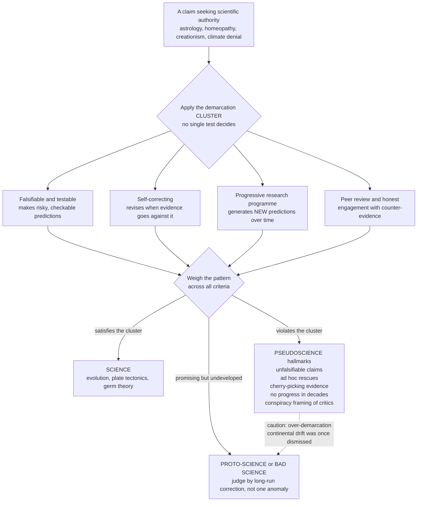

# 🔮 Pseudoscience and the Demarcation Problem

> [!abstract] TL;DR
> **Astrology, homeopathy, flat-earth, and creationism** all borrow the costume of science — they use technical-sounding jargon, cite "evidence," publish "journals," and command devoted followers. So how do you tell the **real thing from the impostor?** The **demarcation problem** is the deceptively hard philosophical question of what, if anything, separates genuine **science** from **pseudoscience**, non-science, or metaphysics. It turns out there is **no single, sharp, universally agreed criterion** — Popper's **falsifiability** is a powerful first cut but not sufficient on its own. What works better is a **cluster of hallmarks**: real science makes *risky, testable predictions*, *self-corrects* in light of evidence, *progresses*, and *engages honestly with disconfirmation*; pseudoscience makes *unfalsifiable claims*, deploys *ad hoc rescues*, *cherry-picks*, *stagnates*, and frames critics as a *suppressive conspiracy*. Getting this line right has **life-and-death stakes** — medicine versus quackery, climate science versus manufactured doubt, evolution versus creationism in schools, admissible expert testimony in court — while over-applying the label risks dismissing legitimate heterodoxy (continental drift was once "pseudoscience"). Critical, evidence-based demarcation is one of the **most practically important skills** the history and philosophy of science offer.

---

## Intuition

**Analogy:** Imagine a **counterfeit banknote** so good it fools the eye — the right paper feel, a plausible watermark, an official-looking serial number. You cannot always tell a fake from a real bill by a *single* feature; a clever forger can copy any one of them. But hold it up to the light, tilt it, check the microprinting, feel the raised ink, run the UV pen — and the forgery fails a **whole cluster of tests at once.** No single test is decisive, yet the *pattern* of failures is unmistakable. **Pseudoscience is a counterfeit of science**, and demarcation is the bank teller's practiced eye: not one magic test, but a checklist of tells that, taken together, expose the fake.

Here is the sharper version of the problem. Astrology cites "thousands of years of accumulated observation." Homeopathy speaks of "potentization" and "molecular memory." Creationism runs conferences and calls itself "creation *science*." Each *sounds* scientific and each has passionate defenders who point at "evidence." If you cannot articulate **what actually makes real science trustworthy**, you have no principled way to answer the parent who wants intelligent design taught in biology class, the patient choosing sugar pills over chemotherapy, or the policymaker weighing "both sides" of a manufactured climate "debate." Drawing this line is not an academic parlor game — it is the difference between **medicine and quackery, evidence and denial, expertise and its imitation.**

---

## How It Works

### The demarcation problem: why it is hard

**Demarcation** asks: *what distinguishes genuine science from pseudoscience, non-science, or metaphysics?* The question is ancient (Aristotle contrasted *episteme* with mere opinion) but became urgent in the twentieth century when the **logical positivists** tried to make "scientific" mean **empirically verifiable** — and failed, because universal laws can never be conclusively verified (see [[Induction_Falsification_and_Popper]]). **Karl Popper** offered the most famous replacement: a theory is scientific only if it is **falsifiable** — if some possible observation could prove it wrong. Astrology and certain readings of Marxism and Freud, he argued, are pseudoscientific because they are compatible with *any* outcome and so forbid nothing.

Falsifiability is a genuine advance, but it is **not a clean single line**:

1. **Some real science is not easily falsified in isolation.** The **Duhem–Quine thesis** shows any prediction rests on auxiliary assumptions; a failed test never points cleanly at *the* hypothesis, so you can usually rescue a core claim by blaming the apparatus.
2. **Some falsified claims are not pseudoscience.** Newtonian mechanics made predictions later shown wrong (Mercury's perihelion), yet it was superb science, not quackery. Being *wrong* is not the same as being *pseudo*.
3. **Some pseudoscience makes testable predictions — and simply ignores the failures.** Astrology *has* made falsifiable claims; they *have* been tested and refuted; astrology carried on unchanged. The problem there is not untestability but the **refusal to self-correct.**

The philosopher **Larry Laudan** went furthest, arguing in 1983 that the demarcation problem is itself a *pseudo-problem* — no criterion succeeds, and "pseudoscience" is just a term of abuse. Most philosophers reject that nihilism. The productive consensus, articulated by **Sven Ove Hansson** and others, is that demarcation works as a **cluster concept**: not one necessary-and-sufficient criterion, but a *family of markers* that genuine science satisfies and pseudoscience characteristically violates. Science is best understood as **a set of practices and epistemic values**, not a formula.

### The toolkit: proposed criteria for science

Taken together, these are the "watermarks and microprinting" of the genuine article (see [[Scientific_Method_and_Empiricism]]):

- **Falsifiability / risky prediction.** A good theory *forbids* observable states of affairs and sticks its neck out with precise, checkable predictions.
- **Testability and empirical grounding.** Claims connect to controlled observation and measurement, not just anecdote or authority.
- **Self-correction.** The system *revises itself* when evidence goes against it — the single most important marker over time.
- **Peer review and community scrutiny.** Claims are exposed to the criticism of a competent, adversarial community (see [[Scientific_Institutions_and_Societies]]).
- **Predictive success and progress.** A **fruitful research programme** generates *novel* predictions and grows; a stagnant field that has explained nothing new in decades is a red flag (Lakatos's progressive-versus-degenerating distinction).
- **Coherence with established knowledge.** Extraordinary claims that would overturn well-tested physics or chemistry carry a correspondingly heavy burden of proof.
- **Honest engagement with counter-evidence.** Science *seeks out* disconfirmation; pseudoscience shields itself from it.

### The hallmarks of pseudoscience: a diagnostic profile

The counterfeit fails the same cluster in recognizable ways:

- **Unfalsifiable claims** — the theory is compatible with *every* outcome ("your chart is right; you just have hidden traits"). A claim that explains everything predicts nothing.
- **Ad hoc rescues** — each failed test is patched with an excuse that *shrinks* the theory's content ("the psychic's powers vanish when skeptics are present"), immunizing it from refutation.
- **Cherry-picking** — confirming cases are trumpeted, disconfirming cases quietly dropped; reliance on **anecdote** over controlled, blinded data.
- **No self-correction or progress** — the doctrine has been *stagnant for decades or centuries*, its core unchanged despite mounting counter-evidence.
- **Conspiracy framing** — mainstream science is accused of *suppressing "the truth"* out of dogma or profit, converting the absence of acceptance into evidence of persecution.
- **Over-reliance on authority / ancient wisdom** — truth is grounded in a founder, a tradition, or "the ancients" rather than in reproducible evidence.
- **Scientific-sounding jargon without substance** — "quantum," "vibrational frequency," "potentization" deployed as decoration, not as operational, measurable quantities.
- **Hostility to peer review and outside testing** — critics are dismissed rather than answered; the field talks to itself.

### The manufacture of doubt

A sophisticated *modern* mutation deserves its own name. Well-funded campaigns — tobacco in the twentieth century, fossil-fuel interests on climate — do not deny the science outright; they **mimic scientific controversy** to *manufacture doubt* and delay regulation. The infamous internal tobacco memo said it plainly: **"Doubt is our product."** By funding fringe studies, amplifying lone dissenters, and demanding "balance," they weaponize the genuine, healthy uncertainty of real science into a fog that paralyzes policy. Distinguishing *authentic scientific uncertainty* from *manufactured doubt* is the demarcation problem in its most consequential contemporary form (see the planned sibling note *The Ethics and Politics of Science*, and [[Ecology_and_Environmental_Science]] on climate denial).

### The danger of over-demarcation

Demarcation cuts both ways. The label "pseudoscience" is a **weapon that can be misused** to dismiss legitimate heterodox ideas prematurely. **Continental drift** was ridiculed as pseudoscience for decades before plate tectonics vindicated it (see [[Plate_Tectonics_and_Earth_Science]]); **germ theory** faced entrenched resistance. The history of science is full of *rejected-then-vindicated* ideas, so intellectual **humility about the fuzzy boundary** is itself part of good scientific practice. The mature move is to distinguish three different things: **bad science** (sloppy but legitimate inquiry), **proto-science** (a promising idea not yet developed into a research programme), and genuine **pseudoscience** (a doctrine that structurally refuses correction). **Kuhn** reminds us that even mainstream paradigms resist anomalies for a time (see [[Kuhn_Paradigms_and_Scientific_Revolutions]]) — the test is not momentary rejection but the *long-run willingness to follow the evidence.*

### Flow / Architecture



---

## Key Concepts

### Secondary — the core idea

- **Demarcation.** The problem of drawing a line between **science** and **non-science** (pseudoscience, metaphysics, opinion). It matters because astrology, quack medicine, and creationism all *claim* the authority of science.
- **Pseudoscience.** A body of claims presented *as* scientific that fails the practices and values of real science — it looks the part but does not do the work.
- **Falsifiability.** Popper's headline criterion: a scientific claim must *forbid* something, so that some possible observation could prove it wrong.
- **Cluster concept.** The idea that "science" is defined not by one rule but by a *family* of markers — like recognizing a game or a chair, not by a single defining feature.
- **The tells of a fake.** Unfalsifiable claims, cherry-picked evidence, anecdote over data, no self-correction, and a persecution complex.

### Undergraduate — the mechanisms and cases

- **Why falsifiability is necessary but not sufficient.** It rules out "explains everything" doctrines, but the Duhem–Quine thesis and the existence of falsified-yet-legitimate theories show it cannot be the *whole* story; self-correction and progress do essential extra work.
- **Ad hoc rescue.** The characteristic pseudoscientific move: patching a refuted theory with excuses that *reduce* its empirical content, immunizing it against future tests.
- **The Carlson experiment (1985).** Shawn Carlson's **double-blind test** of natal astrology, published in *Nature*: astrologers, given personality profiles and asked to match them to birth charts, performed **no better than chance** — a clean demonstration that a falsifiable astrological prediction *fails* under proper blinding and controls.
- **Manufactured doubt.** Industry campaigns (tobacco, climate) that mimic scientific controversy to delay action; the deliberate weaponization of uncertainty ("doubt is our product").
- **Classic case studies.** Astrology and homeopathy (no mechanism, fail controlled trials), creationism/intelligent design (ruled "not science" in U.S. courts), and historical pseudosciences like **phrenology** (see [[The_Neuroscience_and_Mind_Sciences]]) and **Lysenkoism** (ideology overriding genetics in the USSR).

### Graduate — the deep debates and nuance

- **Laudan's dissolution.** Larry Laudan's 1983 argument that demarcation is a *pseudo-problem* with no adequate criterion — and the standard rebuttal that it survives as a *multi-criterial* or *normative* notion (Hansson, Pigliucci), reframing "is it science?" as "does this practice reliably track truth?"
- **Borderline and rejected-but-scientific cases.** **Cold fusion** (a legitimate but failed scientific claim, not pseudoscience — it was *tested and rejected by the community*) and **parapsychology** (uses statistics and controls, yet shows no progress and no mechanism) probe the fuzzy boundary between bad science and pseudoscience.
- **Proto-science versus pseudoscience.** The Wegener/continental-drift case (see [[Plate_Tectonics_and_Earth_Science]]) shows a heterodox idea *later vindicated*; the diagnostic difference is **openness to correction and eventual integration**, not initial marginality.
- **Pseudoskepticism and over-demarcation.** The mirror-image failure: using the *rhetoric* of skepticism to dismiss evidence dogmatically, or deploying "pseudoscience!" as a thought-terminating slur rather than an evidence-based judgment.
- **Values in demarcation.** Because demarcation licenses real-world exclusion (from curricula, courtrooms, funding), it is partly a **normative and institutional** question, not a purely logical one — connecting to the sociology and politics of science (see the planned siblings *The Sociology of Scientific Knowledge* and *The Ethics and Politics of Science*).

---

## Python Demo

Two experiments in one figure. **First**, we put a **falsifiable prediction of astrology on trial** the way Shawn Carlson did: astrology predicts that your **sun sign** should be associated with measurable traits, so we simulate a population, run a **permutation test** (the statistical embodiment of *blinding and controls*), and watch the astrological signal **vanish into chance** — a null result. **Second**, we build a **demarcation scorecard**: several claims are rated on the *cluster* of criteria (falsifiability, self-correction, progress, engaging counter-evidence, no ad hoc rescues, no conspiracy framing), showing that demarcation is a **gradient across many markers**, not a single sharp line — real sciences cluster high, pseudosciences low, with borderline cases in between.

```python
# Pseudoscience and the demarcation problem, made concrete.
# (a) Put astrology on trial: does sun sign predict a personality trait?
#     A permutation test -- the logic of blinding/controls -- shows NO signal.
# (b) A demarcation SCORECARD: rate claims on a CLUSTER of criteria,
#     showing demarcation is a gradient, not a single line.
import numpy as np
import matplotlib.pyplot as plt

rng = np.random.default_rng(42)

# ============================================================================
# (a) TESTING A FALSIFIABLE ASTROLOGICAL CLAIM
# Astrology predicts: sun sign is associated with personality (say, extraversion).
# We generate a realistic population where -- by construction, matching reality --
# the trait is INDEPENDENT of sign. Then we test as if we did not know that.
# ============================================================================
SIGNS = ["Aries", "Taurus", "Gemini", "Cancer", "Leo", "Virgo",
         "Libra", "Scorpio", "Sagittarius", "Capricorn", "Aquarius", "Pisces"]
N = 3600
sign_idx = rng.integers(0, 12, size=N)                 # roughly uniform births
extraversion = rng.normal(50, 10, size=N)              # trait: NO dependence on sign

# Observed statistic: how much do the 12 sign-group means spread apart?
def between_group_spread(labels, values):
    means = np.array([values[labels == k].mean() for k in range(12)])
    return means.std()                                  # spread of the 12 sign-means

obs_stat = between_group_spread(sign_idx, extraversion)

# Permutation / blinding test: shuffle the sign labels many times. If astrology
# were real, the TRUE labeling would spread the means far more than random labels.
n_perm = 5000
null_stats = np.empty(n_perm)
for i in range(n_perm):
    shuffled = rng.permutation(sign_idx)
    null_stats[i] = between_group_spread(shuffled, extraversion)

p_value = (np.sum(null_stats >= obs_stat) + 1) / (n_perm + 1)
sign_means = np.array([extraversion[sign_idx == k].mean() for k in range(12)])
sign_sems  = np.array([extraversion[sign_idx == k].std() /
                       np.sqrt(np.sum(sign_idx == k)) for k in range(12)])

print("=== Astrology on trial: sun sign vs extraversion ===")
print(f"Observed between-sign spread of means : {obs_stat:.4f}")
print(f"Permutation p-value                   : {p_value:.3f}")
print(f"Verdict: p >> 0.05 -> FAIL to reject the null."
      f" No association beyond chance (Carlson-style null result).")

# ============================================================================
# (b) THE DEMARCATION SCORECARD
# Rate claims 0..2 on each criterion (2 = strongly satisfies, 0 = violates).
# This encodes demarcation as a CLUSTER of markers, not one line.
# ============================================================================
criteria = ["Falsifiable\n/ testable", "Self-\ncorrecting", "Makes\nprogress",
            "Engages\ncounter-evid.", "No ad hoc\nrescues", "No conspiracy\nframing"]
claims = ["Evolution", "Plate\ntectonics", "Germ\ntheory",
          "Parapsych.\n(borderline)", "Astrology", "Homeopathy", "Creationism"]
#          fals  self  prog  engage  no-adhoc  no-conspiracy
scores = np.array([
    [2, 2, 2, 2, 2, 2],   # Evolution
    [2, 2, 2, 2, 2, 2],   # Plate tectonics
    [2, 2, 2, 2, 2, 2],   # Germ theory
    [2, 1, 0, 1, 1, 1],   # Parapsychology (tests, but no progress -> borderline)
    [1, 0, 0, 0, 0, 0],   # Astrology (testable, but never self-corrects)
    [1, 0, 0, 0, 1, 0],   # Homeopathy
    [0, 0, 0, 0, 0, 0],   # Creationism / intelligent design
], dtype=float)
totals = scores.sum(axis=1)
max_total = scores.shape[1] * 2

# ============================================================================
# VISUALIZE
# ============================================================================
fig, ax = plt.subplots(2, 2, figsize=(14, 10))

# Panel 1: null distribution vs observed -- the astrology test fails.
ax[0, 0].hist(null_stats, bins=40, color="tab:blue", alpha=0.6,
              label="null (shuffled labels)")
ax[0, 0].axvline(obs_stat, color="tab:red", lw=2.5,
                 label=f"observed  (p = {p_value:.2f})")
ax[0, 0].set_xlabel("between-sign spread of mean extraversion")
ax[0, 0].set_ylabel("frequency")
ax[0, 0].set_title("(a) Astrology on trial: observed signal sits\n"
                   "inside the noise  ->  FAIL to reject the null")
ax[0, 0].legend(fontsize=9)
ax[0, 0].grid(alpha=0.3)

# Panel 2: mean trait by sign with error bars -- a flat, signal-free line.
grand = extraversion.mean()
ax[0, 1].errorbar(range(12), sign_means, yerr=sign_sems, fmt="o",
                  color="tab:purple", capsize=3)
ax[0, 1].axhline(grand, color="gray", ls="--", label=f"grand mean = {grand:.1f}")
ax[0, 1].set_xticks(range(12))
ax[0, 1].set_xticklabels([s[:3] for s in SIGNS], rotation=45, fontsize=8)
ax[0, 1].set_ylabel("mean extraversion")
ax[0, 1].set_title("(b) No sign stands out: astrology's predicted\n"
                   "pattern is absent under proper controls")
ax[0, 1].legend(fontsize=9)
ax[0, 1].grid(alpha=0.3)

# Panel 3: demarcation heatmap -- the cluster of criteria.
im = ax[1, 0].imshow(scores, aspect="auto", cmap="RdYlGn", vmin=0, vmax=2)
ax[1, 0].set_xticks(range(len(criteria)))
ax[1, 0].set_xticklabels(criteria, fontsize=7.5)
ax[1, 0].set_yticks(range(len(claims)))
ax[1, 0].set_yticklabels([c.replace("\n", " ") for c in claims], fontsize=8)
for i in range(scores.shape[0]):
    for j in range(scores.shape[1]):
        ax[1, 0].text(j, i, int(scores[i, j]), ha="center", va="center",
                      color="black", fontsize=9)
ax[1, 0].set_title("(c) Demarcation is a CLUSTER of criteria,\nnot a single line")
fig.colorbar(im, ax=ax[1, 0], fraction=0.046, pad=0.04,
             ticks=[0, 1, 2], label="0 violates  ->  2 satisfies")

# Panel 4: total demarcation score -- science and pseudoscience separate as a gradient.
order = np.argsort(totals)
colors = plt.cm.RdYlGn(totals[order] / max_total)
ax[1, 1].barh([claims[i].replace("\n", " ") for i in order],
              totals[order], color=colors)
ax[1, 1].axvline(max_total / 2, color="gray", ls="--",
                 label="fuzzy boundary (not a hard cutoff)")
ax[1, 1].set_xlabel(f"total demarcation score (0 - {max_total})")
ax[1, 1].set_title("(d) A gradient from pseudoscience to science\n"
                   "with borderline cases in the middle")
ax[1, 1].legend(fontsize=9, loc="lower right")
ax[1, 1].grid(alpha=0.3, axis="x")

plt.tight_layout()
plt.savefig("pseudoscience_demarcation.png", dpi=120)
print("\nSaved figure: pseudoscience_demarcation.png")
```

Running this shows the whole argument in one image. Panels **(a)** and **(b)** put a *falsifiable astrological prediction* on trial: the observed association between sun sign and personality sits squarely **inside** the permutation null distribution (a large p-value), and the trait means for all twelve signs form a **flat, signal-free line** — exactly the null result Carlson found under double-blind conditions, and a textbook example of a pseudoscientific prediction *failing* when proper **controls and blinding** are applied. Panels **(c)** and **(d)** then show why demarcation is not a single test: scoring each claim across the *cluster* of criteria produces a **heatmap** and a **gradient of total scores** — evolution, plate tectonics, and germ theory cluster high; astrology, homeopathy, and creationism cluster low; parapsychology floats in the ambiguous middle — visual proof that "science versus pseudoscience" is a **pattern across many markers**, with a deliberately **fuzzy boundary** rather than a hard cutoff.

---

## Real-World Applications

- **Courtrooms and science education.** In *McLean v. Arkansas* (1982) and *Kitzmiller v. Dover* (2005), U.S. courts leaned on **demarcation criteria** — testability, falsifiability, peer review, no reliance on the supernatural — to rule that "creation science" and "intelligent design" are **not science** and may not be taught as such. The **Daubert standard** (1993) makes testability, error rates, and peer review the *legal* gatekeepers for admissible expert scientific testimony.
- **Evidence-based medicine versus quackery.** The entire apparatus of **randomized controlled trials, blinding, pre-registration, and systematic review** is institutionalized demarcation — an operational answer to *what counts as evidence* that separates effective treatments from homeopathy and other placebo-only remedies (contrast with [[Germ_Theory_and_Modern_Medicine]]).
- **Climate policy and manufactured doubt.** Distinguishing **genuine scientific uncertainty** from **industry-funded manufactured doubt** is a direct application of demarcation, with trillion-dollar and multi-generational stakes (see [[Ecology_and_Environmental_Science]]).
- **Media literacy and public reasoning.** Spotting the hallmarks — unfalsifiable claims, cherry-picked studies, conspiracy framing, jargon without substance — is a core skill for evaluating health scares, anti-vaccine content, and viral misinformation (see [[Media_Literacy_and_Source_Evaluation]] and [[Learning_Myths_and_Neuromyths]]).
- **Research funding and peer review.** Lakatos's **progressive-versus-degenerating** distinction maps onto how agencies judge whether a line of inquiry is still generating novel predictions or merely patching failures with ad hoc excuses.

---

## Common Pitfalls

- **Treating falsifiability as the *only* criterion.** A one-line litmus test misclassifies both falsified-but-legitimate science (early Newtonian anomalies) and testable-but-stagnant pseudoscience (astrology). Use the *cluster* — self-correction and progress do essential work falsifiability alone cannot.
- **Confusing "false" or "unproven" with "pseudoscience."** Cold fusion was *wrong*, not pseudoscientific — the difference is that the scientific community *tested and rejected* it. Being mistaken is normal science; *structurally refusing correction* is pseudoscience.
- **Over-demarcation — weaponizing the label.** Dismissing every heterodox idea as "pseudoscience" would have buried continental drift and germ theory. Distinguish **bad science, proto-science, and pseudoscience**, and judge by long-run openness to evidence, not by momentary marginality.
- **Mistaking manufactured doubt for real debate.** Well-funded campaigns exploit science's honest uncertainty to fake a "controversy." The tell is that manufactured doubt *never resolves* and *never updates* — it exists to delay, not to discover.
- **Being fooled by scientific costume.** Jargon ("quantum," "vibrational frequency"), footnotes, and "journals" are surface features a forger can copy. Ask the load-bearing questions: *What observation would prove this wrong? Has it ever been revised? Does it engage its critics?*
- **Pseudoskepticism.** Using the *rhetoric* of skepticism to reject well-supported findings dogmatically (climate denial, anti-vaccine "just asking questions") is the mirror-image error to credulity — and equally a failure of critical thinking (see [[Skepticism_and_Its_Responses]]).

---

## Related Concepts

Section 06 of this vault, *Science, Society & Frontiers*, is under construction. Its planned siblings — *Science and Religion*, *The Ethics and Politics of Science*, and *The Sociology of Scientific Knowledge* — are referenced in prose above and not yet linkable. The wikilinks below point to **verified** notes elsewhere in the vault:

- [[Philosophy_of_Science_Overview]] — the parent overview; demarcation is one of its three foundational questions, treated here in depth and applied.
- [[Induction_Falsification_and_Popper]] — Popper's falsifiability criterion, the single most influential (if incomplete) answer to demarcation; the direct predecessor to this note.
- [[Kuhn_Paradigms_and_Scientific_Revolutions]] — the reminder that even legitimate science resists anomalies during normal science, complicating any snap "pseudoscience!" judgment.
- [[Scientific_Method_and_Empiricism]] — the practices and values (controlled observation, self-correction) that the demarcation cluster distills.
- [[Scientific_Institutions_and_Societies]] — peer review and community scrutiny as institutional demarcation in action.
- [[Plate_Tectonics_and_Earth_Science]] — the cautionary case: continental drift was dismissed as pseudoscience before it was vindicated; the danger of over-demarcation.
- [[Ecology_and_Environmental_Science]] — climate science versus manufactured doubt, the highest-stakes contemporary demarcation problem.
- [[Germ_Theory_and_Modern_Medicine]] — evidence-based medicine versus quackery; another once-resisted, later-vindicated theory.
- [[The_Neuroscience_and_Mind_Sciences]] — phrenology as a classic historical pseudoscience of the mind.
- [[History_of_Science_Overview]] — the vault's master map in which these case studies live.
- [[Logic_and_Critical_Thinking_Overview]] — the applied critical-thinking backbone for evaluating evidence and claims.
- [[Scientific_Reasoning_and_Method]] — hypothesis testing, confirmation, and falsification treated as reasoning skills.
- [[Statistical_Inference_and_Hypothesis_Testing]] — the null-hypothesis machinery that operationalizes the Carlson-style test in this note's demo.
- [[Logical_Fallacies_Overview]] — unfalsifiability, moving the goalposts, and conspiracy framing as recognizable informal fallacies.
- [[Cognitive_Biases_and_Heuristics]] — confirmation bias and the Barnum/Forer effect that make cherry-picking and astrology feel convincing.
- [[Media_Literacy_and_Source_Evaluation]] — spotting pseudoscience and manufactured doubt in the wild.
- [[Skepticism_and_Its_Responses]] — genuine skepticism versus its pseudoskeptical, dogmatic imitation.
- [[Learning_Myths_and_Neuromyths]] — a live catalog of educational pseudoscience (learning styles, left-brain/right-brain) diagnosed with the same tools.

---

## Review Questions

**Secondary**
1. Astrology, homeopathy, and creationism all *sound* scientific and cite "evidence." Using the counterfeit-banknote analogy, explain why there is no *single* test that exposes them, and list three of the **hallmarks** that, taken together, reveal a pseudoscience.

**Undergraduate**
2. Popper said a theory is scientific only if it is **falsifiable**. Give one reason falsifiability is a genuine advance and two reasons it is *not sufficient on its own*. Then explain how Shawn Carlson's double-blind experiment tested a falsifiable prediction of astrology — and why astrology's response to the null result (rather than the result itself) is the deeper mark of pseudoscience.

**Graduate**
3. Larry Laudan argued the demarcation problem is a *pseudo-problem*. Reconstruct his strongest argument, then defend the **cluster-concept** reply. In your answer, place **cold fusion**, **parapsychology**, and **continental drift (pre-1960)** on the spectrum from bad science through proto-science to pseudoscience, and use them to explain both *why* demarcation matters practically (courts, medicine, climate policy) and *how* over-demarcation can suppress legitimate heterodoxy.

---

## Sources

- Hansson, Sven Ove. "Science and Pseudo-Science." *Stanford Encyclopedia of Philosophy* (2021). — https://plato.stanford.edu/entries/pseudo-science/
- Popper, Karl. *Conjectures and Refutations: The Growth of Scientific Knowledge* (1963). — The astrology/Marxism/Freud versus Einstein contrast and the falsifiability criterion.
- Laudan, Larry. "The Demise of the Demarcation Problem." In R. S. Cohen & L. Laudan (eds.), *Physics, Philosophy and Psychoanalysis* (1983). — The influential dissolution argument.
- Carlson, Shawn. "A Double-Blind Test of Astrology." *Nature* 318, 419–425 (1985). — The controlled experiment showing astrologers perform at chance.
- Pigliucci, Massimo, & Boudry, Maarten (eds.). *Philosophy of Pseudoscience: Reconsidering the Demarcation Problem* (University of Chicago Press, 2013). — The modern multi-criterial revival of demarcation.
- Oreskes, Naomi, & Conway, Erik M. *Merchants of Doubt* (Bloomsbury, 2010). — The manufacture of doubt from tobacco to climate.

---

#history-of-science #pseudoscience #demarcation-problem #falsifiability #critical-thinking
