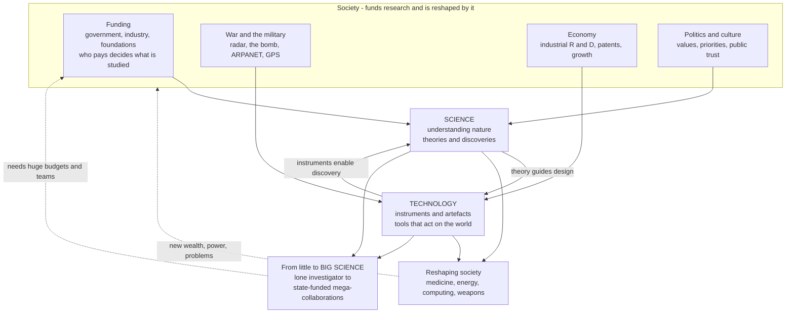

# 🔗 Science, Technology, and Society

> [!abstract] TL;DR
> We like to imagine a tidy one-way street — **pure science discovers how nature works, then engineers turn that knowledge into gadgets**. History says the arrow runs **both ways** and rarely runs clean. The **steam engine** worked for decades before **thermodynamics** explained *why*; the **telescope** and **microscope** were craftsmen's tools that *created* whole sciences; **breeders** improved crops and livestock for millennia before anyone knew a gene. Science and technology are a **tangled dance** — call it **"technoscience"** — and both are embedded in **society**: shaped by who **funds** them, by **war**, by the **economy**, by **politics and culture**, and in turn **reshaping** medicine, energy, communication, and weapons. In the twentieth century this dance industrialized into **"Big Science"** — huge teams, giant instruments, state and corporate budgets, author lists in the thousands. This note opens the **Science, Society & Frontiers** section: understanding these entanglements (the field of **Science and Technology Studies, STS**) is essential to wise **science policy**, **technology governance**, and to seeing science as a **human, social, and political** enterprise rather than a detached pursuit of pure truth.

---

## Intuition

**Analogy:** Picture two rock climbers roped together, each belaying the other up a cliff. Neither climbs "first"; each secures a hold that lets the *other* reach higher, and that new height opens a hold for the first. That is **science and technology**. The naive picture — you fully *understand* the mountain, then you *build* a path up it — almost never describes what happened. Instead, a better **instrument** (a tool, a piece of technology) lets you *see* something new (a discovery, science), and that discovery lets you build a *better instrument*. Galileo did not deduce the moons of Jupiter from theory; a **lens-grinder's spyglass** — a commercial gadget — put them in front of his eye. Then the science of optics improved the lens, which revealed more. Up the cliff they climb, roped together.

Now put that climbing pair inside a stadium full of spectators who are also **paying for the rope, betting on the outcome, and demanding the climbers reach ledges the crowd cares about** — a cure, a weapon, a faster chip, a national prestige win. The climbers are not autonomous; the **crowd (society)** chooses which cliff gets funded, and the ledges they reach change the crowd's life below. That stadium is the subject of this note: science and technology co-producing each other, both bankrolled and steered by **money, war, economy, and culture**, and both reshaping the society that pays for them.

---

## How It Works

### Challenging the "linear model"

The mid-twentieth-century orthodoxy was the **linear model of innovation**: **pure (basic) science → applied science → technology → products**. Curiosity-driven researchers uncover truths, engineers apply them, and society reaps the goods. It is clean, it flatters scientists, and it justifies public funding of basic research (see Vannevar Bush below). It is also, as historians of technology insist, **frequently backwards**.

Consider three canonical reversals where **technology led science**:

1. **The steam engine before thermodynamics.** Newcomen (1712) and Watt (1770s) built working engines that transformed the economy *decades before* Carnot (1824), Joule, and Kelvin worked out the laws of heat and energy that explain them. The engineering **posed the questions** that created the science of [[Thermodynamics_and_Energy]] — not the other way around.
2. **The instrument as engine of discovery.** The **telescope** (a Dutch spectacle-maker's toy) made modern astronomy; the **microscope** revealed cells and microbes and helped birth [[The_Birth_of_Modern_Biology]]; the **air pump**, the **battery**, the **X-ray tube**, the **cyclotron**, and the **electron microscope** each *opened* a field. Whole sciences exist because an instrument made a previously invisible layer of nature observable.
3. **Breeding before genetics.** Farmers selectively bred crops and animals for ~10,000 years, accumulating deep practical know-how about heredity, long before Mendel (1866) or the molecular account of the gene. Practice ran millennia ahead of theory.

The honest picture is not "technology leads" replacing "science leads," but **mutual, tangled causation**.

### Technoscience: co-production

The tangle is tight enough that scholars coined **"technoscience"** — science and technology are not two stages but one **co-produced** system. Modern experimental science is **impossible without instruments**, and cutting-edge instruments are **impossible without science**. A discovery (say, superconductivity) enables a technology (superconducting magnets) that enables an instrument (an MRI scanner, or the LHC's beam magnets) that enables new discoveries. Instruments are **engines of discovery**, and discoveries are **engines of instruments** — a positive **feedback loop** (see [[Feedback_Loops_and_Causality]]) whose compounding is exactly why both grow **exponentially** (modelled in the demo below).

### Science embedded in society

Science is **not autonomous**. It is steered by the society that pays for it and reshapes that society in return — a **two-way embedding**:

- **Funding.** Who pays decides what gets studied. **Government** funds basic research, defense, and health; **industry** funds applied, patentable, profitable work; **foundations** fund their founders' priorities. Funding priorities are **value choices** dressed as budgets.
- **War.** The deepest single driver of twentieth-century science and technology. **Radar**, wartime **code-breaking and the first electronic computers**, and the **atomic bomb** ([[The_Atomic_Age]]) came out of World War II; **ARPANET → the internet**, **GPS**, jet engines, and advanced materials came out of Cold War military funding ([[The_Computing_and_Information_Revolution]]).
- **Economy.** **Industrial R&D**, **patents**, and **commercialization** turned science into an engine of growth (the First and Second Industrial Revolutions; today's IT and biotech economies), a dynamic studied formally in [[Endogenous_Growth_Theory]].
- **Politics and culture.** What a society considers worth knowing, permissible to study, or dangerous — from climate to stem cells to AI — is a political and cultural verdict.

And the arrow runs back: science **reshapes** society through medicine, energy, communication, and weapons. Antibiotics, the pill, the transistor, and nuclear weapons each rearranged human life.

### The rise of Big Science

Across the twentieth century, science's **mode of production** transformed. **"Little Science"** — the lone investigator or small lab, a Faraday in a basement, a Mendel in a monastery garden — gave way to **"Big Science"** (Alvin Weinberg's 1961 term; Derek de Solla Price's 1963 book): **massive teams, huge budgets, giant instruments, and heavy state or corporate funding**. The **Manhattan Project** (~130,000 people, industrial scale, military management, secrecy) was the turning point — science **industrialized and bureaucratized** almost overnight. Its heirs are **particle accelerators** (CERN's LHC), **space telescopes** (Hubble, JWST), the **Human Genome Project**, and **giant collaborations** whose papers carry **author lists of thousands**. Science became a **large-scale, state-funded, strategically vital institution** (see [[Scientific_Institutions_and_Societies]] for the social machinery this scaled up).

### The post-war social contract and the basic–applied tension

In **1945**, **Vannevar Bush** — director of the U.S. wartime research effort — wrote **"Science, the Endless Frontier,"** proposing a new **social contract**: the government should generously fund **basic, curiosity-driven** research (the source, in the linear model, of all future application), while leaving scientists free to choose their problems. It founded the modern research-funding state (the NSF, and by analogy the NIH and national labs). It also enshrined the enduring **tension between basic and applied research** — between knowledge for its own sake and knowledge for a goal — a tension every funding agency, university, and R&D lab still negotiates.

### Technological determinism vs. the social shaping of technology

Does technology have an autonomous logic that **drives** social change (**technological determinism** — "the automobile *caused* suburbia")? Or do societies **choose and shape** which technologies they develop and how they use them (the **Social Construction of Technology, SCOT**)? The mature STS answer is **both-and**: technologies genuinely **enable and constrain**, but which get built, funded, adopted, and how their costs and benefits are **distributed** (who benefits, who is harmed) are **social and political** outcomes, not inevitabilities.

### The STS field and why it matters

**Science and Technology Studies (STS)** is the interdisciplinary field that studies all of this — drawing on the **history, sociology, philosophy, and politics** of science (see [[Sociology_of_Knowledge_and_Science]] for the sociological core). It informs **science policy**, **technology assessment**, and **public engagement**, offering a **critical lens** on technoscience. It matters because science, technology, and society are **inextricably entangled**: technology often *drives* science rather than merely applying it; both are *shaped* by funding, war, economy, and culture while *reshaping* human life; and the rise of Big Science made research a strategically vital institution. Grasping these relationships is essential for governing knowledge — nuclear, genetic, digital, AI — that **cannot be un-discovered**.

### Flow / Architecture



---

## Key Concepts

### Secondary — the essential story

- **Technoscience** — science and technology are not separate stages but one intertwined system that **co-produces** each other.
- **The linear model (and why it's wrong)** — the tidy "basic science → applied science → technology → products" pipeline; historically technology often **leads** science.
- **Instruments as engines of discovery** — telescope, microscope, air pump: tools that *created* whole sciences.
- **Big Science** — the twentieth-century shift from lone investigators to massive teams, giant instruments, and state or corporate budgets.
- **Science embedded in society** — research is shaped by funding, war, economy, and culture, and reshapes society in return.

### Undergraduate — the mechanisms

- **The science–technology feedback loop** — instruments enable discoveries that enable better instruments; a positive feedback producing **exponential** growth ([[Feedback_Loops_and_Causality]]).
- **Basic vs. applied research** — curiosity-driven vs. goal-directed; the perennial tension in every research budget.
- **The post-war social contract** — Vannevar Bush's *Science, the Endless Frontier* (1945): public funding of basic science as a national investment.
- **Science and war** — WWII (radar, computing, the bomb) and the Cold War (ARPANET, GPS, space, materials) made science a **strategic national resource**.
- **Science and the economy** — science-driven **innovation** as an engine of growth; patents, IP, university–industry links, national innovation systems.

### Graduate — nuance and critique

- **Technological determinism vs. SCOT** — does technology drive society autonomously, or do societies socially shape which technologies exist and how? The mature answer is **both-and**, with distributional politics front and centre.
- **The social shaping of research agendas** — funding as a **value choice**: military, commercial, and prestige incentives quietly select which questions count as important, and which populations' problems get studied.
- **Co-production (Jasanoff)** — the STS thesis that scientific knowledge and social order are produced **together**, each stabilizing the other, so that "facts" and "institutions" cannot be cleanly separated.
- **The Republic of Science vs. the steered enterprise** — Polanyi's ideal of self-governing, curiosity-led science in tension with the reality of mission-directed, state-strategic Big Science.
- **Dual-use and un-discoverable knowledge** — nuclear, genetic-engineering, and AI research pose governance problems precisely because the knowledge, once created, cannot be recalled ([[The_Atomic_Age]]).

---

## Python Demo

Two views of "science as a social enterprise." **Panel A** charts the empirical fingerprint of **Big Science**: the explosive growth in the **size of research collaborations**, from a lone experimenter to the **thousands-strong** author lists of modern particle physics (the 2015 ATLAS+CMS Higgs-mass paper had over **5,000 authors**). **Panel B** models the **co-evolution of science and technology** as a coupled feedback loop — better instruments (technology) enable discoveries (science), which enable better instruments — and shows that this **mutual positive feedback** produces **exponential** growth, whereas science *without* the technology feedback (a fixed toolset) crawls along **linearly**. The data points in Panel A are illustrative historical anchors, not exact figures.

```python
# Science as a social enterprise: (A) the rise of Big Science, measured by the
# size of research teams/collaborations; (B) the science<->technology feedback
# loop that makes both grow exponentially.  Requires numpy + matplotlib.
import numpy as np
import matplotlib.pyplot as plt

# ---- Panel A: growth of collaboration size over time (illustrative anchors) --
milestones = [
    ("Galileo\n1610",           1610,     1),
    ("Michelson-Morley\n1887",  1887,     2),
    ("Rutherford lab\n1911",    1911,     4),
    ("Fission (Hahn)\n1938",    1938,     2),
    ("Manhattan Proj.\n1945",   1945, 130000),   # people, not authors
    ("Watson-Crick\n1953",      1953,     2),
    ("Apollo program\n1969",    1969, 400000),   # people
    ("Human Genome\n2001",      2001,  2800),     # consortium authors
    ("Higgs / ATLAS\n2012",     2012,  3000),     # paper authors
    ("ATLAS+CMS\n2015",         2015,  5154),     # most-authored paper ever
]
years = np.array([m[1] for m in milestones])
sizes = np.array([m[2] for m in milestones], dtype=float)

# ---- Panel B: coupled science<->technology feedback (Euler integration) ------
#   dS/dt = a * T   (better instruments enable discoveries)
#   dT/dt = b * S   (discoveries enable better instruments)  -> exponential
# Contrast: science with a FIXED toolset (no feedback) grows only linearly.
a, b   = 0.06, 0.06
dt, N  = 0.1, 1200
S = np.empty(N); T = np.empty(N)
S[0], T[0] = 1.0, 1.0
for i in range(1, N):
    S[i] = S[i-1] + a * T[i-1] * dt
    T[i] = T[i-1] + b * S[i-1] * dt
t = np.arange(N) * dt
S_nofeedback = 1.0 + a * 1.0 * t          # T frozen at its initial value -> linear

fig, (axA, axB) = plt.subplots(1, 2, figsize=(13.5, 5.4))

axA.semilogy(years, sizes, "o-", color="#b2182b", lw=2, ms=7)
for label, yr, sz in milestones:
    axA.annotate(label, (yr, sz), fontsize=7,
                 xytext=(0, 8), textcoords="offset points", ha="center")
axA.set_xlabel("Year")
axA.set_ylabel("People in the collaboration (log scale)")
axA.set_title("The rise of BIG SCIENCE\nfrom the lone experimenter to the mega-collaboration")
axA.grid(alpha=0.3, which="both")

axB.plot(t, S, color="#1b7837", lw=2.5,
         label="Science WITH tech feedback (co-evolution)")
axB.plot(t, T, color="#2166ac", lw=2.0, ls="--",
         label="Technology (instruments)")
axB.plot(t, S_nofeedback, color="#666666", lw=2.0, ls=":",
         label="Science WITHOUT feedback (fixed toolset)")
axB.set_xlabel("Time")
axB.set_ylabel("Accumulated capability")
axB.set_title("Technoscience as a feedback loop\ninstruments enable discovery enables instruments")
axB.set_ylim(0, 60)
axB.legend(loc="upper left", fontsize=8)
axB.grid(alpha=0.3)

plt.tight_layout()
plt.savefig("science_technology_society.png", dpi=120)
print("Collaboration size grew from",
      f"{int(sizes.min())} to {int(sizes.max())} people across the milestones.")
print(f"With feedback, science reaches {S[-1]:.1f}; "
      f"without it, only {S_nofeedback[-1]:.1f}  "
      f"(a {S[-1]/S_nofeedback[-1]:.0f}x gap).")
print("Saved figure: science_technology_society.png")
```

Panel A climbs several **orders of magnitude** on a log axis: the number of humans it takes to *do* a frontier experiment exploded across the twentieth century — the quantitative signature of Big Science. Panel B shows *why* science and technology compound: with the mutual feedback intact, both race upward **exponentially**, while science shackled to a fixed toolset barely leaves the ground. The gap between the green and grey curves is the whole argument of "technoscience" — most scientific progress is **instrument-limited**, and instruments are science's own children.

---

## Real-World Applications

- **Science policy and R&D budgets.** Every national research budget — the NSF, NIH, DARPA, Horizon Europe, CERN's member-state contributions — is an application of the basic-vs-applied tension and the Vannevar Bush social contract, deciding which cliffs get roped.
- **Technology assessment and governance.** Regulating AI, gene editing (CRISPR), geoengineering, and biosecurity draws directly on STS's dual-use and social-shaping frameworks — governing knowledge that cannot be un-discovered.
- **Big-Science megaprojects.** CERN, ITER, the JWST, LIGO, and the Human Genome Project are run on the Manhattan-Project template of large teams, mission direction, and state or consortium funding.
- **National innovation systems.** Understanding why Silicon Valley, Shenzhen, or wartime Britain became innovation engines uses the science–economy–military entanglement this note describes (military ARPA funding seeding the internet is the textbook case).
- **Public engagement and trust.** Vaccine hesitancy, climate communication, and "citizen science" are STS problems: science's authority is socially negotiated, not automatic ([[Sociology_of_Knowledge_and_Science]]).
- **Industrial R&D and IP strategy.** Corporate labs, patents, and university–industry technology transfer operationalize the tension between open science and commercial secrecy.

---

## Common Pitfalls

- **Believing the linear model.** Assuming pure science always precedes and *causes* technology ignores the steam engine, the telescope, and millennia of breeding. Technology often **leads**; the causation is two-way.
- **Treating science as autonomous and value-free.** "Science just follows the truth wherever it leads" hides the fact that **funding, war, and politics choose which truths get pursued**. What is *not* studied is as revealing as what is.
- **Naive technological determinism.** Saying "technology X inevitably caused social change Y" erases the **choices** — who built it, who funded it, who it helped and harmed. Societies shape technologies as much as technologies shape societies.
- **Romanticizing "Little Science."** Nostalgia for the lone genius misreads how frontier knowledge is now produced: by large, instrument-heavy, expensive collaborations. The lone-genius myth also erases the teams and technicians behind famous names.
- **Conflating scientific merit with funding priority.** A well-funded field is not thereby more *true* or more *important* — funding reflects strategic, commercial, and political value, which is a different axis from epistemic quality.
- **Ignoring distribution.** Asking "is this technology good?" without asking "**for whom**, and at whose cost?" misses the core STS insight that benefits and harms are unequally distributed ([[Ecology_and_Environmental_Science]] on environmental costs).

---

## Related Concepts

- [[History_of_Science_Overview]] — the parent survey; this note opens its "science and society" strand.
- [[Scientific_Institutions_and_Societies]] — the social machinery (societies, journals, peer review) that Big Science scaled into national budgets.
- [[The_Atomic_Age]] — the Manhattan Project as the birth of Big Science and the archetype of science entangled with war and the state.
- [[The_Computing_and_Information_Revolution]] — military funding (ARPANET, GPS) driving computing; the clearest case of war and economy shaping technoscience.
- [[Thermodynamics_and_Energy]] — the steam engine leading the science: technology posing the questions that created a field.
- [[The_Birth_of_Modern_Biology]] — the microscope as an instrument that opened a science, exemplifying instruments as engines of discovery.
- [[Ecology_and_Environmental_Science]] — where technology's unequal, often unintended societal and environmental costs come due.
- [[The_Scientific_Revolution_Overview]] — the origin of the modern science–instrument partnership and the empirical program.
- [[Philosophy_of_Science_Overview]] — the epistemology companion; STS is the sociological-historical counterpart to the philosophy of science.
- [[Sociology_of_Knowledge_and_Science]] — the sociological core of STS: how communities construct, validate, and are shaped by knowledge.
- [[Feedback_Loops_and_Causality]] — the systems-thinking formalism behind the science↔technology positive feedback loop modelled in the demo.
- [[Endogenous_Growth_Theory]] — the economics of science-driven innovation as an engine of growth (ideas, R&D, and technology).
- [[Work_Organizations_and_Bureaucracy]] — the bureaucratization and professionalization of research that Big Science produced.
- [[The_First_Industrial_Revolution]] — technology (steam, textiles) transforming society before the underlying science was understood.
- [[The_Second_Industrial_Revolution]] — the science-based industries (chemicals, electricity) where industrial R&D was born.
- [[World_War_II]] — the war that turned science into a strategic national resource (radar, computing, the bomb).
- [[Origins_of_the_Cold_War]] — the arms and space races that permanently wedded research to the state.
- [[The_Information_Age]] — the digital economy and society that science-driven technology produced.

> Forthcoming *History of Science* siblings referenced in prose (not yet written): **The Ethics and Politics of Science** (the moral and political governance of research), **Science and Religion** (their historical relationship), and **The Reach and Future of Science** (limits, frontiers, and prospects). A dedicated **Sociology of Scientific Knowledge** deep-dive is planned; the [[Sociology_of_Knowledge_and_Science]] note covers that ground for now.

---

## Review Questions

**Secondary**
1. The "linear model" says pure science comes first and technology is just its application. Give **two** historical examples from this note where **technology came before the science that explained it**, and state in one sentence what "technoscience" means.

**Undergraduate**
2. Using the science↔technology feedback loop from the Python demo, explain why most scientific progress is described as **"instrument-limited,"** and give a concrete modern example of a discovery that was only possible because a new instrument existed. Then explain how **funding** and **war** decided which instruments got built in the twentieth century.

**Graduate**
3. The Manhattan Project marked the birth of "Big Science" and the marriage of research to the state. Drawing on the **basic-vs-applied tension** (Vannevar Bush) and the **technological-determinism vs. social-shaping** debate, argue whether the direction of modern science is best understood as scientists **freely following the truth** or as society **steering research** toward strategic, commercial, and military ends. What does your answer imply for how we should govern dual-use fields such as AI or gene editing?

---

## Sources

- Bush, Vannevar. *Science, the Endless Frontier* (1945). U.S. Government Printing Office. — The founding charter of the post-war basic-research social contract.
- de Solla Price, Derek J. *Little Science, Big Science* (1963). Columbia University Press. — The classic analysis of the transition to Big Science and the exponential growth of research.
- Sismondo, Sergio. *An Introduction to Science and Technology Studies*, 2nd ed. (2010). Wiley-Blackwell. — A standard survey of the STS field, technoscience, and SCOT.
- MacKenzie, Donald & Wajcman, Judy (eds.). *The Social Shaping of Technology*, 2nd ed. (1999). Open University Press. — The core text on social shaping vs. technological determinism.
- Jasanoff, Sheila (ed.). *States of Knowledge: The Co-Production of Science and Social Order* (2004). Routledge. — The co-production framework linking scientific knowledge and social order.
- [Science and Technology Studies (Stanford Encyclopedia of Philosophy)](https://plato.stanford.edu/entries/science-technology-society/) — Overview of the philosophical and social study of science and technology.

---

#history-of-science #science-technology-society #big-science #technoscience #innovation
