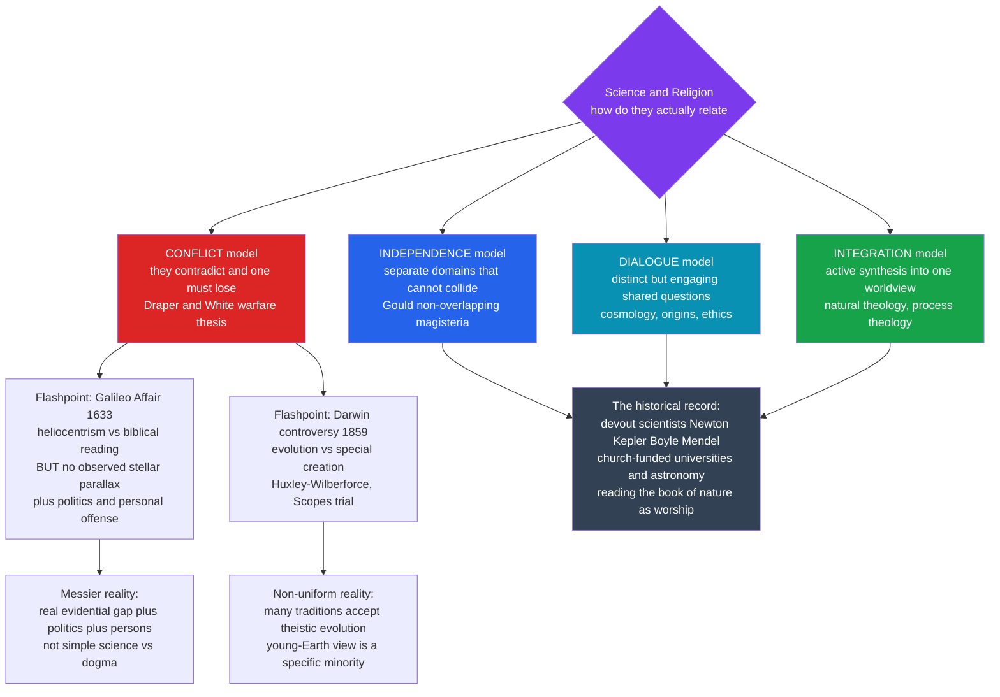

# ⛪ Science and Religion

> [!abstract] TL;DR
> The popular story is a simple **war** — brave science versus backward religion, **Galileo** versus the Church, **Darwin** versus Genesis. The real history is far messier and far more interesting. The 19th-century **"conflict thesis"** (Draper and White's *warfare* model) is now **rejected by historians** as an oversimplification that is often flatly false. Many foundational scientists were **devout** — Newton wrote more on theology than on physics, Kepler saw astronomy as reading God's mind, and Lemaître, who proposed the Big Bang, was a Catholic priest. The medieval Church **funded and preserved learning**, built the first universities, and paid for astronomy to fix the calendar. Science and religion have **clashed** (over deep time, evolution, and cosmic origins), **coexisted** (for most of history, in most people), and even **collaborated** (religious motivation drove much early science). Modern scholarship replaces the single "war" with a **typology** — *conflict*, *independence*, *dialogue*, *integration* (Ian Barbour) — and treats the genuine flashpoints as **specific empirical disputes**, not a global battle. Getting this relationship right is essential to navigating today's culture-war fights over evolution, cosmology, and the very authority of science.

---

## Intuition

**Analogy:** Imagine future historians told a single story about "**doctors versus lawyers**" as an eternal war between two tribes locked in mortal combat. It would sound dramatic — but it would be nonsense. Doctors and lawyers mostly work in totally different rooms, on totally different problems. Sometimes they cooperate (a doctor testifies in a malpractice suit). Occasionally they clash head-on (over who decides when to withdraw life support). Plenty of people are *both* — a physician who went to law school. To flatten all of that into "the doctor-lawyer war" would erase the real, textured relationship in favor of a cartoon. That is exactly what the **"conflict thesis"** does to science and religion.

The cartoon is seductive because it has two vivid martyrs — **Galileo** on his knees before the Inquisition, **Darwin** dynamiting Genesis — and villains are more memorable than committees. But when you open the archives, the neat morality tale dissolves. The people who *invented* modern science were, overwhelmingly, believers who saw no war at all; the institution supposedly at war with science *built the universities* and *paid the astronomers*; and even the two famous "battles" turn out to involve politics, personality, biblical interpretation, and — crucially — **legitimate scientific objections** on the "religious" side. The task of this note is to replace the cartoon with the real, more complicated picture: not one war, but a long, tangled relationship of clash, coexistence, and collaboration.

---

## How It Works

### The conflict thesis and why historians reject it

The idea that science and religion are *natural, permanent enemies* is not ancient — it is a **Victorian invention**. Two books manufactured it:

- **John William Draper**, *History of the Conflict Between Religion and Science* (1874) — written amid Protestant anxiety about Catholicism and the recent shock of Darwin.
- **Andrew Dickson White**, *A History of the Warfare of Science with Theology in Christendom* (1896) — by the first president of Cornell, a deliberately *secular* university, with an axe to grind against clerical interference.

Both told history as a series of heroic scientists crushed by dogma. The framing was so vivid it became **common sense** — the default assumption of the modern educated public. But historians of science spent the 20th century dismantling it, and today the **"conflict thesis" is a minority position among specialists**, retained mainly in popular polemic. The reasons:

1. **Most of the "warfare" stories are myths or distortions.** The claim that medieval people believed in a **flat Earth** (until Columbus proved otherwise) was largely invented by Draper and White; educated Europeans had known the Earth was a sphere since antiquity. The idea that the Church banned dissection, or fought zero, or persecuted every astronomer, does not survive contact with the archives.
2. **The relationship was mostly one of *engagement*, not war.** For most of Western history the same people, and often the same institutions, did both.
3. **It smuggles in a modern assumption** — that "science" and "religion" were always two clearly separated, competing enterprises. Before the 19th century they were not even cleanly *distinguished*; "natural philosophy" was pursued largely *by* clergy, *for* religious ends.

### The complicated reality the cartoon misses

- **The founders of modern science were devout.** **Kepler** called astronomy "thinking God's thoughts after him." **Newton** wrote more words on biblical prophecy and theology than on physics. **Robert Boyle** endowed lectures to defend Christianity and saw the mechanical universe as evidence of design. **Faraday** was a devout Sandemanian. **Gregor Mendel**, father of genetics, was an **Augustinian monk**. **Georges Lemaître**, who first proposed the expanding universe and the "primeval atom," was a **Catholic priest**.
- **The Church funded and preserved learning.** Medieval **monasteries** copied and preserved ancient texts; the **cathedral schools** became the first **universities** (Bologna, Paris, Oxford); and the Church was for centuries the largest patron of astronomy — precisely because it needed accurate astronomy to compute the date of **Easter** and reform the **calendar** (the Gregorian reform of 1582 was a Church project). Cathedrals were literally used as solar observatories.
- **Religion sometimes *motivated* science.** The **"two books" doctrine** held that God wrote two texts — Scripture and the "**book of nature**" — and that studying nature was a form of worship, a way to know the Creator through the creation. This theology *drove* natural inquiry rather than blocking it.
- **Coexistence was the norm.** For most people in most eras, faith and an interest in how the world works simply cohabited without crisis.

None of this means there were *never* conflicts. It means the conflicts were **specific and local**, not a single cosmic war — and to understand them you have to look at the actual cases.

### Flashpoint 1: the Galileo Affair (the case everyone gets wrong)

The 1633 condemnation of **Galileo Galilei** for defending **heliocentrism** is the conflict thesis's crown jewel. The cartoon: pure reason versus pure dogma. The reality is a tangle:

- **There was a genuine scientific objection.** If the Earth really orbits the Sun, nearby stars should show **stellar parallax** — an apparent annual shift in their positions. None could be detected with 17th-century instruments (it was far too small; the first measurement came only in **1838**, by Bessel). To Galileo's contemporaries, the *absence* of observed parallax was a **legitimate empirical argument** against a moving Earth — not mere stubbornness. (The alternative, that the stars were unimaginably far away, seemed absurd.)
- **Galileo could not actually *prove* heliocentrism.** His best physical argument — that the tides are caused by the Earth's motion — was **wrong**. He rejected Kepler's correct elliptical orbits and insisted on perfect circles.
- **Politics and personality mattered enormously.** Galileo was tactless and combative. In his *Dialogue Concerning the Two Chief World Systems* (1632) he put the Pope's own arguments into the mouth of a dim character named **Simplicio** ("simpleton"). Pope **Urban VIII**, formerly a supporter, felt personally mocked — during the political pressures of the **Counter-Reformation** and Thirty Years' War, when the Church could not afford to look soft on biblical authority.
- **It was partly a fight over who interprets Scripture.** The Reformation had made biblical interpretation a live battleground; Galileo, a layman, presuming to tell theologians how to read Joshua ("Sun, stand still") struck at raw institutional nerves.

So the Galileo Affair was a **real clash over authority and evidence** — but *not* the simple "science versus dogma" fable. It was science-in-progress (with a real evidential gap) colliding with a Church made rigid by politics and a scientist who made enemies easily.

### Flashpoint 2: the Darwin controversy (the deepest tension)

If Galileo is overrated as a conflict, **evolution** is the genuine article — the sharpest, most enduring science-religion tension. Darwin's *Origin of Species* (1859) challenged not one Bible passage but a whole worldview: **special creation**, the **fixity of species**, human **uniqueness**, and the **argument from design** (Paley's watchmaker). If a blind algorithm can build an eye, the best scientific argument for God's existence collapses.

- The **Huxley–Wilberforce debate** (Oxford, 1860) became legend — "Darwin's bulldog" T. H. Huxley versus Bishop Samuel Wilberforce — though the confrontation was later mythologized into a clean science victory it was not at the time.
- The **Scopes "Monkey Trial"** (Tennessee, 1925) dramatized the American fight over teaching evolution in schools — a fight that *continues* through **creationism** and **intelligent design** court battles into the present.
- **But the conflict is not uniform.** Many religious traditions accommodated evolution as **theistic evolution** — the view that God works *through* natural processes. The Catholic Church, mainline Protestant denominations, and much of Judaism accept evolutionary biology. Young-Earth creationism is a *particular* (largely modern, largely American-Protestant) position, not the universal religious response.

### The four models of the relationship

Physicist-theologian **Ian Barbour** proposed a durable **typology** of the ways science and religion can relate — a far better tool than the single "war":

| Model | Claim | Example |
|---|---|---|
| **Conflict** | They make competing claims; one must be wrong. | Young-Earth creationism vs. deep time; New Atheism |
| **Independence** | Separate domains that cannot collide. | Gould's **NOMA** |
| **Dialogue** | Distinct but engaging over shared questions. | Cosmology and origins; ethics of technology |
| **Integration** | Active synthesis into one worldview. | Natural theology; process theology |

The **Independence** model's most famous form is Stephen Jay **Gould's "Non-Overlapping Magisteria" (NOMA)**: science holds authority over the **empirical realm** — what the universe is made of and *how* it works — while religion governs **meaning, purpose, and value** — questions of *why* and *how we ought to live*. On this view the two "teach different things" and conflict only arises when one trespasses on the other's territory.



### Where genuine tensions really live

Stripped of the mythical global war, the *real* friction concentrates on a handful of **specific empirical or metaphysical claims**:

- **The age of the Earth and universe** — the starkest empirical clash. Radiometric dating puts the Earth at **~4.54 billion years** and the cosmos at **~13.8 billion**; young-Earth creationism, reading Genesis literally via Archbishop **Ussher's** 1650 chronology, claims **~6,000 years**. These are not reconcilable by interpretation; one is off by a factor of ~750,000. (See the Python demo.)
- **Evolution vs. special creation** — human descent from earlier species vs. a unique, designed humanity.
- **Cosmology and origins** — ironically, the **Big Bang** (proposed by a priest) was initially resisted by some *scientists* as too "religious" (a moment of creation), while some believers embraced it; the fine-tuning of physical constants fuels ongoing dialogue.
- **Miracles vs. natural law** — whether the causal closure of nature admits divine intervention.
- **Neuroscience vs. the soul** — if the mind is what the brain does, what becomes of an immaterial soul?
- **Bioethics** — genetic engineering, stem cells, and end-of-life decisions, where empirical capability meets value questions squarely.

### The demarcation angle: is creationism science?

Whether **creationism** and **intelligent design (ID)** count as *science* is a textbook case of the **demarcation problem** (what separates science from non-science). U.S. courts have repeatedly ruled they are **not science**:

- **McLean v. Arkansas (1982)** and **Edwards v. Aguillard (1987)** struck down "creation science."
- **Kitzmiller v. Dover (2005)** ruled that intelligent design is not science but religion — it is **not falsifiable**, generates **no empirical research programme**, and relies on a "God-of-the-gaps" argument (invoking a designer wherever current explanation is incomplete).

This puts the science-religion question on the same axis as **Popper's falsifiability** criterion: ID fails not because of its conclusion but because of its **method** — it makes no risky, testable predictions. That is a philosophy-of-science verdict, not merely a theological one.

### Science, religion, and culture today

The contemporary landscape is live and shifting. The **"New Atheism"** (Dawkins, Hitchens, Harris, Dennett, c. 2004–) deliberately **revived the conflict framing**, arguing that science and religion are fundamentally incompatible. Acceptance of specific scientific findings — **evolution, the age of the universe, climate change, vaccines** — varies sharply by religious and political community, showing that the friction is now often *cultural and identity-based* rather than strictly doctrinal. And for some, science functions as a rival **source of meaning and worldview**, not merely a method — which is where it most directly competes with religion's traditional role.

---

## Key Concepts

### Secondary Level
- **Conflict thesis (warfare thesis)** — the popular idea that science and religion are permanent enemies; invented by Draper and White in the 1800s and now rejected by historians.
- **The Galileo Affair** — Galileo's 1633 condemnation for teaching that the Earth orbits the Sun; usually oversimplified into "science vs. dogma."
- **Evolution vs. creation** — the deepest tension: Darwin's natural selection challenging a literal reading of Genesis and the idea of designed humanity.
- **Deep time** — the scientific finding that the Earth is billions of years old, clashing head-on with a literal ~6,000-year biblical chronology.
- **Devout scientists** — many founders of science (Newton, Kepler, Mendel, Lemaître) were religious believers who saw no war.

### Undergraduate Level
- **Barbour's four models** — *conflict*, *independence*, *dialogue*, *integration*: the standard typology of how the two can relate.
- **Non-Overlapping Magisteria (NOMA)** — Gould's independence model: science covers *facts and how*, religion covers *meaning, values, and why*.
- **The "two books" doctrine** — the theological view that nature is a second scripture, so studying it is a form of worship; a *motivation* for early science.
- **Stellar parallax** — the annual apparent shift of nearby stars that heliocentrism predicts; its *non-detection* was a legitimate scientific objection to Galileo, not mere dogma.
- **Theistic evolution** — the position (held by the Catholic Church and many others) that God works *through* evolutionary processes; evidence the conflict is not uniform.
- **Ussher chronology** — Archbishop James Ussher's 1650 calculation dating creation to 4004 BCE, the basis of young-Earth claims.

### Graduate Level
- **The demarcation of creationism / intelligent design** — ID as a test case for Popperian falsifiability; U.S. court rulings (*McLean*, *Edwards*, *Kitzmiller*) that it is religion, not science, because it makes no testable predictions. See the demarcation-problem note planned for this vault.
- **The complexity thesis** — the historians' replacement for the conflict thesis (John Hedley Brooke): the relationship is genuinely *complex*, resisting any single narrative of either war or harmony.
- **Secularization and the "conflict myth" as ideology** — how Draper and White's warfare narrative served the 19th-century professionalization and secularization of science (staking out institutional autonomy from the clergy).
- **God-of-the-gaps and its instability** — invoking divine action to fill explanatory gaps that science then closes; why this strategy structurally retreats and why theologians themselves often reject it.
- **NOMA's critics** — the charge (from both Dawkins and some theologians) that religion *does* make empirical claims (miracles, a young Earth, efficacy of prayer), so the magisteria are not cleanly separable and Independence is a diplomatic fiction.
- **The fine-tuning and multiverse debate** — cosmological fine-tuning as the current frontier of the *dialogue* and *integration* models, and the multiverse as a naturalistic response.

---

## Python Demo

The single starkest science-religion flashpoint is empirical, not rhetorical: **how old is the Earth?** Rather than argue, we can put the two answers on the same axis and let the scale speak. This demo (1) places the biblical **Ussher chronology (~6,000 years)** and the **radiometric age (~4.54 billion years)** on a **logarithmic timeline** alongside other milestones, and (2) shows *why* radiometric dating is trusted, by plotting the **radioactive decay** of **uranium-238** (half-life 4.47 billion years) — the physical clock that reads the Earth's age. The punchline: at 4.54 billion years, about **half** of Earth's primordial U-238 has decayed to lead; at 6,000 years, the fraction decayed is essentially **zero** — a young Earth would leave *no* measurable radiogenic lead at all.

```python
# THE DEEP-TIME FLASHPOINT, QUANTIFIED.
# We contrast the biblical ~6,000-year chronology (Ussher, 4004 BCE) with the
# radiometric age of the Earth (~4.54 billion years) on a LOG timeline, then
# show the physical basis of radiometric dating: uranium-238 decay.
# matplotlib required; numpy optional (used here for the decay curve).
import numpy as np
import matplotlib.pyplot as plt

# ---- Key ages, in YEARS before present ----
USSHER_YEARS   = 6030          # 4004 BCE creation date -> ~6030 yr ago (from 2026)
EARTH_AGE      = 4.54e9        # radiometric age of the Earth
UNIVERSE_AGE   = 13.8e9        # age of the observable universe
milestones = {
    "Ussher's creation date\n(~6,000 yr, literal Genesis)": USSHER_YEARS,
    "End of last Ice Age":            11700,
    "First cave paintings":           40000,
    "Homo sapiens appears":           300000,
    "Cambrian explosion":             5.4e8,
    "Oldest known rocks":             4.0e9,
    "Age of the Earth\n(radiometric)": EARTH_AGE,
    "Age of the universe":            UNIVERSE_AGE,
}

# The scale of the discrepancy, stated plainly:
ratio = EARTH_AGE / USSHER_YEARS
print(f"Radiometric age of Earth : {EARTH_AGE:.3e} years")
print(f"Ussher biblical estimate : {USSHER_YEARS:.3e} years")
print(f"Discrepancy factor       : {ratio:,.0f}x  (Earth is ~{ratio/1000:.0f} thousand times older)")

# ---- Radioactive decay: the physical clock (U-238 -> Pb-206) ----
HALF_LIFE = 4.47e9            # years, uranium-238
t = np.linspace(0, 14e9, 500)
frac_remaining = 0.5 ** (t / HALF_LIFE)      # fraction of parent isotope left

frac_at_earth  = 0.5 ** (EARTH_AGE / HALF_LIFE)
frac_at_ussher = 0.5 ** (USSHER_YEARS / HALF_LIFE)
print(f"\nU-238 remaining after {EARTH_AGE:.2e} yr : {frac_at_earth:.3f}  (~half decayed to lead)")
print(f"U-238 remaining after {USSHER_YEARS:.2e} yr : {frac_at_ussher:.9f}  (indistinguishable from 1)")
print(f"Fraction DECAYED on a young Earth        : {1 - frac_at_ussher:.2e}  (essentially none)")

# ---------------------------------------------------------------
# Visualize: (A) log timeline, (B) the decay clock
# ---------------------------------------------------------------
fig, (ax1, ax2) = plt.subplots(1, 2, figsize=(15, 6))

# (A) Log timeline of Earth/cosmic history with both claims marked.
ys = np.linspace(0.9, 0.1, len(milestones))
for (label, age), y in zip(milestones.items(), ys):
    is_biblical = "Ussher" in label
    color = "#dc2626" if is_biblical else "#2563eb"
    ax1.scatter(age, y, s=90, color=color, zorder=5)
    ax1.annotate(label, xy=(age, y), xytext=(age * 1.6, y),
                 va="center", fontsize=8.5, color=color)
ax1.axvspan(1, USSHER_YEARS, color="#fca5a5", alpha=0.35)
ax1.text(60, 0.02, "entire span allowed\nby a literal ~6,000-yr reading",
         fontsize=8.5, color="#b91c1c")
ax1.set_xscale("log")
ax1.set_xlim(10, 1e11)
ax1.set_ylim(0, 1.0)
ax1.set_yticks([])
ax1.set_xlabel("years before present  (log scale)")
ax1.set_title("Deep time vs. a young Earth\n(the red band is ALL of literal-Genesis history)")

# (B) The decay clock that measures it.
ax2.plot(t / 1e9, frac_remaining, color="#7c3aed", lw=2.2,
         label="U-238 remaining (half-life 4.47 Gyr)")
ax2.axvline(EARTH_AGE / 1e9, color="#2563eb", ls="--", lw=1.6,
            label="Earth age 4.54 Gyr")
ax2.scatter([EARTH_AGE / 1e9], [frac_at_earth], color="#2563eb", s=70, zorder=5)
ax2.annotate("~half decayed to lead:\nthe clock reads 4.5 Gyr",
             xy=(EARTH_AGE / 1e9, frac_at_earth), xytext=(6.2, 0.72),
             fontsize=9, color="#1d4ed8",
             arrowprops=dict(arrowstyle="->", color="#1d4ed8"))
ax2.axvline(USSHER_YEARS / 1e9, color="#dc2626", ls="--", lw=1.6)
ax2.annotate("6,000 yr: ~0% decayed\n(no measurable lead)",
             xy=(0, 1.0), xytext=(1.0, 0.30), fontsize=9, color="#b91c1c",
             arrowprops=dict(arrowstyle="->", color="#b91c1c"))
ax2.set_xlabel("time elapsed (billions of years)")
ax2.set_ylabel("fraction of original U-238 remaining")
ax2.set_title("Why radiometric dating is trusted:\nradioactive decay is a physical clock")
ax2.set_ylim(0, 1.05)
ax2.legend(loc="upper right", fontsize=8.5)
ax2.grid(alpha=0.3)

plt.tight_layout()
plt.savefig("science_and_religion_deep_time.png", dpi=130)
print("\nSaved science_and_religion_deep_time.png")
plt.show()
```

Running it prints a discrepancy factor of roughly **750,000x** between the radiometric and biblical ages, and shows that a 6,000-year-old Earth would have decayed only about **0.0000009** of its uranium — nine-millionths of one percent, effectively nothing. Panel A dramatizes the scale: the entire span of literal-Genesis history is a thin red sliver invisibly close to the present on a logarithmic axis that has room for 4.5 billion years of rocks and 13.8 billion years of cosmos. Panel B shows *why* the long chronology is not a mere assertion: the U-238 decay curve is a **physical clock** running in every uranium-bearing crystal, and the measured parent-to-daughter (lead) ratio pins the Earth's age independently of any text. This is the one flashpoint where interpretation cannot bridge the gap — the two claims make **incompatible, testable** statements about the same rocks, and the rocks have been consulted.

---

## Real-World Applications

- **Science education and curriculum law.** Whether public schools may teach creationism or "intelligent design" alongside evolution has been litigated repeatedly in the U.S. (*Epperson*, *McLean*, *Edwards*, *Kitzmiller*); the rulings turn directly on the demarcation of science from religion.
- **Public trust and health policy.** Acceptance or rejection of vaccines, climate science, and evolution correlates with religious-community identity in ways that shape real-world outcomes; communicators who assume a "war" often *deepen* resistance, whereas engaging religious values can build trust.
- **Bioethics governance.** Debates over stem-cell research, genetic engineering, and end-of-life care are where the empirical *can* and the value-laden *ought* meet; religious ethical traditions are major voices in the committees and legislatures that regulate biotechnology.
- **Interpreting the history of science accurately.** Museums, textbooks, and popular science routinely repeat conflict-thesis myths (flat-Earth medievals, a wholly anti-science Church); historians of science work to correct a story that most educated people still believe.
- **Cosmology and the meaning question.** Big Bang cosmology, fine-tuning, and the multiverse are the live frontier where scientists and theologians actually *dialogue* — over what, if anything, an origin of the universe implies.

---

## Common Pitfalls

- **Believing the conflict thesis is "just history."** The warfare model *feels* like obvious fact but is a 19th-century polemical construction (Draper, White) that specialist historians reject. Treating it as settled truth is itself the most common error.
- **Reading the Galileo Affair as pure science vs. dogma.** It involved a *real* scientific gap (undetectable stellar parallax), Galileo's wrong tidal argument, Counter-Reformation politics, and personal offense to the Pope. The morality tale erases all of that.
- **Assuming all religion rejects evolution or deep time.** Young-Earth creationism is a specific, largely modern, largely American-Protestant position. The Catholic Church, mainline Protestants, and many others accept evolution as *theistic evolution*.
- **Thinking devout scientists are a paradox.** Newton, Kepler, Boyle, Faraday, Mendel, and Lemaître were not exceptions sneaking science past their faith — for many, religious conviction *motivated* the inquiry ("reading the book of nature").
- **Over-applying NOMA.** The clean "facts vs. values" split breaks down whenever religion makes *empirical* claims (a 6,000-year Earth, historical miracles) — then the magisteria really do overlap, and Independence cannot save the peace.
- **God-of-the-gaps reasoning.** Locating God in the current gaps of scientific explanation ("science can't explain X, so God") is a losing strategy that retreats every time a gap closes — and one many theologians reject on their own terms.
- **Confusing "not science" with "false" (or "true").** The courts' verdict that intelligent design is *not science* is a claim about method and falsifiability, not a theological refutation; conversely, being unfalsifiable does not make a claim true.

---

## Related Concepts

- [[The_Copernican_Revolution]] — the heliocentric shift at the heart of the Galileo Affair; this note treats the *religious* dimension of that revolution.
- [[The_Darwinian_Revolution]] — the evolution controversy is the deepest science-religion tension; here it is placed within the models-of-relationship framework.
- [[Philosophy_of_Science_Overview]] — supplies the demarcation and falsifiability tools used to adjudicate whether creationism and ID are science.
- [[Medieval_and_Renaissance_Science]] — the era of church-funded universities, monastic preservation of learning, and the "two books" doctrine that the conflict thesis erases.
- [[Newtonian_Mechanics_and_the_Principia]] — Newton the devout theologian who saw the mechanical cosmos as evidence of design; the flagship "devout scientist" case.
- [[The_Expanding_Universe]] — the Big Bang, proposed by the priest Georges Lemaître, and the cosmological origins where dialogue is liveliest.
- [[The_Neuroscience_and_Mind_Sciences]] — the neuroscience-vs-soul frontier: if the mind is what the brain does, what becomes of an immaterial soul?
- [[Radiometric_Dating]] — the physical clock behind the deep-time argument quantified in this note's Python demo.
- [[Geologic_Time_Scale]] — the empirical chronology of Earth history that a literal 6,000-year reading cannot accommodate.
- [[History_of_Science_Overview]] — the vault's master overview; this note is its extended treatment of the science-religion relationship.
- [[Faith_and_Reason]] — the medieval philosophical debate (Aquinas and others) on reconciling revelation with rational inquiry; the intellectual backdrop to the whole relationship.
- [[Aquinas_and_Scholasticism]] — the Scholastic synthesis of Aristotelian natural philosophy with Christian theology; the model of *integration* centuries before Barbour named it.
- [[Popper_and_Falsification]] — the falsifiability criterion that the *Kitzmiller* court invoked to rule intelligent design out of science.
- [[Kuhn_and_Scientific_Revolutions]] — paradigm change and the theory-ladenness of observation, relevant to how the parallax objection was weighed in Galileo's day.
- [[Scientific_Realism]] — the question of whether science describes reality bears on whether it can *rival* religion as a worldview.
- [[The_Scientific_Revolution]] — the History-vault companion on the era; the cultural context in which "science" and "religion" first began to be distinguished.
- [[The_Protestant_Reformation]] — the History-vault note on the Reformation, whose fights over who may interpret Scripture inflamed the Galileo case.
- [[The_Enlightenment]] — the History-vault note on the era that began framing reason and faith as rivals, seeding the later conflict thesis.
- [[Creation_and_Flood_Myths]] — the Mythology-vault survey of creation narratives across cultures, the traditions a literal Genesis chronology belongs to.

> Sibling notes planned for this *Science, Society & Frontiers* section — *Pseudoscience and the Demarcation Problem* and *The Ethics and Politics of Science* — are referenced above in prose and will connect here once written.

---

## Review Questions

**Secondary**
1. The popular story says science and religion have always been at war, with Galileo and Darwin as the great martyrs. Give two specific facts from the real history that complicate this "warfare" picture. Why do you think the war story is so much more famous than the messier truth?

**Undergraduate**
2. The absence of observed **stellar parallax** was used as an argument *against* Galileo's heliocentrism. Explain why this was a *legitimate scientific objection* in the 17th century and not mere dogma, and what it reveals about treating the Galileo Affair as a simple "science vs. religion" morality tale. Then, using Barbour's four models, classify how the *evolution* controversy differs from the *deep-time* (age of the Earth) controversy.

**Graduate**
3. Gould's **NOMA** proposes that science and religion occupy non-overlapping magisteria — facts versus values. Using the deep-time flashpoint quantified in the Python demo (a literal ~6,000-year Earth vs. a ~4.54-billion-year radiometric age), argue whether NOMA can actually hold, or whether religion's *empirical* claims force the magisteria to overlap. Then connect your answer to the **demarcation** verdict in *Kitzmiller v. Dover*: is "creationism is not science" a philosophical claim, a theological one, or both?

---

## Sources

- Brooke, J. H. (1991). *Science and Religion: Some Historical Perspectives*. Cambridge University Press. — The standard scholarly statement of the "complexity thesis" that replaced the conflict model.
- Numbers, R. L. (Ed.). (2009). *Galileo Goes to Jail and Other Myths about Science and Religion*. Harvard University Press. — Historians dismantling the popular myths one by one.
- Gould, S. J. (1997). "Nonoverlapping Magisteria." *Natural History*, 106, 16–22. — The classic statement of the Independence model.
- Barbour, I. G. (2000). *When Science Meets Religion: Enemies, Strangers, or Partners?* HarperOne. — The four-model typology (conflict, independence, dialogue, integration).
- Draper, J. W. (1874). *History of the Conflict Between Religion and Science*; White, A. D. (1896). *A History of the Warfare of Science with Theology in Christendom*. — The 19th-century origins of the conflict thesis (read critically).
- [Stanford Encyclopedia of Philosophy — Religion and Science](https://plato.stanford.edu/entries/religion-science/)

---

#history-of-science #science-and-religion #galileo-affair #conflict-thesis #evolution-debate
